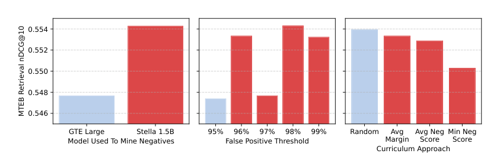
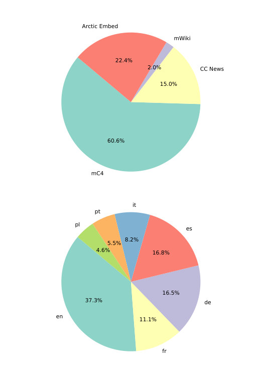

> 原文: [arXiv:2412.04506](https://arxiv.org/abs/2412.04506)
> local PDF: `docs/papers/embedding/Arctic-Embed-v2_2412.04506.pdf`
> 说明: 本文为论文全文中文技术展开，公式/图表编号与原文一致；图片自 arXiv 原图抽取，caption 用中文重写；数值原样保留。

**预印本信息：** arXiv:2412.04506v2 [cs.CL]，2024 年 12 月 14 日。

**开源：** [snowflake-arctic-embed-m-v2.0](https://huggingface.co/Snowflake/snowflake-arctic-embed-m-v2.0) 与 [snowflake-arctic-embed-l-v2.0](https://huggingface.co/Snowflake/snowflake-arctic-embed-l-v2.0)（Apache-2.0）

| 项 | 值 |
| :--- | :--- |
| 会议 / 发布 | arXiv preprint, 2024-12-14 |
| 开源权重 | snowflake-arctic-embed-m-v2.0 / l-v2.0 |
| 作者 | Puxuan Yu\*, Luke Merrick, Gaurav Nuti, Daniel Campos |
| 单位 | Snowflake Inc. |
| 通讯 | puxuan.yu@snowflake.com |

---

# Arctic-Embed 2.0：多语言检索无需妥协（Multilingual Retrieval Without Compromise）

## 摘要（Abstract）

**Arctic-Embed 2.0** 是 Snowflake 发布的多语言文本嵌入模型族，目标是"既能做多语言检索、又不牺牲英语检索质量"。相较此前多语言嵌入模型普遍在英语基准上落后于同尺寸英语专用模型的现象，Arctic-Embed 2.0 在 **MTEB Retrieval**（英语）与 **CLEF**（多语言）两个方向上都保持了同尺寸下的领先，并把 **Matryoshka Representation Learning（MRL）** 融进两阶段训练，让 embedding 截到 256 维后仍能保留 98% 以上的原始检索精度——显著优于把 MRL 只放在微调阶段的做法。论文除了讲清训练配方，还围绕开发过程中冒出来的两个研究问题（"跨语言迁移在对比预训练里到底有多少收益"、"多语言模型的英语退化到底是什么原因"）做了对照实验，并把观察写成开放问题留给社区。

---

## 1 引言（Introduction）

Transformer 嵌入模型已经是搜索引擎与 RAG 系统的基础组件。近年英语专用模型（E5、GTE、Jina、Nomic 等）与多语言模型（mE5、mGTE、BGE-M3、Jina v3 等）都在快速迭代。多语言嵌入的意义在于用同一表示空间同时支撑非英语单语检索和跨语言检索。

Arctic-Embed 2.0 想同时解决两个痛点：

- **效率损失**：目前的高质量模型（如闭源的 OpenAI text-embedding-3-large、Google text-embedding-004）参数动辄十亿量级、向量维度上千，直接把检索的存储和算力成本抬得很高。
- **英语退化**：多语言模型普遍在 MTEB Retrieval 上比其同底座的英语专用模型低 1~3 个百分点；对已经在生产上跑英语搜索的团队来说，切换到多语言模型意味着"给非英语买单"。

作者的做法是坚持"高质量数据 + 小而精的骨干 + MRL + 攻击性量化"路线，同时对 v1（Arctic-Embed 1.0，仅英语）的三段式训练管线做多语言化改造。图 1 用一张散点图展现结果：Arctic-Embed 2.0-M/L 在 MTEB-R 上和同参数量的英语专用模型持平甚至更好，在 CLEF 多语言评测上又远远拉开 mE5/mGTE/BGE-M3。

*图 1 中文说明：* 横轴是英语 MTEB Retrieval 上的平均 nDCG@10，纵轴是覆盖英/法/西/意/德的 CLEF 子集平均 nDCG@10。Arctic-Embed 2.0-M（113M）与 Arctic-Embed 2.0-L（303M）在两条轴上同时占据右上角，而同尺寸的 mGTE、mE5-Base、mE5-Large、BGE-M3 要么英语弱要么多语言弱，说明现有多语言方案很难同时兼顾两端。这张图是全文的核心卖点：不需要在多语言与英语之间做妥协。

**贡献可以归纳为四点**：

1. 一组同尺寸开源 SOTA 的多语言 embedding 模型，支持 MRL；
2. 系统性反驳了"多语言预训练拖累英语"的直觉——把中文数据加进英语预训练反而让英语更好；
3. 指出仅看预训练 checkpoint 的直接检索分数会误导下游微调判断——需要更好的预训练评测方法；
4. 观察到"对比预训练里的跨语言迁移多为负迁移"，与"微调阶段的正迁移"形成对照。

---

## 2 方法（Methodology）

沿用作者此前 v1 及同期工作（mE5、Nomic Embed、BGE-M3、mGTE）的三段式管线：**MLM 预训练 → 对比预训练 → 对比微调**。三段的差异体现在数据来源、过滤策略、负样本挖掘、以及 MRL 的注入位置。

### 2.1 掩码语言建模（Masked Language Modeling）

不重训 encoder，直接站在已有多语言 encoder 肩膀上：

- **中号模型（M, 113M）** 基于 `gte-multilingual-mlm-base`（Zhang et al., 2024）；
- **大号模型（L, 303M）** 基于 `bge-m3-retromae`（Chen et al., 2024）。

两者都用 **XLM-R 分词器**。附录 A 里还比较过用 Llama-3 分词器从零重初始化的方案，实验结果没显著提升、反而带来效率开销，因此没有采用。

### 2.2 对比训练数据（Contrastive Training Data）

**预训练数据**（细节见附录 B）：面向欧洲主要语种，锁定英/法/西/德/意/葡/波 7 种。多语言部分主要用 **mC4 + CC News + 多语言 Wikipedia**（把标题/段落标题当 query，正文当 doc），加上英语部分沿用 Arctic-Embed v1 的 web search 语料。**NLLB 明确排除**——它更像平行翻译对，与"query-doc"检索任务的分布不匹配，早期实验里几乎没有增益。

**微调数据**：英语部分沿用 v1 的高质数据集混合，多语言部分加入 **MIRACL** 训练集。原本考虑过 Mr. TyDi，但和 MIRACL 高度重叠，去掉了。MIRACL 里所有语种都会用，不局限于目标语种——作者观察到把非目标语种的 MIRACL 数据也放进去，不会拖累目标语种的检索质量，反而略有正向。

### 2.3 数据过滤与训练方式（Data Filtering and Training）

英语预训练数据继续用 v1 的启发式 + 一致性过滤。多语言部分采用 **检索式一致性过滤**：

1. 用轻量的 multilingual-E5-small 把每条 (query, doc) 对嵌入到向量空间；
2. 把每个数据集切成大约 300 万对一片的 shard；
3. 对每条 (q, d)，检查 d 在其 shard 内所有文档中按向量相似度排名——若排到第 20 名之外，就丢掉这条对。

这种"top-20-in-3M-shard"过滤策略与 Nomic Embed、GTE、Google Gecko 等工作思路类似，其核心作用是把"query 与 doc 语义不对齐"的噪声样本压掉。经过过滤后剩下约 **1.41B 条无监督 (q, d)** 对。

对比训练目标沿用 v1：**InfoNCE + in-batch negatives**，实现细节（学习率、schedule、batch）在附录 C。

### 2.4 微调阶段的硬负例挖掘（Hard Negative Mining）

微调阶段的硬负例挖掘直接影响下游质量。作者采用 **NV-Retriever**（Moreira et al., 2024）的策略：

1. 用一个更强的 teacher 模型对候选文档打分；
2. 排除掉那些相关性分数超过"正例分数 × 阈值百分比"的候选——它们很可能是假负例；
3. 剩下的按分数取 top 作为硬负例。

Teacher 模型：英语用 `stella-en-1.5B-v5`，多语言用 `multilingual-e5-large`。作者对比了用弱一点的 `gte-large-en-v1.5` 挖负例，确认 **更强的 teacher 会给出更好的微调数据**（图 2 左）。

在假负例阈值上，作者没有照搬 NV-Retriever 建议的 95%，而是把阈值扫到 95%–99%，观察到 **阈值抬高时下游 MTEB Retrieval 分数还在涨**（图 2 中）。直觉是：过低的阈值把很多真正的硬负例误伤掉了；把阈值调到 99% 反而能保留更多"接近正例但确实是负"的样本，训练信号更强。

作者还尝试了 **课程学习（curriculum learning）**：按"负例硬度"从易到难排布训练顺序，硬度用三种代理指标衡量——(1) 正例与负例的平均相关性差；(2) 平均负例分数；(3) 最小负例分数。结果（图 2 右）显示 **随机顺序与任何课程学习曲线打平甚至更好**，说明这种细粒度的硬度课程在大批量对比训练里并不起作用。

*图 2 中文说明：* 三块子图分别是三组消融。左侧 GTE Large 与 Stella-1.5B 对比，验证 teacher 越强、下游 MTEB Retrieval nDCG@10 越好，从 0.548 涨到 0.554；中间扫假负例阈值 95%→99%，分数单调上行，说明 NV-Retriever 默认的 95% 过于激进，会剔除掉真正有用的硬负例；右侧把三种课程学习指标（平均 margin、平均负例分数、最小负例分数）与随机顺序放在一起，几乎无差，甚至随机略好——支撑作者最终采用随机顺序、把工程复杂度压下来。

### 2.5 Matryoshka 表示学习（Matryoshka Representation Learning）

即便骨干只有 113M / 303M 参数，实际检索系统的吞吐瓶颈仍然是 **向量本身占的内存/存储**。Aguerrebere et al. (2023) 指出检索开销近似正比于所有向量的总内存。Merrick (2024) 已经在 Arctic-Embed 系列里验证过 **MRL + 标量量化** 是压 embedding 的有效组合。

v2 做的关键改动是：**在预训练与微调两个阶段都注入 MRL 损失**，都对 **256 维截断** 做监督。这样：

- **中号模型（768→256）** 得到 **3×** 压缩；
- **大号模型（1024→256）** 得到 **4×** 压缩；
- 更重要的是，因为预训练阶段就在 256 维上收敛过，前 256 维承担了主要语义信号，剩余维度是补充——**分量分布更均匀**，后续做 int8 / int4 标量量化时几乎没有信息集中在少数维上，可以进一步压缩到原始的 1/8~1/16。

InfoNCE 对比损失沿用 v1，温度 $\tau = 0.02$：

$$
\mathcal{L}_{\text{InfoNCE}} = -\log \frac{\exp(\text{sim}(q, d^+) / \tau)}{\sum_{d \in \{d^+\} \cup \mathcal{N}(q)} \exp(\text{sim}(q, d) / \tau)}
$$

MRL 版本则是在同一 batch 内对不同截断维度（如 768 全维 + 256 截断维）分别算一次 InfoNCE、然后加权相加——训练完就是"截到哪一维都能直接用"。

---

## 3 评测（Benchmarking）

### 3.1 评测数据集（Evaluation Data Sets）

三大评测轨：

- **MTEB Retrieval**（英语，Muennighoff et al., 2023）——业界标准；
- **MIRACL**（多语言，Zhang et al., 2023b）——覆盖 18 种语言，但完全建立在 Wikipedia 上；
- **CLEF 2000-2003**（ELRA, 2006）——覆盖英/法/西/意/德，语料是新闻，**没有训练集**。

作者特别强调 CLEF 的意义：MIRACL 的训练集普遍被大家用来训练嵌入模型（包括他们自己），并且它的评测语料就是训练集所来的 Wikipedia——很难说清一个模型是"真的会做多语言检索"还是"过拟合了 Wikipedia 分布"。CLEF 因为没训练集、又来自新闻域，能作为 **域外（out-of-domain）多语言检索**的真实探针。CLEF 每个语种的 query/doc/relevance 规模在附录 D 表 2 中列出。

### 3.2 主结果（Results）

表 1 汇总所有模型在 MTEB-R、CLEF、MIRACL、以及 MIRACL 中与 Arctic 训练目标语种重叠的子集（MIRACL-O：en/fr/es/de）上的 nDCG@10。

**表 1 复现：**

| 模型 | 多语言 | 参数量 | 维度 | MTEB-R | CLEF | MIRACL | MIRACL-O |
| :--- | :---: | ---: | ---: | ---: | ---: | ---: | ---: |
| E5 Base v2 | ✗ | 86M | 768 | 0.502 | – | – | – |
| ME5 Base | ✓ | 86M | 768 | 0.489 | 0.432 | 0.608 | 0.509 |
| GTE Base En v1.5 | ✗ | 113M | 768 | 0.540 | – | – | – |
| GTE Multilingual Base | ✓ | 113M | 768 | 0.511 | 0.479 | 0.621 | 0.523 |
| Arctic-Embed 1.0-M | ✗ | 86M | 768 | 0.549 | – | – | – |
| **Arctic-Embed 2.0-M** | ✓ | 113M | 768 | **0.554** | **0.534** | 0.592 | **0.552** |
|   + 截断 256d | ✓ | 113M | 256 | 0.549 | 0.522 | 0.578 | 0.545 |
| E5 Large v2 | ✗ | 303M | 1024 | 0.506 | – | – | – |
| ME5 Large | ✓ | 303M | 1024 | 0.514 | 0.431 | 0.651 | 0.540 |
| BGE Large En | ✗ | 303M | 1024 | 0.521 | – | – | – |
| BGE M3 | ✓ | 303M | 1024 | 0.488 | 0.410 | 0.678 | 0.568 |
| Arctic-Embed 1.0-L | ✗ | 303M | 1024 | 0.560 | – | – | – |
| **Arctic-Embed 2.0-L** | ✓ | 303M | 1024 | 0.556 | **0.541** | 0.649 | 0.558 |
|   + 截断 256d | ✓ | 303M | 256 | 0.547 | 0.530 | 0.638 | 0.547 |
| OpenAI Text Emb. 3 Large | ✓ | – | 3072 | 0.554\* | 0.565 | 0.549\* | – |
|   + 截断 256d | ✓ | – | 256 | 0.517\* | 0.510 | – | – |
| Google Text Emb. 4 | ✗ | 1.2B | 768 | 0.557\* | – | – | – |
|   + 截断 256d | ✗ | 1.2B | 256 | 0.524\* | – | – | – |
| Google Text Emb. 4 Multilingual | ✓ | 1.2B | 768 | – | – | 0.562\* | – |
| Voyage Multilingual 2 | ✓ | – | 1024 | – | 0.569 | – | – |

带星号的分数来自 Lee et al. (2024)；参数量列不含 embedding 层，Google 那栏是总参数。

**几点观察：**

- **同尺寸最优**：M/L 两个尺寸下 MTEB-R 与 CLEF 双榜都是同参数量最高，与闭源旗舰模型（OpenAI text-embed-3-large、Google text-embed-004）打平甚至超过；
- **MIRACL 上不追第一但很接近**：mE5-Large 和 BGE-M3 在 MIRACL 上高一些，但 CLEF 上大幅落后（BGE-M3 CLEF 只有 0.410），提示这类模型可能过拟合了 MIRACL/Wikipedia；
- **MRL 截断优势明显**：截到 256 维后，Arctic-Embed 2.0-M 在 MTEB-R 上 0.549，超过 Google text-embedding-004（也是 256d）的 0.524；M/L 两号分别保留了原始分数的 **99% 与 98%**，而 Google 004 与 OpenAI Emb-3 Large 分别掉到 94% 和 93%——作者归因于 MRL 从预训练阶段就介入，而不是只在微调阶段像 Google 那样"事后"打上。

---

## 4 研发过程中的研究问题（Research Questions From the Journey）

作者把训练过程中发现的两个反直觉现象写成两个研究问题（RQ），并做了针对性实验，结论都指向"当前领域对多语言检索的理解仍不完整"。

### 4.1 RQ1：跨语言迁移（Cross-lingual Transfer）

**问题：** 大规模对比预训练能给"数据里没出现的语言"带来多少检索收益？

**背景：** 跨语言迁移（cross-lingual transfer, CLT）指模型在资源丰富语种上学到的任务能力可迁移到低资源目标语种。作者预训练只覆盖 7 个欧洲语言，但在 MIRACL 全部 18 种语言上分数都不差——这引出一个问题：这份收益到底来自 **预训练的跨语言迁移**、还是 **微调阶段 MIRACL 训练集显式覆盖了所有语言**？

**实验设计：** 在中号模型的对比预训练路径上打 checkpoint——前 10K 步每 2K 步存一次、之后每 10K 步存一次。对每个 checkpoint 做两种评测：(1) 直接跑 MIRACL；(2) 先在完整微调数据（含全部语种 MIRACL）上微调一遍，再跑 MIRACL。前者反映预训练阶段学到了什么，后者反映预训练给下游微调"打的底"。

**结果观察：**

- **微调前的评测会误导判断**：例如 130K 步 checkpoint 直接跑 MIRACL 英语子集时比 8K 步 checkpoint 差 18.3%，但两者过一次微调之后，130K 反而高 3.1%——预训练 checkpoint 的直接分数并不预测微调后的表现。
- **预训练阶段对未见语种基本是 *负*迁移**：语言家族一按 Dravidian（泰卢固语 te）、Koreanic & Japonic（韩语 ko、日语 ja）、Uralic（芬兰语 fi）、Sino-Tibetan（中文 zh）、Kra-Dai（泰语 th）、Indo-Iranian（孟加拉 bn、印地 hi、波斯 fa）、Semitic（阿拉伯 ar）拆开看，微调后曲线在 10K 步之后普遍开始 **下滑**——中文 -13.3%、波斯 -12.7%、日语 -6.9%、俄语 -6.8%、芬兰语 -6.7% 等。
- **甚至预训练数据里占 13.8% 的法语**都出现了微调后 -2.9% 的小幅退化——反映预训练不仅没帮到未见语言，甚至在收益语种里也不是"越练越好"。

*图 3 中文说明：* 横轴是预训练步数（0→130K），纵轴是 MIRACL 各语种的 nDCG@10。虚线是 checkpoint 直接评测的结果，实线是"该 checkpoint 微调后"的结果，两者常常在同一语言里给出相反的走势——直接评测掉分、微调后反而涨；或直接评测涨、微调后掉。每张子图标题旁边的百分比是 130K vs 8K 的相对变化（虚线%/实线%）。可以直接看出：对比预训练在 8K 步左右就已经贡献了大部分微调后收益，之后继续训练对未见语言家族基本是**负迁移**。这张图直接把"更多对比预训练步数 = 更好嵌入"的默认信念推翻了。

### 4.2 RQ2：英语性能差距（English Performance Gap）

**问题：** 为什么很多多语言嵌入模型的英语检索质量比其英语专用对应模型差？

**背景与初始假设：** 从表 1 看到 E5-Base、GTE-Base、BGE-Large 从英语版切到多语言版分别掉 1.3 / 2.9 / 3.3 个 MTEB-R 点，Google/Voyage/Cohere 的英语-多语言配对模型也普遍报告类似的差距。但 Arctic-Embed 2.0 恰恰没有这个差距（表 1）。作者先用小规模复现实验（附录 E）确认了自己的训练流程里不会自发产生这个 gap，然后提出一个假设：**是不是某些语言"和英语打架"，训练它反而拖累英语？**（这个假设直觉上呼应了 RQ1 观察到的"某些语种是负迁移"）。

**实验设计：** 把英语预训练数据分别与 **德语（对照）**、**西班牙语（对照）**、**中文（处理组）** 配对训练，看谁最像"英语的敌人"。为了控制变量：

- 每个非英语语料采 600 batch（≈19.6M 样本）：英语用 web crawl；西/德用 CC News；中文用 C-MTP。
- 只跑英语数据的基线跑 16 epoch；配对组各跑 8 epoch，样本总数一样为 314M。
- 只跑英语的组在中点评测一次（记为 "en"，衡量样本增量效果）、结束再评测一次（记为 "en+en"，衡量"部分英语被替换为等量英语"）。
- 全部 run 在评测前都过同一份微调数据。

**关键结果（图 4）：**

- 在 **MTEB-R** 上，加入中文数据的英语组（en+zh*）拿到 **最高 0.529**，明显好过 en+de（0.523）、en+es（0.525）、纯英语 en+en（0.526）——即 **中文数据反而让英语更好**，彻底否定了"中文是英语敌人"的初始假设。
- **CLEF**（覆盖 en/fr/es/it/de 新闻）上，en+de、en+zh* 领先，en+es 反而略差——但 CLEF 里根本没有中文，说明**中文数据对多语言泛化都有正贡献**。
- **MIRACL_ZH**（中文子集）上加入中文数据把分数从 0.552 拉到 **0.576**，是意料之中的收益；MIRACL 全部语种平均分也从 0.593 涨到 0.605。
- 图 4 的 error bar（针对 en+zh* 的 top-{1,5,10,20,30} 一致性过滤等级）表明 **数据质量档位**的变动同样能造成明显方差——比"用什么语言"更值得关注。

*图 4 中文说明：* 四块子图分别是 MTEB-R、CLEF、MIRACL、MIRACL_ZH 上的 nDCG@10。中间那根 en+zh* 柱子在 MTEB-R 上冲到 0.529、在 MIRACL 上冲到 0.605、在 MIRACL 中文上冲到 0.576，全都胜过 en+de、en+es 的对照组，甚至比"再加一份等量英语"（en+en）都好。error bar 由 en+zh* 内部 5 个一致性过滤档（top-{1,5,10,20,30} out of 3M）产生。这张图直接把"多语言拖累英语"的传统解释切开：**语种本身不是关键，数据质量与总量才是**——只要非英语数据经过一致性过滤达标，加进来就是正向的。

**替代假设：**

- **数据质量假设**：以往那些多语言模型的英语退化，很可能是"非英语语料质量本身低于英语语料"，而不是"训练了多语言就必然掉英语"。
- **模型容量假设**：一次训练的语种数如果远大于模型可承载的表示空间，就会出现 zero-sum——为了给低资源语种腾空间，英语被牺牲。这种假设也解释了为什么 Arctic-Embed 2.0 只锁定 7 个欧洲语种时不出现退化，而 BGE-M3 之类扩到 100+ 语种时英语被拉下来。

作者没有在本文里完成这两个假设的严格证明，把它们留作开放问题。

### 4.3 心得与反思（Reflections on the Journey）

- **数据质量比数据量更重要**。作者延续 v1 的思路——主动拒收低质多语言语料、做检索式一致性过滤、精细挖硬负例；虽然没做低质量对照的系统性研究，但已经把其他可能的解释（语种数、总量、骨干选择）一一排除，剩下最有说服力的解释就是 **别人观察到的英语退化本质上是"某些非英语语种缺乏高质量检索训练数据"**。
- **多语言检索的跨语言迁移没有清晰配方**。RQ1 里对比预训练阶段的负迁移、RQ2 里微调阶段的正迁移，形成鲜明对照——同一现象在训练管线的不同阶段甚至反号，值得未来工作深入。
- **预训练评测方法需要重构**。RQ1 的 130K vs 8K 逆转说明"直接跑 checkpoint 打分"作为预训练早停信号是危险的；社区需要能预测微调后表现的、稳定的预训练评测方法。

---

## 5 结论（Conclusion）

Arctic-Embed 2.0 用一套相对朴素但工艺精细的三段式管线，做出了以下承诺：

- **同尺寸下最优的英语 + 多语言检索**（表 1），不牺牲任一端；
- **256 维截断下仍保留 98%~99% 检索精度**——把 MRL 从预训练阶段就注入是关键；
- **两个方向的开放问题**：多语言对比预训练的跨语言迁移到底怎么工作，以及英语退化的真正主因是数据质量还是模型容量。

作者选择 M/L 两号（113M / 303M）而不是往几十亿参数堆，是为了让"精度、成本、部署难度"这个三角在生产上真正落地——嵌入服务的成本主要来自向量存储，MRL + 量化组合让 v2 在同等分数下把这块砍到常见 1B+ 模型的 1/4~1/8。

---

## 附录 A 底座模型（Base Model）

M 号用 gte-multilingual-mlm-base，L 号用 bge-m3-retromae。前者是 mGTE 的多语言 MLM 版；后者相对普通 XLM-R 额外做过 **RetroMAE**（Xiao et al., 2022）预训练——RetroMAE 是把 masked passage 送进 encoder、让 decoder 重建的检索友好目标，能显著提升 encoder 抽 embedding 的质量，是 BGE-M3 在检索上强的关键。两者都用 XLM-R 分词器。

作者也尝试了 **Llama-3 分词器**：由于 Llama-3 分词器是为多语言 LLM 设计的，词表大、覆盖广，理论上多语言 embedding 更好用。但用它需要随机重初始化 encoder（包括 embedding 层），且不做 MLM 预训练直接进对比训练。实验结果：**没有明显提升，还带来推理效率下降**——所以留在 XLM-R。

---

## 附录 B 预训练数据分布（Pretraining Data Breakdown）

目标语种锁定 **英/法/西/德/意/葡/波** 7 种欧洲语言。数据源：

- **英语**：沿用 v1 的 web search 数据；
- **mC4**（Habernal et al., 2016）：网页语料，占大头；
- **CC News**：把网页标题当 query、正文当 doc；
- **多语言 Wikipedia**：标题 + section 标题拼在一起当 query、section 正文当 doc（follow mE5）；
- **NLLB 明确排除**：更接近翻译对，不像 query-doc 任务，早期实验也没收益。

对每一份多语言数据都跑 top-20-in-3M-shard 检索式一致性过滤，最终留下约 **1.41B 条无监督 (q, d)** 对。

*图 5 中文说明：* 上半环形图按数据源看——**mC4 占 60.6%**、**Arctic-Embed（英语）占 22.4%**、**CC News 15.0%**、**mWiki 2.0%**——mC4 是绝对主力，Wikipedia 只占很小比例，这与"作者不希望模型过拟合 Wikipedia"的立场一致（也是后来选 CLEF 而不是 MIRACL 作为 OOD 探针的原因）。下半环形图按语种看——**英语 37.3%**，**德/西各 16~17%**，**法语 11.1%**，意/葡/波各占几个点。可以看出：英语占据最大份额，但**德、西显著超过法、意、葡、波**，这反映了 CC News 与 mC4 里各语种的实际语料规模，而不是刻意的"每语种等量"。

---

## 附录 C 实现细节（Implementation Details）

**对比预训练：**

- 损失函数：**InfoNCE**，温度 $\tau = 0.02$；
- 负样本：**random in-batch negatives**；
- **每个 mini-batch 从单一数据源采样**（沿用 v1 与 Nomic Embed 的 source stratification 思路）——对多语言数据集，不同语种子集也视为不同数据源分别打包；
- Batch size：**32,768**，query 最大 32 token、doc 最大 256 token；
- 学习率：M 号 1e-4、L 号 3e-5，peak；
- 调度器：**linear warmup-stable-decay（WSD）**（Hu et al., 2024）跑 3 epoch；
- 硬件：**32 张 H100**，DDP，激活重计算（activation checkpointing）省显存以撑住 batch。

**微调：**

- 同样是 InfoNCE，但改用挖出来的硬负例，不再用 in-batch 随机负；
- Query 与 doc 最大长度都放宽到 **512 token**；
- 每个 batch 装 **256 组 (1 query + 1 positive + 10 negatives)**；
- 学习率 M 号 1e-5、L 号 5e-6；
- WSD 不 warmup、9,342 步里 6,000 步做 linear decay。

---

## 附录 D CLEF 数据集细节（CLEF Dataset Details）

CLEF 2000-2003 的用意是 **域外**：语料来自新闻而不是 Wikipedia、且没有官方训练集。它长期被非英语单语检索（Huang et al., 2023, 2024）与跨语言检索（Yu & Allan, 2020；Yu et al., 2021；Nair et al., 2023）用作可靠的评测基准。

**表 2（CLEF 各语种规模）：**

| 语种 | Query 数 | 文档数 | 相关判定数 | 平均相关/Q |
| :--- | ---: | ---: | ---: | ---: |
| 英语 | 246 | 113,005 | 4,769 | 19.4 |
| 法语 | 185 | 129,689 | 3,022 | 16.3 |
| 意大利语 | 176 | 144,040 | 2,626 | 14.9 |
| 德语 | 184 | 153,496 | 3,066 | 16.7 |
| 西班牙语 | 156 | 452,027 | 5,759 | 36.9 |

因为 CLEF 含超过 512 token 的长文档，评测时把所有模型的最大 token 数放到各自能支撑的上限——E5 用 512，其它多语言模型（mE5、mGTE、BGE-M3、Arctic v2、OpenAI/Google/Voyage 等）用 8192。

---

## 附录 E 缩短预训练下的"语言差距"复现（Replication of "Language Gap"）

为了更直接地检验"英语退化"是否来自训练流程本身，作者用 **只跑 13K 步对比预训练** 的缩短版流程，做了 8 组配置组合。三个变量各自 2 档：

- **MLM 底座**：英语专用（En-GTE）vs 多语言（mGTE）；
- **对比预训练数据**：只用英语部分 vs 使用完整多语言 mix；
- **微调数据**：只用英语部分 vs 英语部分 + 全语种 MIRACL 训练集。

**表 3（复现）：**

| MLM | PT | FT | MTEB-R | CLEF | MIRACL | MIRACL-O |
| :--- | :---: | :---: | ---: | ---: | ---: | ---: |
| En | En | En | 0.526 | 0.327 | 0.114 | 0.271 |
| En | En | Mul | 0.532 | 0.340 | 0.268 | 0.361 |
| En | Mul | En | 0.524 | 0.439 | 0.486 | 0.478 |
| En | Mul | Mul | 0.532 | 0.442 | 0.588 | 0.517 |
| Mul | Mul | En | 0.525 | 0.451 | 0.530 | 0.521 |
| Mul | Mul | Mul | 0.529 | 0.452 | 0.594 | 0.538 |

**要点：**

- 无论怎么把多语言组件塞进流程，MTEB-R 上都没有出现相对纯英语基线（0.526）的显著退化——最差的一组也是 0.524，属于噪声范围内；
- 相反，**只是把非英语 MIRACL 微调数据加进来**（En / En / Mul 组），英语 MTEB-R 反而从 0.526 涨到 0.532，同时把 MIRACL 从 0.114 拉到 0.268——是全流程里性价比最高的一步；
- 只切换 MLM 底座（En→Mul）对 MTEB-R 几乎无影响，说明"多语言 MLM 底座就是英语退化元凶"这个流行解释站不住脚。

这份缩短版结果与 §4.2 的完整规模实验一致：**多语言训练本身不会自动拖累英语；退化只在数据质量/模型容量出问题时才会出现。**

---

## 翻译约定（术语与缩写）

首次出现时给中英对照，后续沿用中文或原文以行文自然为准。

- 嵌入模型（embedding model）、检索（retrieval）、密集检索（dense retrieval）、跨语言迁移（cross-lingual transfer, CLT）；
- 三段式训练管线：MLM 预训练（masked language modeling）→ 对比预训练（contrastive pretraining）→ 对比微调（contrastive finetuning）；
- 硬负例挖掘（hard negative mining）、假负例（false negative）、课程学习（curriculum learning）、同源分层（source stratification）、一致性过滤（consistency filtering）、检索式一致性过滤（retrieval-based consistency filtering）；
- Matryoshka 表示学习（Matryoshka Representation Learning, MRL）、标量量化（scalar quantization）、维度截断（truncation）；
- 骨干（backbone）、教师模型（teacher model）、无监督对比对（unsupervised query-document pair）；
- 分布内 / 域外（in-domain / out-of-domain, OOD）、单语检索（monolingual）、跨语言检索（cross-lingual）；
- 保留原名不译的缩写与专有名词：BERT、XLM-R、RetroMAE、InfoNCE、DPR、DDP、AdamW、WSD schedule、H100、Llama-3、mC4、CC News、Wikipedia、NLLB、MIRACL、Mr. TyDi、MTEB、MTEB-R、CLEF、BEIR、LoCo、MSMARCO、HotpotQA、NQ、FEVER、SQuAD、NLI、MEDI、PAQ、StackExchange、S2ORC、C-MTP、C-MTEB、CMTEB、mE5 / ME5、mGTE / GTE、BGE-M3、Nomic Embed、Jina、Cohere、OpenAI text-embedding-3、Google text-embedding-004、Voyage、Stella、NV-Retriever、Promptagator、Snowflake Arctic、Snowflake Arctic-Embed。
