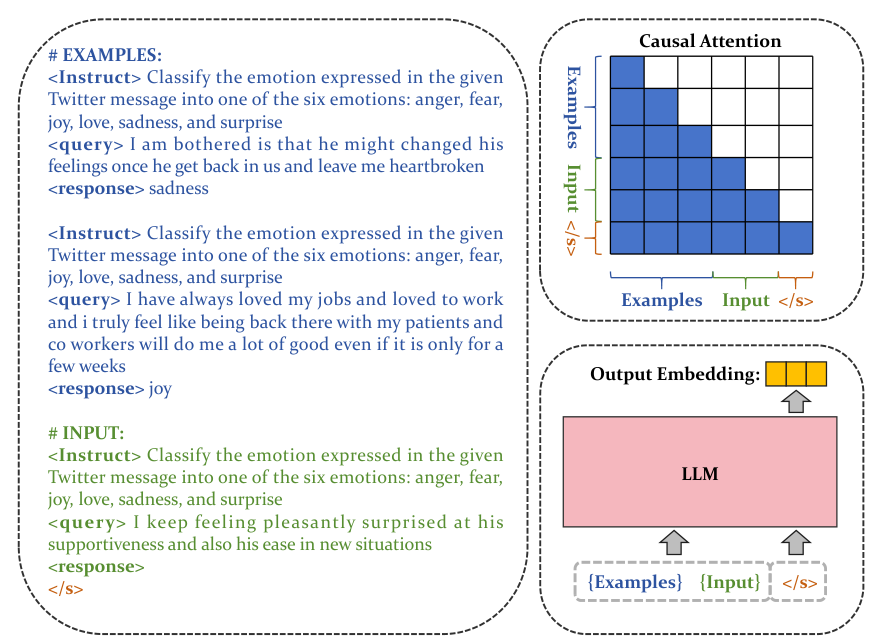

> 原文: [arXiv:2409.15700](https://arxiv.org/abs/2409.15700)（ICLR 2025）
> local PDF: `docs/papers/embedding/BGE-EN-ICL_2409.15700.pdf`
> 说明: 本文为论文全文中文技术展开，公式/图表编号与原文一致；数值原样保留；附录 C（bge-multilingual-gemma2）与附录 D（bge-reranker-v2.5-gemma-lightweight）完整覆盖。

**预印本信息：** arXiv:2409.15700v1 [cs.IR]，2024 年 9 月 24 日。

**开源：** https://github.com/FlagOpen/FlagEmbedding

| 项目 | 内容 |
| :--- | :--- |
| 发布日期 | 2024-09-24（arXiv v1） |
| 开源代码 / 模型 | https://github.com/FlagOpen/FlagEmbedding |
| 作者 | Chaofan Li、MingHao Qin（共同一作）、Shitao Xiao、Jianlyu Chen、Kun Luo、Yingxia Shao、Defu Lian、Zheng Liu（通讯） |
| 单位 | 北京智源人工智能研究院（BAAI）、北京邮电大学、中国科学院、中国科学技术大学 |
| 联系邮箱 | `{cfli, shaoyx}@bupt.edu.cn`、`qinminghao24@ia.ac.cn`、`stxiao@baai.ac.cn`、`chenjianlv@mail.ustc.edu.cn`、`liandefu@ustc.edu.cn`、`{luokun695, zhengliu1026}@gmail.com` |

---

# 把文本嵌入器变成 few-shot 学习者（Making Text Embedders Few-Shot Learners）

## 摘要（Abstract）

Decoder-only 大语言模型展现出显著的 **in-context learning（ICL）** 能力：**只要在输入上下文中给出示例，模型就能推广到熟悉甚至新颖的任务**。作者把这一能力嫁接到 **embedding 生成流程** 上，提出 **bge-en-icl**——在训练与推理时都把 few-shot 示例直接拼到 **query 一侧**，得到明显更强的嵌入表示。除此之外，作者系统评测了把 LLM 用作 embedding 模型时的各种改动：注意力方向（因果 vs 双向）、池化方式（末位 token vs 均值）、passage 端加提示等。核心结论是——**保留 LLM 原生结构（causal attention + last-token pooling）反而最佳**，"简单即最好"。bge-en-icl 在 MTEB 与 AIR-Bench 两个基准上创下 SOTA，模型、代码、数据集与训练脚本全部公开。

---

## 1 引言（Introduction）

**背景**：文本嵌入把自然语言映射到向量空间，是信息检索、分类、推荐、问答等一系列 NLP 任务的核心组件。早期做法以 BERT / T5 / RoBERTa 等**双向**编码器为骨干；随着 LLM 规模化，**Decoder-only 骨干的嵌入模型**（Repllama、E5-Mistral、SFR、NV-Embed 等）开始占据主导，展现出更强的域内精度与迁移能力。

**痛点**：在**监督微调**范式下，模型学到的指令覆盖面有限——真实场景里的用户意图五花八门，"看到的任务指令"与"实际需要执行的检索任务"之间存在 gap。已有研究（Su et al. 2024；Weller et al. 2024）指出，当前 embedding 模型对**未见过的指令**跟随能力差，也难以完成复杂检索。

**灵感**：LLM 天生就有 in-context learning——只要在 prompt 里放几条示例，就能在无需再训练的情况下适应新任务。作者由此提出：**把 ICL 引入嵌入生成流程本身**，让模型在 query 端"读"过示例后再产出嵌入。这样一来，同一个模型就能通过更换示例来切换任务。

**关键探索**：作者同时重新审视了 GritLM、NV-Embed、LLM2Vec 等工作里常见的三种改造——双向注意力、mean pooling、latent attention。实验发现：**在 ICL 场景下，这些改动并不带来显著收益**；反而**沿用 LLM 原生的 causal attention + last-token pooling** 效果最佳——这与 LLM 预训练目标最一致，也最能保留 ICL 能力。

**贡献汇总**：

- **bge-en-icl**：在 query 端拼接 few-shot 示例，把 LLM 的 ICL 能力引入 embedding 训练与推理；
- **系统消融**：重新梳理注意力、池化、passage prompt 三条常见改造路径的实际收益——"simplicity is best"；
- **完全开源**：模型 checkpoint、数据集、训练脚本全部公开；同时在附录中发布 **bge-multilingual-gemma2**（多语言 embedding）与 **bge-reranker-v2.5-gemma2-lightweight**（轻量重排 + 蒸馏教师）两个衍生模型。

---

## 2 相关工作（Related Work）

**BERT/T5 系嵌入**：早期主流基线，用双向编码器 + 对比学习在 BEIR、MTEB 上打榜。

**Decoder-only LLM 系嵌入**：

- **Repllama**（Ma et al. 2023）：Llama-2 微调为 dense retriever + reranker，证明 LLM 骨干在检索上的可行性；
- **Llama2Vec**（Li et al. 2024）：设计两个 LLM-oriented 的预训练任务专门对齐 embedding，BEIR 明显涨点；
- **E5-Mistral / Gecko**（Wang et al. 2023；Lee et al. 2024b）：靠 LLM 生成的合成数据大幅推高检索与非检索任务的表现；
- **NV-Embed**（Lee et al. 2024a）：提出 latent attention 池化 + 两阶段训练解决非检索任务的假负例问题；
- **GritLM**（Muennighoff et al. 2024）：把 embedding 与生成统一在单一 LLM，两侧性能都不输专用模型；
- **LLM2Vec**（BehnamGhader et al. 2024）：无监督地把 decoder-only LLM 转成 embedding 模型；
- **PromptReps**（Zhuang et al. 2024）：靠对齐后的 chat LLM 无监督生成 dense 表示。

作者的批评：上述工作都在"改架构"，而没有充分利用 LLM 本身自带的 **ICL 能力**——即便 GritLM 融合生成与嵌入，仍未在 embedding 环节激活 few-shot 能力。bge-en-icl 正是补齐这一点。

---

## 3 方法（Methodology）

### 3.1 面向嵌入的 in-context learning（In-Context Learning for Embedding Models）

**普通做法**：把 query 直接送入 embedding 模型即可拿到向量。为了让单模型服务多任务，Su et al. (2022) 引入**指令前缀**，用不同 instruction 切换任务——但指令覆盖仍有限。

**作者做法**：在 query 前拼 few-shot 示例，让模型**从示例里学任务**。示例模板为：

$$
\langle\text{Instruct}\rangle\{\text{task definition}\}\ \langle\text{query}\rangle\{q_i\}\ \langle\text{response}\rangle\{p_i\} \tag{1}
$$

对当前的目标查询 $(q^+, p^+)$，构造扩展 query：

$$
\{\text{example 1}\}\ \ldots\ \{\text{example n}\}\ \langle\text{Instruct}\rangle\{\text{task definition}\}\ \langle\text{query}\rangle\{q^+\}\ \langle\text{response}\rangle \tag{2}
$$

**编码与损失**：所有 query 与 passage 都追加 `[EOS]`，送入同一个 LLM，取最后一层 `[EOS]` 位向量作嵌入 $(h_{q^+_{\exp}}, h_{p^+})$；用标准 **InfoNCE** 训练，负例含 in-batch 与 hard negatives：

$$
\mathcal{L} = -\log \frac{\exp\!\bigl(s(q^+_{\exp}, p^+_i)\bigr)}{\exp\!\bigl(s(q^+_{\exp}, p^+_i)\bigr) + \sum_j \exp\!\bigl(s(q^+_{\exp}, p^-_j)\bigr)} \tag{3}
$$

打分函数为温度缩放的余弦相似度，$\tau = 0.02$：

$$
s(q, p) = \tfrac{1}{\tau}\cos(h_q, h_p) \tag{4}
$$

### 3.2 表示方式（Representation Method）

作者**反对**社区流行的"双向注意力 + mean pooling"改动，理由是它**与 LLM 预训练的 next-token 目标不匹配**，会削弱 ICL 与生成能力。因此 bge-en-icl 保留**因果注意力 + 末位 `[EOS]` token pooling**：

$$
h_t = \text{LLM}(T)[\text{EOS}] \tag{5}
$$

其中 $T = [\text{BOS}], t_1, \ldots, t_N$ 是分词后的输入序列。末位 token 天然吸收前文所有信息（含前置示例），与因果注意力机制完全一致。

### 3.3 基于 ICL 的指令微调（ICL-based Instruction-Tuning）

**关键困难**：GRIT (Muennighoff et al. 2024) 观察到，**直接在推理时**给 embedding 模型塞 few-shot 示例反而会降点——因为训练时从未见过这种输入格式。因此作者把 ICL **搬进训练阶段**：

1. **训练时也拼示例**：每一步都为 query 提供**变长**的 0~n 个 few-shot 示例，n 由采样函数决定；
2. **动态采样保留零样本**：0 个示例的情形也在训练分布中，防止"必须要示例才会工作"的失衡；
3. **示例来自 in-batch pairs**：从当前 batch 里的其它 (query, passage) 对里挑作为示例——训练与推理格式天然一致，且能同时"练模型如何区分示例与真正的输入"。

**图 1 说明**：左侧展示了 emotion classification 任务的 few-shot 输入：先给出两条 `<Instruct> ... <query> ... <response> sadness / joy` 的完整示例，再拼当前 query 的 `<Instruct> ... <query> ... <response>`（response 位留空）。整个序列以 `</s>` 结束送入 Mistral-7B。右侧示意信息流：causal attention 让 `</s>` 位置能看到所有前文示例与当前 query，最终取该位置的 hidden state 作为 output embedding。**这里没有任何架构改动**——只是"改 prompt 组织形式 + 训练时同分布对齐"。

---

## 4 实验（Experiments）

作者围绕六个研究问题展开：**RQ1** ICL 训练对零样本与少样本的有效性；**RQ2** ICL 与传统训练的对比；**RQ3** in-batch 示例的作用；**RQ4** 双向注意力 vs 因果注意力；**RQ5** 池化策略；**RQ6** passage 端是否也该加 prompt。

### 4.1 实验设置（Setup）

**骨干**：沿用 E5-Mistral、SFR、NV-Embed 的选择，用 **Mistral-7B**（Jiang et al. 2023）。

**评测**：**MTEB**（56 数据集，7 任务类型）+ **AIR-Bench**（LLM 自动生成，避免训练数据泄漏）。

**训练数据**：

- **Public data**：与 E5-Mistral 同——ELI5、HotpotQA、FEVER、MIRACL、MSMARCO passage/document、NQ、NLI、SQuAD、TriviaQA、Quora Duplicate、MrTyDi、DuReader、T2Ranking；
- **Full data**（自家增强版）：
  - **检索**：ELI5、HotpotQA、FEVER、MSMARCO、NQ、NLI、SQuAD、TriviaQA、Quora、Arguana、FiQA；
  - **Reranking**：SciDocsRR、StackOverFlowDupQuestions；
  - **Classification**：AmazonReviews / AmazonCounterfactual / Banking77 / Emotion / TweetSentiment / MTOPIntent / IMDB / ToxicConversations；
  - **Clustering**：Arxiv / Biorxiv / Medrxiv / Reddit / StackExchange 的 S2S 与 P2P、TwentyNewsgroups；
  - **STS**：STS12、STS22、STSBenchmark。

**训练细节**：Mistral-7B 用对比损失微调 1 epoch；**LoRA rank=64, alpha=32, lr=1e-4**；检索任务用 in-batch negatives，其它任务**不用**；每个数据集配 **7 个 hard negatives**；batch size **检索 512、其它 256**；同一 step 内数据集保持一致；max seq length **512**；检索任务用 **bge-reranker** 作为教师做分数蒸馏。**ICL 采样**：每条 query 随机取 0~5 条 in-batch 样本作为示例；示例 query 与 passage 各最多 256 tokens；query + 示例总长上限 **2048 tokens**。

**评测细节**：few-shot 场景下，每条 query 固定拼相同的示例集；示例来源为训练集，缺失训练集时用 ChatGPT 生成。

### 4.2 主要结果（Main Results）

**MTEB**（表 1）——同时列出使用 full data 与 public data only 的结果：

| 模型 | Retr.(15) | Rerank.(4) | Clust.(11) | PairClass.(3) | Class.(12) | STS(10) | Summ.(1) | Avg.(56) |
| :--- | ---: | ---: | ---: | ---: | ---: | ---: | ---: | ---: |
| **w/ full data** | | | | | | | | |
| E5-mistral-7b-instruct | 56.90 | 60.21 | 50.26 | 88.34 | 78.47 | 84.66 | 31.40 | 66.63 |
| GritLM-7B | 57.41 | 60.49 | 50.61 | 87.16 | 79.46 | 83.35 | 30.37 | 66.76 |
| SFR-Embedding | 59.00 | 60.64 | 51.67 | 88.54 | 78.33 | 85.05 | 31.16 | 67.56 |
| Linq-Embed-Mistral | 60.19 | 60.29 | 51.42 | 88.35 | 80.20 | 84.97 | 30.98 | 68.17 |
| voyage-large-2-instruct | 58.28 | 60.09 | 53.35 | 89.24 | 81.49 | 84.31 | 30.84 | 68.23 |
| NV-Embed-v1 | 59.36 | 60.59 | 52.80 | 86.91 | 87.35 | 82.84 | 31.20 | 69.32 |
| bge-multilingual-gemma2 | 59.24 | 59.72 | 54.65 | 85.84 | 88.08 | 83.88 | 31.20 | 69.88 |
| stella en 400M v5 | 58.97 | 60.16 | 56.70 | 87.74 | 86.67 | 84.22 | 31.66 | 70.11 |
| gte-Qwen2-7B-instruct | 60.25 | 61.42 | 56.92 | 85.79 | 86.58 | 83.04 | 31.35 | 70.24 |
| SFR-Embedding-2 R | 60.18 | 60.14 | 56.17 | 88.07 | 89.05 | 81.26 | 30.71 | 70.31 |
| stella en 1.5B v5 | 61.01 | 61.21 | 57.69 | 88.07 | 87.63 | 84.51 | 31.49 | 71.19 |
| **bge-en-icl (zero-shot)** | **61.67** | 59.66 | 57.51 | 86.93 | 88.62 | 83.74 | 30.75 | **71.24** |
| **bge-en-icl (few-shot)** | **62.16** | 59.82 | 57.89 | 88.14 | 88.95 | 84.24 | 30.77 | **71.67** |
| **w/ public data only** | | | | | | | | |
| E5-mistral-7b-instruct | 52.78 | 60.38 | 47.78 | 88.47 | 76.80 | 83.77 | 31.90 | 64.56 |
| GritLM-7B | 53.10 | 61.30 | 48.90 | 86.90 | 77.00 | 82.80 | 29.40 | 64.70 |
| LLM2Vec-Mistral-supervised | 55.99 | 58.42 | 45.54 | 87.99 | 76.63 | 84.09 | 29.96 | 64.80 |
| **bge-en-icl (zero-shot)** | 59.59 | 56.85 | 42.61 | 87.87 | 75.47 | 83.30 | 29.52 | 64.67 |
| **bge-en-icl (few-shot)** | 60.08 | 56.67 | 46.55 | 88.51 | 77.31 | 83.69 | 30.68 | **66.08** |

**表 1**（MTEB 领先模型，截至 2024-08-27）：使用 full data 时，bge-en-icl 在 zero-shot 就到 71.24、few-shot 71.67（↑0.43），超越所有已公开模型；仅用 public data 时，zero-shot 与 LLM2Vec / GritLM 相当（64.67 vs 64.7~64.8），但**few-shot 达到 66.08（↑1.41）**，主要涨点集中在训练分布外的 **classification 与 clustering** 任务——印证 ICL 泛化收益。full data 涨幅更小（↑0.43）的原因在于全量数据本身已把很多 MTEB 相关任务喂给模型，few-shot 增益空间被压缩。

**AIR-Bench QA**（表 2，nDCG@10）：

| Domain | wiki | web | news | health | law | finance | arxiv | msmarco | Avg. |
| :--- | ---: | ---: | ---: | ---: | ---: | ---: | ---: | ---: | ---: |
| E5-mistral-7b-instruct | 61.67 | 44.41 | 48.18 | 56.32 | 19.32 | 54.79 | 44.78 | 59.03 | 48.56 |
| SFR-Embedding | 63.46 | 51.27 | 52.21 | 58.76 | 23.27 | 56.94 | 47.75 | 58.99 | 51.58 |
| NV-Embed-v1 | 62.84 | 50.42 | 51.46 | 58.53 | 20.65 | 49.89 | 46.10 | 60.27 | 50.02 |
| gte-Qwen2-7B-instruct | 63.46 | 51.20 | 54.07 | 54.20 | 22.31 | 58.20 | 40.27 | 58.39 | 50.26 |
| stella en 1.5B v5 | 61.99 | 50.88 | 53.87 | 58.81 | 23.22 | 57.26 | 44.81 | 61.38 | 51.53 |
| **bge-en-icl (zero-shot, full)** | 64.61 | 54.40 | 55.11 | 57.25 | 25.10 | 54.81 | 48.46 | 63.71 | 52.93 |
| **bge-en-icl (few-shot, full)** | 64.94 | 55.11 | 56.02 | 58.85 | 28.29 | 57.16 | 50.04 | 64.50 | **54.36** |
| **bge-en-icl (zero-shot, public)** | 64.82 | 54.96 | 55.82 | 57.06 | 28.87 | 54.46 | 49.60 | 63.25 | 53.60 |
| **bge-en-icl (few-shot, public)** | 66.98 | 56.38 | 57.17 | 59.54 | 32.03 | 58.81 | 51.36 | 65.05 | **55.92** |

**AIR-Bench Long-Doc**（表 3，Recall@10）：15 个英文数据集，few-shot 涨 1.08 点（74.83 vs 73.75；public data 更是 75.98 vs 74.86）——**特别注意**：AIR-Bench 与训练集无重叠，说明 ICL 收益是**真实的分布外泛化**而非记忆。同时也观察到一个反直觉现象——**public data 训练比 full data 训练在 AIR-Bench 上更好**，作者推测是 full 数据里 clustering / classification 类样本过多导致过拟合。

### 4.3 In-Context Learning 消融（RQ1–RQ3）

表 4（MTEB w/ full data）对比三种设置：

| 训练方式 | Retr. | Rerank. | Clust. | PairCl. | Class. | STS | Summ. | Avg. |
| :--- | ---: | ---: | ---: | ---: | ---: | ---: | ---: | ---: |
| **不用 ICL** | 59.11 | 57.02 | 42.60 | 87.99 | 76.27 | 83.93 | 30.50 | 64.83 |
| fix examples (zero-shot) | 48.98 | 56.48 | 41.84 | 85.94 | 74.38 | 84.31 | 29.68 | 61.50 |
| fix examples (few-shot) | 59.00 | 56.90 | 45.75 | 88.54 | 75.56 | 84.67 | 30.66 | 65.46 |
| in-batch examples (zero-shot) | 59.59 | 56.85 | 42.61 | 87.87 | 75.47 | 83.30 | 29.52 | 64.67 |
| in-batch examples (few-shot) | 60.08 | 56.67 | 46.55 | 88.51 | 77.31 | 83.69 | 30.68 | **66.08** |

**观察**：
- **fixed 示例**训练会让 zero-shot 塌 3.33 点——模型太依赖固定示例；
- **in-batch 示例**（含 0-shot 情形）几乎没伤零样本（-0.16），few-shot 却涨 1.25——**动态、多样、含 0-shot** 是关键；
- fixed vs in-batch 相比，in-batch 在**训练分布外任务（Class., Clust.）** 上明显更强。

### 4.4 注意力与池化（RQ4 & RQ5）

表 5（MTEB w/ full data）：

| 配置 | 场景 | Retr. | Rerank. | Clust. | PairCl. | Class. | STS | Summ. | Avg. |
| :--- | :--- | ---: | ---: | ---: | ---: | ---: | ---: | ---: | ---: |
| **causal + last-token** | 无 ICL | 59.11 | 57.02 | 42.60 | 87.99 | 76.27 | 83.93 | 30.50 | 64.83 |
| causal + last-token | ICL zero | 59.59 | 56.85 | 42.61 | 87.87 | 75.47 | 83.30 | 29.52 | 64.67 |
| causal + last-token | ICL few | 60.08 | 56.67 | 46.55 | 88.51 | 77.31 | 83.69 | 30.68 | **66.08** |
| causal + mean | 无 ICL | 58.50 | 53.74 | 36.82 | 82.14 | 72.37 | 77.62 | 29.10 | 61.03 |
| bidir + last-token | 无 ICL | 59.59 | 56.96 | 44.34 | 87.61 | 74.77 | 83.81 | 30.12 | 64.96 |
| bidir + last-token | ICL zero | 59.77 | 58.09 | 44.04 | 87.87 | 75.35 | 83.97 | 29.75 | 65.19 |
| bidir + last-token | ICL few | 60.23 | 57.81 | 44.45 | 88.64 | 77.00 | 83.77 | 29.99 | 65.74 |
| bidir + mean | 无 ICL | 59.13 | 57.03 | 43.44 | 87.25 | 75.03 | 84.08 | 29.17 | 64.73 |
| bidir + mean | ICL zero | 59.53 | 57.48 | 43.88 | 88.12 | 74.86 | 83.64 | 29.58 | 64.90 |
| bidir + mean | ICL few | 59.42 | 57.29 | 44.93 | 88.36 | 75.26 | 83.75 | 29.60 | 65.18 |

**关键结论**：
- **causal + mean** 明显最差（61.03）——因果注意力下均值受限、无法有效收集全文信息；作者说这个组合在 ICL 场景**根本训不起来**，因此表中只保留无 ICL 一行；
- **causal + last-token + ICL few-shot** 得到全表最高 66.08——**与 LLM 预训练目标一致**是核心原因；
- 改用**双向注意力**无论配 last-token 还是 mean，都**没有显著提升**——反而在 ICL few-shot 场景下略差；
- **bidir + last-token** 在无 ICL 与 zero-shot 场景表现不错、reranking 任务上尤其突出，可作为不用 ICL 的备选配置。

### 4.5 Passage 端提示（RQ6）

作者尝试在 passage 端加提示：

$$
\{\text{passage}\}\ \text{Summarize the above passage:} \tag{6}
$$

结果（表 6，w/ full data）：加了 passage prompt 后，除检索任务（Retr. 微降）外**所有任务大跌** ——Rerank 从 56.85 掉到 46.84；PairClass 从 87.87 掉到 81.25；Clust 从 42.61 掉到 39.57；Class 从 75.47 掉到 71.41；平均从 64.67 掉到 61.61。表明现阶段 **passage 端加 prompt 并不划算**，需要更精细的设计。

---

## 5 结论（Conclusion）

保留 LLM 原生结构（causal attention + last-token pooling），仅在 query 端引入 few-shot ICL 示例并**动态采样训练**，就能在 MTEB 与 AIR-Bench 上同时刷新 SOTA。这一简洁方案说明：**LLM 自带的 ICL 能力才是嵌入模型的最大红利**，而不必再往架构上叠花活。

---

## 附录 A 指令（Instruction）

表 7 给出用于 MTEB 与 AIR-Bench 的全部任务指令模板（Instruction Template）。每个数据集对应一条自然语言描述，用于填入公式 (1) 的 `{task definition}` 位。例如：ArguAna 指令为 "Given a claim, find documents that refute the claim."；FiQA2018 为 "Given a financial question, retrieve user replies that best answer the question."；EmotionClassification 为 "Classify the emotion expressed in the given Twitter message into one of the six emotions: anger, fear, joy, love, sadness, and surprise."；ArxivClusteringP2P 为 "Identify the main and secondary category of Arxiv papers based on the titles and abstracts."；AIR-Bench 统一为 "Given a question, retrieve passages that answer the question."。完整表格覆盖 44 条 MTEB 数据集指令。

## 附录 B MTEB 细致结果

**表 8**（full data，54 数据集逐条 nDCG@10 / Spearman / Accuracy 等）：bge-en-icl (few-shot) 在 ArguAna 拿到 **83.08**（对比 gte-Qwen2 的 64.27）、HotpotQA **85.14**、TREC-COVID **79.08**、Emotion **93.36**、Banking77 **91.49**、MTOPIntent **94.00**、SprintDuplicateQuestions **97.23** 等多项细项 SOTA 或接近 SOTA；MTEB 总平均 **71.67**。**表 9**（public data only）：few-shot 66.08，涨点主要来自 classification / clustering / STS 类任务——例如 Emotion 从 54.29 到 54.24、Imdb 从 81.14 到 84.96、StackExchange 从 57.50 到 68.61、TwentyNewsgroups 从 43.65 到 51.40，明显看出 ICL 让训练分布外任务的表现被"拉起"。

---

## 附录 C 多语言嵌入模型 bge-multilingual-gemma2

**动机**：目前基于 LLM 的**多语言** embedding 模型仍稀缺。作者用 **Gemma-2-9B** 作为骨干训练了 bge-multilingual-gemma2——**未启用 ICL**（作者留待未来），仅探索 LLM 骨干在多语言嵌入上的边界。结果显示该模型在多个多语言基准上取得 SOTA。

### C.1 设置（Setup）

**骨干选择**：Gemma-2-9B（Team et al. 2024）；关键理由是**词表规模 256K**——远大于 Qwen2 或 Llama 3，与 XLM-RoBERTa 的多语言观察一致——**大词表利于多语覆盖**。

**评测**：MTEB、AIR-Bench、MIRACL、FR-MTEB、PL-MTEB、C-MTEB。

**训练数据**：

- **英文**：沿用 bge-en-icl 的数据集（去掉 MSMARCO document ranking）；
- **中文**：BGE-M3（Chen et al. 2024）用过的中文集合，另加 Multi-CPR 的三个领域集合（Long et al. 2022）、AmazonReviews-Classification、MultilingualSentiment-Classification、CSL-Clustering-{S2S/P2P}；
- **多语言**：MIRACL + Mr.TyDi。

**训练细节**：Gemma-2-9B + 对比损失 + 1 epoch；**LoRA rank=64, alpha=32, lr=1e-4**；检索任务用 in-batch negatives，每条 query 7 个 hard negatives；batch size 检索 512、其它 256；max seq length **512**；用 **bge-reranker** 作为教师做检索任务蒸馏。**评测指令**：MTEB 沿用表 7；C-MTEB / PL-MTEB / FR-MTEB 用表 16（沿用 gte-Qwen2-7B-instruct 的指令并在句末补句号）；MIRACL 18 语统一 "Given a question, retrieve Wikipedia passages that answer the question."；AIR-Bench 统一 "Given a question, retrieve passages that answer the question."。

### C.2 主要结果（Main Results）

**MIRACL**（18 语，nDCG@10，表 10）：bge-multilingual-gemma2 平均 **74.1**，全部 18 种语言拿到 SOTA，远超之前最强 BGE-M3 (Dense) 的 69.2。逐语细项摘录：ar 81.0 / bn 82.3 / en 64.5 / es 64.2 / fa 64.0 / fi 81.2 / fr 64.2 / hi 68.2 / id 61.5 / ja 79.1 / ko 69.7 / ru 77.0 / sw 81.9 / te 88.1 / th 84.6 / zh 68.0 / de 63.5 / yo 90.3。Recall@100（表 11）平均 **97.2**，同样领先 BGE-M3 (95.5)、E5mistral-7b (92.7)。

**FR-MTEB**（法语 26 数据集，表 12）：bge-multilingual-gemma2 平均 **70.08**，检索 **63.47**，均为 SOTA，压过 gte-Qwen2-7B-instruct (68.25)。

**PL-MTEB**（波兰语 26 数据集，表 13）：平均 **70.00**，检索 59.41，同样 SOTA；显著领先前 SOTA gte-Qwen2-7B-instruct (67.86) 和 mmlw-roberta-large (63.23)。

**C-MTEB**（中文 35 数据集，表 14）：平均 **68.44**——超越 e5-mistral-7b-instruct (60.81)、bge-large-zh-v1.5 (64.53)、gte-multilingual-base (62.72)；但**略逊** gte-Qwen2-7B-instruct (72.05)。作者归因于 Gemma-2 的中文能力弱于 Qwen2——**骨干中文语料决定天花板**。

**AIR-Bench**（en+zh QA 13 数据集，表 15）：平均 **46.83**——好于 e5-mistral-7b-instruct (45.26)、bge-m3 dense (46.65)、gte-Qwen2-1.5B (41.06)，与 gte-Qwen2-7B-instruct (48.38) 相当；Long-Doc 部分（表 3）15 个数据集平均 **72.88**，明显强于多数英文模型。

表 17 给出 bge-multilingual-gemma2 在 FR-MTEB / PL-MTEB / C-MTEB 每个数据集上的细致得分（例如 AlloprofRetrieval 58.50、DBPedia-PL 43.19、T2Retrieval 86.26、MMarcoReranking 35.43、Cmnli 90.13 等），便于后续对齐复现。

**结论**：bge-multilingual-gemma2 是本文附带发布的 **不使用 ICL** 的多语言 LLM embedding 模型，在 MIRACL、FR-MTEB、PL-MTEB 上均创下新 SOTA；C-MTEB 上仍受 Gemma-2 中文能力限制，输给 Qwen2 骨干版本——**这也是后续 bge-multilingual 系列进一步换 Qwen 骨干的直接动因**。

---

## 附录 D 轻量重排 bge-reranker-v2.5-gemma2-lightweight

作者同时发布一个**轻量 reranker**，用**深度压缩**与**宽度压缩**两个正交技巧同时降 FLOPs。这个 reranker 也充当 bge-en-icl / bge-multilingual-gemma2 训练时检索任务的**蒸馏教师**。

**核心思路**：

- **深度压缩**：**逐层**输出——把语言模型 head 中对应 "Yes" logit 的线性层复制并挂到每一层，让**任意一层**都能输出重排分数。训练时随机采样输出层深度；推理时选择需要的层即可提早退出。
- **宽度压缩**：在预先设定的层做 **token 合并**——把 n 个 token 合成 1 个（n = 压缩比）。相当于 Perceiver / TokenPacker 思路的层内实现。

**输入模板**：

$$
A:\ \{\text{query}\}\ B:\ \{\text{passage}\}\ \{\text{prompt}\} \tag{7}
$$

`{prompt}` 描述 A、B 关系（如 "Predict whether passage B contains an answer to query A."）；取 "Yes" logit 作为重排分数。

### D.1 设置

**骨干**：Gemma-2-9B（大词表利于多语支持）。

**数据**：BGE-M3 数据集 + Arguana + HotpotQA + FEVER。

**训练细节**：对比损失 + **LoRA rank=64, alpha=32, lr=1e-4**；batch 128；每 query 15 个 hard negatives。启用**自蒸馏**——最后一层作为教师，用 **KL 散度**监督前面各层。每步随机采样一种宽度压缩策略，同时训练所有深度压缩策略。

支持的配置：

- **深度**：8~42 层任意输出；
- **宽度**：压缩比 1/2/4/8；
- **压缩位置**：8、16、24、32、40 层。

训练用到四类 prompt（表 18）：query→passage、query→query、passage→passage、argument→counter-argument，具体用哪种取决于数据集类型。

**评测**：在 BEIR 上，对 bge-large-en-v1.5 与 E5-mistral-7b-instruct 的 top-100 检索结果重排；在 MIRACL 上对 bge-m3 (dense) 的 top-100 结果重排。评测指令见表 19（多数任务用 "Predict whether passage B contains an answer to query A."；ArguAna 用 counter-argument prompt；CQADupstack、QuoraRetrieval 用 query→query prompt）。

### D.2 主要结果

**BEIR 基于 bge-large-en-v1.5**（表 20）：**bge-reranker-v2.5-gemma-lightweight** 平均 nDCG@10 达 **63.67**（0% FLOPs 节省，即完整版）与 **63.10**（60% FLOPs 节省）——超过 bge-reranker-v2-gemma 的 60.71、jina-reranker-v2-base-multilingual 的 56.52、bge-reranker-v2-m3 的 55.36、bge-large-en-v1.5 自身检索基线 54.31。逐项例子：ArguAna 从 63.54 → 86.16、HotpotQA 从 74.11 → 87.89、NQ 从 55.04 → 75.58、TRECCOVID 从 74.89 → 84.85。

**BEIR 基于 E5-mistral-7b-instruct**（表 21）：完整版平均 **64.04**、轻量版 **63.36**，均高于 bge-reranker-v2-gemma 的 61.13。**初始检索更强 → 重排后更强**——存在正相关。轻量版相较完整版**只掉极小**，却省 60% FLOPs——非常有利于线上部署。

**MIRACL**（18 语，nDCG@10，表 22）：完整 bge-reranker-v2.5-gemma-lightweight 平均 **77.3**，比 bge-reranker-v2-gemma 的 75.0、bge-reranker-v2-m3 的 74.4 都强；轻量版 77.1。全部 18 种语言均显著强于 bge-m3 dense 基线（69.2）。**多语言场景下，轻量化几乎无损**——比英文单语场景更加平稳，这与"多语言 token 合并冗余更充分"的直觉一致。

**结论**：bge-reranker-v2.5-gemma2-lightweight 一方面把多语言 reranker SOTA 又抬了一个台阶；另一方面作为 bge-en-icl 与 bge-multilingual-gemma2 的**蒸馏教师**，把检索任务的强 supervision 传给 embedding 模型——这也解释了为什么 bge-en-icl 在纯 public data 下的 few-shot 检索仍能压过 E5-mistral / LLM2Vec 等更大数据训练的模型。

---

## 术语约定（Glossary）

| 英文 | 中文 |
| :--- | :--- |
| in-context learning (ICL) | 上下文学习 / 少样本示例学习 |
| few-shot / zero-shot | 少样本 / 零样本 |
| decoder-only | 仅解码器 / 单向自回归 |
| causal attention | 因果注意力（单向） |
| bidirectional attention | 双向注意力 |
| last-token / EOS pooling | 末位 token 池化 |
| mean pooling | 均值池化 |
| latent attention layer | 潜在注意力层 |
| InfoNCE | 对比损失 InfoNCE |
| in-batch negatives | 同批负例 |
| hard negatives | 难负例 |
| instruction tuning | 指令微调 |
| task definition | 任务描述（指令） |
| LoRA (Low-Rank Adaptation) | 低秩适配微调 |
| dense retrieval | 稠密检索 |
| reranker | 重排模型 |
| depth / width compression | 深度 / 宽度压缩 |
| self-distillation | 自蒸馏 |
| KL divergence | KL 散度 |
| MTEB / AIR-Bench / MIRACL / BEIR | 嵌入 / 检索 / 多语检索 / 零样本检索基准 |
| FR-MTEB / PL-MTEB / C-MTEB | MTEB 的法语 / 波兰语 / 中文子集 |
| Gemma-2-9B / Mistral-7B / Qwen2 / Llama 3 | 论文使用或对照的开源 LLM 骨干 |
