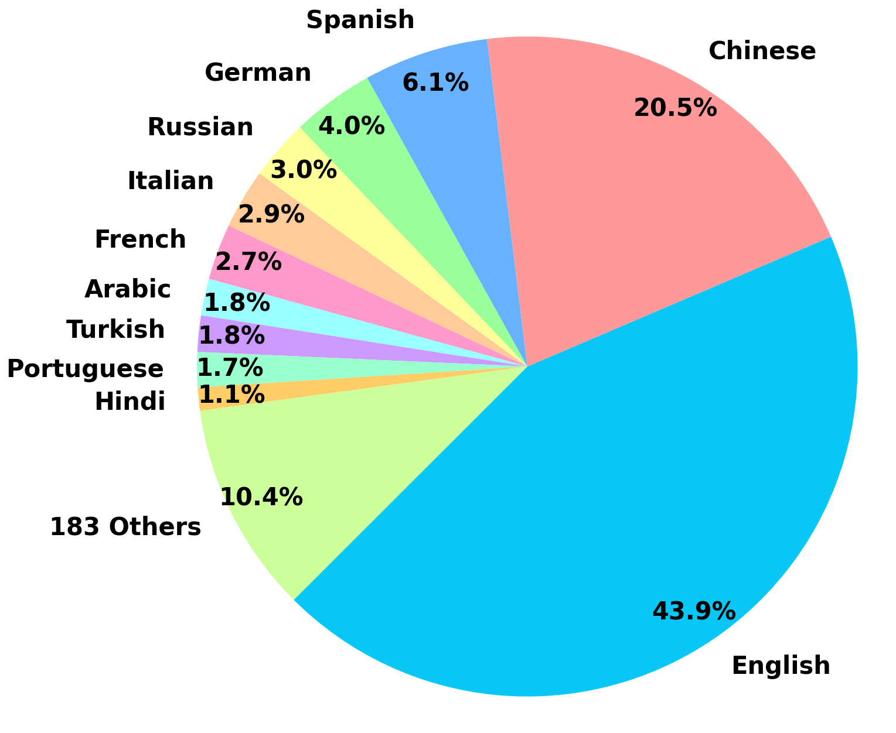
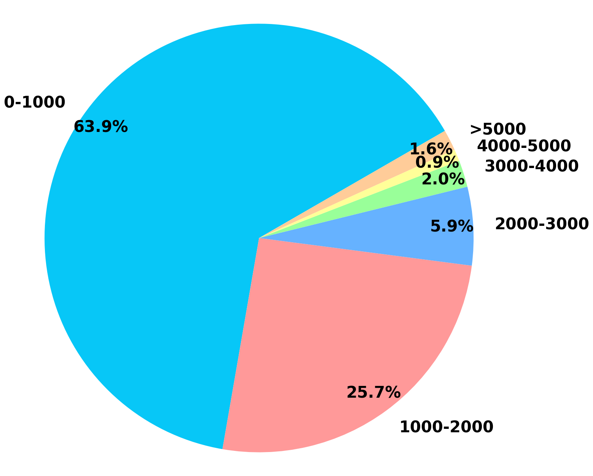
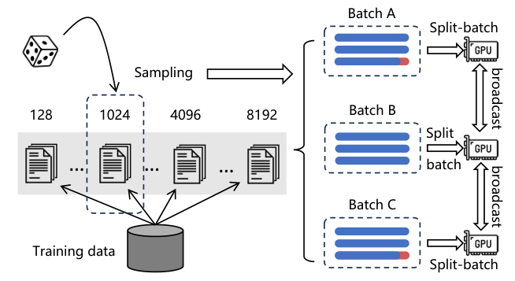
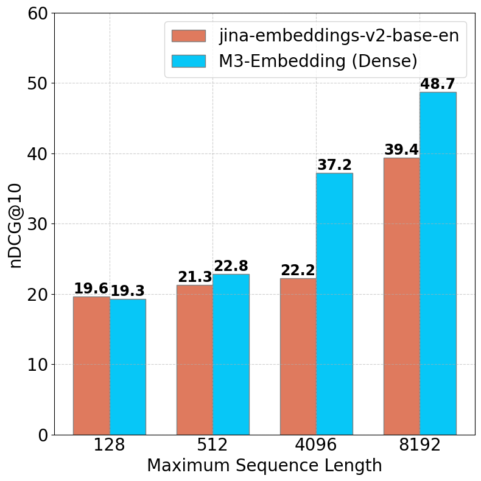

> 原文: [arXiv:2402.03216](https://arxiv.org/abs/2402.03216)（ACL 2024 Findings）
> 说明: 本文为论文全文中文技术展开，公式/图表编号与原文一致；图片自 arXiv HTML 抽取，caption 中译；数值原样保留。

**预印本信息：** arXiv:2402.03216v5 [cs.CL]，首发 2024 年 2 月，2025 年 12 月更新版本；ACL 2024 Findings。
**开源：** https://github.com/FlagOpen/FlagEmbedding （模型、代码、数据）

---

# M3-Embedding：通过自蒸馏学习多语言、多功能、多粒度的文本嵌入（Multi-Linguality, Multi-Functionality, Multi-Granularity Text Embeddings Through Self-Knowledge Distillation）

**作者：** Jianlv Chen♣、Shitao Xiao♠†、Peitian Zhang♠、Kun Luo♠、Defu Lian♣\*、Zheng Liu♠\*
**单位：** ♣中国科学技术大学（USTC）；♠北京智源人工智能研究院（BAAI）
† 共同第一作者，\* 通讯作者。
**邮箱：** `stxiao@baai.ac.cn`、`{namespace.pt,luokun695,zhengliu1026}@gmail.com`、`chenjianlv@mail.ustc.edu.cn`、`liandefu@ustc.edu.cn`

---

## 摘要（Abstract）

作者提出 **M3-Embedding**——一个把「三重能力」揉在同一个文本嵌入模型里的通用检索方案：

- **Multi-Linguality（多语言）**：统一支持 100+ 语言的语义检索，可做**单语内检索**与**跨语检索**。
- **Multi-Functionality（多功能）**：同一个模型同时输出三种打分——**dense retrieval**（`[CLS]` 向量点积）、**sparse / lexical retrieval**（每个 token 的项重要度权重）、**multi-vector retrieval**（ColBERT 式的 token 级晚交互）。
- **Multi-Granularity（多粒度）**：从**句**到**段落**再到**最长 8192 token 的长文档**统一处理。

在训练方法上，作者贡献了三点关键设计：**(i) self-knowledge distillation（自蒸馏）**——把三种检索打分做加权求和后当作教师软标签，反向蒸馏三种子任务本身；**(ii) 高效 batching 策略**——按长度分桶采样 + 跨卡广播 + gradient checkpointing 的 split-batch，使长文档也能维持大 batch；**(iii) 大规模数据整理**——1.2B 弱监督对（涵盖 194 种语言 + 2 655 组跨语对应）+ 精心挑选的有监督数据 + 面向长文档的合成数据（MultiLongDoc）。M3-Embedding 在 **MIRACL（多语）**、**MKQA（跨语）**、**MLDR（多语长文档）**、**NarrativeQA** 等基准上取得当时最强结果。

---

## 1 引言（Introduction）

**背景**：嵌入模型把文本编码到一个隐语义空间，是现代检索系统的底层组件。基于 embedding 的检索有三种典型形态：**dense retrieval**（BERT/DPR 系；用池化向量点积/余弦估计相关度）、**multi-vector retrieval**（ColBERT 系；用 token 级向量集合做 late interaction）、**sparse / lexical retrieval**（SPLADE、uniCOIL 等；给每个 term 学一个权重，走倒排索引）。

**现有 embedding 模型的三大缺口**：

1. **英语中心**：主流 embedding 模型只面向英语，非英语（尤其低资源语言）能用的选项寥寥。
2. **单一功能**：一般只训练其中一种检索形态；但真实 IR 管线常常混合检索（sparse 召回 + dense 重排 + multi-vector 精排），需要一个模型同时能干这些活。
3. **不擅长长文档**：训练长序列 embedding 计算开销巨大，长度往往被压到 512 甚至更短。

**M3-Embedding 的定位**是**同时**在三个维度上突破：语言覆盖、检索功能、输入粒度。给定语言 x 中的 query q，可以从任意语言 y 的语料 $D_y$ 中检索文档：$d_y \leftarrow f_{n^*}(q_x, D_y)$，其中 $f_{n^*}(\cdot) \in \{\text{dense},\ \text{lexical},\ \text{multi-vector}\}$，y 与 x 可相同也可不同。

**核心技术贡献**：

- **自蒸馏（Self-Knowledge Distillation）**：`[CLS]` 向量做 dense retrieval，其余 token 的隐状态做 sparse 与 multi-vector。把三种打分**加权求和**得到 $s_\text{inter}$ 当作**教师**，反过来蒸馏三个子任务本身——三种异构的预测器天然形成 ensemble，训练目标之间的相互冲突被显著缓和。
- **高效 batching**：按序列长度分桶采样、跨卡固定随机种子做负载均衡、通过 gradient checkpointing + split-batch 把 8192 token 输入的 batch 撑大 **20 倍以上**，再跨 GPU 广播 embedding 扩大 in-batch negatives 规模。
- **数据整理**：三路数据补位——大规模弱监督对（title-body / instruction-output / 平行句 …）、有监督精调数据（HotpotQA、MS MARCO、DuReader、MIRACL、Mr. TyDi …）、GPT-3.5 合成的长文档 QA 对（MultiLongDoc）。

**图 1（原文 Figure 1）：** 沿三个轴展开——**多语言**（Multi-Lingual + Cross-Lingual，覆盖 100+ 语言）、**多功能**（Dense / Sparse / Multi-Vec Retrieval 三合一）、**多粒度**（句、段、最长 8192 token 的文档）。这张图是全文的路线图：后面每一节都在解释怎么让同一个模型 **同时** 沿三个方向工作。

---

## 2 相关工作（Related Work）

作者把已有工作分成三条主线来回顾。

**通用文本嵌入**。以 SBERT 起步，通过预训练语言模型作为强 encoder + 对比学习（尤其是硬负样本挖掘与知识蒸馏的进步）拉平了段级检索的效果。近两年出现了一批目标更「通用」的 embedding 模型——Contriever、E5、LLM-Embedder、BGE、SGPT、OpenAI text-embedding-3 等，试图用一个模型覆盖尽可能多的下游任务。

**神经检索**。以 embedding 相似度做匹配的检索范式，大致分成 dense（DPR 系）、multi-vector（ColBERT、Poly-encoder 系）与 sparse（SPLADE、uniCOIL、DeepImpact 系）三种，各由不同模型分别训练。**据作者所知，M3-Embedding 是首个把三种检索功能统一在同一个 encoder 里的方案。**

**多语言嵌入**。基础层面有 mBERT、mT5、XLM-R 这样的多语预训练；数据层面有 MIRACL、mMARCO、Mr. TyDi、MKQA 等训练/评测集；模型层面有 mDPR、mContriever、mE5 等。但整体上非英语的 embedding 与英语仍有明显差距，语言间也严重不均衡——M3-Embedding 正是瞄准这一缺口。

---

## 3 M3-Embedding

M3-Embedding 用同一套 encoder 输出**三种打分**，训练时用三种打分的 ensemble 反过来蒸馏自身。整节按 **数据整理 → Hybrid Retrieval 打分定义 → 自蒸馏训练目标 → 高效 batching** 的顺序展开。

### 3.1 数据整理（Data Curation）

M3-Embedding 需要覆盖多语言、多粒度、多任务，因此作者从三路数据取材，分阶段使用（详见附录表 8）。

**(1) 无监督多语料对（≈1.2B 对）**。从 Wikipedia、S2ORC、xP3、mC4、CC-News，以及 BGE MTP 精挑的中文语料里，抽取带**语义结构**的自然对，如 title–body、title–abstract、instruction–output、query–passage 等；再从 **NLLB** 与 **CCMatrix** 两个翻译数据集拿平行句，作为跨语共享嵌入空间的桥梁。整体产出 194 种语言、2 655 组跨语对应，是**弱监督预训练阶段**（Stage 2）的主力。

**(2) 有监督精调数据**。英语侧汇合 8 个：HotpotQA、TriviaQA、NQ、MS MARCO、COLIEE、PubMedQA、SQuAD、SimCSE NLI；中文侧 7 个：DuReader、mMARCO-ZH、T2-Ranking、LawGPT、CMedQAv2、NLI-zh、LeCaRDv2；其他语言主要用 Mr. TyDi 与 MIRACL 的训练集。

**(3) 合成长文档数据（MultiLongDoc）**。从 Wikipedia、Wudao、mC4 中采样长文，随机取其中的段落，让 **GPT-3.5** 基于该段落生成一个具体问题，把 (问题, 长文) 组成新的精调对。附录表 7 给出各语言的规模——共 41.4k 训练样本，评测部分构成后文 **MLDR** 基准（13 种语言、平均文档长度约 5 000 token）。

**长文本反位置偏置的小技巧**（附录 A.1）：新闻类长文的开头往往是概括句，模型容易只看开头。作者以 0.2% 概率把段落三分后随机打乱，避免过度依赖起始位置。

### 3.2 混合检索（Hybrid Retrieval）

同一个 encoder 输出三种打分，分别定义如下。

**Dense**。以 `[CLS]` 位置的归一化向量为句/段/文档表示：$e_q = \text{norm}(H_q[0])$，$e_p = \text{norm}(H_p[0])$；打分是内积

$$s_\text{dense} \leftarrow \langle e_p,\ e_q \rangle.$$

**Lexical / Sparse**。对每个 term $t$（一个 term 对应一个 token）用一个可学的线性映射 $W_\text{lex} \in \mathbb{R}^{d\times 1}$ 把该 token 的隐状态投成一个非负权重

$$w_{q_t} \leftarrow \text{ReLU}\big(W_\text{lex}^\top H_q[i]\big),$$

同一 term 多次出现只保留最大权重。相关度是共现 term 的联合重要度：

$$s_\text{lex} \leftarrow \sum_{t \in q\,\cap\,p} \big(w_{q_t}\cdot w_{p_t}\big).$$

**Multi-Vector**。把整段的 token 表征 $E_q = \text{norm}(W_\text{mul}^\top H_q)$、$E_p = \text{norm}(W_\text{mul}^\top H_p)$（其中 $W_\text{mul}\in\mathbb{R}^{d\times d}$）都留下，套用 ColBERT late-interaction：

$$s_\text{mul} \leftarrow \frac{1}{N}\sum_{i=1}^{N}\max_{j=1}^{M} E_q[i]\cdot E_p[j]^\top,$$

其中 $N,M$ 分别是 query 与 passage 的 token 数。

**Hybrid**。检索流程可以混用：**dense** 与 **sparse** 各自跑一遍 top-1000 召回（multi-vector 太重通常不参与召回），然后用加权和重排：

$$s_\text{rank} \leftarrow w_1\cdot s_\text{dense} + w_2\cdot s_\text{lex} + w_3\cdot s_\text{mul}\qquad(1)$$

权重 $w_1, w_2, w_3$ 视下游场景调（MIRACL 上 (1, 0.3, 1)、MKQA 相同、MLDR 上 (0.15, 0.5, 0.35)）。

### 3.3 自蒸馏（Self-Knowledge Distillation）

三种子目标各自形式是 **InfoNCE**：

$$\mathcal{L}_s(\cdot) = -\log \frac{\exp\!\big(s(q,p^*)/\tau\big)}{\sum_{p\in\{p^*,\,P'\}}\exp\!\big(s(q,p)/\tau\big)},\qquad(2)$$

其中 $p^*$ 是正样本，$P'$ 是负样本集合，$s(\cdot)$ 是 $\{s_\text{dense}, s_\text{lex}, s_\text{mul}\}$ 之一。

**动机**：三个子目标之间**并非兼容**——尤其 dense 与 sparse 冲突最明显（后面消融里 skd 关掉后 sparse 崩到 36.7，与开着的 53.9 差近 17 分）。朴素的多目标叠加不能保证质量。作者的思路是**先把三种打分 ensemble 成教师**（作为一个更准的相关度信号）：

$$s_\text{inter} \leftarrow w_1\cdot s_\text{dense} + w_2\cdot s_\text{lex} + w_3\cdot s_\text{mul}. \qquad(3)$$

**没有自蒸馏时的基础损失**（把三种 InfoNCE 与 ensemble 的 InfoNCE 平均）：

$$\mathcal{L} \leftarrow \big(\lambda_1\!\cdot\!\mathcal{L}_\text{dense} + \lambda_2\!\cdot\!\mathcal{L}_\text{lex} + \lambda_3\!\cdot\!\mathcal{L}_\text{mul} + \mathcal{L}_\text{inter}\big)\big/ 4.\qquad(4)$$

**自蒸馏**：把 $s_\text{inter}$ 经过 softmax 后当作教师软标签，反过来监督三种子任务：

$$\mathcal{L}'_* \leftarrow -\,p(s_\text{inter})\cdot \log p(s_*),\qquad(5)$$

$s_*$ 是 $\{s_\text{dense}, s_\text{lex}, s_\text{mul}\}$ 之一，$p(\cdot)$ 是 softmax。汇总/归一化后：

$$\mathcal{L}' \leftarrow \big(\lambda_1\!\cdot\!\mathcal{L}'_\text{dense} + \lambda_2\!\cdot\!\mathcal{L}'_\text{lex} + \lambda_3\!\cdot\!\mathcal{L}'_\text{mul}\big)\big/ 3. \qquad(6)$$

**最终目标**：$\mathcal{L}_\text{final} \leftarrow (\mathcal{L} + \mathcal{L}')/2$。

**为什么可行**：三种打分是**异构预测器**（一个走 pooled 向量、一个走 term 权重、一个走 token 级晚交互），失误模式不完全相关，按 ensemble 学习的原理合起来通常更准；用这个更准的信号反过来蒸馏，就相当于**弱个体在互相拉齐**——sparse 尤其收益，因为它单独训练时初始化 $W_\text{lex}$ 随机、$\mathcal{L}_\text{lex}$ 一开始很大，容易被别的目标带偏。

**训练权重**：为压住早期 $\mathcal{L}_\text{lex}$ 过大的影响，训练时设 $w_1=1$，$w_2=0.3$，$w_3=1$；$\lambda_1=1$，$\lambda_2=0.1$，$\lambda_3=1$。

**多阶段训练流水线**（见图 2）：

**图 2（原文 Figure 2）：** 训练分两大阶段。**Pre-Training** 用 1.2B 多语无监督对，只训 dense retrieval，用基础对比学习。**Fine-Tuning** 混合标注数据（EN / ZH / Mul）与合成长文数据；同一个 encoder 同时算 dense score、lex score、multi-vec inter score，三者加权得到 ensemble score 后当作教师，反向蒸馏三个子任务本身，形成 **self-knowledge distillation**。文本 encoder 用的是先经 **RetroMAE** 适配（把 XLM-RoBERTa 扩到 8192 长度并做 masked auto-encoder 预训练）后的 checkpoint；无监督对比阶段再拉一遍，之后进入这里的联合精调。硬负样本按 **ANCE** 方式挖掘，每 query 采 7 个。

### 3.4 高效 batching（Efficient Batching）

对比学习中，**大 batch 提供大量 in-batch negatives**，对区分度至关重要。但序列到 8192 token 时，直接大 batch 会爆显存。作者从数据侧与实现侧双管齐下（图 3）：

**图 3（原文 Figure 3）：** 训练数据先**按序列长度分桶**（128 / 1024 / 4096 / 8192 …）；一个 mini-batch 从**同一桶**内采样，桶内长度相近，把 padding 浪费的算力压到最小（图中红色矩形代表被压缩掉的 padding 区域）。跨卡采样固定同一随机种子，让不同 GPU 在**同一步**拿到长度接近的批次——避免有的 GPU 已跑完、其他 GPU 还在等长文本。长序列批次进一步切成 **sub-batch**，逐块前向；用 **gradient checkpointing** 丢弃中间激活，把峰值显存打回可控范围。前向完成后，各卡的 embedding 通过 **跨 GPU broadcast** 汇聚，每张卡最终都能看到全体样本，把**分布式 in-batch negatives** 拉到最大。

**效果数字**（附录表 10）：**8192 长度下**，split-batch 关闭时单卡 max batch 只有 6，打开后可以到 130——**20× 以上**放大。4096 长度下 25 → 258（≈10×），1024 长度 262 → 855（≈3.3×）。

**MCLS（Multi-CLS）作为轻量替代**：如果没有资源做长文精调，就在**推理**时给长文档每 256 token 插一个 `[CLS]`，最终 embedding 取所有 `[CLS]` 隐状态的平均。附录表 3 的 M3-w.o.long 消融显示，纯用短文预训练的 dense 模型加 MCLS 后 MLDR 从 41.2 提升到 45.0——**不做任何长文精调**就能改善。

**训练细节**（附录 B.1）：backbone 是 XLM-RoBERTa（`FacebookAI/xlm-roberta-large`），先把最大位置扩到 **8192**，用 **RetroMAE** 在 Pile / Wudao / mC4 上跑 20 000 步预训练（32×A100 40G，184M 样本 × 105 语言，lr 7e-5，per-GPU batch 32 + grad accum 16）。第二阶段（无监督对比）query 512、passage 8192，lr 5e-5、warmup 0.1、weight decay 0.01，25 000 步，96×A800 80G。精调阶段每 query 7 个负样本，24×A800，最初 6 000 步做 dense/sparse/multi-vec 的 warm-up，然后开自蒸馏统一训练。不同长度桶的 batch size 见附录表 9（例如 0–500 桶 pretraining 用 67 200，精调用 1 152；7000–8192 桶 pretraining 用 9 984，精调用 192）。

---

## 4 实验（Experiment）

### 4.1 多语言检索（MIRACL）

**评测设置**：**MIRACL**（Zhang et al., 2023c）覆盖 18 种语言的单语内 ad-hoc 检索。用 Pyserini 走完整 pipeline，主指标 **nDCG@10**（Recall@100 见附录表 12）。dense 走 Faiss 拿 top-1000；sparse 走 Lucene 拿 top-1000；multi-vector 因为计算重，只对 dense 的 top-200 做重排；**Dense+Sparse** 用 (w1, w2, w3)=(1, 0.3, 0) 重排 dense∪sparse top-1000；**All** 用 (1, 0.3, 1) 重排 dense top-200。BM25 baseline 特意用了与 M3 相同的 XLM-Roberta tokenizer，保证词表一致、检索延迟可比（Lucene analyzer 结果在附录表 11 单列出来）。

**结果**（表 1，nDCG@10；`Avg` 为 18 语言均值）：

| Model | Avg | ar | bn | en | es | fa | fi | fr | hi | id | ja | ko | ru | sw | te | th | zh | de | yo |
| :--- | ---: | ---: | ---: | ---: | ---: | ---: | ---: | ---: | ---: | ---: | ---: | ---: | ---: | ---: | ---: | ---: | ---: | ---: | ---: |
| BM25 | 31.9 | 39.5 | 48.2 | 26.7 | 7.7 | 28.7 | 45.8 | 11.5 | 35.0 | 29.7 | 31.2 | 37.1 | 25.6 | 35.1 | 38.3 | 49.1 | 17.5 | 12.0 | 56.1 |
| mDPR | 41.8 | 49.9 | 44.3 | 39.4 | 47.8 | 48.0 | 47.2 | 43.5 | 38.3 | 27.2 | 43.9 | 41.9 | 40.7 | 29.9 | 35.6 | 35.8 | 51.2 | 49.0 | 39.6 |
| mContriever | 43.1 | 52.5 | 50.1 | 36.4 | 41.8 | 21.5 | 60.2 | 31.4 | 28.6 | 39.2 | 42.4 | 48.3 | 39.1 | 56.0 | 52.8 | 51.7 | 41.0 | 40.8 | 41.5 |
| mE5large | 66.6 | 76.0 | 75.9 | 52.9 | 52.9 | 59.0 | 77.8 | 54.5 | 62.0 | 52.9 | 70.6 | 66.5 | 67.4 | 74.9 | 84.6 | 80.2 | 56.0 | 56.4 | 78.3 |
| E5mistral-7b | 63.4 | 73.3 | 70.3 | 57.3 | 52.2 | 52.1 | 74.7 | 55.2 | 52.1 | 52.7 | 66.8 | 61.8 | 67.7 | 68.4 | 73.9 | 74.0 | 54.0 | 54.1 | 79.7 |
| OpenAI-3 | 54.9 | – | – | – | – | – | – | – | – | – | – | – | – | – | – | – | – | – | – |
| **M3 Dense** | **69.2** | 78.4 | 80.0 | 56.9 | 56.1 | 60.9 | 78.6 | 58.3 | 59.5 | 56.1 | 72.8 | 69.9 | 70.1 | 78.7 | 86.2 | 82.6 | 62.7 | 56.7 | 81.8 |
| **M3 Sparse** | 53.9 | 67.1 | 68.9 | 43.8 | 38.6 | 45.1 | 65.4 | 35.3 | 48.2 | 48.9 | 56.1 | 61.5 | 44.5 | 57.9 | 79.1 | 70.9 | 36.1 | 32.5 | 70.0 |
| **M3 Multi-vec** | 70.5 | 79.6 | 81.0 | 59.3 | 57.8 | 62.0 | 80.1 | 59.4 | 61.5 | 58.3 | 74.5 | 71.2 | 71.2 | 79.1 | 87.9 | 83.0 | 63.7 | 58.0 | 82.4 |
| **M3 Dense+Sparse** | 70.4 | 79.6 | 80.7 | 58.8 | 58.1 | 62.3 | 79.7 | 58.0 | 62.9 | 58.3 | 73.9 | 71.2 | 69.8 | 78.5 | 87.2 | 83.1 | 63.5 | 57.7 | 83.3 |
| **M3 All** | **71.5** | 80.2 | 81.5 | 59.6 | 59.7 | 63.4 | 80.4 | 61.2 | 63.3 | 59.0 | 75.2 | 72.1 | 71.7 | 79.6 | 88.1 | 83.7 | 64.9 | 59.8 | 83.5 |

**表 1（原文 Table 1）：** MIRACL dev 集的 nDCG@10。四点观察：

- **Dense 单打**已经拿到 69.2 均值，比 mE5large（66.6）与 E5mistral-7b（63.4）都高——而 E5mistral 是 7B 参数、专门吃英文数据，即便这样在英文上也只与 M3 打平（57.3 vs 56.9），其他语言 M3 大幅领先。
- **Sparse** 53.9 稳定压过 BM25 各语言表现——同一 tokenizer、同一词表下，说明学出来的 term 权重明显好过 BM25 的启发式统计权重。
- **Multi-vec** 相对 Dense 再加 1.3（69.2 → 70.5），显示 late-interaction 的细粒度对齐仍有边际收益。
- **Dense+Sparse** 与 **All** 稳定加分，**All** 达 71.5，是当时的新 SOTA。

### 4.2 跨语言检索（MKQA）

**评测设置**：**MKQA**（Longpre et al., 2021）包含 25 种非英语查询，需要从**英文 Wikipedia 语料**里召回含有答案的段落——是典型的跨语场景。主指标 **Recall@100**（Recall@20 见附录表 13）。Dense+Sparse / All 权重同 MIRACL。

**结果**（表 2 摘录，均值 `Avg` 为 25 语言 Recall@100）：

| Method | Avg | ar | de | es | fi | fr | he | ja | ko | km | ms | ru | th | zh_cn | zh_hk | zh_tw |
| :--- | ---: | ---: | ---: | ---: | ---: | ---: | ---: | ---: | ---: | ---: | ---: | ---: | ---: | ---: | ---: | ---: |
| BM25 | 39.9 | 18.9 | 35.4 | 43.4 | 46.3 | 45.3 | 26.9 | 24.5 | 27.9 | 27.8 | 55.9 | 33.2 | 37.8 | 31.0 | 35.0 | 33.5 |
| mDPR | 60.6 | 48.2 | 65.8 | 66.8 | 56.2 | 68.2 | 49.7 | 60.3 | 50.9 | 29.5 | 65.5 | 62.7 | 53.8 | 63.7 | 62.8 | 64.0 |
| mContriever | 67.9 | 58.2 | 71.7 | 72.6 | 70.2 | 72.8 | 63.8 | 64.8 | 59.7 | 26.8 | 74.1 | 69.8 | 66.9 | 68.1 | 68.0 | 67.9 |
| mE5large | 70.9 | 68.7 | 76.9 | 76.4 | 74.0 | 75.5 | 69.6 | 71.5 | 68.1 | 28.1 | 76.3 | 76.8 | 76.0 | 56.6 | 58.1 | 58.1 |
| E5mistral-7b | 70.1 | 59.6 | 77.0 | 77.4 | 72.0 | 78.0 | 47.2 | 65.1 | 59.4 | 34.3 | 77.2 | 75.5 | 67.4 | 69.3 | 65.1 | 65.8 |
| OpenAI-3 | 69.5 | 65.6 | 73.6 | 73.9 | 72.7 | 74.1 | 58.1 | 71.9 | 63.9 | 33.9 | 73.3 | 72.0 | 65.2 | 70.7 | 69.6 | 69.7 |
| **M3 Dense** | 75.1 | 71.1 | 76.2 | 76.4 | 75.1 | 76.2 | 72.4 | 75.0 | 71.6 | 68.6 | 77.2 | 76.2 | 76.4 | 74.6 | 73.8 | 73.5 |
| **M3 Sparse** | 45.3 | 23.5 | 43.3 | 50.6 | 51.1 | 53.9 | 31.1 | 31.3 | 31.4 | 30.1 | 62.4 | 36.9 | 42.0 | 35.4 | 39.8 | 37.7 |
| **M3 Multi-vec** | 75.3 | 71.4 | 76.3 | 76.6 | 75.3 | 76.4 | 72.9 | 75.1 | 71.7 | 69.1 | 77.4 | 76.4 | 76.5 | 74.9 | 74.1 | 73.5 |
| **M3 Dense+Sparse** | 75.3 | 71.1 | 76.4 | 76.7 | 75.3 | 76.6 | 72.5 | 75.0 | 71.6 | 68.8 | 77.4 | 76.2 | 76.5 | 74.7 | 74.0 | 73.6 |
| **M3 All** | **75.5** | 71.5 | 76.3 | 76.9 | 75.5 | 76.6 | 73.0 | 75.2 | 71.8 | 69.2 | 77.4 | 76.5 | 76.6 | 75.0 | 74.3 | 73.6 |

**表 2（原文 Table 2）：** MKQA Recall@100。可以观察到：

- 尽管 MKQA 里强 baseline（E5mistral、OpenAI-3、mE5）差距缩小，但它们在**低资源语言**（ar、he、km、th、ko）明显掉链子——**km（高棉语）** E5mistral 只有 34.3、mE5 28.1，而 M3 Dense 到了 **68.6**，几乎翻倍。这归功于 M3 用了大规模无监督多语数据做预训练。
- 跨语场景下，**Sparse 是短板**：query 与 passage 语言不同，共现 term 天然稀少，$s_\text{lex}$ 里的求和项几乎为零，所以 M3 Sparse 只比 BM25 好一点，远弱于其他检索方法。因此 Dense+Sparse / All 与 Dense 差距很小（75.1 → 75.5）。

### 4.3 多语言长文档检索（MLDR / NarrativeQA）

**MLDR** 是作者自建的多语长文基准，采样自 Wikipedia、Wudao、mC4，涵盖 13 种语言，平均文档 4 737 token。**Dense+Sparse** 权重 $w=(0.2, 0.8, 0)$；**All** 权重 $w=(0.15, 0.5, 0.35)$——sparse 在长文里权重被显著抬高。**NarrativeQA** 是英文长文档问答基准。

| Method | Max Len | Avg | ar | de | en | es | fr | hi | it | ja | ko | pt | ru | th | zh |
| :--- | ---: | ---: | ---: | ---: | ---: | ---: | ---: | ---: | ---: | ---: | ---: | ---: | ---: | ---: | ---: |
| BM25 | 8192 | 53.6 | 45.1 | 52.6 | 57.0 | 78.0 | 75.7 | 43.7 | 70.9 | 36.2 | 25.7 | 82.6 | 61.3 | 33.6 | 34.6 |
| mDPR | 512 | 23.5 | 15.6 | 17.1 | 23.9 | 34.1 | 39.6 | 14.6 | 35.4 | 23.7 | 16.5 | 43.3 | 28.8 | 3.4 | 9.5 |
| mContriever | 512 | 31.0 | 25.4 | 24.2 | 28.7 | 44.6 | 50.3 | 17.2 | 43.2 | 27.3 | 23.6 | 56.6 | 37.7 | 9.0 | 15.3 |
| mE5large | 512 | 34.2 | 33.0 | 26.9 | 33.0 | 51.1 | 49.5 | 21.0 | 43.1 | 29.9 | 27.1 | 58.7 | 42.4 | 15.9 | 13.2 |
| E5mistral-7b | 8192 | 42.6 | 29.6 | 40.6 | 43.3 | 70.2 | 60.5 | 23.2 | 55.3 | 41.6 | 32.7 | 69.5 | 52.4 | 18.2 | 16.8 |
| text-embedding-ada-002 | 8191 | 32.5 | 16.3 | 34.4 | 38.7 | 59.8 | 53.9 | 8.0 | 46.5 | 28.6 | 20.7 | 60.6 | 34.8 | 9.0 | 11.2 |
| jina-embeddings-v2-base-en | 8192 | – | – | – | 37.0 | – | – | – | – | – | – | – | – | – | – |
| **M3 Dense** | 8192 | 52.5 | 47.6 | 46.1 | 48.9 | 74.8 | 73.8 | 40.7 | 62.7 | 50.9 | 42.9 | 74.4 | 59.5 | 33.6 | 26.0 |
| **M3 Sparse** | 8192 | **62.2** | 58.7 | 53.0 | 62.1 | 87.4 | 82.7 | 49.6 | 74.7 | 53.9 | 47.9 | 85.2 | 72.9 | 40.3 | 40.5 |
| **M3 Multi-vec** | 8192 | 57.6 | 56.6 | 50.4 | 55.8 | 79.5 | 77.2 | 46.6 | 66.8 | 52.8 | 48.8 | 77.5 | 64.2 | 39.4 | 32.7 |
| **M3 Dense+Sparse** | 8192 | 64.8 | 63.0 | 56.4 | 64.2 | 88.7 | 84.2 | 52.3 | 75.8 | 58.5 | 53.1 | 86.0 | 75.6 | 42.9 | 42.0 |
| **M3 All** | 8192 | **65.0** | 64.7 | 57.9 | 63.8 | 86.8 | 83.9 | 52.2 | 75.5 | 60.1 | 55.7 | 85.4 | 73.8 | 44.7 | 40.0 |
| M3 Dense-w.o.long | 8192 | 41.2 | 35.4 | 35.2 | 37.5 | 64.0 | 59.3 | 28.8 | 53.1 | 41.7 | 29.8 | 63.5 | 51.1 | 19.5 | 16.5 |
| M3 Dense-w.o.long (MCLS) | 8192 | 45.0 | 37.9 | 43.3 | 41.2 | 67.7 | 64.6 | 32.0 | 55.8 | 43.4 | 33.1 | 67.8 | 52.8 | 27.2 | 18.2 |

**表 3（原文 Table 3）：** MLDR 测试集的 nDCG@10。有趣现象：

- **Sparse 在长文里反超 Dense**：62.2 vs 52.5——因为长文里同一实体、同一术语反复出现，term 权重能高度对齐正确答案；相反 dense 池化容易被稀释。
- **Multi-vec 相对 Dense 有 5.1+ 提升**（52.5 → 57.6）：late-interaction 天然更抗稀释。
- **All（65.0）** > Dense+Sparse（64.8）——三种打分互补。
- **消融 w.o.long**：去掉精调阶段的长文数据，Dense 仍有 41.2，说明**预训练阶段就把长文能力打下来了**；再叠 MCLS，Dense 无需长文精调也能到 45.0——一条低成本升级路径。

**NarrativeQA**（表 4，英文长文，nDCG@10）：

| Model | Max Len | nDCG@10 |
| :--- | ---: | ---: |
| mDPR | 512 | 16.3 |
| mContriever | 512 | 23.3 |
| mE5large | 512 | 24.2 |
| E5mistral-7b | 8192 | 49.9 |
| text-embedding-ada-002 | 8191 | 41.1 |
| text-embedding-3-large | 8191 | 51.6 |
| jina-embeddings-v2-base-en | 8192 | 39.4 |
| **M3 Dense** | 8192 | 48.7 |
| **M3 Sparse** | 8192 | 57.5 |
| **M3 Multi-vec** | 8192 | 55.4 |
| **M3 Dense+Sparse** | 8192 | 60.1 |
| **M3 All** | 8192 | **61.7** |

**表 4（原文 Table 4）：** 结论与 MLDR 一致：sparse 在长文里独立就压过其他方法，混合再提。作者另做了**变长评估**（图 5），验证输入越长优势越大。

**图 5（原文 Figure 5）：** 横轴是评测时截断的最大序列长度（从 1k、2k、4k … 直到 8k+），纵轴 nDCG@10。M3 各变体（Dense / Sparse / Multi-vec / Dense+Sparse / All）随长度上升**继续上扬**——特别是 sparse 与 multi-vec 曲线爬升最陡，说明它们更充分利用了长文里的细粒度信号；相较之下，短窗 baseline（mDPR/mContriever/mE5，512 就截了）曲线几乎水平——**优势随长度扩大**。

### 4.4 消融（Ablation）

**自蒸馏（skd）的影响**（表 5，MIRACL nDCG@10 均值）：

| Model | Retrieval | MIRACL Avg |
| :--- | :--- | ---: |
| M3-w.skd | Dense | 69.2 |
| M3-w.skd | Sparse | 53.9 |
| M3-w.skd | Multi-vec | 70.5 |
| M3-w.o.skd | Dense | 68.7 |
| M3-w.o.skd | Sparse | 36.7 |
| M3-w.o.skd | Multi-vec | 69.3 |

**表 5（原文 Table 5）：** 关掉自蒸馏后，dense（69.2 → 68.7）与 multi-vec（70.5 → 69.3）小幅下滑，**sparse 直接崩到 36.7**（跌 17.2）。这个数据点非常关键：它证明**朴素多目标训练确实会让 dense 与 sparse 打架**——共享同一 encoder 时，dense 的 `[CLS]` 目标会「拖累」sparse 的 term 权重学习；自蒸馏用 ensemble 教师把三者的目标拉齐，才让 sparse 学得起来。附录表 14 给了每种语言的细分——sparse 每种语言都对应大幅下滑（例如 zh 36.1 → 22.6，te 79.1 → 63.6）。

**多阶段训练的影响**（表 6，MIRACL nDCG@10 均值）：

| Setup (Dense) | MIRACL Avg |
| :--- | ---: |
| Fine-tune only (从 XLM-R 直接精调) | 60.5 |
| RetroMAE → Fine-tune | 66.1 |
| RetroMAE → Unsup → Fine-tune | **69.2** |

**表 6（原文 Table 6）：** RetroMAE 预训练把起点从 60.5 拉到 66.1（+5.6），再叠 1.2B 弱监督对比又拉到 69.2（+3.1）——**训练流水线的每一段都在贡献增量**，Stage-1 与 Stage-2 都不能省。附录表 15 有 18 语言细分。

---

## 5 结论（Conclusion）

M3-Embedding 在**多语言支持、检索粒度、检索功能**三个方向上把 embedding 模型的通用性显著推进：

- **三重能力共存**：同一个 encoder 输出 dense / sparse / multi-vec 三种打分，可单独用也可以混合用。
- **三点方法学贡献**：**self-knowledge distillation** 让三种检索目标从「相互冲突」变「相互增强」；**高效 batching**（长度分桶 + split-batch + gradient checkpointing + 跨卡广播）让 8192 长度也能保持有意义的 batch 规模；**大规模数据整理**（1.2B 弱监督对 + 精调数据 + 合成长文）为多语言、多粒度打下基础。
- **实证结果**：MIRACL、MKQA、MLDR、NarrativeQA 上均取得当时 SOTA；长文档场景下，sparse 甚至反超 dense，混合后进一步提升。

---

## 局限（Limitations）

作者自陈四点：

1. **泛化性**：MIRACL/MKQA/MLDR 上 SOTA 不代表所有真实数据都能达到同样水平，行业内数据分布差异需要单独评估。
2. **极长文档**：8192 已经是当前上限；真实业务里可能出现更长的文档，那时计算与效果都需要额外验证。
3. **语言不均衡**：即使覆盖 100+ 语言，各语言的训练数据量差异极大，各语言效果不完全对齐。
4. **公平性**：训练数据分布不均可能导致模型效果在小语种上偏差，需要注意公平性问题。

---

## 附录选读（Selected Appendix Notes）

### A. 数据规模总览（附录表 8）

| Data Source | Language | Size |
| :--- | :--- | ---: |
| MTP | EN, ZH | 291.1M |
| S2ORC, Wikipedia | EN | 48.3M |
| xP3, mC4, CC-News | Multi-Lingual | 488.4M |
| NLLB, CCMatrix | Cross-Lingual | 391.3M |
| CodeSearchNet | Text-Code | 344.1K |
| **Unsupervised total** | – | **1.2B** |
| MS MARCO / HotpotQA / NQ / NLI / … | EN | 1.1M |
| DuReader / T2-Ranking / NLI-zh / … | ZH | 386.6K |
| MIRACL / Mr. TyDi | Multi-Lingual | 88.9K |
| MultiLongDoc（合成长文 QA） | Multi-Lingual | 41.4K |

### B. MultiLongDoc 生成 prompt（附录 A.2）

作者用如下 prompt 提示 GPT-3.5：

> "You are a curious AI assistant, please generate one specific and valuable question based on the following text. The generated question should revolve around the core content of this text, and avoid using pronouns (e.g., 'this'). Note that you should generate only one question, without including additional content:"

要求 GPT-3.5 只生成**一个**具体且不含代词的问题；被采样的段落原文作为答案容器与问题配成 (Q, D) 对。**MultiLongDoc** 涵盖 13 种语言，每语言 200 dev + 200 test，平均文档长度 3 000–10 000 token（详见附录表 7）。

### C. Split-batch 消融（附录表 10）

| Use Split-batch | 1024 | 4096 | 8192 |
| :--- | ---: | ---: | ---: |
| ✗ | 262 | 25 | 6 |
| ✓ | 855 | 258 | 130 |

**表 10（原文 Table 10）：** 每卡最大 batch size；8192 长度下 6 → 130（**≈22×**）。这是让长文对比学习「可训」的核心工程点。

### D. BM25 tokenizer 消融（附录表 11）

| Method | Tokenizer | MIRACL | MKQA | MLDR |
| :--- | :--- | ---: | ---: | ---: |
| BM25 | Lucene Analyzer | 38.5 | 40.9 | 64.1 |
| BM25 | XLM-R | 31.9 | 39.9 | 53.6 |
| M3 (Sparse) | XLM-R | 53.9 | 45.3 | 62.2 |
| M3 (All) | XLM-R | 71.5 | 75.5 | 65.0 |

**表 11（原文 Table 11）：** Lucene 的 analyzer（分词 + 词干化 + 停用词）给 BM25 加分明显；即使如此，M3 Sparse 在同 tokenizer 下仍稳定压过 BM25，说明**学出来的 term 权重 > 频次统计权重**。MLDR 上 sparse 略输 Lucene BM25（62.2 vs 64.1）——**更优的分词器可能进一步放大 sparse retrieval 的上限**，作者留作 future work。

---

## 术语翻译约定（Terminology）

| 英文原文 | 本文中译 |
| :--- | :--- |
| Dense retrieval | 稠密检索 / dense 检索 |
| Sparse / Lexical retrieval | 稀疏检索 / 词项检索 |
| Multi-vector retrieval | 多向量检索 / ColBERT 式检索 |
| Late interaction | 晚交互 |
| Self-knowledge distillation | 自蒸馏 |
| Ensemble learning | 集成学习 |
| Hard negatives | 硬负样本 |
| In-batch negatives | 批内负样本 |
| Gradient checkpointing | 梯度检查点 |
| Split-batch | 子批切分 |
| Cross-GPU broadcasting | 跨 GPU 广播 |
| Multi-linguality | 多语言（同语言内检索 + 跨语言检索） |
| Multi-functionality | 多功能（三种检索形态共存） |
| Multi-granularity | 多粒度（句 → 段 → 长文档） |
| MCLS (Multi-CLS) | 多 CLS 池化（推理期插入多个 `[CLS]` 取平均） |
| Weakly-supervised data | 弱监督数据 |
| Fine-tuning data | 精调数据 |
| Synthetic data | 合成数据 |
| Backbone | 骨干模型（XLM-RoBERTa） |
| RetroMAE | 面向检索的掩码自编码器预训练 |
| ANCE hard-negative mining | ANCE 硬负样本挖掘 |
| InfoNCE loss | InfoNCE 对比损失 |
| Term weight | 词项权重 |
| Late interaction score | 晚交互相似度 |
| Multilingual Long-Doc Retrieval (MLDR) | 多语言长文档检索基准 |
| Cross-lingual retrieval | 跨语言检索（query 与 doc 不同语言） |
| MIRACL / MKQA / BEIR / NarrativeQA | 保留原名 |
