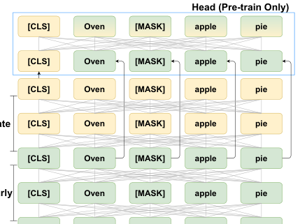

> 原文: [arXiv:2104.08253](https://arxiv.org/abs/2104.08253)（EMNLP 2021）
> local PDF: `docs/papers/embedding/Condenser_2104.08253.pdf`
> 说明: 本文为论文全文中文技术展开，公式编号与原文一致；图片自 PDF 抽取，caption 中译；表格数值保留原始数字，仅表头/说明中译。

**预印本信息：** arXiv:2104.08253v2 [cs.CL]，2021 年 9 月 20 日更新；会议版本：EMNLP 2021。

**代码：** https://github.com/luyug/Condenser

---

# Condenser：面向稠密检索的预训练架构（Condenser: a Pre-training Architecture for Dense Retrieval）

**作者：** Luyu Gao、Jamie Callan

**单位：** 卡耐基梅隆大学语言技术研究所（Language Technologies Institute, Carnegie Mellon University）

**邮箱：** {luyug, callan}@cs.cmu.edu

---

## 摘要（Abstract）

预训练 Transformer 语言模型（如 BERT）如今是文本表征编码器的默认选择。既有工作把它微调成把句子/段落编码为**单向量稠密表示**的编码器（bi-encoder / 稠密编码器），供高效检索使用。但这样的稠密编码器**训练很吃数据、也需要复杂的微调技巧**，在低数据场景下表现尤其糟糕。

作者指出一个关键原因：**标准语言模型的内部注意力结构并不适合稠密编码器**——它没有被训练成"把一整句话的信息压缩到一个稠密向量里"。为此提出 **Condenser**——一个新的 Transformer 预训练架构。Condenser 的核心思路：**让语言模型预测显式地建立在稠密表示（DENSE Representation）之上**。实验显示，Condenser 在多个文本检索与相似度任务上大幅优于标准语言模型。

**代码：** https://github.com/luyug/Condenser

---

## 1 引言（Introduction）

**背景**。语言模型预训练已成为学习强文本编码器的标准范式（Peters et al., 2018; Devlin et al., 2019）。BERT（Devlin et al., 2019）为代表的双向 Transformer 编码器是当前 SOTA。近期工作将 CLS 标记微调为单向量表示（Lee et al., 2019; Chang et al., 2020; Karpukhin et al., 2020），得到所谓的**稠密编码器**或 **bi-encoder**。微调让向量间的相似度与文本相似度或相关性挂钩，随后可用向量内积做高效检索。

**问题**：稠密编码器难训。即便数据充足，还需要精心设计的**训练技巧**（Xiong et al., 2021; Qu et al., 2020; Lin et al., 2020）；低数据场景下性能大幅下滑（Karpukhin et al., 2020; Thakur et al., 2020; Chang et al., 2020）。

**cross-encoder 对比**。同一个 BERT 作 cross-encoder（把 query-passage 拼接联合编码）时训练轻松、少量数据也能达到好效果（Devlin et al., 2019; Yang et al., 2019）。既然 backbone 相同、语言理解能力相仿，**bi-encoder 训练困难必定来自 encoder 的内部结构**。

作者的分析（借用 Clark et al. 2019 对 BERT 注意力的研究）指出：

1. BERT 的 CLS 标记在**大部分中间层**里的注意力模式与其它 token 相仿，并没有被其它 token 特别 attend；
2. 只有**最后一层**，CLS 才展开广泛的全局注意力以完成 NSP 任务。

即 CLS 大部分时间在"休眠"，只在最后一层被唤醒。作者用 **structural readiness（结构就绪度）** 这个词概括：BERT 的内部结构并**没有做好** 承担"信息聚合到 CLS"的准备。微调稠密编码器时，大量参数更新首先要把整个网络的注意力结构改造过来——**这才是低数据场景失灵的根本原因**。

**贡献**：作者提出 Condenser 架构，**在预训练阶段就为 bi-encoder 建立结构就绪度**。Condenser 在句子相似度、QA 段落检索、Web 搜索检索多个任务上取得强性能；低数据下与 ICT 等任务专用预训练模型持平，高数据下配合简单单轮 hard negative 挖掘即可超过复杂微调流水线（如 RocketQA）。

---

## 2 相关工作（Related Work）

**Transformer bi-encoder**。SBERT（Reimers & Gurevych, 2019）首次把 BERT 训成 bi-encoder；随后被扩展到稠密检索（Lee et al., 2019; Chang et al., 2020; Karpukhin et al., 2020）。

**稠密检索**。cross-encoder 精度高但延迟高（Gao et al., 2020; MacAvaney et al., 2020）；bi-encoder 通过 MIPS 索引（Johnson et al., 2017; Guo et al., 2020）可做毫秒级全库检索。也有稀疏系（如 SPLADE、SNRM，Gao et al., 2021a）用可学习稀疏向量做检索。

**Bi-encoder 预训练**。ICT（Lee et al., 2019）把 span 与其上下文互作 (q, k) 训 bi-encoder；Chang et al. (2020) 系统研究几种预训练任务，发现无预训练下低数据几乎不可用。REALM（Guu et al., 2020）端到端训 retriever + reader。这些都是**任务专用**的预训练。Condenser 不同——它**改的是 LM 预训练本身**，一次训练可用于所有下游任务。

**微调技巧**。作者引 DPR（Karpukhin et al., 2020）、ANCE（Xiong et al., 2021）、RocketQA（Qu et al., 2020）等复杂微调 pipeline。Condenser 的立场是：**这些技巧都在改梯度**，Condenser 改的是**初始化**。§4 会证明结构就绪的初始化能在很多情况下省去这些复杂技巧。

**多向量表示**（Luan et al., 2020）：另一条思路是绕开"单向量容量瓶颈"。Condenser 承认单向量有容量上限，但先关注"训练效率"——两条路正交，可以叠加。

**通用句向量**（Kiros et al., 2015; Conneau et al., 2017; Cer et al., 2018）：这些方法把嵌入当作 feature，不做端到端微调。本文的语境是任务专用微调，与之不同。

---

## 3 方法（Method）

### 3.1 预备（Preliminaries）

**Transformer 编码器**。给定文本序列 $x = [x_1, x_2, \dots]$，先嵌入再过 $L$ 个自注意力 Transformer 块：

$$
h_0 = \operatorname{Embed}(x) \tag{1}
$$

$$
h_l = \operatorname{Transformer}_l(h_{l-1}) \tag{2}
$$

**MLM 预训练**。BERT-style 编码器主要用 MLM（Masked Language Model）预训练：随机 mask 一部分 token $x_i$，用最后一层 $h_L^i$ 预测原 token：

$$
\mathcal{L}_{\text{mlm}} = \sum_{i \in \text{masked}} \operatorname{CE}(W\,h_L^i,\; x_i) \tag{3}
$$

一个特殊 token CLS 拼在序列首、与其它 token 一同编码：

$$
[h_0^{\text{cls}};\; h_0] = \operatorname{Embed}([\text{CLS};\; x]) \tag{4}
$$

$$
[h_l^{\text{cls}};\; h_l] = \operatorname{TF}_l\bigl([h_{l-1}^{\text{cls}};\; h_{l-1}]\bigr) \tag{5}
$$

有些模型（BERT）在预训练里显式用 CLS 做 NSP，另一些（XLNet、RoBERTa）不显式训练 CLS。

### 3.2 Transformer 编码器的问题（Issues with Transformer Encoder）

Transformer 里所有 token（包括 CLS）**只能通过自注意力**接收其它 token 的信息。所以，CLS 的**注意力模式** 决定了它能不能有效聚合信息。借用 Clark et al. (2019) 的分析：

1. 中间层里，CLS 的注意力模式与普通 token **没什么两样**，并且不被其它 token 特别 attend；
2. 直到**最后一层**，CLS 才展开对全序列的宽注意力（为了做 NSP）。

即 CLS 在中间层处于**休眠**状态。作者认为：**一个能干的 bi-encoder 应当从每一层就开始逐渐聚合各种粒度的信息**。BERT 显然没有这样的结构，稠密编码器微调时的很多梯度都在**改注意力结构**，而非学好表示。作者称之为 **structural readiness（结构就绪度）** 缺失。§4 会用实验验证，§5 会用注意力熵定量证明。

### 3.3 Condenser 架构（Condenser Architecture）

Condenser 是一个把 Transformer 分成三段的架构：

**图 1（原文对应图）：** Condenser 架构。图示为 2 early + 2 late layer 的简化版；作者实验里各为 6 层。Condenser Head **只在预训练时存在**，微调前丢弃。

具体地，输入文本先加 CLS 拼接嵌入，然后过：

1. **早期主干（early backbone）** $L_e$ 层：产生 $[h_{\text{cls}}^{\text{early}};\; h^{\text{early}}]$

$$
[h_{\text{cls}}^{\text{early}};\; h^{\text{early}}] = \operatorname{Encoder}_{\text{early}}\bigl([h_0^{\text{cls}};\; h_0]\bigr) \tag{6}
$$

2. **后期主干（late backbone）** $L_l$ 层：继续处理，产生 $[h_{\text{cls}}^{\text{late}};\; h^{\text{late}}]$

$$
[h_{\text{cls}}^{\text{late}};\; h^{\text{late}}] = \operatorname{Encoder}_{\text{late}}\bigl([h_{\text{cls}}^{\text{early}};\; h^{\text{early}}]\bigr) \tag{7}
$$

3. **Condenser Head** $L_h$ 层：**关键设计**——head 的输入是一对"晚期 CLS + 早期 token"：

$$
[h_{\text{cls}}^{\text{cd}};\; h^{\text{cd}}] = \operatorname{CondenserHead}\bigl([h_{\text{cls}}^{\text{late}};\; h^{\text{early}}]\bigr) \tag{8}
$$

Head 输出上做 MLM：

$$
\mathcal{L}_{\text{mlm}} = \sum_{i \in \text{masked}} \operatorname{CE}\bigl(W\, h_i^{\text{cd}},\; x_i\bigr) \tag{9}
$$

**关键点**：Condenser Head 接收的 token 表征是 **early 层的**——被 mask 的位置也来自 early 层。Head 唯一能从 late 层拿到的信息，就是**一个 CLS 向量** $h_{\text{cls}}^{\text{late}}$。如果 late backbone 学到了什么新信息，就**必须**通过 late CLS 传给 head 才能参与 MLM 预测。这就迫使 late CLS 变成一个"信息压缩器"（Condenser 的名字来源）。

同时，把早期 token 短路接入 head，**免除 head 处理表层语法的负担**，把 CLS 的容量释放出来专门存全局语义。$L_e, L_l$ 的划分控制这种分工。

Condenser 的架构启发自 Funnel Transformer（Dai et al., 2020），后者从 U-Net（Ronneberger et al., 2015）借鉴而来，用短路把长表示传递到解码端。Funnel 是为了加速预训练；Condenser 是为了让 CLS 学会稠密聚合。

**微调**：直接把 Condenser Head 丢掉，剩下的 $L_e + L_l$ 层与 BERT 结构完全一致，可作为标准 Transformer encoder 微调。微调训练目标是 late CLS $h_{\text{cls}}^{\text{late}}$，梯度反传到整个主干。**Condenser 微调时可以看作 BERT 的替换权重**——同容量、同接口，只是初始化更适合 bi-encoder。

### 3.4 从 Transformer Encoder 初始化 Condenser（Warm-start）

从零训 Condenser 代价高。作者采用**从 BERT 初始化 Condenser 主干、随机初始化 Head** 的策略。但随机 Head 的梯度会毁坏 BERT 主干权重——为此加一个语义约束：**让 late 主干输出也能做 MLM**：

$$
\mathcal{L}_{\text{mlm}}^c = \sum_{i \in \text{masked}} \operatorname{CE}\bigl(W\, h_i^{\text{late}},\; x_i\bigr) \tag{10}
$$

即 late 层 token 表征直接做 MLM 预测，与 Head 的 MLM 共享投影矩阵 $W$。总损失：

$$
\mathcal{L} = \mathcal{L}_{\text{mlm}} + \mathcal{L}_{\text{mlm}}^c \tag{11}
$$

直觉：per-token 表征 $h^{\text{late}}$ 与 sequence 表征 $h_{\text{cls}}^{\text{late}}$ 用的是**共享的深层**，可以互不冲突；即使 Head 反传出坏梯度，$\mathcal{L}_{\text{mlm}}^c$ 也能"锚住"主干不至于崩坏。作者把这条约束视作 warm-start 的技术要点。

---

## 4 实验（Experiments）

### 4.1 预训练（Pre-training）

**架构**：BERT-base 初始化主干，$L_e = L_l = 6$，head 随机初始化 2 层，共 12 + 2 = 14 层。预训练数据与 BERT 完全一致：英文 Wikipedia + BookCorpus。**Condenser 与 BERT 只在架构上不同**，方便直接对比。

**训练**：AdamW，lr $10^{-4}$，warmup 0.1，训 8 epoch，batch 128 / GPU × 4 RTX 2080Ti 梯度累积 ≈ 一周。作者说明：受算力限制，未系统调节 layer split、head 大小、超参——留待后续研究。

预训练完成后丢弃 head。所有下游微调实验共用这一份权重。

### 4.2 句子相似度（Sentence Similarity）

**数据**：

- **STS-b**（Cer et al., 2017）：GLUE 的语义相似度基准，训练集小（~6K），Spearman 相关。
- **Wiki Section Distinction**（Ein Dor et al., 2018）：给一对句子，判断是否来自同一 Wikipedia section（约 1.8M 训练对，与 BERT 的 NSP 极为相似）。

**基线**：BERT；BERT + NLI（Reimers & Gurevych 2019 用 3 分类损失在 NLI 上做过预训练的 BERT）；Non-BERT 基线：GloVe、Infersent、USE。

**结果**（表 1、表 2）：

**表 1：STS-b（测试集 Spearman 相关）**

| 模型 | 全量 |
| :--- | ---: |
| GloVe | 58.0 |
| Infersent | 68.0 |
| USE | 74.9 |
| BERT（train 500） | 68.6 |
| BERT（train 1K） | 71.4 |
| BERT（train FULL） | 82.5 |
| BERT + NLI（train 500） | 76.4 |
| BERT + NLI（train 1K） | 76.8 |
| BERT + NLI（train FULL） | 84.7 |
| **Condenser（train 500）** | **76.6** |
| **Condenser（train 1K）** | **77.8** |
| **Condenser（train FULL）** | **85.6** |

- Condenser 在**任何训练规模**下均优于 BERT，与 NLI 预训练的 BERT 持平或略好。
- 仅用 500 条训练对，Condenser 就超过 USE 全量基线。

**表 2：Wiki Section Distinction（测试集准确率）**

| 模型 | 1K | 10K | 全量 |
| :--- | ---: | ---: | ---: |
| skip-thoughts | — | — | 0.62 |
| BiLSTM | n.a. | n.a. | 0.74 |
| BERT | 0.72 | 0.75 | 0.80 |
| **Condenser** | **0.73** | **0.76** | **0.80** |

- 两者持平。这项任务与 BERT 的 NSP 目标高度重叠，BERT 天然占优。即便如此，Condenser 没有拿 NSP 训练也**没输**——说明它靠自己的架构补齐了 NSP 的效果。

### 4.3 开放域 QA 检索（Retrieval for Open QA）

**任务**：给定问题 $q$，在语料 $C$（Wikipedia dump）里找出相关段落。用 DPR 的实验设置：contrastive loss + BM25 hard negatives / mined hard negatives。损失：

$$
\mathcal{L} = -\log \frac{\exp\bigl(s(q, d^+)\bigr)}{\exp\bigl(s(q, d^+)\bigr) + \sum_l \exp\bigl(s(q, d_l^-)\bigr)} \tag{12}
$$

**数据**：Natural Questions（NQ）+ Trivia QA（TQA），DPR 清洗后的 Wikipedia 语料，各约 60K 训练查询。测试用 top-20/100 Hits。

**基线**：BM25、GAR、DPR、DPR + HN、ANCE、RocketQA。低数据实验用 BM25 hard negatives，全量实验用 mined hard negatives。

**表 3：低数据实验（top-20/100 Hits，BM25 hard neg）**

| 模型 / 训练规模 | NQ Top-20 (1K) | Top-20 (10K) | Top-20 (FULL) | Top-100 (1K/10K/FULL) | TQA Top-20 (1K/10K/FULL) | Top-100 (1K/10K/FULL) |
| :--- | ---: | ---: | ---: | ---: | ---: | ---: |
| BM25 | — | — | 59.1 | 73.7 | — | 76.7 |
| BERT | 66.6 | 75.9 | 78.4 | 79.4/84.6/85.4 | 68.0/75.0/79.3 | 78.7/82.3/84.9 |
| ICT (from Lee 2019) | **72.9** | 78.4 | 80.9 | **83.7**/85.9/87.4 | 73.4/77.9/79.7 | 82.3/84.8/85.3 |
| **Condenser** | 72.7 | 78.3 | 80.1 | 82.5/85.8/86.8 | **74.3**/**78.9**/**81.0** | 82.2/85.2/**86.1** |

关键观察：

- ICT 与 Condenser 都显著优于 BERT，尤其 1K 训练时差距最大。
- 二者接近；ICT 在 NQ 略胜（因 ICT 就是为 NQ 类任务设计的），Condenser 在 TQA 略胜。
- **通用 LM 预训练的 Condenser 与任务专用 ICT 效果相当**——不需要为每个任务设计新的预训练目标。

**表 4：全量数据（top-20/100 Hits）**

| 模型 | NQ Top-20 | NQ Top-100 | TQA Top-20 | TQA Top-100 |
| :--- | ---: | ---: | ---: | ---: |
| BM25 | 59.1 | 73.7 | 66.9 | 76.7 |
| GAR | 74.4 | 85.3 | 80.4 | 85.7 |
| DPR | 78.4 | 85.4 | 79.3 | 84.9 |
| DPR + HN | 81.3 | 87.3 | 80.7 | 85.8 |
| ANCE | 81.9 | 87.5 | 80.3 | 85.3 |
| RocketQA | 82.7 | 88.5 | n.a. | n.a. |
| **Condenser** | **83.2** | 88.4 | **81.9** | **86.2** |

- NQ 上 Top-20 SOTA，Top-100 与 RocketQA 差 0.1；无需 RocketQA 的复杂 pipeline。
- TQA 上双榜 SOTA，甚至超过用 BART 做 query 扩展的 GAR。

### 4.4 Web 搜索检索（Retrieval for Web Search）

**数据**：MS-MARCO passage ranking，含 Bing 查询与网页段落，~500K 训练查询。用 RocketQA 预处理版本。测试 MS-MARCO Dev（MRR@10、Recall@1K）与 TREC DL2019（NDCG@10）。

**训练**：contrastive loss，lr 5e-6，3 epoch on RTX 2080Ti；每 query 配 8 段（total batch 64）。低数据用 BM25 hard neg；全量用 Condenser 自己挖的 hard neg。

**基线**：低数据比 BERT、ICT、Condenser；全量比 BM25 / DeepCT / DocT5Qry / DPR / DPR+HN / ME-BERT / ANCE / TCT / RocketQA。RocketQA 全量含**外部数据**，为公平比较不用外部数据的变体放主表。

**表 5：低数据（BM25 hard neg）**

| 模型 / Train | MRR@10 (1K/10K/FULL) | R@1K (1K/10K/FULL) | NDCG@10 (1K/10K/FULL) |
| :--- | ---: | ---: | ---: |
| BM25 | 0.184 | 0.853 | 0.506 |
| BERT | 0.156/0.228/0.309 | 0.786/0.878/0.938 | 0.424/0.555/0.612 |
| ICT | 0.175/0.251/0.307 | 0.847/0.905/0.945 | 0.519/0.585/0.624 |
| **Condenser** | **0.192**/**0.258**/**0.338** | **0.852**/**0.914**/**0.961** | **0.530**/**0.591**/**0.648** |

- 1K 训练时 Condenser 就超过 BM25，BERT 与 ICT 都不能。
- 10K（2% 全量）时全 dense retriever 超过 BM25，Condenser 领先。
- Condenser 10K 的 Recall@1K 与 BERT 全量相当，展现出色的样本效率。

**表 6：MS-MARCO 全量训练**

| 模型 | MRR@10 | R@1K | NDCG@10 |
| :--- | ---: | ---: | ---: |
| BM25 | 0.189 | 0.853 | 0.506 |
| DeepCT | 0.243 | 0.909 | 0.572 |
| DocT5Qry | 0.278 | 0.945 | 0.642 |
| BERT | 0.309 | 0.938 | 0.612 |
| BERT + HN | 0.334 | 0.955 | 0.656 |
| ME-BERT | 0.334 | n.a. | 0.687 |
| ANCE | 0.330 | 0.959 | 0.648 |
| TCT | 0.335 | 0.964 | 0.670 |
| RocketQA*（无外部数据变体） | 0.364 | n.a. | n.a. |
| **Condenser** | **0.366** | **0.974** | **0.698** |

- Condenser 在所有指标上 SOTA，且**没用**任何复杂 pipeline。
- Recall@1K 达 0.974，超越所有基线，显示 Condenser 的召回上限极强。

**表 7：与 RocketQA 各变体的深入对比**

| 系统 | Batch | MRR@10 |
| :--- | ---: | ---: |
| RocketQA Cross-batch | 8192 | 0.333 |
| + Hard negatives | 4096 | 0.260 |
| + Denoise（CE 去噪） | 4096 | 0.364 |
| + 数据增广 | 4096 | 0.370 |
| **Condenser（BM25 neg）** | 64 | 0.338 |
| **Condenser（+ hard neg）** | 64 | **0.366** |

- **Condenser + batch 64 + BM25 neg 就超过 RocketQA + batch 8192 + hard neg + denoise 之前的所有中间态**。
- RocketQA 加了 hard neg 会掉分（0.333 → 0.260）——mined hard neg 里的假负例伤到了它。**Condenser 没有这个问题**：直接用 mined hard neg 就能进一步涨（0.338 → 0.366）。
- 作者的解释：Condenser 挖的 hard neg 质量更高，假负例更少——**好模型挖出的 hard neg 是可以直接用的**，这与 RocketQA 的结论相反。

### 4.5 补充观察

作者的 BERT + HN 实验意外发现"直接用 mined hard neg" 相当有效，甚至比 ANCE 的**多轮**主动挖掘还好；这与 RocketQA 结论相反。作者推测原因是**hard neg 的质量取决于挖它的 retriever**——用更强的 retriever 挖出来的 hard neg 会更好。

---

## 5 注意力分析（Attention Analysis）

Condenser 的核心假设是"BERT 缺乏适合 bi-encoder 的注意力结构"。§4 用性能验证了这一假设，本节从**注意力熵**给出定量证据。

用 Clark et al. (2019) 的方法度量 CLS 的注意力熵：在每一层，把所有 head 的注意力分布对 CLS 的输出方向取平均，然后计算熵。**熵高**表示注意力分散（关注整个序列）；**熵低**表示聚焦。在 1000 条随机 Wikipedia section 上平均。

**图 2（原文对应图）：** 三种模型的 CLS 注意力熵（预训练 vs 微调后），分 (a) BERT / (b) ICT / (c) Condenser 三个子图。横轴为 layer index（0–11），纵轴为熵。可见：

1. **BERT**：预训练与微调后的曲线**差异极大** ——BERT 需要在微调中大幅改造注意力结构才能变成 bi-encoder。这印证了作者的观点。
2. **ICT**：预训练与微调后的曲线**几乎一致**，说明 ICT 预训练已经把结构调教到位。
3. **Condenser**：也几乎一致，与 ICT 类似，但通过完全通用的 LM 预训练达成。

值得注意的是：ICT 与 Condenser 都在**后期层**表现出更宽的注意力（更高熵）——检索任务需要在深层聚合高层概念，两者都学到了这一模式。**Condenser 通过通用 LM 预训练学到了 ICT 通过任务特定预训练学到的注意力结构**——这就是"结构就绪度"的具体表现。

---

## 6 结论（Conclusion）

作者提出**结构就绪度**的概念：BERT 类预训练模型没有为 bi-encoder 准备好内部注意力结构，导致微调稠密编码器需要复杂技巧、低数据下表现差。Condenser 通过在预训练阶段强制"CLS 主动聚合信息"来建立结构就绪度。实验显示 Condenser 在句子相似度、开放域 QA 检索、Web 搜索检索三类任务上都表现优异：

- **低数据**下与 ICT 等任务专用预训练相当；
- **全量数据**下配合简单单轮 hard neg + contrastive loss 即可超过 RocketQA 等复杂微调 pipeline。

同时提示：mined hard negatives 的质量取决于挖它的 retriever，好模型挖出的 hard neg 可以直接用，无需 CE 去噪。

局限性：Condenser 只解决"训练效率"问题；单向量的**容量上限**问题（Luan et al., 2020）需要与多向量方法（如 ColBERT、ME-BERT）结合来突破。

---

## 附录索引（Appendix Highlights）

- **A.1** 预训练超参数：AdamW，lr 1e-4，warmup 0.1，batch 128/GPU × 4 卡，训 8 epoch。
- **A.3** 关于 ICT 基线的选择：作者尝试自行训练 ICT，但因单卡 batch 太小效果差，故引用 Lee et al. (2019) 的 batch 4096 版本作公平对比。
- **A.4** 长文档检索附加实验：MS MARCO Document Ranking。

---

*翻译约定：稠密编码器（dense encoder）、bi-encoder（bi 编码器）、cross-encoder（cross 编码器）、CLS 标记（CLS token）、结构就绪度（structural readiness）、注意力熵（attention entropy）、掩码语言建模（MLM）、Head（预训练用的头部）、hard negative（难负例）。DPR / ANCE / ICT / RocketQA / BEIR / MS-MARCO / NQ / TQA / STS-b 按惯例不译。*
