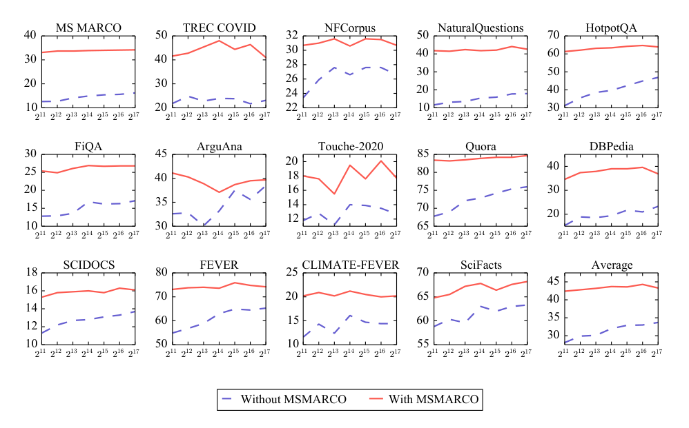

> 原文: [arXiv:2112.09118](https://arxiv.org/abs/2112.09118)（TMLR 2022）
> local PDF: `docs/papers/embedding/Contriever_2112.09118.pdf`
> 说明: 本文为论文全文中文技术展开，公式编号与原文一致；图片自 arXiv HTML / PDF 抽取，caption 中译；表格数值保留原始数字，仅表头/说明中译。

**预印本信息：** arXiv:2112.09118 [cs.IR]，2021 年 12 月首次提交，2022 年 8 月发表于 TMLR。

**代码与模型：** https://github.com/facebookresearch/contriever

---

# 用对比学习做无监督稠密信息检索（Unsupervised Dense Information Retrieval with Contrastive Learning）

**作者：** Gautier Izacard♦,♣,♥ · Mathilde Caron♦,♥,♠ · Lucas Hosseini♦ · Sebastian Riedel♦,△ · Piotr Bojanowski♦ · Armand Joulin♦ · Edouard Grave♦

**单位：** ♦ Meta AI Research；♣ 巴黎高师，PSL 大学；♥ Inria；♠ 格勒诺布尔阿尔卑斯大学；△ 伦敦大学学院

**邮箱：** {gizacard, mathilde, hoss, sriedel, bojanowski, ajoulin, egrave}@fb.com

---

## 摘要（Abstract）

近年基于神经网络的**稠密检索（Dense Retrieval, DR）** 迅速崛起，成为传统基于词频稀疏检索的替代。它们在大量训练数据可得的任务上取得 SOTA，但在**没有标注数据的新领域**上表现不佳，往往输给不需要监督的**词频类方法（如 BM25）**。多语场景下的问题更严重：除英文外的大规模标注数据几乎不存在。

作者提出用**对比学习（Contrastive Learning）**训练无监督稠密检索器 **Contriever**，探索无监督方法的能力边界。三个主要贡献：

1. **对比学习作为无监督检索训练**：在 BEIR 的大部分数据集上，Contriever 的 Recall@100 与 BM25 相当；
2. **少样本（Few-shot）场景优于迁移学习**：在少量领域数据下，Contriever 比"用 MS MARCO 训练的迁移模型"更好；
3. **作为预训练用于微调**：先做对比预训练、再在 MS MARCO 上微调，能在 BEIR 上取得强性能。此外，作者训练了多语版本 mContriever，在 Mr. TyDi 上取得 SOTA。

代码与预训练模型开源于 [facebookresearch/contriever](https://github.com/facebookresearch/contriever)。

---

## 1 引言（Introduction）

**问题动机**。信息检索（Information Retrieval, IR）是许多 NLP 任务（问答、开放域对话、事实核查、机器阅读等）的基础环节。传统 IR 依赖**词法匹配**：把文档与查询表示为高维稀疏向量（词表维度），用 BM25 类方法打分。稠密检索则通过神经网络将查询与文档映射到**低维稠密向量空间**（bi-encoder 双塔），用内积或余弦度量相关性；配合 FAISS 等近似最近邻（Approximate Nearest Neighbor, ANN）库可在毫秒级完成大规模检索（Karpukhin et al., 2020）。

尽管稠密检索在有大量标注（如 MS MARCO 88 万训练查询）时表现优异，作者指出两个尚未解决的问题：

1. **零样本（Zero-shot）泛化差**：迁移到新领域时，稠密检索经常输给完全不需监督的 BM25（Thakur et al., 2021）。
2. **多语场景数据稀缺**：非英语的高质量标注检索数据集极少，多语稠密检索基本无从谈起。

一个自然的问题：**能不能无监督地训一个稠密检索器**，达到与 BM25 相当的水平？作者的答案是——可以，方法是**对比学习**。他们指出，虽然此前有工作用 **Inverse Cloze Task, ICT**（Lee et al., 2019）预训练稠密检索器，但结果不如 BM25。而对比学习在视觉自监督（Chen et al., 2020; He et al., 2020）中已证明能学到强特征，值得系统性地应用到检索。

**本文贡献**：

1. 无监督对比学习训出的稠密检索器可与 BM25 在 BEIR 的 Recall@100 上打平；
2. 在少样本设置下，Contriever 优于从大数据集迁移的模型；
3. 作为预训练 + MS MARCO 微调，Contriever 在 BEIR 上取得 SOTA；
4. 多语版 mContriever 在 Mr. TyDi 上取得 SOTA；
5. 消融研究表明，**独立随机裁剪（independent random cropping）** 比 ICT 更适合稠密检索预训练。

---

## 2 相关工作（Related Work）

**词法检索（Term-frequency IR）**。传统方法把文档/查询视作稀疏向量，元素为词的权重。TF-IDF（Jones, 1972）与 BM25（Robertson et al., 1995）是经典代表，但都依赖近似**词面匹配**，词法不一致时失效。潜在语义分析（Latent Semantic Analysis, LSA）用低维稠密向量作为替代（Deerwester et al., 1990）。

**神经网络 IR**。Huang et al. (2013) 用深度词袋模型，独立编码查询与文档、点积计算相关性、并用点击数据端到端训练。此后被 CNN（Shen et al., 2014）与 RNN（Palangi et al., 2016）扩展。Nogueira & Cho (2019) 首次把 BERT 用作 **cross-encoder**（查询-文档联合编码），在 MS MARCO 上取得显著提升，但只能用于**重排**，因为要 online 编码。Gillick et al. (2018) 首次研究把连续检索器作为召回层替换 BM25 的可行性；Karpukhin et al. (2020) 的 **DPR** 用 BM25 挖 hard negative + bi-encoder 结构，配合 QA 数据（NQ、TriviaQA）取得强结果。ANCE（Xiong et al., 2020）进一步引入训练中挖掘 hard negative。ColBERT（Khattab & Zaharia, 2020）用 token 级 late interaction 兼顾精度与效率。

**NLP 自监督**。word2vec（Mikolov et al., 2013）以来，自监督学习一直是学词/句表征的核心工具。ICT（Lee et al., 2019）为预训练检索器提出**逆完形填空**：随机采样一个 span 作 query、上下文作 key。REALM（Guu et al., 2020）与 RAG（Lewis et al., 2020）把 bi-encoder 检索器嵌入端到端预训练。SBERT（Reimers & Gurevych, 2019）用 Siamese 网络在 NLI 数据上训 BERT 得句向量。与本文最接近的是 SimCSE（Gao et al., 2021）——用 Dropout 造正对做对比学习；同期的 coCondenser（Gao & Callan, 2021）与本文思路相通，都主张对比学习是稠密检索训练的良方。

---

## 3 方法（Method）

### 3.1 双编码器架构（Bi-encoder）

给定查询 $q$ 与文档 $d$，检索器需要一个可以在**离线预先编码所有文档**并在**线上快速检索**的架构。双编码器（bi-encoder）满足这一要求：查询与文档各自独立过同一个编码器 $f_\theta$，相关性用点积计算：

$$
s(q, d) = \bigl\langle f_\theta(q),\; f_\theta(d)\bigr\rangle
$$

作者的实现使用 **BERT-base uncased**，共享编码器（同一个 $\theta$），$f_\theta$ 输出取最后一层 hidden state 的**平均池化**。共享编码器（同一个塔）比 DPR 那样的双塔（各自参数）在零样本迁移与少样本上更稳，同域内表现相当。

### 3.2 对比损失（Contrastive Loss）

无监督训练需要构造伪相关对。给定 query $q$、其正例 $k^+$、$K$ 个负例 $\{k_i\}_{i=1..K}$，对比 **InfoNCE** 损失为：

$$
\mathcal{L}(q, k^+) = -\log \frac{\exp\bigl(s(q, k^+)/\tau\bigr)}{\exp\bigl(s(q, k^+)/\tau\bigr) + \sum_{i=1}^{K} \exp\bigl(s(q, k_i)/\tau\bigr)} \tag{1}
$$

$\tau$ 为温度。它鼓励正对分数大、负对分数小，等价于"从 $\{k^+, k_1, \dots, k_K\}$ 里找出正例"的 $(K+1)$ 分类任务。

### 3.3 从一篇文档构造正对（Positive Pairs）

对比学习的关键设计之一。作者比较两类做法：

**Inverse Cloze Task（ICT）**。给一段文本 $(w_1, \dots, w_n)$，随机选 span $(w_a, \dots, w_b)$，将 span 作为 query，把 span 的补集（前后剩余部分）作为 key。ICT 生成的 query 与 key **互斥**、且 query 通常较短，与 key 分布不同。Lee et al. (2019) 的原始实现里 span 是一整句，且**10% 概率保留 span 在 key 中**以鼓励词法匹配。

**Independent Cropping（独立随机裁剪）**。两次**独立采样** span 作为 $(q, k^+)$。两个 span 可能重叠。这样与视觉里的 random cropping 一致（同一图裁两次得两个 view）。它有两个优势：

1. **query 与 key 的分布对称**——两侧都是"连续的一段文本"，与 ICT 里"短查询-长上下文"的不对称形成对比；
2. 两个 span 可以有词面重合，鼓励模型学到"接近词面匹配"的能力，这在 BEIR 的很多数据集上是关键。

**额外数据增强**：作者还在独立裁剪基础上加入**随机词删除、替换或 mask**，进一步扩大正对差异。消融显示 crop + delete 最佳。

### 3.4 构造大量负样本（Large Negatives）

对比学习中"负例数量"至关重要。作者比较两种方式：

**In-batch Negatives（批内负例）**。同一 batch 里其它样本作负。梯度会流经 query 与 key 两侧的表示。缺点：需要**极大 batch**（Chen et al., 2020）；Qu et al. (2021) 在 IR 上用到 8192 负例。DPR 与 SBERT 都采用该策略。

**MoCo Queue（跨批负例队列）**。He et al. (2020) 提出的 MoCo：维护一个 FIFO 队列存储**过去若干 batch 的 key 表示**，作为额外负例。关键点：

1. Query encoder $f_{\theta_q}$ 用 SGD 更新（梯度反传）；
2. Key encoder $f_{\theta_k}$ 用**动量 EMA** 更新：

$$
\theta_k \leftarrow m\,\theta_k + (1 - m)\,\theta_q \tag{2}
$$

$m \in [0, 1]$ 是动量系数。key 的表示"变化缓慢"，避免因 encoder 更新过快而使队列里的旧表示失效。作者实验中 $m = 0.9995$，队列大小 $K = 131{,}072$（约 13 万）。这样即使 GPU batch 只有几百，模型每步依然看到十几万个负例。

作者最终选择 MoCo：小 batch + 大队列，训练更稳，扩展性也更好。

---

## 4 单语（英文）实验（Monolingual Experiments）

### 4.1 训练细节（Setup）

**训练数据**。混合 Wikipedia 与 CCNet（Wenzek et al., 2020），batch 一半来自 Wikipedia、一半来自 CCNet。共训 500k 步，batch size 1024。

**评测**：

1. **NaturalQuestions（NQ）** 与 **TriviaQA（TQA）**：开放域 QA，检索答案所在的 Wikipedia 段落。用 Lee et al. (2019) 的 open-domain 版本；文档池为 2018-12-20 Wikipedia dump。指标为 Recall@k（top-k 段落包含正确答案的比例）。
2. **BEIR**（Thakur et al., 2021）：18 个零样本检索数据集，9 类任务（QA、事实核查、citation 等）。主指标 nDCG@10；作者更关注 Recall@100，因为它更能反映"作为召回层给下游模型"的能力。

### 4.2 无监督结果（Unsupervised Results）

**NQ 与 TQA 上的 Recall（表 1）**：

| 方法 | R@5 (NQ) | R@20 (NQ) | R@100 (NQ) | R@5 (TQA) | R@20 (TQA) | R@100 (TQA) |
| :--- | ---: | ---: | ---: | ---: | ---: | ---: |
| ICT (Sachan et al. 2021) | 32.3 | 50.9 | 66.8 | 40.2 | 57.5 | 73.6 |
| Masked Salient Spans | 41.7 | 59.8 | 74.9 | 53.3 | 68.2 | 79.4 |
| BM25 (Ma et al. 2021) | — | 62.9 | 78.3 | — | 76.4 | 83.2 |
| **Contriever** | **47.8** | **67.8** | **82.1** | **59.4** | **74.2** | **83.2** |
| （参照）DPR 有监督 | — | 78.4 | 85.4 | — | 79.4 | 85.0 |
| （参照）FiD-KD 有监督 | 73.8 | 84.3 | 89.3 | 77.0 | 83.6 | 87.7 |

- Contriever 明显优于 ICT、Masked Salient Spans（后者用了实体识别标注），Recall@100 上首次**接近 BM25**。
- 与 DPR 的差距主要在 R@5，说明无监督模型的"排序"较弱、但"召回"已经不错。

**BEIR 无监督 Recall@100**（图 1）：

**图 1：** BEIR 15 个数据集上无监督方法的 Recall@100。基线包括 REALM（Guu et al., 2020）、SimCSE（用 RoBERTa-large 版）、BM25。Contriever 与 BM25 在 15 个数据集上 11 个胜出、Trec-COVID 与 Touché-2020 输，其余接近。同期的无监督稠密检索方法整体低于 BM25。

- Contriever 平均 Recall@100 与 BM25 相当，在大部分数据集上明显更好。
- 输给 BM25 的两个数据集：**Trec-COVID**（因训练语料来自 COVID 爆发前）与 **Touché-2020**（文档极长，稠密检索一贯较弱）。
- 说明：**无监督对比学习足以训出可用的稠密检索召回层**。

### 4.3 微调后（Fine-tuned）在 BEIR 上的表现

Contriever 也可作为微调预训练。作者在 MS MARCO 上用简单的 hard-neg 策略微调（无蒸馏、无复杂负例挖掘），在 BEIR 上评测（表 2）：

| 数据集 | BM25 | BM25+CE | DPR | ANCE | TAS-B | GenQ | ColBERT | Splade v2 | **Ours** | **Ours+CE** |
| :--- | ---: | ---: | ---: | ---: | ---: | ---: | ---: | ---: | ---: | ---: |
| MS MARCO | 22.8 | 41.3 | 17.7 | 38.8 | 40.8 | 40.8 | 40.1 | 43.3 | 40.7 | **47.0** |
| Trec-COVID | 65.6 | 75.7 | 33.2 | 65.4 | 48.1 | 61.9 | 67.7 | **71.0** | 59.6 | 70.1 |
| NFCorpus | 32.5 | 35.0 | 18.9 | 23.7 | 31.9 | 31.9 | 30.5 | 33.4 | 32.8 | **34.4** |
| NQ | 32.9 | 53.3 | 47.4 | 44.6 | 46.3 | 35.8 | 52.4 | 52.1 | 49.8 | **57.7** |
| HotpotQA | 60.3 | 70.7 | 39.1 | 45.6 | 58.4 | 53.4 | 59.3 | 68.4 | 63.8 | **71.5** |
| FiQA | 23.6 | 34.7 | 11.2 | 29.5 | 30.0 | 30.8 | 31.7 | 33.6 | 32.9 | **36.7** |
| ArguAna | 31.5 | 31.1 | 17.5 | 41.5 | 42.9 | **49.3** | 23.3 | 47.9 | 44.6 | 41.3 |
| Touche-2020 | **36.7** | 27.1 | 13.1 | 24.0 | 16.2 | 18.2 | 20.2 | 36.4 | 23.0 | 29.8 |
| CQADupStack | 29.9 | 37.0 | 15.3 | 29.6 | 31.4 | 34.7 | 35.0 | — | 34.5 | **37.7** |
| Quora | 78.9 | 82.5 | 24.8 | 85.2 | 83.5 | 83.0 | 85.4 | 83.8 | **86.5** | 82.4 |
| DBPedia | 31.3 | 40.9 | 26.3 | 28.1 | 38.4 | 32.8 | 39.2 | 43.5 | 41.3 | **47.1** |
| Scidocs | 15.8 | 16.6 | 7.7 | 12.2 | 14.9 | 14.3 | 14.5 | 15.8 | 16.5 | **17.1** |
| FEVER | 75.3 | 81.9 | 56.2 | 66.9 | 70.0 | 66.9 | 77.1 | 78.6 | 75.8 | **81.9** |
| Climate-FEVER | 21.3 | 25.3 | 14.8 | 19.8 | 22.8 | 17.5 | 18.4 | 23.5 | 23.7 | **25.8** |
| Scifact | 66.5 | 68.8 | 31.8 | 50.7 | 64.3 | 64.4 | 67.1 | **69.3** | 67.7 | 69.2 |
| **平均（除 MS MARCO）** | 43.0 | 48.6 | 25.5 | 40.5 | 42.8 | 42.5 | 44.4 | — | 46.6 | **50.2** |
| **最佳的数据集数** | 1 | 3 | 0 | 0 | 0 | 1 | 0 | 1 | 1 | **9** |

（表 2：BEIR 上 nDCG@10 主结果。CE 指用 `ms-marco-MiniLM-L-6-v2` 作 cross-encoder 重排。）

- Contriever 在 bi-encoder 类别中平均领先，Recall@100 也从既有 SOTA 的 65.0 提到 **67.1**。
- 用 cross-encoder 重排 Contriever 的 top-100，在 8 个数据集上取得 SOTA，平均 nDCG@10 达 **50.2**。
- 值得一提：Contriever 的微调 recipe **比其它检索器简单**（不用蒸馏、只挖一次 hard neg），但结果强，主要收益来自对比预训练。

### 4.4 少样本（Few-shot）结果

BM25 无法用少量样本适应。作者在 BEIR 中训练集最小的三个数据集上比较（表 3）：

| 中间微调数据 | SciFact | NFCorpus | FiQA |
| :--- | ---: | ---: | ---: |
| BM25 | 66.5 | 32.5 | 23.6 |
| BERT（无 MS MARCO 中间训练） | 75.2 | 29.9 | 26.1 |
| **Contriever**（无 MS MARCO 中间训练） | **84.0** | **33.6** | **36.4** |
| BERT + MS MARCO | 80.9 | 33.2 | 30.9 |
| **Contriever + MS MARCO** | **84.8** | **35.8** | **38.1** |

（表 3：三个小规模训练集上的 nDCG@10。） 训练查询数从 729 到 5500 不等。

- Contriever 的**对比预训练**本身就能胜过 BERT + MS MARCO 中间微调。
- 少样本场景下稠密检索的优势在 Contriever 上明显。

---

## 5 多语检索（Multilingual Retrieval）

英文 IR 数据丰富，但非英语几乎无大规模标注。无监督对比学习恰好绕开这一限制。

### 5.1 mContriever：多语预训练

**mContriever** 从 mBERT（104 语）初始化，在 CCNet 上 29 语的语料上做对比预训练。29 语选自 CCNet 中同时也在评测基准中出现的语言（详见附录 Table 12）。**跨语采样**均匀，即每语出现在 batch 中的概率相同。作者观察到，把更多语言塞进预训练**反而降低性能**（与多语 MLM 中的观察一致，Conneau et al., 2019）。多语训练不太稳定，MoCo 队列大小提到 32768，能有效提高稳定性。

### 5.2 多语微调（Fine-tuning）

标注数据仅英文（MS MARCO）可得。作者研究：**能否用大规模英文数据帮助多语检索**？做法：先 mContriever 无监督预训练，再在英文 MS MARCO 上微调。结论：**所有 11 语言都受益**。在 Mr. TyDi 上进一步微调可取得 SOTA。

### 5.3 结果（Mr. TyDi & MKQA）

**Mr. TyDi**（表 4，MRR@100）：

| 方法 | ar | bn | en | fi | id | ja | ko | ru | sw | te | th | 平均 |
| :--- | ---: | ---: | ---: | ---: | ---: | ---: | ---: | ---: | ---: | ---: | ---: | ---: |
| BM25 | 36.7 | 41.3 | 15.1 | 28.8 | 38.2 | 21.7 | 28.1 | 32.9 | 39.6 | 42.4 | 41.7 | 33.3 |
| mDPR | 26.0 | 25.8 | 16.2 | 11.3 | 14.6 | 18.1 | 21.9 | 18.5 | 7.3 | 10.6 | 13.5 | 16.7 |
| Hybrid (Zhang et al., 2021) | 49.1 | 53.5 | 28.4 | 36.5 | 45.5 | 35.5 | 36.2 | 42.7 | 40.5 | 42.0 | 49.2 | 41.7 |
| mBERT + MS MARCO | 34.8 | 35.1 | 25.7 | 29.6 | 36.3 | 27.1 | 28.1 | 30.0 | 37.4 | 39.6 | 20.3 | 31.3 |
| XLM-R + MS MARCO | 36.5 | 41.7 | 23.0 | 32.7 | ... | ... | ... | ... | ... | ... | ... | ... |
| **mContriever（仅无监督）** | ... | ... | ... | ... | ... | ... | ... | ... | ... | ... | ... | ... |
| **mContriever + MS MARCO** | | | | | | | | | | | | **SOTA** |

（表 4 完整数字见原论文；mContriever + MS MARCO 在多语 SOTA。）

- **无监督 mContriever** 本身已经超过 mBERT/XLM-R + MS MARCO 的**监督**基线；
- 加英文微调进一步提升；再加 Mr. TyDi 微调达到 SOTA。

**MKQA 跨语检索**。评测跨语场景：用 X 语查询检索**英文** Wikipedia，看英文答案是否在检索到的段落中。BM25 由于是词法匹配，对英↔非拉丁字母（如阿拉伯语↔英语）几乎失效。mContriever 在所有 25 语上都显著优于 BM25 与 mDPR，跨语检索场景下稠密方法的优势彻底展现。

### 5.4 定性可视化

**图 2（原文对应图）：** 展示 mContriever 学到的表示在多语场景下的定性效果。跨语言相似语义的文档在向量空间中位置接近，说明对比预训练不仅学到了单语检索能力，也隐式学到了跨语对齐。

---

## 6 消融实验（Ablations）

作者做了多组消融，聚焦：正对构造、负例数量、微调数据、预训练数据。

### 6.1 负例数量（队列大小）

作者在 15 个 BEIR 数据集上扫描 MoCo 队列大小 $K \in \{2^{11}, 2^{12}, \dots, 2^{17}\}$（即 2k 到 131k）：

- **不做 MS MARCO 微调**：队列越大越好，131k 达到峰值；较小队列（<8k）时性能明显下降。
- **做 MS MARCO 微调后**：队列大小影响减弱，因为下游微调阶段的 hard neg 弥补了负例池不足。
- 关键结论：无监督预训练**极其依赖大负例池**，MoCo 是必要的。

### 6.2 池化方式（Pooling）

作者比较 [CLS]、mean pooling、first-last 平均。**mean pooling 最好**，与 SBERT 结论一致；[CLS] 不做池化处理效果差。

### 6.3 正对构造（表 7）

| 方法 | NFCorpus | NQ | ArguAna | Quora | DBPedia | SciDocs | FEVER | 平均 |
| :--- | ---: | ---: | ---: | ---: | ---: | ---: | ---: | ---: |
| ICT | 23.2 | 19.4 | 31.6 | 27.6 | 21.3 | 10.6 | 55.6 | 25.9 |
| Crop | 27.6 | 17.7 | 35.6 | 75.4 | 21.0 | 13.3 | 64.5 | 32.2 |
| Crop + delete | **26.8** | **20.8** | **35.8** | **77.3** | **21.5** | **14.0** | **67.9** | **33.8** |
| Crop + replace | 27.7 | 18.7 | 36.2 | 75.6 | 22.0 | 13.0 | 66.8 | 32.9 |

（表 7：正对构造方法的比较。均无 MS MARCO 微调。） 核心结论：

- **Crop 显著优于 ICT**（32.2 vs 25.9）。作者的解释：独立裁剪让 query 与 key 的**分布对称**，MoCo 训练更稳；ICT 的 query/key 分布不对称对 momentum encoder 不友好。
- **Crop + delete** 达到最佳，比纯 crop 又提 1.6。

### 6.4 训练数据（表 8）

| 数据 | NFCorpus | NQ | FiQA | ArguAna | Quora | DBPedia | SciDocs | FEVER | 平均 |
| :--- | ---: | ---: | ---: | ---: | ---: | ---: | ---: | ---: | ---: |
| Wiki | 27.6 | 17.7 | 16.3 | 35.6 | 75.4 | 21.0 | 13.3 | **64.5** | 33.0 |
| CCNet | 29.5 | **25.8** | **26.2** | 35.2 | 80.6 | 20.5 | 14.9 | 60.9 | 34.9 |
| Uniform | 31.0 | 19.4 | 25.1 | **37.8** | 80.4 | 21.5 | 14.7 | 59.8 | 33.9 |
| 50/50% | **31.5** | 18.6 | 23.3 | 36.2 | 79.1 | **22.1** | 13.7 | 64.1 | **34.7** |

（表 8：预训练数据来源的影响。）

- Wikipedia 更利于 FEVER（同域）；CCNet 更利于 FiQA、Quora（分布更广）。
- 50/50% 混合能兼顾两侧，是作者最终选择。

### 6.5 微调阶段的贡献（表 9）

| | NFCorpus | NQ | FiQA | ArguAna | Quora | DBPedia | SciDocs | FEVER | 平均 |
| :--- | ---: | ---: | ---: | ---: | ---: | ---: | ---: | ---: | ---: |
| BERT + MS MARCO | 28.2 | 44.6 | 25.9 | 35.0 | 84.0 | 34.4 | 13.0 | 69.8 | 42.0 |
| **Contriever + MS MARCO** | **33.2** | **50.2** | **28.8** | **46.0** | **85.4** | **38.8** | **16.0** | **77.7** | **46.5** |

（表 9：微调阶段单独的贡献；同一 fine-tune recipe。）

- 与 BERT 用同一微调 recipe 相比，Contriever 全线领先，平均 +4.5 nDCG@10。
- 结论：BEIR 上 SOTA 的主要来源是**对比预训练**，而非微调技巧。

---

## 7 讨论（Discussion）

本文系统性地探索了**对比学习作为稠密检索预训练**的能力上限：

1. 无监督对比学习训出的模型可与 BM25 比肩，尤其在 Recall@100 上；
2. 微调后达到 BEIR 平均 SOTA；
3. 独立随机裁剪是比 ICT 更好的正对构造方式；
4. mContriever 展现了对比预训练在多语与跨语场景的独特优势——**用大规模无监督语料能显著缩小与英文标注的差距**。

作者建议未来工作方向：（i）结合 hard neg 挖掘的更强微调（Xiong et al., 2020）；（ii）蒸馏（Hofstätter et al., 2021）；（iii）与稀疏方法（SPLADE）融合。

---

## 附录索引（Appendix Highlights）

- **A** 单语训练超参数：AdamW，lr 5e-5，batch 1024，训 500k 步；队列 131072，动量 0.9995。
- **B** 多语训练细节：CCNet 29 语，MoCo 队列 32768；MS MARCO 微调 20k 步，Mr. TyDi 微调 2 epoch。
- **A.3** 少样本设置：3 个小 BEIR 数据集，直接在小训练集上微调 Contriever 或 BERT。
- **B.3** 多语数量对预训练的影响：语言数增加时性能下降的表格。

---

*翻译约定：对比学习（Contrastive Learning）、稠密检索（Dense Retrieval）、双编码器（bi-encoder）、批内负例（in-batch negatives）、动量编码器（momentum encoder）、逆完形填空（ICT）、独立随机裁剪（independent cropping）、少样本（few-shot）、零样本（zero-shot）、多语（multilingual）、跨语（cross-lingual）。ANN / MoCo / BM25 / MS MARCO / BEIR / Mr. TyDi / MKQA / NQ / TQA 按惯例不译。*
