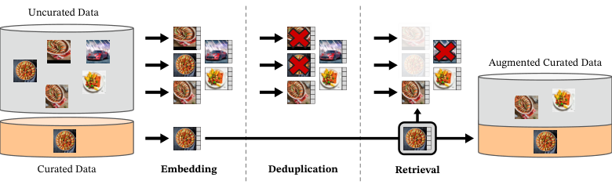
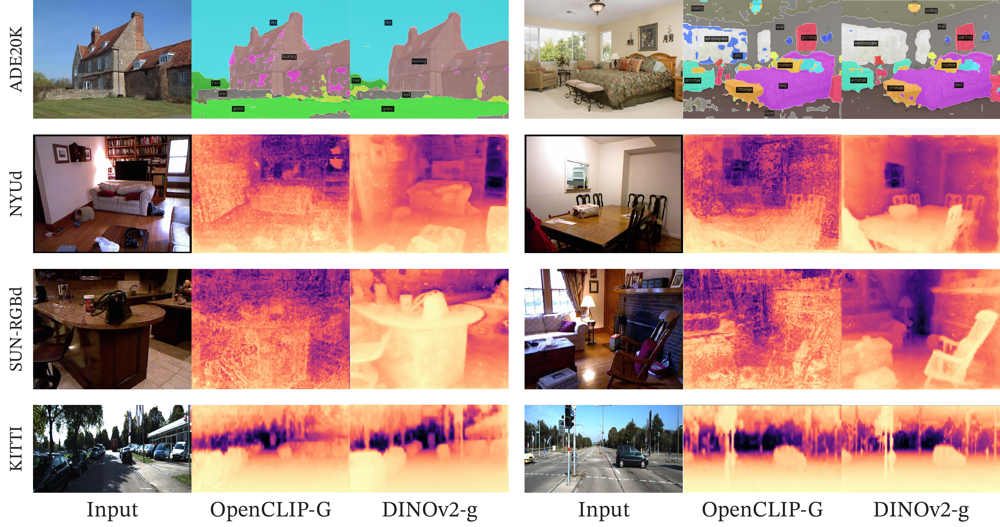
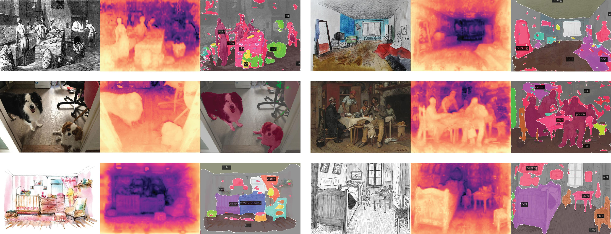
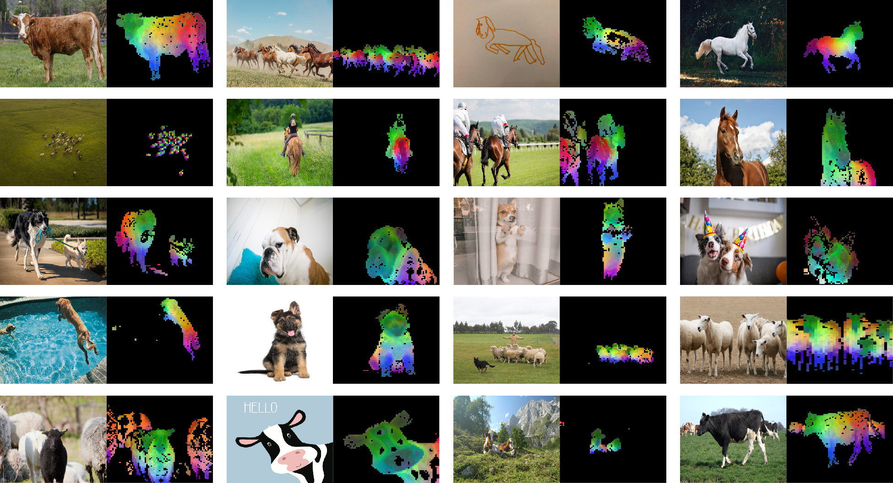
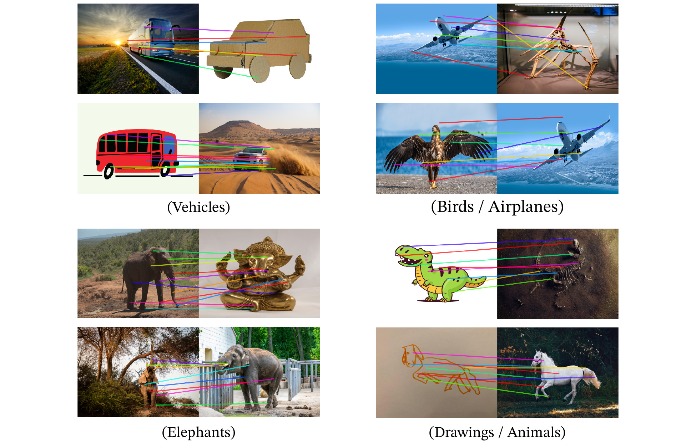

> 原文: [arXiv:2304.07193](https://arxiv.org/abs/2304.07193)（TMLR 2024）
> local PDF: `docs/papers/embedding/DINOv2_2304.07193.pdf`
> 说明: 本文为论文全文中文技术展开，公式/图表编号与原文一致；图片自 arXiv HTML 抽取，caption 中译；数值原样保留。

**发布信息：** Transactions on Machine Learning Research (01/2024)，arXiv:2304.07193v2 [cs.CV]，2024 年 2 月修订。

**开源：** [github.com/facebookresearch/dinov2](https://github.com/facebookresearch/dinov2) （Apache 2.0，模型 + 训练/评测代码）

---

# DINOv2：无需监督学习鲁棒视觉特征（DINOv2: Learning Robust Visual Features without Supervision）

**作者：** Maxime Oquab\*\*、Timothée Darcet\*\*、Théo Moutakanni\*\*、Huy V. Vo\*、Marc Szafraniec\*、Vasil Khalidov\*、Pierre Fernandez、Daniel Haziza、Francisco Massa、Alaaeldin El-Nouby、Mahmoud Assran、Nicolas Ballas、Wojciech Galuba、Russell Howes、Po-Yao Huang、Shang-Wen Li、Ishan Misra、Michael Rabbat、Vasu Sharma、Gabriel Synnaeve、Hu Xu、Hervé Jégou、Julien Mairal¹、Patrick Labatut\*、Armand Joulin\*、Piotr Bojanowski\*

**单位：** Meta AI Research；¹ Inria；Timothée Darcet、Pierre Fernandez 与 Inria 联合；Théo Moutakanni 与 Université Paris Saclay 联合；Alaaeldin El-Nouby 与 Inria、ENS-PSL 联合。

**通讯：** {qas, timdarcet, theomoutakanni, ajoulin, bojanowski}@meta.com

\* 核心团队，\*\* 同等贡献。

---

## 摘要（Abstract）

NLP 大规模预训练近年的突破打开了在 CV 上构造类似**基础模型**的通道——这类模型输出的**通用视觉特征**不需要微调就能跨图像分布、跨任务使用。本文表明：只要在**足够多、足够多样、经过甄选**的数据上训练，现有预训练方法（尤其是自监督类）就能得到这样的特征。作者重新审视既有做法，把多项技术组合起来，把预训练的**数据规模与模型规模**同时放大；大部分技术贡献放在**加速与稳定大规模训练**上。数据侧，作者提出一条**自动数据整理流水线**，构造**专用、多样、平衡**的图像数据集（LVD-142M），而不是像既有自监督工作那样直接吃未整理数据。模型侧，作者训练了一个 **1 B 参数 ViT**，再**蒸馏**到一系列小模型；这些小模型在图像级 / 像素级各主流基准上都超过了此前最好的通用特征——包括 OpenCLIP。

---

## 1 引言（Introduction）

**动机与目标。** NLP 里大规模无监督预训练已经把「一份预训练特征、无需微调、直接用于下游」变成新范式（GPT/PaLM/Chinchilla/LLaMA）。同样的路径在 CV 上被寄予厚望：能否有一个**「BERT for CV」**——通用视觉编码器，图像级（分类）与像素级（分割/深度）任务开箱即用？

**现有路径的局限。** 最有希望的做法是**文本引导预训练**（Joulin 2016；CLIP 2021）：用弱监督的图文对齐把语义压入视觉塔。但 caption 只是图像信息的近似，**像素级细节**很难通过 caption 涌现；另外它必须依赖**对齐的图文语料**，失去了纯图像可用的灵活度。**纯自监督**（SimCLR/MAE/DINO/iBOT）不依赖文字，性质更贴近 NLP 的 pretext task；但过去这条线大都在 **ImageNet-1k 小规模数据上打磨**，一放大到未整理网页图像，特征质量往往显著下滑——因为**数据质量与多样性失控**。

**DINOv2 的立场。** 本文验证：**只要数据经过精心 curation**，判别式自监督学习也能拿到通用视觉特征。技术上做三件事：

1. **重访 iBOT**（Zhou et al., 2022a）为基础的判别式自监督方法，把设计选择放到「大数据 + 大模型」条件下重新审视；大部分改动指向**稳定与加速**大规模训练——相比 iBOT 原实现约 **2× 更快**、显存需求约 **3× 更小**，因此能用更大 batch、训更久。
2. **自动数据流水线**：从大量未整理网络图像里，通过**图像相似度**（不是元数据、不是文字标签）去重并检索，得到一份包含 142 M 图像的 **LVD-142M**。灵感来自 NLP 的 CCNet（Wenzek 2020）——同样用「相似度」代替「元数据」。天然的难点是**再平衡**：图像语料里少数模式会占据大头，直接训练就过拟合到主导概念；一个朴素的**聚类 + 采样**就能缓解。
3. **模型家族与蒸馏**：先训一个 **ViT-g/14**（1.1 B 参数）为「教师」，再把它蒸馏为 **ViT-S/B/L**。所有 checkpoint 与训练代码开源。

**结论。** 如图 2 所示，DINOv2 在八大类下游任务上把纯自监督基线拉到了与 **弱监督 OpenCLIP-G** 相当甚至更好的水平——不需要微调、frozen features 直接用。

**图 1（原文 Figure 1）：** 对每一列（a、b、c、d）中若干张同类图像，作者对 DINOv2 输出的 patch 特征做 PCA，取前 3 个主成分并分别映射到 RGB 通道。**观察**：即使姿态、风格甚至物体本体变化，**相同「部件」在不同图像里被映射到相同颜色**——机翼对机翼、马头对马头、狗腿对狗腿；同时用第一主成分做阈值切分，能干净地把主体从背景里剥出来。**含义**：这些「foreground/background 分离」与「跨图 part 对齐」都是**没有显式训练目标**的涌现属性，直接由自监督特征承载。

---

## 2 相关工作（Related Work）

**图像内自监督。** 从 Doersch et al. (2015) 用 patch 上下文预测开始，衍生出重上色（Zhang 2016）、预测旋转（Gidaris 2018）、inpainting（Pathak 2016）、拼图（Noroozi 2016）等 pretext task。ViT 出现后，**patch 级 inpainting** 复兴（BEiT、MAE、iBOT），甚至可以在**特征空间**里做（Assran 2023 的 I-JEPA、data2vec）。**MAE** 提供的是「finetune 时非常好用」的特征；但其 frozen 表征偏弱——这是 DINOv2 与 MAE 的关键分野：DINOv2 追求 **frozen features 直接可用**。

**判别式自监督。** 从对比学习一路发展——instance discrimination（Wu 2018）、MoCo（He 2020）、SimCLR（Chen 2020）、BYOL（Grill 2020）、SimSiam（Chen & He 2021）、DINO（Caron 2021）以及基于聚类的 DeepCluster / SwAV（Caron 2018/2020）。这条线在 ImageNet 上 frozen features 强，但**放大到大模型 / 大数据不稳定**（Chen 2021）。DINOv2 建立在 **iBOT** 之上——iBOT 把 DINO 的图像级目标与一个 patch 级 masked image modeling（MIM）合并，作者发现它**特别适合放大规模**。

**自监督规模化。** 一支工作专门研究把 SSL 推到更大数据/模型（Caron 2019、Goyal 2019/2021/2022a、Tian 2021）——但**主要在未整理数据上跑**，特征质量下降、结论要靠 finetune 才能看清。DINOv2 反其道而行——**先造好数据、再放大**。

**自动数据整理。** 数据构造借鉴了 image retrieval 社区（Weinzaepfel 2021；Radenović 2018b；Douze 2009；Tolias 2016；Revaud 2019）。之前也有用**检索扩数据**（Yalniz 2019 的 semi-supervised）、hashtag / 元数据（Mahajan 2018、Radford 2021）、预训练视觉编码器（LAION、Schuhmann 2021/2022）等方法。DINOv2 的不同：**既不用预训练编码器（弱监督），也不用元数据/文本**——只用图像间视觉相似度，思路来自 NLP CCNet（Wenzek 2020）。

---

## 3 数据处理（Data Processing）——LVD-142M 数据管线

作者构造 **LVD-142M**：从一个巨大的未整理图像池里，**检索**出与「已整理数据（curated seeds）」相近的图像。整个 pipeline 不依赖任何元数据或文本描述，仅靠图像本身。

**图 3（原文 Figure 3）：** 流程可拆成三步。**Curated Data**（若干已 curation 的数据集，如 ImageNet-22k、Google Landmarks 与多个 fine-grained 数据集）与 **Uncurated Data**（从公开网络爬虫仓库抽取的原始图像池）分别经过同一个自监督 ViT 得到 embedding；未整理侧先做 **Deduplication**（自去重）、再做 **Retrieval**（用 curated 图像作 query 从未整理池里检索邻居）；最终把 curated + 检索得到的邻居合成 **Augmented Curated Data** = LVD-142M。**关键点**：**没有文本对齐、没有元数据、没有人工标注**——纯靠视觉相似度扩数据集。

### 3.1 数据源

- **已整理源**：ImageNet-22k、ImageNet-1k train、Google Landmarks 与多个细粒度分类数据集，详见附录表 15；用于**语义种子**与检索 query。
- **未整理源**：从公开网络爬虫仓库出发，取网页 `` 标签的 URL，过滤 unsafe / 受限域，做 PCA-hash 去重、NSFW 过滤、人脸打码，**得到 1.2 B 图像**。

### 3.2 去重（Deduplication）

**自去重（self-deduplication）**：用 Pizzi et al. (2022) 的 copy detection 特征，对每张图取 k = 64 最近邻，若相似度 > 0.6 就连成边，得到连通分量，每个分量只保留一个代表——**1.3 B → 1.1 B**。

**跨集去重（relative deduplication）**：再去掉与评测集 train/val/test 太相似的图，阈值 **0.45**（更严格）——避免评测污染，**1.1 B → 744 M**。

### 3.3 自监督图像检索

- 用一个 **ViT-H/16（ImageNet-22k 上自监督预训练）** 计算 embedding，距离用 cosine similarity。
- 对未整理池先做 **k-means 聚类**。
- **大 query 数据集**（＞ 1 M 图，如 ImageNet-22k、Google Landmarks v2）：每张 query 取 N 个最近邻——N 取 **4** 是「多样性—碰撞（同一图被多个 query 拉进来）」之间的甜蜜点；有的情形（如 ImageNet-22k）用 N = 32 以扩大数据。
- **小 query 数据集**（如 Caltech-101、DTD、Cars…）：先把 query 图映射到聚类，从对应聚类里**采样 M = 10,000** 张（至少含 3 张检索图），单个 dataset 最多上限 1 M——保持 LVD-142M 内部平衡。

### 3.4 工程实现

去重与检索都跑在 **Faiss**（Johnson 2019）上，用**GPU 加速的 IVF-PQ**索引。整套管线跑在 20 台节点（每台 8×V100-32GB）上，两天以内出 LVD-142M。

**LVD-142M 组成表**（附录表 15 精选行，142,109,386 图像）：

| 任务 | 数据集 | 图像数 | 检索方式 | 最终纳入 |
| :--- | :--- | ---: | :--- | ---: |
| classification | ImageNet-22k | 14,197,086 | 原样 | 14,197,086 |
| classification | ImageNet-22k | 14,197,086 | sample (N=4) | 56,788,344 |
| classification | ImageNet-1k / train | 1,281,167 | sample (N=32) | 40,997,344 |
| fine-grained | Food-101 / train | 75,750 | cluster | 1,000,000 |
| segmentation | ADE20K / train | 20,210 | cluster | 1,000,000 |
| depth | Mapillary SLS / train | 1,434,262 | 原样 | 1,434,262 |
| retrieval | Google Landmarks v2 | 1,580,470 | sample | 6,321,880 |

（完整表见附录表 15。）

---

## 4 判别式自监督预训练（Discriminative Self-supervised Pre-training）——多目标联合

DINOv2 的训练损失可以看作 **DINO（图像级） + iBOT（patch 级） + SwAV 的 Sinkhorn-Knopp centering + KoLeo 正则 + 短周期高分辨率适配**，各组件如下。

### 4.1 图像级目标（DINO loss；Caron et al., 2021）

学生与教师网络都是 ViT。对同一张图取多个 crop，得到不同视图。学生 ViT 的 `[CLS]` token 经过一个 MLP 投影头输出「prototype scores」，softmax 得 $p_s$；教师视图同理，经过教师头 + softmax + 中心化（moving-average 或 Sinkhorn-Knopp）得 $p_t$。**图像级目标**：

$$
\mathcal{L}_{\text{DINO}} = -\sum p_t \log p_s
$$

学生参数通过梯度下降更新；**教师参数**是学生的**指数滑动平均（EMA）**（He et al., 2020）。

### 4.2 patch 级目标（iBOT loss；Zhou et al., 2022a）

在学生输入里**随机 mask 一部分 patch**，教师则看到未 mask 的完整视图。学生的 mask patch token 送入学生 iBOT 头得到 $p_{s_i}$；教师**在对应位置**（学生里被 mask 的 patch）的可见 patch token 送入教师 iBOT 头得到 $p_{t_i}$。同样 softmax + centering 后计算：

$$
\mathcal{L}_{\text{iBOT}} = -\sum_i p_{t_i} \log p_{s_i}
$$

其中 $i$ 是被 mask 的 patch 索引。**patch 级目标提供了「像素级/密集特征」的信号**（消融见 §6.4）。

### 4.3 DINO 与 iBOT 头**不共享**

在小模型上，Zhou 等发现两目标共享投影头略好；但**放大到 ViT-g 后作者观察到相反结论**——**头解耦**（DINO head 与 iBOT head 分开）更好。

### 4.4 Sinkhorn-Knopp centering（来自 SwAV）

按 Ruan et al. (2023) 建议，把 DINO/iBOT 教师侧的「softmax + 移动平均 centering」换成 SwAV 的 **Sinkhorn-Knopp batch normalization**——保证 batch 内 prototype 分配近似均匀。SK 迭代 3 步；学生侧仍用普通 softmax。

### 4.5 KoLeo 正则（Sablayrolles et al., 2019）

来自 Kozachenko-Leonenko 熵估计——**鼓励 batch 内特征均匀铺开**。给一批向量 $(x_1,\ldots,x_n)$，定义：

$$
\mathcal{L}_{\text{koleo}} = -\frac{1}{n}\sum_{i=1}^{n}\log(d_{n,i}),\qquad d_{n,i}=\min_{j\neq i}\|x_i - x_j\|
$$

即「每个点到 batch 内最近邻的距离取 log」的均值取负。特征在计算前做 $\ell_2$ 归一。作者只在第一个 global crop 的 `[CLS]` token 上加 KoLeo，权重 **0.1**，GPU 内计算（不跨卡）。KoLeo 对**实例检索**这类需要「特征分散」的任务提升尤其明显（消融见 §6.4）。

### 4.6 分辨率适配（Touvron et al., 2019）

高分辨率对分割、检测等**密集任务**至关重要——小物体在低分辨率下会消失。但从头训 416×416 大概比 224×224 贵 **3×**。作者的做法：**主训练在 224 上进行，训练末端加一段短周期（10k iter）518×518 的高分辨率适配**，性能接近全程高分辨率，成本远低。这也与 UniViT（Likhomanenko 2021）与 FlexiViT（Beyer 2023）思路一致。

---

## 5 高效实现（Efficient Implementation）

同样硬件下，DINOv2 比 iBOT 原实现 **快 2×**、内存少到 **1/3**——一系列工程改动共同作用。

**Flash Attention（自研版）。** 在 self-attention 层大幅降低显存 / 提升速度；作者的实现覆盖场景比 Dao et al. (2022) 原版更多，在所有场景不劣于原版。**GPU 效率最佳的条件是** per-head embedding 是 64 的倍数、总 embedding 是 256 的倍数——因此作者的 **ViT-g** 用 embed dim = **1536、24 heads（64/head）**，而不是 Zhai (2022) 的 1408 / 16 heads / 88 dim；**总参数 1.1 B**，最终精度基本一致。

**Sequence packing。** DINO 会同时前向 large crop（224）与 small crop（98），token 序列长度不一，无法直接 batch。作者把多条序列**拼成一条长序列**送进 transformer，用 **block-diagonal attention mask** 保证跨样本不互看——数学上等价于分别前向，但工程上省了大量 padding。这个技巧源自 NLP（Krell 2022），也发布在 xFormers 库里。

**高效随机深度（Stochastic Depth）。** 传统实现是把被 drop 的 residual 置零；作者的实现**直接跳过被 drop 样本的计算**——在 batch 维度做 shuffle、取前 (1 − d)·B 个样本参与该 block。drop rate = 0.4 时省算力/显存显著。

**Fully-Sharded Data Parallel（FSDP）。** AdamW 优化时需要保留 **4 份 float32 模型副本**（student、teacher、Adam 一阶矩、二阶矩）——ViT-g 单机就要 16 GB。作者用 PyTorch FSDP 把这 16 GB **切片到多卡**，模型上限由**跨节点总显存**决定，不再受单卡显存限。此外，FSDP 允许**权重 shard 存 float32、通信 float16**（backbone 用 float16 all-reduce，MLP head 保持 float32 避免不稳定），跨卡通信量比常规 float32 DDP 少约 **50%**——**扩节点比 DDP + autocast 更好**。

**模型蒸馏。** 小模型（ViT-S/B/L）**不从头训**，而是从 ViT-g/14 蒸馏。做法沿用主训练 loop，但：教师是**冻结的**大模型；学生保留一份 EMA 作为最终模型；**去掉 masking 与 stochastic depth**；iBOT loss 直接在 **两个 global crop** 上算。作者在消融里发现——**即使是 ViT-L，蒸馏比从头训好**（详见 §6.5）。这一策略与 Duval et al. (2023) 相近，只是 DINOv2 不改 loss 项、评估 EMA 学生。

---

## 6 消融研究（Ablation Studies）

### 6.1 训练配方（改进项逐步叠加）

以 iBOT 为起点，把 §4/§5 的改动逐个加进去，在 ImageNet-22k 上训 ViT-Large，**报 ImageNet-1k 的 k-NN 与 linear 验证精度**（表 1）：

| 改动 | k-NN | Linear |
| :--- | ---: | ---: |
| iBOT | 72.9 | 82.3 |
| + 作者复现 | 74.5 (↑1.6) | 83.2 (↑0.9) |
| + LayerScale + Stochastic Depth | 75.4 (↑0.9) | 82.0 (↓1.2) |
| + 128k prototypes | 76.6 (↑1.2) | 81.9 (↓0.1) |
| + KoLeo | 78.9 (↑2.3) | 82.5 (↑0.6) |
| + SwiGLU FFN | 78.7 (↓0.2) | 83.1 (↑0.6) |
| + Patch size 14 | 78.9 (↑0.2) | 83.5 (↑0.4) |
| + Teacher momentum 0.994 | 79.4 (↑0.5) | 83.6 (↑0.1) |
| + warmup 调整 | 80.5 (↑1.1) | 83.8 (↑0.2) |
| + Batch size 3k | 81.7 (↑1.2) | 84.7 (↑0.9) |
| + Sinkhorn-Knopp | 81.7 (=) | 84.7 (=) |
| + 头解耦 = **DINOv2** | 82.0 (↑0.3) | 84.5 (↓0.2) |

**k-NN 精度是每一步都在提升**（+ 9.1）；linear 精度里 LayerScale + 高 Stochastic Depth (0.4) 短期看是 ↓，但**大幅稳定训练、避免 NaN**（Touvron 2022），后续改动才能加进来。

### 6.2 预训练数据源

同样 iteration、无高分辨率适配、ViT-g/14——比较 INet-22k、INet-22k \ INet-1k、142M 未整理数据、LVD-142M（表 2）：

| 数据 | INet-1k | Im-A | ADE-20k | Oxford-M | iNat18 | iNat21 | Places205 |
| :--- | ---: | ---: | ---: | ---: | ---: | ---: | ---: |
| INet-22k | 85.9 | 73.5 | 46.6 | 62.5 | 81.1 | 85.6 | 67.0 |
| INet-22k \ INet-1k | 85.3 | 70.3 | 46.2 | 58.7 | 80.1 | 85.1 | 66.5 |
| Uncurated 142M | 83.3 | 59.4 | 48.5 | 54.3 | 68.0 | 76.4 | 67.2 |
| **LVD-142M** | 85.8 | 73.9 | 47.7 | 64.6 | 82.3 | 86.4 | 67.6 |

**结论**：整理后的数据显著优于未整理 142M（数据质量重要）；LVD-142M 相比 INet-22k **在几乎所有基准上不劣或更好**，特别在 Places205、iNat 这类**没有出现在 curation seeds 里**的域也提升——**规模 + 多样性带来未见域收益**。

### 6.3 模型规模 × 数据规模

图 4（未内嵌）显示：ViT-L → ViT-H → ViT-g 变大时，LVD-142M 相对 INet-22k 的优势逐步扩大——**大模型更吃大数据**。在 ImageNet-Sketch、Oxford-H 这类 OOD 指标上尤其明显。

### 6.4 loss 组件消融（表 3）

**(a) KoLeo：**

| KoLeo | INet-1k | Im-A | ADE-20k | Oxford-M |
| :---: | ---: | ---: | ---: | ---: |
| ✕ | 85.3 | 70.6 | 47.2 | 55.6 |
| ✓ | 85.8 | 72.8 | 47.1 | **63.9** |

**Oxford-M 检索 +8 分**（其他指标不掉）——KoLeo 通过「特征均匀铺开」显著提升实例检索。

**(b) MIM (iBOT patch 目标)：**

| MIM | INet-1k | Im-A | ADE-20k | Oxford-M |
| :---: | ---: | ---: | ---: | ---: |
| ✕ | 85.3 | 72.0 | 44.2 | 64.3 |
| ✓ | 85.8 | 72.8 | **47.1** | 63.9 |

**ADE-20k 分割 +3 mIoU**——patch 级 masked image modeling **对密集预测至关重要**。

### 6.5 蒸馏 vs 从头训（图 5 / 表数据）

在 12 个基准上比较 **ViT-L/14 (Scratch)、ViT-L/14 (Distill from g/14)、ViT-g/14 (Scratch)**：

- **平均分类 (8 tasks)**：Scratch-L 90.2 → Distill-L 91.2 → g/14 92.1；
- **INet-1k**：84.5 → 86.3 → 86.5；
- **Segm.**：72.2 → 73.3 → 73.4；
- **Depth (RMSE ↓)**：1.10 → 1.08 → 1.00；
- **Finegrained**：75.8 → 77.6 → 78.3；**Retrieval**：71.3 → 76.3 → 75.2；**AR/Sketch**：69.5 → 74.5 → 77.0；**Video**：67.3 → 67.5 → 69.3。

**Distill-L 在 12/12 基准全部胜过 Scratch-L**，个别甚至逼近甚至微超教师 ViT-g（如 Retrieval 76.3 vs 75.2）——**对小模型来说，蒸馏是首选**。

### 6.6 分辨率消融（图 6）

比较 **224 全程**、**416 全程**、**224 → 416 短周期**三条路径在 224/336/512/640/768 分辨率下测 INet-1k linear 与 ADE-20k mIoU。结论：**「先 224 训主体、末端 10k iter 转 416」几乎等价于全程 416**，但**只花一小段算力**——DINOv2 训练管线因此在末尾插入 **518×518 高分辨率适配**。

---

## 7 结果（Results）

### 7.1 ImageNet 分类：frozen linear probe

**表 4（精选行）**：

| 方法 | 架构 | 数据 | 文本监督 | kNN | Linear | ReaL | V2 |
| :--- | :--- | :--- | :---: | ---: | ---: | ---: | ---: |
| OpenCLIP | ViT-G/14 | LAION-2B | ✓ | 83.2 | 86.2 | 89.4 | 77.2 |
| EVA-CLIP | ViT-g/14 | custom | ✓ | 83.5 | 86.4 | 89.3 | 77.4 |
| iBOT | ViT-L/16 | INet-22k | ✕ | 72.9 | 82.3 | 87.5 | 72.4 |
| **DINOv2** | ViT-S/14 | LVD-142M | ✕ | 79.0 | 81.1 | 86.6 | 70.9 |
| **DINOv2** | ViT-B/14 | LVD-142M | ✕ | 82.1 | 84.5 | 88.3 | 75.1 |
| **DINOv2** | ViT-L/14 | LVD-142M | ✕ | 83.5 | 86.3 | 89.5 | 78.0 |
| **DINOv2** | ViT-g/14 | LVD-142M | ✕ | **83.5** | **86.5** | **89.6** | **78.4** |

- 相比此前最好 SSL 特征（iBOT ViT-L/16 82.3），**linear +4.2**；
- 与 OpenCLIP-G **+0.3**、EVA-CLIP-g **+0.1**；
- **ImageNet-V2 上 DINOv2-g 78.4，比 EVA-CLIP-g 高 +1.1**——泛化更强。

**finetuning** 只带来 +2%（86.5 → 88.5 / 448 → 88.9）——**说明 frozen features 已经很接近微调上限**。

**鲁棒性（表 6）**：

| 方法 | Im-A | Im-R | Im-C↓ | Sketch |
| :--- | ---: | ---: | ---: | ---: |
| OpenCLIP ViT-G/14 | 63.8 | 87.8 | 45.3 | 66.4 |
| iBOT ViT-L/16 | 41.5 | 51.0 | 43.9 | 38.5 |
| DINOv2 ViT-g/14 | **75.9** | 78.8 | **28.2** | 62.5 |

在**对抗样本 Im-A** 上 DINOv2-g 甚至超过 OpenCLIP-G **+12.1**；Im-R / Sketch 略输给 OpenCLIP-G（文本监督在艺术化图上占优）。

### 7.2 其他分类基准

**iNaturalist / Places / SimCLR-12（表 7、8）**：DINOv2-g/14 在 **iNat-18 (81.6) / iNat-21 (85.7)** 上比 OpenCLIP-G **+8.6 / +9.7**；Places205 略输 **-2.3**；SimCLR-12 平均分 **92.1 vs OpenCLIP-G 91.9**——**细粒度上完胜 SSL、逼近或超过 WSL**。

**视频（Kinetics-400 / UCF-101 / SSv2）**：DINOv2-g/14 分别 **78.4 / 91.2 / 38.3**——**未在视频上训练**却与 OpenCLIP-G 打平（UCF、K400），**SSv2 +2.5**——SSv2 需要理解时间行为，说明 DINOv2 特征已经不止「静态语义」。

### 7.3 实例识别（表 9）

Oxford / Paris / Met / AmsterTime landmark & 艺术品检索：

| 特征 | 架构 | Oxford-M | Oxford-H | Paris-M | Paris-H |
| :--- | :--- | ---: | ---: | ---: | ---: |
| OpenCLIP | ViT-G/14 | 50.7 | 19.7 | 79.2 | 60.2 |
| iBOT | ViT-L/16 | 39.0 | 12.7 | 70.7 | 47.0 |
| **DINOv2** | ViT-g/14 | **73.6** | **52.3** | **92.1** | **82.6** |

Oxford-Hard 相比 iBOT **+41 mAP**、相比 OpenCLIP-G **+34 mAP**——**DINOv2 是首个 category-level 与 instance-level 都很强的通用视觉特征**。

### 7.4 密集识别（分割 / 深度）

**语义分割（表 10）** —— frozen backbone + linear / linear + multiscale：

| 方法 | 架构 | ADE20K lin. / +ms | Cityscapes lin. / +ms | Pascal VOC lin. / +ms |
| :--- | :--- | :---: | :---: | :---: |
| OpenCLIP | ViT-G/14 | 39.3 / 46.0 | 60.3 / 70.3 | 71.4 / 79.2 |
| iBOT | ViT-L/16 | 44.6 / 47.5 | 64.8 / 74.5 | 82.3 / 84.3 |
| **DINOv2** | ViT-g/14 | **49.0 / 53.0** | **71.3 / 81.0** | **83.0 / 86.2** |

- DINOv2 + linear + ms **≈ MAE end-to-end finetune 到 Upernet 的水平**（53.0 vs 53.6）——**用 frozen features + 线性头就够**；
- 把 backbone 冻结、只训 ViT-Adapter + Mask2Former head（66% 权重冻结）——**ADE20K 60.2 mIoU**（当时 SOTA 62.9）。

**单目深度（表 11）**：NYUd / KITTI / NYUd → SUN-RGBD，报 RMSE↓：

| 方法 | NYUd DPT | KITTI DPT | NYUd→SUN DPT |
| :--- | ---: | ---: | ---: |
| OpenCLIP ViT-G/14 | 0.414 | 2.56 | 0.408 |
| iBOT ViT-L/16 | 0.358 | 2.55 | 0.426 |
| **DINOv2 ViT-g/14** | **0.279** | **2.11** | **0.338** |

- **DINOv2 全面超越 SSL 与 WSL**；
- **NYUd → SUN-RGBD 零样本迁移**（室内 → 室内更复杂场景）依然是 DINOv2 最好——**patch 特征具备很强的域间迁移**。

### 7.5 定性可视化

**图 7（原文 Figure 7）：** 左半是 ADE20K 分割，右半是 NYUd / SUN RGB-D / KITTI 的单目深度——两者都用 **frozen backbone + linear** 训 probe。观察：**OpenCLIP-G 的分割图碎片化明显、含大量断连块，深度图有明显 artifact**（例如 SUN RGB-D 里椅子几乎丢失）；DINOv2 分割掩码更连贯，深度图更平滑、边缘更准。这直观说明——虽然定量看两者差距是「+7 mIoU、-0.13 RMSE」，但**定性上 DINOv2 的 patch 特征已包含近乎显式的物体结构与几何**。

**图 8（原文 Figure 8）：** 用 §7.4 中训好的 **同一个 linear head**（在 NYUd / ADE20K 上训），跑分布外样本——素描、油画、动物肖像。结果：预测的分割与深度**在完全不同图像分布上仍然合理**——说明 DINOv2 的 patch 特征学到的是**跨风格的几何/语义骨架**，不是过拟合到自然图像纹理。

**图 9（原文 Figure 9）：** 与图 1 同一手法——先取第一主成分做前景/背景阈值，再对前景 patch 做二次 PCA，把前 3 主成分染成 RGB。对每一列内多张相关图（例如同一物种不同姿势、素描 vs 照片、玩具 vs 实体）：**「同一部件」跨图颜色一致**——头对头、翅对翅、腿对腿。**要点**：模型**从未被显式教过 part 概念**，但在自监督训练里自然涌现出跨图 part 对齐。

**图 10（原文 Figure 10）：** 先用前景 PCA 阈值找出主体 patch，再计算两图 patch 特征的欧氏距离矩阵，用**指派问题（assignment）** + 非极大抑制留最显著的匹配。展示的对：飞机 ↔ 鸟、大象 ↔ 大象手绘、马 ↔ 马素描等。观察：**「机翼」被匹配到「鸟翼」、「机头」到「鸟头」**；风格差异（照片 vs 手绘）、姿态巨变（大象站立 vs 侧躺）都不影响匹配——说明 DINOv2 patch 特征具备**跨物体、跨风格、跨姿态的部件级语义**。

---

## 8 公平性与偏差分析（Fairness and Bias Analysis）

**地理公平性（表 12，Dollar Street）**：跨 54 国 289 户家庭的 16,073 张图像，识别 94 个受收入/地域影响的概念。

| 方法 | 架构 | 低收入 | 中 | 高 | 非洲 | 亚洲 | 美洲 | 欧洲 |
| :--- | :--- | ---: | ---: | ---: | ---: | ---: | ---: | ---: |
| SEERv2 | RG-10B | 59.7 | 78.5 | 86.6 | 65.9 | 76.3 | 81.1 | 85.6 |
| **DINOv2** | ViT-g/14 | 67.4 | 83.3 | 90.5 | 74.0 | 81.6 | 86.2 | 89.7 |

- DINOv2 比 SEERv2 更公平也更强，但**「非洲 vs 欧洲」仍有 -15.7、「低收入 vs 高收入」仍有 -23.1**——**明显偏向西方国家/高收入家庭**。

**性别/肤色/年龄（表 13，Casual Conversations）**：训一个 619 类的 ImageNet-22k 子集 linear classifier，把标签汇总到 Human / Possibly-Human / Non-Human / Crime 四大类。结论：**Non-Human / Crime 的误触发率接近 0**（只有 2 个例外，因为背景像监狱栏杆）；主要偏差是「Possibly-Human」大量被触发（因为 Scarf / Glasses / Beard 等物件）——**未发现明显针对某群体的系统性偏差**，但作者承认更细的偏差评估可能还会揭示问题。

---

## 9 训练的环境影响（Environmental Impact）

按 Patterson (2021) 的方法学估算——**PUE = 1.1、碳强度 0.385 kg CO₂eq/KWh（美国均值）**：

| 模型 | 卡型 | 功耗 | GPU-hours | 总电力 | 排放 (tCO₂eq) |
| :--- | :--- | ---: | ---: | ---: | ---: |
| **DINOv2-g** | A100-40GB | 400 W | 22,016 | 9.7 MWh | **3.7** |

对比：**OpenCLIP ViT-L** 需 22.4 MWh，**OpenCLIP ViT-G** 需 118.9 MWh——**同规模下 DINOv2 约低 10×**（OpenCLIP 需要同时训文本塔）。**整个项目**碳足迹 0.5–1 k tCO₂eq，约 200 k GPU-days。

---

## 10 讨论与未来工作（Future work and Discussion）

DINOv2 是**第一个** SSL 视觉编码器族，**在广泛基准上闭合与弱监督基线的差距、无需微调**。作者归因：

1. 更好的训练配方与正则化（表 1）；
2. 无关数据的模型放大都有效（图 4）；
3. LVD-142M 数据本身好（图 4）；
4. 蒸馏把小模型也拉上来（图 5）。

**涌现属性**：物体部件的理解、场景几何——预期随模型/数据继续放大会有更多涌现，类似 LLM 的 instruction following。**下一步**：把视觉特征当作 token 送给 LLM，构建一个「文本 + 视觉」共栈的多模态系统。

---

## 附录（Appendix）关键补充

### A. 数据管线细节

- **图像相似度**：cosine similarity $m(s, r) = \dfrac{f(s)\cdot f(r)}{\|f(s)\|_2 \|f(r)\|_2}$。
- **自去重**：k=64 邻居、相似度 > 0.6 建图、连通分量保代表——1.3 B → 1.1 B。
- **跨集去重**：相似度 > 0.45 舍弃——1.1 B → 744 M。
- **检索**：大数据集用 sample（每 query 取 k=4 / 32 邻居），小数据集先聚类 100k 簇、每包含 ≥ 3 张 query 图的簇取 10k 张、单数据集上限 1M。

### B. 训练超参（表 16）与架构（表 17）

**训练超参**（所有模型 625 k iter、AdamW、LayerScale init 1e-5、weight decay 0.04 → 0.2 cosine、LR warmup 100 k、teacher momentum 0.994 → 1.0 cosine、float16 主干 + float32 head grad）：

| 模型 | 架构 | Drop-rate | LR | Batch |
| :--- | :--- | ---: | ---: | ---: |
| DINOv2-S (distilled) | ViT-S/14 | 0 | 1e-3 | 2048 |
| DINOv2-B (distilled) | ViT-B/14 | 0 | 1e-3 | 2048 |
| DINOv2-L (distilled) | ViT-L/14 | 0 | 1e-3 | 2048 |
| DINOv2-L (scratch) | ViT-L/14 | **0.4** | 3.5e-4 | 3072 |
| DINOv2-g (scratch) | ViT-g/14 | **0.4** | 3.5e-4 | 3072 |

**架构**（表 17）：

| 架构 | Embed dim | Heads | Blocks | FFN |
| :--- | ---: | ---: | ---: | :--- |
| ViT-S/14 (distilled) | 384 | 6 | 12 | MLP |
| ViT-B/14 (distilled) | 768 | 12 | 18 | MLP |
| ViT-L/14 (distilled) | 1024 | 16 | 24 | MLP |
| ViT-L/14 (scratch) | 1024 | 16 | 24 | **SwiGLU** |
| ViT-g/14 (scratch) | 1536 | 24 | 40 | **SwiGLU** |

**关键点**：只有**从头训**的两个模型使用 **SwiGLU FFN**（Shazeer 2020）；蒸馏出来的小模型保留标准 MLP，与教师 head 蒸馏时兼容性更好。

### B.2 高分辨率适配

从预训练 checkpoint 继续，跑 10 k iter；所有 schedule 保留但压缩到 10 k iter，只把 base LR 略降。

### B.3 Linear probing 评测协议

对每个基准做以下 grid：LR ∈ {1e-4 … 0.5}（13 档）、输出层用最后 1 层或最后 4 层、要不要 concat average-pooled patch tokens。SGD 12,500 iter + random-resized-crop 增强。**关键**：backbone 只前向一次，多组 linear head 一起训——grid search 成本很低。

---

## 关键结论回顾

1. **数据整理胜过盲目 scale**——LVD-142M 142M 精选 > uncurated 142M；
2. **多目标联合是关键**——DINO（图像级）+ iBOT（patch 级）+ SwAV centering + KoLeo 正则，一个都不能少（KoLeo 是检索、MIM 是密集任务）；
3. **先训大再蒸馏小**——ViT-g/14 (1.1B) 教师 + ViT-S/B/L 学生，全 12 基准蒸馏 > 从头训；
4. **工程栈很重要**——FlashAttention + Sequence Packing + Efficient Stochastic Depth + FSDP，2× 快、3× 省显存，才能把 1.1B ViT + 142M 数据 + 625k iter 训得起；
5. **frozen features 可用于万事**——分类 / 检索 / 分割 / 深度全部只在冻结主干上加简单 head 就 SOTA-竞争。

---

## 术语约定

| 英文 | 中译 |
| :--- | :--- |
| self-supervised learning (SSL) | 自监督学习 |
| weakly-supervised learning (WSL) | 弱监督学习（含 CLIP/OpenCLIP 类图文预训练） |
| foundation model | 基础模型 |
| curated / uncurated data | 已整理 / 未整理数据 |
| deduplication | 去重 |
| retrieval | 检索 |
| discriminative self-supervised | 判别式自监督 |
| image-level objective | 图像级目标（DINO） |
| patch-level objective | patch 级目标（iBOT） |
| masked image modeling (MIM) | 掩码图像建模 |
| prototype scores | 原型分数（DINO/iBOT head 输出的类聚 logits） |
| centering / Sinkhorn-Knopp | 中心化 / SK 归一化 |
| KoLeo regularizer | KoLeo 正则（基于最近邻距离的熵估计） |
| head untying | 头解耦（DINO head 与 iBOT head 不共享） |
| teacher / student | 教师 / 学生（EMA + 梯度学习） |
| exponential moving average (EMA) | 指数滑动平均 |
| global crop / local crop | 全局裁剪 / 局部裁剪 |
| SwiGLU FFN | SwiGLU 前馈层 |
| Flash Attention | 显存高效注意力 |
| sequence packing | 序列打包（把不等长序列拼接 + 块对角 mask） |
| stochastic depth | 随机深度（跳过残差） |
| Fully-Sharded DDP (FSDP) | 全分片数据并行 |
| model distillation | 模型蒸馏 |
| linear probe | 线性探针评测 |
| k-NN evaluation | k 最近邻评测 |
| frozen backbone | 冻结主干 |
| dense prediction | 密集预测（分割/深度/法线等） |
| DPT decoder | DPT 解码器（Ranftl 2021） |
| ViT-Adapter | ViT 适配器（Chen 2023b） |
| domain generalization | 域泛化 |
| out-of-distribution (OOD) | 分布外 |
| instance-level recognition | 实例级识别 |
| PCA (principal component analysis) | 主成分分析 |
| foreground / background | 前景 / 背景 |
| part correspondence | 部件对应 |
| PUE (Power Usage Effectiveness) | 数据中心能效比 |
| Dollar Street | Dollar Street（跨地域收入分布的物件识别数据集） |
| Casual Conversations | 用于评测人像分类偏差的数据集（Hazirbas 2021） |
