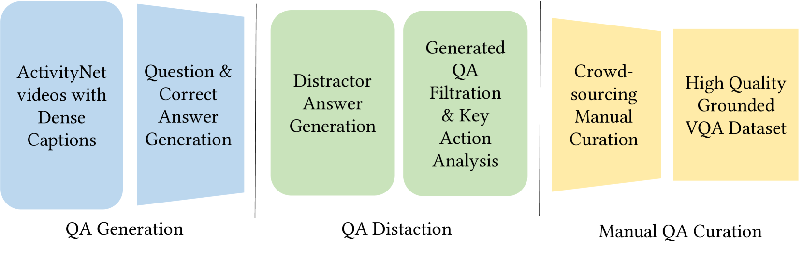
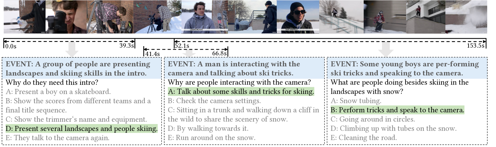
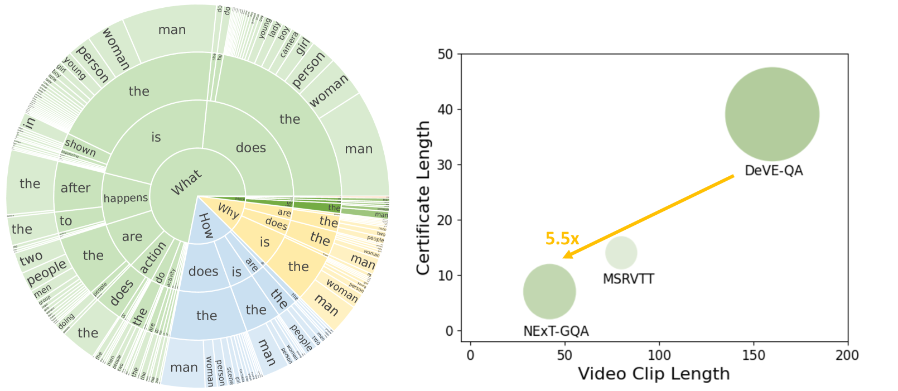
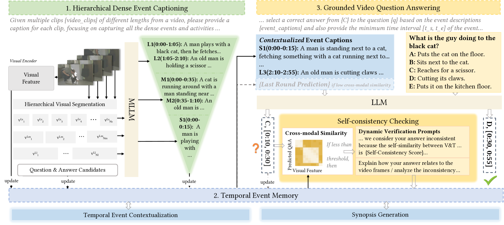
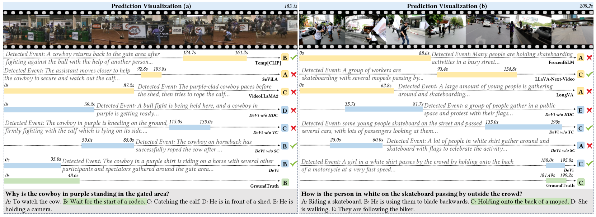
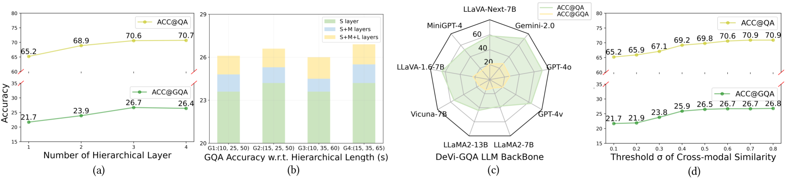
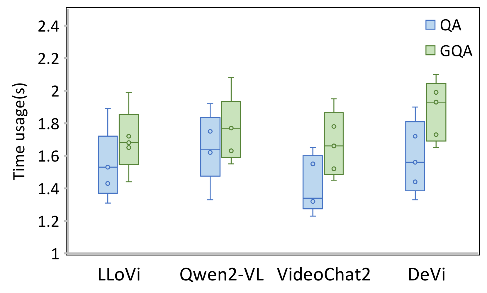

> 原文: [arXiv:2409.04388](https://arxiv.org/abs/2409.04388)（SIGIR 2025）
> 说明: 本文为论文全文中文翻译，公式编号与原文一致；图表保留标题/说明中译，数值表数字原样。

**预印本信息：** arXiv:2409.04388v5 [cs.CV]，2025 年 5 月 16 日提交；会议版本：第 48 届 ACM SIGIR 信息检索研究与开发国际会议（SIGIR 2025），意大利帕多瓦，2025 年 7 月 13–18 日。

**关键词：** 视频问答（Video Question Answering）、稠密事件理解（Dense-Event Understanding）、多模态大语言模型（Multimodal LLMs, MLLMs）、视频时序定位（Video Temporal Grounding）。

**数据与代码：** https://github.com/QHUni/DeVE-QA

# 稠密视频事件问答（Question-Answering Dense Video Events）

**作者：** Hangyu Qin、Junbin Xiao\*、Angela Yao

**单位：** 新加坡国立大学（National University of Singapore），新加坡

**邮箱：** hqin@comp.nus.edu.sg；junbin@comp.nus.edu.sg；ayao@comp.nus.edu.sg

\* 通讯作者。

**DOI：** https://doi.org/10.1145/3726302.3729945

---

## 摘要（Abstract）

本文提出**稠密视频事件问答**（question-answering on dense video events）这一新任务：在长视频中回答并定位（ground）与稠密事件相关的问题，从而挑战多模态大语言模型（Multimodal Large Language Models, MLLMs）在长时间跨度内忠实理解并推理多个事件的能力。为便于研究，我们构建 **DeVE-QA** 数据集，包含 10.6K 条长视频上 26K 个事件的 78K 道问题。基准测试表明，当前最先进的 MLLMs 在 DeVE-QA 上表现困难。为改进性能，我们提出 **DeVi**——一种无需训练（training-free）的 MLLM 方法，包含三个核心模块：层次化描述（hierarchical captioning）模块、时序事件记忆（temporal event memory）模块与自洽性检验（self-consistency checking）模块，分别用于检测、情境化与记忆、以及定位稠密事件以完成问答。大量实验表明，DeVi 在回答稠密事件问题并定位相关视频片段方面优于现有方法。与现有 MLLMs 相比，DeVi 在 DeVE-QA 与 NExT-GQA 上的 G(round)QA 准确率分别提升 4.8% 与 2.1%。

---

## 1 引言（Introduction）

多模态大语言模型（MLLMs）[1, 9, 16, 20, 26, 62] 在**单事件**（single-event）视频的问答（Question Answering, QA）任务上已具备很强能力 [10, 49, 55]。这类视频通常较短（约 3–20 秒），问答往往针对单一、全局事件，例如“谁做了什么”。然而，真实世界中的视频往往较长，且包含复杂交叠的**稠密事件**（dense events）。

以图 1（上）所示约 2 分钟的摩托车活动视频为例：可以就该视频提出多种问题，每个问题对应一个独立事件，但涉及不同参与者、不同时长，且事件分散于视频各处。理解稠密视频事件的本质挑战在于：按需**隔离**或**聚合**相关视频内容并生成回答。稠密描述（dense captioning）[13] 部分应对了该挑战（即隔离与生成），但描述是整体性的，对稠密视频事件的推理帮助有限——MLLMs 易产生**幻觉**（hallucination）[25]。此外，描述评测本身也很困难：标注往往主观 [40]，描述语言格式多样 [39]。

相比之下，**视频问答**（video question answering）继承了稠密事件理解的全部挑战，同时可通过多选分类 [27, 33, 46] 实现确定性评测。因此，我们提出**稠密视频事件问答**这一新任务，要求 MLLMs 在长视频中理解并推理稠密事件。

**任务定义：** 给定包含多个事件的视频，以及关于其中某一特定事件的问题，稠密视频 QA 要求 MLLMs：（1）理解问题并将其关联到相关事件；（2）基于该事件推理出正确答案。为体现理解程度，我们要求模型**定位**（localize）相关视频时刻 [47, 54]，并以视觉证据支撑预测。该要求带来三方面挑战：

1. **多时间尺度：** 每个问题对应特定事件，事件时长各异（见图 1）。必须捕获跨越不同时间尺度的事件。
2. **长程上下文：** 长视频使理解特定事件时关联可能相距较远的上下文变得困难。
3. **忠实推理：** 正确答案的预测需要正确的定位与问答同时成立，这要求强大的稠密视觉事件理解与条件化能力，而非仅依赖 LLM 中的常识知识。

**相关工作缺口：** 稠密视频事件理解主要聚焦描述 [13, 21, 42, 53]，但优化整体句子生成常带来若干问题：**过拟合** [3]——在训练数据上表现好、在未见数据上因真实事件复杂多变而表现差；**对象幻觉**（object hallucination）[36]——模型错误描述视频中不存在的对象 [36]；以及依赖主观描述标注、以及 BLEU [32]、CIDEr [39] 等侧重句子匹配而非视频理解的评测指标。因此，我们选择问答作为评估稠密视频事件理解与推理的替代任务。

**DeVE-QA 数据集：** 目前尚无适合稠密视频事件问答的基准。我们构建 **DeVE-QA**（Dense Video Event QA）数据集，包含 10.6K 视频、26K 事件上的 78K 道问题。DeVE-QA 由 ActivityNet-Caption [13] 的稠密事件描述标注策展多选题，通过 GPT-4 提示生成并经严格人工检查与修正。在标准视频 QA 上表现突出的 MLLMs [11, 29, 31, 38, 41, 44, 58, 61, 63] 在 DeVE-QA 上表现困难，尤其在事件更稠密、视频更长的子集上，表明 DeVE-QA 带来的显著挑战。

**DeVi 方法：** 我们提出 **DeVi**——一种无需训练的 MLLM 稠密视频事件 QA 方法，针对上述挑战采用三项策略：（1）**层次化稠密事件描述**，在多个时间尺度检测稠密事件；（2）**时序事件情境化与记忆**，捕获长程事件依赖并支持事件定位 QA；（3）**自洽性检验**，依据定位的事件时刻锚定或修正答案。DeVi 在 DeVE-QA 上（含/不含定位）分别比当前最优方法提升 4.8% 与 6.9% 准确率，在 NExT-GQA [47] 上 GQA 准确率提升 2.1%。对不同事件密度与视频长度的消融与深入分析验证了 DeVi 的优势及其针对稠密事件与长视频 QA 的专门设计。我们还探讨了 DeVi 的替代实现（如不同 MLLM 作为描述器与 QA 模型），并强调大模型对成功的重要性。

**贡献总结：**

- 提出**稠密视频事件问答**任务，挑战 MLLMs 理解并推理长视频中的稠密事件；构建 **DeVE-QA** 数据集以支持研究。
- 提出 **DeVi**——无需训练的 MLLM 方法，含三个专用组件：层次化稠密事件描述、事件情境化与记忆、自洽性检验，实现稠密视频事件的定位问答。
- 在 DeVE-QA 与 NExT-GQA 上取得新的零样本（zero-shot）最优（State-of-the-Art, SoTA）结果，Acc@GQA 分别超越此前 SoTA 4.8% 与 2.1%。


**图 1：** 稠密视频事件问答对比。（a）DeVE-QA 上的稠密事件 QA：多个问题对应视频中不同时刻、不同参与者的独立事件（示例含摩托车特技、观众反应等多事件多选题）。（b）MSRVTT-QA [49] 上的单视频事件 QA：短视频（约 14 秒）中的单一全局事件（如“What is a child riding?”）。

---

## 2 相关工作（Related Works）

### 2.1 稠密事件视频理解（Dense Event Video Understanding）

稠密视频事件理解主要聚焦**描述**（captioning）[13, 21, 42, 53]。然而，优化整体句子生成常带来若干挑战：一是**过拟合** [3]——为生成整体性句子而优化的模型在训练数据上表现好，但因真实事件复杂多变而在未见数据上困难；二是**对象幻觉** [36]；三是对主观描述标注的依赖，以及 BLEU [32]、CIDEr [39] 等标准评测指标的局限——它们侧重句子匹配而非视频理解。因此，我们选择问答作为评估稠密视频事件理解与推理的替代任务。

### 2.2 视频问答（Video Question Answering）

问答是发展并测试视觉语言模型（Vision-Language Models, VLMs）视觉理解与推理能力的重要途径。主流 VideoQA 基准（如 TGIF-QA [10]、Youtube2Text-QA [55]、MSRVTT-QA 与 MSVD-QA [49]）及相关技术（含近期 MLLMs：InstructBLIP [6]、Video-ChatGPT [26]、Video-LLaMA [62]、VideoChat2 [17]）主要面向**短视频**，问题多涉及物体属性、位置、动作等视觉事实 [66]。ActivityNet-QA [59] 虽含长视频，其问题内容仍与视觉元素识别类似。这些基准与技术缺乏对**以人为中心的事件**与**多事件推理**的专门关注，尤其在长程视频中。

较新的 VideoQA 基准 [5, 8, 38, 46, 67] 或强调动作关系的推断性查询，或强调纯长视频理解。例如 NExT-QA [46] 超越先前工作，关注多种动作关系，但视频仍以日常生活场景为主，未深入长时活动中多个事件的精细理解。Video-MME [8] 与 MLVU [67] 尤其强调 MLLMs 的长视频理解，却忽略了长视频中存在的稠密事件。任务格式上最接近我们的是 NExT-GQA [47]，但其视频与 QA 源自 NExT-QA，因而未挑战稠密事件理解。在方法方面，虽有一些近期工作声称面向事件中心 VideoQA [2, 24, 56]，但这些工作中的“事件”通常指单个动作或全局事件，缺乏理解长视频中多个稠密事件所需的粒度。

### 2.3 面向 VideoQA 的 MLLMs（MLLMs for VideoQA）

现有大多数 Video-LLM 面向**短且单事件**视频 [11, 12, 16, 17, 20, 26, 45, 58, 62]，通常接受 4–32 帧输入。该约束使其难以对长视频进行复杂推理——而这正是稠密事件理解的关键。为绕过时间约束，近期研究沿两个方向推进：

1. **长视频编码**（long video encoding）：探索 token 压缩以支持长视频输入，代表工作包括 LLaMA-VID [18]、PLLaVA [50]、LLaVA-NeXT-Video [65]、LongVA [63]。
2. **苏格拉底式组合**（Socratic technique）[60]：以零样本方式精心组合预训练基础模型，彼此交换信息以获得新多模态能力。可进一步分为**遍历式**（traversal，如 ViperGPT [38]、MoReVQA [28]、TraveLER [37]、VideoAgent [7, 43]）与**视觉到文本记忆式**（vision-to-text memorizing，如 LLoVi [61]）。

遍历式方法无法聚合分散于不同时刻的多个事件以进行联合推理。因此，我们遵循 LLoVi [61] 将帧序列转为带时间信息的描述并记忆以完成问答。为处理稠密事件 QA，我们进一步引入层次化多时间尺度描述、长程信息交互的事件情境化，以及用于自验证的视觉记忆等专用模块。

---

## 3 DeVE-QA 数据集（DeVE-QA Dataset）

### 3.1 数据集构建（Dataset Construction）

我们遵循稠密事件描述 [13]，将**事件**（event）定义为：在特定时间内对某人（或某群体）特定行为的完整描述，例如 “A man is playing the piano at [10.2s, 34.5s]”（“一名男子在 [10.2s, 34.5s] 弹钢琴”）。据此，我们从稠密事件描述数据集 **ActivityNet-Captions** 构建 **DeVE-QA**，通过 GPT-4 [30] 提示由描述生成问答对，并经人工检查与修正。构建细节如下。

**数据过滤（Data Filtering）。** ActivityNet-Captions [13] 的稠密描述平均长度 13.5 词，平均覆盖视频 94.6% 时长。我们首先选取超过平均描述长度的样本，以聚焦事件更稠密、视觉描述更细粒度的案例。同时，省略覆盖对应视频超过 95% 时长的事件样本——这类事件的时间定位可简化为返回视频起止时间。最后，为效率考虑，对其余数据随机采样，得到 10,643 条视频与 26,111 条描述用于后续处理。

**自动 QA 生成（Automatic QA Generation）。** 我们提示 GPT-4o 为每条事件描述生成多道（最多 3 道以控制成本）问答对，覆盖事件不同方面。随后根据 CLIP 嵌入余弦相似度（阈值 0.9）去除冗余问题。表 1 为自动 QA 生成提示。为便于评测，我们为每道生成问题再策展四个**干扰项**（distractor answers）构成五选一。干扰项获取策略如下：

对每道题，先获取 10 个语义上可回答该问题的候选答案：检索同一视频下最相似的 10 个问题并借用其答案构成候选列表；若同视频 QA 不足 10 条，则从其他视频取最相似 QA。问题相似度由 CLIP 嵌入余弦得分计算。然后：

- 选取两个与视频内容最相关、但**不在问题时间跨度内**出现的候选答案作为两个干扰项：利用片段无关视频内容（问题时间跨度外的帧）检索 CLIP 嵌入最相近的前两个候选答案；
- 再选一个与问题时间跨度指定视频内容最接近、但**不是正确答案**的候选答案；
- 最后从整个答案集中再随机采样一个候选，确保与已有干扰项及正确答案无简单词面重叠（lexical proximity）。

**人工 QA 检查与策展（Manual QA Checking and Curation）。** 因所有 QA 均为自动生成，我们对**测试集** QA 进一步人工检查与修正。标准包括：干扰项（1）不应可能正确；（2）应能逻辑上回应给定问题；（3）彼此区分明确；（4）与视频内容密切相关。35 名标注员共耗时 267 小时；约 74% 的 QA 对被修改。最终 QA 示例见图 1 与图 3。

**表 1：问题生成提示（Prompt for question generation）**

```
我需要你帮助生成与视觉事件描述相关的问答对。示例如下：

给定描述：{Event descriptions}

好的问答对可以是：
{Examples of generated QA pairs}

请为每条描述生成最多 3 组问答对，问题最多 22 词，答案最多 6 词。
希望问题包含不同因果与时序推理关键词，如 'why'、'how'、'before'、'after'。
不同问题应多样且关联描述事件的不同方面。并确保答案与描述一致。
……请按顺序为每个问题编号。描述如下：{descriptions}。
```




**图 2：DeVE-QA 构建流水线。** ActivityNet 稠密描述视频 → 问题与正确答案生成 → 干扰项生成 → QA 过滤与关键动作分析 → 众包（Crowd-sourcing）→ 人工 QA 策展 → 高质量定位 VQA 数据集。

**表 2：DeVE-QA 统计。** Ratio (S./V.)：片段平均长度相对整段视频的比例。

| Split | # Vid. | # Que. | # Avg. QLen | Seg. Dur.(s) | Vid. Dur.(s) | Ratio (S./V.) |
|-------|--------|--------|-------------|--------------|--------------|---------------|
| Train | 7,179  | 53,361 | 10.70       | 38.68        | 127.32       | 0.32          |
| Test  | 3,464  | 24,963 | 10.71       | 40.98        | 125.03       | 0.34          |

### 3.2 统计与分析（Statistics and Analysis）

DeVE-QA 是首个支持长视频**稠密事件问答**的基准数据集。表 2 给出详细统计：共 10.6k（训练 7.2k / 测试 3.5k）视频、78.3k（训练 53.3k / 测试 25k）问题。平均视频长度 127 秒，580 余条视频时长 4–10 分钟。平均每视频 7.5 道题、2.6 个事件（多数其他基准为 1）。二者对比表明，平均每个事件约 2.5 道题。

图 4(a) 为问题类型分布：问题不仅问“做了什么”，还扩展至 “how”“why” 等以目标更全面的事件理解。注意 “when” 类问题隐含于时序定位要求中；我们限制 “who”“where” 问题比例，因其往往无需整段视频级理解即可作答 [14, 49]。




**图 3：DeVE-QA 中的 QA 示例。**

- **事件：** A group of people are presenting landscapes and skiing skills in the intro.（一群人正在片头展示风景与滑雪技巧。）
  - **问：** Why do they need this intro?（为什么需要这段片头？）
  - A: Present a boy on a skateboard. B: Show the scores from different teams and a final title sequence. C: Show the trimmer's name and equipment. D: Present several landscapes and people skiing. E: They talk to the camera again.

- **事件：** A man is interacting with the camera and talking about ski tricks.（一名男子与镜头互动并讲解滑雪技巧。）
  - **问：** Why are people interacting with the camera?（人们为何与镜头互动？）
  - A: Talk about some skills and tricks for skiing. B: Check the camera settings. C: Sitting in a trunk and walking down a cliff in the wild to share the scenery of snow. D: By walking towards it. E: Run around on the snow.

- **事件：** Some young boys are performing ski tricks and speaking to the camera.（一些少年表演滑雪特技并对镜头说话。）
  - **问：** What are people doing besides skiing in the landscapes with snow?（除滑雪外，人们在雪景中还在做什么？）
  - A: Snow tubing. B: Perform tricks and speak to the camera. C: Going around in circles. D: Climbing up with tubes on the snow. E: Cleaning the road.




**图 4：DeVE-QA 分析。**（a）DeVE-QA 问题类型分布（含 what/how/why/when 等）。（b）各 VideoQA 数据集的**时序凭证长度**（temporal certificate length，[27]：回答问题所需视频片段的平均长度）。

### 3.3 与现有基准对比（Comparison with Existing Benchmarks）

表 3 将 DeVE-QA 与现有 VideoQA 数据集对比。首先，DeVE-QA 面向**稠密事件**与**长视频** VideoQA，并支持时序定位评测。该定位使其区别于：聚焦全局视频事件的数据集（表 3 第一块中除 NExT-QA 外所有数据集），以及短视频数据集（表 3 前三项）。与 TVQA [14]、NExT-GQA [47] 等时序定位数据集相比，DeVE-QA 视频与片段更长，事件级 QA 挑战更大。例如图 4(b) 显示，DeVE-QA 的时序凭证长度为 NExT-GQA [47] 的 **5.5 倍**。此外，TVQA 侧重电视节目中 “what is” 的简单视觉识别，其时序定位偏向定位 QA 中出现的字幕。DeVE-QA 则要求理解长视频中交叠的多个人类中心事件。

**表 3：数据集对比。** D.E.：稠密事件（dense event）；Seg. Len(s)：片段长度（秒）。

| Dataset | D.E. | Vid. Dur.(s) | #QAs | Seg. Len(s) |
|---------|------|--------------|------|-------------|
| MSRVTT-QA [49] | ✗ | 15 | 243K | ✗ |
| MSVD-QA [49] | ✗ | 10 | 50K | ✗ |
| TGIF-QA [10] | ✗ | 3 | 139K | ✗ |
| ActivityNet-QA [59] | ✗ | 118 | 58K | ✗ |
| NExT-QA [46] | ✗ | 44 | 52K | ✗ |
| TVQA [14] | ✗ | 76 | 152k | 11.2 |
| NExT-GQA [47] | ✗ | 42 | 43K | 7.0 |
| **DeVE-QA (ours)** | **✓** | **127** | **78K** | **39.4** |

---

## 4 DeVi 方法（DeVi Solution）

### 4.1 概览（Overview）

给定时长 $T$ 秒的视频 $v$，包含事件集合 $E = \{e_1, e_2, \cdots, e_n\}$，问题 $q$ 及候选答案集 $C = \{c_1, \cdots, c_5\}$，**稠密视频事件 QA** 预测正确答案 $\hat{c} \in C$，并将其**定位**到相关事件时刻 $\hat{t} = \{t_s, t_e\}$，其中 $t_s \leq t_e \leq T$。形式化地：

$$
\{\hat{c}, \hat{t}\} = \psi(c, t \mid E, q, C) \, \phi(E \mid v), \tag{1}
$$

其中 $\phi$ 与 $\psi$ 分别表示稠密事件检测模型与事件条件化 QA 模型。注意时间戳 $t$ 随检测事件 $E$ 一并给出。

- **第二项** $\phi(E \mid v)$：检测视频 $v$ 的事件 $E$。具体地，我们在 MLLM 中引入**层次化稠密描述**（Sec. 4.2），在多个时间尺度检测视频事件；并设计**时序事件记忆**（Sec. 4.3）模块，捕获（可能长程的）事件依赖，对检测事件 $E$ 进行情境化与记忆。
- **第一项** $\psi(c, t \mid E, q, C)$：基于情境化事件 $E$、问题 $q$ 与答案集 $C$ 的**事件定位 QA**（Sec. 4.4）。我们从情境化事件 $E$ 的记忆中读取，连同 QA（问题 $q$ 与候选 $C$）输入 LLM，确定正确答案及对应事件时刻；并强调**自洽性检验**机制，确保“对的事件给出对的答案”。

方法概览见图 5。




**图 5：DeVi 框架。**（1）层次化稠密事件视频分段与描述；（2）在时序事件记忆中情境化并记忆事件；（3）带自洽性检验的事件定位视频问答。

### 4.2 层次化稠密事件描述（Hierarchical Dense Event Captioning）

视频内稠密事件常相互交织、时长各异。为成功检测，我们在多个**时序层次**（temporal hierarchies）上应用 MLLM（如 LLaMA-VID [18]）。构建三级层次，通过对不同层次、不同长度的视频片段进行描述以检测事件。

描述自底层**短视频片段**开始：

$$
V_s = \{v_k^{L_s}\}_{k=1}^{N_s}
$$

短视频片段 $V_s$ 与描述提示一并输入 MLLM，对应事件记为：

$$
E_s = \{e_k^{L_s}\}_{k=1}^{N_s}
$$

其中 $N_s$、$L_s$ 分别为短视频片段数量与长度。具体事件 $e_k$ 由文本描述及起止时间戳 $t_s$、$t_e$ 给出。

类似地，我们对中等与长视频片段描述，得到 $E_m = \{e_k^{L_m}\}_{k=1}^{N_m}$ 与 $E_l = \{e_k^{L_l}\}_{k=1}^{N_l}$，形成每视频事件集合 $E = \{E_s, E_m, E_l\}$。注意 $L_s < L_m < L_l \leq T$。

DeVi 将视频划分为不重叠片段（DeVE-QA 上短/中/长分别为 15s/35s/65s）。每段均匀采样 5/7/13 帧，送 LLaMA-VID [18] 描述，提示随片段长度捕获不同粒度事件信息。

**层次化描述提示示例：**

```
给定来自同一视频的不同长度多个片段 {video_clips}，请为每个片段生成描述，
重点捕获所有稠密事件与活动……
```

### 4.3 时序事件记忆（Temporal Event Memory）

迄今事件均通过聚焦单个视频片段独立检测。缺乏上下文可能导致描述不准确或不完整。层次化描述可缓解该问题，但无法建模**长程时序事件依赖**。例如图 1 视频可能在开头产生 “a man enters the field”（一名男子进入场地），中段产生 “a biker is performing”（骑手正在表演）；而关于男子为何入场、骑手是男是女等问题，无法仅凭孤立事件描述回答，需关联两个事件。

为捕获长程依赖，我们设计**记忆模块**（memory module）在存储视觉与事件表示的同时**情境化**事件描述。LLM 被要求通过如下提示 refine 描述：“……给定事件描述集合 {E} 与视频问题 {q}，你需通过分析整体叙事、识别相关上下文并连贯融入上下文，用所有其他描述与问题中的信息 refine 每条描述……”。我们还策展示例进行上下文学习（in-context learning），并额外提示 GPT-4o 将所有事件综合为整段视频的**梗概**（synopsis）$e_y$，作为全局事件。具体提示见表 4。于是得到：

$$
E' = \{E_s, E_m, E_l, e_y\}
$$

其中各层次事件均增强长程时序依赖。

具体地，层次化视频事件描述 $\{E\}$ 首先写入时序事件记忆。同时，以 1 fps 采样原视频，用 CLIP ViT-L/14 [35] 将帧编码为视觉表示 $f_v$ 并存入记忆。$f_v$ 供后续自洽性检验模块（Sec. 4.4）读取，依据答案与视觉表示的跨模态相似度确定正确答案。总体上，时序事件记忆缓存视频的多类表示（视觉特征、稠密描述、全局梗概）：

$$
M = \{E, E', f_v\}
$$

以辅助关于特定事件的问答与定位。

**表 4：时序情境化提示（Prompt of temporal contextualization）**

```
你是一名高智能语言智能体，负责提升视频描述质量。给定一组描述（每条对应视频不同时间段）
及关于视频的问题，你需通过分析整体叙事、识别相关上下文并连贯融入，用所有其他描述与问题
中的信息 refine 每条描述。描述与问题如下：${hierarchical captions} 与 {question}。示例如下：
  • 原始描述：A person is holding a knife and waving it around.
    情境化描述：A person is holding a knife and chopping down a tree.
  • 原始描述：A person takes off their clothes by the river and jumps into the water to swim.
    情境化描述：A person takes off their clothes by the river and jumps into the water to save someone who is drowning.
  • 原始描述：A person is waving a spatula in the kitchen.
    情境化描述：A person is using a spatula in the kitchen to chase away a squirrel that has entered.
请基于描述给出覆盖所有关键时序动作、角色与互动的整段视频综合梗概。
```

**图 1 示例事件链（记忆模块动机）：** 视频含 “男子入场”“骑手表演” 等分散事件；孤立片段描述无法回答跨事件因果问题，需时序记忆与情境化关联。

### 4.4 事件定位 QA 与一致性检验（Event-Grounded QA and Consistency Check）

直观上，可从事件记忆读取事件 $E'$，连同 QA 输入 LLM（如 GPT-4o 或 Gemini 2.0）以确定答案及支撑视觉证据，例如提示：“……基于事件集合 {E}，从候选答案集 {C} 中为问题 {q} 选择正确答案，并输出承载正确答案的事件时间跨度 [$t_s$, $t_e$]……”。然而，我们发现该直接方式效果不佳：LLM 常出现**答案正确但定位错误**，或**定位正确但答案错误**的大偏差。因此，我们在预测答案与时间跨度之间进行**一致性检验**（consistency checking）。

具体地，基于答案 $a$ 与预测时间跨度 [$t_s$, $t_e$] 内视频内容的**余弦相似度** $R_{va}$ 评估一致性：

$$
R_{va} = \cos(f_v, f_a) = \frac{f_v \cdot f_a}{|f_v| \, |f_a|}
$$

其中 $f_a$、$f_v$ 分别为 CLIP [35] 对答案文本与视频片段的编码。一致性低（$R_{va}$ 小）的预测送回 LLM 调整。该过程迭代直至 $R_{va}$ 达到阈值 $\sigma$，或达到最大迭代次数 $\delta$。

当 $R_{va} < \sigma$ 时，我们将描述、QA 对与**动态验证提示**（表 6）一并重新提交 LLM。验证提示利用上一轮自洽性结果以改进推理：若两轮结果一致，模型需阐述答案与视频片段的关系；否则需详细分析不一致之处。

**事件定位 QA 提示示例：**

```
……基于事件描述 {event_captions}，从 {C} 中为问题 {q} 选择正确答案，
并给出承载该答案的事件的最小时间区间 [t_s, t_e]……
```

**表 6：动态验证提示（Prompt for dynamic verification）**

```
你是稠密事件视频分析专家。此前已根据视频描述与一道多选题给出答案及支撑帧区间。
经专业复核，我们认为你的答案不一致：先前答案 {Previous_Answer} 与 {Supportive_Frames}
之间的自相似度仅为 {Self_Consistency_Score}。
在此前提下，请重新回答：{Prompts_for_Event-Grounded_QA}，并判断是否与先前答案一致。
若否，请详细分析不一致；若是，请解释答案与视频帧的关系。
```

**图 5 模块交互说明：** 层次化分段 → 各层描述（L/M/S 层）→ 情境化描述 → LLM 预测答案 C 与区间 → 跨模态相似度低于阈值则触发动态验证提示迭代。

---

## 5 实验（Experiments）

### 5.1 配置与评测（Configuration and Evaluation）

我们在 DeVE-QA **测试集**上实验，并扩展至 **NExT-GQA** [47]。NExT-GQA 含关于多种动作的时序定位 QA，测试集 990 视频、5,553 问题。

**层次化事件描述：** 片段长度 $L_s, L_m, L_l$（原文记 $L_h$ 为长层）在 DeVE-QA 上设为 {10s, 35s, 65s}（正文 DeVi 实现为 15s/35s/65s），NExT-GQA 上为 {5s, 15s, 45s}。

**自洽性检验：** $\sigma$ 经验设为 0.4（见图 6(d)），$\delta$ 设为 2 以兼顾效率。

**评测指标**（遵循 NExT-GQA [47]，均为百分比 %）：

- **Acc@QA：** 问答准确率；
- **IoP / IoU：** 定位质量，Intersection over Prediction / Union；
- **Acc@GQA：** 定位 QA 准确率——问题既答对又视觉定位正确（预测时间跨度与 ground truth 事件时刻 IoP ≥ 0.5）的比例。

**实现细节：** 除 LLaMA-Adapter [64] 外，模型均以类似 “……从 {C} 中为 {q} 选正确答案并给出基于视觉内容的最小时间区间……” 的指令进行**零样本** VideoQA。LLaMA-Adapter 在 DeVE-QA 训练集微调作为微调参考。我们统一采样 16 帧并经 mean-pooling 聚合表示以适配视频；GPT-4o 问答亦用 16 帧；Gemini 2.0 直接输入原始视频。其他方法在其官方最优协议与算力约束下评测。

### 5.2 性能分析（Performance Analysis）

我们将表现良好的 MLLMs（如 Video-LLaMA2 [4]、LLaVA-NeXT-Video [65]、GPT-4o [31]、LongVA [63] 等）适配到 DeVE-QA，并与 DeVi 对比。

**表 5：DeVE-QA 上的 QA 结果（Acc@QA，%）**

| Model | Frames | LLM | Acc@QA |
|-------|--------|-----|--------|
| **开源** | | | |
| VideoLLaMA [62] | 8 | Vicuna-7B | 41.2 |
| InternVideo [44] | 16 | CLIP Text Encoder | 48.3 |
| VFC [29] | 32 | PaLM | 49.5 |
| Video-LLaVA [20] | 8 | Vicuna-7B | 56.2 |
| LLaVA-NeXT-Video [22] | 32 | Vicuna-7B | 57.1 |
| LLaMA-adapter (SFT) [64] | - | LLaMA-7B | 58.3 |
| Videochat2 [17] | 16 | Vicuna-7B | 58.7 |
| SeViLA [58] | 32 | BLIP-2 | 61.2 |
| VideoLLaMA2 [4] | 16 | Mistral-7B-Instruct | 61.3 |
| LLaVA-OV [15] | 16 | Qwen2-7B | 61.9 |
| Qwen2-VL [41] | 32 | Qwen2-7B | 63.5 |
| PLLaVA [50] | 16 | LLaVA-Next-7B | 63.7 |
| LongVA [63] | 48 | Qwen2-Extended | 64.9 |
| **API 类** | | | |
| ViperGPT [38] | - | GPT-3 | 55.1 |
| IG-VLM [11] | 6 | LLaVA-1.6-7B | 60.2 |
| GPT-4o [31] | 16 | GPT-4o | 62.6 |
| Gemini-2.0 [9] | - | Gemini-2.0 | 63.4 |
| LLoVi [61] | - | GPT-4 | 63.8 |
| VideoAgent [43] | - | GPT-4 | 64.5 |
| **DeVi-GPT-4o (ours)** | - | GPT-4o | **71.2** |
| **DeVi-Gemini-2.0 (ours)** | - | Gemini-2.0 | **71.8** |

因多数方法无法定位，表 5 仅比较 QA 准确率。DeVi 达 **71.8%**，显著超越次优 LongVA [63]（面向长视频理解）**6.9%**，亦分别超越 VideoAgent [43] 与 LLoVi [61] **7.3%** 与 **8.0%**。Video-LLaMA、Video-LLaVA、VideoChat2 等端到端 MLLM 比 DeVi 低约 10%–30%，表明 DeVi 在长程视频稠密事件问答上相对通用 MLLM 有显著优化。

**表 7：DeVE-QA 上的定位 VideoQA 结果。** \*：在视频定位数据集上预训练。Human 结果为随机 3K 问题子集上的人工表现。

| Model | mIoP | IoP@0.5 | mIoU | IoU@0.5 | Acc@QA | Acc@GQA |
|-------|------|---------|------|---------|--------|---------|
| Human | 58.2 | 62.3 | 43.9 | 52.7 | 84.7 | 62.4 |
| **弱监督** | | | | | | |
| FrozenBiLM(NG+) [47] | 21.2 | 18.2 | 8.50 | 6.2 | 61.6 | 14.5 |
| Temp[CLIP](NG+) [47] | 24.6 | 24.8 | 12.5 | 9.1 | 58.9 | 14.9 |
| SeViLA* [58] | 25.8 | 19.9 | 21.2 | 11.5 | 62.7 | 16.1 |
| **零样本** | | | | | | |
| LLaVA-Next-Video [22] | 22.5 | 21.1 | 13.8 | 10.7 | 56.9 | 17.4 |
| VideoChat2 | 23.1 | 21.8 | 14.2 | 12.5 | 59.2 | 18.6 |
| VideoLLaMA2 [4] | 23.7 | 22.0 | 12.9 | 10.1 | 62.0 | 19.2 |
| Qwen2-VL [41] | 23.6 | 23.2 | 16.5 | 14.7 | 63.9 | 20.1 |
| LongVA [63] | 24.9 | 24.7 | 16.9 | 15.2 | 66.2 | 20.8 |
| LLoVi [61] | 27.5 | 27.0 | 17.9 | 13.0 | 63.9 | 22.9 |
| **DeVi-GPT-4o (ours)** | 33.8 | 32.2 | 20.7 | 17.4 | 71.9 | 27.1 |
| **DeVi-Gemini-2.0 (ours)** | 34.9 | 32.8 | 21.7 | 18.5 | 72.1 | **27.7** |

DeVi 在 Acc@GQA 上超越零样本 SoTA LLoVi **4.8%**，提升同时来自更好的 QA（Acc@QA +8.9%）与更好的定位（IoP@0.5 +5.8%）。此前方法往往仅在一项上提升（NExT-GQA 上亦见表 8）。有趣的是，零样本方法普遍优于弱监督方法，表明弱监督易学习从问题到答案的捷径，亦反映 LLM 在问答上的能力。现有方法与人类（尤其定位 QA，差距最高 **34.7%**）之间仍有明显鸿沟，说明可靠稠密事件 QA 算法仍严重不足。

**表 8：NExT-GQA 上的定位 VideoQA 结果。**

| Model | mIoP | IoP@0.5 | mIoU | IoU@0.5 | Acc@QA | Acc@GQA |
|-------|------|---------|------|---------|--------|---------|
| Human | 72.1 | 86.2 | 61.2 | 70.3 | 93.0 | 82.0 |
| IGV [19] | 21.4 | 18.9 | 14.0 | 9.6 | 50.1 | 10.2 |
| VGT [48] | 25.3 | 25.3 | 3.0 | 1.7 | 55.7 | 14.4 |
| Temp[CLIP](NG+) [47] | 25.7 | 25.5 | 12.6 | 8.9 | 60.2 | 15.9 |
| SeViLA* [58] | 29.5 | 22.9 | 21.7 | 13.8 | 68.1 | 16.6 |
| FrozenBiLM(NG+) [47] | 24.2 | 23.7 | 9.5 | 6.1 | 70.8 | 17.5 |
| QGAC-TR [51] | 28.3 | 27.7 | 15.7 | 11.7 | 63.6 | 18.3 |
| FrozenBiLM(TimeCraft) [23] | 26.3 | 24.9 | 13.2 | 8.4 | 74.7 | 18.5 |
| VideoStreaming [34] | 32.2 | 31.0 | 19.3 | 13.3 | - | 17.8 |
| LLoVi [61] | 39.4 | 38.0 | 21.5 | 16.2 | 73.8 | 26.8 |
| **DeVi-GPT-4o (ours)** | 39.3 | 37.9 | 22.3 | 17.4 | 71.6 | 28.0 |
| **DeVi-Gemini-2.0 (ours)** | 39.7 | 38.9 | 23.6 | 19.5 | 73.1 | **28.9** |

在 NExT-GQA 上 DeVi 亦 consistently 优于竞争对手；相对 DeVE-QA，优势略缩小（Acc@GQA 上 DeVi 超越 LLoVi 4.8% vs. 2.1%），表明 DeVi 除稠密事件长视频理解外，在短视频细粒度动作推理上亦有效。

### 5.3 消融实验（Ablation Studies）

**表 9：DeVE-QA 上主要模块消融。**

| Model Variants | Acc@QA | Acc@GQA |
|----------------|--------|---------|
| DeVi | 71.8 | 27.7 |
| w/o Hierarchical Dense Captioning | 66.9 | 23.3 |
| w/o Temporal Contextualizing | 68.8 | 25.3 |
| w/o Consistency Checking | 66.3 | 21.7 |

**层次化稠密描述：** 以 LLoVi [61] 式逐帧朴素描述替代层次化描述，Acc@QA 与 Acc@GQA 分别降 **4.9%** 与 **4.4%**。表 10 进一步表明，层次化描述对**更稠密**事件视频帮助更大：去掉后 QA 在稠密事件子集降 **5.7%**，在稀疏（1–2 事件）子集仅降 2.3% 与 3.7%。

**时序事件情境化：** 移除该模块，QA 与 GQA 分别降 **3.0%** 与 **2.4%**。情境化描述相较孤立描述误解与不完整问题更少。表 11 消融（长视频 GQA -3.7% vs. 短视频 GQA -1.1%）亦证明其对长视频的有效性。

**自洽性检验：** 移除后以朴素方式提示 LLM 得最终预测，QA 与 GQA 分别大幅降 **5.5%** 与 **6.0%**，表明大量 LMM 答案未锚定在相关视频内容上。

**表 10：不同事件密度下的结果。** Single/Double/Dense-Event：相关视频含 1/2/多于 2 个主要事件。每子集选 200 视频。HDC：Hierarchical dense captioning（层次化稠密描述）。

| Metrics | Model | Single | Double | Dense | Total |
|---------|-------|--------|--------|-------|-------|
| Acc@QA | FrozenBiLM(NG+) [52] | 62.1 | 61.8 | 59.2 | 61.6 |
| | SeViLA [58] | 63.3 | 62.9 | 61.7 | 62.7 |
| | LLoVi [61] | 65.2 | 65.8 | 61.2 | 63.9 |
| | DeVi w/o HDC | 66.2 | 65.5 | 67.1 | 66.9 |
| | **DeVi** | **68.2** | **69.7** | **72.8** | **71.8** |
| Acc@GQA | FrozenBiLM(NG+) [52] | 15.1 | 15.0 | 13.9 | 14.5 |
| | SeViLA [58] | 15.9 | 16.1 | 16.2 | 16.1 |
| | LLoVi [61] | 24.1 | 22.6 | 21.1 | 22.8 |
| | DeVi w/o HDC | 23.5 | 23.3 | 24.2 | 23.3 |
| | **DeVi** | **25.8** | **27.0** | **28.8** | **27.7** |

现有 MLLM 准确率随事件密度增加而下降（如 FrozenBiLM 从 62.1% 至 59.2%），而 DeVi 从 68.2% **升至** 71.8%，体现捕获多复杂事件特定信息的能力。

**表 11：不同视频长度下的结果。** Short/Medium/Long：0–60 / 60–120 / 120 秒以上。每事件密度级选 200 视频。TC：Temporal Contextualizing（时序情境化）。

| Metrics | Model | Short | Medium | Long | Total |
|---------|-------|-------|--------|------|-------|
| Acc@QA | SeViLA [58] | 64.2 | 62.4 | 60.6 | 62.7 |
| | LLoVi [61] | 66.0 | 64.1 | 62.8 | 63.9 |
| | DeVi w/o TC | 68.9 | 68.8 | 68.8 | 68.8 |
| | **DeVi** | **70.1** | **71.2** | **72.7** | **71.8** |
| Acc@GQA | SeViLA [58] | 18.4 | 16.2 | 14.9 | 16.1 |
| | LLoVi [61] | 24.7 | 22.4 | 21.1 | 22.8 |
| | DeVi w/o TC | 25.4 | 25.5 | 25.2 | 25.3 |
| | **DeVi** | **25.5** | **27.3** | **28.9** | **27.7** |

DeVi 在中（60–120s）长（>120s）视频上保持强势，而基线明显下降，明确展示长视频处理能力及专门模块对稠密事件与长视频的重要性。




**图 7：DeVE-QA 预测可视化。** 基线如 SeViLA、Temp[CLIP] 倾向答题却未真正定位到相关片段。HDC 帮助 DeVi 理解多尺度事件；TC 通过 refine 孤立描述提升 GQA；SC 有效纠正错误定位片段。

**图 7 定性示例摘要：**

- **（a）牛仔竞技：** 问 “Why is the cowboy in purple standing in the gated area?” 各模型检测事件与定位区间差异大；DeVi 相对更准确关联紫衣牛仔与门区事件。
- **（b）街头滑板：** 问 “How is the person in white on the skateboard passing by outside the crowd?” 无 HDC 时易汇总错误事件；无 TC 时孤立描述混淆人群与滑板；SC 修正错误定位。

### 5.4 实现探究（Implementation Investigations）

**稠密视频事件描述器（Dense Video Event Captioner）。** 表 12 显示，以 VideoBLIP [57] 替代 LLaMA-VID [18] 作为 DeVi 描述器，含/不含定位 QA 准确率分别降超 **4%** 与 **7%**。LLaMA-VID 更优因其针对长视频训练，且以 context token 与 content token 表示帧，有利于压缩关键信息、生成更准确描述。

**表 12：描述器探究。**

| Caption Model | Acc@QA | Acc@GQA |
|---------------|--------|---------|
| VideoBLIP [57] | 60.1 | 20.0 |
| VideoBLIP [57] w HDC | 64.2 | 23.9 |
| Video-LLaVA [20] | 65.8 | 24.1 |
| Video-LLaVA [20] w HDC | 70.8 | 26.9 |
| LLaMA-VID [18] | 66.9 | 23.3 |
| LLaMA-VID [18] w HDC | **71.8** | **27.7** |

**层次级数与片段长度：** 图 6(a) 显示 3 层层次最优；超参数最终定为 15s、35s、65s。图 6(b) 显示增加片段长度带来更好 GQA（G2 与 G3），表明受数据集性质（总时长、时间戳等）影响。




**图 6：DeVi 分析。**（a）层次层数分析；（b）片段长度分析；（c）DeVE-QA 上 MLLM 推理骨干分析；（d）跨模态相似度阈值 $\sigma$ 与 QA/GQA 准确率关系。

**LLM 骨干（LLM Backbone）：** 图 6(c) 显示 Gemini 最优（QA 71.8%、GQA 27.7%），其次 GPT-4o（71.1%）与 GPT-4V（64.2%）。更强 LLM（GPT-4o/4v、Gemini）是成功关键。同系列增大 LLM 规模亦提升 GQA（如 LLaMA2-7B 10.9% → LLaMA2-13B 14.6%），强化大模型零样本 QA 推理对 DeVi 稠密事件推理的重要性。

**其他基线局限：** VideoLLaMA2 [4] 虽可检测大致正确时间跨度（图 7(a) 第 3 行），但对时序动态处理不足导致关键事件内容理解错误；LongVA [63] 擅长长视频，却在相似人物/物体混淆内容与正确定位其他混淆事件片段上不足（图 7(b) 第 3 行）。

### 5.5 效率分析（Efficiency Analysis）

在 NVIDIA A800 GPU 上随机选 1K 样本比较平均推理速度。图 8 显示：

- **QA：** DeVi 与 LLoVi 约 **1.59s** vs. **1.54s**，Qwen2-VL 最慢 1.65s，VideoChat2 最快 1.41s。
- **GQA：** 四模型均略慢（LLM 响应更慢）；DeVi 因额外自洽性检验最慢（QA 约 2.4s，GQA 约 2.2s 量级，见图 8）。

进一步分析表明，事件定位 QA 与自洽性过程约占 DeVi **总运行时间近一半**。这也说明层次化稠密描述策略相对 LLoVi 式逐帧朴素描述**并未拖慢**整体，DeVi 与 LLoVi 运行速度大致相当。




**图 8：推理效率分析。** 各模型 QA 效率相近；GQA 上 DeVi 略慢。

---

## 6 结论（Conclusion）

本文提出**稠密视频事件问答**新任务，从稠密事件描述、长视频理解、以及通过定位实现的忠实多模态推理三方面挑战 MLLMs。我们构建经人工努力的 **DeVE-QA** 数据集，基准测试多种先进 MLLM 并揭示其弱点。为改进，我们提出 **DeVi**——无需训练的模块化 MLLM 方法，通过层次化稠密事件描述、时序事件情境化与记忆、以及带自洽性检验的可信 QA，应对上述挑战。大量实验验证 DeVi 的有效性与优越性。我们还分享实现替代方案，并强调更大 LLM 对成功的重要性。希望本工作为稠密视频事件 QA 研究提供坚实基础。

---

## CCS 概念（CCS Concepts）

- 信息系统 → 多媒体信息系统；问答（Question answering）
- 计算方法 → 活动识别与理解（Activity recognition and understanding）

---

## ACM 引用格式（ACM Reference Format）

Hangyu Qin, Junbin Xiao, and Angela Yao. 2025. Question-Answering Dense Video Events. In Proceedings of the 48th International ACM SIGIR Conference on Research and Development in Information Retrieval (SIGIR '25), July 13–18, 2025, Padua, Italy. ACM, New York, NY, USA, 11 pages. https://doi.org/10.1145/3726302.3729945

---

## 参考文献（References）

[1] Jean-Baptiste Alayrac, Jeff Donahue, Pauline Luc, Antoine Miech, Iain Barr, Yana Hasson, Karel Lenc, Arthur Mensch, Katherine Millican, Malcolm Reynolds, et al. 2022. Flamingo: a visual language model for few-shot learning. *Advances in Neural Information Processing Systems* 35 (2022), 23716–23736.

[2] Ziyi Bai, Ruiping Wang, and Xilin Chen. 2024. Glance and focus: Memory prompting for multi-event video question answering. *Advances in Neural Information Processing Systems* 36 (2024).

[3] Haoran Chen, Jianmin Li, and Xiaolin Hu. 2020. Delving deeper into the decoder for video captioning. In *ECAI 2020*. IOS Press, 1079–1086.

[4] Zesen Cheng, Sicong Leng, Hang Zhang, Yifei Xin, Xin Li, Guanzheng Chen, Yongxin Zhu, Wenqi Zhang, Ziyang Luo, Deli Zhao, et al. 2024. VideoLLaMA 2: Advancing Spatial-Temporal Modeling and Audio Understanding in Video-LLMs. *arXiv preprint arXiv:2406.07476* (2024).

[5] Seongho Choi, Kyoung-Woon On, Yu-Jung Heo, Ahjeong Seo, Youwon Jang, Minsu Lee, and Byoung-Tak Zhang. 2021. Dramaqa: Character-centered video story understanding with hierarchical qa. In *Proceedings of the AAAI Conference on Artificial Intelligence*, Vol. 35. 1166–1174.

[6] Wenliang Dai, Junnan Li, Dongxu Li, Anthony Meng Huat Tiong, Junqi Zhao, Weisheng Wang, Boyang Li, Pascale Fung, and Steven Hoi. 2023. InstructBLIP: towards general-purpose vision-language models with instruction tuning. In *Proceedings of the 37th International Conference on Neural Information Processing Systems*. 49250–49267.

[7] Yue Fan, Xiaojian Ma, Rujie Wu, Yuntao Du, Jiaqi Li, Zhi Gao, and Qing Li. 2025. Videoagent: A memory-augmented multimodal agent for video understanding. In *European Conference on Computer Vision*. Springer, 75–92.

[8] Chaoyou Fu, Yuhan Dai, Yondong Luo, Lei Li, Shuhuai Ren, Renrui Zhang, Zihan Wang, Chenyu Zhou, Yunhang Shen, Mengdan Zhang, et al. 2024. Video-MME: The First-Ever Comprehensive Evaluation Benchmark of Multi-modal LLMs in Video Analysis. *arXiv preprint arXiv:2405.21075* (2024).

[9] Google. 2024. Introducing Gemini 2.0: our new AI model for the agentic era. https://blog.google/technology/google-deepmind/google-gemini-ai-update-december-2024/

[10] Yunseok Jang, Yale Song, Youngjae Yu, Youngjin Kim, and Gunhee Kim. 2017. Tgif-qa: Toward spatio-temporal reasoning in visual question answering. In *Proceedings of the IEEE conference on computer vision and pattern recognition*. 2758–2766.

[11] Wonkyun Kim, Changin Choi, Wonseok Lee, and Wonjong Rhee. 2024. An image grid can be worth a video: Zero-shot video question answering using a vlm. *arXiv preprint arXiv:2403.18406* (2024).

[12] Dohwan Ko, Ji Lee, Woo-Young Kang, Byungseok Roh, and Hyunwoo Kim. 2023. Large Language Models are Temporal and Causal Reasoners for Video Question Answering. In *Proceedings of the 2023 Conference on Empirical Methods in Natural Language Processing*. 4300–4316.

[13] Ranjay Krishna, Kenji Hata, Frederic Ren, Li Fei-Fei, and Juan Carlos Niebles. 2017. Dense-captioning events in videos. In *Proceedings of the IEEE international conference on computer vision*. 706–715.

[14] Jie Lei, Licheng Yu, Mohit Bansal, and Tamara Berg. 2018. TVQA: Localized, Compositional Video Question Answering. In *Proceedings of the 2018 Conference on Empirical Methods in Natural Language Processing*. Association for Computational Linguistics, Brussels, Belgium, 1369–1379. doi:10.18653/v1/D18-1167

[15] Bo Li, Yuanhan Zhang, Dong Guo, Renrui Zhang, Feng Li, Hao Zhang, Kaichen Zhang, Peiyuan Zhang, Yanwei Li, Ziwei Liu, et al. 2024. Llava-onevision: Easy visual task transfer. *arXiv preprint arXiv:2408.03326* (2024).

[16] KunChang Li, Yinan He, Yi Wang, Yizhuo Li, Wenhai Wang, Ping Luo, Yali Wang, Limin Wang, and Yu Qiao. 2023. Videochat: Chat-centric video understanding. *arXiv preprint arXiv:2305.06355* (2023).

[17] Kunchang Li, Yali Wang, Yinan He, Yizhuo Li, Yi Wang, Yi Liu, Zun Wang, Jilan Xu, Guo Chen, Ping Luo, et al. 2024. Mvbench: A comprehensive multi-modal video understanding benchmark. In *Proceedings of the IEEE/CVF Conference on Computer Vision and Pattern Recognition*. 22195–22206.

[18] Yanwei Li, Chengyao Wang, and Jiaya Jia. 2024. LLaMA-VID: An Image is Worth 2 Tokens in Large Language Models. *European Conference on Computer Vision*.

[19] Yicong Li, Xiang Wang, Junbin Xiao, Wei Ji, and Tat-Seng Chua. 2022. Invariant grounding for video question answering. In *Proceedings of the IEEE/CVF Conference on Computer Vision and Pattern Recognition*. 2928–2937.

[20] Bin Lin, Bin Zhu, Yang Ye, Munan Ning, Peng Jin, and Li Yuan. 2023. Video-llava: Learning united visual representation by alignment before projection. *arXiv preprint arXiv:2311.10122* (2023).

[21] Kevin Lin, Linjie Li, Chung-Ching Lin, Faisal Ahmed, Zhe Gan, Zicheng Liu, Yumao Lu, and Lijuan Wang. 2022. Swinbert: End-to-end transformers with sparse attention for video captioning. In *Proceedings of the IEEE/CVF Conference on Computer Vision and Pattern Recognition*. 17949–17958.

[22] Haotian Liu, Chunyuan Li, Yuheng Li, Bo Li, Yuanhan Zhang, Sheng Shen, and Yong Jae Lee. 2024. Llava-next: Improved reasoning, ocr, and world knowledge.

[23] Huabin Liu, Xiao Ma, Cheng Zhong, Yang Zhang, and Weiyao Lin. 2024. Timecraft: Navigate weakly-supervised temporal grounded video question answering via bi-directional reasoning. In *European Conference on Computer Vision*. Springer, 92–107.

[24] Yang Liu, Guanbin Li, and Liang Lin. 2023. Cross-modal causal relational reasoning for event-level visual question answering. *IEEE Transactions on Pattern Analysis and Machine Intelligence* 45, 10 (2023), 11624–11641.

[25] Fan Ma, Xiaojie Jin, Heng Wang, Yuchen Xian, Jiashi Feng, and Yi Yang. 2023. Vista-llama: Reliable video narrator via equal distance to visual tokens. *arXiv preprint arXiv:2312.08870* (2023).

[26] Muhammad Maaz, Hanoona Rasheed, Salman Khan, and Fahad Khan. 2024. Video-ChatGPT: Towards Detailed Video Understanding via Large Vision and Language Models. In *Proceedings of the 62nd Annual Meeting of the Association for Computational Linguistics*. Association for Computational Linguistics, Bangkok, Thailand, 12585–12602. doi:10.18653/v1/2024.acl-long.679

[27] Karttikeya Mangalam, Raiymbek Akshulakov, and Jitendra Malik. 2024. Egoschema: A diagnostic benchmark for very long-form video language understanding. *Advances in Neural Information Processing Systems* 36 (2024).

[28] Juhong Min, Shyamal Buch, Arsha Nagrani, Minsu Cho, and Cordelia Schmid. 2024. MoReVQA: Exploring Modular Reasoning Models for Video Question Answering. In *Proceedings of the IEEE/CVF Conference on Computer Vision and Pattern Recognition*. 13235–13245.

[29] Liliane Momeni, Mathilde Caron, Arsha Nagrani, Andrew Zisserman, and Cordelia Schmid. 2023. Verbs in action: Improving verb understanding in video-language models. In *Proceedings of the IEEE/CVF International Conference on Computer Vision*. 15579–15591.

[30] OpenAI. 2024. GPT-4. https://openai.com/gpt-4

[31] OpenAI. 2024. Hello GPT-4o. https://openai.com/index/hello-gpt-4o/

[32] Kishore Papineni, Salim Roukos, Todd Ward, and Wei-Jing Zhu. 2002. Bleu: a method for automatic evaluation of machine translation. In *Proceedings of the 40th annual meeting of the Association for Computational Linguistics*. 311–318.

[33] Viorica Patraucean, Lucas Smaira, Ankush Gupta, Adria Recasens, Larisa Markeeva, Dylan Banarse, Skanda Koppula, Mateusz Malinowski, Yi Yang, Carl Doersch, et al. 2024. Perception test: A diagnostic benchmark for multimodal video models. *Advances in Neural Information Processing Systems* 36 (2024).

[34] Rui Qian, Xiaoyi Dong, Pan Zhang, Yuhang Zang, Shuangrui Ding, Dahua Lin, and Jiaqi Wang. 2024. Streaming long video understanding with large language models. *arXiv preprint arXiv:2405.16009* (2024).

[35] Alec Radford, Jong Wook Kim, Chris Hallacy, Aditya Ramesh, Gabriel Goh, Sandhini Agarwal, Girish Sastry, Amanda Askell, Pamela Mishkin, Jack Clark, et al. 2021. Learning transferable visual models from natural language supervision. In *International conference on machine learning*. PMLR, 8748–8763.

[36] Anna Rohrbach, Lisa Anne Hendricks, Kaylee Burns, Trevor Darrell, and Kate Saenko. 2018. Object Hallucination in Image Captioning. In *Proceedings of the 2018 Conference on Empirical Methods in Natural Language Processing*. 4035–4045.

[37] Chuyi Shang, Amos You, Sanjay Subramanian, Trevor Darrell, and Roei Herzig. 2024. TraveLER: A Modular Multi-LMM Agent Framework for Video Question-Answering. In *Proceedings of the 2024 Conference on Empirical Methods in Natural Language Processing*. Association for Computational Linguistics, Miami, Florida, USA, 9740–9766. doi:10.18653/v1/2024.emnlp-main.544

[38] Dídac Surís, Sachit Menon, and Carl Vondrick. 2023. Vipergpt: Visual inference via python execution for reasoning. In *Proceedings of the IEEE/CVF International Conference on Computer Vision*. 11888–11898.

[39] Ramakrishna Vedantam, C Lawrence Zitnick, and Devi Parikh. 2015. Cider: Consensus-based image description evaluation. In *Proceedings of the IEEE conference on computer vision and pattern recognition*. 4566–4575.

[40] Ning Wang, Jiajun Deng, and Mingbo Jia. 2024. Cycle-Consistency Learning for Captioning and Grounding. In *Proceedings of the AAAI Conference on Artificial Intelligence*, Vol. 38. 5535–5543.

[41] Peng Wang, Shuai Bai, Sinan Tan, Shijie Wang, Zhihao Fan, Jinze Bai, Keqin Chen, Xuejing Liu, Jialin Wang, Wenbin Ge, et al. 2024. Qwen2-vl: Enhancing vision-language model's perception of the world at any resolution. *arXiv preprint arXiv:2409.12191* (2024).

[42] Xin Wang, Wenhu Chen, Jiawei Wu, Yuan-Fang Wang, and William Yang Wang. 2018. Video captioning via hierarchical reinforcement learning. In *Proceedings of the IEEE conference on computer vision and pattern recognition*. 4213–4222.

[43] Xiaohan Wang, Yuhui Zhang, Orr Zohar, and Serena Yeung-Levy. 2025. Videoagent: Long-form video understanding with large language model as agent. In *European Conference on Computer Vision*. Springer, 58–76.

[44] Yi Wang, Yinan He, Yizhuo Li, Kunchang Li, Jiashuo Yu, Xin Ma, Xinhao Li, Guo Chen, Xinyuan Chen, Yaohui Wang, et al. 2023. InternVid: A Large-scale Video-Text Dataset for Multimodal Understanding and Generation. In *The Twelfth International Conference on Learning Representations*.

[45] Junbin Xiao, Nanxin Huang, Hangyu Qin, Dongyang Li, Yicong Li, Fengbin Zhu, Zhulin Tao, Jianxing Yu, Liang Lin, Tat-Seng Chua, and Angela Yao. 2024. VideoQA in the Era of LLMs: An Empirical Study. *arXiv preprint arXiv:2408.04223* (2024).

[46] Junbin Xiao, Xindi Shang, Angela Yao, and Tat-Seng Chua. 2021. Next-qa: Next phase of question-answering to explaining temporal actions. In *Proceedings of the IEEE/CVF conference on computer vision and pattern recognition*. 9777–9786.

[47] Junbin Xiao, Angela Yao, Yicong Li, and Tat-Seng Chua. 2024. Can i trust your answer? visually grounded video question answering. In *Proceedings of the IEEE/CVF Conference on Computer Vision and Pattern Recognition*. 13204–13214.

[48] Junbin Xiao, Pan Zhou, Tat-Seng Chua, and Shuicheng Yan. 2022. Video graph transformer for video question answering. In *European Conference on Computer Vision*. Springer, 39–58.

[49] Dejing Xu, Zhou Zhao, Jun Xiao, Fei Wu, Hanwang Zhang, Xiangnan He, and Yueting Zhuang. 2017. Video question answering via gradually refined attention over appearance and motion. In *Proceedings of the 25th ACM international conference on Multimedia*. 1645–1653.

[50] Lin Xu, Yilin Zhao, Daquan Zhou, Zhijie Lin, See Kiong Ng, and Jiashi Feng. 2024. Pllava: Parameter-free llava extension from images to videos for video dense captioning. *arXiv preprint arXiv:2404.16994* (2024).

[51] Yuanxing Xu, Yuting Wei, Shuai Zhong, Xinming Chen, Jinsheng Qi, and Bin Wu. 2024. Exploring Question Guidance and Answer Calibration for Visually Grounded Video Question Answering. In *Findings of the Association for Computational Linguistics: EMNLP 2024*. 3121–3133.

[52] Antoine Yang, Antoine Miech, Josef Sivic, Ivan Laptev, and Cordelia Schmid. 2022. Zero-shot video question answering via frozen bidirectional language models. *Advances in Neural Information Processing Systems* 35 (2022), 124–141.

[53] Antoine Yang, Arsha Nagrani, Paul Hongsuck Seo, Antoine Miech, Jordi Pont-Tuset, Ivan Laptev, Josef Sivic, and Cordelia Schmid. 2023. Vid2seq: Large-scale pretraining of a visual language model for dense video captioning. In *Proceedings of the IEEE/CVF Conference on Computer Vision and Pattern Recognition*. 10714–10726.

[54] Xun Yang, Fuli Feng, Wei Ji, Meng Wang, and Tat-Seng Chua. 2021. Deconfounded video moment retrieval with causal intervention. In *Proceedings of the 44th international ACM SIGIR conference on research and development in information retrieval*. 1–10.

[55] Yunan Ye, Zhou Zhao, Yimeng Li, Long Chen, Jun Xiao, and Yueting Zhuang. 2017. Video question answering via attribute-augmented attention network learning. In *Proceedings of the 40th International ACM SIGIR conference on Research and Development in Information Retrieval*. 829–832.

[56] Chengxiang Yin, Zhengping Che, Kun Wu, Zhiyuan Xu, Qinru Qiu, and Jian Tang. 2023. Cross-Modal Reasoning with Event Correlation for Video Question Answering. *arXiv preprint arXiv:2312.12721* (2023).

[57] Keunwoo Peter Yu, Zheyuan Zhang, Fengyuan Hu, Shane Storks, and Joyce Chai. 2024. Eliciting In-Context Learning in Vision-Language Models for Videos Through Curated Data Distributional Properties. In *Proceedings of the 2024 Conference on Empirical Methods in Natural Language Processing*. Association for Computational Linguistics, Miami, Florida, USA, 20416–20431.

[58] Shoubin Yu, Jaemin Cho, Prateek Yadav, and Mohit Bansal. 2024. Self-chained image-language model for video localization and question answering. *Advances in Neural Information Processing Systems* 36 (2024).

[59] Zhou Yu, Dejing Xu, Jun Yu, Ting Yu, Zhou Zhao, Yueting Zhuang, and Dacheng Tao. 2019. Activitynet-qa: A dataset for understanding complex web videos via question answering. In *Proceedings of the AAAI Conference on Artificial Intelligence*, Vol. 33. 9127–9134.

[60] Andy Zeng, Maria Attarian, Krzysztof Marcin Choromanski, Adrian Wong, Stefan Welker, Federico Tombari, Aveek Purohit, Michael S Ryoo, Vikas Sindhwani, Johnny Lee, et al. [n. d.]. Socratic Models: Composing Zero-Shot Multimodal Reasoning with Language. In *The Eleventh International Conference on Learning Representations*.

[61] Ce Zhang, Taixi Lu, Md Mohaiminul Islam, Ziyang Wang, Shoubin Yu, Mohit Bansal, and Gedas Bertasius. 2024. A Simple LLM Framework for Long-Range Video Question-Answering. In *Proceedings of the 2024 Conference on Empirical Methods in Natural Language Processing*. Association for Computational Linguistics, Miami, Florida, USA, 21715–21737. doi:10.18653/v1/2024.emnlp-main.1209

[62] Hang Zhang, Xin Li, and Lidong Bing. 2023. Video-LLaMA: An Instruction-tuned Audio-Visual Language Model for Video Understanding. In *Proceedings of the 2023 Conference on Empirical Methods in Natural Language Processing: System Demonstrations*. Association for Computational Linguistics, Singapore, 543–553. doi:10.18653/v1/2023.emnlp-demo.49

[63] Peiyuan Zhang, Kaichen Zhang, Bo Li, Guangtao Zeng, Jingkang Yang, Yuanhan Zhang, Ziyue Wang, Haoran Tan, Chunyuan Li, and Ziwei Liu. 2024. Long context transfer from language to vision. *arXiv preprint arXiv:2406.16852* (2024).

[64] Renrui Zhang, Jiaming Han, Chris Liu, Peng Gao, Aojun Zhou, Xiangfei Hu, Shilin Yan, Pan Lu, Hongsheng Li, and Yu Qiao. 2023. Llama-adapter: Efficient fine-tuning of language models with zero-init attention. *arXiv preprint arXiv:2303.16199* (2023).

[65] Yuanhan Zhang, Bo Li, haotian Liu, Yong jae Lee, Liangke Gui, Di Fu, Jiashi Feng, Ziwei Liu, and Chunyuan Li. 2024. LLaVA-NeXT: A Strong Zero-shot Video Understanding Model. https://llava-vl.github.io/blog/2024-04-30-llava-next-video/

[66] Yaoyao Zhong, Wei Ji, Junbin Xiao, Yicong Li, Weihong Deng, and Tat-Seng Chua. 2022. Video Question Answering: Datasets, Algorithms and Challenges. In *Proceedings of the 2022 Conference on Empirical Methods in Natural Language Processing*. 6439–6455.

[67] Junjie Zhou, Yan Shu, Bo Zhao, Boya Wu, Shitao Xiao, Xi Yang, Yongping Xiong, Bo Zhang, Tiejun Huang, and Zheng Liu. 2024. MLVU: A Comprehensive Benchmark for Multi-Task Long Video Understanding. *arXiv preprint arXiv:2406.04264* (2024).

---

## 附注：原文结构说明

SIGIR 2025 正式版共 11 页，**无独立附录章节**。正文中的表 1–12、图 1–8 及全部 67 条参考文献均已纳入本译文。图 4(a) 词云式问题分布与图 7 完整预测可视化面板在 PDF 中以图形呈现，此处以文字说明与示例问答保留语义内容。

---

## 图 1 补充：DeVE-QA 多事件 QA 完整示例（译文）

**时间轴示例（摩托车活动视频，约 130.6s）：**

- **88.1s–115.3s：** Why did the twins stand up when the biker was performing?（骑手表演时双胞胎为何站起？）
  - A: Blocking the view of the other spectators. B: The cyclist seemed to slip onto the field. C: Catch the cyclist's attention. D: Scared by the loud noise. E: The cyclist's daring stunts.

- **问：** Why is the crowd shouting when the biker is on top of the giant dome of dirt?（骑手在巨大土丘顶时人群为何呐喊？）
  - A: The biker finished the move perfectly. B: Worrying that the biker will fall. C: Arguing with people. D: Complaining about the noise. E: Disappointed.

- **9.7s：** What is the occupation of the person wearing the orange clothes?（穿橙衣者职业？）
  - A: Lifeguard. B: Traffic cone. C: Teacher. D: Motorcycle rider. E: Construction worker.

- **130.6s：** How did the biker feel after finishing the race at the stadium?（骑手在体育场完成比赛后感受如何？）
  - A: Disappointed. B: Hungry. C: By car. D: Confused. E: Very excited.

- **全局：** What is happening at the stadium?（体育场正在发生什么？）
  - A: A biker is performing an obstacle course. B: A football game. C: A cycling race. D: A concert. E: A political rally is underway.

**对比 MSRVTT-QA（b）：** 14 秒短视频，单一问题 “What is a child riding? A: Motor.”

---

## 表 1 完整英文原文（对照）

```
I need your help in generating question-answer pairs pertaining to the visual event descriptions. Below are the examples:

Given description: {Event descriptions}

Good generated Question-Answer (QA) pairs can be:
{Examples of generated QA pairs}

Please generate up to 3 QA pairs for each description, and limit the generated questions to a maximum of 22 words while the answers to a maximum of 6 words.

I hope your questions feature different causal and temporal reasoning keywords such as 'why' and 'how', 'before' and 'after'. Different questions should be diverse and related to different aspects of the described events. Also, make sure the answer is correct according to the description. ... Please label each question in sequence. Here are the descriptions: {descriptions}.
```

---

## 图 7 完整预测可视化说明（译文）

**（a）牛仔竞技场景（183.1s 视频）：**

| 模型 | 检测事件摘要 | 问题 |
|------|-------------|------|
| Temp[CLIP] | A cowboy returns back to the gate area after fighting against the bull… | Why is the cowboy in purple standing in the gated area? |
| SeViLA | The assistant moves closer to help the cowboy… | A: To watch the cow. B: Wait for the start of a rodeo. C: Catching the calf. D: He is in front of a shed. E: He is holding a camera. |
| VideoLLaMA2 | The purple-clad cowboy paces before the shed, then tries to rope the calf… | |
| DeVi w/o HDC | A bull fight is being held here, and a cowboy in purple is getting ready… | |
| DeVi w/o TC | The cowboy in purple is kneeling on the ground, firmly fighting with the calf… | |
| DeVi w/o SC | The cowboy on horseback has successfully roped the cow after… | |
| **DeVi** | The cowboy in a purple shirt is riding on a horse with several other participants and spectators gathered around the gate area… | |
| GroundTruth | （标注区间 B） | |

**（b）街头滑板场景（208.2s 视频）：**

| 模型 | 检测事件摘要 | 问题 |
|------|-------------|------|
| FrozenBiLM | Many people are holding skateboarding activities in a busy street… | How is the person in white on the skateboard passing by outside the crowd? |
| LLaVA-Next-Video | A group of workers are skateboarding with several mopeds passing by… | A: Riding a skateboard. B: He is using them to blade backwards. C: Holding onto the back of a moped. D: She is walking. E: They are following the biker. |
| LongVA | A large amount of young people is gathering around and skateboarding… | |
| DeVi w/o HDC | a group of people gather in a public space and protest with their flags… | |
| DeVi w/o TC | some young people skateboard on the street and passed several cars… | |
| DeVi w/o SC | A lot of people in white shirt gather around and skateboard with flags to celebrate the activity… | |
| **DeVi** | A girl in a white shirt passes by the crowd by holding onto the back of a motorcycle at a very fast speed… | |
| GroundTruth | （标注区间 C） | |

---

## 实验配置补充细节

**DeVi 默认组件：**

| 组件 | 默认选择 | 说明 |
|------|---------|------|
| 描述 MLLM | LLaMA-VID [18] | 长视频、context/content token |
| QA LLM | GPT-4o / Gemini 2.0 | API 推理骨干 |
| 视觉编码 | CLIP ViT-L/14 [35] | 自洽性 $R_{va}$ |
| 短/中/长片段 | 15s / 35s / 65s | DeVE-QA 三级层次 |
| 每段采样帧 | 5 / 7 / 13 | 对应短/中/长层 |
| 视频帧率记忆 | 1 fps | 存入时序事件记忆 |
| $\sigma$ | 0.4 | 跨模态相似度阈值 |
| $\delta$ | 2 | 最大自洽迭代次数 |

**NExT-GQA 扩展实验：** 片段长度 {5s, 15s, 45s}；DeVi-GPT-4o Acc@GQA **28.0%**，DeVi-Gemini-2.0 **28.9%**，超越 LLoVi **26.8%** 达 **2.1%**（与摘要一致）。

**人工评测子集：** 表 7 Human 行基于随机 3K 问题；Acc@GQA Human **62.4%** vs. DeVi 最佳 **27.7%**，差距 **34.7%**。

---

## 术语对照表

| 英文 | 中文（首次括注） |
|------|------------------|
| Dense video events | 稠密视频事件 |
| MLLM | 多模态大语言模型（Multimodal Large Language Model） |
| Grounding / GQA | 定位 / 定位问答（Grounded QA） |
| Hierarchical dense captioning (HDC) | 层次化稠密描述 |
| Temporal event memory | 时序事件记忆 |
| Self-consistency checking (SC) | 自洽性检验 |
| Temporal contextualizing (TC) | 时序情境化 |
| Distractor answers | 干扰项答案 |
| Temporal certificate length | 时序凭证长度 |
| Training-free | 无需训练 |
| Zero-shot | 零样本 |
| IoP / IoU | 预测交并比 / 并集交并比 |

---

## 许可与版权（原文页脚）

允许为个人或课堂用途免费制作数字或纸质副本，前提是副本不得用于盈利或商业优势，且首页保留完整引用。他人拥有版权的组件须尊重原作者版权。摘要性引用须注明出处。其他复制、再发表、服务器发布或列表分发需事先特定许可和/或费用。请求许可：permissions@acm.org。

© 2025 版权归作者/所有者所有。出版权授权 ACM。

ACM ISBN 979-8-4007-1592-1/2025/07
