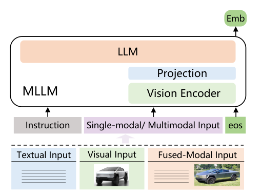
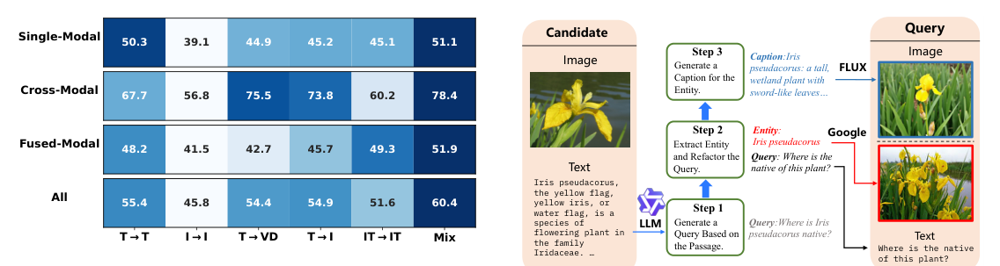
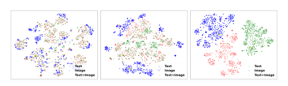
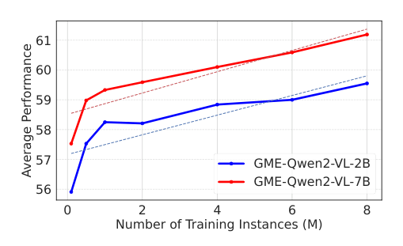
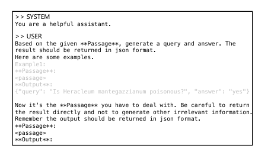
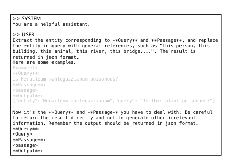
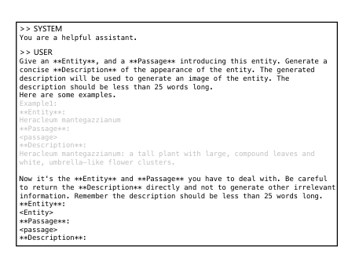
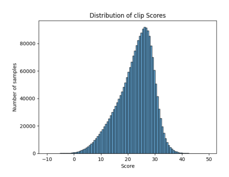

> 原文: [arXiv:2412.16855](https://arxiv.org/abs/2412.16855)（CVPR 2025）
> local PDF: `docs/papers/embedding/GME_2412.16855.pdf`
> 说明: 本文为论文全文中文技术展开，公式/图表编号与原文一致；图片自 arXiv 原图/PDF 抽取，caption 中译；数值原样保留。

**预印本信息：** arXiv:2412.16855 [cs.IR]，2024 年 12 月首发。

**开源：**

- Model (2B): <https://hf.co/Alibaba-NLP/gme-Qwen2-VL-2B-Instruct>
- Model (7B): <https://hf.co/Alibaba-NLP/gme-Qwen2-VL-7B-Instruct>

---

# GME：用多模态 LLM 改进通用多模态检索（Improving Universal Multimodal Retrieval by Multimodal LLMs）

| 字段 | 内容 |
| :--- | :--- |
| 发布 | CVPR 2025（arXiv 首发 2024-12） |
| 作者 | Xin Zhang¹\*、Yanzhao Zhang²\*、Wen Xie²\*、Mingxin Li²、Ziqi Dai²、Dingkun Long²（tech lead）、Pengjun Xie²、Meishan Zhang†、Wenjie Li¹、Min Zhang³ |
| 单位 | ¹香港理工大学（PolyU） ²阿里通义实验室（Tongyi Lab, Alibaba Group） ³苏州大学（Soochow University） |
| 邮箱 | `{linzhang.zx,zhangyanzhao.zyz,dingkun.ldk}@alibaba-inc.com`（通讯 `mason.zms@gmail.com`） |
| Backbone | Qwen2-VL 2B / 7B（MLLM） |
| Modality | 文本 / 图像 / 视觉文档 / 图文融合 |
| 关键 refs | UniIR [66]、E5-V [22]、DSE [41]、VISTA [74]、CLIP [51]、Qwen2-VL [65]、ViDoRe/ColPali [12]、BEIR [55] |

\* 共同第一作者。XZ / WX / ZD 为实习期间完成。DL 为技术负责人。† 通讯作者。

---

## 摘要（Abstract）

**通用多模态检索（Universal Multimodal Retrieval, UMR）** 的目标是用**一个统一模型**在多种模态间做搜索——query 与 candidate 都可能是纯文本、纯图像、或图文融合内容。前人已尝试用**多模态大模型（MLLM）** 来做 UMR，但通常**只用纯文本数据**训练。作者的初步实验显示，**用更多样的多模态训练数据**能进一步释放 MLLM 的表征潜力。但现有多模态训练数据在**模态维度上高度不均衡**——这促使作者设计了一条训练数据合成 pipeline，构造出大规模、高质量的**图文融合（fused-modal）** 训练集。

基于此，作者构建 **GME（General Multimodal Embedder）**，一个基于 MLLM 的稠密检索器，专为 UMR 设计。此外，作者整理出全面的 **UMR Benchmark（UMRB）**，覆盖 47 个评测数据集来度量方法效果。实验表明：GME 在现有 UMR 方法中取得 **SOTA**；作者还对**模型规模、训练策略**做了深入分析，并对**模型结构与合成数据**做了消融。

**图 1（原文 Figure 1）：** UMR 任务的三类子场景示意。**单模态检索（Single-modal）**：query 与 candidate 同模态，如 T→T（问「为什么我只用一个鼻孔呼吸」，返回相关文本段落）或 I→I（两张图匹配）。**跨模态检索（Cross-modal）**：query 与 candidate 不同模态，如 T→I（描述 Cybertruck 检索其图片）或 I→T（用图检索描述）。**融合模态检索（Fused-modal）**：query 或 candidate 至少一端**同时含图与文**，如「这辆车的最大扭矩是多少？」（配 Cybertruck 图）→ 返回图文组合的百科段落。GME 的目标是一个模型覆盖以上全部场景。

---

## 1 引言（Introduction）

多媒体应用的增长要求检索模型突破传统的文-文与文-图搜索。UMR 的核心诉求是：**query 与 candidate 都可能是任意模态**。相比把它拆成一堆单模态 / 跨模态检索器 + 分治 pipeline 的做法，用**一个统一的稠密检索器（dense retriever）** 在**可用性与可扩展性**上更划算——尤其能简化 RAG 应用的工程链路，并**避免模态转换时的信息损失**。

然而现有 UMR 模型主要针对**自然图像**，对**富文本图像 / 视觉文档**（如 PDF 截图、扫描页）这类越来越常见的场景支持不足（见表 1）。

**表 1：现有 UMR 工作对比。** Feat.=Feature，Enc.=Encoder；S&C / Fused / VD 分别指「单+跨模态」「融合模态」「视觉文档检索」；「Multimodal」意指训练数据本身是多模态的（非单一模态）。

| 方法 | 建模方式 | 检索场景 | 训练 | S&C | Fused | VD |
| :--- | :--- | :--- | :--- | :---: | :---: | :---: |
| UniVL-DR [39] | CLIP + Feat. Fusion | Cross-modal | ✓ | ✓ | ✗ | ✗ |
| UniIR [66] | CLIP + Score Fusion / BLIP + Feat. Fusion | Multimodal | ✓ | ✓ | ✓ | ✗ |
| MARVEL [75] | Text Enc.+Plugin | Cross-modal | ✓ | ✓ | ✗ | ✗ |
| VISTA [74] | Text Enc.+Plugin | Multimodal | ✓ | ✓ | ✓ | ✗ |
| E5-V [22] | MLLM | Text-only | ✓ | ✓ | ✓ | ✗ |
| **GME (Ours)** | **MLLM** | **Multimodal** | ✓ | ✓ | ✓ | ✓ |

**GME 的两个关键技术：**

1. **面向 UMR 的训练数据组合策略**：把 UMR 划分成单模态 / 跨模态 / 融合模态三类，通过大量对比实验得到「均衡混合」优于任一单一类型的结论（详见 §4.1、图 3）。
2. **高效的融合模态数据合成 pipeline**：融合模态数据非常稀缺，作者用 LLM + Google Image / FLUX + CLIP 过滤合成了 **110 万条**高质量融合模态样本（详见 §4.2、图 4）。

评测方面，作者构建 **UMRB**，覆盖文本检索（BEIR [55]）、多模态检索（M-BEIR [66]）、视觉文档检索（ViDoRe [12]），并补充自采的融合模态数据。**Backbone** 使用 Qwen2-VL 2B / 7B。GME 在 UMRB 上取得 SOTA。

**贡献总结**：

- 系统探索了 MLLM 适配到 UMR 的策略，提出 GME；
- 发布 UMRB（47 数据集，20 万评测样本，4000 万候选池）；
- 构建 110 万条融合模态合成训练数据；
- 完整的规模、训练策略、结构与数据消融分析。

---

## 2 相关工作（Related Work）

**通用多模态检索** 目前主要有两条路线：一是「双塔独立编码器 + 简单融合」（如 CLIP-SF、UniVL-DR），二是「用一个统一模型编码所有模态」（如 VISTA、E5-V）。GME 属于后者但更进一步：**首次**用 MLLM 微调一个同时能做**视觉检索**且**保持强文本检索**能力的通用检索器；并**首次**把统一检索器扩展到**富文本图像 / 视觉文档**场景。

**基于预训练语言模型的嵌入模型**：Contriever [21]、E5 [62]、GTE [31]、BGE [68] 等文本嵌入模型都建立在 PLM 上；近期 NV-Embed [28]、gte-Qwen [31]、Text-Emb-LLM [63] 等把 **decoder-only LLM** 通过 SFT / 对比学习变成文本嵌入模型（通常取 last hidden state 池化或末位 token）。受此启发，E5-V [22]、VLM2Vec [23] 等开始用 **MLLM** 建通用多模态嵌入。本文延续这一路线并系统证明**MLLM 建通用多模态检索器是可行的**。

---

## 3 通用多模态检索（Universal Multimodal Retrieval）

按 query 与 candidate 的模态组合，UMR 分三类：

- **单模态检索**：query 与 candidate 同模态，例如 **T→T**（文-文）与 **I→I**（图-图）。
- **跨模态检索**：不同模态，典型为 **T→I**（文-图）。作者额外把**富文本图像 / 学术 PDF 截图**这类特殊情形单列为 **T→VD**（Text-to-Visual Document）。
- **融合模态检索**：query / candidate 至少一端是「图 + 文」组合。作者用 **IT**（image-text 组合）来表示这种输入。子类包括 **T→IT、IT→T、IT→I、IT→IT**。

作者特别用 `fused-modal`（融合模态）来指「同时含图和文」的**数据**，与 `multimodal` 指「任务/系统本身跨多模态」区分开来。

### 3.1 UMRB：通用多模态检索评测基准

基于上述分类，作者搭建 **UMRB**，共 **47 个评测子任务**。数据源包括：

1. **BEIR [55]**：文本-文本检索的 16 个数据集（ArguAna、Climate-FEVER、CQADupStack、DBPedia、FEVER、FiQA2018、HotpotQA、MSMARCO、NFCorpus、NQ、Quora、SCIDOCS、SciFact、Touche2020、TRECCOVID、WebQA）；
2. **M-BEIR [66]** 中的视觉中心检索任务；
3. **ViDoRe [12]** 及其扩展：**T→VD** 视觉文档检索（TAT-DQA、ArxivQA、DocVQA、InfoVQA、Shift Project、AI、Government Reports、Healthcare Industry、Energy、TabFQuad，共 10 个）；
4. 作者自行整理的融合模态检索数据（如 EDIS、OVEN、EVQA、INFOSEEK 的融合模态子任务）。

**UMRB-Partial**：完整 UMRB 上评一次 GME-7B 需要约 **400 A100-80G × h**；因此作者从每个类别抽子集，得到保留约 39% 数据集的**开发用小基准**，评一次只需 **80 A100-80G × h**。

**UMRB 类别与数据集总览**：

| 分类 | 子任务（数据集数） | 数据集示例 |
| :--- | :--- | :--- |
| **Single-Modal (17)** | T→T (16) | ArguAna / MSMARCO / NQ / Quora / HotpotQA / … |
|  | I→I (1) | Nights |
| **Cross-Modal (18)** | T→I (4) | VisualNews / Fashion200k / MSCOCO / Flickr30k |
|  | T→VD (10) | TAT-DQA / ArxivQA / DocVQA / InfoVQA / Shift Project / AI / Gov. / Healthcare / Energy / TabFQuad |
|  | I→T (4) | VisualNews / Fashion200k / MSCOCO / Flickr30k |
| **Fused-Modal (12)** | T→IT (2) | WebQA / EDIS |
|  | IT→T (5) | OVEN / INFOSEEK / ReMuQ / OKVQA / LLaVA |
|  | IT→I (2) | FashionIQ / CIRR |
|  | IT→IT (3) | OVEN / EVQA / INFOSEEK |

---

## 4 方法（Method）

本节先讲 GME 的**结构与训练目标**（§4.1），再讲**融合模态数据合成 pipeline**（§4.2）。

### 4.1 GME：通用多模态嵌入器

**图 2（原文 Figure 2）：** GME 架构。输入可以是**纯文本**、**纯图像**、或**图文融合**——统一送进一个 MLLM（Qwen2-VL），其中图像分支经过 **Vision Encoder + Projection** 映射到 LLM 的 token 空间，与文本 token 拼接后共同进入 **LLM**。作者在输入末尾拼上一个 **eos** token，取该 token 在**最后一层 Transformer 的 hidden state** 作为整个输入内容的嵌入（Emb）。前置还会拼上任务相关的 **Instruction**（指令微调思路）。这一「MLLM + eos 位表征」的选择保持了 casual attention 模式（详见 §5.3 消融）。

**模型架构**：采用 MLLM 作为骨干，输入可为图 / 文 / 图-文组合。取**最后一个 token 在最后一层的 hidden state** 作为整段输入的嵌入。虽然预训练 MLLM 已具备较强的多模态理解能力，但**其原始目标不是表征学习**，因此需**任务对齐微调**——GME 采用**对比学习**。

**对比学习设置**：每条训练样本为 $(q, c^+, \{c^-_1, ..., c^-_K\})$：query $q$、正例 $c^+$、$K$ 条负例。$q$ 与 $c$ 都可为文本 / 图像 / 图文对。为让模型能应对不同下游检索任务，作者在 $q$ 前拼**任务指令** $i$。例如 VQA 任务用「Retrieve a passage that provides an answer to the given query about the image」。训练把 $(q, i)$ 送入模型得到 $e_q$，$c$ 送入模型得到 $e_c$。**目标**：让相关对余弦相似度高、无关对相似度低。使用 **InfoNCE loss**：

$$
\mathcal{L} = -\log \frac{\exp(\cos(e_q, e_c^+) / \tau)}{\exp(\cos(e_q, e_c^+) / \tau) + \sum_{i=1}^{K} \exp(\cos(e_q, e_{c_i^-}) / \tau)}
$$

其中 $\tau$ 是温度参数，控制相似度分布的集中度。

**Hard Negative（受 ANCE [69] 启发）**：两阶段训练。

- **Stage 1**：先用**随机负例**训练得到中间模型 $M_1$；
- **Stage 2**：用 $M_1$ 检索 top-K 候选，从中选**非相关**样本作为 hard negative，继续训练 $M_1$ 得到最终模型。

**训练数据组合探索**：以往像 E5-V [22] 只用**单模态文本数据**做微调，但数据多样性对性能的影响并不清楚。作者跑了六组对照：仅 **T→T**（MSMARCO）、仅 **I→I**（ImageNet，同类为正）、仅 **T→I**（LAION）、仅 **T→VD**（Docmatix）、仅 **IT→IT**（EVQA），以及**均衡混合（Mix）**。每种设置采样等量样本（100k / 独立训；Mix 则 5 类各 20k）。评测在 UMRB-Partial 上。

**图 3（原文 Figure 3）：** 训练数据类型 × 评测任务的性能矩阵。**结论有两条**：（1）**单一类型训练**在**对应子任务**上表现最强——例如 T→T 训练在文本检索上第一，T→VD 训练在视觉文档检索上第一；但（2）**均衡混合（Mix / All 列）** 在**跨全部任务**的平均分上最好（Single-Modal 51.1 / Cross-Modal 78.4 / Fused-Modal 51.9 / **Avg 60.4**），显著优于任一单一类型（其它 ~45-55）。因此，**训练数据模态多样性**才是决定通用检索能力的关键。

数据可得性上，单模态与跨模态数据充裕（>1000 万），**融合模态数据稀缺**（EVQA+INFOSEEK+CIRR 合计 <100 万，且覆盖领域有限）。这就是下一节要做数据合成的动机。

### 4.2 融合模态数据合成 pipeline

作者借鉴 **Doc2Query [15]** 的思路——但目标从「单模态文本相关对」改为「**融合模态候选 → query 相关对**」。

**图 4（原文 Figure 4）：** 三步合成 pipeline。**候选**（Candidate）来自 Wikipedia 段落——一段介绍「Iris pseudacorus（黄菖蒲）」的图文百科段落。**Step 1**：让 LLM 基于该段落生成一个自然 query（示例：「Where is Iris pseudacorus native?」）。**Step 2**：让 LLM 从 query 中抽取实体（"Iris pseudacorus"），并把 query 里的实体替换为**泛指代词**（如 "this plant"），得到融合模态 query 「Where is the native of this plant?」。**Step 3**：用 **Google Image Search API** 或 **FLUX.1-dev** 文生图模型为该实体生成/检索图像（附上一段 LLM 生成的 caption 作为文生图 prompt）。将图像与改写后的 query 拼接，就得到「文 + 图」的融合模态 query，其正例即原百科段落。合成结果同样可组装成 **IT→IT** 类型的训练样本。

**候选来源**：主要抽自 Wikipedia 段落，并借助**领域分类模型**（如 animals、plants、architecture 等 15 个粗类）**均匀采样**，仅保留分类置信度 ≥0.5 的样本，以扩大领域多样性。

**两种取图路径**：

- **Google 检索**：调用 Google Image Search API，取匹配实体名的 top-5 图；
- **FLUX 生成**：先让 LLM 基于实体 + 原段落生成适合文生图的 caption，再输入 FLUX.1-dev 生成图像。

**过滤**：FLUX 生成图质量稳定；Google 检索图混入噪声较多，因此用 **CLIP-vit-large-patch14** 计算图-caption 相关性，**分数 <0.2 直接丢弃**。

**规模**：pipeline 一共产出 **1,135,000** 条融合模态训练数据（T→IT / IT→IT），过滤后剩 **1,102,000** 条（损耗率 2.9%）。整个 pipeline 消耗约 **600 A100 GPU-hour**。

---

## 5 实验（Experiments）

### 5.1 训练与评测设置

**训练数据（约 800 万条）：**

| 类别 | 数据来源 | 规模 |
| :--- | :--- | :--- |
| Single-Modal T→T | MSMARCO / NQ / HotpotQA / TriviaQA / SQuAD / FEVER / AllNLI(SimCSE) | 1M |
| Single-Modal I→I | ImageNet（同类为正） | 1M |
| Cross-Modal | LAION / MSCOCO / Docmatix | 2M |
| Fused-Modal | 合成 1.1M + M-BEIR 训练集 0.9M | 2M |

**Backbone**：Qwen2-VL **2B** 与 **7B**。**LoRA rank=8**，lr=1e-4，$\tau=0.03$。

**训练细节**：

- 每张图最多 **1024 个 visual tokens**；
- 含图数据：文本最长 **1800 tokens**，2B batch=**128**、7B batch=**32**；
- 纯文本数据：最长 **512 tokens**，2B batch=**512**、7B batch=**128**；
- 每条样本 **8 个 negative**；
- **bfloat16 + gradient checkpointing**；
- **8 × A100-80G**。

**Baselines**：VISTA、CLIP-SF（CLIP score-fusion）、One-Peace（4B，模态无关）、DSE（4.2B，专攻 T→VD）、E5-V（8B，纯文本训练的 MLLM 嵌入）。

### 5.2 UMRB 主结果

**表 3：UMRB 主结果。** T→T 用 NDCG@10（除 WebQA），T→VD 用 NDCG@5；Fashion200K / FashionIQ / OKVQA 用 Recall@10，其余 Recall@5。

| 方法 | Size | T→T(16) | I→I(1) | T→I(4) | T→VD(10) | I→T(4) | T→IT(2) | IT→T(5) | IT→I(2) | IT→IT(3) | **Avg(47)** |
| :--- | ---: | ---: | ---: | ---: | ---: | ---: | ---: | ---: | ---: | ---: | ---: |
| VISTA [74] | 0.2B | 55.15 | 31.98 | 32.88 | 10.12 | 31.23 | 45.81 | 53.32 | 8.97 | 26.26 | 37.32 |
| CLIP-SF [66] | 0.4B | 39.75 | 31.42 | 59.05 | 24.09 | 62.95 | 66.41 | 53.32 | 34.90 | 55.65 | 43.66 |
| One-Peace [64] | 4B | 43.54 | 31.27 | 61.38 | 42.90 | 65.59 | 42.72 | 28.29 | 6.73 | 23.41 | 42.01 |
| DSE [41] | 4.2B | 48.94 | 27.92 | 40.75 | **78.21** | 52.54 | 49.62 | 35.44 | 8.36 | 40.18 | 50.04 |
| E5-V [22] | 8.4B | 52.41 | 27.36 | 46.56 | 41.22 | 47.95 | 54.13 | 32.90 | 23.17 | 7.23 | 42.52 |
| **GME-Qwen2VL-2B** | 2.2B | 55.93 | 29.86 | 57.36 | 87.84 | 61.93 | 76.47 | 64.58 | 37.02 | 66.47 | **64.45** |
| **GME-Qwen2VL-7B** | 8.2B | **58.19** | 31.89 | 61.35 | **89.92** | 65.83 | **80.94** | **66.18** | **42.56** | **73.62** | **67.44** |

**主要观察：**

1. **2B 已超过 VISTA / CLIP-SF / One-Peace / E5-V**——说明「合适的多模态训练数据 + MLLM」的路线可行；
2. **CLIP-SF > VISTA / E5-V / One-Peace**——VISTA / E5-V 分别受限于「固定文本 backbone」与「纯文本训练」，One-Peace 的模态对齐目标不适合融合模态；
3. **GME vs. DSE（T→VD 专用 4B）**：GME 在视觉文档检索上**追平甚至超过** DSE——把 VD 检索并入统一模型是**可行且有前景**的；
4. **7B > 2B**：模型规模仍有增益。

### 5.3 分析

**嵌入是否真正跨模态通用？**

**图 5（原文 Figure 5）：** 从 EVQA 采样 1000 条样本，把三种模态（Text / Image / Text+Image）的嵌入用 t-SNE 投影到二维。**CLIP**（右）的嵌入**按模态分裂**——文本簇、图像簇明显分开；**VISTA**（中）介于两者之间；**GME**（左）**跨模态混合**、按**语义**聚集（黄组与粉组分别对应两类语义邻近的样本）。这直接支持了「GME 的嵌入是 modality-universal 的」——同一语义无论以哪种模态出现，都会落在相近的空间位置，因此才能在 UMRB 的 fused-modal 任务上刷出优势。

**合成融合模态数据的消融（表 4）：**

| 训练数据 | Single | Cross | Fused | Avg |
| :--- | ---: | ---: | ---: | ---: |
| w/ EVQA（原始） | 45.13 | 60.21 | 49.32 | 51.55 |
| w/ GenFlux（FLUX 生成图） | 46.27 | 61.19 | 51.46 | 52.97 |
| w/ GenGoogle（Google 检索图） | **47.08** | **61.35** | **52.01** | **53.48** |

**两组合成数据都优于原 EVQA**，说明合成数据质量高；Google 检索图**略优于** FLUX 生成图（差距不大），但 API 大规模生成慢，实际项目里 FLUX 是可接受的高效替代。

**训练规模律（scaling）：**

**图 6（原文 Figure 6）：** 横轴为累计训练样本数（0 到 8M），纵轴是 UMRB-Partial 平均分。**2B**（蓝）与 **7B**（红）都呈**近似线性上升**——说明目前的训练量还未见饱和，**继续训还能涨**。作者因时间预算限制在 8M 处停训，明确指出后续工作会尝试更长训练。

**架构与训练策略消融（表 5，均在 100k 样本上跑）：**

| 设置 | Single | Cross | Fused | Avg |
| :--- | ---: | ---: | ---: | ---: |
| **Fine-tuning 策略** | | | | |
| LoRA r=8（默认） | 48.09 | 78.39 | 51.88 | **59.45** |
| LoRA r=16 | 47.86 | 78.63 | 51.42 | 59.30 |
| LoRA r=32 | 47.85 | 78.55 | 50.48 | 58.96 |
| LoRA r=64 | 47.65 | 78.61 | 51.09 | 59.11 |
| Full fine-tuning | 43.16 | 75.79 | 49.28 | 56.07 |
| **训练数据组织** | | | | |
| w/o hard-negative | 47.55 | 78.01 | 50.95 | 58.83 |
| **检索指令** | | | | |
| w/o Instruction | 46.82 | 78.10 | 49.09 | 58.00 |
| **模型设计** | | | | |
| w/ mean pooling | 47.86 | 77.95 | 51.33 | 59.04 |
| w/ bi-attention | 46.55 | 76.78 | 49.54 | 57.62 |

**结论：**

- **LoRA r=8 最优**，加大 rank 或改全参微调都反降——小数据（100k）下 LoRA 更稳；
- 去掉 **hard-negative** 掉 0.6 pt——hard neg 挖掘是有效必需的；
- 去掉 **instruction** 掉 1.4 pt——尤其 fused-modal 掉最明显；
- **mean pooling** vs **EOS token pooling**：EOS 略好；
- **bi-attention**（双向注意力）反而降 1.8 pt——GME 保持 **causal attention + EOS 位表征**，与 NV-Embed 之类先做「bi-directional 转换」的思路不同（因为 Qwen2-VL 已有很好的表征基础，不再单独跑双向阶段更简洁）。

---

## 6 结论（Conclusion）

作者把当前 UMR 系统按 query-candidate 模态划分为**单模态、跨模态、融合模态**三大类；证明 MLLM 是通用多模态检索器的合适 backbone；提出**融合模态数据合成 pipeline** 弥补该类数据的稀缺；发布 **UMRB**（47 数据集）与 **GME-Qwen2-VL-2B / 7B**，在 UMRB 上取得 SOTA。后续方向是更长训练、模态混合的进一步平衡，以及对纯文本能力的**减损优化**（当前 7B 版本在 BEIR 上略逊于同规模纯文本 gte-Qwen2-7B-instruct，见附录）。

---

## 7 附录：UMRB 详情与其他 benchmark 结果

### 7.1 UMRB 数据集清单

UMRB 共 47 个子任务，评测样本约 20 万，候选集合计约 4000 万。**UMRB-Partial** 保留其中约 39% 的数据集（表 6 第 8 列 `In partial`），把 GME-7B 的评测时间从 400 GPU-hour 压到 80 GPU-hour。

### 7.2 BEIR（纯文本）对照

在 BEIR 的 15 个子任务上，GME-Qwen2-VL-7B 得 **55.68**，超过 VISTA / E5-V / One-Peace / DSE 等多模态 baselines；但仍略低于同 backbone 的**纯文本嵌入模型 gte-Qwen2-7B-instruct（60.25）**——加入多模态能力对纯文本检索会带来一定折扣，如何**减小这一折扣**是后续研究方向。

### 7.3 M-BEIR

在 UniIR 提出的 M-BEIR 上，GME-Qwen2-VL-2B 平均分 **53.54**，7B 更高，显著超过 CLIP、SigLIP、BLIP、VISTA、E5-V、One-Peace 等；尤其在 **(qi,qt)→ct**（融合模态 query 检索文本）子任务上有大幅提升，这与 §5.3 的 t-SNE 观察吻合——GME 的嵌入是**语义驱动而非模态驱动**。

### 7.4 ViDoRe（视觉文档）

表 11：ViDoRe 上 GME-Qwen2-VL-7B 平均 **89.92**（NDCG@5），超过 ColPali (81.3)、DSE (78.21)、BGE-M3+Captioning (67.0)、BM25+Captioning (65.1)，是视觉文档检索新的 SOTA——说明**把 T→VD 与其它任务一起训练**并不会拖累 T→VD，反而受益于跨任务的联合学习。

### 7.5 训练超参汇总

| 参数 | GME-Qwen2-VL-2B | GME-Qwen2-VL-7B |
| :--- | :--- | :--- |
| 参数量 | 2B | 8.2B |
| 层数 | 28 | 28 |
| Hidden Size | 1536 | 3584 |
| FFN Inner | 3072 | — |
| Attention Heads | 12 | 28 |
| Vision Depth | 32 | 32 |
| Vision Embed dim | 1280 | 1280 |
| Vision Patch size | 14 | 14 |
| Temperature $\tau$ | 0.03 | 0.03 |
| lr schedule | Linear decay | Linear decay |
| Adam $(\epsilon, \beta_1, \beta_2)$ | (1e-4, 0.9, 0.98) | (1e-4, 0.9, 0.98) |
| Precision | BF16 AMP | BF16 AMP |
| Max Length | 1800 | 1800 |
| Batch Size | 128 | 32 |
| Warm-up ratio | 0.06 | 0.06 |

---

## 8 附录：融合模态数据合成的 Prompt 与示例

### 8.1 合成 pipeline 中的 prompt

作者用 doc2query 思路生成融合模态样本，三步各有一个 in-context prompt。

**图 7（原文 Figure 7）：** 合成 pipeline 第 1 步的 prompt 模板（system + user）。**任务**：给定一段 Wikipedia 段落，让 LLM 输出一个 `{"query": ..., "answer": ...}` 的 JSON。**手段**：用 in-context learning（ICL）——先给 1-2 个示例，再输入待处理的段落。示例中包含 `Heracleum mantegazzianum` 的示范。**要点**：明确要求「直接返回 JSON、不要生成其它信息」，减少 LLM 的自由发挥。

**图 8（原文 Figure 8）：** 合成 pipeline 第 2 步的 prompt。**任务**：让 LLM 从 Step 1 生成的 query 与 passage 中抽取**主实体**，并把 query 里的实体替换为「this person / this building / this animal / this river / this bridge / …」这类**泛指代词**，返回 `{"entity": ..., "query": ...}` JSON。**动机**：得到了泛指后的 query，配上实体对应的图像，就构成了「图 + 文」的融合模态 query——**必须靠图才能定位这个实体是什么**，从而强制模型联合利用图与文来做检索。

**图 9（原文 Figure 9）：** 合成 pipeline 第 3 步的 prompt。**任务**：让 LLM 基于实体（Step 2 抽出的）与原始段落，生成一段「适合作为文生图输入」的 caption，例如把 `Iris pseudacorus` 描述为「a tall, wetland plant with sword-like leaves and yellow flag-like flowers…」。**这段 caption 会喂给 FLUX.1-dev**，生成实体对应的图像。为什么要 LLM 单独写一段而不直接用段落文本？——段落原文往往是百科表述、含大量对文生图不友好的元信息（拉丁学名、分类学、地理分布等）；LLM 重写后能得到**视觉可绘制**的短描述，显著提升图像生成质量。

### 8.2 合成数据示例（跨 15 个领域）

**图 10（原文 Figure 10）：** 合成数据的领域抽样。作者从 15 个粗类（animal / architecture / artwork / currency / entertainment / food / language / literature / mythology / organization / person / …）各展示一条示例，每条包含：Wikipedia 候选文本、FLUX 生成图、Google 检索图、以及最终改写后的**融合模态 query**（如「What is the primary defense mechanism of **this animal**?」配上金色毒蛙的图）。**要点**：Google 与 FLUX 两条路都产生了视觉可辨的实体图，query 中的「this X」这一泛指强迫检索模型必须依赖图像识别出具体实体（golden poison frog / Neoclassical building / euro banknote / Silicon Valley 场景等），才能定位到正确候选段落——这正是 fused-modal 检索区别于单模态与跨模态的核心难点。这也解释了为什么合成后训练的 GME 在 t-SNE 中能形成**跨模态语义混合**的分布。

---

## 9 局限与展望

- **纯文本检索折扣**：加入多模态能力后，同规模纯文本能力略降（BEIR 55.68 vs 60.25），如何减损是开放问题；
- **训练规模未饱和**：图 6 显示继续训还能涨，但受时间预算限制目前停在 8M；
- **多语言能力**：训练数据以英文为主，多语言场景的覆盖尚未系统评测；
- **推理开销**：8B backbone + 1024 视觉 tokens 使得单条 query 的编码延迟高于双塔 CLIP，工业上大规模索引侧仍需权衡。

---

## 10 翻译约定

- **UMR / UMRB / MLLM / LLM / MTEB / BEIR / M-BEIR / ViDoRe / CLIP / SigLIP / BLIP / DSE / E5 / GTE / BGE / NV-Embed / VISTA / ColPali / FLUX / LoRA / SFT / RAG / NDCG / Recall / SOTA / API / GPU / EMA / EOS / VQA / OCR / T-SNE**：保留英文缩写。
- **T→T / I→I / T→I / T→VD / I→T / T→IT / IT→T / IT→I / IT→IT**：按原文表示；T=Text，I=Image，VD=Visual Document，IT=Image+Text 融合。
- 「dense retrieval / dense retriever」译为「稠密检索 / 稠密检索器」。
- 「fused-modal」译为「融合模态」；「multimodal」译为「多模态」——前者指数据本身含图 + 文，后者指任务/系统跨多种模态。
- 「hard negative」译为「困难负例」；「in-batch negatives」保留英文表达。
- 「backbone」译为「骨干模型」或直接保留英文。
- 「visual document」译为「视觉文档」，指 PDF 截图、扫描页这类图像化的富文本材料。
- 「instruction tuning」译为「指令微调」。
- 论文与数据集名保留英文原名（如 EVQA、INFOSEEK、OVEN、ReMuQ、Fashion200k、CIRR、LLaVA、MSCOCO、Flickr30k、Wikipedia）。
