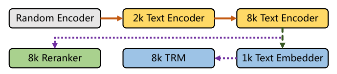

> 原文: [arXiv:2407.19669](https://arxiv.org/abs/2407.19669)（2024-07-29）
> 说明: 本文为论文全文中文翻译，公式与表格编号尽量与原文一致；数值表原样保留数字，图仅保留标题/说明的中译并配原图。
> 产品对应: Hugging Face `gte-*-en-v1.5`（英文）与 `gte-multilingual-base`（多语 mGTE）。

# mGTE：面向多语文本检索的通用长上下文文本表示与重排序模型

**mGTE: Generalized Long-Context Text Representation and Reranking Models for Multilingual Text Retrieval**

Xin Zhang$^{1,2}$, Yanzhao Zhang$^1$, Dingkun Long$^1$, Wen Xie$^1$, Ziqi Dai$^1$, Jialong Tang$^1$, Huan Lin$^1$, Baosong Yang$^1$, Pengjun Xie$^1$, Fei Huang$^1$, Meishan Zhang, Wenjie Li$^2$, Min Zhang

$^1$阿里巴巴集团　$^2$香港理工大学计算学系

{linzhang.zx,zhangyanzhao.zyz,dingkun.ldk}@alibaba-inc.com

https://hf.co/Alibaba-NLP/gte-multilingual-base

---

## 摘要（Abstract）

我们系统性地从零构建面向文本检索的长上下文多语文本表示模型（TRM）与 reranker。首先提出一个增强了 RoPE 与 unpadding 的 base 规模文本编码器，在原生 **8192** token 上下文上预训练（长于此前多语编码器的 512）。随后用对比学习构造混合 TRM 与 cross-encoder reranker。评测表明：该编码器超过同规模此前 SOTA 的 XLM-R；TRM 与 reranker 在常规集上匹配更大体量的 BGE-M3，并在长上下文检索基准上更好。进一步分析显示训练与推理效率都更高。我们相信其效率与效果可服务研究与工业应用。

---

## 引言（Introduction）

文本检索旨在给定 query 后从大规模语料中找出相关段落或文档。它常被实现为多阶段过程：检索器与 reranker。检索器依据稀疏（词项权重）和/或稠密表示的相似度召回候选；reranker 则把 query 与候选拼在一起，用更准但更贵的模型重排。

大语言模型与 RAG 系统带来了对即插即用 TRM / reranker 的空前需求。新应用大量涉及**长文本与多语**，传统编码器难以覆盖。一种做法是把现有多语编码器（如 XLM-R）的上下文窗口续到 8192（如 BGE-M3）；另一种是直接用已具备这些能力的多语 LLM，但自托管搜索服务算力昂贵。

**图 1**：训练流水线。先构建 8K 长上下文多语编码器，再基于它训练检索用的文本表示模型与 reranker。

在英语社区，从零训练长上下文编码器已被证明可行（Jina Embeddings 2、Nomic Embed）。本文继续这条路，给出长上下文多语编码器、TRM、reranker 的系统性实践。我们提出整体流水线（图 1）以及若干建模与训练技术。

具体地，先引入增强 RoPE 与 unpadding 的文本编码器，用两阶段课程的 MLM 做原生 8192 上下文预训练。基于该编码器，提出能同时生成弹性稠密（Matryoshka）与稀疏向量的混合 TRM，以及 cross-encoder reranker。二者均在精心编制的大规模数据上用对比学习训练，作为可直接使用的检索模型。

实验方面：编码器在 XTREME-R 与 GLUE 上超过同规模 XLM-R；TRM 与 reranker 在 MIRACL、MLDR 等多语/长文检索基准上匹配 SOTA 的 BGE-M3，并以更小体量取得更好的长上下文结果。模型与代码将开源。

**图 2**：本文文本编码器架构。

---

## 方法（Method）

### 文本编码器（Text Encoder）

为构建强力的长上下文多语编码器，我们对 BERT 架构做若干增强，并用 XLM-R 系列词表从零训练。

具体地：用旋转位置编码（RoPE）替换绝对位置嵌入；把 FFN 升级为门控线性单元（GLU）；去掉注意力分数上的 dropout，以便兼容 FlashAttention；把 token embedding 大小 pad 到 64 的倍数以提升吞吐。

#### Unpadding 模式

受 MosaicBERT 启发，将输入 batch unpad，减少 padding token 的冗余计算（图 2）。用 xFormers 实现变长注意力：按数值精度、头大小与设备类型把前向/反向派发到不同 kernel（本文采用 memory-efficient attention）。MLM 标签同样 unpad，以降低对非掩码 token 的预测开销。

#### 数据

多语预训练数据来自：C4、Skypile（2021–2023 子集）、mC4（不含英语）、CulturaX、维基百科、自有书籍。过滤后覆盖 **75 种语言**，合计约 **1028B token**（XLM-R tokenizer）。语言统计见附录 Table 7。

#### 训练课表

用 MLM 预训练（去掉 BERT 的 NSP，跟随 RoBERTa）。MLM 概率 30%。不同语言按多项式分布采样：

$$
q_i=\frac{p_i^{\alpha}}{\sum_{j=1}^{N}p_j^{\alpha}},\qquad p_i=\frac{n_i}{\sum_{j=1}^{N}n_j}, \tag{1}
$$

$n_i$ 为语言 $i$ 的文本数，$\alpha=0.5$，以抬高低资源语言比例。为高效训练原生 8192 模型，采用分阶段课表：

- **MLM-2048**：切 2048 token，RoPE base $=10{,}000$。
- **MLM-8192**：切 8192 token，RoPE base $=160{,}000$。

#### 训练配置

跟随 MosaicBERT，使用 learning-rate-decoupled AdamW，weight decay $1\mathrm{e}{-5}$；关掉梯度裁剪（设为 0）。A100 上 BF16 AMP。超参见附录 Table 8。所得模型记为 mGTE-MLM-2048 / 8192。

第一阶段 250k 步约 0.6 epoch，32×A100 耗时 10.75 天；第二阶段 30k 步 20.5 小时。编码器 base 规格：12 层、hidden 768、FFN 3072、12 头，约 **304M** 参数。

我们选择 RoPE，是因为它有良好的上下文外推、非对称相对距离 $D(i,j)\neq D(j,i)$（对双向编码器尤其重要），并已在 RoFormer / LLaMA 上得到验证。

### 文本表示模型（Text Representation Model）

基于编码器，分两步构造第一阶段检索用的 TRM：对比预训练与微调。两步共用 InfoNCE：

$$
\mathcal{L}=-\log\frac{\exp(s(q,d^+)/\tau)}{\sum_{i=1}^{N}\exp(s(q,d^i)/\tau)}. \tag{2}
$$

$\tau$ 为温度，$d^+$ 为正文档，其余为难负例或 in-batch 负例。$s(q,d)$ 为表示向量的点积或余弦。

**图 3**：本文的 TRM 与 reranker。左：稠密 Matryoshka 嵌入 $e$ + 稀疏词权重 $w$；右：cross-encoder 输出标量相关性 $s$。

#### 对比预训练

取编码器 **[CLS]** 隐状态为稠密嵌入，用余弦算相关性。预训练数据（附录 Table 9–10）含自然文本对（Quora / StackExchange QA、Common Crawl 标题–正文）、翻译对（NLLB）、跨语指令数据（xP3x）。batch size **16,384**，学习率 $5\mathrm{e}{-4}$，**240k** 步。每个 batch 只来自单一数据源，采样同式 (1)。query / doc 分别截断到 512 / 1024。将 RoPE base 从 160,000 **反向缩放到 20,000** 以适配 1024 训练长度，同时保留 8K 检索能力（记为 revNTK，消融见 §3.4）。$\tau=0.01$，只用 in-batch 负例。该无监督嵌入模型记为 **mGTE-CPT**。

#### Matryoshka 嵌入

近期模型与 API 常用 MRL 提供弹性子向量以节省索引。设 $\bm{e}\in\mathbb{R}^{H}$，$\bm{e}_{:d}$ 为前 $d$ 维。MRL（此处为 MRL-E）对多个 $d$ 的 InfoNCE 做加权和。该目标加在 TRM **微调**阶段。

#### 稀疏表示

BGE-M3 表明神经稀疏（TRM 预测的 token 权重）能显著提升长上下文检索。我们跟随该设计：token $t$ 的权重 $w_t=\mathrm{ReLU}(W h_t)$，$h_t\in\mathbb{R}^{H}$，$W\in\mathbb{R}^{H\times 1}$ 随机初始化。同一 token 多次出现时取 **max**。稀疏相关性为共现词的权重乘积之和：

$$
s_{\mathrm{sparse}}(q,d)=\sum_{t\in q\cap d}(w^q_t\cdot w^d_t).
$$

再由此构造 InfoNCE。

#### 对比微调

多任务学习 Matryoshka 嵌入与稀疏表示：

$$
\mathcal{L}_{\mathrm{TRM}}=\lambda\mathcal{L}_{\mathrm{sparse}}+\sum_{d\in D}w_d\,\mathcal{L}_{:d}, \tag{3}
$$

其中 $D=\{32k\mid k\in\mathbb{N},k\ge 1,32k\le H\}$，$w_d$ 为各维权重，$\lambda$ 为稀疏损失权重。在带难负例的高质量数据上微调（MS MARCO、MIRACL 等，Table 11）。采用动态 batch 以吃 8192 上下文。batch 采样同预训练。MRL / 稀疏的 $\tau$ 分别为 0.05 / 0.01。微调后模型记为 **mGTE-TRM**。

### 文本重排序模型（Text Reranking Model）

用 cross-encoder：输入 `[CLS] $q$ [SEP] $d$`，用 [CLS] 输出经线性层得 $s_{\mathrm{rerank}}=W h_{\mathrm{[CLS]}}$。在文本编码器上 **一步** InfoNCE 微调（对比预训练对 reranker **没有增益**）。数据与 TRM 微调相同，仅调整难负例构成。记为 **mGTE-reranker**。

---

## 评测（Evaluation）

分别评编码器（§3.1）以及 TRM / reranker（§3.2–3.3）。

### 自然语言理解

在跨语 NLU 基准 XTREME-R 与英文 GLUE 上，编码器超过同规模此前 SOTA 的 XLM-R。

#### XTREME-R

关注零样本跨语迁移：在英文训练集微调，在多语/跨语测试。Table 1：mGTE-MLM-2048 / 8192 均分比 XLM-R 高 **3.22 / 2.42**。

**表 1**：XTREME-R 跨语零样本（模型在英文数据上训练）。M.C. 为多项选择。EM 不计入平均。

| 模型 | Avg. | XNLI | XCOPA | UDPOS | WikiANN | XQuAD F1/EM | MLQA F1/EM | TyDiQA F1/EM | Mewsli-X | LAReQA | Tatoeba |
| --- | --- | --- | --- | --- | --- | --- | --- | --- | --- | --- | --- |
| 语言数 | | 15 | 11 | 38 | 47 | 11 | 7 | 9 | 38 | 11 | 38 |
| mBERT-base | 59.43 | 66.63 | 55.49 | 71.80 | 62.34 | 66.23/51.03 | 57.37/42.44 | 55.01/38.05 | 44.65 | 75.26 | 39.49 |
| XLM-R-base | 62.02 | 74.50 | 50.45 | 73.84 | 61.23 | 72.83/58.01 | 61.54/46.45 | 53.09/37.11 | 42.09 | 63.43 | 67.20 |
| mGTE-MLM-2048 | **65.24** | 73.17 | **63.62** | 73.25 | 60.87 | **75.33/60.00** | 64.02/48.57 | 53.58/36.68 | **44.41** | **72.13** | **72.02** |
| mGTE-MLM-8192 | 64.44 | 73.37 | 61.98 | 73.14 | 59.83 | 74.81/59.37 | **64.24/48.80** | 49.85/33.27 | 44.52 | 71.54 | 71.10 |

#### GLUE

dev 均分（不含 WNLI）。Table 2：持续超过 XLM-R-base，合理落后于英文 RoBERTa-base。

| 模型 | 参数 | 位置 | 序列长 | GLUE Avg. |
| --- | --- | --- | --- | --- |
| RoBERTa-base | 125M | Abs. | 512 | 86.4 |
| XLM-R-base | 279M | Abs. | 512 | 80.44 |
| mGTE-MLM-2048 | 305M | RoPE | 2048 | 83.42 |
| mGTE-MLM-8192 | | | 8192 | **83.47** |

### 文本嵌入

对比预训练本身就得到嵌入模型。在 MTEB 英/中/法/波上评测。

**表 3**：嵌入模型在 MTEB English / Chinese / French / Polish 上的表现。其它模型分数来自 MTEB 在线榜。$*$ 检索任务文档侧最大长度 1024，与对比预训练一致。

| 模型 | Seq. | en | zh | fr | pl |
| --- | --- | --- | --- | --- | --- |
| BGE-M3-unsupervised | 8192 | 56.48 | 57.53 | 57.95 | 55.98 |
| mGTE-CPT | 512$*$ | 60.16 | 58.67 | 59.72 | 57.66 |
| mGTE-CPT | 8192 | 60.04 | 58.63 | 59.74 | 57.11 |
| mE5-base | 514 | 59.45 | 56.21 | 56.19 | 55.62 |
| mE5-large | 514 | 61.50 | 58.81 | 56.07 | 60.08 |
| BGE-M3 (Dense) | 8192 | 59.84 | 60.80 | 58.79 | 60.35 |
| **mGTE-TRM (Dense)** | 8192 | **61.40** | **62.72** | **59.79** | 58.22 |
| E5-mistral-7b | 32768 | 66.63 | 60.81 | 48.33 | — |
| voyage-multilingual-2 | 32000 | — | — | 61.65 | — |
| Cohere-multilingual-v3.0 | 512 | 64.01 | — | 56.02 | — |
| OpenAI-3-large | 8191 | 64.59 | — | — | — |
| OpenAI-3-small | 8191 | 62.26 | — | — | — |

对比预训练模型全面超过 BGE-M3-unsupervised，尽管骨干小于 XLM-R-large。最终 TRM 在中、法最好，英文有竞争力。

**图 4**：弹性嵌入在 MTEB English 上的结果。与同档英文 nomic-v1.5 接近，仍低于 OpenAI API（后者体量据估大得多）。

### 文本检索

在多语 MIRACL / MLDR、跨语 MKQA、英文 BEIR / LoCo 上评测。模型在常规集上接近更大 SOTA，在长文集上更好。

**表 4**：MIRACL、MLDR（多语）、MKQA（跨语）、BEIR 与 LoCo（英文）检索结果。

| | 参数 | Seq. | Avg. | MLDR | MIRACL | MKQA | BEIR | LoCo |
| --- | --- | --- | --- | --- | --- | --- | --- | --- |
| 指标 | | | | nDCG@10 | nDCG@10 | recall@20 | nDCG@10 | nDCG@10 |
| 语言数 | | | | 13 | 18 | 25 | 1 | 1 |
| BM25 | — | — | 47.0 | 53.6 | 31.9 | 28.1 | 41.7 | 79.9 |
| mE5-base | 279M | 514 | 53.5 | 30.5 | 62.3 | 53.7 | 48.9 | 72.2 |
| mE5-large | 560M | 514 | 57.7 | 34.2 | 65.4 | 63.5 | 51.4 | 74.3 |
| E5-mistral-7b | 7111M | 32768 | 62.4 | 42.6 | 62.2 | 62.4 | 56.9 | 87.8 |
| OpenAI-3-large | — | 8191 | — | — | 54.9 | 62.1 | 55.4 | 79.4 |
| BGE-M3 Dense | 568M | 8192 | 64.3 | 52.5 | 67.7 | 67.8 | 48.7 | 84.9 |
| BGE-M3 Sparse | | | 55.1 | 62.2 | 53.9 | 36.3 | 38.3 | 84.9 |
| BGE-M3 Dense+Sparse | | | 67.7 | 64.8 | **68.9** | **68.1** | 49.4 | 87.4 |
| mGTE-TRM Dense | 304M | 8192 | 66.7 | 56.6 | 62.1 | 65.8 | 51.1 | 88.9 |
| mGTE-TRM Sparse | | | 57.2 | 71.0 | 55.9 | 31.6 | 39.2 | 88.1 |
| **mGTE-TRM D+S** | **304M** | 8192 | **68.9** | **71.3** | 64.5 | 66.0 | **51.4** | **91.3** |

TRM 持续超过 mE5 与 OpenAI API；MLDR 好于 BGE-M3，其余接近。

**表 5**：在我们 TRM 稠密召回候选上的 rerank 结果。

| | 参数 | Seq. | Avg. | MLDR | MIRACL | MKQA | BEIR |
| --- | --- | --- | --- | --- | --- | --- | --- |
| Retrieval (mGTE-TRM Dense) | 304M | 8192 | 58.9 | 56.6 | 62.1 | 65.8 | 50.9 |
| jina-reranker-v2-multilingual | 278M | 8192 | 59.4 | 53.2 | 65.8 | 68.8 | 49.7 |
| bge-reranker-v2-m3 | 568M | 8192 | 65.7 | 66.8 | **72.6** | 68.7 | 54.6 |
| **mGTE-reranker** | **304M** | 8192 | **67.4** | **78.7** | 68.5 | 67.2 | **55.4** |

以更小体量超过 bge-reranker-v2-m3，并大幅超过同规模 jina-reranker-v2-multilingual。

### 分析

#### 效率

**表 6**：稠密检索效率。编码时间：MLDR-hi 语料（3806 篇，截断到 8192 后均长 4456 token）单卡 A100 FP16。检索延迟：faiss 索引 880 万条。MEA 为 xFormers memory-efficient attention。

| 模型 | Attn. | Unpad. | 编码时间 | 检索延迟 |
| --- | --- | --- | --- | --- |
| BGE-M3 | eager | × | 1800s | 20.35ms |
| BGE-M3 | SDPA-MEA | | 744s | |
| mGTE-TRM | eager | × | 695s | 15.07ms |
| | SDPA-MEA | × | 298s | |
| | eager | ✓ | 675s | |
| | SDPA-MEA | ✓ | 279s | |
| | **MEA** | **✓** | **52s** | |

相对 BGE-M3 最多约 **14×**（52s vs 744s）。端到端 unpadding + xFormers 对编码至关重要（52s vs 279s，约 5×）。

#### 缩放的对比预训练（revNTK）

对比预训练用反向 NTK：把 RoPE base 设为原来的 $1/8$，用 1K 最大长度训练 8K 编码器。对照实验去掉 revNTK，MLDR 见图 5。带 revNTK 时 1K 评测略低，但 **8K 表现跨训练步更稳定**。

**图 5**：对比预训练中的 MLDR 分数。none 表示预训练不改 RoPE；1024 / 8192 为评测最大长度。revNTK-8192 用 NTK 缩放恢复 8K 上下文。无缩放的 8K 训练会出现剧烈崩溃。

---

## 相关工作（Related Work）

训练长上下文 TRM 近来成为热点。OpenAI 8191 上下文 API 为开源社区设立了目标。MosaicBERT / Jina Embeddings 2 用 ALiBi 替换 BERT 位置编码并从零预训练，可做出 8K TRM。Nomic Embed 在 BERT 预训练中探索更强的 RoPE，2048 上下文编码器在英文检索上更好。LongEmbed 建议给 E5 打 RoPE 补丁。我们也用 RoPE，并为原生 8192 编码器、TRM、reranker 提供多阶段训练。

BGE-M3 基于 XLM-RoBERTa-large，通过继续训练把位置编码扩到 8192。我们选择 **从零预训练原生 8K 多语模型**，以获得更好的长上下文性能与效率。

---

## 结论（Conclusion）

我们给出原生 8192 上下文多语检索模型的整体实践。首先提出带 RoPE 与 unpadding 的文本编码器，用两阶段 MLM 课表做 8K 预训练；NLU 基准上超过同规模 XLM-RoBERTa。基于该编码器，用对比学习构造混合 TRM 与 cross-encoder reranker。TRM 用反向 RoPE NTK 缩放做对比预训练，微调后同时生成 Matryoshka 嵌入与稀疏表示。在单语与跨语检索基准上，TRM 与 reranker 在常规集上接近更大模型，在长文集上更好——意味着更适合工业应用。

---

## 附录 A：MLM 预训练

### 数据

来源：C4、Skypile（2021–2023）、mC4（排除英语）、CulturaX、Wikipedia Foundation、自有书籍。过滤后 **1028B token**，75 语（简繁中文计为一种）。原始文本存于 4.47 TiB arrow 文件。各语言 token 数与体积见原文 Table 7（英语 187B token / 772 GiB 最大；西、法、日、俄、越、中、印尼、葡、德、阿等随后）。

### 训练细节

两阶段 MLM。第一阶段最大长度 2048、batch 8192、约 0.6 epoch（250k 步），数据按式 (1) 采样。第二阶段对短于 2048 的文本降采样，继续 30k 步，最大长度 8192、batch 2048。RoPE base 分别为 10,000 与 160,000。

编码器按 PyTorch 默认初始化（12 层 × 768）。transformers + BF16。decoupled AdamW，weight decay 1e-5。超长文本切块，短文本不改。

**表 8**：MLM 预训练超参。

| 超参 | MLM-2048 | MLM-8192 |
| --- | --- | --- |
| 参数量 | 304M | |
| 层数 / hidden / FFN / 头 | 12 / 768 / 3072 / 12 | |
| Attention head size | 64 | |
| Dropout / Attention dropout | 0.1 / 0 | |
| lr decay | Linear | |
| Adam $\epsilon,\beta_1,\beta_2$ | 1e-6, 0.9, 0.98 | |
| Gradient clipping | 0.0 | |
| Precision | PyTorch BF16 AMP | |
| Weight decay | 1e-5 | |
| Max length | 2048 | 8192 |
| Batch size | 8192 | 2048 |
| Peak lr | 5e-4 | 5e-5 |
| Warm-up ratio | 0.06 | 0.06 |
| Max steps | 250000 | 30000 |
| RoPE base | 10000 | 160000 |

### 关于 RoPE 的补充

RoPE 可先在短窗口训练再在长窗口推理；非对称相对距离对双向编码器重要；RoFormer 与 LLaMA 已验证有效。

---

## 附录 B：对比学习

### 预训练数据

弱相关文本对来自四块：英文对（E5 / GTE 路线）、中文对（GTE / BGE C-Pack）、多语 cc-news、跨语指令与翻译（xP3x / NLLB）。去重并丢低质后共 **2,938.8M** 对。Table 9 合计 2,595.57M 对（不含 cc-news）；Table 10 的 cc-news 另有 343.26M 对。因 batch 极大（16,384）且每 batch 单一来源，不足 1 GiB 的低资源语言被合并为 MIX。

英文大头包括：dpr_reddit 199.8M、baai_mtp_en 196.6M、commoncrawl 139.9M、reddit_title_body 124.9M、amazon_review 87.9M、s2orc 系列等。中文大头：baai_mtp_zh 100.1M、wodao 59.1M、zhihu_qa 53.4M、baidu_baike 34.2M、commoncrawl_zh 28.4M。跨语：translation_eg_NLLB **940.6M**、xp3x 351.9M。

### 微调数据

英文七集：MS MARCO、NQ、TriviaQA、HotpotQA、SQuAD、FEVER、AllNLI（SimCSE）。中文六集：DuReader、mMARCO-zh、T2-Ranking、CmedQAv2、SimCLUE、Multi-CPR。多语三集：Mr.TyDi、MIRACL、MLDR。只用各集训练集，并用对比预训练模型挖难负例。

**表 11**：微调数据规模。

| 数据集 | 语言 | Size |
| --- | --- | --- |
| MS MARCO, HotpotQA, NQ, NLI 等 | English | 1.4M |
| DuReader, T2-Ranking, SimCLUE 等 | Chinese | 2.0M |
| MIRACL, Mr.TyDi, MLDR | Multilingual | 118.9K |

### TRM 训练配置

对比预训练： [CLS] 作嵌入；按式 (1) 从 Table 9 或 cc-news 子集采样，每 batch 单一来源，batch **16,384**。DeepSpeed ZeRO stage 1 + FP16，约 0.4 epoch（240k 步，16×A100 154 小时），采样后约 3.93B 对。AdamW lr 2e-4，linear decay，warmup 0.05，$\beta=(0.9,0.999)$，$\epsilon=1\mathrm{e}{-7}$，grad clip 1.0。

微调：每 query 1 正 + 8 难负。按长度分组动态 batch，子 batch + 梯度检查点后再 gather。8×A100，10 epoch。长度–batch 见 Table 12。

### Reranker 训练配置

数据与 TRM 微调相同。每 query 10 负：6 难负 + 4 随机负。除 batch 外超参同 TRM。

**表 12**：微调阶段不同长度的 batch（BS）与子 batch（S-BS）；E 为嵌入，R 为 reranker。

| length | BS(E) | S-BS(E) | BS(R) | S-BS(R) |
| --- | --- | --- | --- | --- |
| 0–500 | 768 | 256 | 512 | 256 |
| 500–1000 | 384 | 128 | 384 | 128 |
| 1000–2000 | 256 | 64 | 256 | 64 |
| 2000–3000 | 160 | 48 | 160 | 48 |
| 3000–8000 | 80 | 16 | 80 | 16 |

（原文 Table 12 列名为 BS(E)/S-BS(R) 交叉排版，上表按「嵌入 / reranker 各有 BS 与子 batch」解读。）

---

## 附录 C–E 评测设置（摘要）

XTREME-R 与 GLUE 的微调脚本见 `github.com/izhx/nlu-evals`。GLUE 各子集分数见原文 Table 13。检索评测细节（MIRACL 18 语、MLDR 13 语长文档、MKQA 跨语、BEIR、LoCo）见原文附录 E。MLDR 是 BGE-M3 引入的多语长文档检索基准，是本工作相对「短上下文多语编码器续训」路线最能拉开差距的评测。

---

## 主要参考文献（节选）

- Chen et al. (2024). BGE M3-Embedding. arXiv:2402.03216
- Conneau et al. (2020). Unsupervised Cross-lingual Representation Learning at Scale (XLM-R). ACL
- Devlin et al. (2019). BERT. NAACL
- Kusupati et al. (2022). Matryoshka Representation Learning. NeurIPS
- Li et al. (2023). Towards General Text Embeddings with Multi-stage Contrastive Learning. arXiv:2308.03281
- Nussbaum et al. (2024). Nomic Embed. arXiv:2402.01613
- Portes et al. (2023). MosaicBERT. NeurIPS
- Su et al. (2024). RoFormer / RoPE. Neurocomputing
- Wang et al. (2022). Text Embeddings by Weakly-Supervised Contrastive Pre-training (E5). arXiv:2212.03533
- Zhang et al. (2023b). MIRACL. TACL
