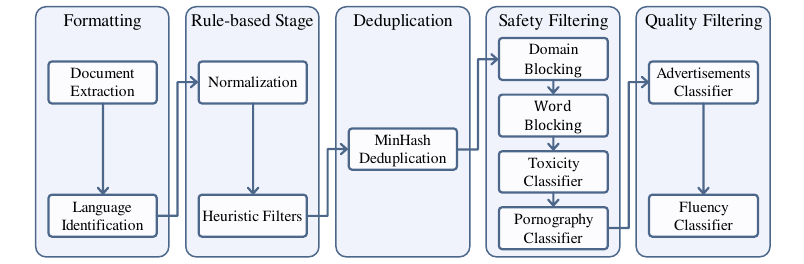
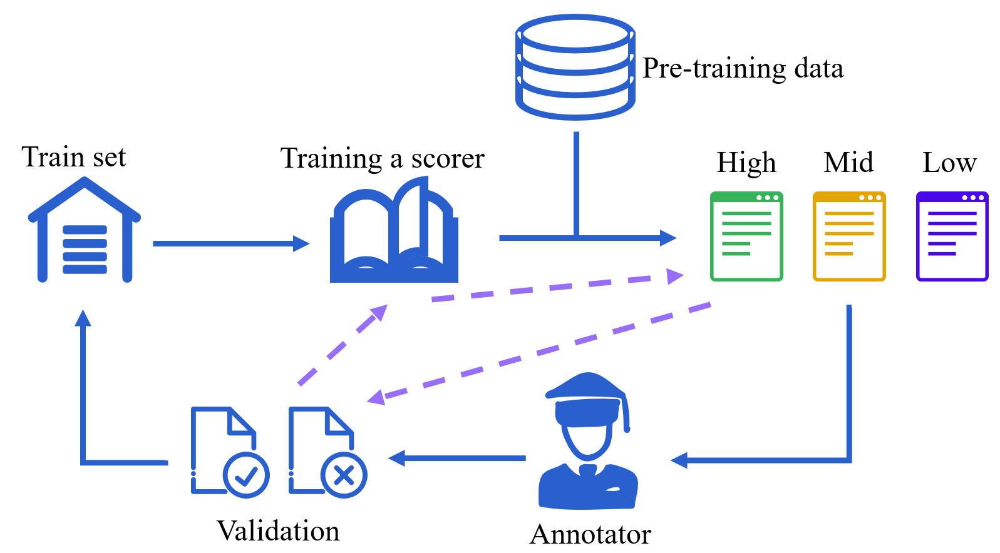

> 原文: [arXiv:2403.17297](https://arxiv.org/abs/2403.17297)（v1, 2024-03-26）
> 说明: InternLM2 技术报告全文 53 页，覆盖基础设施、预训练、对齐（SFT/RLHF）、评测、工具调用等。**本翻译聚焦与"预训练数据处理与过滤"相关的章节**（摘要/引言中的数据部分、模型结构、第 3 章 Pre-train 的数据流水线、预训练设置与阶段），这是 Conan-embedding v1 引用"Cai et al. (2024) 标准数据过滤方法"的出处；对齐与评测等章节按节标题概述，不逐句展开。公式/表格编号尽量与原文一致，数值原样保留。

# InternLM2 技术报告（数据处理与预训练部分 · 中译）

**InternLM2 Technical Report**

Zheng Cai, Maosong Cao, Haojiong Chen, Kai Chen, Keyu Chen, Xin Chen, Xun Chen, Zehui Chen, Zhi Chen, Pei Chu, 等（上海人工智能实验室 / 商汤 / 港中文 / 复旦等，InternLM 团队）

---

## 摘要（Abstract · 摘译）

大语言模型（LLM）如 ChatGPT、GPT-4 的演进引发了对 AGI 的讨论，但把这些能力复现到开源模型仍具挑战。本报告介绍 **InternLM2**，一个开源 LLM，通过创新的预训练与优化技术，在 6 个维度、30 个基准的综合评测、长上下文建模与开放式主观评测上超越此前开源模型。InternLM2 的预训练过程被细致记录，涵盖多类数据的准备——文本、代码与长上下文数据。它先在 4k token 上训练，再在预训练与微调阶段推进到 32k token，展现出在 200k "Needle-in-a-Haystack" 测试中的出色长上下文能力。InternLM2 进一步用监督微调（SFT）与一种新颖的**条件在线 RLHF（COOL RLHF）**策略对齐，以应对人类偏好冲突与奖励作弊（reward hacking）。我们发布了不同训练阶段与不同规模（1.8B、7B、20B）的 InternLM2 模型，为社区提供对模型演进的洞见。

**与本翻译相关的核心贡献**：报告详尽披露了 LLM 的数据准备方法，包括**预训练数据、领域增强数据、SFT 数据与 RLHF 数据**——过往技术报告（LLaMA、Qwen 等）很少涉及预训练数据的处理细节，而 InternLM2 明确认为"**数据质量是预训练最关键的因素**"，并给出可复用的处理流水线。

---

## 引言中的数据观点（Introduction · 数据相关摘译）

LLM 的开发包含几个主要阶段：预训练、监督微调（SFT）与基于人类反馈的强化学习（RLHF）。**预训练主要依赖海量自然文本语料（数万亿 token），旨在赋予 LLM 广博知识与基础能力。数据质量被认为是预训练阶段最关键的因素。** 然而，过往 LLM 技术报告很少论及预训练数据的处理，InternLM2 则详细阐述了如何为预训练准备文本、代码与长上下文数据。

如何有效扩展 LLM 的上下文长度是当前热点，因为 RAG、智能体等下游应用依赖长上下文。InternLM2 先用 GQA（Group Query Attention）降低长序列推理时的显存占用；预训练阶段先用 4k 上下文文本训练，再切换到高质量 32k 文本继续训练；完成后通过位置编码外推，在 200k 上下文的"大海捞针"测试中表现优异。

---

## 模型结构（Model Structure · 摘译）

Transformer 因其出色的并行能力长期作为 LLM 骨干。LLaMA 在 Transformer 基础上以 **RMSNorm** 替换 LayerNorm、以 **SwiGLU** 作激活函数，提升了训练效率与性能。为让 InternLM2 无缝融入围绕 LLaMA 架构建立的成熟生态（高效推理、算子优化等），并与 Falcon、Qwen、Baichuan、Mistral 等对齐，我们**遵循 LLaMA 的结构设计原则**。为提升效率，我们将 $W_k$、$W_q$、$W_v$ 三个矩阵合并，使预训练加速 5% 以上；为更好支持多样的张量并行（tp）变换，我们对矩阵布局做了重构——不再简单堆叠，而是对每个 head 的 $W_k,W_q,W_v$ 采用交错（interleaving）排布，从而可沿最后一维拆分/拼接来调整张量并行规模，增强分布式环境下的灵活性。InternLM2 目标是推理超过 32K 上下文……

---

## 预训练（Pre-train）

本部分介绍预训练数据、预训练设置与三个预训练阶段。

### 预训练数据（Pre-training data）

LLM 的预训练受数据的深刻影响，这是一项多层面的挑战：既要处理敏感数据、覆盖全面知识，又要平衡效率与质量。本节描述我们为通用领域文本数据、编程语言相关数据、长文本数据准备所用的**数据处理流水线**。

#### 文本数据（Text Data）

预训练数据集中的文本数据按来源可分为**网页、论文、专利与书籍**。为把这些来源转化为预训练数据集，我们首先将所有数据标准化为指定格式，按类型与语言分类，并以 JSON Lines（jsonl）格式存储。然后对所有数据施加若干处理步骤：**基于规则的过滤、数据去重、安全过滤与质量过滤**，最终得到丰富、安全、高质量的文本数据集。

**数据源分布**　我们按来源统计了预训练数据集的文档数、存储大小与字节占比（表 1）。其中来自网页的中英文数据占总量 **86.46%**，是主要来源。尽管书籍与技术文献（techlit）等其它来源数据量相对较小，但其平均文档更长、内容质量相对更高，同样重要。

**表 1：不同来源的预训练数据汇总。**

| 来源 | 文档数（百万行） | 字节数（GB） | 字节占比 |
| --- | --- | --- | --- |
| en-books（英文书籍） | 0.50 | 220.14 | 1.63% |
| en-techlit（英文技术文献） | 59.27 | 576.48 | 4.27% |
| en-webpages（英文网页） | 3614.07 | 9129.39 | 67.51% |
| zh-books（中文书籍） | 0.71 | 366.82 | 2.71% |
| zh-techlit（中文技术文献） | 89.59 | 668.19 | 4.94% |
| zh-webpages（中文网页） | 928.94 | 2562.86 | 18.95% |

**数据处理流水线（Data Process Pipeline）**　本工作所用的数据处理流水线如图 3 所示。整个流水线首先把不同来源的数据标准化，得到 **Format data（格式化数据）**；然后用启发式统计规则做数据过滤，得到 **Clean data（清洗数据）**；接着用**局部敏感哈希（LSH）**做数据去重，得到 **Dedup data（去重数据）**；再施加复合安全策略过滤，得到 **Safe data（安全数据）**；最后对不同来源采用不同质量过滤策略，最终得到 **High-quality pre-training data（高质量预训练数据）**。

**图 3（Data Process Pipeline）**：从左到右五段串行——**Formatting（格式化：文档抽取 → 语言识别）→ Rule-based Stage（规则阶段：归一化 → 启发式过滤）→ Deduplication（去重：MinHash 去重）→ Safety Filtering（安全过滤：域名封禁 → 词表封禁 → 毒性分类器 → 色情分类器）→ Quality Filtering（质量过滤：广告分类器 → 流畅度分类器）**。每一段的产物依次是 Format→Clean→Dedup→Safe→High-quality data。

**数据格式化（Data Formatting）**　我们以网页数据为例详述流程。网页数据主要来自 Common Crawl。首先解压原始 Warc 格式文件，用 **Trafilatura**（Barbaresi, 2021）做 HTML 解析与正文抽取；然后用 **pycld2** 库做正文的语言检测与分类；最后为数据分配唯一标识符，以 jsonl 格式存储，得到 Format data。

**规则阶段（Rule-based Stage）**　从互联网随机抽取的网页数据常含大量低质内容，如解析错误、格式错误、非自然语言文本。常见做法是设计基于规则的正则化与过滤方法来修改和过滤数据，如 Gopher、C4、RefinedWeb。基于对数据的观察，我们设计了一系列启发式过滤规则，聚焦于**分隔与换行的异常、异常字符频率、标点分布**等。应用这些过滤器后，得到 Clean data。

**去重（Deduplication）**　互联网上存在大量重复文本，会对模型训练产生负面影响。因此我们采用基于**局部敏感哈希（LSH）**的模糊去重：具体使用 **MinHash** 方法，在文档的 **5-gram** 上用 **128 个哈希函数**建立签名，以 **0.7** 作为去重阈值。我们倾向保留最新数据，即优先保留 CC dump 编号较大者。经 LSH 去重后得到 Dedup data。

**安全过滤（Safety Filtering）**　互联网充斥有毒与色情内容，用于训练会损害性能并增加生成不安全内容的可能。因此我们采用**"域名封禁 + 词表封禁 + 色情分类器 + 毒性分类器"**的复合安全策略：
- 构建了约 **1300 万（13M）个不安全域名**的封禁域名列表，以及含 **36,289 个不安全词**的封禁词表，做初步过滤。考虑到词表封禁可能误伤大量数据，我们在编制封禁词表时采取谨慎态度。
- 为进一步提升不安全内容检出率，我们用 Kaggle 的 **"Toxic Comment Classification Challenge"** 数据集微调 BERT，得到**毒性分类器**；从 Dedup data 采样并用 **Perspective API** 标注，构造色情分类数据集，微调 BERT 得到**色情分类器**。最后用这两个分类器做二次过滤，滤除分数低于阈值的数据，得到 Safe data。

**质量过滤（Quality Filtering）**　相较书籍、论文、专利，互联网来源数据含大量低质内容，主因有二：1）互联网充斥重复且信息量低的营销广告；2）许多网页由文章摘要列表或产品描述构成，抽取文本难读且缺乏逻辑连贯性。为滤除这些内容，我们先组织人工标注：
- **广告分类任务**：标注者判断一段数据是否含广告内容（整体或局部广告都标为低质）；
- **流畅度分类任务**：标注者从**一致性、噪声、信息量、语法**四个维度打分，得到综合流畅度分数。

然后用人工标注数据微调 BERT，得到**广告分类器**与**流畅度分类器**，用它们做二次过滤，滤除低于阈值的数据，得到 High-quality pre-train data。

#### 代码数据（Code Data）

编程是 LLM 的关键技能，支撑编码辅助、软件开发、构建工具调用智能体等下游应用。此外，有研究指出在代码数据上训练可增强推理能力，因为代码通常比自然语言更结构化、严谨、可预测。

**数据源分布**　我们从多种来源收集数据，包括直接从 GitHub 爬取、公开数据集，以及编码相关在线资源（问答论坛、教程站、API 文档等），统计见图 4。表 2 是基于我们训练的打分模型做的数据质量评估：**高质量数据获得更高采样权重、在预训练阶段可多次训练；中等质量数据按正常权重、通常训练一次；低质量数据被剔除**——我们的经验表明，尽管低质数据占比不大，剔除它们对优化模型性能与保证训练稳定性至关重要。

**表 2：基于可学习分类器的代码数据质量统计**（高质量多次训练、中等训练一次、低质量丢弃；低资源编程语言的数据会被保留且不计入此统计）。

| 质量档 | 字节数（GB） | 占比 |
| --- | --- | --- |
| High（高） | 105.6 | 16.8% |
| Moderate（中） | 440.1 | 69.9% |
| Low（低） | 83.85 | 13.3% |

**格式清洗（Format Cleaning）**　所有数据转为统一的 **Markdown** 格式。仍有极小部分数据存在损坏的 HTML/XML 格式，我们用一组启发式规则尽量减少这类情况，但未在格式净化上投入过多。选 Markdown 是因其简单（最小化格式的 token 开销）且便于代码与自然语言交错。实际预训练所用格式更复杂，涉及**按依赖关系拼接多个代码文件**——利用交错数据教模型理解编程，这一点近期研究也有提及。

**数据去重（Data Deduplication）**　代码去重与自然语言类似，区别在**分词**会影响超参选择。例如 Python 用两个空格、四个空格或制表符表示缩进，传统空白分词器可能误判这些样本为不同数据。我们的洞见是：**有效的分词器是应用统一去重策略的关键**。尽管近期有研究探索段落或行级细粒度去重，我们仍在**文件级**去重以保持上下文完整性。

**质量过滤（Quality Filtering）**　质量是 LLM 预训练中关键却模糊的方面，主因是难以在规模上量化其对模型性能的影响。我们采用**混合的多阶段过滤流程**，结合规则打分器与模型打分器：
- **规则打分器**是启发式且多样的，但我们发现**代码风格不是可靠的质量指标**，会把过多代码误判为低质。
- **模型打分器**：我们评估了若干骨干模型，用约 **5 万**标注样本训练。但发现打分器评估与人类判断的相关性**因语言而异**，且扩大训练集并未显著提升打分器精度。因此我们**只对"模型预测与人工评估在验证集上高度一致"的语言启用模型打分**。

为获得可靠标注，我们引入一种**迭代标注流程**（图 5）来应对"代码质量定义模糊"的难题。识别"对教 LLM 有帮助的代码"对人类专家也并非易事（如广为人知的代码库对初学者可能过于复杂）。该迭代工作流让标注者验证模型预测并据此**优化标注指南**。为提升标注效率，我们只让标注者检查**打分器高置信标为高质量与低质量**的样本；每轮还有自动验证流程，确保先前已标注样本被打分器正确分类（图中黄色虚线）。实践中我们经**三轮迭代**敲定打分模型。

**图 5（iterative refinement annotation process）**：闭环流程——用 **Train set（训练集）** 训练一个 **Scorer（打分器）**，打分器对 **Pre-training data** 打分分成 **High / Mid / Low** 三档；**Annotator（标注者，图中戴学士帽）** 对高/低置信样本复核，产出 **Validation（验证：正确√/错误✗）**，验证结果回流补充训练集，迭代优化打分器与标注指南（紫色虚线表示标注者对打分器与样本的反馈）。核心思想是：在"质量定义模糊"下，用人机协同的迭代而非一次性标注来逼近可靠的质量判别。

**依赖排序（Dependency Sorting）**　InternLM2 的训练上下文窗口扩到 32,000 token，可利用整个代码仓库的上下文。但仓库结构可能在前述处理步骤（按扩展名过滤、去重）中被破坏，因此我们先把来自**同一仓库**的代码文件重新分组，做**依赖排序**以确定拼接顺序——于是一个代码仓库被视为一个含代码块的长 Markdown 文件，让模型学习跨文件依赖。我们用正则检测各语言的 "import" 关系，用**拓扑排序**决定文件拼接顺序。实践中文件排布可能跨越文件夹边界，形成来自多个子文件夹的交错序列；非代码文件（如 markdown 与其它文档）置于同一子文件夹首个代码文件之前。对于"祖先与后代间存在多条路径"及"import 关系图中出现环"等边角情形，前者取较短路径、后者按字母序定起点。检测 import 关系的一个技巧是处理批量导入（如 `__init__.py` 或 `#include xx.h`），这些文件可能导入一堆未使用的依赖，故用启发式规则细化 import 关系的检测。

#### 长上下文数据（Long Context Data）

处理超长上下文（>32K token）的能力日益受关注，能拓展书籍摘要、长期对话、复杂多步推理等应用。预训练数据是扩展上下文窗口的关键因素之一。我们遵循 Lv et al. (2024) 的长文本预训练数据准备流程（其中有更多实验与讨论），此处仅概述 InternLM2 所用的数据准备。

**数据过滤流水线**　用于滤除低质长文本，含三阶段：a）**长度选择**——基于规则，选出超过 32K 字节的样本；b）**统计过滤器**——用统计特征识别并移除异常数据；c）**困惑度过滤器**——利用困惑度差异评估文本片段间的连贯性，滤除含干扰性上下文的样本。注意：长上下文训练所选数据是标准预训练语料的**子集**，即长上下文数据在预训练中**至少被学两次**。

**统计过滤器（Statistical Filters）**　我们用多种词法与语言学特征构造统计过滤器，不符合既定规则的样本被排除。完整列表见 Lv et al. (2024)。一个值得注意的过滤器是检查**连词及暗示语篇结构的词**（如 "Especially"、"Formally" 等）的出现。设计这类过滤器的总原则是**滤除无意义数据，而非挑选最高质量数据**。统计过滤器对长文本尤其有效，因为长文本的统计特征远比短文本一致——20 token 的文本难有可靠统计，而 32K token 的文本统计特征分布清晰得多。

**困惑度过滤器（Perplexity filters）**　困惑度常被当作文本序列概率 $P(X)$ 的估计量。我们略作改动，用它估计两个文本片段间的**条件概率** $P(S_2|S_1)$（$S_1$ 在 $S_2$ 之前）。当 $S_1$ 与 $S_2$ 强相关时，条件概率应高于单独估计 $S_2$ 的概率，即**困惑度差为负**；反之，若概率反向变化，说明 $S_1$ 是干扰性上下文，应从语料中移除。理想情况下，增加更多上下文不应损害后续文本的可预测性；但在拼接不当（如 HTML 解析失败、随机社交媒体片段、复杂版面识别错误）时会出现例外。注意我们**只依据困惑度差而非困惑度本身过滤**，这可大幅缓解估计量本身（用哪个模型算困惑度）引入的偏差。

**阈值选择（Threshold Selection）**　选择合适阈值是过滤中既难又关键的一步，且因我们构建了许多过滤器而更严峻。两条经验：
- **为每个领域单独定制阈值，而非追求通用解**。例如连词的统计过滤器不适用于通常没有连词的长代码；教科书、研究论文、小说、专利各具特征；跨语言同理。通用阈值会误分大量数据。
- **用验证集简化流程，只关注边界样本**。不同于基于学习的特征抽取器/打分器，我们的统计与困惑度过滤器在同一领域内产出平滑结果，因此可只聚焦阈值附近的样本，只需判断"调高还是调低"。

图 6 展示应用全部过滤器前后的数据分布：整个过滤过程剔除了大比例的网页数据（Common Crawl）与专利数据，而多数书籍与论文数据被保留。

**图 6（长文本数据统计）**：(a) **未过滤**的长文本数据构成——CommonCrawl 30.5%、Book 25.7%、Paper 21.5%、Patent 20.3%、Profession 1.81%；(b) **过滤后**——Book 30.5%、Patent 25.7%、Paper 23.3%、CommonCrawl 18.1%、Profession 2.14%。对比可见：过滤后 **CommonCrawl 占比从 30.5% 大幅降到 18.1%**，而 Book、Paper、Patent 等高质量长文本占比上升，印证"过滤剔除了大量低质网页长文本、保留了书籍/论文"。

### 预训练设置（Pre-training Settings）

本部分介绍分词与预训练超参。

**表 3：InternLM2 各规模超参。**

| 参数量 | 层数 $n_{layers}$ | 维度 $n_{dim}$ | KV 头数 $n_{kv\_heads}$ | 每 KV 的 Q 头数 $n_{q\_per\_head}$ | 学习率 | Batch Size |
| --- | --- | --- | --- | --- | --- | --- |
| 1.8B | 24 | 2048 | 8 | 2 | 3e-4 | 4M |
| 7B | 32 | 4096 | 8 | 4 | 3e-4 | 4M |
| 20B | 48 | 6144 | 8 | 6 | 3e-4 | 5M |

**分词（Tokenization）**　我们选用 GPT-4 的分词方式，因其在压缩多样文本内容上效率出色。主要参照 **cl100k** 词表（约 100,256 条，主含英文与编程语言 token，中文 token 不足 3,000）。为在维持词表规模低于 10 万的同时优化中文压缩率，我们从 cl100k 精选前 **60,004** 个 token，与 **32,397** 个中文 token 整合，并加入 **147** 个备用 token，凑成 **256 的整数倍**的词表规模，以利高效训练。

**预训练超参（Pre-training Hyper-parameters）**　基础超参见表 3。训练用 **AdamW**（$\beta_1=0.9,\beta_2=0.95,\epsilon=1e{-}8$，weight decay=0.1）优化，采用**余弦学习率衰减**，学习率衰减到峰值的 10%。

### 预训练阶段（Pre-training Phases）

1.8B、7B、20B 模型预训练所用总 token 数为 **2.0T–2.6T**，过程分**三个阶段**。第一阶段用长度不超过 4k 的语料；第二阶段纳入 50% 长度不超过 32k 的语料；第三阶段用能力特定的增强数据。每个阶段都混合英文、中文与代码数据。

**4k 上下文训练**　约 90% 的训练步用长度至多 4096 token 的数据。若数据超过 4096，则强制截断，剩余部分也用于训练。

**长上下文训练**　从 4K 语料切换到 32K 语料。并非只用 32k 语料，仍有 50% 数据短于 4096 token。该长上下文训练阶段约占总步数 **9%**。为适配更长序列，我们把 **RoPE 底数从 50,000 调到 1,000,000**，以获得更有效的长上下文位置编码。得益于 InternEvo 与 flash attention 的良好可扩展性，上下文窗口从 4K 变到 32K 时训练速度仅下降 40%。

**能力特定增强训练（Capability Specific Enhancement Training）**　推理、数学解题、知识记忆是 LLM 的关键能力，但高质量的能力相关数据在整个语料中稀疏分布。参照 Qwen、GLM-130B、Nemotron-4 等在预训练阶段引入指令式或高质量数据的做法，InternLM2 收集了一个精心配比的增强数据集（含高质量检索数据与来自 HuggingFace 的各类开源数据），共 **24B（240 亿）token**（表 4），并滤除测试集相关数据、做污染测试。为让模型充分拟合这些数据，采用更小的学习率与 batch size。此阶段后，模型在编码、推理、问答、考试上显著提升。我们发布增强训练前后的检查点，分别命名为 InternLM2-{size}-Base 与 InternLM2-{size}。

**表 4：能力增强数据构成。**

| 类别 | Tokens(B) | 比例(%) |
| --- | --- | --- |
| 检索的 STEM 数据（Retrieved Stem Data） | 15.97 | 65 |
| 检索的特定领域数据（Retrieved Special Domain Data） | 2.17 | 8 |
| 精选高质量数据（Selected High Quality Data） | 6.26 | 26 |
| **总计** | **24.40** | 100 |

---

## 报告其余章节（节标题概述，未逐句翻译）

以下章节与"预训练数据处理"关系较弱，故仅列出以保持全貌，不逐句展开：

- **基础设施（Infrastructure）**：训练框架 **InternEvo**（数据/张量/序列/流水线并行 + ZeRO + FlashAttention + BF16 混合精度，千卡 MFU 达 53%–64%，支持 256K 序列长度）；推理与训练框架。
- **对齐（Alignment）**：SFT（含 1000 万指令样本，覆盖对话、数学、代码等）；**COOL RLHF**（条件奖励模型调和冲突偏好 + 多轮 PPO 缓解奖励作弊）；工具增强（代码解释器、检索）。
- **评测与分析（Evaluation and Analysis）**：下游任务客观评测（综合考试、语言、推理数学、代码）、长上下文（200k 大海捞针）、对齐主观评测、数据污染分析等。
- **结论**：InternLM2 在多规模、多阶段上开源，兼顾客观性能与主观对齐，并强调数据准备的可复用性。

> 如需上述章节的完整翻译，可在后续按需扩展本文件；本翻译定位为服务 embedding 调研（Conan-v1 引用的数据过滤方法），故对预训练数据处理做了完整逐句翻译，其余部分概述。
