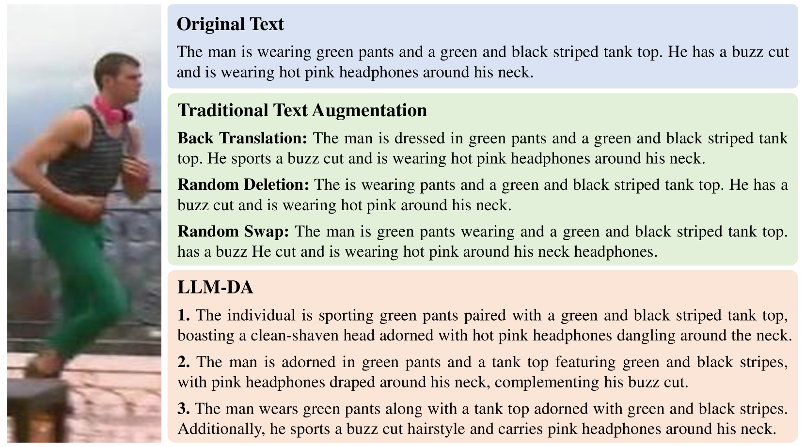
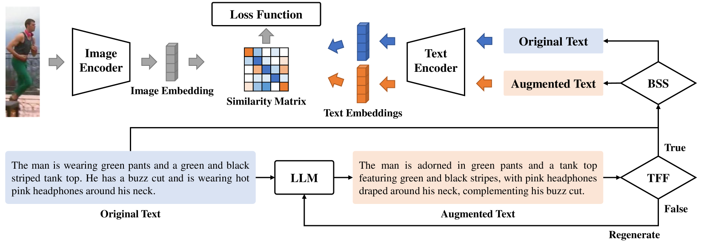
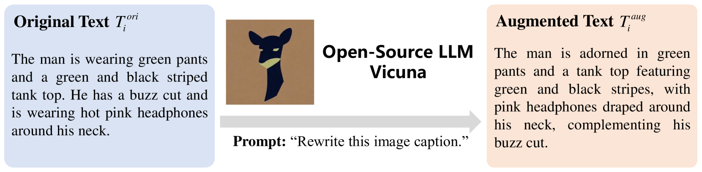
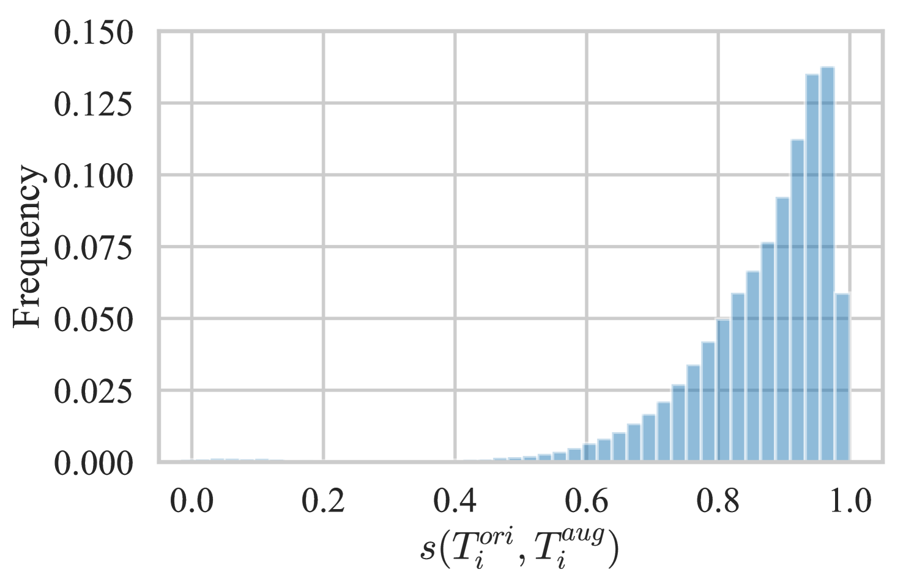
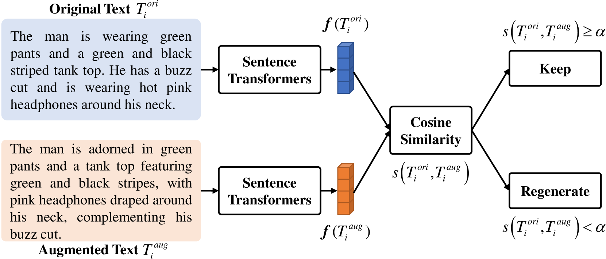
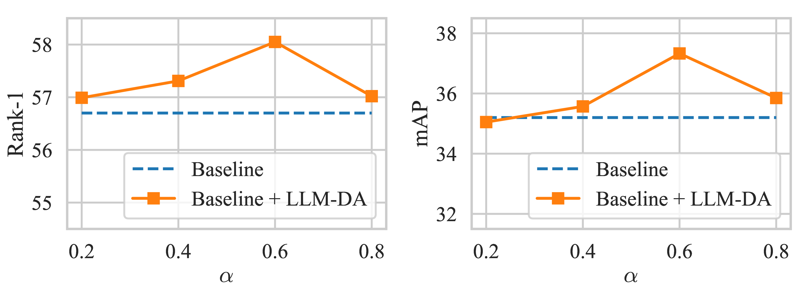
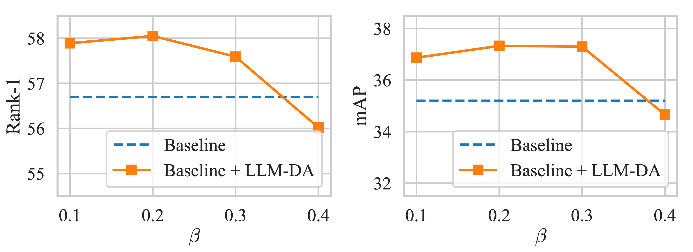
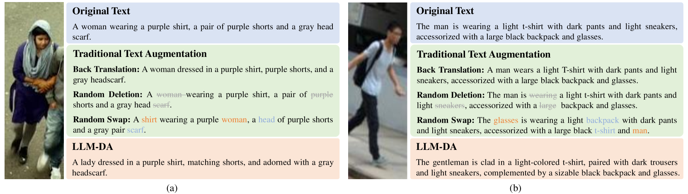

> 原文: [arXiv:2405.11971](https://arxiv.org/abs/2405.11971)
> 说明: 本文为论文全文中文翻译，公式编号与原文一致；图表保留标题/说明中译，数值表数字原样。

**预印本信息：** arXiv:2405.11971v1 [cs.CV]，2024 年 5 月 20 日提交。

**关键词（隐含）：** 基于文本的行人检索、数据增强、大语言模型、CLIP、对比学习、文本忠实度过滤、平衡采样。

**说明：** 原文未单独设附录（Appendix）章节；正文、图表说明与参考文献均已纳入本译稿。

# 使用大语言模型进行基于文本的行人检索（Text-based Person Retrieval, TPR）数据增强

**作者：** Zheng Li、Lijia Si、Caili Guo、Yang Yang、Qiushi Cao

**单位：** 北京邮电大学（Beijing University of Posts and Telecommunications）

**邮箱：** {lizhengzachary, silijia, guocaili, yangyang01, 819972578}@bupt.edu.cn

---

## 摘要（Abstract）

基于文本的行人检索（Text-based Person Retrieval, TPR）旨在根据给定文本查询检索与之匹配的行人图像。TPR 模型的性能提升有赖于用于监督训练的高质量数据。然而，由于标注成本高昂以及隐私保护等因素，构建大规模、高质量的 TPR 数据集十分困难。近年来，大语言模型（Large Language Models, LLMs）在许多自然语言处理（Natural Language Processing, NLP）任务上已达到甚至超越人类水平，为扩充高质量 TPR 数据集提供了可能。本文提出一种面向 TPR 的基于大语言模型的数据增强（LLM-based Data Augmentation, LLM-DA）方法。LLM-DA 使用 LLM 重写当前 TPR 数据集中的文本，以简洁高效的方式实现数据集的高质量扩展。这些重写文本在保留原始关键概念与语义信息的同时，能够增加词汇与句法结构的多样性。为缓解 LLM 的幻觉（hallucination）问题，LLM-DA 引入文本忠实度过滤器（Text Faithfulness Filter, TFF）以过滤不忠实的重写文本。为平衡原始文本与增强文本的贡献，提出平衡采样策略（Balanced Sampling Strategy, BSS）来控制训练中原始文本与增强文本的使用比例。LLM-DA 是一种即插即用（plug-and-play）方法，可轻松集成到多种 TPR 模型中。在三个 TPR 基准上的全面实验表明，LLM-DA 能够提升现有 TPR 模型的检索性能。

---

## 1. 引言（Introduction）

基于文本的行人检索（TPR）[16] 旨在根据给定文本查询检索与之匹配的行人图像，它是图像-文本检索（image-text retrieval）[5] 与行人重识别（person re-identification, Re-ID）[36] 的子任务。TPR 可根据文本描述辅助识别监控录像中捕获的个体，对监控与安全应用具有重要意义——基于文本描述识别个体可助力执法与公共安全工作。

当前 TPR 研究 [2, 16] 主要聚焦于提取判别性特征表示与细粒度特征对齐，以获得有竞争力的检索性能。作为多模态学习任务，TPR 模型的性能提升有赖于用于监督训练的高质量数据。然而，为 TPR 模型训练构建大规模、高质量 TPR 数据集十分困难，原因有二：1）**数据匮乏**。受隐私保护限制，难以获取大规模行人图像。2）**高质量标注匮乏**。文本标注繁琐且不可避免地引入标注者偏差。因此，现有 TPR 数据集中的文本通常较短，无法全面描述目标行人的特征。为解决该问题，Yang 等 [34] 构建了大规模多属性数据集 MALS，用于 TPR 任务的预训练；构建 MALS 耗费大量人力物力，我们对他们为 TPR 领域做出的贡献深表感谢。

除构建大规模数据集外，数据增强（data augmentation）也是扩展数据规模、促进模型训练的有效途径。与数据集构建相比，数据增强的劳动力与物料成本更低。Cao 等 [4] 对 TPR 任务中的数据增强进行了全面实证研究，涵盖图像增强与文本增强。图像增强方法包括传统的裁剪、遮挡与变换等；文本增强方法包括回译（back translation）、随机删除（random deletion）等。多数传统图像增强方法能够提升 TPR 模型的检索性能。然而我们发现，这些传统文本增强方法对检索性能的提升并不显著，部分方法甚至会降低检索性能。这些简单文本增强方法对文本多样性的提升有限。更严重的是，随机删除、随机交换（random swap）等粗糙文本增强方法可能破坏正确的句子结构，甚至改变文本的原始语义概念，如图 1 所示。这些低质量增强文本会对模型训练产生负面影响。

近年来，LLM 在许多 NLP 任务上已达到甚至超越人类水平，为扩充高质量 TPR 数据集提供了可能。LLM 可用于重写原始文本以生成新文本，从而实现文本增强。得益于 LLM 强大的语义理解与生成能力，这些重写文本在保留原始关键概念与语义信息的同时，能够增加词汇与句法结构的多样性。图 1 展示了我们使用开源 LLM Vicuna [6] 生成的增强文本。LLM 生成的增强文本在保持正确句子结构的同时能够提升文本多样性。尽管 LLM 具有强大的生成能力，幻觉一直是 LLM 难以彻底解决的棘手问题。LLM 可能生成不符合预期的增强文本，这是需要解决的问题。

本文提出面向 TPR 的 LLM-DA 方法。LLM-DA 使用 LLM 重写当前 TPR 数据集中的文本，以简洁高效的方式实现数据集的高质量扩展。这些重写文本在保留原始关键概念与语义信息的同时，能够增加词汇与句法结构的多样性。为缓解 LLM 的幻觉问题，LLM-DA 引入 TFF 以过滤不忠实的重写文本。为平衡原始文本与增强文本的贡献，提出 BSS 来控制训练中原始文本与增强文本的使用比例。LLM-DA 既不改变原始模型架构，也不影响原始损失函数的形式，因此是一种可轻松集成到多种 TPR 模型的即插即用方法。本文主要贡献如下：

- 提出面向 TPR 的 LLM-DA 方法，使用 LLM 重写当前 TPR 数据集中的文本，以简洁高效的方式实现数据集的高质量扩展。这是首次探索在 TPR 任务中使用 LLM 进行数据增强。
- 提出 TFF 以过滤不忠实的重写文本，缓解 LLM 的幻觉问题。
- 提出 BSS 以控制训练中原始文本与增强文本的使用比例。
- LLM-DA 可即插即用地集成到多种 TPR 模型中。在三个 TPR 基准上的全面实验表明，LLM-DA 能够提升现有 TPR 模型的检索性能。




**图 1.** 原始行人图像、原始文本与增强文本。

| 类别 | 文本 |
|------|------|
| **原始文本（Original Text）** | The man is wearing green pants and a green and black striped tank top. He has a buzz cut and is wearing hot pink headphones around his neck. |
| **传统文本增强（Traditional Text Augmentation）** | **回译（Back Translation）：** The man is dressed in green pants and a green and black striped tank top. He sports a buzz cut and is wearing hot pink headphones around his neck. **随机删除（Random Deletion）：** The is wearing pants and a green and black striped tank top. He has a buzz cut and is wearing hot pink around his neck. **随机交换（Random Swap）：** The man is green pants wearing and a green and black striped tank top. has a buzz He cut and is wearing hot pink around his neck headphones. |
| **LLM-DA** | 1. The individual is sporting green pants paired with a green and black striped tank top, boasting a clean-shaven head adorned with hot pink headphones dangling around the neck. 2. The man is adorned in green pants and a tank top featuring green and black stripes, with pink headphones draped around his neck, complementing his buzz cut. 3. The man wears green pants along with a tank top adorned with green and black stripes. Additionally, he sports a buzz cut hairstyle and carries pink headphones around his neck. |

---

## 2. 相关工作（Related Work）

### 2.1. 基于文本的行人检索（Text-based Person Retrieval）

基于文本的行人检索（TPR）[16] 旨在根据给定文本查询检索与之匹配的行人图像。Li 等 [21] 首次提出 TPR，它是图像-文本检索 [5] 与 Re-ID [36] 的子任务。特征提取（feature extraction）与特征对齐（feature alignment）是 TPR 的核心步骤，当前 TPR 研究主要聚焦这两个方面。

**特征提取**指从输入的行人图像与文本描述中提取判别性特征。Li 等 [20, 21] 使用长短期记忆网络（Long Short-Term Memory, LSTM）提取文本特征，使用卷积神经网络（Convolution Neural Networks, CNN）提取图像特征。Zhu 等 [39] 使用在 ImageNet 数据集上预训练的 ResNet-50 [15] 提取图像特征，使用双向门控循环单元（Bidirectional Gate Recurrent Unit, Bi-GRU）提取文本特征。近年来，随着 Transformer [31] 与双向编码器表示（Bidirectional Encoder Representations from Transformers, BERT）[7] 的出现，大规模预训练模型逐渐被用于特征提取。Han 等 [14] 首次在 TPR 中引入对比语言-图像预训练（Contrastive Language-Image Pre-Training, CLIP）[24] 进行特征提取。Jiang 等 [16] 分别使用 CLIP 图像编码器与文本编码器提取图像与文本特征。Yang 等 [34] 使用 Swin Transformer [22] 提取图像特征、BERT 提取文本特征。Bai 等 [2] 使用大规模视觉-语言预训练模型 ALBEF [19] 提取图像与文本特征。

**特征对齐**指有效匹配图像与文本特征的过程。Li 等 [20] 使用跨模态交叉熵（Cross-Modal Cross-Entropy, CMCE）损失进行特征对齐。Li 等 [21] 提出带门控神经注意力（Gated Neural Attention, GNA）机制的循环神经网络（Recurrent Neural Network with Gated Neural Attention, GNA-RNN）以捕获图像与文本之间的关系。除损失函数与注意力机制外，近期研究 [17, 23, 32, 39] 使用更复杂的模型进行特征对齐。Zhu 等 [39] 使用五个不同模块与损失函数进行特征对齐，充分利用多模态与多粒度信息以提升检索性能。Niu 等 [23] 提出多粒度图像-文本对齐（Multi-granularity Image-text Alignment, MIA）模型以缓解跨模态细粒度问题。提出视觉-文本属性对齐模型（Visual-Textual Attribute Alignment Model, ViTAA）模块，使用 k-reciprocal 采样对齐损失 [32] 对齐行人局部特征与文本属性特征。Jing 等 [17] 提出矩对齐网络（Moment Alignment Network, MAN）以解决跨域与跨模态对齐问题。后续研究更关注多模态的细粒度对齐。Jiang 等 [16] 在随机掩码语言建模范式下设计隐式关系推理模块，完成模态细粒度对齐并实现跨模态文本与视觉交互。Yang 等 [34] 融合图像-文本对比学习（Image-Text Contrastive Learning, ITC）、图像-文本匹配学习（Image-Text Matching Learning, ITM）与掩码语言建模（Masked Language Modeling, MLM）施加对齐约束。Bai 等 [2] 提出关系感知（Relationship-Aware, RA）学习与敏感性感知（Sensitivity-Aware, SA）学习：RA 关注图像与文本的相关性，属于粗粒度优化；SA 更关注图像与文本的交互，属于细粒度优化。

回顾 TPR 的发展，多数研究通过特征层面提升检索性能，但高质量数据对监督学习模型性能至关重要。隐私保护与标注成本使得构建大规模、高质量数据集颇具挑战。Yang 等 [34] 构建大规模多属性数据集 MALS 用于 TPR 预训练，耗费大量人力物力。为以较低成本获取大规模、高质量数据，本文考虑将数据增强引入 TPR。

### 2.2. 数据增强（Data Augmentation）

数据增强通过改变与扩展原始数据以增加数据多样性并提升模型鲁棒性。TPR 数据集通常以图像-文本对（image-text pairs）形式构建，因此 TPR 数据集的数据增强需同时考虑图像增强与文本增强。

**图像增强。** 图像增强方法众多。常用传统方法包括随机裁剪（random cropping）、翻转（flipping）、缩放（scaling）、颜色变换（color transformation）等。此外，Mixup [38]、CutMix [37] 等新型图像增强方法也被广泛使用。Mixup 在每个 batch 中随机选取两张图像并按一定比例混合生成新图像；CutMix 通过随机裁剪并粘贴来自图像不同区域的片段生成新图像，从而提升模型学习局部特征的能力。先前研究 [15, 18, 27–29] 表明，图像数据增强能有效提升模型的泛化性与鲁棒性。Cao 等 [4] 指出，图像增强对提升 TPR 性能有一定效果；在 TPR 场景下，图像侧增强与文本侧增强可互补——前者增强视觉不变性，后者增强语言描述多样性。本文工作聚焦文本侧，图像增强仍沿用基线 CLIP 训练中的常规设置，不额外引入新的图像变换策略。

**文本增强。** 相比图像增强，文本增强因文本的复杂性、抽象性、灵活性、稀缺性与多样性而面临更多挑战。简易数据增强（Easy Data Augmentation, EDA）[33] 是一种简单文本增强方法，包括同义词替换、随机插入、随机交换与随机删除。回译 [11] 通过将文本翻译为另一种语言再译回以生成新句子。尽管回译应用广泛且取得一定成功，但因不同语言间的文化差异，可能导致语义不一致且缺乏普适性。CutMixOut [13] 结合 Cutout [8] 与 CutMix [37]，通过二元掩码随机替换与删除文本子序列。然而，这些方法可能破坏句子的结构与语义信息，且增强文本缺乏多样性。随着 LLM 的广泛应用，可使用 LLM 进行文本增强：在保障句子语义完整性的同时，LLM 还能增加句法结构与形式的多样性，有效提升模型的泛化性与鲁棒性，例如 Fan 等 [12] 通过 LLM 增强文本以提升 CLIP 性能。

### 2.3. 大语言模型（Large Language Models）

Transformer 架构为后续 LLM 的发展奠定了基础。Radford 等 [25] 提出生成式预训练 Transformer（Generative Pretrained Transformer, GPT）模型，基于 Transformer 架构，成为 LLM 发展的基石。随后一系列 GPT 模型 [1, 3, 26] 的出现进一步推动了该领域发展。此外，LLaMA [30]、GLM [10] 等开源模型的发布，经多种任务微调后成为众多应用的主干。Vicuna [6] 以更具经济性的 7B 与 13B 版本在保持出色性能的同时，显著推动了 LLM 领域进展。这些模型在各类基准上取得可比性能，为扩充高质量 TPR 数据集提供了可能。

尽管 LLM 能在多种任务上表现良好，将其用于文本增强时仍存在需解决的问题。关键问题之一是 LLM 的幻觉：指生成文本在语法正确性、流畅性与真实性上与原始输入文本不一致，甚至与事实不符 [35]。幻觉问题不仅降低生成文本的可靠性，还可能导致输出文本质量不均，有时甚至出现异常文本。因此，有必要解决 LLM 的幻觉问题。

---

## 3. 方法（Methodology）




**图 2.** 在 TPR 模型训练中使用 LLM-DA 的框架。

```
                    损失函数（Loss Function）

   图像编码器              文本编码器
  (Image Encoder)        (Text Encoder)
        |                      |
   图像嵌入              文本嵌入
 (Image Embedding)    (Text Embeddings)
        \                    /
         \                  /
          相似度矩阵（Similarity Matrix）
                    |
              [BSS 平衡采样策略]

原始文本 ──→ LLM ──→ 增强文本 ──→ TFF ──→ 保留 / 重新生成
```

### 3.1. 预备知识（Preliminary）

基于文本的行人检索（TPR）定义为：给定文本查询，检索与之相关的行人图像。记 $V = \{V_i\}_{i=1}^{I}$ 为行人图像集合，$T = \{T_i\}_{i=1}^{I}$ 为文本描述集合，其中 $V_i$ 为行人图像，$T_i$ 为文本描述。在 TPR 中，给定文本描述 $T_i$，目标是从行人图像集合 $V$ 中找到最相关的行人图像 $V_i$。当前 TPR 模型通常遵循统一框架，包含图像编码器 $f^{\mathrm{img}}(\cdot)$ 与文本编码器 $f^{\mathrm{text}}(\cdot)$。$V_i$ 与 $T_i$ 之间的相似度 $s(V_i, T_i)$ 基于编码后的图像特征 $f^{\mathrm{img}}(V_i)$ 与文本特征 $f^{\mathrm{text}}(T_i)$ 计算，最终通过对相似度排序得到检索结果。

### 3.2. 基于 LLM 的数据增强（LLM-based Data Augmentation）

图 2 展示了在 TPR 模型训练中使用 LLM-DA 的框架。LLM-DA 首先利用 LLM 重写原始文本以生成增强文本；随后，为缓解 LLM 的幻觉问题，引入 TFF 过滤不忠实的重写文本——一方面，语义一致的重写文本作为增强文本用于模型训练；另一方面，LLM-DA 丢弃不忠实的重写文本并再次使用 LLM 重写原始文本以生成新的增强文本。最后，为平衡原始文本与增强文本的贡献，LLM-DA 引入 BSS，通过采样控制训练中原始文本与增强文本的使用比例。通过 BSS，行人图像与文本之间计算的相似度矩阵为混合相似度矩阵，既包含图像与原始文本之间的相似度，也包含图像与增强文本之间的相似度；该混合相似度矩阵用于计算损失函数并实施模型训练。




**图 3.** 使用 LLM 进行文本增强。

图 3 展示如何使用 LLM 生成增强文本。以一条原始文本为例：

- **原始文本 $T_i^{\mathrm{ori}}$：** The man is wearing green pants and a green and black striped tank top. He has a buzz cut and is wearing hot pink headphones around his neck.
- **提示语（Prompt）：** “Rewrite this image caption.”
- **增强文本 $T_i^{\mathrm{aug}}$（Vicuna 输出）：** The man is adorned in green pants and a tank top featuring green and black stripes, with pink headphones draped around his neck, complementing his buzz cut.

本文选用 LLM Vicuna [6] 进行文本增强，它是通过在 ShareGPT 收集的用户共享对话上微调 LLaMA 训练的开源聊天机器人。使用 GPT-4 作为评判的初步评估表明，Vicuna 达到 OpenAI ChatGPT 与 Google Bard 90% 以上的质量。我们将原始文本 $T_i^{\mathrm{ori}}$ 与提示语 “Rewrite this image caption.” 拼接后一并输入 Vicuna。Vicuna 重写原始文本 $T_i^{\mathrm{ori}}$ 并返回增强文本：

$$
T_i^{\mathrm{aug}} = \mathrm{LLM}(\mathrm{Concat}(T_i^{\mathrm{ori}}, \mathrm{Prompt})). \tag{1}
$$

得益于 LLM 强大的泛化能力，使用 LLM 重写的大多数文本能够保持与原始文本相同的关键概念与语义信息。例如，原始描述中的 “green pants”“striped tank top”“buzz cut”“hot pink headphones” 等关键属性在 LLM 重写后仍以同义或近义表达保留。此外，借助 LLM 强大的生成能力，使用 LLM 重写文本能够丰富文本数据的多样性：同一条原始 caption 可得到多种句法结构不同的改写（见图 1 中 LLM-DA 列的三条示例），从而在不新增图像标注的前提下扩大有效训练文本规模。

在完整训练流程中（图 2），每条原始文本 $T_i^{\mathrm{ori}}$ 经 LLM 生成候选增强文本 $T_i^{\mathrm{aug}}$；TFF 判定语义一致性后，BSS 在每个训练 step 随机决定使用 $T_i^{\mathrm{ori}}$ 或 $T_i^{\mathrm{aug}}$ 构成 $T_i^*$；图像编码器与文本编码器分别提取 $f^{\mathrm{img}}(V_i)$ 与 $f^{\mathrm{text}}(T_i^*)$，相似度矩阵 $S$ 用于计算对比损失。该流程不改变 TPR 模型原有双塔结构与损失形式，仅扩展文本输入侧的数据来源。

### 3.3. 文本忠实度过滤器（Text Faithfulness Filter）

尽管 LLM 在多种任务上展现出强大能力，幻觉仍是 LLM 尚未完全解决的问题。在使用 LLM 进行文本增强的过程中，我们发现 LLM 输出的重写文本可能在语义上与原始文本不一致，LLM 甚至可能输出其他语言的文本或乱码字符。我们计算了原始文本与增强文本之间的语义相似度，如图 4 所示：超过 90% 的增强文本与原始文本的语义相似度大于 0.6，但仍有少量增强文本与原始文本语义不一致。为缓解 LLM 的幻觉问题，LLM-DA 引入 TFF 以过滤不忠实的重写文本。




**图 4.** CUHK-PEDES 数据集上 $s(T_i^{\mathrm{ori}}, T_i^{\mathrm{aug}})$ 的分布。横轴为 $s(T_i^{\mathrm{ori}}, T_i^{\mathrm{aug}})$，纵轴为频率（Frequency）。分布显示：绝大多数增强文本与原始文本的语义相似度较高；当相似度低于阈值时，对应样本将被 TFF 判定为不忠实并重写。




**图 5.** 文本忠实度过滤器（TFF）。流程示意：原始文本 $T_i^{\mathrm{ori}}$ 与增强文本 $T_i^{\mathrm{aug}}$ 分别经 Sentence Transformers 编码；计算余弦相似度 $s(T_i^{\mathrm{ori}}, T_i^{\mathrm{aug}})$；若 $s(T_i^{\mathrm{ori}}, T_i^{\mathrm{aug}}) \geq \alpha$ 则保留（Keep），若 $s(T_i^{\mathrm{ori}}, T_i^{\mathrm{aug}}) < \alpha$ 则触发重新生成（Regenerate）。

TFF 的架构如图 5 所示。TFF 的目的是过滤语义与原始文本不匹配的增强文本，因此需要度量原始文本与增强文本之间的语义相似度。为此，我们引入 Sentence Transformers 框架实现语义相似度计算。Sentence Transformers 是用于最先进句子、文本与图像嵌入的 Python 框架。首先，使用 Sentence Transformers $f^{\mathrm{st}}(\cdot)$ 编码原始文本 $T_i^{\mathrm{ori}}$ 与增强文本 $T_i^{\mathrm{aug}}$，得到原始文本嵌入 $f^{\mathrm{st}}(T_i^{\mathrm{ori}})$ 与增强文本嵌入 $f^{\mathrm{st}}(T_i^{\mathrm{aug}})$；然后，使用简单余弦相似度计算原始文本与增强文本之间的语义相似度：

$$
s(T_i^{\mathrm{ori}}, T_i^{\mathrm{aug}}) = \frac{f^{\mathrm{st}}(T_i^{\mathrm{ori}})^\top \cdot f^{\mathrm{st}}(T_i^{\mathrm{aug}})}{\|f^{\mathrm{st}}(T_i^{\mathrm{ori}})\| \|f^{\mathrm{st}}(T_i^{\mathrm{aug}})\|}. \tag{2}
$$

设定相似度阈值 $\alpha$。当 $s(T_i^{\mathrm{ori}}, T_i^{\mathrm{aug}}) < \alpha$ 时，认为增强文本与原始文本语义不一致：LLM-DA 丢弃不忠实的重写文本，并再次使用 LLM 重写原始文本以生成增强文本。当 $s(T_i^{\mathrm{ori}}, T_i^{\mathrm{aug}}) \geq \alpha$ 时，认为增强文本与原始文本语义一致：语义一致的重写文本作为增强文本用于模型训练。通过 TFF 过滤，可有效去除增强文本中的噪声数据，提升训练数据质量。

### 3.4. 平衡采样策略（Balanced Sampling Strategy）

获得增强文本后，使用增强文本进行训练的最简单方式是直接将增强文本加入原始数据集。然而，增强文本中仍可能存在少量噪声数据，对模型训练产生负面影响。此外，增强文本的分布可能与原始文本不同，引入过多增强文本进行训练可能不利于模型泛化。因此，为平衡原始文本与增强文本的贡献，LLM-DA 引入 BSS，通过采样控制训练中原始文本与增强文本的使用比例。

定义 $T_i^*$ 为最终用于训练的文本。BSS 的过程可表示为：

$$
T_i^* =
\begin{cases}
T_i^{\mathrm{ori}}, & r_i > \beta, \\
T_i^{\mathrm{aug}}, & r_i \leq \beta,
\end{cases} \tag{3}
$$

其中 $r_i$ 为取值范围 $[0, 1]$ 的均匀分布随机数，$\beta$ 为预定义采样阈值超参数，用于控制训练中原始文本与增强文本的比例。平衡原始文本与增强文本的贡献，可在增加训练数据多样性的同时，降低噪声数据对模型训练的干扰。

通过 BSS，行人图像与文本之间计算的相似度矩阵为混合相似度矩阵：

$$
S =
\begin{bmatrix}
s(V_1, T_1^*) & \cdots & s(V_N, T_1^*) \\
\vdots & \ddots & \vdots \\
s(V_1, T_N^*) & \cdots & s(V_N, T_N^*)
\end{bmatrix}, \tag{4}
$$

其中 $N$ 为 batch size。$S$ 既包含图像与原始文本之间的相似度 $s(V_i, T_i^{\mathrm{ori}})$，也包含图像与增强文本之间的相似度 $s(V_i, T_i^{\mathrm{aug}})$。该混合相似度矩阵用于计算损失函数并实施模型训练。本文使用 CLIP 作为基线模型实现 TPR。应用 LLM-DA 后，CLIP 使用的对比学习损失可写为：

$$
L_{\mathrm{Contrastive}}^{v \to t} = -\sum_{i=1}^{N} \log \frac{\exp(s(V_i, T_i^*) / \tau)}{\sum_{j=1}^{N} \exp(s(V_i, T_j^*) / \tau)}, \tag{5}
$$

其中 $\tau$ 为温度系数。$L_{\mathrm{Contrastive}}^{v \to t}$ 为图像到文本检索的损失，文本到图像检索的损失 $L_{\mathrm{Contrastive}}^{t \to v}$ 与 $L_{\mathrm{Contrastive}}^{v \to t}$ 对称。总损失通常取两者之和或分别优化两个方向。LLM-DA 不改变 CLIP 原有的 InfoNCE 形式，仅通过 $T_i^*$ 的随机采样使每个 batch 中同时出现原始 caption 与 LLM 改写 caption 所对应的文本嵌入，从而在对比学习框架内隐式扩大负样本与正样本配对的文本侧变化。

LLM-DA 既不改变原始模型架构，也不影响原始损失函数的形式，因此是一种可轻松集成到多种 TPR 模型的即插即用方法。除 CLIP 外，理论上任何采用 image-text 对比损失、以文本编码器处理 caption 的 TPR 方法（如 ALBEF [19]、MIA [23] 等）均可替换文本输入为 $T_i^*$ 以接入 LLM-DA，而无需修改图像分支或对齐模块结构。

---

## 4. 实验（Experiments）

### 4.1. 实验设置（Experimental Setup）

**数据集。** 我们在三个 TPR 数据集上进行全面实验：CUHK-PEDES [21]、ICFG-PEDES [9] 与 RSTPReid [39]。

- **CUHK-PEDES [21]** 是首个专为 TPR 设计的数据集，包含 40,206 张图像与 80,412 条文本描述，对应 13,003 个身份。按官方划分，训练集含 11,003 个身份、34,054 张图像与 68,108 条文本描述；验证集与测试集分别含 3,078 与 3,074 张图像、6,158 与 6,156 条文本描述，均含 1,000 个身份。

- **ICFG-PEDES [9]** 共含 54,522 张图像，对应 4,102 个身份；每张图像仅有一条对应文本描述。数据集划分为训练集与测试集：前者含 3,102 个身份的 34,674 个图像-文本对，后者含剩余 1,000 个身份的 19,848 个图像-文本对。

- **RSTPReid [39]** 含来自 15 个摄像头的 4,101 个身份的 20,505 张图像；每个身份有 5 张由不同摄像头拍摄的对应图像，每张图像标注两条文本描述。按官方划分，训练、验证与测试集分别含 3,701、200 与 200 个身份。

**评价指标。** 我们采用常用的 Rank-K 指标（$K = 1, 5, 10$）作为主要评价指标。Rank-K 表示以文本描述为查询时，在前 $K$ 个候选列表中找到至少一个匹配行人图像的概率。该指标与 TPR、Re-ID 社区惯例一致，便于与 [4, 16, 21, 39] 等工作横向比较。此外，为全面评估，我们还采用平均精度均值（mean Average Precision, mAP）作为另一检索准则。mAP 综合考虑检索列表中所有正确匹配的平均精度，对排序质量更敏感。Rank-K 与 mAP 越高，性能越好。

**实现细节。** 所有实验在 NVIDIA GeForce RTX 3090 GPU 上使用 PyTorch 完成。我们使用 CLIP 作为基线模型实现 TPR。CLIP 是在多种图像-文本对上训练的神经网络，许多 TPR 方法以 CLIP 作为模型主干。由于本文主要关注数据增强，为体现数据增强带来的增益，我们不使用 TPR 提出的各种技巧，仅使用原始 CLIP 进行实验。CLIP-ViT-B/16 与 CLIP-ViT-B/32 作为图像编码器，CLIP Text Transformer 作为文本编码器。所有行人图像 resize 至 $224 \times 224$，文本 token 序列最大长度设为 77。模型使用 AdamW 优化器训练，初始学习率为 $1 \times 10^{-5}$，训练 batch size 为 80。我们采用早停策略选择最优模型：若某 epoch 之后连续五个 epoch 的 mAP 不再增长，则选取该 epoch 保存的模型作为最终模型进行后续测试。

### 4.2. 对 TPR 模型的提升（Improvements to TPR Models）

本节展示三个 TPR 数据集在两种基线模型上的性能提升。我们采用最新 TPR 研究 [4] 中使用的两种 CLIP 模型作为基线。

**CUHK-PEDES 数据集上的提升。** 表 1 展示 CUHK-PEDES 数据集上的实验结果。应用 LLM-DA 后，两种模型的性能均优于原始基线；在更强大的 CLIP (ViT-B/16) 模型上，性能提升比 CLIP (ViT-B/32) 更显著。以 CLIP (ViT-B/16) 为例，应用 LLM-DA 后 Rank-1 从 64.59 提升至 66.47，Rank-5 从 83.59 提升至 85.32，Rank-10 从 89.51 提升至 91.03，mAP 从 58.02 提升至 59.93。原文报告：与原始 CLIP (ViT-B/32) 相比，应用 LLM-DA 后 Rank-1 与 mAP 分别相对提升 2.91% 与 3.29%。

**表 1.** CUHK-PEDES 数据集上的实验结果。

| Method | Rank-1 | Rank-5 | Rank-10 | mAP |
|--------|--------|--------|---------|-----|
| CLIP (ViT-B/32) | 60.82 | 81.47 | 88.50 | 54.51 |
| + LLM-DA | 61.45 | 82.41 | 88.68 | 54.77 |
| CLIP (ViT-B/16) | 64.59 | 83.59 | 89.51 | 58.02 |
| + LLM-DA | 66.47 | 85.32 | 91.03 | 59.93 |

**RSTPReid 数据集上的提升。** 表 2 展示 RSTPReid 数据集上的实验结果。两种模型应用 LLM-DA 后性能均优于初始基线。与 CUHK-PEDES 数据集类似，在更强大的 CLIP (ViT-B/16) 模型上提升更显著。以 CLIP (ViT-B/16) 为例，应用 LLM-DA 后 Rank-1 从 55.75 提升至 58.70，Rank-5 从 80.20 提升至 81.20，Rank-10 从 88.20 提升至 88.35，mAP 从 44.73 提升至 45.93。原文报告：与原始 CLIP (ViT-B/32) 相比，应用 LLM-DA 后 Rank-1 与 mAP 分别相对提升 3.50% 与 2.68%。

**表 2.** RSTPReid 数据集上的实验结果。

| Method | Rank-1 | Rank-5 | Rank-10 | mAP |
|--------|--------|--------|---------|-----|
| CLIP (ViT-B/32) | 51.40 | 77.05 | 84.95 | 41.21 |
| + LLM-DA | 52.15 | 77.65 | 85.00 | 41.57 |
| CLIP (ViT-B/16) | 55.75 | 80.20 | 88.20 | 44.73 |
| + LLM-DA | 58.70 | 81.20 | 88.35 | 45.93 |

**ICFG-PEDES 数据集上的提升。** 表 3 展示 ICFG-PEDES 数据集上的实验结果（原文 Table 3 标题误写为 CUHK-PEDES，此处按数据集内容译出）。应用 LLM-DA 后，两种模型性能均优于基线。以 CLIP (ViT-B/16) 为例，应用 LLM-DA 后 Rank-1 从 56.70 提升至 58.05，Rank-5 从 75.25 提升至 75.43，Rank-10 从 81.55 提升至 81.74，mAP 从 35.20 提升至 37.33。与初始 CLIP (ViT-B/32) 相比，应用 LLM-DA 后 Rank-1 与 mAP 分别相对提升 2.38% 与 6.05%。综上，LLM-DA 能在三个数据集的所有指标上提升性能，体现了 LLM-DA 的泛化性。

**表 3.** ICFG-PEDES 数据集上的实验结果。

| Method | Rank-1 | Rank-5 | Rank-10 | mAP |
|--------|--------|--------|---------|-----|
| CLIP (ViT-B/32) | 52.75 | 72.27 | 79.52 | 31.29 |
| + LLM-DA | 53.04 | 72.58 | 79.84 | 32.00 |
| CLIP (ViT-B/16) | 56.70 | 75.25 | 81.55 | 35.20 |
| + LLM-DA | 58.05 | 75.43 | 81.74 | 37.33 |

### 4.3. 与传统文本数据增强方法的对比（Comparisons with Text Data Augmentation Methods）

LLM-DA 是一种文本增强方法。TPR 中常用的传统文本增强方法包括：

- **随机删除（Random Deletion）：** 从文本中随机删除词语。
- **随机交换（Random Swap）：** 从文本中随机选取两个词并交换位置。
- **回译（Back Translation）：** 将原始文本翻译为特定语言再译回。回译实验以法语作为中间语言，因其形式与英语相对接近，对译回文本语义的改动较其他语言更少。

我们将 LLM-DA 与上述传统文本增强方法进行对比。回译实验以法语作为中间语言，因其形式与英语相对接近，对译回文本语义的改动较其他语言更少。随机删除、随机交换、回译均在 RSTPReid 上与 CLIP (ViT-B/16) 基线对比；LLM-DA 在同一设置下取得最优 Rank-1（58.85）与 mAP（46.13）。

表 4 展示 RSTPReid 数据集上与传统文本增强方法的性能对比。与其他文本增强方法相比，LLM-DA 取得显著性能增益，在所有评价指标上显著优于基线。然而，若干传统文本增强方法在部分指标上可能低于基线：随机删除可能移除文本关键词；随机交换可能改变原始语法结构；两种方法均可能破坏正确句子结构甚至改变原始语义概念，对模型训练产生负面影响。回译能保持原始文本的语义概念与语法结构，但可增加的文本多样性相对有限。LLM-DA 利用 LLM 强大的泛化与生成能力，既保持原始文本的语义概念与语法结构，又显著提升文本多样性，从而取得最显著的性能增益。

**表 4.** RSTPReid 数据集上与传统文本增强方法的对比。

| Method | Rank-1 | Rank-5 | Rank-10 | mAP |
|--------|--------|--------|---------|-----|
| CLIP (ViT-B/16) | 55.75 | 80.20 | 88.20 | 44.73 |
| + Random Deletion | 56.50 | 80.05 | 88.00 | 44.13 |
| + Random Swap | 56.95 | 80.05 | 88.25 | 45.13 |
| + Back Translation | 55.95 | 80.85 | 88.50 | 45.17 |
| + LLM-DA | 58.85 | 81.10 | 88.35 | 46.13 |

### 4.4. 消融实验（Ablation Study）

**不同模块的影响。** LLM-DA 主要包含三个组件：基于 LLM 的数据增强（DA）、TFF 与 BSS。DA 首先利用 LLM 重写原始文本生成增强文本；随后 TFF 过滤不忠实的重写文本以缓解 LLM 幻觉；最后 BSS 通过采样平衡原始文本与增强文本的贡献。

表 5 展示 LLM-DA 不同模块的影响，实验在 CUHK-PEDES 数据集上进行，基线模型为 CLIP (ViT-B/16)。表中 “DA” 表示仅启用 LLM 重写增强；“TFF” 表示在 DA 基础上启用语义相似度过滤；“BSS” 表示在训练时按 $\beta$ 随机采样原始/增强文本。可见：单独 DA 时 Rank-1 由 64.59 略升至 64.78，mAP 由 58.02 升至 58.95，说明 LLM 重写本身有效但仍有幻觉噪声；加入 TFF 后 Rank-1 达 65.66、mAP 达 59.17，增益主要来自过滤语义不一致样本；再加入 BSS 后 Rank-1 达 66.33、mAP 达 59.92，为全模块组合的最优结果。三个模块既能单独提升性能，也能相互补充。

**表 5.** CUHK-PEDES 数据集上的消融实验。

| DA | TFF | BSS | Rank-1 | Rank-5 | Rank-10 | mAP |
|----|-----|-----|--------|--------|---------|-----|
| - | - | - | 64.59 | 83.59 | 89.51 | 58.02 |
| ✓ | - | - | 64.78 | 84.06 | 89.93 | 58.95 |
| ✓ | ✓ | - | 65.66 | 85.14 | 90.98 | 59.17 |
| ✓ | - | ✓ | 64.94 | 84.29 | 90.59 | 58.12 |
| ✓ | ✓ | ✓ | 66.33 | 85.41 | 91.03 | 59.92 |

**超参数分析。** LLM-DA 中有两个可调超参数（$\alpha$ 与 $\beta$）。$\alpha$ 为 TFF 中预定义的相似度阈值超参数，用于决定是否保留增强文本用于训练；$\beta$ 为 BSS 中预定义的采样阈值超参数，用于控制训练中原始文本与增强文本的比例。我们在 ICFG-PEDES 数据集上使用 CLIP (ViT-B/16) 模型对若干超参数设置进行实验。

如图 6 所示，随 $\alpha$ 增大，检索性能先升后降。图中对比 Baseline 与 Baseline + LLM-DA 两条曲线：（a）Rank-1；（b）mAP。当 $\alpha < 0.4$ 时，LLM-DA 对检索性能提升不显著，因为阈值过低时仍保留较多语义不一致的增强文本，更多噪声数据用于训练，对模型性能产生负面影响。当 $\alpha = 0.6$ 时，检索性能达到最优——此时 TFF 能有效过滤不忠实重写，同时保留足够多样的增强样本。然而，$\alpha$ 并非越大越好：当 $\alpha > 0.8$ 时，增强文本与原始文本过于相似，文本数据多样性不足，检索性能下降，不利于模型泛化。因此，$\alpha$ 的选择需在减少噪声数据与增加文本数据多样性之间权衡。




**图 6.** 超参数 $\alpha$ 对 ICFG-PEDES 数据集检索性能的影响。（a）Rank-1；（b）mAP。横轴为 $\alpha$，纵轴分别为 Rank-1 与 mAP。

如图 7 所示，随 $\beta$ 增大，检索性能先升后降。图中同样对比 Baseline 与 Baseline + LLM-DA：（a）Rank-1；（b）mAP。当 $\beta$ 较小时（例如 $\beta = 0.1$），BSS 以较高概率选用原始文本 $T_i^{\mathrm{ori}}$，参与训练的增强文本较少，对模型性能提升的贡献不显著。当 $\beta = 0.2$ 时，检索性能达到最优——此时约 80% 的训练 step 使用增强文本、20% 使用原始文本，在多样性与分布一致性之间取得较好平衡。当 $\beta > 0.3$ 时，检索性能显著下降，原因有二：其一，增强文本中仍可能存在少量噪声数据，比例过高会放大其对模型训练的负面影响；其二，增强文本的分布可能与原始文本分布不同，过度依赖增强文本会损害模型在测试分布上的泛化。综上，$\beta$ 的取值需平衡参与训练的原始文本与增强文本比例。




**图 7.** 超参数 $\beta$ 对 ICFG-PEDES 数据集检索性能的影响。（a）Rank-1；（b）mAP。横轴为 $\beta$，纵轴分别为 Rank-1 与 mAP。

### 4.5. 定性结果（Qualitative Results）

图 8 展示 CUHK-PEDES 数据集上不同文本数据增强方法的定性结果。我们将提出的 LLM-DA 方法与三种传统文本增强方法对比。示例如下：

- **(a)** 描述一位穿紫色上衣、紫色短裤、戴灰色头巾的女性。回译结果基本保留语义但句式变化有限；随机删除几乎未改动；随机交换产生 “A shirt wearing a purple woman...” 等语法错误；LLM-DA 输出 “A lady dressed in a purple shirt, matching shorts, and adorned with a gray headscarf.”，语义完整且表述自然。
- **(b)** 描述一位穿浅色 T 恤、深色长裤、浅色运动鞋、背黑色大包并戴眼镜的男性。随机删除丢失 “black”“glasses” 等细节；随机交换将 “glasses” 与 “backpack” 等词错位，语义严重偏离；LLM-DA 使用 “gentleman”“trousers”“complemented by” 等同义改写，保留全部关键属性。

传统方法增强的文本可能破坏原始文本的语义概念，且这些文本与原始文本的句子结构相似、缺乏多样性。另一方面，LLM-DA 增强的文本相比传统方法具有更完整的语义与更丰富的句子结构，表明 LLM-DA 在文本增强方面具有显著优势，能更好地保留原始文本的语义信息，并生成更自然流畅的句子。




**图 8.** CUHK-PEDES 数据集上不同文本数据增强方法的定性结果。

**(a) 原始文本：** A woman wearing a purple shirt, a pair of purple shorts and a gray head scarf.

| 方法 | 增强结果 |
|------|----------|
| 回译 | A woman dressed in a purple shirt, purple shorts, and a gray headscarf. |
| 随机删除 | A woman wearing a purple shirt, a pair of purple shorts and a gray head scarf. |
| 随机交换 | A shirt wearing a purple woman, a head of purple shorts and a gray pair scarf. |
| **LLM-DA** | A lady dressed in a purple shirt, matching shorts, and adorned with a gray headscarf. |

**(b) 原始文本：** The man is wearing a light t-shirt with dark pants and light sneakers, accessorized with a large black backpack and glasses.

| 方法 | 增强结果 |
|------|----------|
| 回译 | A man wears a light T-shirt with dark pants and light sneakers, accessorized with a large black backpack and glasses. |
| 随机删除 | The man is wearing a light t-shirt with dark pants and light sneakers, accessorized with a large backpack and glasses. |
| 随机交换 | The glasses is wearing a light backpack with dark pants and light sneakers, accessorized with a large black t-shirt and man. |
| **LLM-DA** | The gentleman is clad in a light-colored t-shirt, paired with dark trousers and light sneakers, complemented by a sizable black backpack and glasses. |

---

## 5. 结论（Conclusion）

本文从数据层面而非模型结构层面提升 TPR 检索性能：在现有 TPR 数据集规模与标注质量受限的前提下，通过 LLM 重写扩展文本侧训练样本，并以 TFF、BSS 分别控制语义忠实度与采样比例，使增强流程可插拔地嵌入 CLIP 等主流 TPR 基线。实验覆盖 CUHK-PEDES、ICFG-PEDES、RSTPReid 三个公开基准，结果表明 LLM-DA 稳定优于随机删除、随机交换、回译等传统文本增强，且在 CLIP (ViT-B/16) 等更强骨干上增益更明显。

本文提出面向基于文本的行人检索（TPR）的 LLM-DA 方法。具体而言，我们使用 LLM 重写当前 TPR 数据集中的文本，以简洁高效的方式实现数据集的高质量扩展——无需重新采集图像或人工撰写新 caption，即可在现有 image-text 对上获得语义等价但表述多样的文本变体。为缓解 LLM 的幻觉问题，引入 TFF 以过滤不忠实的重写文本：通过 Sentence Transformers 余弦相似度与阈值 $\alpha$ 判定增强文本是否保留原始语义。为平衡原始文本与增强文本的贡献，提出 BSS 以控制训练中原始文本与增强文本的使用比例：超参数 $\beta$ 决定每个 step 采样 $T_i^{\mathrm{ori}}$ 或 $T_i^{\mathrm{aug}}$ 的概率。LLM-DA 是一种即插即用方法，可轻松集成到多种 TPR 模型并提升其检索性能。未来工作，我们计划将 LLM-DA 扩展到更多跨模态检索任务。

---

## 参考文献（References）

[1] Josh Achiam, Steven Adler, Sandhini Agarwal, Lama Ahmad, Ilge Akkaya, Florencia Leoni Aleman, Diogo Almeida, Janko Altenschmidt, Sam Altman, Shyamal Anadkat, et al. Gpt-4 technical report. arXiv preprint arXiv:2303.08774, 2023.

[2] Yang Bai, Min Cao, Daming Gao, Ziqiang Cao, Chen Chen, Zhenfeng Fan, Liqiang Nie, and Min Zhang. Rasa: relation and sensitivity aware representation learning for text-based person search. In Proceedings of the Thirty-Second International Joint Conference on Artificial Intelligence, pages 555–563, 2023.

[3] Tom Brown, Benjamin Mann, Nick Ryder, Melanie Subbiah, Jared D Kaplan, Prafulla Dhariwal, Arvind Neelakantan, Pranav Shyam, Girish Sastry, Amanda Askell, et al. Language models are few-shot learners. Advances in neural information processing systems, 33:1877–1901, 2020.

[4] Min Cao, Yang Bai, Ziyin Zeng, Mang Ye, and Min Zhang. An empirical study of clip for text-based person search. In Proceedings of the AAAI Conference on Artificial Intelligence, volume 38, pages 465–473, 2024.

[5] Hui Chen, Guiguang Ding, Xudong Liu, Zijia Lin, Ji Liu, and Jungong Han. Imram: Iterative matching with recurrent attention memory for cross-modal image-text retrieval. In Proceedings of the IEEE/CVF conference on computer vision and pattern recognition, pages 12655–12663, 2020.

[6] Wei-Lin Chiang, Zhuohan Li, Zi Lin, Ying Sheng, Zhanghao Wu, Hao Zhang, Lianmin Zheng, Siyuan Zhuang, Yonghao Zhuang, Joseph E. Gonzalez, Ion Stoica, and Eric P. Xing. Vicuna: An open-source chatbot impressing gpt-4 with 90%* chatgpt quality, March 2023.

[7] Jacob Devlin, Ming-Wei Chang, Kenton Lee, and Kristina Toutanova. Bert: Pre-training of deep bidirectional transformers for language understanding. arXiv preprint arXiv:1810.04805, 2018.

[8] Terrance DeVries and Graham W Taylor. Improved regularization of convolutional neural networks with cutout. arXiv preprint arXiv:1708.04552, 2017.

[9] Zefeng Ding, Changxing Ding, Zhiyin Shao, and Dacheng Tao. Semantically self-aligned network for text-to-image part-aware person re-identification. arXiv preprint arXiv:2107.12666, 2021.

[10] Zhengxiao Du, Yujie Qian, Xiao Liu, Ming Ding, Jiezhong Qiu, Zhilin Yang, and Jie Tang. Glm: General language model pretraining with autoregressive blank infilling. In Proceedings of the 60th Annual Meeting of the Association for Computational Linguistics (Volume 1: Long Papers), pages 320–335, 2022.

[11] Marzieh Fadaee, Arianna Bisazza, and Christof Monz. Data augmentation for low-resource neural machine translation. arXiv preprint arXiv:1705.00440, 2017.

[12] Lijie Fan, Dilip Krishnan, Phillip Isola, Dina Katabi, and Yonglong Tian. Improving clip training with language rewrites. Advances in Neural Information Processing Systems, 36, 2024.

[13] Mulham Fawakherji, Eduard Vazquez, Pasquale Giampa, and Binod Bhattarai. Textaug: Test time text augmentation for multimodal person re-identification. In Proceedings of the IEEE/CVF Winter Conference on Applications of Computer Vision, pages 320–329, 2024.

[14] Xiao Han, Sen He, Li Zhang, and Tao Xiang. Text-based person search with limited data. arXiv preprint arXiv:2110.10807, 2021.

[15] Kaiming He, Xiangyu Zhang, Shaoqing Ren, and Jian Sun. Deep residual learning for image recognition. In Proceedings of the IEEE conference on computer vision and pattern recognition, pages 770–778, 2016.

[16] Ding Jiang and Mang Ye. Cross-modal implicit relation reasoning and aligning for text-to-image person retrieval. In Proceedings of the IEEE/CVF Conference on Computer Vision and Pattern Recognition, pages 2787–2797, 2023.

[17] Ya Jing, Wei Wang, Liang Wang, and Tieniu Tan. Cross-modal cross-domain moment alignment network for person search. In Proceedings of the IEEE/CVF Conference on Computer Vision and Pattern Recognition, pages 10678–10686, 2020.

[18] Alex Krizhevsky, Ilya Sutskever, and Geoffrey E Hinton. Imagenet classification with deep convolutional neural networks. Communications of the ACM, 60(6):84–90, 2017.

[19] Junnan Li, Ramprasaath Selvaraju, Akhilesh Gotmare, Shafiq Joty, Caiming Xiong, and Steven Chu Hong Hoi. Align before fuse: Vision and language representation learning with momentum distillation. Advances in neural information processing systems, 34:9694–9705, 2021.

[20] Shuang Li, Tong Xiao, Hongsheng Li, Wei Yang, and Xiaogang Wang. Identity-aware textual-visual matching with latent co-attention. In Proceedings of the IEEE International Conference on Computer Vision, pages 1890–1899, 2017.

[21] Shuang Li, Tong Xiao, Hongsheng Li, Bolei Zhou, Dayu Yue, and Xiaogang Wang. Person search with natural language description. In Proceedings of the IEEE conference on computer vision and pattern recognition, pages 1970–1979, 2017.

[22] Ze Liu, Yutong Lin, Yue Cao, Han Hu, Yixuan Wei, Zheng Zhang, Stephen Lin, and Baining Guo. Swin transformer: Hierarchical vision transformer using shifted windows. In Proceedings of the IEEE/CVF international conference on computer vision, pages 10012–10022, 2021.

[23] Kai Niu, Yan Huang, Wanli Ouyang, and Liang Wang. Improving description-based person re-identification by multi-granularity image-text alignments. IEEE Transactions on Image Processing, 29:5542–5556, 2020.

[24] Alec Radford, Jong Wook Kim, Chris Hallacy, Aditya Ramesh, Gabriel Goh, Sandhini Agarwal, Girish Sastry, Amanda Askell, Pamela Mishkin, Jack Clark, et al. Learning transferable visual models from natural language supervision. In International conference on machine learning, pages 8748–8763. PMLR, 2021.

[25] Alec Radford, Karthik Narasimhan, Tim Salimans, Ilya Sutskever, et al. Improving language understanding by generative pre-training. 2018.

[26] Alec Radford, Jeffrey Wu, Rewon Child, David Luan, Dario Amodei, Ilya Sutskever, et al. Language models are unsupervised multitask learners. OpenAI blog, 1(8):9, 2019.

[27] Mehdi Sajjadi, Mehran Javanmardi, and Tolga Tasdizen. Regularization with stochastic transformations and perturbations for deep semi-supervised learning. Advances in neural information processing systems, 29, 2016.

[28] Karen Simonyan and Andrew Zisserman. Very deep convolutional networks for large-scale image recognition. arXiv preprint arXiv:1409.1556, 2014.

[29] Christian Szegedy, Vincent Vanhoucke, Sergey Ioffe, Jon Shlens, and Zbigniew Wojna. Rethinking the inception architecture for computer vision. In Proceedings of the IEEE conference on computer vision and pattern recognition, pages 2818–2826, 2016.

[30] Hugo Touvron, Thibaut Lavril, Gautier Izacard, Xavier Martinet, Marie-Anne Lachaux, Timothée Lacroix, Baptiste Rozière, Naman Goyal, Eric Hambro, Faisal Azhar, et al. Llama: Open and efficient foundation language models. arXiv preprint arXiv:2302.13971, 2023.

[31] Ashish Vaswani, Noam Shazeer, Niki Parmar, Jakob Uszkoreit, Llion Jones, Aidan N Gomez, Łukasz Kaiser, and Illia Polosukhin. Attention is all you need. Advances in neural information processing systems, 30, 2017.

[32] Zhe Wang, Zhiyuan Fang, Jun Wang, and Yezhou Yang. Vitaa: Visual-textual attributes alignment in person search by natural language. In Computer Vision–ECCV 2020: 16th European Conference, Glasgow, UK, August 23–28, 2020, Proceedings, Part XII 16, pages 402–420. Springer, 2020.

[33] Jason Wei and Kai Zou. Eda: Easy data augmentation techniques for boosting performance on text classification tasks. arXiv preprint arXiv:1901.11196, 2019.

[34] Shuyu Yang, Yinan Zhou, Zhedong Zheng, Yaxiong Wang, Li Zhu, and Yujiao Wu. Towards unified text-based person retrieval: A large-scale multi-attribute and language search benchmark. In Proceedings of the 31st ACM International Conference on Multimedia, pages 4492–4501, 2023.

[35] Hongbin Ye, Tong Liu, Aijia Zhang, Wei Hua, and Weiqiang Jia. Cognitive mirage: A review of hallucinations in large language models. arXiv preprint arXiv:2309.06794, 2023.

[36] Mang Ye, Jianbing Shen, Gaojie Lin, Tao Xiang, Ling Shao, and Steven CH Hoi. Deep learning for person re-identification: A survey and outlook. IEEE transactions on pattern analysis and machine intelligence, 44(6):2872–2893, 2021.

[37] Sangdoo Yun, Dongyoon Han, Seong Joon Oh, Sanghyuk Chun, Junsuk Choe, and Youngjoon Yoo. Cutmix: Regularization strategy to train strong classifiers with localizable features. In Proceedings of the IEEE/CVF international conference on computer vision, pages 6023–6032, 2019.

[38] Hongyi Zhang, Moustapha Cisse, Yann N Dauphin, and David Lopez-Paz. mixup: Beyond empirical risk minimization. arXiv preprint arXiv:1710.09412, 2017.

[39] Aichun Zhu, Zijie Wang, Yifeng Li, Xili Wan, Jing Jin, Tian Wang, Fangqiang Hu, and Gang Hua. Dssl: Deep surroundings-person separation learning for text-based person retrieval. In Proceedings of the 29th ACM International Conference on Multimedia, pages 209–217, 2021.
