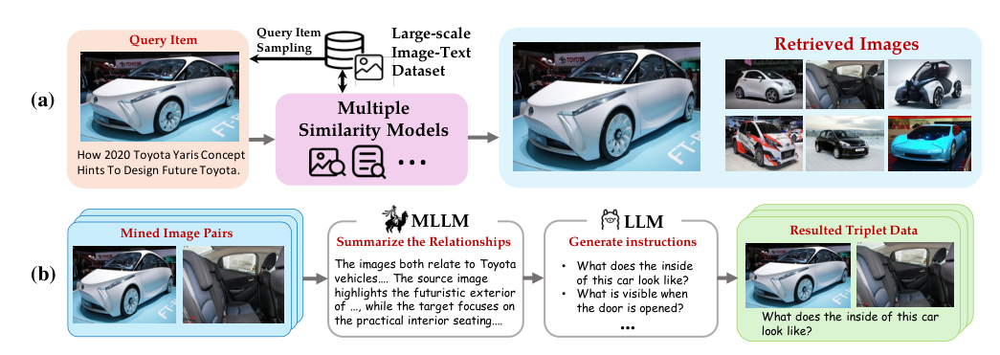
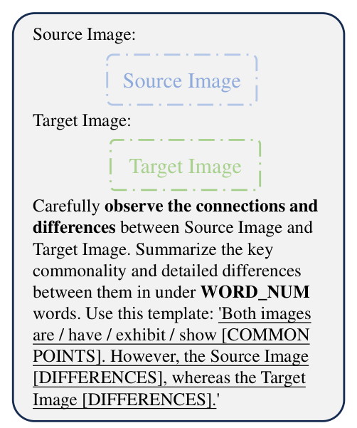
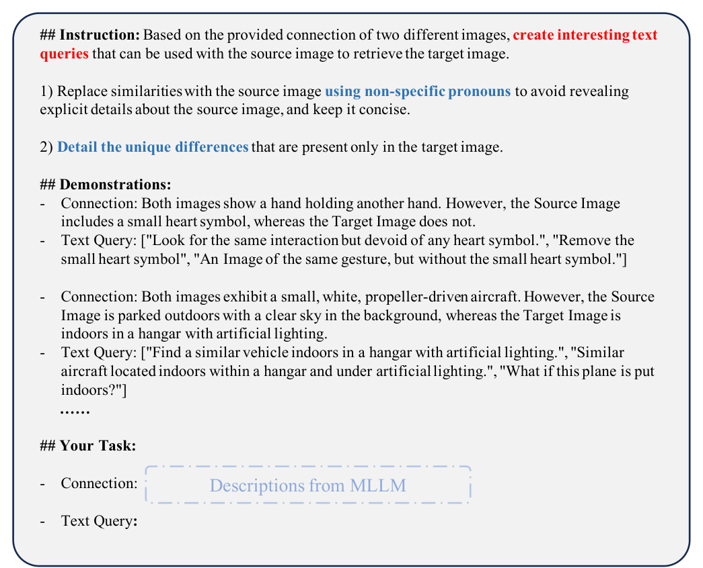
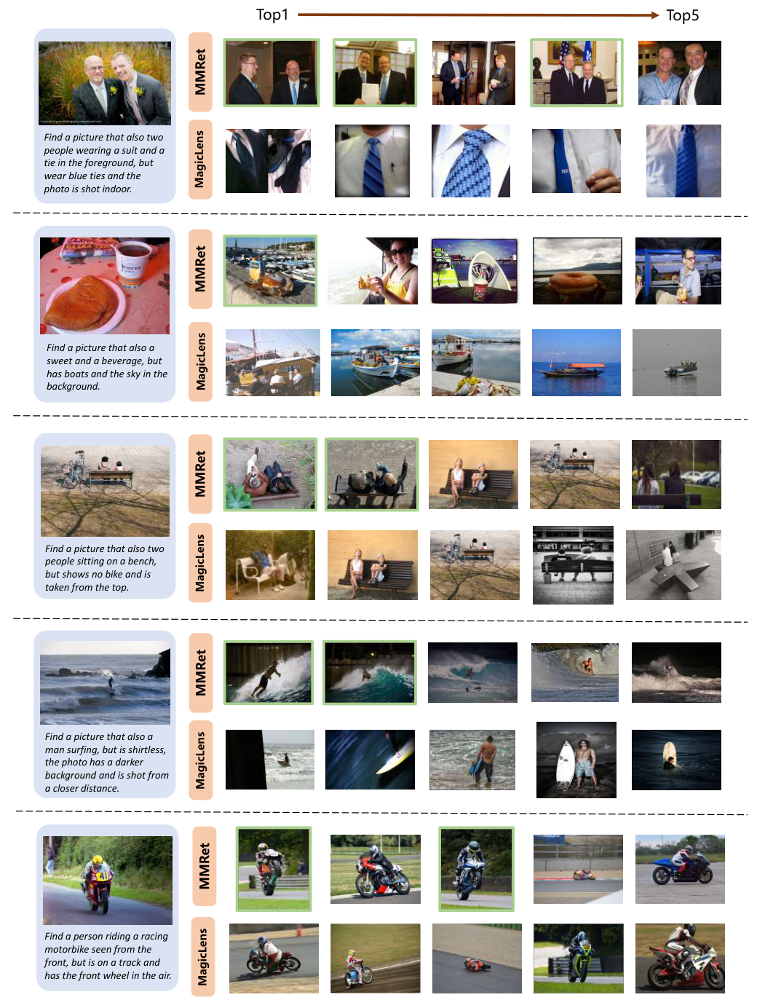

> 原文: [arXiv:2412.14475](https://arxiv.org/abs/2412.14475)
> local PDF: `docs/papers/embedding/MegaPairs_2412.14475.pdf`
> 说明: 本文为论文全文中文技术展开，公式/图表编号与原文一致；图片来自 PDF 抽取，caption 中译；数值原样保留。

**预印本信息：** arXiv:2412.14475v1 [cs.CV]，2024 年 12 月 19 日。

**开源：** 数据集、模型（MMRet / BGE-VL 系列）与合成 pipeline 承诺开放；后续 BGE 团队以 [`BAAI/BGE-VL-*`](https://huggingface.co/BAAI) 系列在 HuggingFace 发布。

---

# MegaPairs：面向通用多模态检索的大规模数据合成（Massive Data Synthesis For Universal Multimodal Retrieval）

| 项目 | 内容 |
|------|------|
| 会议 / 发布 | arXiv preprint，2024 年 12 月 |
| 作者 | Junjie Zhou、Zheng Liu\*、Ze Liu、Shitao Xiao、Yueze Wang、Bo Zhao、Chen Jason Zhang、Defu Lian、Yongping Xiong |
| 单位 | 北京邮电大学 / 北京智源人工智能研究院（BAAI） / 中国科学技术大学 / 上海交通大学 / 香港理工大学 |
| 通讯邮箱 | zhoujunjie@bupt.edu.cn；zhengliu1026@gmail.com |
| 关键前置 | CLIP、EVA-CLIP、DINOv2、InternVL2-26B、LLaMA-3-8B、LLaVA-1.6、UniIR、MagicLens、MMEB / VLM2Vec |
| 骨干 | CLIP-B / CLIP-L（双塔）、LLaVA-1.6-Mistral-7B（MLLM） |
| 模态 | 图像 + 文本（组合图文查询） |

\* 通讯作者。

---

## 摘要（Abstract）

作者观察到**多模态检索**的需求在快速上升，但训练数据严重匮乏——现有的公开指令微调数据要么规模小、要么被私有化。为此本文提出 **MegaPairs**：一套用**开源 VLM + 开源图像语料**自动合成 (query image, instruction, target image) 三元组的数据流水线，以及基于它产出的 **26M+ 大规模指令数据集**。经验分析显示：MegaPairs 生成的数据质量足够高——只用其中 **500K** 样本，就能让同一个预训练模型 fine-tune 的性能**超过** MagicLens 用完 **36.7M** 数据的结果（即 **70× 数据效率**）。作者进一步用全量 MegaPairs 训练了不同规模的多模态检索器 **MMRet**（后续系列以 BGE-VL 命名），在 **4 个主流 composed image retrieval (CIR) benchmark** 与 **MMEB 的 36 个数据集**上取得**零样本 SOTA**；下游 fine-tune 后进一步保持领先。数据、模型和 pipeline 承诺全部开源。

---

## 1 引言（Introduction）

**问题定位。** 多模态检索（把文本、图像、组合模态作为 query 或 candidate 的检索）是 IR 与 AI 领域的核心问题，覆盖图像搜索、VQA、多模态 RAG 等场景。因此需要一种能统一处理各种任务/领域的**通用多模态检索器（universal multimodal retriever）**。

**现有路线的瓶颈。** 主流基线是把 **CLIP / ALIGN / SigLIP** 等预训练图文双塔当作 backbone。但这些模型仅在 image-text matching 上预训练，处理**组合图像检索 (CIR)** 或**多模态文档检索**时能力明显不足。为了补足多任务能力，社区借鉴文本 embedding 的 **instruction-tuning** 思路——用带 instruction 的三元组继续微调 VLM（如 UniIR、E5-V、MM-Embed）。

**数据是瓶颈。** 类似 NV-Embed / E5-Mistral 走 LLM 合成数据的路子，多模态领域也开始探索合成三元组——代表工作 **MagicLens** 从**同一网页共存图像**中抽 (query, target) 对，再让 LLM 写 open-ended instruction。但网页级共存图像方案存在四类痛点：

1. **可扩展性差（scalability）**：互联网上带多张图的网页只占极小比例；
2. **质量差（quality）**：网页共存图像里，大量是无关图或近似重复；
3. **多样性差（diversity）**：剩下的相关图对关系单调，多是「同一物体不同视角」；
4. **不可用（availability）**：即便有人做出来了，大规模指令数据集通常被私有化。

**MegaPairs 的核心贡献。** 本文摆脱「同网页共存」这一强约束，改从**开放域图像语料**里挖三元组：

- **异质 KNN 采样**：同时用三个不同的相似度模型给 query 图找 top-k 相关图——CLIP 视觉塔（视觉-语义相关）、DINOv2（视觉-模式相关）、CLIP 文本塔（caption 相关），三条相似度线索互补，天然产生**多样的关系类型**；
- **MLLM + LLM 两步自动标注**：先让 InternVL2-26B 给 (query, target) 写一段「共性 + 差异」描述，再让 LLaMA-3-8B 把描述改写成 3+ 条 open-ended instruction，同时挑出 5 张 hard negatives；
- **数据规模**：产出 **26,235,105** 条多模态三元组，语料底座是 Recap-DataComp-1B 的 20M 子集，成本可控；
- **训练配方 MMRet**：分别把 CLIP-B / CLIP-L / LLaVA-1.6-Mistral-7B 通过 InfoNCE 对比训练成通用检索器，训出**全尺度均领先**的成绩。

**关键结果概览。**

- **CIR：** CIRCO mAP@5 **42.2**（+8.1 于此前 SOTA）；CIRR R@1 **46.7**（+7.4）；GeneCIS Rs@1 **21.1**（+3.7）；FashionIQ 也在 CLIP-base 尺度上极具竞争力。
- **MMEB 36 数据集零样本平均：** **44.0**，跨 Classification / VQA / Retrieval / Grounding 四大 meta-task 都是同规模最好或并列最好。
- **MMEB fine-tune：** 平均 **64.1**，OOD 平均 **59.1**（相比 VLM2Vec-LLaVA/-Phi 分别 **+11.6 / +7.1**），泛化性显著。

---

## 2 相关工作（Related Work）

### 多模态检索

传统检索场景要么是单模态（文本→文本），要么是跨模态（文本→图像）。而**多模态检索**允许 query 或 candidate 本身**同时含图和文**：典型任务包括「带指令的图像检索」（Composed Image Retrieval / CIR）、多模态文档检索、多模态知识检索、多模态 RAG。已有方法几乎都基于预训练 VLM（CLIP、BLIP、SigLIP）。但这些 VLM 只学了图文匹配，**没学会「同时读懂图 + 指令」并检索目标图**这类联合语义，因此需要专门构造训练数据把 VLM 扩展成通用检索器。

### 面向多模态检索的指令微调

instruction-tuning 已在 LLM（InstructGPT、FLAN）和文本 embedding（Instructor、E5、BGE、Llama2Vec）取得成功；MLLM 侧的扩展主要有 UniIR（M-BEIR）与 MagicLens。二者的短板：

- **UniIR / M-BEIR**：任务覆盖广，但数据主要来自若干人工标注检索数据集的合并，规模有限；
- **MagicLens**：靠「同网页共存图像 + LLM 写指令」跑到 36.7M，但正如引言里指出的四点局限——**规模、质量、多样性、可用性**都受限，且数据集本身不公开。

MegaPairs 直击这些痛点：**用开源模型、开放语料、异质 KNN**——同时把数据、代码、模型放开源，做「可复现的多模态 instruction-tuning 数据基建」。

---

## 3 方法（Methodology）

MegaPairs 与 MMRet 的关系：**MegaPairs** 是「造数据的 pipeline」，**MMRet** 是「用这些数据训出的通用多模态检索器」。数据部分是核心贡献。

### 3.1 MegaPairs 构建流水线

**目标形式。** 一条训练样本是三元组 $(I_q, T_{q\to t}, I_t)$——一张 query 图、一段说明「从 $I_q$ 到 $I_t$ 应该发生什么变化 / 关注哪些方面」的自然语言 instruction、以及目标图。查询侧输入是 $(I_q, T_{q\to t})$，正样本是 $I_t$。

**两大技术挑战：**

1. 如何**大规模**地采到「相关且多样」的图对 $(I_q, I_t)$？
2. 如何**精确**地给采到的图对写 instruction？

**总体框架**（见图 1）：分两个组件——**图对挖掘** + **开放式指令生成**。



**图 1 中文说明：** 全流程分四步，左半图 (a) 是**图对挖掘**、右半图 (b) 是**指令生成**——
① 从 Recap-DataComp-1B 里采 query 图 $(I_q, C_q)$；
② 同时用三类相似度模型（EVA-CLIP 视觉塔、DINOv2、EVA-CLIP 文本塔）在整个语料里找 top-k 相关图，得到一批 heterogeneous 的 target 候选 $\{I_{t_1}, I_{t_2}, \dots\}$；
③ 把 $(I_q, I_{t_i})$ 交给 MLLM（InternVL2-26B）写一段「两图共性 + 差异」描述 $D_i$（比如「两张都是 Toyota 汽车，源图强调未来外观，目标图强调实用内饰」）；
④ 把 $D_i$ 交给 LLM（LLaMA-3-8B）改写成 $\ge 3$ 条 open-ended instruction（比如「这辆车内部是什么样？」「打开车门能看到什么？」），最终组成三元组 $(I_q, T_{q\to t}, I_t)$；同一 batch 里其它 target 顺手当 hard negative。

#### 3.1.1 异质图对挖掘（Mining Correlated Image Pairs）

对每张 query 图 $(I_q, C_q)$，作者用**三种不同的相关性**并行做 KNN：

1. **视觉-语义相关（visual-semantic correlation）**：EVA-CLIP 的**图像编码器**给相似度——捕捉「语义上是同一类东西，视觉未必像」的关系，比如同一辆车不同角度；
2. **视觉-模式相关（visual-pattern correlation）**：DINOv2 给相似度——捕捉「视觉纹理/布局像，但语义未必相关」的关系，比如「不同汽车但相似背景」；
3. **caption 相关**：EVA-CLIP 的**文本编码器**在 caption 空间取相似——直接反映文本层面的关系。

**三条线互补**——CLIP-vision 抓「意思一样」、DINO 抓「样子一样」、CLIP-text 抓「文本描述一样」——共同保证异质、非单调的关系。

**过滤器：** 只保留相似度落在 $(0.8,\, 0.96)$ 的对——低于 0.8 是弱关系；高于 0.96 是近乎重复。

**Hard negatives（关键设计）：** 对每个 $(I_q, I_{t_i})$，直接把**检索集里其它 target** $\{I_{t_j}\mid t_j \ne t_i\}$ 当 hard negative。这是「顺手」做法，但实证很有效：这些图对同一 query 都有相关性，比随机负样本更困难，也自然覆盖多种「相关但不该被选中」的语义。作者在 §4.3.2 单独验证了它的价值。

#### 3.1.2 开放式指令自动生成（Generating Open-Ended Instructions）

**两步标注**：

**Step 1（MLLM 写共性/差异 $D_i$）：** 用 InternVL2-26B 处理 $(I_q, I_{t_i})$。Prompt 让 MLLM 严格按模板输出：

```
Both images are/have/exhibit/show [COMMON POINTS]. However, the Source Image [DIFFERENCES],
whereas the Target Image [DIFFERENCES].
```

且长度控制在 60–100 词（`WORD_NUM` 随机采样以增加多样性）。

**Step 2（LLM 改写指令 $T_{q\to t}$）：** 把 $D_i$ 喂给 LLaMA-3-8B。Prompt 要求：

- 用**非特定的代词**指代 source 图的共性部分（避免暴露过多 source 细节，让 instruction 更贴近真实用户「基于 source 图想去 target」的语境）；
- 明确列出 target 独有的差异；
- 每个图对生成**多条**候选 instruction（至少 3 条），进一步提升多样性。

作者在 in-context 里放 **5 个 demonstrations**，且从 50 条池子里随机采（避免模式化）。附录里给出了两个演示：

- Connection: `两张都是握手，但源图有心形符号，目标图没有。` → Text Query: `Look for the same interaction but devoid of any heart symbol.` 等 3 条
- Connection: `两张都是螺旋桨小飞机，源图户外晴天、目标图机库室内。` → Text Query: `Find a similar vehicle indoors in a hangar with artificial lighting.` 等 3 条

MLLM prompt 与 LLM prompt 见图 3、图 4：



**图 3 中文说明：** MLLM 侧的 prompt——「仔细观察 Source / Target 图之间的联系与差异，用不超过 `WORD_NUM` 词总结关键共性和详细差异，按模板『Both images are/have/exhibit/show [共性]. However, the Source Image [差异], whereas the Target Image [差异].』回答」。`WORD_NUM` 在实际生成时从 60–100 随机采，用来增加描述长度多样性。



**图 4 中文说明：** LLM 侧的 prompt——「基于给出的两图连接，生成可以配 source 图去检索 target 图的自然语言查询：① 用非特定代词替代 source 图的共性部分（不要暴露 source 细节）；② 具体说明 target 图独有的差异」。图中展示了两条演示；实际生成时会从 50 条池子里随机取 5 条 few-shot demos 喂给 LLM。

#### 3.1.3 实现细节（Implementation）

| 项目 | 设置 |
|------|------|
| 图像语料 | Recap-DataComp-1B 的子集，20M 有 caption 图像 |
| 视觉-语义相似模型 | EVA-CLIP 视觉编码器 |
| 视觉-模式相似模型 | DINOv2 |
| Caption 相似模型 | EVA-CLIP 文本编码器 |
| 相似度过滤区间 | $(0.8,\,0.96)$，剔除弱相关与近重复 |
| MLLM 标注器 | InternVL2-26B |
| LLM 改写器 | LLaMA-3-8B |
| 每对图 instruction 数 | $\ge 3$ 条 |
| 每对图 hard negatives | 5 张 |
| 最终三元组数 | **26,235,105** |

**成本可控**：所有组件都用开源模型；相似度检索用 EVA-CLIP / DINOv2 的现成 embedding，一次索引反复用。

### 3.2 MMRet 模型

作者用 MegaPairs 训练两种架构的**多模态检索器**，统称 **MMRet**。

#### 3.2.1 CLIP-based MMRet（Base / Large）

原始 CLIP 双塔：图像编码器 $\Phi_I$、文本编码器 $\Phi_T$。给定图 $I$ 或文本 $T$：

$$
e_i = \Phi_I(I), \quad e_t = \Phi_T(T) \tag{1}
$$

对**组合图文输入** $(I, T)$（例如「图像 + 指令」），沿用 UniIR 的 **score-fusion**：把两塔输出**逐元素相加**得到组合模态 embedding：

$$
e_{it} = \Phi_I(I) + \Phi_T(T) \tag{2}
$$

**MMRet-Base** 用 CLIP-ViT-B/16 初始化，**MMRet-Large** 用 CLIP-ViT-L/14。训练时**全部参数** unfrozen，输入图像固定 224×224。

#### 3.2.2 MLLM-based MMRet

**backbone**：LLaVA-1.6 (Mistral 7B)。MLLM 天然把图像 token 与文本 token 拼接成同一序列，因此**组合图文查询**只需按模板串成一个 sequence，最后一层 `[EOS]` 的隐藏态**归一化**后当作 embedding：

$$
\langle\text{instruct}\rangle\{\text{task\_inst}\}\ \langle\text{query}\rangle\{q_t\}\ \{q_i\}\ [\text{EOS}] \tag{3}
$$

其中 `{task_inst}` 是任务级 instruction，`{q_t}` 是查询文本，`{q_i}` 是查询图（作为图像 token 序列插入）。这种「LLM-based embedding」跟 E5-Mistral / Llama2Vec 一脉相承。

**MMRet-MLLM** 用 LLoRA (rank=32) 同时微调 ViT 编码器与 LLM 主干，图像分辨率固定 512×512（LLaVA-1.6 原生支持变分辨率，这里为控制 token 长度手动限制）。

### 3.3 多模态对比学习（Multimodal Contrastive Learning）

统一训练目标是标准 **InfoNCE**（over in-batch candidates）：

$$
\mathcal{L} = -\frac{1}{|\mathcal{Q}|}\sum_{q_i \in \mathcal{Q}}
\log\frac{\exp(e_{q_i}\cdot e_{c^+_i}/\tau)}{\sum_{c_j \in \mathcal{C}} \exp(e_{q_i}\cdot e_{c_j}/\tau)} \tag{4}
$$

- $\mathcal{Q}$：batch 内所有 query；$e_{q_i}, e_{c^+_i}$：query 和其正样本的 embedding；$\mathcal{C}$：batch 内所有 candidate（含 in-batch + 挖到的 hard negatives）；
- $\tau = 0.02$（除非另说明）；
- **query / candidate 都可以是图 / 文 / 组合模态**，因此这一个 loss 就把「文→图」「图→文」「(图+文)→图」等所有场景统一了。

**训练细节：**

| 模型 | Batch | 正/负样本 | steps | LR | 图像分辨率 |
|------|-------|-----------|-------|----|-----------|
| MMRet-Base (CLIP-B) | 2048 | 1 pos + 4 hard neg | 15,000 | $5\times10^{-6}$ | 224×224 |
| MMRet-Large (CLIP-L) | 2048 | 1 pos + 4 hard neg | 25,000 | $5\times10^{-6}$ | 224×224 |
| MMRet-MLLM (LLaVA-1.6-7B) | 144 | 1 pos + 3 hard neg | 20,000 | $5\times10^{-6}$ | 512×512 |

所有模型用**线性衰减**学习率；MMRet-MLLM 通过 LoRA 微调 ViT + LLM 双方（rank=32）。

---

## 4 实验（Experiments）

三个层次：**§4.1 零样本 CIR**；**§4.2 MMEB 36 数据集（含零样本 + fine-tune）**；**§4.3 数据本身的深入分析（规模、质量、hard neg、采样策略消融）**。

### 4.1 零样本 CIR（Zero-shot Composed Image Retrieval）

**评测集**：CIRCO（主 benchmark）、CIRR、FashionIQ、GeneCIS。

- **CIRCO**：123,403 候选图，测试集 800 查询，每查询多正例；mAP 为主指标。
- **CIRR**：4,148 查询、2,315 图；每查询单正例，Recall（R / Rs 全库/子集）。
- **FashionIQ**：Dress / Shirt / Toptee 三个 fashion 子任务，验证集 6,016 查询，平均 R@10/R@50。
- **GeneCIS**：4 个 sub-task（Focus/Change × Attribute/Object），每子任务小候选集，平均 Rs@1。

**主结果**（表 1，节选）：

| 方法 | Backbone | 参数 | CIRCO mAP@5 | CIRR R@1 | CIRR Rs@1 | FashionIQ R@10 | GeneCIS Rs@1 |
|------|----------|------|-------------|----------|-----------|-----------------|--------------|
| SEARLE | CLIP-B | 165M | 9.4 | 24.0 | 54.9 | 22.9 | – |
| MagicLens-B | CLIP-B | 166M | 23.1 | 27.0 | 66.7 | 26.3 | 15.0 |
| MagicLens-B‡ | CoCa-B | 267M | 30.8 | 31.6 | 69.3 | 35.2 | 17.4* |
| **MMRet-Base** | CLIP-B | **149M** | **34.3** | **36.1** | **71.6** | 31.9 | **18.0** |
| MagicLens-L | CLIP-L | 465M | 29.6 | 30.1 | 68.1 | 30.7 | 16.3 |
| MagicLens-L‡ | CoCa-L | 613M | 34.1* | 33.3* | 70.9* | **38.0** | 16.7 |
| **MMRet-Large** | CLIP-L | 428M | **39.2** | **38.0** | **73.2** | 34.6 | **18.1** |
| IP-CIR | CLIP-G | 43.8B† | 32.8 | 39.3 | 70.0 | 45.7* | – |
| MM-Embed | LLaVA-1.6 | 7.57B | 32.3 | – | – | – | – |
| **MMRet-MLLM** | LLaVA-1.6 | 7.57B | **42.2** | **46.7** | **75.4** | 35.6 | **21.1** |

（\*：MMRet 之前的最佳；†：多组件方法，只统计已知规模组件参数量；‡：CoCa 私有模型）

**三点核心结论：**

1. **MMRet-MLLM 在 4 个中 3 个 benchmark 都是 SOTA**——主 benchmark CIRCO **+8.1 mAP@5**（42.2 vs 34.1）；CIRR **+7.4 R@1 / +4.5 Rs@1**；GeneCIS **+3.7 Rs@1**。
2. **各规模都领先**——CIRCO 上 Base +3.5，Large +5.1；CIRR R@1 上 Base +4.5，Large +4.7。FashionIQ 时装域没拿第一但 CLIP-based 尺度上有竞争力。
3. **MMRet-Base 反超多数大模型**——比如超过 MagicLens-L（CLIP-L, 465M），甚至超过 7B 级的 MM-Embed（在 CIRCO 上 34.3 vs 32.3）。这直接说明 MegaPairs 的**数据质量**足够撑起小模型跑赢参数量数十倍的大模型。

（FashionIQ 上时装域某些方法（CompoDiff-G, IP-CIR-G）更强，主要因它们背景语料本身来自 fashion 网站或做了 fashion 特化。作者未特意做时装域适配。）

### 4.2 MMEB（Massive Multimodal Embedding Benchmark）

**MMEB** 由 Jiang et al. (2024b, VLM2Vec) 提出：**36 个数据集**，覆盖 4 类 meta-task——分类（10）、VQA（10）、检索（12）、grounding（4）；每个数据集都有对应 task-specific instruction，评测 Precision@1。分 20 in-distribution（IND）+ 16 out-of-distribution（OOD）。

#### 4.2.1 零样本

MMRet-MLLM 直接用 §4.1 的 checkpoint（**只在 MegaPairs 上训过**），零样本上 MMEB：

| 模型 | Backbone | Cls (10) | VQA (10) | Retrieval (12) | Grounding (4) | **Overall (36)** |
|------|----------|----------|----------|----------------|---------------|------------------|
| BLIP2 | – | 27.0 | 4.2 | 33.9 | 47.0 | 25.2 |
| SigLIP | – | 40.3 | 8.4 | 31.6 | 59.5 | 34.8 |
| CLIP | ViT-L | 42.8 | 9.1 | 53.0 | 51.8 | 37.8 |
| OpenCLIP | ViT-L | 47.8 | 10.9 | 52.3 | 53.3 | 39.7 |
| UniIR | – | 42.1 | 15.0 | 60.1† | 62.2 | 42.8 |
| MagicLens | – | 38.8 | 8.3 | 35.4 | 26.0 | 27.8 |
| E5-V | LLaVA-1.6 | 21.8 | 4.9 | 11.5 | 19.0 | 13.3 |
| **MMRet-MLLM** | LLaVA-1.6 | **47.2** | **18.4** | 56.5 | **62.2** | **44.0** |

†UniIR 是在 M-BEIR 上训的，MMEB 检索段 12 个里 10 个数据集与 M-BEIR 重叠——严格来说它不是 zero-shot 检索任务。MMRet-MLLM 相对**只用 MegaPairs**的其它零样本模型（E5-V、MagicLens）优势极大——比 E5-V 的 13.3 → 44.0，跨了近 4 倍。

#### 4.2.2 监督 Fine-tune

作者进一步在 MMEB 的 20 个 IND 训练集（约 662K 样本）上以 LoRA (rank=32) fine-tune MMRet-MLLM（batch=192，lr=$5\times10^{-6}$，1 epoch），保留 16 OOD 集做泛化评测：

| 模型 | Cls (10) | VQA (10) | Retrieval (12) | Grounding (4) | IND (20) | OOD (16) | **Overall (36)** |
|------|----------|----------|----------------|----------------|----------|----------|------------------|
| CLIP | 55.2 | 19.7 | 53.2 | 62.2 | 47.6 | 42.8 | 45.4 |
| OpenCLIP | 56.0 | 21.9 | 55.4 | 64.1 | 50.5 | 43.1 | 47.2 |
| VLM2Vec (LLaVA-1.6) | 54.7 | 50.3 | 56.2 | 64.0 | 61.0 | 47.5 | 55.0 |
| VLM2Vec (Phi-3.5-V) | 54.8 | 54.9 | 62.3 | 79.5 | 66.5 | 52.0 | 60.1 |
| **MMRet-MLLM** | **56.0** | **57.4** | **69.9** | **83.6** | **68.0** | **59.1** | **64.1** |

**关键观察：**

- **Overall +4.0 于 VLM2Vec-Phi、+9.1 于 VLM2Vec-LLaVA（同 backbone）**——纯粹靠 MegaPairs 的对比训练把 backbone 变得更适合下游 embedding。
- **OOD +7.1 / +11.6**——MegaPairs 大幅提升泛化。
- Retrieval 段 **+7.6**，Grounding 段 **+4.1**——两个空间理解型任务尤其受益。

**基础模型上零样本 vs fine-tune 一起看：** MMRet-MLLM 零样本 Overall 44.0，fine-tune 后 64.1；即 MegaPairs 训完的 checkpoint 已经是一个非常强的**通用多模态 embedding 起点**，再进一步下游对齐效果显著。

### 4.3 MegaPairs 的深入分析

作者围绕数据本身做了三组消融，全部用 MMRet-Base 跑（相同 backbone、相同 batch），只改数据。

#### 4.3.1 数据规模与质量（Scalability & Quality）


**图 2 中文说明：** 横轴是 MegaPairs 采样规模（128K → 26M，log 刻度），纵轴是各 benchmark 分数——CIRCO / CIRR (val) / FashionIQ / GeneCIS 及其平均。曲线**单调向上**说明规模化仍然有效（scaling holds）——26M 尚未见饱和，继续扩规模仍有收益空间。虚线是 MagicLens-B（同样 CLIP-base backbone、36.7M 数据）的水平：**仅用 500K MegaPairs**（<2% MagicLens 数据量），MMRet-Base 在**所有 benchmark 上都已经全面超过** MagicLens-B——这就是摘要里说的「**70× 数据效率**」的直接证据。

这一结论有两个含义：

1. **合成质量**：MegaPairs 的三元组比 MagicLens 的「同网页共存图 + LLM 指令」信息含量更高；
2. **合成规模**：因为语料底座是**通用 20M 图像库**（不受「多图网页」约束），MegaPairs 天然可扩展；作者说明 26M 只是当下阶段的规模，pipeline 未来可继续 scale。

#### 4.3.2 Hard Negatives 的作用

三种负样本策略对比（1M 数据规模，MMRet-Base）：

| Query 图作 neg? | Mined hard neg? | CIRCO mAP@5 | CIRR R@1 | FIQ R@10 | GeneCIS Rs@1 |
|:---:|:---:|:---:|:---:|:---:|:---:|
| ✗ | ✗ | 10.1 | 0.2 | 25.3 | 14.4 |
| ✓ | ✗ | 29.7 | 32.1 | 27.6 | 16.6 |
| ✓ | ✓ | **32.3** | **33.7** | **30.1** | **17.0** |

**观察：**

- 不加任何 negative（只有 in-batch）几乎训不起来，CIRR R@1 = 0.2 说明信号完全不足；
- 只把 **query 图本身**加进 candidate（让模型学「不要检索出 query 图」）已经大幅提升；
- 再叠加 **MegaPairs 挖到的 hard negatives** 在**所有 benchmark**都一致提升（CIRCO +2.6, CIRR +1.6, FashionIQ +2.5, GeneCIS +0.4）。

这也解释了 3.1.1 里「顺手从检索集里挑 hard neg」为什么这么关键——它把 KNN 采样阶段就自然产生的「同 query、不同 target」变成免费的高质量负样本。

#### 4.3.3 图对搜索策略消融（D / I / T 三选）

作者比较**是否**分别启用 DINOv2 (**D**)、CLIP-Image (**I**)、CLIP-Text (**T**) 三条相似度线——每种设置采 1M 数据、训练 2000 steps 保证公平：

| D | I | T | CIRCO mAP@5 | CIRR R@1 | FIQ R@10 | GeneCIS Rs@1 |
|:---:|:---:|:---:|:---:|:---:|:---:|:---:|
| ✓ | ✗ | ✗ | 29.0 | 31.5 | 24.7 | 17.2 |
| ✗ | ✓ | ✗ | 30.0 | 30.0 | 29.6 | 15.3 |
| ✗ | ✗ | ✓ | 31.6 | 32.2 | 28.7 | 17.3 |
| ✓ | ✓ | ✗ | 31.0 | 32.1 | 28.5 | 17.1 |
| ✓ | ✗ | ✓ | 32.4 | 33.3 | 28.9 | 17.5 |
| ✗ | ✓ | ✓ | 32.2 | 33.3 | 29.7 | 16.4 |
| **✓** | **✓** | **✓** | **32.3** | **33.7** | **30.1** | 17.0 |

**结论：**

- **单一策略**里 T（caption 相似）最强——文本相似天然引入更多样的关系（不局限于视觉外观）；
- **任意两条**都优于单条；
- **三条同用**在 CIRR R@1 / FashionIQ 上最好，其它两个几乎并列，因此最终 MegaPairs 采用 **D + I + T 三条**——付出一次索引成本换持续的多样性收益。

---

## 5 结论（Conclusion）

MegaPairs 是一套**大规模、开放域、异质多相似度**的多模态三元组合成 pipeline，产出 **26M+** 训练样本；配套训练的 **MMRet** 系列在 **4 个 CIR benchmark** 和 **MMEB 36 个数据集**上取得**零样本 SOTA**，fine-tune 后在 IND / OOD 全面领先。作者承诺开源数据集、模型和 pipeline。

**这项工作在 embedding 界的意义：**

1. **数据合成范式转向开放域**：脱离「同网页共存」这一强约束，说明只要选对相似度线 + 开源 VLM 标注，就能从任意图像语料生成高质量三元组；
2. **异质相似度是关键**：D + I + T 三条互补，直接决定了「关系多样性」的天花板；
3. **hard negatives 免费**：KNN 检索本身就是 hard negative miner，无需再训一次；
4. **BGE-VL 生态**：MMRet 后续以 [BGE-VL](https://huggingface.co/BAAI) 系列开源，本工作是 BGE 团队进入**多模态检索**的关键一步。

---

## 局限（Limitations）与伦理（Ethics）

**局限**：MegaPairs 用了三种 retriever（DINOv2 + CLIP-Image + CLIP-Text）就已经拿到显著多样性，但仍有扩展空间——比如再叠加 **BGE 文本 retriever** 做 caption 相似的更强变体，或引入 **image-text cross-modal retriever** 做更多元的关系类型。

**伦理**：所有图来自 Recap-DataComp-1B，Datacomp 团队已经做过内容过滤（去有害内容）。作者强调筛查不一定 100% 完备，并**不建议**将 MMRet 用于敏感内容的编码/检索。

---

## 附录 A：数据示例可视化


**图 5 中文说明：** 6 行示例展示三元组的**关系异质性**：

- **Roman gladiator**：查询是罗马角斗士雕塑照，target 里既有类似风格的塑像，也有历史电影剧照、盔甲装备特写等——语义相关但视觉差异大；
- **Round ottoman, tufted surface**（第 4 行）：查询是一张 tufted 沙发凳。target 里有相似造型的凳/沙发（视觉上像），也有汽车内饰、居家墙面（**tufted 纹理**这一语义特征相似但视觉主体完全不同）——这展示了 caption/DINO 双通道的合力：让 target 覆盖「视觉像」+「语义/纹理像」两侧；
- **AMG F1 W09**（第 5 行）：查询是 F1 赛车。target 里有红色 F1、赛道多车合影（视觉相关），也有 F1 车手肖像、F1 赛道航拍（F1 概念相关但视觉零重合）；
- 其它三行（Red metal bench with paper-cut window pattern、Wooden angel decorations、Flower crown headband）呈现类似模式。

这几行例子直观说明 MegaPairs 的三元组**远超单调的「同物体不同角度」**——每条数据同时训模型学：「视觉像的」「结构像的」「语义像的」「概念相关的」几种关系，配合 open-ended instruction，模型才能在 CIR 与 MMEB 上表现如此稳健。

---

## 附录 B：MMRet vs MagicLens 定性对比



**图 6 中文说明：** 5 个查询案例（都是 CIR，即「一张 query 图 + 一句 instruction」检索目标图）——

1. **蓝色领带 + 室内场景**：query 图是户外两男子领带自拍，instruction 是「同样两位穿西装打领带，但**蓝领带 + 室内场景**」。**MMRet** 正确锁定「西装 + 蓝领带 + 室内」三要素同时满足；**MagicLens** 只关注了单个物体（领带）而忽略场景。
2. **甜点 + 饮料，加上船 + 天空作背景**：MMRet 能同时理解前景（甜点、饮料）与背景（船、天空），检出的图恰好含船景阳台；MagicLens 只抓到了饮料元素。
3. **长凳自上而下拍摄、没有自行车**：MMRet 理解「拍摄角度」+「没有自行车」等结构性约束；MagicLens 检出的照片仍带自行车。
4. **冲浪男，脱去上衣、暗背景、近距离拍**：MMRet 识别出**光照条件 + 距离**两个抽象属性。
5. **摩托车正视图 + 前轮离地**：MMRet 识别**动作 + 场景要素**（赛道 + 前轮抬起），MagicLens 只对上「摩托车正视」。

定性结果说明 MMRet 的语义组合能力（object + attribute + scene + action）明显强于 MagicLens——这是 MegaPairs 三元组多样性 + open-ended instruction 的直接体现。

---

## 附录 C：CIRCO / CIRR / FashionIQ / GeneCIS 全量结果与 MMEB 全表

MMEB 全表（表 10）显示 MMRet-MLLM 在**零样本**下 Overall 44.0（超过 UniIR 42.8、CLIP 37.8）；**fine-tune** 后 Overall 64.1（超 VLM2Vec-Phi-3.5-V 60.1），并在 12 个检索任务中 8 项拿到 SOTA（VisDial 83.0、CIRR 61.4、VisualNews_i2t 78.1、MSCOCO_t2i 78.6、MSCOCO_i2t 72.4、FashionIQ 54.9、OVEN 87.5、WebQA 90.2）。四大 meta-task 中 Retrieval 平均 **69.9**、Grounding 平均 **83.6** 相对 VLM2Vec 提升明显——多模态对比训练带来的空间理解与检索能力最直接受益。

CIRCO 全表（表 6）中 MMRet-MLLM 在 mAP@5/10/25/50 均取 42.2 / 43.4 / 46.5 / 47.6，远超 IP-CIR-CLIP-G 的 32.8 / 34.3 / 36.9 / 38.0（后者用 43.8B†组合模型）。

CIRR 全表（表 7）中 MMRet-MLLM 全量 R@1/5/10/50 = 46.7 / 76.0 / 85.1 / 96.5；subset R@1/2/3 = 75.4 / 89.6 / 95.7，全面优于 IP-CIR-CLIP-G。

FashionIQ 全表（表 8）时装域：MMRet-MLLM 三子任务 R@10 平均 35.6、R@50 平均 56.6，介于 CLIP-L 尺度和 CLIP-G 尺度之间——时装域强 baseline 多为 fashion 专门化模型，MMRet 未特化仍具竞争力。

GeneCIS 全表（表 9）中 MMRet-MLLM 平均 R@1 = 21.1，四子任务里 Focus/Change Object 两项显著领先（22.4 / 26.9），Focus/Change Attribute 两项与 SOTA 接近——说明 MMRet 在**物体级组合语义**上尤其强。

---

## 翻译约定

| 原文 | 中译（本文用法） |
|------|-----------------|
| Composed Image Retrieval (CIR) | 组合图像检索 |
| Multimodal retrieval | 多模态检索 |
| Universal multimodal retriever | 通用多模态检索器 |
| Instruction-tuning | 指令微调 |
| Open-ended instructions | 开放式指令（不预设 template 的自然语言指令）|
| Heterogeneous KNN triplet | 异质 KNN 三元组 |
| Visual-semantic correlation | 视觉-语义相关 |
| Visual-pattern correlation | 视觉-模式相关 |
| Caption correlation | Caption / 文本相关 |
| Score-fusion | 分数融合（双塔输出逐元素相加） |
| Hard negatives | 困难负样本 |
| In-batch negatives | Batch 内负样本 |
| MLLM | 多模态大语言模型 |
| Meta-task | 元任务（MMEB 四大类：分类/VQA/检索/grounding） |
| IND / OOD | 分布内 / 分布外 |
| Zero-shot | 零样本 |
| Fine-tune | 监督微调 |
| Score-fusion via element-wise addition | 双塔 embedding 逐元素相加融合 |
| Recap-DataComp-1B | Recap-DataComp-1B（Datacomp 语料的 LLaMA-3 重新 caption 版）|
| MMEB (Massive Multimodal Embedding Benchmark) | 大规模多模态 embedding 评测集 |
| CIRCO / CIRR / FashionIQ / GeneCIS | CIR 领域四大主流 benchmark |
