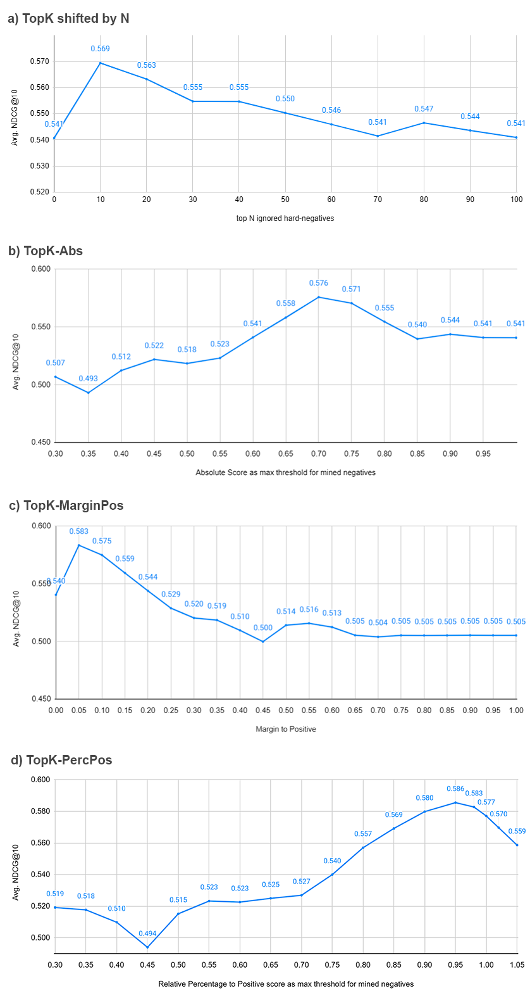

> 原文: [arXiv:2407.15831](https://arxiv.org/abs/2407.15831)
> 说明: 本文为论文全文中文翻译，公式编号与原文一致；图表保留标题/说明中译，数值表数字原样。

**预印本信息：** arXiv:2407.15831v2 [cs.IR]，2025 年 2 月 7 日更新。

**关键词：** 文本检索（text retrieval）、嵌入模型（embedding models）、困难负样本挖掘（hard-negative mining）、对比学习（contrastive learning）、Transformer。

# NV-Retriever：通过有效的困难负样本挖掘改进文本嵌入模型（NV-Retriever: Improving text embedding models with effective hard-negative mining）

**作者：** Gabriel de Souza P. Moreira\*、Radek Osmulski\*、Mengyao Xu\*、Ronay Ak\*、Benedikt Schifferer\*、Even Oldridge\*

**单位：** NVIDIA（圣保罗 / 布里斯班 / 圣克拉拉 / 萨拉索塔 / 柏林 / 温哥华）

**邮箱：** gmoreira@nvidia.com, rosmulski@nvidia.com, mengyaox@nvidia.com, ronaya@nvidia.com, bschifferer@nvidia.com, eoldridge@nvidia.com

\* 所有作者贡献相同。

---

## 摘要（Abstract）

文本嵌入模型（text embedding models）在语义搜索（semantic search）以及基于检索增强生成（Retrieval-Augmented Generation, RAG）的问答（Question-Answering）等信息检索应用中广受欢迎。这类模型通常是经对比学习（Contrastive Learning, CL）目标微调的 Transformer 模型。微调嵌入模型的一个难点在于，为对比学习选取高质量的困难负样本段落（hard-negative passages）。本文提出一族 positive-aware（正样本感知）挖掘方法，以正样本相关性分数（positive relevance score）为锚点进行有效的假负样本（false negative）剔除，从而加速训练并提升检索模型精度。我们对困难负样本挖掘方法及其配置做了消融研究，探索不同教师模型（teacher model）与基座模型（base model）的组合。我们进一步在大规模训练中验证了所提挖掘方法的有效性：NV-Retriever-v1 在 MTEB Retrieval（BEIR）基准上得分 60.9，于 2024 年 7 月发布至 MTEB Retrieval 时位列第一。

---

## 1 引言（Introduction）

文本检索对搜索、问答、语义文本相似度（semantic textual similarity）与物品推荐等信息检索应用至关重要，也是检索增强生成（RAG）[16, 27] 的关键环节——使大语言模型（Large Language Model, LLM）在不修改参数的情况下访问外部上下文。

稠密嵌入模型是文本检索的核心组件，能在词元重叠较低时语义表示查询与段落（passages，内容片段），并对域外语料具有泛化能力。将段落索引为嵌入的检索系统可通过最大内积搜索（Maximum Inner Product Search, MIPS）[16] 高效检索与查询相关的段落。

学术界与工业界对文本嵌入模型的兴趣日益增长，近期发布了 E5[33]、GTE[17]、Jina[9] 等众多模型。为一致比较可用文本嵌入模型的精度，MS-MARCO[1]、BEIR[32] 以及 MTEB[22] 等公开基准（HuggingFace[36] 排行榜）为不同嵌入任务提供了重要的对比焦点。

嵌入模型通常用对比学习（CL）[4] 训练，以最大化查询嵌入与相关段落（正样本，positives）嵌入之间的相似度，同时最小化与查询无关段落（负样本，negatives）[11] 嵌入之间的相似度。

在为嵌入模型准备训练数据时，通常采用困难负样本挖掘（hard-negative mining）为查询选取负样本段落。它利用教师检索模型找到与查询有一定相关性的段落，使对比损失更难区分正负样本，从而更高效、更有效地微调嵌入模型。

尽管困难负样本挖掘对嵌入模型微调很重要，相关方法仍研究不足或描述不清，尤其在介绍登顶 MTEB 排行榜的模型论文 [12, 17, 17, 23, 34] 中——这些工作主要关注模型架构、微调策略与训练数据混合，而非挖掘细节。

本研究的主要贡献有三：

- **Positive-aware 困难负样本挖掘方法。** 我们提出一族挖掘方法，能够改进对比学习、剔除潜在假负样本并提升文本嵌入模型精度，详见第 3.1 节；
- **困难负样本挖掘最佳实践研究。** 第 3.2 节给出方法与研究问题；第 4.1 节在不同配置、不同教师与基座模型下比较多种困难负样本挖掘方法，展示检索模型对挖掘选择的敏感性；
- **将挖掘方法扩展至 SOTA 文本检索：NV-Retriever-v1。** 第 4.4 节展示所提挖掘方法在大规模训练 NV-Retriever-v1 中的有效性；该模型于 2024 年 7 月 11 日发布至 MTEB 时取得 MTEB Retrieval 排行榜第一¹。

¹ https://huggingface.co/spaces/mteb/leaderboard

于 2024 年 7 月 11 日发布至 MTEB 时，我们进一步描述 NV-Retriever-v1 的训练数据混合、超参数、架构，以及 positive-aware 困难负样本挖掘方法对其领先检索精度的重要性。

---

## 2 背景（Background）

本节讨论文本嵌入模型与困难负样本挖掘的相关工作。

### 2.1 文本嵌入模型（Text embedding models）

文本嵌入模型将变长文本表示为可用于下游任务的固定维向量。

句子嵌入的奠基工作之一是 Sentence-BERT[28]，它修改 BERT 网络，用孪生网络（query, positive passages）或三元组网络（query, positive, negative passages）将相关短文本对映射到同一嵌入空间，并探索不同目标函数与嵌入池化（pooling）方案。

对比学习因 SimCLR[4] 在嵌入上优于基于分类的损失[28] 而流行。(DPR)[11] 提出双编码器（bi-encoder）架构：独立的 BERT 编码器（无共享权重）分别表示查询与段落，输出嵌入用于 CL。

E5[33] 系列模型采用两阶段训练：无监督文本对（如相邻文本片段、标题-摘要）预训练，再用监督数据（问答、文本-摘要、搜索相关段落等）微调。E5 提供多种规模，基座包括 MiniLM[35] 与 BERT[7]。E5 是首个在 BEIR[32] 上无需标注数据（无监督版本）即超越 BM25[30] 稀疏基线的稠密检索模型；第二阶段在 MS-MARCO[1]、Natural Questions（NQ）与 NLI 标注数据上微调以获得更高性能。

E5-Mistral[34] 提出以解码器（decoder）而非编码器（如 BERT）为基座。他们选用已在 Web 规模数据上充分预训练的 Mistral-7B[10]，用 LLM 合成的多任务多语言数据及少量标注数据单轮微调。

BEIR 基准[32] 已成为含 18 个检索数据集的零样本文本检索标准评测。随后 MTEB[22] 作为更全面的文本嵌入基准，英文子集含 7 类任务共 56 个数据集：检索、重排序、分类、聚类、句对分类、摘要与语义文本相似度。MTEB 检索任务由 BEIR 中 15 个数据集组成。我们在第 4.4 节于 MTEB Retrieval 上评测。

### 2.2 用于微调嵌入模型的困难负样本挖掘（Hard-negative mining for fine-tuning embedding models）

对比学习（CL）需要查询、正样本段落与负样本段落三元组。负样本可由人工标注，或更常见地从语料库采样。

选取负样本段落的基本做法是使用 batch 内其他样本（查询）的正样本段落（batch 内负样本，in-batch negatives）[4, 11]。这在计算上高效，因为这些段落的嵌入已在模型前向中生成，但 batch 大小限制了负样本数量。增加负样本数量的方案包括：维护过往 batch 嵌入的记忆库（memory bank）[33, 40]，或合并不同 GPU 的 batch（跨 batch，cross-batch）。

batch 内负样本相对查询是随机的、易区分，对 CL 信息量很低，其损失/梯度较小，对模型收敛贡献有限 [39]。另一方面，使用有挑战性的困难负样本（hard negatives）可抬升梯度范数上界、降低随机梯度估计方差并加速学习 [39]。

困难负样本可从段落语料库中通过检索与查询相似但未标注为正样本的样本来挖掘 [8, 11, 37, 39]。可用稀疏或稠密（嵌入）检索模型。DPR [11] 除 batch 内负样本外，还使用 BM25[30] 挖掘的一或两个困难负样本以提升微调精度。

训练过程中增量困难负样本挖掘的方法包括：ANCE[39] 异步刷新 ANN 索引中的段落嵌入并重新挖掘每个问题的困难负样本；NGAME[5] 对查询与正样本嵌入聚类，并据此构造负样本挖掘感知的 mini-batch，使 batch 内样本在嵌入空间相近，从而可在 batch 内样本中高效找到困难负样本。ANCE、NGAME 等增量挖掘方法实现复杂、在大语料上计算成本高，因此 MTEB 上多数顶尖模型 [12, 17, 23, 34] 在训练前用预训练模型一次性（upfront）挖掘负样本。

#### 2.2.1 假负样本（False negatives）

[25] 发现 naive 困难负样本挖掘可能选中大量假负样本。他们在 MS-Marco 上的实验表明，与查询最相似的约 70% 段落实际应标注为正样本。他们提出对困难负样本去噪（denoise），即过滤与查询相关性分数过高的潜在假负样本。

一些工作用交叉编码器（cross-encoder）模型（如 RocketQA [25, 29]）或更强解码器 LLM[15] 对嵌入模型检索的困难负样本去噪。取决于模型规模，在大训练集上对每个（query, negative）对推理可能代价很高。

MTEB 上多数顶尖模型如 e5-mistral-7b-instruct [34]、Linq-Embed-Mistral [12]、NV-Embed-v1 [14]、gte-large-en-v1.5 [17]、nomic-embed-text-v1 [23] 在微调中使用困难负样本挖掘，但未详细探索或描述选用何种模型与方法进行挖掘。在 snowflake-arctic-embed-l [19] 中，作者对三个最大负样本分数阈值（0.4、0.5、0.8）做了消融。SFR-Embedding-Mistral [18] 博客对从 top-k 候选不同区间（0–100、30–100、50–100）采样困难负样本做了消融，报告 30–100 区间有助于消除假负样本并提升性能；还比较了不同教师模型（BM25、BGE-base [38]、E5-Mistral[34] 及其 SFR-Embedding-Mistral），表明更强模型可产生更有效困难负样本——我们在第 4.1 节消融中也观察到这一点。

---

## 3 方法（Methodology）

本节介绍主要贡献——positive-aware 困难负样本挖掘方法、研究问题与实验设置。

### 3.1 Positive-aware 困难负样本挖掘方法（Positive-aware hard-negative mining methods）

检索模型常用的对比学习损失是 InfoNCE[24]，见公式 (1)，其中 $\mathrm{sim}(\cdot)$ 为相似度函数（如余弦相似度或点积），$d^+$ 为相关正样本段落，$d^-$ 为 $N$ 个负样本段落之一，$\tau$ 为温度参数。目标是最大化查询与正样本段落的嵌入相似度，同时最小化与负样本段落的相似度。

$$
\mathcal{L}(q, d^+, d^N) = -\log p(d = d^+ \mid q) = -\log \frac{\exp(\mathrm{sim}(q, d^+)/\tau)}{\sum_{d_i \in \{d^+\} \cup d^N} \exp(\mathrm{sim}(q, d_i)/\tau)} \tag{1}
$$

如第 2.2 节所述，随机负样本对训练信息量低；困难负样本（相关性分数 $\mathrm{sim}(q, d_i)$ 更高）可加速收敛。

挖掘困难负样本的基本方法是选取与查询最相似的 top-k 候选（忽略正样本段落），我们称之为 **Naive Top-K**。

然而困难负样本挖掘可能引入假负样本，即段落 $d_i$ 与查询相关但未标注为正样本 $d^+$，给对比学习带来噪声。当正样本标注不够全面，或在大语料上挖掘时，可能出现假负样本。例如在开放域问答（OpenQA）数据集 MS MARCO [1] 与 Natural Questions [13] 中，问题答案可能由 Wikipedia[2, 13] 或 Web [1] 中许多段落支持。

文献中已有若干假负样本过滤方法：

- **Top-K 偏移 N（Top-K shifted by N）** — 选取排名第 N 之后的 top-k 负样本，例如 Top-10 偏移 5 会忽略前 5 个负样本，考虑第 5–15 名 [18, 38]；
- **Top-k 绝对阈值（TopK-Abs）** — 忽略相关性分数高于绝对阈值的负样本 [14, 19, 25]。

这些方法存在重要局限。Top-K 偏移 N 是基本方法，未考虑负样本相对查询的相关性，可能丢弃有价值的困难负样本或保留假负样本。TopK-Abs 使用与查询相关的绝对阈值作为负样本分数上限，而不考虑正样本段落的相关性。

受上述局限启发，我们设计了一族 positive-aware 困难负样本挖掘方法。方法简单、通用，可应用于任意能检索与查询语义相关 top-k 候选的教师模型（如嵌入模型、重排序模型）。方法利用正样本相关性分数信息识别并剔除潜在假负样本。基础方法见算法 1：遍历检索到的 top-k 负样本，用以下过滤准则之一剔除潜在假负样本：

- **Top-k 相对正样本绝对边际阈值（TopK-MarginPos）** — 负样本分数上限为正样本分数减去绝对边际（算法 2）；
- **Top-k 相对正样本百分比阈值（TopK-PercPos）** — 负样本分数上限为正样本分数的某一百分比（算法 3）。

**算法 1 Positive-aware 困难负样本挖掘基础方法**

```
1: procedure PositiveAwareNegativeMining(p, N)
2:    valid_negatives = []
3:    for all n in negatives N do
4:        if filter_fn(p, n) then  ⊲ 调用 TopKMarginPosFilter 或 TopKPercPosFilter
5:             valid_negatives.append(n)
6:        end if
7:    end for
8:    return valid_negatives
9: end procedure
```

**算法 2 TopK-MarginPos 负样本过滤器**

```
1: procedure TopKMarginPosFilter(p, n)
2:    abs_margin ← <CONFIG_MARGIN>
3:    return (n.rel_score < p.rel_score - abs_margin)
4: end procedure
```

**算法 3 TopK-PercPos 负样本过滤器**

```
1: procedure TopKPercPosFilter(p, n)
2:    perc_margin ← <CONFIG_MARGIN>
3:    return (n.rel_score < p.rel_score * perc_margin)
4: end procedure
```

第 4 节我们在不同基座模型上微调，比较用不同教师模型挖掘的负样本，并在大规模上展示 positive-aware 方法达到 SOTA 检索精度；还提供方法边际配置的消融以供参考。

### 3.2 研究问题（Research Questions）

本文就困难负样本挖掘研究以下问题：

- **RQ1.** 用不同教师模型挖掘困难负样本，对下游微调嵌入模型精度影响多大？
- **RQ2.** 融合（ensembling）来自不同教师模型的困难负样本能否提升结果？
- **RQ3.** 不同困难负样本挖掘方法在评测精度上如何比较？

后续章节给出这些研究问题的实验结果，比较不同教师模型及融合不同模型困难负样本的效果，并对剔除假负样本的阈值做全面实验。

### 3.3 实验设置（Experiments setup）

#### 3.3.1 训练（Training）

一般设置下，嵌入模型从 e5-large-unsupervised 或 Mistral-7B-v0.1 基座出发，用对比学习²微调，困难负样本由所选挖掘方法与不同规模的教师模型挖掘。

² 微调使用 https://github.com/microsoft/unilm/tree/master/simlm

训练集由 Natural Questions（NQ）[13]³、Stack Exchange（2023 dump）⁴ 与 SQUAD [26]⁵ 组成（287k 样本）。

³ https://ai.google.com/research/NaturalQuestions  
⁴ https://archive.org/details/stack-exchange-data-dump-2023-09-12  
⁵ https://rajpurkar.github.io/SQuAD-explorer/

#### 3.3.2 评测（Evaluation）

我们从 MTEB Retrieval / BEIR 基准选取三个问答数据集——NQ、HotpotQA 与 FiQA-2018 [32]——因其与 Q&A RAG 系统更相关。

对 RQ3，我们还使用更大训练集（与 NV-Retriever-v1 相同）做扩展实验，并在完整 MTEB Retrieval 基准上评测，见第 4.4 节。

---

## 4 实验结果与讨论（Experiment results and discussion）

本节研究第 3.2 节提出的研究问题。

### 4.1 RQ1：使用不同教师模型进行挖掘（Using different teacher models for mining）

我们选取多种流行文本嵌入模型作为困难负样本挖掘的教师模型，涵盖不同架构、规模与检索精度：

- **e5-large-unsupervised**⁶（334M 参数）— 用 CL 在无监督数据上预训练的 E5 模型 [33]；
- **e5-large-v2**⁷（334M 参数）— 在 e5-large-unsupervised 上用监督数据微调的 E5 [33]；
- **snowflake-arctic-embed-l**⁸（334M 参数）— Arctic-embed 系列成员，像 E5 一样两阶段（无监督+监督）训练，数据与训练改进带来更高检索精度 [19]；
- **e5-mistral-7b-instruct**⁹（7.1B 参数）— 用 CL 微调 Mistral 解码器得到的嵌入模型 [34]；
- **NV-Embed-v1**¹⁰（7.8B 参数）— 基于 Mistral 的嵌入模型，含双向与 latent attention 等修改 [14]。

⁶ https://huggingface.co/intfloat/e5-large-unsupervised  
⁷ https://huggingface.co/intfloat/e5-large-v2  
⁸ https://huggingface.co/Snowflake/snowflake-arctic-embed-l  
⁹ https://huggingface.co/intfloat/e5-mistral-7b-instruct  
¹⁰ https://huggingface.co/nvidia/NV-Embed-v1

我们用这些教师模型为训练集中每个问题挖掘 4 个困难负样本¹¹，每个教师模型对应一个训练集，用于微调基座模型（E5-large-unsupervised）。

¹¹ 比较不同挖掘模型的实验中，为剔除潜在假负样本，我们使用 TopK-PercPos，将困难负样本分数上限设为对应正样本分数的 95%。该配置在消融中表现最佳，见第 4.3 节。

**表 1：用不同教师模型挖掘困难负样本后微调的 e5-large-unsupervised 嵌入模型评测（NDCG@10）**

| 教师模型 | Avg. | NQ | HotpotQA | FiQA |
|---|---|---|---|---|
| BM25 | 0.5002 | 0.5307 | 0.5774 | 0.3923 |
| random | 0.5248 | 0.5123 | 0.6151 | 0.4471 |
| e5-large-unsupervised | 0.5494 | 0.5541 | 0.6247 | 0.4694 |
| e5-large-v2 | 0.5704 | 0.6058 | 0.6435 | 0.4618 |
| snowflake-arctic-embed-l | 0.5728 | 0.6118 | 0.6331 | 0.4735 |
| NV-Embed-v1 | 0.5744 | 0.6092 | 0.6355 | 0.4785 |
| e5-mistral-7b-instruct | 0.5810 | 0.6241 | 0.6434 | 0.4757 |

表 1 显示，用 BM25 稀疏检索模型[30] 挖掘负样本的检索精度最差，其次是随机负样本——这与 [11] 的发现相反且令人惊讶。仅在 Web 无监督数据上预训练的 e5-large-unsupervised 稠密检索模型精度更好。

后续教师模型在检索监督数据上训练，尤其面向问答 RAG。e5-large-v2 与 snowflake-arctic-embed-l 使用 E5 架构（334M 参数），优于基线。最佳教师为更大的 NV-Embed-v1 与 e5-mistral-7b-instruct，均基于 Mistral 7B 架构，为 CL 提供更好的困难负样本，使微调模型精度更高。

### 4.2 RQ2：融合来自不同教师模型的困难负样本（Ensembling hard-negatives from different teacher models）

融合不同模型输出是机器学习中提升预测精度、获得更稳健估计的常见做法 [6, 20, 31]。

我们研究了四个教师模型挖掘的 top-4 困难负样本相似度，发现一致程度较低（Jaccard 相似度低于 30%），见附录 A。因此我们探索融合以提升困难负样本质量。

我们探索两种方法，融合四个基于 E5 与 Mistral 的嵌入模型——e5-large-v2、snowflake-arctic-embed-l、NV-Embed-v1、e5-mistral-7b-instruct——挖掘的困难负样本，每种方法为每个样本（query, positive）返回 4 个困难负样本：

- **Cross-sample ensembling（跨样本融合）** — 每个样本随机选一个教师模型提供全部负样本；
- **Intra-sample ensembling（样本内融合）** — 每个样本从每个教师模型各取 top-1 挖掘负样本。

**表 2：用 4 个模型挖掘困难负样本融合后微调的 e5-large-unsupervised 嵌入模型评测（NDCG@10）**  
（4 模型：e5-large-v2、snowflake-arctic-embed-l、NV-Embed-v1、e5-mistral-7b-instruct）

| 教师模型 / 融合方法 | Avg. | NQ | HotpotQA | FiQA |
|---|---|---|---|---|
| e5-mistral-7b-instruct（基线） | 0.5810 | 0.6241 | 0.6434 | 0.4757 |
| **融合 4 模型困难负样本** | | | | |
| Cross-sample ensembling | 0.5806 | 0.6279 | 0.6384 | 0.4611 |
| Intra-sample ensembling (dedup) | 0.5804 | 0.6324 | 0.6302 | 0.4716 |
| Intra-sample ensembling (no-dedup) | 0.5825 | 0.6357 | 0.6298 | 0.4820 |

第一行基线为 RQ1 最佳教师 e5-mistral-7b-instruct 挖掘的困难负样本。Cross-sample ensembling 未优于最佳单一教师。

Intra-sample ensembling 更有效。部分样本上各教师可能在第 1 困难负样本上一致，可能产生重复。我们尝试保留重复（no-dedup）或去重（dedup）并用按精度排序的下一唯一负样本替换。令人意外的是，保留重复困难负样本训练更好——若模型在第 1 困难负样本上一致，重复可能提高其在交叉熵损失中的权重。

### 4.3 RQ3.a：比较困难负样本挖掘方法（Comparing methods for mining hard-negatives）

为研究 RQ3，我们对第 3.1 节所述各困难负样本挖掘方法做了大量实验。

#### 4.3.1 挖掘方法配置消融

我们在 Base 设置下微调 e5-large-unsupervised，用不同挖掘方法及其配置范围挖掘困难负样本。

对 TopK-Abs、TopK-MarginPos、TopK-PercPos，阈值/边际配置区间为 [0, 1]，步长 0.05¹²。教师模型选用 RQ1 中表现最佳的 e5-mistral-7b-instruct。

¹² TopK-PercPos 额外包含 0.98 与 1.05 阈值以便更细粒度分析最优阈值附近。

我们给出各挖掘方法不同配置的结果图。报告指标为三个 BEIR 问答数据集（NQ、HotpotQA、FiQA）NDCG@10 的平均值。




**图 1：负样本挖掘方法及其配置的消融研究**

- 基本 Top-k 偏移 N（图 1.a）在丢弃训练中排名前 10 的困难负样本时精度最佳——它们可能过强且更可能含假负样本。
- TopK-Abs（图 1.b）——传统剔除挖掘假负样本的方法——最佳配置为负样本分数绝对上限 0.7。过高阈值可能纳入更多假负样本，过低则可能挖掘过弱、对 CL 信息量不足的负样本。
- 本文提出的 positive-aware 方法 TopK-MarginPos（图 1.c）：从正样本分数减去小边际（0.05）作为负样本上限有助于剔除潜在假负样本；边际过大反而损害精度。TopK-PercPos（图 1.d）：将挖掘负样本上限设为 positive 分数的 95% 为最优。相对正样本的高分负样本对精度有害，相对边际超过 95% 后精度下降。

#### 4.3.2 从挖掘负样本中采样

挖掘方法返回有序负样本列表后，常见做法是选取 top-k；也有工作提议在 top-k 内采样以增加相关性多样性：

- **Sampled Top-k** — 从 top-k 最相关负样本中采样 $n$ 个 [3, 15, 25]，或按相关性排名区间采样，如 [18] 的 30–100；
- **Top-1 + sampled top-k** — 固定选取 top-1 困难负样本（保证强度），再按 Sampled Top-k 方式采样 $n-1$ 个。

我们在 TopK-PercPos（95% 配置）¹³ 上实验上述两种采样，$k$ 从 [10, 100] 步长 10，见图 2。

¹³ 经验上强负样本很重要，采样实现中用 softmax 基于负样本相关性分数构造概率分布并据此采样。


**图 2：TopK-PercPos（95% 阈值）+（Sampled Top-k）或（top1 + Sampled）采样方法的消融；在不同 top $k$ 间采样四个负样本**

最佳配置为从 top-10 采样四个负样本。$k > 10$ 时采样精度下降。Sampled Top-k（图 2.a）对 e5-large-unsupervised 基座有轻微提升，Top-1+sampled top-k（图 2.b）提升不大，因后者始终包含 top-1 挖掘负样本。

#### 4.3.3 消融最优配置下各挖掘方法比较

表 3 汇总消融（第 4.3 节）中各挖掘方法最优配置的结果。

**表 3：e5-large-unsupervised 微调模型在不同挖掘方法最优配置下 top-4 困难负样本的 NDCG@10**

| 挖掘方法 | Config. | Avg. | NQ | HotpotQA | FIQA |
|---|---|---|---|---|---|
| Naive Top-K | - | 0.5407 | 0.5445 | 0.6120 | 0.4658 |
| Top-K shifted by N | N=10 | 0.5695 | 0.6007 | 0.6384 | 0.4693 |
| TopK-Abs | 0.7 | 0.5759 | 0.6133 | 0.6396 | 0.4748 |
| TopK-MarginPos | 0.05 | 0.5835 | 0.6338 | 0.6400 | 0.4766 |
| TopK-PercPos | 95% | 0.5856 | 0.6369 | 0.6414 | 0.4784 |
| **TopK-PercPos（95% 阈值）负样本上的采样方法** | | | | | |
| TopK-PercPos (sampled) | top-10 | 0.5856 | 0.6369 | 0.6414 | 0.4786 |
| TopK-PercPos (top1+sampled) | top-10 | 0.5857 | 0.6369 | 0.6414 | 0.4787 |

Naive Top-K 指标明显低于其他方法，说明微调时剔除潜在假负样本（噪声）很重要。Top-K 偏移 N 通过忽略 top (10) 挖掘负样本提升精度，其次是 TopK-Abs（上限 0.7）。positive-aware 方法 TopK-MarginPos 与 TopK-PercPos 最佳，其中 TopK-PercPos 阈值设为 positive 分数 95% 时最有效。

在 TopK-PercPos 上对 top-k 采样未进一步改善 e5-large-unsupervised，但对 Mistral 7B v0.1 基座可能有帮助，见表 4 与下节。

#### 4.3.4 在 Mistral-7B-v0.1 上复现挖掘方法实验

为验证挖掘方法比较能否泛化到 e5-large-unsupervised（334M）以外的基座，我们在 Mistral-7B-v0.1¹⁴（7.1B）上微调。因模型更大，每样本仅用 1 个困难负样本以避免 OOM，并复用 e5-large-unsupervised 消融中的各方法最优配置（对 Mistral 跑完整消融计算量过大）。

¹⁴ https://huggingface.co/mistralai/Mistral-7B-v0.1

**表 4：Mistral-7B-v0.1 基座在消融最优配置下 top-1 困难负样本各挖掘方法的 NDCG@10**

| 挖掘方法 | Config. | Avg. | NQ | HotpotQA | FIQA |
|---|---|---|---|---|---|
| Naive Top-K | - | 0.6214 | 0.6450 | 0.6733 | 0.5458 |
| Top-K shifted by N | N=10 | 0.6342 | 0.6247 | 0.7126 | 0.5653 |
| TopK-Abs | 0.7 | 0.6184 | 0.6416 | 0.6744 | 0.5391 |
| TopK-MarginPos | 0.05 margin | 0.6457 | 0.6694 | 0.7113 | 0.5565 |
| TopK-PercPos | 95% | 0.6479 | 0.6766 | 0.7053 | 0.5618 |
| **TopK-PercPos（95%）负样本采样** | | | | | |
| TopK-PercPos (sampled) | top-10 | 0.6499 | 0.6763 | 0.7063 | 0.5671 |

Mistral 基座相对 e5-large-unsupervised（表 3）检索精度明显提升。Top-K 偏移 N 仍优于 Naive Top-K，传统 TopK-Abs 反而更差；positive-aware 方法显著更好，TopK-PercPos 仍为最佳。表 4 最后一行在 TopK-PercPos 上使用 Sampled Top-k¹⁵：对 Mistral 基座，在 top-10 内采样略优于固定使用 top-1。

¹⁵ 未包含 Top-1+sampled top-k 结果，因 Mistral 实验每样本仅 1 个困难负样本，与 TopK-PercPos 基线一致。

### 4.4 RQ3.b：与 NV-Retriever-v1 同等规模下比较挖掘方法（Comparing mining methods at scale with NV-Retriever-v1）

本节给出 RQ3 的大规模实验，证明所提挖掘方法是构建 NV-Retriever-v1（发布时 MTEB 第一）的关键。实验设置与 NV-Retriever-v1 微调一致：基座 Mistral-7B-v0.1，教师 E5-Mistral-7B，按各方法消融最优配置挖掘困难负样本。我们在 NV-Retriever-v1 第一阶段使用的 15 个检索数据集（附录 B.2）上训练，共 728,160 样本；模型与训练超参与 NV-Retriever-v1 相同，见附录 B。

该实验计算量大：（1）用大教师模型（E5-Mistral-7B）为每种挖掘方法与训练集挖掘负样本；（2）微调大 Mistral-7B；（3）在完整 MTEB Retrieval 上评测。

**表 5：扩展设置——与 NV-Retriever-v1 相同设置、不同困难负样本挖掘技术训练模型在完整 MTEB Retrieval 上的评测（NDCG@10）**

| 挖掘方法 | Avg | ArguAna | Climate-FEVER | CQA-Dupstack-Retrieval | DBPedia | FEVER | FiQA2018 | Hotpot-QA | MS-MARCO | NF-Corpus | NQ | Quora-Retrieval | SCIDOCS | SciFact | Touche-2020 | TREC-COVID |
|---|---|---|---|---|---|---|---|---|---|---|---|---|---|---|---|---|
| Naive Top-K | 51.44 | 63.8 | 38.0 | 41.6 | 42.6 | 89.2 | 48.5 | 73.9 | 38.2 | 13.1 | 69.8 | 84.8 | 16.5 | 77.6 | 19.8 | 54.2 |
| Top-K shifted by (10) | 54.66 | 57.3 | 36.3 | 45.8 | 48.7 | 87.6 | 54.1 | 75.2 | 40.7 | 31.1 | 64.7 | 86.4 | 20.5 | 73.0 | 20.4 | 78.0 |
| TopK-Abs (0.7) | 55.81 | 61.7 | 39.4 | 49.7 | 48.8 | 90.4 | 58.1 | 74.1 | 41.1 | 24.1 | 68.4 | 88.2 | 21.5 | 76.2 | 23.8 | 71.5 |
| TopK-MarginPos (0.05) | 59.77 | 61.7 | 39.9 | 48.7 | 50.5 | 92.6 | 61.5 | 77.7 | 44.4 | 44.6 | 71.3 | 88.4 | 22.5 | 79.2 | 28.6 | 84.8 |
| TopK-PercPos (95%) | 60.55 | 67.8 | 41.8 | 49.3 | 50.6 | 93.2 | 61.5 | 79.0 | 44.9 | 44.8 | 72.0 | 88.8 | 22.1 | 80.0 | 26.1 | 86.5 |

扩展设置下 positive-aware 方法相对基线优势更大。TopK-PercPos 训练模型平均 NDCG@10 最高（60.55），在 NV-Retriever-v1 发布时可达 MTEB Retrieval / BEIR 第一（见附录 B.6）。NV-Retriever-v1 在 MTEB 上略高（60.9），因第一阶段检索数据集训练后，还进一步在分类与聚类数据集上微调¹⁶。TopK-PercPos 在 15 个 BEIR 数据集中 13 个检索精度最佳；另 2 个（SCIDOCS、Touche-2020）TopK-MarginPos 最佳。

¹⁶ 未在这些实验中加入非检索训练集，因困难负样本挖掘仅针对检索数据集。

大规模实验清楚表明检索精度对困难负样本挖掘方法选择高度敏感，positive-aware 方法有助于在 MTEB Retrieval 达到 SOTA，NV-Retriever-v1 即为例证。

### 4.5 Positive-aware 负样本挖掘的效果（The effects of positive-aware neg. mining）

本节可视化 positive-aware 困难负样本挖掘在假负样本剔除、分数与损失分布偏移以加速对比学习方面的作用。

#### 4.5.1 假负样本剔除

为说明方法剔除假负样本的有效性，我们用 LLM-as-a-judge（Llama 3.1 70b instruct¹⁷）对训练集负样本样本判断上下文是否与问题相关（假负样本）。

¹⁷ 用 Mixtral 8x22b 相同 prompt 得到非常相近的相关性分类结果，增强 LLM-as-a-judge 可信度。


**图 3：相关上下文百分比——（真）正样本与（假）挖掘负样本——由 LLM-as-a-judge（Llama 3.1 70b instruct）分类**

图中同时给出（真）正样本相关比例供参考。假负样本比例通常与语料库唯一段落数成正比¹⁸——候选越多，挖到相关段落概率越大。Naive Top-k 在 NQ（38.8%）与 StackExchange（47%）训练集上假负样本率很高，因它选取与问题最相似上下文作负样本而无过滤。我们的方法在 NQ 与 StackExchange 上分别比 Naive Top-k 少挖 57% 与 50% 假负样本。

¹⁸ 训练集规模：StackExchange（99,974）、NQ（75,215）、SQUAD（18,891）

#### 4.5.2 可视化 positive-aware 挖掘的效果


**图 4：Naive Top-k 与 TopK-PercPos 挖掘方法对比直方图**

图 4 展示训练集上上下文分数与损失分布。图 4.a：TopK-PercPos 帮助分离正负分数分布；图 4.b：避免负样本分数高于对应正样本（负差值）；图 4.c：限制最大交叉熵损失（公式 1），训练更稳定。

---

## 5 结论（Conclusion）

本文提出一族 novel positive-aware 困难负样本挖掘方法，利用正样本相关性分数为嵌入模型微调挖掘更优负样本。

我们提供了全面的消融：比较多种困难负样本挖掘方法（及其众多配置）、不同教师模型及困难负样本融合；并研究方法对假负样本剔除、损失稳定与精度提升的作用。最后展示 positive-aware 方法在大规模上的有效性，得到 SOTA 嵌入模型 NV-Retriever-v1。

我们建议将挖掘方法用于文本嵌入以外的对比学习；在多模态（如 image, text）嵌入模型微调的初步实验中同样有效。我们建议未来文本检索研究关注模型精度对对比学习所用负样本的敏感性，并公开困难负样本挖掘方法以利于复现与可重复性。

---

## 参考文献（References）

[1] Payal Bajaj, Daniel Campos, Nick Craswell, Li Deng, Jianfeng Gao, Xiaodong Liu, Rangan Majumder, Andrew McNamara, Bhaskar Mitra, Tri Nguyen, et al. 2016. Ms marco: A human generated machine reading comprehension dataset. arXiv preprint arXiv:1611.09268 (2016).

[2] Danqi Chen, Adam Fisch, Jason Weston, and Antoine Bordes. 2017. Reading wikipedia to answer open-domain questions. arXiv preprint arXiv:1704.00051 (2017).

[3] Jianlv Chen, Shitao Xiao, Peitian Zhang, Kun Luo, Defu Lian, and Zheng Liu. 2024. Bge m3-embedding: Multi-lingual, multi-functionality, multi-granularity text embeddings through self-knowledge distillation. arXiv preprint arXiv:2402.03216 (2024).

[4] Ting Chen, Simon Kornblith, Mohammad Norouzi, and Geoffrey Hinton. 2020. A simple framework for contrastive learning of visual representations. In International conference on machine learning. PMLR, 1597–1607.

[5] Kunal Dahiya, Nilesh Gupta, Deepak Saini, Akshay Soni, Yajun Wang, Kushal Dave, Jian Jiao, Gururaj K, Prasenjit Dey, Amit Singh, et al. 2023. Ngame: Negative mining-aware mini-batching for extreme classification. In Proceedings of the Sixteenth ACM International Conference on Web Search and Data Mining. 258–266.

[6] Chris Deotte, Bo Liu, Benedikt Schifferer, and Gilberto Titericz. 2021. GPU accelerated boosted trees and deep neural networks for better recommender systems. In Proceedings of the Recommender Systems Challenge 2021. 7–14.

[7] Jacob Devlin, Ming-Wei Chang, Kenton Lee, and Kristina Toutanova. 2018. Bert: Pre-training of deep bidirectional transformers for language understanding. arXiv preprint arXiv:1810.04805 (2018).

[8] Daniel Gillick, Sayali Kulkarni, Larry Lansing, Alessandro Presta, Jason Baldridge, Eugene Ie, and Diego Garcia-Olano. 2019. Learning dense representations for entity retrieval. arXiv preprint arXiv:1909.10506 (2019).

[9] Michael Günther, Jackmin Ong, Isabelle Mohr, Alaeddine Abdessalem, Tanguy Abel, Mohammad Kalim Akram, Susana Guzman, Georgios Mastrapas, Saba Sturua, Bo Wang, et al. 2023. Jina embeddings 2: 8192-token general-purpose text embeddings for long documents. arXiv preprint arXiv:2310.19923 (2023).

[10] Albert Q Jiang, Alexandre Sablayrolles, Arthur Mensch, Chris Bamford, Devendra Singh Chaplot, Diego de las Casas, Florian Bressand, Gianna Lengyel, Guillaume Lample, Lucile Saulnier, et al. 2023. Mistral 7B. arXiv preprint arXiv:2310.06825 (2023).

[11] Vladimir Karpukhin, Barlas Oğuz, Sewon Min, Patrick Lewis, Ledell Wu, Sergey Edunov, Danqi Chen, and Wen-tau Yih. 2020. Dense passage retrieval for open-domain question answering. arXiv preprint arXiv:2004.04906 (2020).

[12] Junseong Kim, Seolhwa Lee, Jihoon Kwon, Sangmo Gu, Yejin Kim, Minkyung Cho, Jy yong Sohn, and Chanyeol Choi. 2024. Linq-Embed-Mistral:Elevating Text Retrieval with Improved GPT Data Through Task-Specific Control and Quality Refinement. Linq AI Research Blog. https://linqalpha.com/Blog/linq-embed-mistral

[13] Tom Kwiatkowski, Jennimaria Palomaki, Olivia Redfield, Michael Collins, Ankur Parikh, Chris Alberti, Danielle Epstein, Illia Polosukhin, Jacob Devlin, Kenton Lee, et al. 2019. Natural questions: a benchmark for question answering research. Transactions of the Association for Computational Linguistics 7 (2019), 453–466.

[14] Chankyu Lee, Rajarshi Roy, Mengyao Xu, Jonathan Raiman, Mohammad Shoeybi, Bryan Catanzaro, and Wei Ping. 2024. NV-Embed: Improved Techniques for Training LLMs as Generalist Embedding Models. arXiv preprint arXiv:2405.17428 (2024).

[15] Jinhyuk Lee, Zhuyun Dai, Xiaoqi Ren, Blair Chen, Daniel Cer, Jeremy R Cole, Kai Hui, Michael Boratko, Rajvi Kapadia, Wen Ding, et al. 2024. Gecko: Versatile text embeddings distilled from large language models. arXiv preprint arXiv:2403.20327 (2024).

[16] Patrick Lewis, Ethan Perez, Aleksandra Piktus, Fabio Petroni, Vladimir Karpukhin, Naman Goyal, Heinrich Küttler, Mike Lewis, Wen-tau Yih, Tim Rocktäschel, et al. 2020. Retrieval-augmented generation for knowledge-intensive nlp tasks. Advances in Neural Information Processing Systems 33 (2020), 9459–9474.

[17] Zehan Li, Xin Zhang, Yanzhao Zhang, Dingkun Long, Pengjun Xie, and Meishan Zhang. 2023. Towards general text embeddings with multi-stage contrastive learning. arXiv preprint arXiv:2308.03281 (2023).

[18] Rui Meng, Ye Liu, Shafiq Rayhan Joty, Caiming Xiong, Yingbo Zhou, and Semih Yavuz. 2024. SFR-Embedding-Mistral:Enhance Text Retrieval with Transfer Learning. Salesforce AI Research Blog. https://blog.salesforceairesearch.com/sfr-embedded-mistral/

[19] Luke Merrick, Danmei Xu, Gaurav Nuti, and Daniel Campos. 2024. Arctic-Embed: Scalable, Efficient, and Accurate Text Embedding Models. arXiv preprint arXiv:2405.05374 (2024).

[20] Gabriel de Souza P Moreira, Sara Rabhi, Ronay Ak, Md Yasin Kabir, and Even Oldridge. 2021. Transformers with multi-modal features and post-fusion context for e-commerce session-based recommendation. arXiv preprint arXiv:2107.05124 (2021).

[21] Niklas Muennighoff, Hongjin Su, Liang Wang, Nan Yang, Furu Wei, Tao Yu, Amanpreet Singh, and Douwe Kiela. 2024. Generative Representational Instruction Tuning. arXiv:2402.09906 [cs.CL]

[22] Niklas Muennighoff, Nouamane Tazi, Loïc Magne, and Nils Reimers. 2022. MTEB: Massive text embedding benchmark. arXiv preprint arXiv:2210.07316 (2022).

[23] Zach Nussbaum, John X Morris, Brandon Duderstadt, and Andriy Mulyar. 2024. Nomic embed: Training a reproducible long context text embedder. arXiv preprint arXiv:2402.01613 (2024).

[24] Aaron van den Oord, Yazhe Li, and Oriol Vinyals. 2018. Representation learning with contrastive predictive coding. arXiv preprint arXiv:1807.03748 (2018).

[25] Yingqi Qu, Yuchen Ding, Jing Liu, Kai Liu, Ruiyang Ren, Wayne Xin Zhao, Daxiang Dong, Hua Wu, and Haifeng Wang. 2020. RocketQA: An optimized training approach to dense passage retrieval for open-domain question answering. arXiv preprint arXiv:2010.08191 (2020).

[26] Pranav Rajpurkar, Robin Jia, and Percy Liang. 2018. Know what you don't know: Unanswerable questions for SQuAD. arXiv preprint arXiv:1806.03822 (2018).

[27] Ori Ram, Yoav Levine, Itay Dalmedigos, Dor Muhlgay, Amnon Shashua, Kevin Leyton-Brown, and Yoav Shoham. 2023. In-context retrieval-augmented language models. Transactions of the Association for Computational Linguistics 11 (2023), 1316–1331.

[28] Nils Reimers and Iryna Gurevych. 2019. Sentence-bert: Sentence embeddings using siamese bert-networks. arXiv preprint arXiv:1908.10084 (2019).

[29] Ruiyang Ren, Yingqi Qu, Jing Liu, Wayne Xin Zhao, Qiaoqiao She, Hua Wu, Haifeng Wang, and Ji-Rong Wen. 2021. Rocketqav2: A joint training method for dense passage retrieval and passage re-ranking. arXiv preprint arXiv:2110.07367 (2021).

[30] Stephen Robertson, Hugo Zaragoza, et al. 2009. The probabilistic relevance framework: BM25 and beyond. Foundations and Trends® in Information Retrieval 3, 4 (2009), 333–389.

[31] Benedikt Schifferer, Chris Deotte, Jean-Francois Puget, Gabriel de Souza Pereira Moreira, Gilberto Titericz, Jiwei Liu, and Ronay Ak. 2021. Using Deep Learning to Win the Booking.com WSDM WebTour21 Challenge on Sequential Recommendations.. In WebTour@ WSDM. 22–28.

[32] Nandan Thakur, Nils Reimers, Andreas Rücklé, Abhishek Srivastava, and Iryna Gurevych. 2021. Beir: A heterogenous benchmark for zero-shot evaluation of information retrieval models. arXiv preprint arXiv:2104.08663 (2021).

[33] Liang Wang, Nan Yang, Xiaolong Huang, Binxing Jiao, Linjun Yang, Daxin Jiang, Rangan Majumder, and Furu Wei. 2022. Text embeddings by weakly-supervised contrastive pre-training. arXiv preprint arXiv:2212.03533 (2022).

[34] Liang Wang, Nan Yang, Xiaolong Huang, Linjun Yang, Rangan Majumder, and Furu Wei. 2023. Improving text embeddings with large language models. arXiv preprint arXiv:2401.00368 (2023).

[35] Wenhui Wang, Hangbo Bao, Shaohan Huang, Li Dong, and Furu Wei. 2020. Minilmv2: Multi-head self-attention relation distillation for compressing pre-trained transformers. arXiv preprint arXiv:2012.15828 (2020).

[36] Thomas Wolf, Lysandre Debut, Victor Sanh, Julien Chaumond, Clement Delangue, Anthony Moi, Pierric Cistac, Tim Rault, Rémi Louf, Morgan Funtowicz, et al. 2019. Huggingface's transformers: State-of-the-art natural language processing. arXiv preprint arXiv:1910.03771 (2019).

[37] Ledell Wu, Fabio Petroni, Martin Josifoski, Sebastian Riedel, and Luke Zettlemoyer. 2019. Scalable zero-shot entity linking with dense entity retrieval. arXiv preprint arXiv:1911.03814 (2019).

[38] Shitao Xiao, Zheng Liu, Peitian Zhang, and Niklas Muennighoff. 2023. C-Pack: Packaged Resources To Advance General Chinese Embedding. arXiv:2309.07597 [cs.CL]

[39] Lee Xiong, Chenyan Xiong, Ye Li, Kwok-Fung Tang, Jialin Liu, Paul Bennett, Junaid Ahmed, and Arnold Overwijk. 2020. Approximate nearest neighbor negative contrastive learning for dense text retrieval. arXiv preprint arXiv:2007.00808 (2020).

[40] Wenhan Xiong, Xiang Lorraine Li, Srini Iyer, Jingfei Du, Patrick Lewis, William Yang Wang, Yashar Mehdad, Wen-tau Yih, Sebastian Riedel, Douwe Kiela, et al. 2020. Answering complex open-domain questions with multi-hop dense retrieval. arXiv preprint arXiv:2009.12756 (2020).

---

## 附录 A 不同教师模型挖掘的困难负样本相似度（Similarity of hard-negatives mined by different teacher models）

本附录研究不同教师模型在困难负样本上的一致程度。

具体地，我们计算不同教师模型对之间 top-4 困难负样本的 Jaccard 相似度。表 6 给出消融所用各训练集（NQ、SQUAD、StackExchange）的相似度矩阵。总体上，教师模型对 top-4 挖掘困难负样本一致较差，即 Jaccard 相似度低于 30%。

**表 6：NQ | SQUAD | StackExchange 数据集上不同教师模型挖掘困难负样本的 Jaccard 相似度**

| | e5-large-v2 | arctic-embed-l | NV-Embed-v1 | e5-mistral-7b |
|---|---|---|---|---|
| e5-large-v2 | - | 0.15 \| 0.14 \| 0.01 | 0.11 \| 0.13 \| 0.01 | 0.11 \| 0.14 \| 0.01 |
| arctic-embed-l | 0.15 \| 0.14 \| 0.01 | - | 0.28 \| 0.19 \| 0.05 | 0.18 \| 0.18 \| 0.04 |
| NV-Embed-v1 | 0.11 \| 0.13 \| 0.01 | 0.28 \| 0.19 \| 0.05 | - | 0.23 \| 0.30 \| 0.09 |
| e5-mistral-7b | 0.11 \| 0.14 \| 0.01 | 0.18 \| 0.18 \| 0.04 | 0.23 \| 0.30 \| 0.09 | - |

（每格三个数值依次对应 NQ、SQUAD、StackExchange。）

---

## 附录 B NV-Retriever-v1

本节描述 SOTA 嵌入模型 NV-Retriever-v1 的架构、方法与训练技术；该模型发布时位列 MTEB Retrieval 排行榜第一。本文提出的 positive-aware 挖掘方法对 NV-Retriever-v1 的高检索精度至关重要，见第 4.4 节。

### B.1 模型架构（Model architecture）

NV-Retriever-v1 以 Mistral 7B[10]¹⁹ 为基座，与 e5-mistral-7b-instruct [34] 及 MTEB 上多数顶尖模型（如 Linq-Embed-Mistral [12]、GritLM [21]、SFR-Embedding-Mistral [18]、NV-Embed-v1 [14]）一致。我们将解码器 Mistral-7b 转为编码器：用双向注意力替换基座的因果注意力，实验表明精度更高。采用 mean pooling 合并最后一层 Transformer 输出，即对序列长度上的隐状态取平均得到句嵌入，受 GritLM [21] 及 NV-Embed-v1 [14]、gte-Qwen2-7B-instruct 等后续模型启发。

¹⁹ https://huggingface.co/mistralai/Mistral-7B-v0.1（使用未经指令微调的 Mistral 基座版本）

### B.2 训练集（Train sets）

MTEB 含检索、重排序、分类、聚类等任务，需要多样化训练数据以获得良好整体性能。NV-Retriever-v1 微调训练集（表 7）基于 E5-Mistral [34] 与 NV-Embed-v1 [14] 所用数据。我们对各数据集使用 [34] 的相同 instruction prompt。

**表 7：NV-Retriever-v1 检索训练数据集**

| 数据集 | # of samples |
|---|---|
| **检索数据集** | |
| ArguAna | 4065 |
| BioASQ | 2495 |
| FEVER | 50000 |
| FiQA2018 | 14166 |
| GOOAQ | 20000 |
| HotpotQA | 85000 |
| MS-MARCO | 200000 |
| NFCorpus | 3685 |
| Natural Language Inference | 20000 |
| Natural Questions | 100231 |
| PAQ | 20000 |
| SciFacts | 919 |
| SQUAD | 87599 |
| StackExchange | 100000 |
| TriviaQA | 20000 |
| **非检索数据集** | |
| Banking77Classification | 10000 |
| AmazonCounterfactualClassification | 4018 |
| AmazonReviewsClassification | 20000 |
| EmotionClassification | 16000 |
| ImdbClassification | 15000 |
| MTOPIntentClassification | 10000 |
| ToxicConversationsClassification | 40000 |
| TweetSentimentExtractionClassification | 27481 |
| STS12 | 1868 |
| STS22 | 416 |
| STSBenchmark | 2812 |
| ArxivClusteringP2P | 35000 |
| ArxivClusteringS2S | 35000 |
| BiorxivClusteringP2P | 4070 |
| BiorxivClusteringS2S | 4070 |
| MedrxivClusteringP2P | 1160 |
| MedrxivClusteringS2S | 1160 |

### B.3 困难负样本挖掘（Hard-negative mining）

我们使用 E5-Mistral-7B 嵌入模型进行困难负样本挖掘²⁰，最大序列长度 4096。为忽略潜在假负样本，采用 TopK-PercPos，将负样本相关性分数上限设为 positive 分数的 95%——该选择在第 4.3 节消融中说明。

²⁰ 唯一例外是 ArguAna：使用内部 Mistral 嵌入模型而非因果注意力训练的 E5-Mistral-7B 挖掘，可显著提升 ArguAna 测试集 NDCG@10。

为更好利用基座 LLM 预训练并适应数据集域与任务，[34] 为各训练集设计了特定自然语言指令。指令前缀加在查询上而非段落，从而段落无需因不同指令重新索引。我们采用 instruction 前缀，实现上与 [34] 略有不同：不用原始模板 `"Instruct: {task_definition} \n Query: {query}"`，而使用 `"{task_definition}: {query}"`。与 NV-Embed-v1 [14] 一样，训练与评测时对 average pooling 屏蔽 instruction 词元，自注意力仍可能受影响。

### B.4 训练设置（Training setup）

训练实现基于 Hugging Face Transformers²¹ 与 PEFT²²。模型与训练超参数见表 8 与表 9。

²¹ https://github.com/huggingface/transformers  
²² https://github.com/huggingface/peft

**表 8：NV-Retriever-v1 模型超参数**

| 超参数 | 值 |
|---|---|
| Base model | mistralai/Mistral-7B-v0.1 |
| Layers | 32 |
| Attention | Bi-directional |
| Embedding dim | 4096 |
| Embedding pooling | Average at last layer |
| LoRA Rank | 16 |
| LoRA Alpha | 32 |
| Query max length | 192 |
| Passage max length | 512 |

我们像 [14] 一样执行两阶段 instruction tuning。第一阶段仅使用监督检索数据集，除挖掘困难负样本外还使用 batch 内负样本。第二阶段将该检索数据与其他任务数据集（分类、回归、语义句相似度等）混合。

**表 9：NV-Retriever-v1 训练超参数**

| 超参数 | 第 1 阶段 | 第 2 阶段 |
|---|---|---|
| Optimizer | AdamW | AdamW |
| Learning rate | 1.00E-05 | 1.00E-05 |
| Learning rate warm-up steps | 100 | 100 |
| Negatives source | hard-negatives + in-batch negatives | hard-negatives + in-batch negatives |
| Number of hard-negatives | 1 | 5 |
| Batch-size | 32 | 8 |
| Gradient accumulation steps | 4 | 16 |
| Training Steps per epoch | 2844 | 829 |
| Epochs | 12 | 12 |

### B.5 计算成本（Computational cost）

NV-Retriever-v1 两阶段各训练 12 epoch，完整训练约 90 小时（8× A100 GPU）。困难负样本挖掘耗时取决于语料规模与教师模型复杂度。参考：e5-mistral-instruct 教师模型在 8× A100 上嵌入 100 万文档（max token 4096）约需 1.5 小时。在 15 个 MTEB BEIR 检索数据集上评测嵌入模型约需 120 小时（8× A100 GPU）。

### B.6 NV-Retriever-v1 在 MTEB Retrieval 上的结果（NV-Retriever-v1 results on MTEB Retrieval）

NV-Retriever-v1 在 MTEB 排行榜平均 NDCG@10 为 60.9，2024 年 7 月 11 日发布时排名第一。表 10 报告发布时 MTEB Retrieval 排行榜顶尖嵌入模型。前五名中 4 个以 Mistral 7B 为基座，训练集相似；NV-Retriever-v1 训练方法的主要差异在于使用本文 positive-aware 挖掘方法。

**表 10：截至 2024-07-11 MTEB Retrieval 排行榜顶尖嵌入模型**

| MTEB Retrieval Dataset | NV-Retriever-v1 | gte-Qwen2-7B-instruct | Linq-Embed-Mistral | SFR-Embedding-2_R | NV-Embed-v1 | SFR-Embedding-Mistral |
|---|---|---|---|---|---|---|
| Average | 60.90 | 60.25 | 60.19 | 60.18 | 59.36 | 59.00 |
| ArguAna | 68.28 | 64.27 | 69.65 | 62.34 | 68.20 | 67.17 |
| ClimateFEVER | 43.47 | 45.88 | 39.11 | 34.43 | 34.72 | 36.41 |
| CQADupstackRetrieval | 49.36 | 46.43 | 47.27 | 46.11 | 50.51 | 46.49 |
| DBPedia | 50.82 | 52.42 | 51.32 | 51.21 | 48.29 | 49.06 |
| FEVER | 93.15 | 95.11 | 92.42 | 92.16 | 87.77 | 89.35 |
| FiQA2018 | 61.18 | 62.03 | 61.20 | 61.77 | 63.10 | 60.40 |
| HotpotQA | 79.12 | 73.08 | 76.24 | 81.36 | 79.92 | 77.02 |
| MSMARCO | 44.89 | 45.98 | 45.21 | 42.18 | 46.49 | 43.41 |
| NFCorpus | 45.06 | 40.60 | 41.62 | 41.34 | 38.04 | 41.88 |
| NQ | 72.44 | 67.00 | 70.63 | 73.96 | 71.22 | 69.92 |
| QuoraRetrieval | 88.78 | 90.09 | 90.27 | 89.58 | 89.21 | 89.78 |
| SCIDOCS | 22.55 | 28.91 | 21.93 | 24.87 | 20.19 | 19.91 |
| SciFact | 81.31 | 79.06 | 78.32 | 85.91 | 78.43 | 77.66 |
| Touche2020 | 26.60 | 30.57 | 30.61 | 28.18 | 28.38 | 29.00 |
| TRECCOVID | 86.44 | 82.26 | 87.10 | 87.27 | 85.88 | 87.60 |
