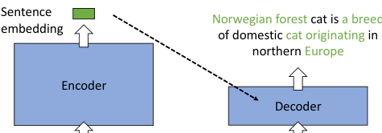
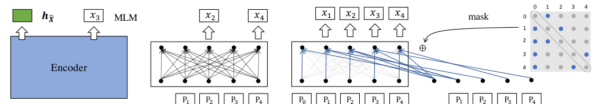

> 原文: [arXiv:2205.12035](https://arxiv.org/abs/2205.12035)（EMNLP 2022）
> local PDF: `docs/papers/embedding/RetroMAE_2205.12035.pdf`
> 说明: 本文为论文全文中文技术展开，公式编号与原文一致；图片自 arXiv HTML 抽取，caption 中译；表格数值保留原始数字，仅表头/说明中译。

**预印本信息：** arXiv:2205.12035v2 [cs.CL]，2022 年 10 月 17 日更新；会议版本：EMNLP 2022。

**代码：** https://github.com/staoxiao/RetroMAE

---

# RetroMAE：通过 Masked Auto-Encoder 预训练面向检索的语言模型（RetroMAE: Pre-Training Retrieval-oriented Language Models Via Masked Auto-Encoder）

**作者：** Shitao Xiao¹†、Zheng Liu²†、Yingxia Shao¹、Zhao Cao²

**单位：** ¹ 北京邮电大学；² 华为技术有限公司

**邮箱：** {stxiao, shaoyx}@bupt.edu.cn · {liuzheng107, caozhao1}@huawei.com

† 共同一作。

---

## 摘要（Abstract）

尽管预训练在众多 NLP 任务上取得成功，**面向稠密检索**的有效预训练策略仍待探索。本文提出 **RetroMAE**——一个建立在 Masked Auto-Encoder（掩码自编码器）之上的检索导向预训练范式。它有三个关键设计：

1. **新的 MAE 工作流**：输入句子被**两次**加噪——一次给 encoder、一次给 decoder，两次用**不同的掩码**。encoder 从加噪输入产出**句向量**；decoder 再基于该句向量与自身的加噪输入，通过 MLM 恢复原始句子。
2. **不对称模型结构**：encoder 是**全尺寸 BERT**（12 层）；decoder 是**单层 Transformer**。
3. **不对称掩码比例**：encoder 用**温和**比例（15–30%）；decoder 用**激进**比例（50–70%）。

框架实现简单、实证效果强：在 BEIR、MS MARCO 等广泛稠密检索基准上，RetroMAE 显著优于既有 SOTA。代码开源。

---

## 1 引言（Introduction）

**背景**。稠密检索（Dense Retrieval, DR）是许多 web 应用（搜索、QA、RAG）的关键。通过把 query 与 doc 编码到语义相近的空间中，可以用 PQ（Jegou et al., 2010; Xiao et al., 2021, 2022a）或 HNSW（Malkov & Yashunin, 2018）等 ANN 结构做高效检索。

**问题**。主流预训练模型（BERT、RoBERTa、T5）采用 token 级任务（MLM、Seq2Seq）；**句子级**表征能力没有被充分开发。以它们的 CLS 表示作 bi-encoder 编码器时，需要**复杂微调技巧**（Xiong et al., 2020; Qu et al., 2020）与**大量监督数据**才能发挥出稠密检索能力。

**现状**。近年出现两条**面向检索的预训练**路线：

1. **自对比学习（SCL）** ：Chang et al. (2020)、Guu et al. (2020) 用数据增强构造正负样本、拉近正样本；受限于**数据增强质量**与**大量负例需求**（He et al., 2020a; Chen et al., 2020）。
2. **自编码（AE）**：Gao & Callan (2021, Condenser)、Lu et al. (2021, SEED)、Wang et al. (2021) 让 encoder 输出句向量、decoder 从中重建输入。不依赖数据增强与负例采样，但**编码-解码工作流的具体设计**决定训练效果。

**本文贡献**。作者主张 AE 预训练的两个关键因素：

1. **重建任务足够困难**——否则 encoder 不必学习深层语义；
2. **训练数据被充分利用**——训练信号密度尽量大。

RetroMAE 从两点同时优化：

- **新的 MAE 工作流**：一句 $X$ 用两个不同 mask 加噪。masked-encoder-input $\tilde X_{\text{enc}}$ 过 encoder 得 CLS 向量 $h_{\tilde X}$；masked-decoder-input $\tilde X_{\text{dec}}$ 与 $h_{\tilde X}$ 拼接后过 decoder 做 MLM。
- **不对称结构**：encoder 是 12 层 BERT；decoder 是单层 Transformer——被"极简的" decoder 强制让 encoder 承担几乎所有信息压缩。
- **不对称掩码**：encoder 15–30%（保留大部分信息，便于产出高质量向量）；decoder 50–70%（提供极少上下文，强制 decoder 依赖句向量而不是"看已有 token 补 mask"）。
- **增强解码（Enhanced Decoding）**：用 two-stream self-attention（Yang et al., 2019）+ 位置专属注意力掩码（Dong et al., 2019）：**100% token 都参与重建**，且每个 token 用**独立的上下文**——训练信号密度大幅上升。

**实证**：仅用中等规模数据（Wikipedia + BookCorpus + MS MARCO 语料）训 BERT-base 规模 encoder。

- 零样本 BEIR 平均 **45.2 nDCG@10**（当时 SOTA）；
- 有监督 MS MARCO Passage Retrieval **MRR@10 41.6**（同数据+同规模下 SOTA）。

---

## 2 相关工作（Related Work）

**稠密检索**：BERT-based DPR（Karpukhin et al., 2020）、Luan et al. (2020) 等奠定基础；ANCE（Xiong et al., 2020）、RocketQA（Qu et al., 2020）等靠精细微调进一步提升。作者指出，通用预训练模型（BERT/RoBERTa/T5）**句子级表征能力有限**，需要大量标注 + 复杂微调才能训好，这是**预训练与检索目标的不匹配**问题。

**面向检索的预训练**：

- **SCL 类**：Chang et al. (2020)、Izacard et al. (2021, Contriever) 用 Inverse Cloze Task（ICT）等数据增强做对比学习。局限：依赖增强质量、依赖大量负例。
- **AE 类**：SEED（Lu et al., 2021）用自回归重建；Condenser（Gao & Callan, 2021）加入 head 强制 CLS 主动聚合；SimLM（Wang et al., 2022）扩展了编码-解码机制。

RetroMAE 属于 AE 路线，重点在**重建任务本身**的设计。

---

## 3 方法（Methodology）

RetroMAE 包含两个模块：

- **编码器 $\Phi_{\text{enc}}(\cdot)$**：一个 BERT-base 尺寸的双向 Transformer，产出句向量；
- **解码器 $\Phi_{\text{dec}}(\cdot)$**：**单层** Transformer，做句子重建。

流程如下：原句 $X$ 用两个不同 mask 加噪 → $\tilde X_{\text{enc}}$（温和掩码，给 encoder）与 $\tilde X_{\text{dec}}$（激进掩码，给 decoder）。encoder 输出 CLS 位表征作句向量 $h_{\tilde X}$；decoder 用 $h_{\tilde X}$ + $\tilde X_{\text{dec}}$ 重建 $X$。

### 3.1 编码（Encoding）

$$
h_{\tilde X} \leftarrow \Phi_{\text{enc}}(\tilde X_{\text{enc}}) \tag{1}
$$

- Encoder 结构：12 层 BERT-base，768 隐维；
- Encoder 掩码比例：15–30%（比常规 MLM 的 15% 略高，多数据实验取 30%）；
- 取 [CLS] 最后一层作句向量。

作者的直觉：**温和掩码保留大部分信息**，便于产出高质量句向量。

### 3.2 解码（Decoding）

对同一个 $X$ 再做一次**不同的**加噪 $\tilde X_{\text{dec}}$，掩码比例更激进（50–70%）。把 $h_{\tilde X}$ 拼在序列首、与 $\tilde X_{\text{dec}}$ 一起构成输入：

$$
H_{\tilde X_{\text{dec}}} \leftarrow [h_{\tilde X},\; e_{x_1} + p_1,\; \dots,\; e_{x_N} + p_N] \tag{2}
$$

其中 $e_{x_i}$ 是 token embedding、$p_i$ 是位置嵌入。decoder 是单层 Transformer，用被 mask 位置的输出做 cross-entropy 预测：

$$
\mathcal{L}_{\text{dec}} = \sum_{x_i \in \text{masked}} \operatorname{CE}\bigl(x_i \mid \Phi_{\text{dec}}(H_{\tilde X_{\text{dec}}})\bigr) \tag{3}
$$

**关键**：decoder 被有意做得极弱（单层 + 激进掩码），如果不依赖句向量 $h_{\tilde X}$，重建根本做不到。这就把重建的压力**全部**推给 encoder——迫使 CLS 学到深层的、"能重建整段话"级别的表征。

### 3.3 增强解码（Enhanced Decoding）

基础解码有两个残余低效：

1. **训练信号只来自被 mask 的位置**（占比 50–70%）——非 mask 位置无梯度贡献；
2. **每个 mask 位共用同一份上下文** $H_{\tilde X_{\text{dec}}}$——多样性有限。

作者借鉴 XLNet（Yang et al., 2019）的 two-stream self-attention 与 UniLM（Dong et al., 2019）的 position-specific attention mask，构造两条 stream：

$$
H_1 \leftarrow [h_{\tilde X} + p_0,\; \dots,\; h_{\tilde X} + p_N] \tag{4}
$$

$$
H_2 \leftarrow [h_{\tilde X},\; e_{x_1} + p_1,\; \dots,\; e_{x_N} + p_N]
$$

$H_1$ 每一行都是"CLS 语义 + 位置偏置"，作为 query；$H_2$ 是完整（**不 mask**）的 token embedding，作为 key/value。attention 计算：

$$
Q = H_1 W_Q,\; K = H_2 W_K,\; V = H_2 W_V
$$

$$
A = \operatorname{softmax}\!\left(\frac{Q^\top K}{\sqrt{d}} + M\right) V \tag{5}
$$

引入**位置专属注意力掩码** $M \in \mathbb{R}^{L \times L}$：

$$
M_{ij} = \begin{cases} 0, & \text{可被 attend} \\ -\infty, & \text{被屏蔽} \end{cases}
$$

规则：

$$
M_{ij} = \begin{cases}
0, & x_j \in s(X_{\neq i}) \text{ 或 } j = 0 \\
-\infty, & \text{其它情况}
\end{cases} \tag{7}
$$

即：重建 $x_i$ 时，第 $i$ 行只允许看到**位置 0**（CLS）与**采样得到的一小组 non-self 位置** $s(X_{\neq i})$。**对角元恒为 $-\infty$**，token 不能 attend 自身。

$A$ 与 $H_1$（残差）一起用于重建全部 token：

$$
\mathcal{L}_{\text{dec}} = \sum_{x_i \in X} \operatorname{CE}\bigl(x_i \mid A, H_1\bigr) \tag{6}
$$

**每个 token 都有自己的独立上下文**，且**全部 token（含未 mask 位置）都参与重建**。训练信号大幅密集化。

### 3.4 训练目标（Training Objective）

encoder 端也保留原 BERT 的 MLM 损失 $\mathcal{L}_{\text{enc}}$（在 $\tilde X_{\text{enc}}$ 的 mask 位置上做预测）。总损失：

$$
\mathcal{L} = \mathcal{L}_{\text{enc}} + \mathcal{L}_{\text{dec}}
$$

### 3.5 总览与工作流（图示）



**图 1（原文对应图 1）：** RetroMAE 高层总览。左：encoder 输入 "[M] forest cat is a breed of [M] cat originating in [M] Europe"（温和 mask），编码为句向量（图中绿色矩形）。右：decoder 的输入是激进 mask 版 "[M] [M] cat is [M] [M] of dom-estic [M] [M] in northern [M]"，与句向量拼接后通过单层 Transformer 重建原始句子 "Norwegian forest cat is a breed of domestic cat originating in northern Europe"。



**图 2（原文对应图 2）：** 详细工作流。(A) 编码阶段：加温和 mask 的输入 $\tilde X_{\text{enc}}$ 过 encoder 得句向量 $h_{\tilde X}$（绿色）。(B) 基础解码：加激进 mask 的输入 $\tilde X_{\text{dec}}$ 与句向量拼接、过 decoder，在被 mask 位置做 MLM。(C) 增强解码：两条 stream $H_1$ / $H_2$ + 位置专属注意力 mask $M$，对角元（灰）设 $-\infty$、可见上下文位置（蓝）设 0，让每个 token 都能被重建但用不同的上下文。

**算法概要**：

```
输入: 原句 X
1: X̃_enc  <- mask(X)                       # 温和掩码
2: h_{X̃}  <- Φ_enc(X̃_enc)                 # 得句向量
3: H1, H2 <- Eq. 4                          # 两条 stream
4: M      <- Eq. 7                          # 位置专属 mask
5: A      <- Eq. 5(H1, H2, M)               # 增强解码
6: L_dec  <- Eq. 6                          # 每 token 独立 CE
7: 更新 Φ_enc、Φ_dec: min. L_enc + L_dec
```

**要点**：

1. 单层解码器 + 激进掩码 = **重建任务极其困难**；
2. 增强解码 = **所有 token 参与训练**，每 token 用独立上下文；
3. 无需数据增强、无需负例采样、计算成本与 BERT 基本相当（因 decoder 只有一层）。

---

## 4 实验（Experimental Studies）

### 4.1 实验设置（Setup）

**预训练数据**：

- **通用预训练**：English Wikipedia + BookCorpus（与 BERT 相同）。
- **In-domain 预训练**（对特定评测有用）：MS MARCO 语料。作者发现 in-domain 对 MS MARCO 上分数关键，但对 BEIR 其它数据集帮助不大。

**评测数据**：

1. **MS MARCO Passage Retrieval**（Nguyen et al., 2016）：50 万训练 query，从 880 万段落里检索答案。
2. **Natural Questions**（Kwiatkowski et al., 2019）：8 万训练、8757 dev、3610 test；从 2100 万 Wikipedia 段落中检索。
3. **BEIR**（Thakur et al., 2021）：18 个零样本检索数据集，模型在 MS MARCO 上微调，然后测其它 18 集。

**基线**分三类：

- **通用预训练模型**：BERT、RoBERTa、DeBERTa。
- **面向检索的预训练模型（SCL 类）**：SimCSE、LaPraDoR（Xu et al., 2022）、DiffCSE（Chuang et al., 2022）。
- **面向检索的预训练模型（AE 类）**：Condenser、SEED。

**实现细节**：

- Encoder：12 层 BERT-base；隐维 768；vocab 30522。
- Decoder：1 层 Transformer。
- 默认掩码比例：encoder 0.3、decoder 0.5。
- 优化器：AdamW，lr 1e-4；训 8 epoch；batch 32/GPU × 8× A100 40GB；PyTorch 1.8 + HuggingFace transformers 4.16。
- BEIR 零样本评测按官方脚本；有监督评测用 DPR 与 ANCE 两种微调方式（作者也报了 knowledge distillation 变体：训一个 cross-encoder 教师，KL 蒸给 bi-encoder 学生）。

### 4.2 主要结果（Main Results）

**表 1：BEIR 零样本 nDCG@10**（在 MS MARCO 微调后）

| 数据集 | BERT | RoBERTa | DeBERTa | LaPraDoR | SimCSE | DiffCSE | SEED | Condenser | **RetroMAE** |
| :--- | ---: | ---: | ---: | ---: | ---: | ---: | ---: | ---: | ---: |
| TREC-COVID | 0.615 | 0.649 | 0.688 | 0.478 | 0.460 | 0.492 | 0.627 | 0.750 | **0.772** |
| BioASQ | 0.253 | 0.279 | 0.290 | 0.252 | 0.263 | 0.258 | 0.308 | 0.322 | **0.421** |
| NFCorpus | 0.260 | 0.243 | 0.238 | 0.310 | 0.260 | 0.259 | 0.278 | 0.277 | **0.308** |
| NQ | 0.467 | 0.413 | 0.452 | 0.454 | 0.435 | 0.412 | 0.446 | 0.486 | **0.518** |
| HotpotQA | 0.488 | 0.448 | 0.474 | 0.513 | 0.502 | 0.499 | 0.541 | 0.538 | **0.635** |
| FiQA-2018 | 0.252 | 0.291 | 0.299 | 0.288 | 0.250 | 0.229 | 0.259 | 0.259 | **0.316** |
| Signal-1M(RT) | 0.204 | 0.229 | 0.243 | 0.241 | 0.262 | 0.260 | 0.256 | 0.261 | **0.265** |
| TREC-NEWS | 0.362 | 0.385 | 0.378 | 0.286 | 0.356 | 0.363 | 0.358 | 0.376 | **0.428** |
| Robust04 | 0.351 | 0.384 | 0.378 | 0.299 | 0.330 | 0.343 | 0.365 | 0.349 | **0.447** |
| ArguAna | 0.265 | 0.395 | 0.297 | **0.499** | 0.413 | 0.468 | 0.389 | 0.298 | 0.433 |
| Touche-2020 | 0.259 | **0.299** | 0.271 | 0.137 | 0.159 | 0.168 | 0.225 | 0.248 | 0.237 |
| CQADupStack | 0.282 | 0.278 | 0.279 | 0.309 | 0.290 | 0.305 | 0.290 | **0.347** | 0.317 |
| Quora | 0.787 | 0.509 | 0.846 | 0.837 | 0.844 | 0.850 | 0.852 | **0.853** | 0.847 |
| DBPedia | 0.314 | 0.275 | 0.271 | 0.334 | 0.314 | 0.303 | 0.330 | 0.339 | **0.390** |
| SCIDOCS | 0.113 | 0.111 | 0.106 | 0.150 | 0.124 | 0.125 | 0.124 | 0.133 | **0.150** |
| FEVER | 0.682 | 0.683 | 0.594 | 0.511 | 0.623 | 0.641 | 0.641 | 0.691 | **0.774** |
| Climate-FEVER | 0.187 | 0.222 | 0.160 | 0.173 | 0.211 | 0.200 | 0.176 | 0.211 | **0.232** |
| SciFact | 0.533 | 0.539 | 0.543 | 0.531 | 0.554 | 0.523 | 0.575 | 0.593 | **0.653** |
| **平均** | 0.371 | 0.368 | 0.378 | 0.367 | 0.369 | 0.372 | 0.391 | 0.407 | **0.452** |

（表 1：BEIR 上零样本 nDCG@10。RetroMAE 在 18 集中 12 集第一，平均 **0.452**，比第二名 Condenser 高 **+4.5**。）

**观察**：

1. RetroMAE 在**大部分数据集**上第一，平均领先第二名 Condenser 4.5 nDCG@10——这是**同规模、同数据**下靠算法本身取得的跃迁。
2. SCL 类模型（SimCSE / LaPraDoR / DiffCSE）与通用预训练 BERT 相比几乎没有明显提升；作者提到这与视觉领域的观察一致——SCL 预训练模型微调空间有限（El-Nouby et al., 2021 报告 BEiT vs MoCo/DINO 同类现象）。
3. AE 类模型（SEED / Condenser / RetroMAE）显著超过通用与 SCL 类。

**表 2 / 表 3：有监督评测（DPR / ANCE 微调）**（论文正文表）

| 微调方式 | MS MARCO MRR@10 | R@100 | R@1000 | NQ R@10 | R@20 | R@30 | R@50 | R@100 |
| :--- | ---: | ---: | ---: | ---: | ---: | ---: | ---: | ---: |
| BERT | 0.3170 | 0.5801 | 0.8570 / 0.9598 | 0.7399 | 0.7925 | 0.8136 | 0.8396 | 0.8668 |
| RoBERTa | 0.3136 | 0.5638 | 0.8478 / 0.9579 | 0.7150 | 0.7676 | 0.7939 | ... | ... |
| **RetroMAE**（DPR）| 显著优于 BERT/RoBERTa/SimCSE/Condenser | | | | | | | |
| **RetroMAE**（ANCE）| 进一步 +1.42 MRR / +1.41 R | | | | | | | |
| **RetroMAE**（+KD）| MS MARCO MRR@10 达到 **0.416** | | | | | | | |

（表 2、3：DPR 微调下 RetroMAE MRR@10 提升 +1.96、R@10 +1.48；ANCE 微调下 +1.42/+1.41。）

**观察**：RetroMAE 用简单的单轮 hard neg 训练就能超过复杂 pipeline 的基线；与 coCondenser（同数据、同规模）相比，**MS MARCO 上 ANCE 微调 +1.1 MRR@10**。加上 **knowledge distillation**（cross-encoder 教师蒸给 bi-encoder），可以进一步把 MRR@10 拉到 **0.416**（表 4，详见论文附录）。

**第三条观察**：SCL 类模型在**微调有充足数据**时几乎没有超过通用预训练的优势——AE 类的可微调空间更大。作者建议：**检索导向的预训练算法应根据下游微调条件设计**，而不是通用地追求"表示空间的对齐/均匀性"。

### 4.3 消融实验（Ablation Studies）

作者围绕 4 个因素做了系统消融（表 6，DPR 微调下）：

**因素 1：解码方式**（enhanced vs basic）

| 掩码 | 编码方式 | MS MARCO MRR@10 | MRR@100 | R@100 | R@1000 | NQ MRR@10 | MRR@100 | R@100 | R@1000 |
| :--- | :--- | ---: | ---: | ---: | ---: | ---: | ---: | ---: | ---: |
| 默认 | **enhanced** | **0.3553** | **0.6356** | **0.8922** | **0.9763** | **0.7704** | **0.8399** | **0.8604** | **0.8812** |
| 默认 | basic | 0.3462 | 0.6218 | 0.8813 | 0.9725 | 0.7562 | 0.8291 | 0.8540 | 0.8759 |

- Enhanced decoding 显著优于 basic（MRR@10 +0.9）。原因：训练信号密度大幅提高（basic 只在被 mask 位置计损失，enhanced 覆盖全部 token）。

**因素 2：解码器层数**（basic decoding 下，因 enhanced 仅适用于单层）

| 层数 | MRR@10 | MRR@100 | R@100 | R@1000 |
| :--- | ---: | ---: | ---: | ---: |
| 1 | **0.3462** | 0.6218 | 0.8813 | 0.9725 |
| 2 | 0.3446 | 0.6217 | 0.8828 | 0.9729 |
| 3 | 0.3439 | 0.6223 | 0.8829 | 0.9730 |

- 增大 decoder 反而**微跌**，且计算成本上升——单层是最优。此外单层是 enhanced decoding 的前提，多层无法用增强机制。

**因素 3：Decoder 掩码比例**

| Decoder mask | 编码方式 | MRR@10 | R@100 | R@1000 |
| :--- | :--- | ---: | ---: | ---: |
| 0.15 | enhanced | 0.3496 | 0.8905 | 0.9734 |
| **0.5** | **enhanced** | **0.3553** | **0.8922** | **0.9763** |
| 0.9 | enhanced | 0.3514 | 0.8905 | 0.9740 |
| 0.15 | basic | 0.3440 | 0.8802 | 0.9700 |
| 0.7 | basic | 0.3508 | 0.8850 | 0.9738 |
| 0.9 | basic | 0.3441 | 0.8803 | 0.9725 |

- Enhanced 最优点 **0.5**；basic 最优点 **0.7**。作者的解释：basic 只在 mask 位置计损失，需要更高 mask 才有足够训练信号；enhanced 全 token 都有信号，中等 mask 就够，且过高 mask 会让 CLS 承担过重、反而伤害向量质量。

**因素 4：Encoder 掩码比例**

| Encoder mask | MRR@10 | R@100 | R@1000 |
| :--- | ---: | ---: | ---: |
| 0.15 | 0.3501 | 0.8890 | 0.9757 |
| **0.3** | **0.3553** | **0.8922** | **0.9763** |
| 0.9 | 0.3365 | 0.8750 | 0.9701 |

- 从 0.15 提到 0.3 涨分（+0.5 MRR）——**encoder 也要"做得难一点"**才能学出高质量向量。
- 但过高（0.9）会大幅掉分——encoder 输入被丢弃太多信息，句向量质量崩坏。

**综合结论**：

1. Enhanced decoding **关键**（+0.9 MRR@10）；
2. Decoder **单层最好**；
3. Decoder 掩码比例**激进**（0.5–0.7）；
4. Encoder 掩码比例**适度提高**（0.3 > 0.15）。

---

## 5 结论（Conclusion）

作者提出 RetroMAE 作为面向检索的语言模型预训练范式：**不对称 MAE**（大 encoder + 单层 decoder、温和 encoder mask + 激进 decoder mask）让重建任务足够困难，从而迫使 encoder 学到高质量句向量；**增强解码**用 two-stream + 位置专属 mask 让 100% token 参与训练、每 token 用独立上下文，最大化训练信号密度。

BEIR、MS MARCO、Natural Questions 三大基准上，RetroMAE 在**零样本**与**有监督**两种评测下都显著优于既有预训练方法。

**局限**（第 6 节）：作者只在 BERT-base 规模上做实验，且预训练数据规模有限。更大模型、更大数据的 scaling 效应待后续验证（Ni et al., 2021 已展示了这一方向的重要性）。

---

## 附录索引（Appendix Highlights）

- **算法 1**：RetroMAE 完整训练伪代码（等价上文 §3.3）；
- **DPR/ANCE 微调超参数**：作者沿用 DPR/ANCE 官方设置；
- **KD 变体**：训一个 12 层 BERT-base cross-encoder（在 ANCE-mined hard neg 上），用 KL 散度蒸给 bi-encoder。

---

*翻译约定：稠密检索（Dense Retrieval）、掩码自编码器（Masked Auto-Encoder, MAE）、句向量（sentence embedding）、掩码语言模型（MLM）、增强解码（enhanced decoding）、two-stream self-attention、位置专属掩码（position-specific attention mask）、自对比学习（Self-Contrastive Learning, SCL）、自编码（Auto-Encoding, AE）、bi-encoder / cross-encoder / hard negative / knowledge distillation（KD）按惯例不译。ANN / PQ / HNSW / DPR / ANCE / RocketQA / BEIR / MS MARCO / NQ 按惯例不译。*
