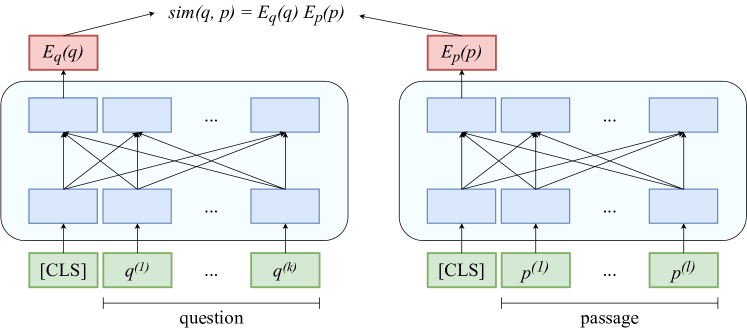
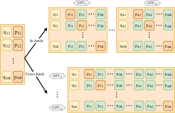
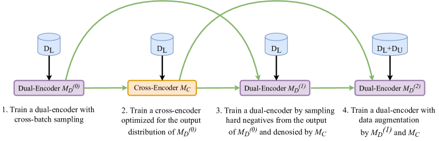
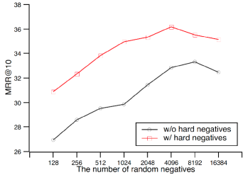
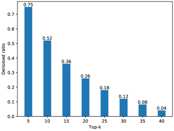
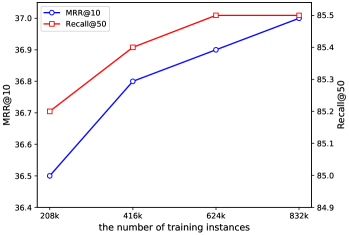

> 原文: [arXiv:2010.08191](https://arxiv.org/abs/2010.08191)（NAACL 2021）
> 说明: 本文为论文全文中文翻译，公式编号与原文一致；图表保留标题/说明中译，数值表数字原样。

**预印本信息：** arXiv:2010.08191v2 [cs.CL]，2021 年 5 月 12 日提交；会议版本：NAACL 2021。

**代码：** https://github.com/PaddlePaddle/Research/tree/master/NLP/NAACL2021-RocketQA

# RocketQA：面向开放域问答的稠密段落检索优化训练方法（RocketQA: An Optimized Training Approach to Dense Passage Retrieval for Open-Domain Question Answering）

**作者：** Yingqi Qu¹、Yuchen Ding¹、Jing Liu¹\*、Kai Liu¹、Ruiyang Ren²†、Wayne Xin Zhao²\*、Daxiang Dong¹、Hua Wu¹、Haifeng Wang¹

**单位：** ¹ 百度公司；² 中国人民大学高瓴人工智能学院

**邮箱：** {quyingqi, dingyuchen, liujing46, liukai20, dongdaxiang, wu_hua, wanghaifeng}@baidu.com；reyon.ren@ruc.edu.cn, batmanfly@gmail.com

\* 通讯作者。† 任瑞阳在百度实习期间完成该工作。

---

## 摘要（Abstract）

在开放域问答（open-domain question answering, QA）中，稠密段落检索（dense passage retrieval）已成为检索相关段落以寻找答案的新范式。通常采用双编码器（dual-encoder）架构来学习问题与段落的稠密表示以进行语义匹配。然而，由于训练与推理不一致、存在未标注正样本以及训练数据有限等挑战，双编码器难以有效训练。为应对这些挑战，我们提出一种名为 RocketQA 的优化训练方法以改进稠密段落检索。RocketQA 包含三项主要技术贡献：跨 batch 负样本（cross-batch negatives）、去噪困难负样本（denoised hard negatives）和数据增强（data augmentation）。实验结果表明，RocketQA 在 MS-MARCO 与 Natural Questions 上均显著优于此前最优模型。我们还进行了大量实验以检验 RocketQA 中三项策略的有效性。此外，我们证明基于 RocketQA 检索器的端到端 QA 性能可以得到提升。

---

## 1 引言（Introduction）

开放域问答（QA）旨在从大规模文档集合中为自然语言问题找到答案。早期 QA 系统（Brill et al., 2002; Dang et al., 2007; Ferrucci et al., 2010）构建了包含问题理解、文档检索、段落排序与答案抽取等多个组件的复杂流水线。近年来，受机器阅读理解（machine reading comprehension, MRC）进展的启发，Chen et al. (2017) 提出一种简化的两阶段方法：传统信息检索（information retrieval, IR）检索器（如 TF-IDF 或 BM25）先选出若干相关段落作为上下文，再由神经阅读器读取上下文并抽取答案。作为召回组件，第一阶段检索器显著影响最终 QA 性能。尽管借助倒排索引效率较高，基于词项的稀疏表示传统 IR 检索器在匹配问题与段落方面能力有限，例如存在词项不匹配（term mismatch）。

为缓解词项不匹配，双编码器架构（如图 1a 所示）已被广泛探索（Lee et al., 2019; Guu et al., 2020; Karpukhin et al., 2020; Luan et al., 2020; Xiong et al., 2020），以端到端方式学习问题与段落的稠密表示，从而提供更适合语义匹配的表示。这些工作先将问题与段落分别编码得到稠密表示，再用余弦或点积等相似度函数计算表示之间的相似度。通常，双编码器通过 batch 内随机负样本（in-batch random negatives）训练：对训练 batch 中每个问题—正段落对，batch 内其他问题的正段落用作负样本。然而，由于以下三大挑战，稠密段落检索的双编码器仍难以有效训练。

**第一，双编码器检索器存在训练与推理不一致。** 推理时，检索器需从包含数百万候选的大规模集合中为每个问题识别正（或相关）段落。训练时，受单 GPU（或其他设备）显存限制，模型仅在小候选集上学习估计每个问题的正段落概率。为减小这种不一致，先前工作尝试设计特定机制，从 top-$k$ 检索结果中选取少量困难负样本（hard negatives）（Gillick et al., 2019; Wu et al., 2020; Karpukhin et al., 2020; Luan et al., 2020; Xiong et al., 2020）。然而，由于下一挑战，该方法仍受假负样本（false negatives）问题困扰。

**第二，可能存在大量未标注正样本。** 通常无法为一个问题完整标注所有候选段落。标注者往往仅检查特定检索方法（如 BM25）检索到的 top-$K$ 段落，因而容易遗漏与问题相关的段落。以 MSMARCO 数据集（Nguyen et al., 2016）为例，每个问题平均仅有 1.1 个标注正段落，而全集合共有 880 万段落。如实验所示，我们人工检查 MSMARCO 原始数据中未标注为正样本的 top 检索段落，发现其中约 70% 实际为正样本。因此，从 top-$k$ 检索段落中采样困难负样本很可能引入假负样本。

**第三，获取大规模开放域 QA 训练数据代价高昂。** MSMARCO 与 Natural Questions（Kwiatkowski et al., 2019）是开放域 QA 最大的两个数据集，分别来自商业搜索引擎，含 51.6 万与 30 万标注问题。但仍不足以覆盖用户向搜索引擎提出的所有问题主题。

本文聚焦解决上述挑战，以有效训练面向开放域 QA 的双编码器检索器。我们提出名为 RocketQA 的优化训练方法以改进稠密段落检索。针对上述挑战，RocketQA 包含三项主要技术贡献：

**第一，RocketQA 引入跨 batch 负样本。** 与 batch 内负样本相比，训练时为每个问题增加可用负样本数量，并缓解训练与推理之间的不一致。

**第二，RocketQA 引入去噪困难负样本。** 旨在从检索器 top 排序结果中移除假负样本，得到更可靠的困难负样本。

**第三，RocketQA 利用交叉编码器（cross-encoder，如图 1b）标注的大规模无监督数据进行数据增强。** 交叉编码器虽效率较低，但在理论与实践中均被证明比双编码器更具能力（Luan et al., 2020）。因此，我们用交叉编码器为无标注数据生成高质量伪标签，用于训练双编码器检索器。

**本文贡献如下：**

- 提出 RocketQA，包含三项面向开放域 QA 稠密段落检索的新训练策略：跨 batch 负样本、去噪困难负样本与数据增强。
- 整体实验表明，RocketQA 在 MS-MARCO 与 Natural Questions 上显著优于此前最优模型。
- 大量实验检验上述三项策略的有效性，结果表明它们均能有效提升稠密段落检索性能。
- 证明基于 RocketQA 检索器的端到端 QA 性能可以得到提升。

**图 1：双编码器与交叉编码器架构对比。**

- **(a)** 基于预训练语言模型（language model, LM）的双编码器：问题与段落分别编码，相似度 $\mathrm{sim}(q,p) = E_q(q) \cdot E_p(p)$。
- **(b)** 基于预训练 LM 的交叉编码器：问题与段落拼接输入，通过深度交互建模相似度。

---

## 2 相关工作（Related Work）

### 2.1 开放域 QA 的段落检索

开放域 QA 中，段落检索器是识别相关段落以供答案抽取的重要组件。传统方法（Chen et al., 2017）实现基于词项的段落检索器（如 TF-IDF、BM25），表示能力有限。近期研究利用深度学习改进传统段落检索，包括文档扩展（Nogueira et al., 2019c）、问题扩展（Mao et al., 2020）与词项权重估计（Dai and Callan, 2019）。

与上述基于词项的方法不同，稠密段落检索将问题与文档表示为稠密向量（即嵌入 embedding），通常采用双编码器架构（如图 1a）。现有方法可分为两类：(1) 面向检索的自监督预训练（Lee et al., 2019; Guu et al., 2020; Chang et al., 2020）；(2) 在标注数据上微调预训练语言模型。本文遵循第二类，其以更低成本取得更好性能。尽管双编码器架构支持有吸引力的稠密检索范式，但如第 1 节所述，训练此类检索器仍面临训练与推理不一致、大量未标注正样本与训练数据有限等挑战。若干近期研究（Karpukhin et al., 2020; Luan et al., 2020; Chang et al., 2020; Henderson et al., 2017）通过设计复杂采样机制生成困难负样本以应对第一项挑战，但仍受假负样本问题影响；后两项挑战在开放域 QA 中较少被考虑。

### 2.2 开放域 QA 的段落重排序

基于第一阶段检索器得到的段落，基于 BERT 的重排序器（reranker）近期被应用于检索式 QA 与搜索相关任务（Wang et al., 2019; Nogueira and Cho, 2019; Nogueira et al., 2019b; Yan et al., 2019），相对传统方法带来显著提升。尽管在一定程度上有效，这些排序器采用交叉编码器架构（如图 1b），对语料库中全部段落相对一个问题进行评分在实践上不可行。基于稠密检索器表示的轻量交互重排序器（Khattab and Zaharia, 2020; Gao et al., 2020）也有研究，但仍依赖独立检索器提供候选与表示。相比之下，我们聚焦开发基于双编码器的检索器。

---

## 3 方法（Approach）

本节提出面向开放域 QA 的稠密段落检索优化训练方法 RocketQA。先介绍双编码器架构背景，再描述 RocketQA 中三项新训练策略，最后给出 RocketQA 完整训练流程。

### 3.1 任务描述（Task Description）

开放域 QA 任务描述如下。给定自然语言问题，系统需基于大规模文档集合回答。设 $C$ 为语料库，含 $N$ 篇文档。将 $N$ 篇文档切分为 $M$ 个段落，记为 $p_1, p_2, \ldots, p_M$，每个段落 $p_i$ 可视为长度为 $l$ 的 token 序列 $p_i^{(1)}, p_i^{(2)}, \ldots, p_i^{(l)}$。给定问题 $q$，任务是在 $M$ 个候选段落中找到段落 $p_i$，并从 $p_i$ 中抽取跨度 $p_i^{(s)}, p_i^{(s+1)}, \ldots, p_i^{(e)}$ 作为答案。本文主要聚焦开发稠密检索器以检索包含答案的段落。

### 3.2 双编码器架构（The Dual-Encoder Architecture）

段落检索器基于典型双编码器架构（图 1a）。稠密段落检索器使用编码器 $E_p(\cdot)$ 得到 $d$ 维实值向量（即嵌入）表示段落，并构建段落嵌入索引供检索。查询时，另一编码器 $E_q(\cdot)$ 将输入问题编码为 $d$ 维向量，检索与问题嵌入最接近的 $k$ 个段落。问题 $q$ 与候选段落 $p$ 的相似度可计算为向量点积：

$$
\mathrm{sim}(q, p) = E_q(q) \cdot E_p(p). \tag{1}
$$

实践中，问题编码与段落编码分离是可取的，以便预计算全部段落的稠密表示以实现高效检索。此处，$E_q(\cdot)$ 与 $E_p(\cdot)$ 分别采用从预训练 LM 初始化的两个独立神经网络，并以首个 token（如 BERT 中的 [CLS]）的表示作为编码输出。

**训练（Training）** 训练目标是学习问题与段落的稠密表示，使训练数据中问题—正段落对的相似度高于问题—负段落对。形式化地，给定问题 $q_i$、其正段落 $p_i^+$ 与 $m$ 个负段落 $\{p_{i,j}^-\}_{j=1}^m$，最小化损失函数：

$$
L(q_i, p_i^+, \{p_{i,j}^-\}_{j=1}^m) = -\log \frac{e^{\mathrm{sim}(q_i, p_i^+)}}{e^{\mathrm{sim}(q_i, p_i^+)} + \sum_{j=1}^{m} e^{\mathrm{sim}(q_i, p_{i,j}^-)}}. \tag{2}
$$

理想情况下，式 (2) 应考虑全集合中全部负段落。然而，对一个问题考虑大量负样本在计算上不可行，因此 $m$ 实际设为远小于 $M$ 的小数。如后文讨论，负样本的数量与质量均影响段落检索最终性能。

**推理（Inference）** 实现中使用 FAISS（Johnson et al., 2019）对全部段落的稠密表示建索引。具体采用 IndexFlatIP 索引与精确最大内积搜索（maximum inner product search）进行查询。

### 3.3 优化训练方法（Optimized Training Approach）

第 1 节讨论了训练双编码器检索器的三大挑战：训练与推理不一致、未标注正样本的存在以及训练数据有限。下面提出三项改进训练策略分别应对。

#### 3.3.1 跨 batch 负样本（Cross-batch Negatives）

训练双编码器时，batch 内负样本技巧在先前工作中被广泛使用（Henderson et al., 2017; Gillick et al., 2019; Wu et al., 2020; Karpukhin et al., 2020; Luan et al., 2020）。设单 GPU 上一个 mini-batch 含 $B$ 个问题，每个问题有一个正段落。采用 batch 内负样本技巧时，每个问题可再与 $B-1$ 个负样本配对（即其余问题的正段落），无需额外采样。batch 内负样本训练是一种内存高效方式：复用 mini-batch 中已加载样本而非采样新负样本，从而增加每个问题的负样本数。

图 2 上半部分展示在 $A$ 个 GPU 上数据并行训练时 batch 内负样本的示例。为进一步利用更多负样本优化训练，我们提出在多 GPU 训练时使用跨 batch 负样本，如图 2 下半部分。具体地，先在每个 GPU 内计算段落嵌入，再在所有 GPU 间共享这些段落嵌入。除 batch 内负样本外，将其他 GPU 上的全部段落（即其稠密表示）收集为每个问题的额外负样本。因此，$A$ 个 GPU 上训练时，对每个问题实际上可获得 $A \times B - 1$ 个负样本，约为原 batch 内负样本数量的 $A$ 倍。这样可在式 (2) 的训练目标中使用更多负样本，预期带来性能提升。

> **注 2：** 跨 batch 负样本可应用于单 GPU 与多 GPU 设置。仅单 GPU 时，可通过累积方式实现，代价是训练时间增加。

**图 2：传统 batch 内负样本与跨 batch 负样本对比（多 GPU 训练）。** $A$ 为 GPU 数量，$B$ 为每个 mini-batch 中的问题数。

#### 3.3.2 去噪困难负样本（Denoised Hard Negatives）

上述策略虽能增加负样本数量，但多数负样本较易区分。困难负样本对训练双编码器至关重要（Gillick et al., 2019; Wu et al., 2020; Karpukhin et al., 2020; Luan et al., 2020; Xiong et al., 2020）。获取困难负样本的直接方法是从 top 排序段落（排除已标注正段落）中选取负样本。然而，由于标注者只能标注少量 top 检索段落（见第 1 节），这很可能引入假负样本（即未标注正样本）。另需注意，先前工作主要聚焦事实型（factoid）问题，答案短而精炼，因而可用短答案过滤假负样本（Karpukhin et al., 2020），但该方法不适用于非事实型问题。本文旨在同时学习事实型与非事实型问题的稠密段落检索，需要更有效的困难负样本去噪方式。

我们的思路是利用训练良好的交叉编码器，移除 top 检索段落中可能是假负样本的段落。交叉编码器通过深度交互捕获语义相似度，性能远优于双编码器（Luan et al., 2020），更有效且更鲁棒，但在推理时对大量候选效率较低。因此，我们先训练交叉编码器（遵循图 1b 架构）。当从稠密检索器 top 排序段落中采样困难负样本时，仅选择被交叉编码器以高置信度预测为负样本的段落。所选 top 检索段落可视为更可靠、可用于困难负样本的去噪样本。

#### 3.3.3 数据增强（Data Augmentation）

第三项策略旨在缓解训练数据有限的问题。由于交叉编码器在度量问题与段落相似度方面更强大，我们利用其为无标注问题自动标注以进行数据增强。具体地，引入新的无标注问题集合，复用原有段落集合，用已学交叉编码器为新问题预测段落标签。为保证自动标注数据质量，仅选择交叉编码器以高置信度估计的正样本与负样本。最终，自动标注数据作为增强训练数据用于学习双编码器。数据增强的另一视角是知识蒸馏（knowledge distillation）（Hinton et al., 2015）：交叉编码器为教师，双编码器为学生。

### 3.4 训练流程（The Training Procedure）

如图 3 所示，我们将上述三项训练策略组织为双编码器的有效训练流水线，类比多级火箭：双编码器性能在三个步骤（STEP 1、3、4）中连续提升，故命名为 RocketQA。

**图 3：优化训练方法 RocketQA 流水线。** MD 与 MC 分别表示双编码器与交叉编码器。$M_D^{(0)}$、$M_D^{(1)}$、$M_D^{(2)}$ 表示不同步骤后学到的双编码器。

**REQUIRE：** 设 $C$ 为段落集合。$Q_L$ 为在 $C$ 中有对应标注段落的问题集合，$Q_U$ 为无对应标注段落的问题集合。$D_L$ 为由 $C$ 与 $Q_L$ 构成的数据集，$D_U$ 为由 $C$ 与 $Q_U$ 构成的数据集。

- **STEP 1：** 在 $D_L$ 上使用跨 batch 负样本训练双编码器 $M_D^{(0)}$。
- **STEP 2：** 在 $D_L$ 上训练交叉编码器 $M_C$。交叉编码器训练用的正样本来自原始训练集 $D_L$，负样本从 $M_D^{(0)}$ 对每个 $q \in Q_L$ 从 $C$ 检索的 top-$k$ 段落（排除已标注正段落）中随机采样。该设计使交叉编码器适应双编码器检索结果的分布，因交叉编码器将在后续两步中用于优化双编码器。该设计很重要，Facebook Search 中有类似观察（Huang et al., 2020）。
- **STEP 3：** 在 $D_L$ 上进一步引入去噪困难负样本采样，训练双编码器 $M_D^{(1)}$。对每个 $q \in Q_L$，困难负样本从 $M_D^{(0)}$ 从 $C$ 检索的 top 段落中采样，且仅选择被交叉编码器 $M_C$ 以高置信度预测为负样本的段落。
- **STEP 4：** 用 $M_C$ 对 $M_D^{(1)}$ 对每个 $q \in Q_U$ 从 $C$ 检索的 top-$k$ 段落打标签，构造伪训练数据 $D_U$，然后在人工标注训练数据 $D_L$ 与自动增强训练数据 $D_U$ 上训练双编码器 $M_D^{(2)}$。

注意，跨 batch 负样本策略贯穿双编码器训练的全部步骤。交叉编码器在 STEP 3 与 STEP 4 中用途不同，均用于提升双编码器性能。去噪困难负样本与数据增强的实现细节见第 4 节。

---

## 4 实验（Experiments）

### 4.1 实验设置（Experimental Setup）

#### 4.1.1 数据集（Datasets）

实验在两个主流 QA 基准上进行：MSMARCO Passage Ranking（Nguyen et al., 2016）与 Natural Questions（NQ）（Kwiatkowski et al., 2019）。数据集统计见表 1。

**表 1：MSMARCO 与 Natural Questions 数据集统计。** “p” 与 “q” 分别为段落（passage）与问题（question）的缩写。长度为 token 数。

| 数据集 | 训练 #q | 验证 #q | 测试 #q | #p | 平均 q 长度 | 平均 p 长度 |
|--------|---------|---------|---------|-----|-------------|-------------|
| MSMARCO | 502,939 | 6,980 | 6,837 | 8,841,823 | 5.97 | 56.58 |
| NQ | 58,812 | — | 3,610 | 21,015,324 | 9.20 | 100.0 |

**MSMARCO Passage Ranking** MSMARCO 最初面向多段落 MRC，问题采样自 Bing 搜索日志。基于 MSMARCO Question Answering 中的问题与段落，构建了段落排序数据集 MSMARCO Passage Ranking，含约 880 万段落，目标是为问题找到能回答它的正段落。

**Natural Questions（NQ）** Kwiatkowski et al. (2019) 引入大规模开放域 QA 数据集，原始含 30 万以上 Google 搜索日志问题。Karpukhin et al. (2020) 选取约 6.2 万事实型问题，将全部 Wikipedia 文章处理为段落集合，语料含 2100 万以上段落。实验复用 Karpukhin et al. (2020) 创建的 NQ 版本。注意 DPR 所用数据含空负样本，我们丢弃了空负样本。

#### 4.1.2 评价指标（Evaluation Metrics）

遵循先前工作，段落检索使用 MRR 与 top-$k$ 召回率（Recall at top $k$ ranks），答案抽取使用精确匹配（exact match, EM）。

- **MRR（Mean Reciprocal Rank，平均倒数排名）：** 倒数排名（Reciprocal Rank, RR）计算首个相关段落被检索到的排名的倒数；对所有问题平均即为 MRR。
- **Top-$k$ 召回率：** 定义为 top $k$ 检索段落中包含答案的问题比例。
- **精确匹配（EM）：** 字符串规范化后，预测答案与任一参考答案完全匹配的问题百分比。

#### 4.1.3 实现细节（Implementation Details）

全部实验在 PaddlePaddle 深度学习框架（Ma et al., 2019）上进行，最多使用 8 块 NVIDIA Tesla V100 GPU（32G 显存）。

**预训练 LM** 双编码器以 ERNIE 2.0 base（Sun et al., 2020）参数初始化，交叉编码器以 ERNIE 2.0 large 初始化。ERNIE 2.0 网络结构与 BERT 相同，并在多个预训练任务上引入持续预训练框架。注意到先前工作使用不同预训练 LM，我们在附录 A.1 中检验其影响。使用不同预训练 LM 时本方法仍然有效。

**跨 batch 负样本³** 跨 batch 负采样通过 FleetX（Dong, 2020）提供的可微 all-gather 操作实现，其为 PaddlePaddle 的高度可扩展分布式训练引擎。all-gather 算子使各 GPU 上段落表示全局可见，从而可全局应用跨 batch 负采样。

> **注 3：** 多 GPU 时，跨 batch 负样本与 batch 内负样本同样高效，因跨 batch 复用已计算的段落嵌入，GPU 间嵌入通信代价可忽略。

**去噪困难负样本与数据增强** 交叉编码器同时用于去噪困难负样本与数据增强。具体地，选择得分低于 0.1 的 top 检索段落作为负样本，得分高于 0.9 的作为正样本。我们人工评估所选数据，准确率超过 90%。

**正负样本数量** 训练交叉编码器时，MSMARCO 与 NQ 上正样本与负样本数量比分别为 1:4 与 1:1。交叉编码器训练用的负样本分别从 $M_D^{(0)}$ 在 MSMARCO 与 NQ 上检索的 top-1000 与 top-100 段落中随机采样。在最后两步（$M_D^{(1)}$ 与 $M_D^{(2)}$）训练双编码器时，MSMARCO 与 NQ 上正样本与困难负样本数量比同样分别为 1:4 与 1:1。

**Batch 大小** 双编码器在 MSMARCO 与 NQ 上分别以 $512 \times 8$ 与 $512 \times 2$ 的 batch 大小训练。MSMARCO batch 更大因其规模更大。交叉编码器在 MSMARCO 与 NQ 上分别以 $64 \times 4$ 与 $64$ 的 batch 大小训练。使用 FleetX 的自动混合精度与梯度检查点⁴功能，以便在有限资源下用大 batch 训练。

> **注 4：** 梯度检查点（Chen et al., 2016）以计算换内存，使内存代价次线性增长，从而可在有限资源下训练更大/更深的网络。

**训练轮数** 双编码器在 MSMARCO 上于 RocketQA 三步分别训练 40、10、10 个 epoch；在 NQ 上各步均训练 30 个 epoch。交叉编码器在 MSMARCO 与 NQ 上均训练 2 个 epoch。

**优化器** 使用 ADAM 优化器。

**Warmup 与学习率** 双编码器学习率设为 $3 \times 10^{-5}$，线性调度 warmup 比例 0.1；交叉编码器学习率设为 $1 \times 10^{-5}$。

**最大长度** 问题与段落最大长度分别设为 32 与 128。

**无标注问题** 从 Yahoo! Answers⁵、ORCAS（Craswell et al., 2020）与 MRQA（Fisch et al., 2019）收集 170 万无标注问题。MSMARCO 实验中使用 Yahoo! Answers、ORCAS 与 NQ 的问题作为新问题；NQ 实验中仅使用 MRQA 的问题作为新问题。NQ 与 MRQA 主要含事实型问题，而其他数据集含事实型与非事实型问题。

---

### 4.2 实验结果（Experimental Results）

实验首先检验检索器在 MSMARCO 与 NQ 上的有效性，再进行大量实验检验三项训练策略的效果，并展示基于本检索器在 NQ 上的端到端 QA 性能。

#### 4.2.1 稠密段落检索（Dense Passage Retrieval）

将 RocketQA 与先前最优段落检索方法对比，基线包括稀疏与稠密检索器。

**稀疏检索器：** 传统 BM25（Yang et al., 2017），以及四种神经网络增强的传统检索器：doc2query（Nogueira et al., 2019c）、DeepCT（Dai and Callan, 2019）、docTTTTTquery（Nogueira et al., 2019a）与 GAR（Mao et al., 2020）。doc2query 与 docTTTTTquery 用神经问题生成扩展文档；GAR 用神经生成模型扩展问题；DeepCT 用 BERT 学习词项权重。

**稠密检索器：** DPR（Karpukhin et al., 2020）、ME-BERT（Luan et al., 2020）与 ANCE（Xiong et al., 2020）。DPR 与 ME-BERT 使用 batch 内随机采样与从 BM25 检索结果中采样困难负样本；ANCE 通过稠密检索器增强困难负样本采样。

**表 2：段落检索性能对比。** 直接复制原论文报告数字；未报告处留空。

| 方法 | PLMs | MSMARCO Dev MRR@10 | R@50 | R@1000 | NQ Test R@5 | R@20 | R@100 |
|------|------|-------------------|------|--------|-------------|------|-------|
| BM25 (anserini) (Yang et al., 2017) | — | 18.7 | 59.2 | 85.7 | — | 59.1 | 73.7 |
| doc2query (Nogueira et al., 2019c) | — | 21.5 | 64.4 | 89.1 | — | — | — |
| DeepCT (Dai and Callan, 2019) | — | 24.3 | 69.0 | 91.0 | — | — | — |
| docTTTTTquery (Nogueira et al., 2019a) | — | 27.7 | 75.6 | 94.7 | — | — | — |
| GAR (Mao et al., 2020) | — | — | — | — | — | 74.4 | 85.3 |
| DPR (single) (Karpukhin et al., 2020) | BERTbase | — | — | — | — | 78.4 | 85.4 |
| ANCE (single) (Xiong et al., 2020) | RoBERTabase | 33.0 | — | 95.9 | — | 81.9 | 87.5 |
| ME-BERT (Luan et al., 2020) | BERTlarge | 33.8 | — | — | — | — | — |
| RocketQA | ERNIEbase | **37.0** | **85.5** | **97.9** | **74.0** | **82.7** | **88.5** |

表 2 显示，RocketQA 在 MSMARCO 与 NQ 上均显著优于全部基线。另一观察是稠密检索器总体优于稀疏检索器，该结论在先前研究（Karpukhin et al., 2020; Luan et al., 2020; Xiong et al., 2020）中也有报道，表明稠密检索方法的有效性。

#### 4.2.2 RocketQA 中三项训练策略的有效性

在 MSMARCO 上进行大量实验以检验 RocketQA 三项策略的有效性。NQ 上结果类似（见附录 A.2）。

**表 3：RocketQA 三项训练策略在 MSMARCO Passage Ranking 上的有效性实验。**

| 策略 | MRR@10 |
|------|--------|
| Batch 内负样本 | 32.39 |
| 跨 batch 负样本（即 STEP 1） | 33.32 |
| 困难负样本（无去噪） | 26.03 |
| 困难负样本（有去噪，即 STEP 3） | 36.38 |
| 数据增强（即 STEP 4） | 37.02 |

**跨 batch 负样本：** 在相同实验设置下（每单 GPU epoch 数 40、batch 大小 512）比较跨 batch 与 batch 内负样本。表 3 前两行显示，通过跨 batch 负样本增加负样本数量可提升稠密检索器性能，预期因增加随机负样本数量而减小训练与推理不一致。进一步考察随机负样本数量的影响：图 4 显示，随机负样本数量增大时模型性能提升；超过某点后性能开始下降，因大 batch 在有限训练数据上可能带来优化困难。应在 batch 大小与负样本数量之间取得平衡：增大 batch 会为每个问题带来更多负样本，但在训练数据规模有限时，过大 batch 会带来优化困难。

**图 4：MSMARCO 上每个问题配对的随机负样本数量影响。** 无/有困难负样本的模型分别训练 20K / 5K 步。

**去噪困难负样本：** 表 3 第三行显示，引入未去噪的困难负样本后检索器性能显著下降。我们推测因存在大量未标注正样本：人工检查 100 个问题的 top 检索段落（原数据中未标注为正样本），约 70% 实际为正或高度相关。因此，若简单地从稠密检索器 top 检索段落采样困难负样本（先前工作广泛采用，Gillick et al., 2019; Wu et al., 2020; Xiong et al., 2020），很可能引入噪声。相比之下，我们用强大交叉编码器提出去噪困难负样本；表 3 第四行显示去噪负样本提升稠密检索器性能。表 4 给出两个问题在去噪前后采样的困难负样本示例；图 5 展示不同排名上被过滤（去噪）段落的比例，可见较低排名处被过滤段落更多，因低排名处更可能存在假负样本。

**表 4：MSMARCO 上去噪前后的困难负样本。** 加粗词为与问题相关的关键词。

| 问题 | 标注正样本 | 困难负样本（无去噪，假负样本） | 困难负样本（有去噪） |
|------|-----------|-------------------------------|---------------------|
| How many kilohertz in a megahertz | One megahertz (abbreviated: MHz) is equal to 1,000 kilohertz, or 1,000,000 hertz. It can also be described as one million cycles per second. ... | (Rank 2nd) Kilo means times 1000, mega means times 1,000,000. So 0.005 megahertz = 5000 Hz = 5 kiloHz. Hertz (not Herz) is abbreviated to Hz. ... | (Rank 14th) ... megahertz (MHz) and gigahertz (GHz) are used to measure CPU speed. For example, a 1.6 GHz computer processes data internally ... |
| Name of test for achilles tendon rupture | In a patient with a ruptured Achilles tendon, the foot will not move. That is called a positive Thompson test. The Thompson test is important because. ... | (Rank 1st) ... The physical examination should include two or more of the following tests to establish the diagnosis of acute Achilles tendon rupture: Clinical Thompson test ... | (Rank 9th) ... Methods: Ultrasound was used to measure Achilles tendon length and muscle-tendon architectural parameters in children of ages 5 to 12 years. ... |

**图 5：MSMARCO 上不同 top-$k$ 排名处去噪段落比例。**

**数据增强：** 整合数据增强策略后（表 3 第五行），性能进一步提升。数据增强的主要优点是不显式依赖人工标注数据，而利用比双编码器能力更强的交叉编码器生成伪训练数据以改进双编码器。图 6 进一步考察增强数据规模的影响：增强数据增大时性能提升。

**图 6：MSMARCO 上增强数据规模对 MRR@10 与 Recall@50 的影响。**

#### 4.2.3 基于 RocketQA 的段落阅读（Passage Reading with RocketQA）

先前实验已证明 RocketQA 在段落检索上的有效性。接下来验证 RocketQA 检索结果能否提升段落阅读以抽取正确答案的性能。实现端到端 QA 系统：在 RocketQA 检索器上堆叠抽取式阅读器（extractive reader）。为公平比较，先复用 DPR（Karpukhin et al., 2020）发布的抽取式阅读器模型⁶，推理时取 100 个检索段落（与 DPR 相同设置）。此外，基于 RocketQA 检索结果用相同设置重新训练抽取式阅读器（训练时选 top 50 而非 100 个段落），动机是阅读器应适应 RocketQA 的检索分布。

> **注 6：** https://github.com/facebookresearch/DPR

**表 5：NQ 数据集上段落阅读（端到端 QA）实验结果。** 本文聚焦抽取式阅读器；近期生成式阅读器（Lewis et al., 2020; Izacard and Grave, 2020）也可应用于此，可能带来更好结果。

| 模型 | EM |
|------|-----|
| BM25+BERT (Lee et al., 2019) | 26.5 |
| HardEM (Min et al., 2019a) | 28.1 |
| GraphRetriever (Min et al., 2019b) | 34.5 |
| PathRetriever (Asai et al., 2020) | 32.6 |
| ORQA (Lee et al., 2019) | 33.3 |
| REALM (Guu et al., 2020) | 40.4 |
| DPR (Karpukhin et al., 2020) | 41.5 |
| GAR (Mao et al., 2020) | 41.6 |
| RocketQA + DPR reader | 42.0 |
| RocketQA + re-trained DPR reader | **42.8** |

表 5 汇总本方法与多种竞争方法的端到端 QA 性能。可见本检索器带来更好 QA 性能。相较先前方案，本文新颖性主要在段落检索组件，即 RocketQA 方法；结果表明本方法可提供更好段落检索结果，从而提升最终 QA 性能。

---

## 5 结论（Conclusions）

本文提出面向稠密段落检索的优化训练方法 RocketQA，包含三项主要技术贡献：跨 batch 负样本、去噪困难负样本与数据增强。大量实验通过纳入三项优化策略证明了所提方法的有效性。我们还证明基于 RocketQA 检索器可提升端到端 QA 性能。

---

## 6 伦理考量（Ethical Considerations）

稠密段落检索技术对问答有效，其中多数问题为信息型查询。与传统搜索不同，问题与答案之间常存在词项不匹配，给机器准确找到信息带来障碍。因此在问答场景下需要稠密段落检索进行语义匹配。稠密段落检索有潜力帮助人们更快找到准确信息，在工作与生活中取得更多成就。本技术有助于实现让机器从大规模文档集合中为自然语言问题找到答案的目标。

然而，该目标仍远未实现，社区仍需更多努力。

---

## 7 致谢（Acknowledgments）

本工作受国家重点研发计划（No. 2018AAA0101900）资助。感谢匿名审稿人的宝贵建议。

---

## 参考文献（References）

Akari Asai, Kazuma Hashimoto, Hannaneh Hajishirzi, Richard Socher, and Caiming Xiong. 2020. Learning to retrieve reasoning paths over wikipedia graph for question answering. In *ICLR 2020*.  
（学习在 Wikipedia 图上检索推理路径以进行问答）

Eric Brill, Susan T. Dumais, and Michele Banko. 2002. An analysis of the askmsr question-answering system. In *EMNLP 2002*, pages 257–264.  
（AskMSR 问答系统分析）

Tianqi Chen, Bing Xu, Chiyuan Zhang, and Carlos Guestrin. 2016. Training deep nets with sublinear memory cost. *CoRR*, abs/1604.06174.  
（次线性内存代价训练深度网络）

Wei-Cheng Chang, Felix X. Yu, Yin-Wen Chang, Yiming Yang, and Sanjiv Kumar. 2020. Pre-training tasks for embedding-based large-scale retrieval. In *ICLR 2020*.  
（面向基于嵌入的大规模检索的预训练任务）

Danqi Chen, Adam Fisch, Jason Weston, and Antoine Bordes. 2017. Reading wikipedia to answer open-domain questions. In *ACL 2017*, pages 1870–1879.  
（阅读 Wikipedia 回答开放域问题）

Nick Craswell, Daniel Campos, Bhaskar Mitra, Emine Yilmaz, and Bodo Billerbeck. 2020. ORCAS: 20 million clicked query-document pairs for analyzing search. In *CIKM 2020*, pages 2983–2989.  
（ORCAS：两千万点击查询—文档对用于搜索分析）

Zhuyun Dai and Jamie Callan. 2019. Deeper text understanding for IR with contextual neural language modeling. In *SIGIR 2019*, pages 985–988.  
（上下文神经语言建模加深 IR 文本理解）

Hoa Trang Dang, Diane Kelly, and Jimmy J. Lin. 2007. Overview of the TREC 2007 question answering track. In *TREC 2007*, NIST Special Publication 500-274.  
（TREC 2007 问答 track 概述）

Daxiang Dong. 2020. paddle.distributed.fleet: A highly scalable distributed training engine of paddlepaddle.  
（PaddlePaddle 高度可扩展分布式训练引擎 Fleet）

David A. Ferrucci et al. 2010. Building watson: An overview of the deepqa project. *AI Mag.*, 31(3):59–79.  
（构建 Watson：DeepQA 项目概述）

Adam Fisch, Alon Talmor, Robin Jia, Minjoon Seo, Eunsol Choi, and Danqi Chen. 2019. MRQA 2019 shared task: Evaluating generalization in reading comprehension. In *MRQA@EMNLP 2019*, pages 1–13.  
（MRQA 2019 共享任务：阅读理解泛化评估）

Luyu Gao, Zhuyun Dai, and Jamie Callan. 2020. Modularized transformer-based ranking framework. In *EMNLP 2020*, pages 4180–4190.  
（模块化基于 Transformer 的排序框架）

Daniel Gillick, Sayali Kulkarni, Larry Lansing, Alessandro Presta, Jason Baldridge, Eugene Ie, and Diego García-Olano. 2019. Learning dense representations for entity retrieval. In *CoNLL 2019*, pages 528–537.  
（学习实体检索稠密表示）

Kelvin Guu, Kenton Lee, Zora Tung, Panupong Pasupat, and Ming-Wei Chang. 2020. REALM: retrieval-augmented language model pre-training. *CoRR*, abs/2002.08909.  
（REALM：检索增强语言模型预训练）

Matthew L. Henderson et al. 2017. Efficient natural language response suggestion for smart reply. *CoRR*, abs/1705.00652.  
（Smart Reply 高效自然语言回复建议）

Geoffrey E. Hinton, Oriol Vinyals, and Jeffrey Dean. 2015. Distilling the knowledge in a neural network. *CoRR*, abs/1503.02531.  
（神经网络中的知识蒸馏）

Jui-Ting Huang et al. 2020. Embedding-based retrieval in facebook search. In *KDD 2020*, pages 2553–2561.  
（Facebook 搜索中的基于嵌入检索）

Gautier Izacard and Edouard Grave. 2020. Leveraging passage retrieval with generative models for open domain question answering. *CoRR*, abs/2007.01282.  
（结合段落检索与生成模型做开放域问答）

Jeff Johnson, Matthijs Douze, and Hervé Jégou. 2019. Billion-scale similarity search with gpus. *IEEE Transactions on Big Data*.  
（GPU 十亿级相似度搜索）

Vladimir Karpukhin, Barlas Oguz, Sewon Min, Patrick S. H. Lewis, Ledell Wu, Sergey Edunov, Danqi Chen, and Wen-tau Yih. 2020. Dense passage retrieval for open-domain question answering. In *EMNLP 2020*, pages 6769–6781.  
（开放域问答稠密段落检索，DPR）

Omar Khattab and Matei Zaharia. 2020. Colbert: Efficient and effective passage search via contextualized late interaction over BERT. In *SIGIR 2020*, pages 39–48.  
（ColBERT：基于 BERT 上下文晚期交互的高效段落搜索）

Tom Kwiatkowski et al. 2019. Natural questions: a benchmark for question answering research. *TACL*, 7:452–466.  
（Natural Questions 问答研究基准）

Kenton Lee, Ming-Wei Chang, and Kristina Toutanova. 2019. Latent retrieval for weakly supervised open domain question answering. In *ACL 2019*, pages 6086–6096.  
（弱监督开放域问答潜在检索）

Patrick S. H. Lewis et al. 2020. Retrieval-augmented generation for knowledge-intensive NLP tasks. In *NeurIPS 2020*.  
（面向知识密集型 NLP 任务的检索增强生成）

Yi Luan, Jacob Eisenstein, Kristina Toutanova, and Michael Collins. 2020. Sparse, dense, and attentional representations for text retrieval. *CoRR*, abs/2005.00181.  
（文本检索的稀疏、稠密与注意力表示）

Y. Ma, D. Yu, T. Wu, and H. Wang. 2019. Paddlepaddle: An open-source deep learning platform from industrial practice.  
（PaddlePaddle 开源深度学习平台）

Yuning Mao et al. 2020. Generation-augmented retrieval for open-domain question answering. *CoRR*, abs/2009.08553.  
（开放域问答生成增强检索，GAR）

Sewon Min, Danqi Chen, Hannaneh Hajishirzi, and Luke Zettlemoyer. 2019a. A discrete hard EM approach for weakly supervised question answering. In *EMNLP-IJCNLP 2019*, pages 2851–2864.  
（弱监督问答离散 Hard EM）

Sewon Min, Danqi Chen, Luke Zettlemoyer, and Hannaneh Hajishirzi. 2019b. Knowledge guided text retrieval and reading for open domain question answering. *CoRR*, abs/1911.03868.  
（开放域问答知识引导文本检索与阅读）

Tri Nguyen et al. 2016. MS MARCO: A human generated machine reading comprehension dataset. In *NIPS 2016 Workshop on Cognitive Computation*, CEUR-WS vol. 1773.  
（MS MARCO 人工生成 MRC 数据集）

Rodrigo Nogueira and Kyunghyun Cho. 2019. Passage re-ranking with BERT. *CoRR*, abs/1901.04085.  
（基于 BERT 的段落重排序）

Rodrigo Nogueira, Jimmy Lin, and AI Epistemic. 2019a. From doc2query to doctttttquery. Online preprint.  
（从 doc2query 到 docTTTTTquery）

Rodrigo Nogueira, Wei Yang, Kyunghyun Cho, and Jimmy Lin. 2019b. Multi-stage document ranking with BERT. *CoRR*, abs/1910.14424.  
（基于 BERT 的多阶段文档排序）

Rodrigo Nogueira, Wei Yang, Jimmy Lin, and Kyunghyun Cho. 2019c. Document expansion by query prediction. *CoRR*, abs/1904.08375.  
（通过查询预测的文档扩展）

Tim Rocktäschel, Sebastian Riedel, and Douwe Kiela. 2020. Retrieval-augmented generation for knowledge-intensive NLP tasks. In *NeurIPS 2020*.  
（检索增强生成）

Yu Sun et al. 2020. ERNIE 2.0: A continual pre-training framework for language understanding. In *AAAI 2020*, pages 8968–8975.  
（ERNIE 2.0 持续预训练框架）

Zhiguo Wang et al. 2019. Multi-passage BERT: A globally normalized BERT model for open-domain question answering. In *EMNLP-IJCNLP 2019*, pages 5877–5881.  
（Multi-passage BERT 开放域问答）

Ledell Wu et al. 2020. Scalable zero-shot entity linking with dense entity retrieval. In *EMNLP 2020*, pages 6397–6407.  
（稠密实体检索可扩展零样本实体链接）

Lee Xiong et al. 2020. Approximate nearest neighbor negative contrastive learning for dense text retrieval. *CoRR*, abs/2007.00808.  
（稠密文本检索近似最近邻负对比学习，ANCE）

Ming Yan et al. 2019. IDST at TREC 2019 deep learning track. In *TREC 2019*, NIST Special Publication 1250.  
（TREC 2019 DL Track IDST 系统）

Peilin Yang, Hui Fang, and Jimmy Lin. 2017. Anserini: Enabling the use of lucene for information retrieval research. In *SIGIR 2017*, pages 1253–1256.  
（Anserini：在 IR 研究中使用 Lucene）

---

## 附录 A（Appendix）

### A.1 预训练 LM 的影响（The Effects of Pre-trained LMs）

注意到先前工作使用不同预训练 LM。如表 6 所示，DPR（Karpukhin et al., 2020）使用 BERTbase，ANCE（Xiong et al., 2020）使用 RoBERTabase，ME-BERT（Luan et al., 2020）使用 BERTlarge。实验主要使用 ERNIEbase。本节检验预训练 LM 对 RocketQA 的影响：用 BERTbase 替换 ERNIEbase 并应用于 RocketQA 第一步。表 6（第四、五行）显示，使用 BERTbase 时性能略有下降。相较 BERTbase，ERNIEbase 在 MSMARCO 的 MRR@10 上约带来 0.6 增益，在 NQ 的 R@100 上约带来 1.6 增益。然而，仅使用跨 batch 负样本训练的 RocketQA 已可与 DPR、ANCE、ME-BERT 等先前工作（尽管它们使用更强预训练 LM）相媲美。结论：使用不同预训练 LM 时本方法仍然有效。

**表 6：预训练 LM 的影响。** 直接复制原论文报告数字；未报告处留空。

| 方法 | PLMs | MSMARCO MRR@10 | NQ R@100 |
|------|------|----------------|----------|
| DPR (single) | BERTbase | — | 85.4 |
| ANCE (single) | RoBERTabase | 33.0 | 87.5 |
| ME-BERT | BERTlarge | 33.8 | — |
| RocketQASTEP1 | BERTbase | 32.7 | 86.0 |
| RocketQASTEP1 | ERNIEbase | 33.3 | 87.6 |
| RocketQA | ERNIEbase | 37.0 | 88.5 |

### A.2 NQ 上三项训练策略的有效性（The Effectiveness of The Three Training Strategies on NQ）

本节在 NQ 数据集上检验三项训练策略的有效性。表 7 显示三项策略均有效，结论与 MSMARCO 上类似。

**表 7：RocketQA 三项训练策略在 NQ 上的有效性实验。**

| 策略 | R@5 |
|------|-----|
| Batch 内负样本 | 68.5 |
| 跨 batch 负样本（即 STEP 1） | 68.9 |
| 困难负样本（无去噪） | 68.0 |
| 困难负样本（有去噪，即 STEP 3） | 73.2 |
| 数据增强（即 STEP 4） | 74.0 |
