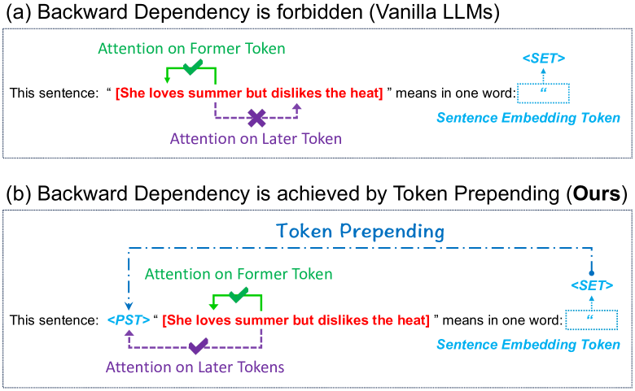
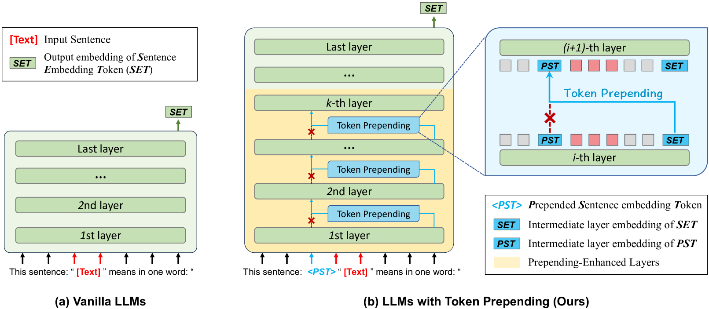
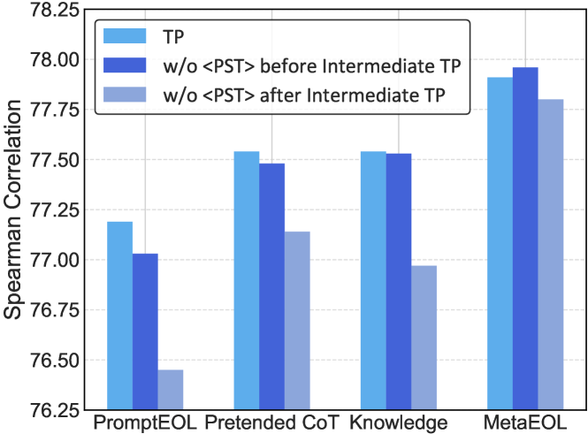
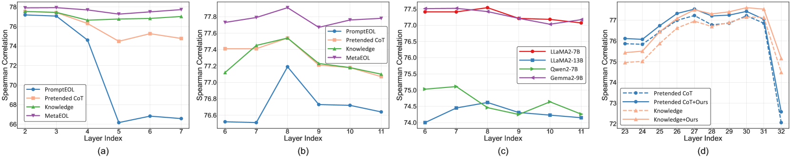
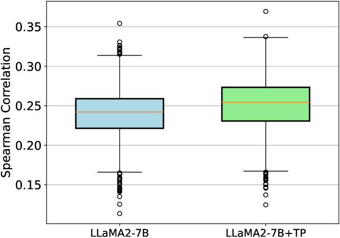

> 原文: [arXiv:2412.11556](https://arxiv.org/abs/2412.11556)（ACL 2025 Long；[Anthology](https://aclanthology.org/2025.acl-long.159/)）
> 说明: 本文为论文全文中文翻译，公式编号与原文一致；图表保留标题/说明中译，数值表数字原样。

**代码：** https://github.com/fuyuchenIfyw/token_prepending.git

# Token Prepending：一种无需训练、从 LLM 中抽取更好句向量的方法（Token Prepending: A Training-Free Approach for Eliciting Better Sentence Embeddings from LLMs）

**作者：** Yuchen Fu\*、Zifeng Cheng\*、Zhiwei Jiang†、Zhonghui Wang、Yafeng Yin、Zhengliang Li、Qing Gu

**单位：** 南京大学 新型软件技术国家重点实验室，中国

**邮箱：** {yuchenfu, chengzf}@smail.nju.edu.cn, jzw@nju.edu.cn, zhonghuiwang@smail.nju.edu.cn, yafeng@smail.nju.edu.cn, lzl@smail.nju.edu.cn, guq@smail.nju.edu.cn

\* Yuchen 与 Zifeng 贡献相同。

---

## 摘要（Abstract）

从大型语言模型（Large Language Model, LLM）中提取句向量（sentence embedding）是一条有前景的方向，因为 LLM 已展现出更强的语义理解能力。以往研究通常聚焦于提示工程（prompt engineering），通过提示模型将句子信息编码到最后一个 token 的嵌入中，从而从 LLM 中诱导出句向量。然而，LLM 多为仅解码器（decoder-only）架构，采用因果注意力（causal attention），句子中较早的 token 无法 attend 到较晚的 token，导致句子信息编码存在偏置，并对最终解码 token 产生级联影响。为此，我们提出一种新颖的 **Token Prepending（TP，token 前置）** 技术：将每一层解码得到的句向量前置到下一层输入句子的开头，使较早 token 在因果注意力机制下能够 attend 到完整句子信息。所提 TP 技术即插即用且无需训练，可与多种基于 prompt 的句向量方法及自回归 LLM 无缝集成。在多种语义文本相似度（Semantic Textual Similarity, STS）任务与下游分类任务上的大量实验表明，TP 能显著提升现有 prompt 句向量方法在不同 LLM 上的性能，而额外推理开销可忽略不计。




**图 1：** （a）普通 LLM 与（b）我们提出的带 token 前置的 LLM 之对比。（a）中禁止反向依赖（backward dependency）：较早 token 无法 attend 到较晚 token；`<SET>` 为句向量 token（Sentence Embedding Token, SET）。（b）通过 Token Prepending 实现反向依赖：在 prompt 中于 `[Text]` 前插入 `<PST>`（Prepending Sentence embedding Token，前置句向量占位 token），各层将上一层的 SET 嵌入替换 `<PST>`，使较早 token 可感知完整句子语义。

---

## 1 引言（Introduction）

句向量在信息检索、推荐系统、情感分析、文档聚类等真实场景中应用广泛。随着 LLM 在各类自然语言处理（Natural Language Processing, NLP）零样本任务上取得成功，部分研究者开始关注**直接**从 LLM 抽取句向量、而无需额外微调（Liu et al., 2024a; Lei et al., 2024）。这种无需训练的设定既实用又有前景：不需要训练数据、避免微调大规模模型的成本，并防止在特定数据上微调导致通用语义理解能力损失。

与 BERT（Devlin et al., 2019）等 encoder-only 双向语言模型不同，当前 LLM 多为带因果注意力的仅解码器模型（Touvron et al., 2023; Brown, 2020），句子中较早 token 无法 attend 到较晚 token，如图 1(a) 所示。为此，近期工作（Jiang et al., 2023; Lei et al., 2024; Zhang et al., 2024）尝试提示模型将句子信息编码到最后一个 token（即图 1(a) 中的 `<SET>`）的嵌入中；该 token 可 attend 到所有前序 token，从而规避反向依赖问题。在基于 prompt 的方法中，Jiang et al. (2023) 首先提出用简单有效的 prompt（如图 1(a)）从 LLM 抽取句向量；随后 meta-task prompt（Lei et al., 2024）以及带思维链（Chain-of-Thought, CoT）与知识增强（Knowledge Enhancement）的 prompt（Zhang et al., 2024）被用于句向量抽取。

然而，即便最后一个 token 在因果注意力下可 attend 到句中所有 token，句子中较早 token 仍无法 attend 到较晚 token（即图 1 中的反向依赖）。这导致句子信息编码偏置，并对最后一个 token 产生级联效应。为缓解该问题，Springer et al. (2024) 等工作尝试通过**重复输入**实现反向依赖：将输入处理两次可使 LLM 对句子理解更深，并在多种任务上提升性能。但重复会显著增加序列长度并大幅改变句子结构，带来更高推理成本且效果仍不理想。

本文提出一种简单有效的 **Token Prepending（TP）** 技术。如图 1(b)，核心思想是将每一层解码得到的句向量前置到下一层输入句子的开头，使较早 token 在因果注意力下能 attend 到完整句子信息。TP 完全无需训练，不引入任何可学习参数。具体而言，虽然 TP 可应用于所有层，但我们发现不必在所有层执行；**仅在模型前几层**执行 TP 效果更好。因此，在若干早期层之后停止 TP，恢复标准前向传播。此外，考虑到 LLM 最后一层主要用于 token 生成、语义信息较弱（Liu et al., 2024b; Jin et al., 2024b），我们提出 **early-exit（早退）** 策略：从中间层而非最后一层输出嵌入作为句向量。

**主要贡献：**

- 提出用于从 LLM 诱导句向量的 novel TP 技术。该即插即用方法既不引入新参数也不改变现有参数，可与多种 prompt 句向量方法及自回归 LLM 无缝集成；且仅在原句前增加单个 token，额外推理开销极小。
- 深入探索 TP 的有效用法，包括最优操作层范围与 early-exit 策略。
- 在多种 STS 基准与下游分类任务上开展大量实验，表明 TP 能显著提升现有 prompt 句向量方法在不同 LLM 上的性能。

---

## 2 相关工作（Related Work）

### 句向量（Sentence Embeddings）

句向量是 NLP 基础任务，旨在将句子语义映射为固定维向量。以往研究常用无监督或监督对比学习微调较小预训练模型以增强句向量（Gao et al., 2021; Jiang et al., 2022; Ni et al., 2022b; Chanchani and Huang, 2023; Su et al., 2023）。例如 Sentence-T5（Ni et al., 2022b）探索三种从 T5（Raffel et al., 2020）抽取句表示的策略，并用两阶段训练 refine T5 句向量。与这些方法不同，我们关注**无需微调**、从 LLM 抽取的句向量。

### 用于句向量的 LLM

近期一系列工作通过微调增强带因果注意力的 LLM 句向量（Li and Li, 2024; BehnamGhader et al., 2024; Lee et al., 2024; Muennighoff et al., 2024）。由于 LLM 单向注意力的表示学习能力有限，这些方法多将其替换为双向注意力并用对比学习微调 LLM。例如 BeLLM（Li and Li, 2024）将最后一层注意力由单向改为双向，并用 SimCSE（Gao et al., 2021）微调 LLM。但微调 LLM 成本很高，且不可避免地损失其他通用能力。因此本文聚焦**无需微调**从 LLM 抽取句向量。

### 从 LLM 抽取句向量

现有方法主要设计 prompt 以改进句向量。PromptEOL（Jiang et al., 2023）展示了 LLM 通过 prompt 工程生成句向量的潜力。Echo embeddings（Springer et al., 2024）在上下文中将输入重复两次，从第二次出现处抽取嵌入，使较早 token 嵌入能编码后续 token 信息。MetaEOL（Lei et al., 2024）通过 ChatGPT-4 设计 meta-task prompt，引导 LLM 从多视角考虑句表示。Pretended CoT（Zhang et al., 2024）用 CoT 激发模型输出更好嵌入。Knowledge Enhancement（Zhang et al., 2024）通过 prompt 传递文本摘要方面的人类经验，为模型提供显式指导。CP（Cheng et al., 2025）引入额外辅助 prompt 以诱导更好句向量。本文提出即插即用技术 TP，以可忽略额外推理成本改进多种 prompt 方法。

---

## 3 预备知识（Preliminary）

以往工作主要通过 prompt 工程从 LLM 诱导句向量，不干预 LLM 内部运算，仅通过不同 prompt 引导行为。如图 2(a)，PromptEOL（Jiang et al., 2023）引入广泛采用的句向量抽取模板：

```
This sentence: "[Text]" means in one word: "
```

其中 `[Text]` 为输入句子占位符，最后一个 token `"` 用于解码 **Sentence Embedding Token（SET，句向量 token）**。短语 “in one word” 为约束，防止 LLM 生成长句，使一句由单个词的嵌入表示。

形式化地，给定包裹在模板中的输入 $T = [t_1, \ldots, t_n]$，先经嵌入层得到 $h^0 = [h^0_1, \cdots, h^0_n]$，再输入 LLM 的 $L$ 个 Transformer 层。先前工作（如 PromptEOL）使用最后一层 SET 对应隐状态 $h^L_n$ 作为输出句向量。具体地，

$$
h^L = \mathrm{LLM}_{1:L}(h^0)
$$




**图 2：** 从（a）普通 LLM 与（b）带 Token Prepending 的 LLM 抽取句向量的示意。（a）标准 prompt 模板；（b）在 `[Text]` 前插入 `<PST>`，在前若干层（黄色标注的 Prepending-Enhanced Layers）执行 TP：中间层用上一层的 SET 嵌入替换 `<PST>`；SET 为 prompt 最后 token 的中间层嵌入，PST 为 `<PST>` 的中间层嵌入。

---

## 4 所提方法（Proposed Method）

### 4.1 概览（Overview）

与仅关注 prompt 工程的先前工作不同，所提方法轻微干预 LLM 内部运算。核心思想是将**上一层解码得到的句向量 token** 前置到**下一层输入句子**的开头，使目标句中所有 token 可感知句子语义。如图 2(b)，在前若干层（黄色标注）内执行 **token prepending（TP）** 操作。对输入层，在 prompt 的输入句子（即 `[Text]`）前前置特殊 token `<PST>`。对中间层，通过在两层之间执行 TP，用 prompt 最后一个 token 解码得到的句向量嵌入**替换** `<PST>` 的嵌入。在若干层重复该操作后，`<PST>` 的嵌入可能已含足够句子信息，或目标句所有 token 已感知足够句子信息；此后停止 TP。最后，因 LLM 最后一层主要用于 token 生成，我们从**中间层**选取句向量作为输出。

### 4.2 Token Prepending（TP）

所提 TP 是一种即插即用操作，主要通过干预 LLM 各层输入来调整上下文依赖。从操作层视角，可从以下三方面详述。

#### 4.2.1 初始 Token Prepending（Initial Token Prepending）

首先进行**初始 token prepending**：将句向量 token 前置到输入文本，如图 2(b)。此阶段尚无可用句向量 token，故前置自定义 token `"<PST>"`（不在 LLM 词表中），作为句向量 token 占位符。随机初始化该 token 参数并并入第一层 Transformer 的输入。修改后的嵌入层输出记为 $h^0 = [h^0_1, \cdots, h^0_{i-1}, h^0_{i^*}, h^0_i, \cdots, h^0_n]$，其中 $h^0_{i^*}$ 为 `<PST>` 的初始化嵌入。

#### 4.2.2 中间 Token Prepending（Intermediate Token Prepending）

初始 TP 后，输入经 **prepending-enhanced layers（前置增强层）** 处理；每层由标准 Transformer 层与专门设计的中间 token prepending 组成。对中间 TP，用句向量 token `<SET>` **替换** `<PST>` 作为下一层输入。前置 `<SET>` 旨在 refine 句向量，使后续 token 更好捕获句子语义。形式化如下：

$$
h^l = \mathrm{LLM}_{l-1}(f(h^{l-1})), \quad l \in [2, k]
$$

$$
\hat{h}^{l-1} = [h^{l-1}_1, \cdots, h^{l-1}_{i^*}, \cdots, h^{l-1}_n], \quad l \in [2, k]
$$

$$
f(h^{l-1}) = [h^{l-1}_1, \cdots, h^{l-1}_n, \cdots, h^{l-1}_n], \quad l \in [2, k]
$$

其中 $f(h)$ 为对 $h$ 的操作函数。$k \in [2, L]$ 为中间 token prepending 的**结束层**；$i^*$ 为 `<PST>` token 的位置索引。

#### 4.2.3 Token Prepending 的层范围（Layer Scope for Token Prepending）

经前置增强层后，句中所有 token 已 contextualize，可感知句子完整语义。因此在后续层不再使用中间 TP，直接将隐状态输入 LLM 标准 Transformer 层以得到句向量。具体地，

$$
h^{l+1} = \mathrm{LLM}_l(h^l), \quad l \in [k, M]
$$

其中 $M$ 为 **exit layer（退出层）**，可为 LLM 的中间层或最后一层。

### 4.3 自中间层 Early-Exit（Early-Exit from Intermediate Layers）

近期研究（Liu et al., 2024c; Jin et al., 2024a）表明 LLM 各层角色不同，最后一层嵌入主要用于预测、语义信息较弱。因此我们提出 **early-exit 策略**：用中间层而非最后一层嵌入作为句向量。用验证集确定使用哪一层嵌入，该过程开销很轻。early-exit 的另一优势是在测试阶段可更快得到句向量。

---

## 5 实验（Experiments）

### 5.1 数据集与实验设置（Datasets and Experimental Settings）

在七个 **semantic textual similarity（STS，语义文本相似度）** 数据集上评估句向量：STS 2012–2016（Agirre et al., 2012, 2013, 2014, 2015, 2016）、STS-B（Cer et al., 2017）与 SICK-R（Marelli et al., 2014）。STS 中每对句子标注 0–5 的 pairwise 语义相似度分数。评估指标为 **Spearman correlation（Spearman 相关系数）**，衡量预测相似度分数与标注分数在单调函数下的秩相关。预测相似度用余弦相似度计算。

除非另有说明，用 STS-B 开发集为所有 prompt 与 backbone 配置确定 TP 超参数。所有 prompt 中，占位 token `<PST>` 置于模板中 `"[Text]"` 之前。PromptEOL、MetaEOL 与 Pretended CoT 使用第 27 层输出；Knowledge Enhancement 使用倒数第二层。第 8 层之后不再执行 token prepending。

### 5.2 基线（Baselines）

将所提方法与若干基线结合以验证有效性：

- **BERT avg**（Devlin et al., 2019）、**ST5-Enc avg**（Ni et al., 2022a）、**LLaMA2 avg**（Touvron et al., 2023）：对不同 backbone 平均 token 嵌入得到句向量。
- **LLaMA2 echo**（Springer et al., 2024）：重复策略获取句向量。
- **BERT prompt**（Jiang et al., 2022）：简单有效 prompt 从 BERT 抽取句向量。
- **PromptEOL**（Jiang et al., 2023）：简单有效 prompt 从 LLM 抽取句向量。
- **MetaEOL**（Lei et al., 2024）：多样 meta-task prompt 从多视角捕获句表示。
- **Pretended CoT**（Zhang et al., 2024）：CoT 激发模型抽取句向量。
- **Knowledge**（Zhang et al., 2024）：显式注入文本摘要方面的人类洞察。

### 5.3 主要结果（Main Results）

**表 1：** 以 LLaMA2-7B 为 backbone 在 STS 任务上的结果（Spearman 相关系数 ×100）。Time 列为各 prompt 方法相对 PromptEOL 在 STS-B 测试集上的推理时间比（相同输出层）。

| 方法 | Params | STS12 | STS13 | STS14 | STS15 | STS16 | STS-B | SICK-R | Avg. | Time |
|------|--------|-------|-------|-------|-------|-------|-------|--------|------|------|
| BERT avg | 110M | 30.87 | 59.89 | 47.73 | 60.29 | 63.73 | 47.29 | 58.22 | 52.57 | - |
| BERT prompt | 110M | 60.96 | 73.83 | 62.18 | 71.54 | 68.68 | 70.60 | 67.16 | 67.85 | - |
| ST5-Enc avg | 4.8B | 34.97 | 60.19 | 47.59 | 66.40 | 70.62 | 62.83 | 63.57 | 58.02 | - |
| LLaMA2 avg | 7B | 35.49 | 53.15 | 40.12 | 55.35 | 53.26 | 42.10 | 49.96 | 47.06 | 1.00× |
| LLaMA2 echo | 7B | 52.40 | 72.40 | 61.24 | 72.67 | 73.51 | 65.73 | 64.39 | 66.05 | 1.67× |
| PromptEOL | 7B | 58.81 | 77.01 | 66.34 | 73.22 | 73.56 | 71.66 | 69.64 | 70.03 | 1.00× |
| PromptEOL + TP (Ours) | 7B | 66.90 ↑8.09 | 83.12 ↑6.11 | 74.31 ↑7.97 | 79.87 ↑6.65 | 80.03 ↑6.47 | 80.67 ↑9.01 | 75.40 ↑5.76 | 77.19 ↑7.16 | 1.04× |
| MetaEOL | 7B | 64.16 | 81.61 | 73.09 | 81.11 | 78.94 | 77.96 | 74.86 | 75.96 | 8.17× |
| MetaEOL + TP (Ours) | 7B | 66.15 ↑1.99 | 82.37 ↑0.76 | 74.89 ↑1.80 | 83.77 ↑2.66 | 81.49 ↑2.55 | 81.46 ↑3.50 | 75.27 ↑0.41 | 77.91 ↑1.95 | 8.29× |
| Pretended CoT | 7B | 67.45 | 83.89 | 74.14 | 79.47 | 80.76 | 78.95 | 73.33 | 76.86 | 1.18× |
| Pretended CoT + TP (Ours) | 7B | 68.52 ↑1.07 | 83.44 ↓0.45 | 75.23 ↑1.09 | 79.36 ↓0.11 | 81.33 ↑0.57 | 80.37 ↑1.42 | 74.51 ↑1.18 | 77.54 ↑0.68 | 1.20× |
| Knowledge | 7B | 65.60 | 82.82 | 74.48 | 80.75 | 80.13 | 80.34 | 75.89 | 77.14 | 1.17× |
| Knowledge + TP (Ours) | 7B | 66.03 ↑0.43 | 83.43 ↑0.61 | 74.50 ↑0.02 | 80.94 ↑0.19 | 81.28 ↑1.15 | 80.45 ↑0.11 | 76.13 ↑0.24 | 77.54 ↑0.40 | 1.20× |

STS 任务结果见表 1。所提方法 consistently 优于所有基线；非 prompt 方法表现弱于 prompt 方法。在 LLaMA2-7B 上全部 prompt 方法与全部数据集的 28 个对比中，我们的方法在 **26/28** 个 case 有提升，表明可与多种 prompt 方法无缝集成且无需训练。与 PromptEOL 结合时提升最显著（+7.16），可能因为另外三个基线已融入先验知识理解句子，而 PromptEOL 更依赖建模反向依赖以把握语义。此外，TP 有效缩小不同 prompt 间的性能差距，提升模型对 prompt 的鲁棒性。

TP 的另一优势是相对 prompt 方法引入的额外推理时间极小。在 STS-B 测试集上以 batch size 1 运行 LLaMA2-7B，并用 KV cache 减轻重复加载 prompt 前缀的影响。Pretended CoT、Knowledge Enhancement 与 MetaEOL 的推理时间分别为 PromptEOL 的 1.18、1.17 与 8.17 倍；而带 TP 的 prompt 方法推理时间在原始的 **1.04 倍**以内，开销可忽略。

### 5.4 不同 Backbone 评估（Evaluation of Different Backbones）

**表 2：** 不同 backbone 在 STS 任务上的结果（Spearman ×100）。因 MetaEOL 使用多 prompt，实验采用简单有效的 Pretended CoT。

| 方法 | Backbone | STS12 | STS13 | STS14 | STS15 | STS16 | STS-B | SICK-R | Avg. |
|------|----------|-------|-------|-------|-------|-------|-------|--------|------|
| Pretended CoT | LLaMA2-7B | 67.45 | 83.89 | 74.14 | 79.47 | 80.76 | 78.95 | 73.33 | 76.86 |
| Pretended CoT + TP (Ours) | LLaMA2-7B | 68.52 ↑1.07 | 83.44 ↓0.45 | 75.23 ↑1.09 | 79.36 ↓0.11 | 81.33 ↑0.57 | 80.37 ↑1.42 | 74.51 ↑1.18 | 77.54 ↑0.68 |
| Pretended CoT | LLaMA2-13B | 64.27 | 78.61 | 69.93 | 76.37 | 79.28 | 75.88 | 69.04 | 73.34 |
| Pretended CoT + TP (Ours) | LLaMA2-13B | 65.65 ↑1.38 | 79.50 ↑0.89 | 71.01 ↑1.08 | 77.27 ↑0.90 | 80.07 ↑0.79 | 77.36 ↑1.48 | 71.51 ↑2.47 | 74.62 ↑1.28 |
| Pretended CoT | LLaMA3-8B | 66.65 | 82.60 | 72.40 | 79.36 | 80.86 | 77.09 | 73.66 | 76.09 |
| Pretended CoT + TP (Ours) | LLaMA3-8B | 66.94 ↑0.29 | 83.20 ↑0.60 | 73.33 ↑0.93 | 79.81 ↑0.45 | 81.72 ↑0.86 | 78.46 ↑1.37 | 73.99 ↑0.33 | 76.78 ↑0.69 |
| Pretended CoT | Qwen2-7B | 61.64 | 78.24 | 70.14 | 74.44 | 76.63 | 76.22 | 73.30 | 72.94 |
| Pretended CoT + TP (Ours) | Qwen2-7B | 65.02 ↑3.38 | 79.50 ↑1.26 | 71.64 ↑1.50 | 77.94 ↑3.5 | 79.15 ↑2.52 | 78.47 ↑2.25 | 74.05 ↑0.75 | 75.11 ↑2.17 |
| Pretended CoT | Gemma2-9B | 69.50 | 82.71 | 74.18 | 79.64 | 80.60 | 78.89 | 73.60 | 77.02 |
| Pretended CoT + TP (Ours) | Gemma2-9B | 69.48 ↓0.02 | 83.39 ↑0.68 | 74.32 ↑0.14 | 80.71 ↑1.07 | 81.24 ↑0.64 | 79.24 ↑0.35 | 74.26 ↑0.66 | 77.52 ↑0.50 |

除 LLaMA2 的 7B 与 13B 版本外，还在 Qwen2-7B（Yang et al., 2024）、LLaMA3-8B（Dubey et al., 2024）、Gemma2-9B（Team et al., 2024）等 SOTA 仅解码器 LLM 上评估，prompt 模板为 Pretended CoT。结果表明方法可适配多种 LLM，在不同 backbone 上均有增益；Qwen2-7B 上平均提升 2.17 分。LLaMA2-13B 与 LLaMA3-8B 未超过 LLaMA2-7B。

### 5.5 `<PST>` Token 分析（Analysis of `<PST>` Token）

本节用 LLaMA2-7B 详细分析前置 `<PST>` token。

#### `<PST>` 位置的影响

以 PromptEOL 与 Pretended CoT 为模板，考察 `<PST>` 在句中不同位置对 STS 的影响（表 3）。

**表 3：** `<PST>` token 在句中位置的影响（PromptEOL 与 Pretended CoT）。

| Prompt 模板 | STS Avg. |
|-------------|----------|
| This sentence : \<PST> "[Text]" means in one word: " | 77.19 |
| \<PST> This sentence : "[Text]" means in one word: " | 76.35 |
| This sentence : "\<PST> [Text]" means in one word: " | 76.71 |
| This sentence : " [Text]" \<PST> means in one word: " | 75.54 |
| After thinking step by step , this sentence : \<PST> "[Text]" means in one word: " | 77.54 |
| After thinking step by step , \<PST> this sentence : "[Text]" means in one word: " | 77.81 |
| After thinking step by step , this sentence : "\<PST> [Text]" means in one word: " | 77.51 |
| After thinking step by step , this sentence : " [Text]" \<PST> means in one word: " | 77.44 |

`<PST>` 紧接输入文本之后插入时性能最差；置于文本之前时波动较小。最优位置随 prompt 而异，通常靠近文本。为避免搜索位置的额外开销，所有 prompt 统一将 `<PST>` 放在冒号之后。

#### 中间 TP 前后保留 `<PST>` 的有效性

对中间 TP 前后 ablate `<PST>` token。在中间 TP **之前** ablate 等价于去掉初始 TP、直接做中间 TP。




**图 3：** 中间 token prepending 前后 ablate `<PST>` token 的结果（七个 STS 任务平均 Spearman）。

中间 TP 之前去掉 `<PST>` 在多数 prompt 上略降性能：初始 `<PST>` 不含语义，主要作用是保持各层输入序列长度一致。中间 TP **之后** ablate 负面影响更明显，可能因为表示已与该输入模式对齐，修改输入导致性能下降。

#### `<PST>` 初始化方式的影响

用 Pretended CoT 考察嵌入层 `<PST>` 参数五种初始化：全 0、全 1、$[0,1]$ 均匀分布、高斯分布、使用已有 token 参数（选用空格字符嵌入，使模型将 `<PST>` 解释为空格以最小化对整句语义的影响）。

**表 4：** `<PST>` token 初始化方式的影响。

| 初始化方法 | STS Avg. |
|------------|----------|
| All 0 | 77.54 |
| All 1 | 77.54 |
| Uniform | 77.53 |
| Gaussian | 77.54 |
| Existing token | 77.55 |

不同初始化间差异极小（最大 0.01），表明方法对 `<PST>` 初始化鲁棒。

### 5.6 TP 层范围分析（Analysis of Layer Scope for TP）

#### 中间 TP 起始层与结束层的影响

在 LLaMA2-7B 上探索中间 TP 起始层与结束层 $k$ 的影响（图 4(a)(b)）。




**图 4：** 中间 token prepending 层范围与 early-exit 层的影响（七个 STS 任务平均 Spearman）。（a）中间 TP 起始层；（b）结束层 $k$；（c）不同 backbone 上 TP 结束层 $k$；（d）句向量 exit 层 $M$ 的影响。

若中间 TP 不从第二层开始，性能次优：`<PST>` 随机初始化、缺乏语义，需在 LLM 早期层用有语义 token 替换以缓解。在第 **8 层**之后停止 TP 在所有所用 prompt 上效果最好。

#### 不同 backbone 上中间 TP 结束层

图 4(c)：LLaMA2-7B 与 LLaMA2-13B 在第 8 层停止 TP 最优；Qwen2-7B 与 Gemma2-9B 最优为第 7 层。对多数仅解码器 LLM，建模浅层反向依赖对增强句子理解至关重要；最优停止层在不同 backbone 间相近，通常在第 7–8 层。

### 5.7 Exit 层的影响（Influence of Exit Layers）

在 LLaMA2-7B 上用 Pretended CoT 与 Knowledge Enhancement 考察 exit 层（图 4(d)）。所提方法在所有层与配置下 consistently 改进 Pretended CoT 与 Knowledge Enhancement；后两者在不同层上波动更大，表明我们的方法跨层表示质量更稳定。

使用模型**最后一层**输出对 STS 任务 consistently 次优，与先前研究一致（Li and Li, 2024; Lei et al., 2024）。Pretended CoT 在倒数第六层最优，Knowledge Enhancement 在倒数第二层峰值，说明最优层随 prompt 变化。

### 5.8 迁移学习任务（Transfer Learning Tasks）

在 SentEval 标准迁移任务上进一步评估：MR（Pang and Lee, 2005）、CR（Hu and Liu, 2004）、SUBJ（Pang and Lee, 2004）、MPQA（Wiebe et al., 2005）、SST-2（Socher et al., 2013）、TREC（Voorhees and Tice, 2000）、MRPC（Dolan and Brockett, 2005）。每任务用模型生成的句向量训练 logistic regression 分类器。

**表 5：** 以 LLaMA2-7B 在迁移学习任务上的结果（准确率 ×100）。

| 方法 | MR | CR | SUBJ | MPQA | SST2 | TREC | MRPC | Avg. |
|------|-----|-----|------|------|------|------|------|------|
| PromptEOL | 90.63 | 92.87 | 96.32 | 91.19 | 95.00 | 95.40 | 75.19 | 90.94 |
| PromptEOL + TP (Ours) | 90.90 ↑0.27 | 93.35 ↑0.48 | 96.58 ↑0.26 | 91.51 ↑0.32 | 95.50 ↑0.50 | 96.00 ↑0.60 | 76.12 ↑0.93 | 91.42 ↑0.48 |
| Pretended CoT | 90.10 | 92.24 | 96.32 | 91.54 | 95.11 | 94.20 | 75.77 | 90.75 |
| Pretended CoT + TP (Ours) | 90.45 ↑0.35 | 92.61 ↑0.37 | 96.52 ↑0.20 | 91.59 ↑0.05 | 95.77 ↑0.66 | 96.00 ↑1.80 | 76.81 ↑1.04 | 91.39 ↑0.64 |
| Knowledge | 89.84 | 93.03 | 96.21 | 91.54 | 94.78 | 97.20 | 73.91 | 90.93 |
| Knowledge + TP (Ours) | 90.39 ↑0.55 | 93.32 ↑0.29 | 96.31 ↑0.10 | 91.56 ↑0.02 | 94.51 ↓0.27 | 97.60 ↑0.40 | 76.06 ↑2.15 | 91.39 ↑0.46 |

迁移任务结果（表 5）显示方法 consistently 优于基线，全部数据集 21 个 case 中 **20/21** 提升，表明 TP 培养可泛化的句向量。Pretended CoT 与 Knowledge Enhancement 未超过 PromptEOL，说明它们并非在所有任务上 consistently 有效。此外，在更深层（通常层索引 14–21）停止 token prepending 可提升迁移任务性能，与 STS 最优层显著不同，暗示迁移任务需更多层以有效建模反向依赖。

### 5.9 上下文依赖捕获能力评估（Evaluation of Capturing Dependencies in Contexts）

在 STS-B 测试集上定量分析所提方法是否增强 LLM 捕获上下文依赖的能力（LLaMA2-7B）。遵循 Ethayarajh (2019)，选最后一个 token 为 **pivot token（枢轴 token）**，计算 pivot 与句中其余 token 的 Spearman 相关以评估依赖捕获能力（图 5 箱线图）。




**图 5：** 使用 Pretended CoT prompt 时，LLaMA2-7B 与 LLaMA2-7B+TP 在 STS-B 测试集上句子级 Spearman 相关的箱线图。

LLaMA2-7B 与 LLaMA2-7B+TP 的平均句子级 Spearman 分别为 23.97 与 25.11，表明 TP 相对普通 LLaMA2-7B 更好地捕获反向依赖，有助于增强 LLM 在上下文中建模依赖的能力。

---

## 6 结论（Conclusion）

本文介绍 **Token Prepending（TP）** 技术：一种即插即用、无需训练与数据、从自回归 LLM 得到高质量句向量的方法。通过干预 Transformer 层输入，TP 增强自回归 LLM 捕获反向依赖的能力；且仅在句前前置单个 token，额外推理成本可忽略，可与 prompt 方法无缝集成。大量实验表明 TP 可有效且通用地在多种架构与参数规模的 LLM 上诱导句向量，在 STS 与迁移学习任务上表现优异。我们发现从第一层开始 TP 效果最优，对约 7B 参数的 LLM，最佳停止点通常在第 7 或第 8 层。

---

## 局限性（Limitations）

尽管 Token Prepending 无需训练，仍需调节两个超参数（中间 token prepending 的**结束层**与 **exit 层**）以获得最优句向量。结果表明 TP 的最优超参数随模型、数据集与 prompt 变化，应用于新场景时可能增加适配成本。

---

## 致谢（Acknowledgments）

感谢匿名审稿人的 insightful 意见。本工作受国家自然科学基金（62441225、61972192、62172208、61906085）资助；部分受新型软件技术与产业化协同创新中心支持；受中央高校基本科研业务费（14380001）资助。

---

## 参考文献（References）

Eneko Agirre, Carmen Banea, Claire Cardie, Daniel M. Cer, Mona T. Diab, Aitor Gonzalez-Agirre, Weiwei Guo, Iñigo Lopez-Gazpio, Montse Maritxalar, Rada Mihalcea, German Rigau, Larraitz Uria, and Janyce Wiebe. 2015. Semeval-2015 task 2: Semantic textual similarity, english, spanish and pilot on interpretability. In *Proceedings of the 9th International Workshop on Semantic Evaluation, SemEval@NAACL-HLT 2015*, pages 252–263. The Association for Computer Linguistics.

Eneko Agirre, Carmen Banea, Claire Cardie, Daniel M. Cer, Mona T. Diab, Aitor Gonzalez-Agirre, Weiwei Guo, Rada Mihalcea, German Rigau, and Janyce Wiebe. 2014. Semeval-2014 task 10: Multilingual semantic textual similarity. In *Proceedings of the 8th International Workshop on Semantic Evaluation, SemEval@COLING 2014*, pages 81–91. The Association for Computer Linguistics.

Eneko Agirre, Carmen Banea, Daniel M. Cer, Mona T. Diab, Aitor Gonzalez-Agirre, Rada Mihalcea, German Rigau, and Janyce Wiebe. 2016. Semeval-2016 task 1: Semantic textual similarity, monolingual and cross-lingual evaluation. In *Proceedings of the 10th International Workshop on Semantic Evaluation, SemEval@NAACL-HLT 2016*, pages 497–511. The Association for Computer Linguistics.

Eneko Agirre, Daniel M. Cer, Mona T. Diab, Aitor Gonzalez-Agirre, and Weiwei Guo. 2013. \*sem 2013 shared task: Semantic textual similarity. In *Proceedings of the Second Joint Conference on Lexical and Computational Semantics, \*SEM 2013*, pages 32–43. Association for Computational Linguistics.

Eneko Agirre, Daniel M. Cer, Mona T. Diab, and Aitor Gonzalez-Agirre. 2012. Semeval-2012 task 6: A pilot on semantic textual similarity. In *Proceedings of the 6th International Workshop on Semantic Evaluation, SemEval@NAACL-HLT 2012*, pages 385–393. The Association for Computer Linguistics.

Parishad BehnamGhader, Vaibhav Adlakha, Marius Mosbach, Dzmitry Bahdanau, Nicolas Chapados, and Siva Reddy. 2024. Llm2vec: Large language models are secretly powerful text encoders. *arXiv preprint arXiv:2404.05961*.

Tom B Brown. 2020. Language models are few-shot learners. *arXiv preprint ArXiv:2005.14165*.

Daniel M. Cer, Mona T. Diab, Eneko Agirre, Iñigo Lopez-Gazpio, and Lucia Specia. 2017. Semeval-2017 task 1: Semantic textual similarity - multilingual and cross-lingual focused evaluation. *CoRR*, abs/1708.00055.

Sachin Chanchani and Ruihong Huang. 2023. Composition-contrastive learning for sentence embeddings. In *Proceedings of the 61st Annual Meeting of the Association for Computational Linguistics (Volume 1: Long Papers)*, pages 15836–15848. Association for Computational Linguistics.

Zifeng Cheng, Zhonghui Wang, Yuchen Fu, Zhiwei Jiang, Yafeng Yin, Cong Wang, and Qing Gu. 2025. Contrastive prompting enhances sentence embeddings in llms through inference-time steering. *arXiv preprint arXiv:2505.12831*.

Jacob Devlin, Ming-Wei Chang, Kenton Lee, and Kristina Toutanova. 2019. BERT: pre-training of deep bidirectional transformers for language understanding. In *Proceedings of the 2019 Conference of the North American Chapter of the Association for Computational Linguistics: Human Language Technologies, NAACL-HLT 2019*, pages 4171–4186.

Bill Dolan and Chris Brockett. 2005. Automatically constructing a corpus of sentential paraphrases. In *Third international workshop on paraphrasing (IWP2005)*.

Abhimanyu Dubey, Abhinav Jauhri, Abhinav Pandey, Abhishek Kadian, Ahmad Al-Dahle, Aiesha Letman, Akhil Mathur, Alan Schelten, Amy Yang, Angela Fan, et al. 2024. The llama 3 herd of models. *arXiv preprint arXiv:2407.21783*.

Kawin Ethayarajh. 2019. How contextual are contextualized word representations? comparing the geometry of bert, elmo, and gpt-2 embeddings. In *Proceedings of the 2019 Conference on Empirical Methods in Natural Language Processing and the 9th International Joint Conference on Natural Language Processing (EMNLP-IJCNLP)*, pages 55–65.

Tianyu Gao, Xingcheng Yao, and Danqi Chen. 2021. Simcse: Simple contrastive learning of sentence embeddings. In *Proceedings of the 2021 Conference on Empirical Methods in Natural Language Processing*, pages 6894–6910.

Minqing Hu and Bing Liu. 2004. Mining and summarizing customer reviews. In *Proceedings of the tenth ACM SIGKDD international conference on Knowledge discovery and data mining*, pages 168–177.

Ting Jiang, Shaohan Huang, Zhongzhi Luan, Deqing Wang, and Fuzhen Zhuang. 2023. Scaling sentence embeddings with large language models. *arXiv preprint arXiv:2307.16645*.

Ting Jiang, Jian Jiao, Shaohan Huang, Zihan Zhang, Deqing Wang, Fuzhen Zhuang, Furu Wei, Haizhen Huang, Denvy Deng, and Qi Zhang. 2022. Prompt-bert: Improving BERT sentence embeddings with prompts. In *Proceedings of the 2022 Conference on Empirical Methods in Natural Language Processing, EMNLP 2022*, pages 8826–8837.

Mingyu Jin, Qinkai Yu, Jingyuan Huang, Qingcheng Zeng, Zhenting Wang, Wenyue Hua, Haiyan Zhao, Kai Mei, Yanda Meng, Kaize Ding, Fan Yang, Mengnan Du, and Yongfeng Zhang. 2024a. Exploring concept depth: How large language models acquire knowledge at different layers? *CoRR*, abs/2404.07066.

Mingyu Jin, Qinkai Yu, Jingyuan Huang, Qingcheng Zeng, Zhenting Wang, Wenyue Hua, Haiyan Zhao, Kai Mei, Yanda Meng, Kaize Ding, et al. 2024b. Exploring concept depth: How large language models acquire knowledge and concept at different layers? *arXiv preprint arXiv:2404.07066*.

Chankyu Lee, Rajarshi Roy, Mengyao Xu, Jonathan Raiman, Mohammad Shoeybi, Bryan Catanzaro, and Wei Ping. 2024. Nv-embed: Improved techniques for training llms as generalist embedding models. *CoRR*, abs/2405.17428.

Yibin Lei, Di Wu, Tianyi Zhou, Tao Shen, Yu Cao, Chongyang Tao, and Andrew Yates. 2024. Meta-task prompting elicits embedding from large language models. *arXiv preprint arXiv:2402.18458*.

Xianming Li and Jing Li. 2023. Angle-optimized text embeddings. *arXiv preprint arXiv:2309.12871*.

Xianming Li and Jing Li. 2024. Bellm: Backward dependency enhanced large language model for sentence embeddings. In *Proceedings of the 2024 Conference of the North American Chapter of the Association for Computational Linguistics: Human Language Technologies (Volume 1: Long Papers)*, pages 792–804.

Zhu Liu, Cunliang Kong, Ying Liu, and Maosong Sun. 2024a. Meaning representations from trajectories in autoregressive models. In *The Twelfth International Conference on Learning Representations*.

Zhu Liu, Cunliang Kong, Ying Liu, and Maosong Sun. 2024b. Fantastic semantics and where to find them: Investigating which layers of generative llms reflect lexical semantics. *arXiv preprint arXiv:2403.01509*.

Zhu Liu, Cunliang Kong, Ying Liu, and Maosong Sun. 2024c. Fantastic semantics and where to find them: Investigating which layers of generative llms reflect lexical semantics. *CoRR*, abs/2403.01509.

Marco Marelli, Stefano Menini, Marco Baroni, Luisa Bentivogli, Raffaella Bernardi, and Roberto Zamparelli. 2014. A SICK cure for the evaluation of compositional distributional semantic models. In *Proceedings of the Ninth International Conference on Language Resources and Evaluation, LREC 2014*, pages 216–223.

Niklas Muennighoff, Hongjin Su, Liang Wang, Nan Yang, Furu Wei, Tao Yu, Amanpreet Singh, and Douwe Kiela. 2024. Generative representational instruction tuning. *CoRR*, abs/2402.09906.

Niklas Muennighoff, Nouamane Tazi, Loïc Magne, and Nils Reimers. 2022. Mteb: Massive text embedding benchmark. *arXiv preprint arXiv:2210.07316*.

Jianmo Ni, Gustavo Hernandez Abrego, Noah Constant, Ji Ma, Keith Hall, Daniel Cer, and Yinfei Yang. 2022a. Sentence-t5: Scalable sentence encoders from pre-trained text-to-text models. In *Findings of the Association for Computational Linguistics: ACL 2022*, pages 1864–1874.

Jianmo Ni, Gustavo Hernández Ábrego, Noah Constant, Ji Ma, Keith B. Hall, Daniel Cer, and Yinfei Yang. 2022b. Sentence-t5: Scalable sentence encoders from pre-trained text-to-text models. In *Findings of the Association for Computational Linguistics: ACL 2022*, pages 1864–1874.

Bo Pang and Lillian Lee. 2004. A sentimental education: Sentiment analysis using subjectivity summarization based on minimum cuts. In *Proceedings of the 42nd Annual Meeting of the Association for Computational Linguistics (ACL-04)*, pages 271–278.

Bo Pang and Lillian Lee. 2005. Seeing stars: Exploiting class relationships for sentiment categorization with respect to rating scales. In *Proceedings of the 43rd Annual Meeting of the Association for Computational Linguistics (ACL'05)*, pages 115–124.

Colin Raffel, Noam Shazeer, Adam Roberts, Katherine Lee, Sharan Narang, Michael Matena, Yanqi Zhou, Wei Li, and Peter J. Liu. 2020. Exploring the limits of transfer learning with a unified text-to-text transformer. *J. Mach. Learn. Res.*, 21:140:1–140:67.

Richard Socher, Alex Perelygin, Jean Wu, Jason Chuang, Christopher D Manning, Andrew Y Ng, and Christopher Potts. 2013. Recursive deep models for semantic compositionality over a sentiment treebank. In *Proceedings of the 2013 conference on empirical methods in natural language processing*, pages 1631–1642.

Jacob Mitchell Springer, Suhas Kotha, Daniel Fried, Graham Neubig, and Aditi Raghunathan. 2024. Repetition improves language model embeddings. *arXiv preprint arXiv:2402.15449*.

Hongjin Su, Weijia Shi, Jungo Kasai, Yizhong Wang, Yushi Hu, Mari Ostendorf, Wen-tau Yih, Noah A. Smith, Luke Zettlemoyer, and Tao Yu. 2023. One embedder, any task: Instruction-finetuned text embeddings. In *Findings of the Association for Computational Linguistics: ACL 2023*, pages 1102–1121. Association for Computational Linguistics.

Gemma Team, Morgane Riviere, Shreya Pathak, Pier Giuseppe Sessa, Cassidy Hardin, Surya Bhupatiraju, Léonard Hussenot, Thomas Mesnard, Bobak Shahriari, Alexandre Ramé, et al. 2024. Gemma 2: Improving open language models at a practical size. *arXiv preprint arXiv:2408.00118*.

Hugo Touvron, Louis Martin, Kevin Stone, Peter Albert, Amjad Almahairi, Yasmine Babaei, Nikolay Bashlykov, Soumya Batra, Prajjwal Bhargava, Shruti Bhosale, et al. 2023. Llama 2: Open foundation and fine-tuned chat models. *arXiv preprint arXiv:2307.09288*.

Ellen M Voorhees and Dawn M Tice. 2000. Building a question answering test collection. In *Proceedings of the 23rd annual international ACM SIGIR conference on Research and development in information retrieval*, pages 200–207.

Janyce Wiebe, Theresa Wilson, and Claire Cardie. 2005. Annotating expressions of opinions and emotions in language. *Language resources and evaluation*, 39:165–210.

An Yang, Baosong Yang, Binyuan Hui, Bo Zheng, Bowen Yu, Chang Zhou, Chengpeng Li, Chengyuan Li, Dayiheng Liu, Fei Huang, et al. 2024. Qwen2 technical report. *arXiv preprint arXiv:2407.10671*.

Bowen Zhang, Kehua Chang, and Chunping Li. 2024. Simple techniques for enhancing sentence embeddings in generative language models. *arXiv preprint arXiv:2404.03921*.

---

## 附录 A（Appendix A）

### A.1 与双向注意力的对比（Comparison with Bidirectional Attention）

我们探索移除因果注意力 mask 的性能。设计两类双向注意力 mask：（1）对最后一个 token 启用双向注意力；（2）对输入句子启用双向注意力。为公平起见，非因果注意力的起始位置与前置 `<PST>` token 的位置对齐。

以 Pretended CoT 为 prompt，结果见表 6。两类双向注意力 mask 均导致性能大幅下降，与先前研究（BehnamGhader et al., 2024; Li and Li, 2024）一致：由于自回归 LLM 的归纳偏置，采用双向注意力机制往往会降低模型性能。

**表 6：** 修改注意力 mask 的影响。

| 初始化方法 | STS Avg. |
|------------|----------|
| Vanilla LLM | 76.86 |
| TP (Ours) | 77.54 |
| Bidirectional Attention (Last token) | 53.06 |
| Bidirectional Attention (Input Sentence) | 43.70 |

### A.2 多任务评估（Multi-Task Evaluation）

在 12 个分类数据集、3 个 pair 分类数据集、4 个 reranking 数据集、11 个聚类数据集、1 个摘要数据集与 1 个额外 STS 数据集上评估 TP 技术。所用数据集均来自 **MTEB benchmark**（Muennighoff et al., 2022）。

**12 个分类数据集：** AmazonCounterfactual、AmazonPolarity、AmazonReviews、Banking77、Emotion、Imdb、MassiveIntent、MassiveScenario、MTOPDomain、MTOPIntent、ToxicConversations、TweetSentimentExtraction。

**3 个 pair 分类数据集：** SprintDuplicateQuestions、TwitterSemEval2015、TwitterURLCorpus。

**4 个 reranking 数据集：** AskUbuntuDupQuestions、MindSmallRerank、SciDocsRR、StackOverflowDupQuestions。

**11 个聚类数据集：** ArxivClusteringP2P、ArxivClusteringS2S、BiorxivClusteringP2P、BiorxivClusteringS2S、MedrxivClusteringP2P、MedrxivClusteringS2S、RedditClustering、RedditClusteringP2P、StackExchangeClustering、StackExchangeClusteringP2P、TwentyNewsgroupsClustering。

**摘要数据集：** SummEval。**额外 STS 数据集：** BIOSSES。

**表 7：** 分类数据集结果（准确率 ×100，LLaMA2-7B）。

| 方法 | PromptEOL | PromptEOL+TP |
|------|-----------|--------------|
| AmazonCounterfactual | 70.83 | 71.71 |
| AmazonPolarity | 88.48 | 94.57 |
| AmazonReviews | 46.03 | 47.77 |
| Banking77 | 78.94 | 82.24 |
| Emotion | 48.35 | 51.05 |
| Imdb | 79.10 | 81.44 |
| MassiveIntent | 72.49 | 75.22 |
| MassiveScenario | 75.41 | 78.69 |
| MTOPDomain | 90.49 | 93.63 |
| MTOPIntent | 81.48 | 83.16 |
| ToxicConversations | 64.51 | 68.68 |
| TweetSentimentExtraction | 60.55 | 61.15 |
| Average (12) | 71.39 | 74.11 |

**表 8：** pair 分类数据集结果（准确率 ×100，LLaMA2-7B）。

| 方法 | PromptEOL | PromptEOL+TP |
|------|-----------|--------------|
| SprintDuplicateQuestions | 43.02 | 51.61 |
| TwitterSemEval2015 | 65.61 | 67.70 |
| TwitterURLCorpus | 78.97 | 80.90 |
| Average (3) | 62.53 | 66.74 |

**表 9：** reranking 数据集结果（平均精度 ×100，LLaMA2-7B）。

| 方法 | PromptEOL | PromptEOL+TP |
|------|-----------|--------------|
| AskUbuntuDupQuestions | 53.88 | 57.02 |
| MindSmallRerank | 29.97 | 29.89 |
| SciDocsRR | 71.38 | 77.49 |
| StackOverflowDupQuestions | 40.63 | 43.19 |
| Average (4) | 48.97 | 51.90 |

**表 10：** 聚类数据集结果（V-measure ×100，LLaMA2-7B）。

| 方法 | PromptEOL | PromptEOL+TP |
|------|-----------|--------------|
| ArxivClusteringP2P | 34.87 | 43.57 |
| ArxivClusteringS2S | 31.19 | 39.82 |
| BiorxivClusteringP2P | 19.56 | 25.75 |
| BiorxivClusteringS2S | 24.34 | 31.92 |
| MedrxivClusteringP2P | 27.65 | 26.41 |
| MedrxivClusteringS2S | 34.53 | 35.98 |
| RedditClustering | 24.69 | 31.69 |
| RedditClusteringP2P | 48.52 | 48.54 |
| StackExchangeClustering | 42.16 | 44.90 |
| StackExchangeClusteringP2P | 33.56 | 33.03 |
| TwentyNewsgroupsClustering | 27.61 | 36.98 |
| Average (11) | 31.70 | 36.24 |

**表 11：** 摘要数据集结果（Spearman ×100，LLaMA2-7B）。

| 方法 | PromptEOL | PromptEOL+TP |
|------|-----------|--------------|
| SummEval | 28.88 | 30.11 |

**表 12：** 额外 STS 数据集结果（Spearman ×100，LLaMA2-7B）。

| 方法 | PromptEOL | PromptEOL+TP |
|------|-----------|--------------|
| BIOSSES | 62.66 | 69.73 |

分类、pair 分类、reranking、聚类、检索、摘要与额外 STS 数据集结果分别见表 7–12。全部数据集 44 个 case 中 **40/44** 提升。具体地，TP 在分类数据集上平均提升 2.72，pair 分类 +4.21，reranking +2.93，聚类 +4.51，摘要 +1.23，额外 STS +7.07。

### A.3 更多 Prompt 基线评估（More Prompt Baseline Evaluation）

我们识别两个与 PromptEOL 类似、可能从 TP 获益更大的 prompt A 与 B，分别来自 Li and Li (2024) 与 Li and Li (2023)。此外设计 prompt C 与 D，为 `<PST>` token 赋予更清晰语义信息。具体 prompt 如下：

- **Prompt A：** `"The representative word for sentence <PST> '[TEXT]' is:"`
- **Prompt B：** `"Summarize sentence <PST> '[TEXT]' in one word:"`
- **Prompt C：** `"Given the keyword <PST>, this sentence: '[TEXT]' means in one word:"`
- **Prompt D：** `"This sentence: <PST> and '[TEXT]' means in one word:"`

对 prompt A 与 B 进行有无 TP 的对比实验（表 13）。所提方法显著提升 prompt A 与 B，分别 +10.64 与 +9.26，验证假设：与 PromptEOL 类似、不含先验知识的简单 prompt 更依赖建模反向依赖以有效捕获语义。

与表 1 相比，表 13 中 prompt C 与 D 未进一步增强 TP 性能。我们推测因 TP 编辑发生在 LLM 中间层，在输入中为 `<PST>` 提供先验知识并不能有效帮助模型把握其 intended meaning。

**表 13：** 附录 A.3 中 prompt A、B、C、D 在 STS 任务上的结果（Spearman ×100）。

| 方法 | Backbone | STS12 | STS13 | STS14 | STS15 | STS16 | STS-B | SICK-R | Avg. |
|------|----------|-------|-------|-------|-------|-------|-------|--------|------|
| Prompt A | LLaMA2-7B | 44.79 | 65.73 | 50.39 | 58.70 | 58.10 | 51.42 | 47.92 | 53.86 |
| Prompt A + TP (Ours) | LLaMA2-7B | 52.22 | 67.44 | 58.00 | 69.89 | 71.32 | 65.76 | 66.86 | 64.50 |
| Prompt B | LLaMA2-7B | 51.18 | 73.74 | 63.13 | 68.87 | 70.96 | 63.29 | 67.45 | 65.52 |
| Prompt B + TP (Ours) | LLaMA2-7B | 64.32 | 80.18 | 70.49 | 77.29 | 78.36 | 79.32 | 73.47 | 74.78 |
| Prompt C | LLaMA2-7B | 64.34 | 77.87 | 67.62 | 74.25 | 72.15 | 77.33 | 74.91 | 72.64 |
| Prompt D | LLaMA2-7B | 61.99 | 80.83 | 71.69 | 78.31 | 77.06 | 77.82 | 73.68 | 74.48 |

### A.4 `<PST>` Token 数量（Number of `<PST>` tokens）

基于 PromptEOL 进一步分析插入 `<PST>` token 数量对性能的影响（表 14）。使用两个 `<PST>` token 时 TP 性能略升（+0.08）。但前置更多 `<PST>` 导致性能下降（3 个与 4 个 `<PST>` 的结果）。

**表 14：** 基于 PromptEOL、在 prompt 中纳入不同数量 `<PST>` 占位 token 的 STS 结果（Spearman ×100）。

| 方法 | Backbone | STS12 | STS13 | STS14 | STS15 | STS16 | STS-B | SICK-R | Avg. |
|------|----------|-------|-------|-------|-------|-------|-------|--------|------|
| 1 \<PST> (PromptEOL+TP) | LLaMA2-7B | 66.90 | 83.12 | 74.31 | 79.87 | 80.03 | 80.67 | 75.40 | 77.19 |
| 2 \<PST> | LLaMA2-7B | 65.98 | 83.34 | 74.31 | 80.31 | 80.17 | 80.78 | 76.01 | 77.27 |
| 3 \<PST> | LLaMA2-7B | 64.98 | 82.92 | 72.99 | 79.33 | 79.34 | 80.01 | 75.95 | 76.50 |
| 4 \<PST> | LLaMA2-7B | 64.52 | 82.90 | 72.01 | 78.90 | 78.67 | 79.50 | 75.75 | 76.04 |

### A.5 在第一层 Mask `<PST>` Token（Masking `<PST>` Token in the First Layer）

在 LLaMA2-7B 第一层 mask `<PST>` token，以减轻 token 初始化影响（表 15）。性能略低于 PromptEOL+TP，可能因为第一层 `<PST>` 作为占位符使 LLM 将输入长度理解为 $N+1$；尽管随机初始化，`<PST>` 仍保证各层输入长度一致。

**表 15：** 基于 PromptEOL、在第一层 mask `<PST>` token 的 STS 结果（Spearman ×100）。

| 方法 | Backbone | STS12 | STS13 | STS14 | STS15 | STS16 | STS-B | SICK-R | Avg. |
|------|----------|-------|-------|-------|-------|-------|-------|--------|------|
| PromptEOL+TP | LLaMA2-7B | 66.90 | 83.12 | 74.31 | 79.87 | 80.03 | 80.67 | 75.40 | 77.19 |
| Masking \<PST> | LLaMA2-7B | 66.85 | 82.97 | 74.17 | 79.72 | 79.94 | 80.55 | 75.26 | 77.07 |

### A.6 在不同层恢复 TP（Resuming TP at Different Layers）

探索在若干层使用 TP 后暂停若干层再恢复的做法。基于 PromptEOL 与 TP 的最佳实践：第 1 层开始 TP、第 8 层停止 TP、第 27 层 early-exit（表 16）。恢复后 TP 保持激活直至输出。在更深层（如第 21 层）恢复 TP 可带来轻微性能提升。

**表 16：** 基于 PromptEOL、在不同层恢复 TP 的 STS 结果（Spearman ×100）。

| 方法 | Backbone | STS12 | STS13 | STS14 | STS15 | STS16 | STS-B | SICK-R | Avg. |
|------|----------|-------|-------|-------|-------|-------|-------|--------|------|
| PromptEOL+TP | LLaMA2-7B | 66.90 | 83.12 | 74.31 | 79.87 | 80.03 | 80.67 | 75.40 | 77.19 |
| Resuming at Layer 9 | LLaMA2-7B | 66.97 | 82.75 | 73.24 | 78.75 | 79.36 | 80.40 | 75.33 | 76.69 |
| Resuming at Layer 10 | LLaMA2-7B | 66.76 | 82.91 | 73.26 | 79.11 | 79.40 | 80.30 | 75.58 | 76.76 |
| Resuming at Layer 11 | LLaMA2-7B | 66.68 | 83.01 | 73.34 | 79.13 | 79.46 | 80.17 | 75.60 | 76.77 |
| Resuming at Layer 16 | LLaMA2-7B | 66.84 | 83.07 | 74.22 | 79.83 | 79.96 | 80.56 | 75.36 | 77.12 |
| Resuming at Layer 26 | LLaMA2-7B | 66.95 | 83.18 | 74.33 | 79.89 | 80.04 | 80.66 | 75.40 | 77.21 |

### A.7 无 Prompt 的 TP（TP without Prompt）

测试无任何 prompt 时 TP 的性能（表 17）。虽无 prompt 会显著降低性能，TP 仍能提供改进。

**表 17：** 基于 PromptEOL、不使用任何 prompt 的 STS 结果（Spearman ×100）。

| 方法 | Backbone | STS12 | STS13 | STS14 | STS15 | STS16 | STS-B | SICK-R | Avg. |
|------|----------|-------|-------|-------|-------|-------|-------|--------|------|
| w/o prompt | LLaMA2-7B | 9.13 | 22.25 | 11.04 | 33.09 | 34.92 | 15.94 | 33.73 | 22.87 |
| w/o prompt + TP | LLaMA2-7B | 11.68 | 25.85 | 13.08 | 33.70 | 46.58 | 22.05 | 42.61 | 27.94 |
