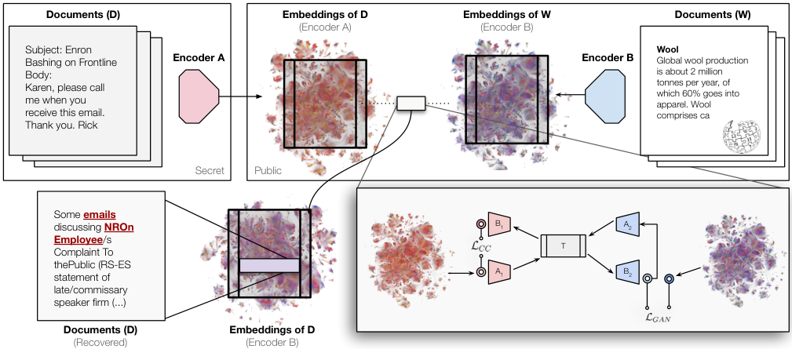
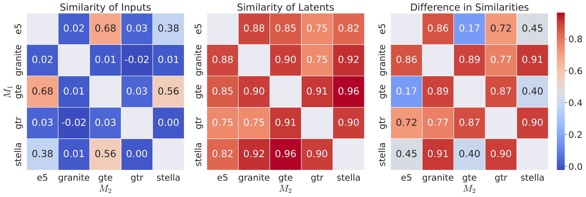
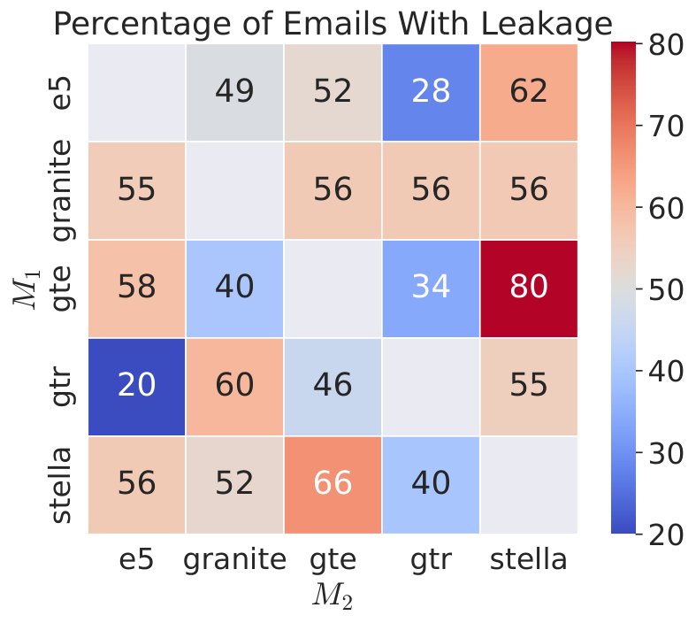

> 原文: [arXiv:2505.12540](https://arxiv.org/abs/2505.12540)（NeurIPS 2025）
> local PDF: `docs/papers/embedding/Vec2Vec_2505.12540.pdf`
> 说明: 本文为论文全文中文技术展开，公式/图表编号与原文一致；图片自 arXiv HTML 抽取（无 fig01），caption 中译；数值与表格原样保留。

**预印本信息：** arXiv:2505.12540v4 [cs.LG]，2026 年 1 月 26 日修订版。发表于第 39 届 NeurIPS 2025。

**开源代码：** https://github.com/rjha18/vec2vec （论文脚注 2 指向 GitHub，作者仓库地址）

---

# 驾驭嵌入空间的通用几何（Harnessing the Universal Geometry of Embeddings）

**作者：** Rishi Jha、Collin Zhang、Vitaly Shmatikov、John X. Morris

**单位：** Department of Computer Science, Cornell University（康奈尔大学计算机科学系）

**主题：** 跨嵌入空间的**无监督翻译**、**强柏拉图表征假说**（Strong Platonic Representation Hypothesis）、嵌入数据库的**安全与隐私**。

---

## 摘要（Abstract）

作者提出了**首个**能够在**没有任何成对数据、编码器访问权、也没有预设匹配集合**的前提下，把一个文本嵌入空间中的向量翻译到另一个空间的方法。他们的无监督方案将**任何嵌入**翻译进/出一个**通用潜在表示**（即柏拉图表征假说所猜测的普遍语义结构）。翻译在架构、参数量、训练数据完全不同的模型对之间达到**很高的余弦相似度**。

保留几何结构地把未知嵌入翻译到另一个空间，这一能力带来**严重的安全隐患**：只拿到嵌入向量数据库的攻击者，就可以恢复出关于底层文档的敏感信息，足以支撑分类与属性推断——而不必掌握生成这些向量的原始编码器。

---

## 1 引言（Introduction）

文本嵌入是现代 NLP 的骨架：检索、RAG、分类、聚类都建立在它之上。市面上有大量嵌入模型，它们采用不同的训练数据、数据 shuffle 顺序、参数初始化。一个好的嵌入模型应把**语义相近的文本映射到向量空间相近的位置**；既然语义只是文本的属性，那么同一段文本在不同模型下的嵌入**理应表达一样的语义**。**但事实上**，不同模型把文本编码进了完全不同、彼此不兼容的向量空间。

Huh 等人提出的**柏拉图表征假说（Platonic Representation Hypothesis）** 猜测：只要视觉模型足够大，最终都会收敛到同一份潜在表示。作者提出了一个更强、且**具建构性**的文本模型版本：文本表示的这一通用潜在结构不但**可以被学出来**，还可以**被用来在不同空间之间做翻译，无需任何成对数据或编码器访问权**。

**图 2（原文 Figure 2）：** 左侧是攻击者拿到的**秘密**——来自未知编码器 A 的一组文档嵌入 `Embeddings of D (Encoder A)`（例如泄露的向量数据库）；作者也有**公开**的一组，是他们用已知编码器 B 对**另一批（未配对）**文档 W 生成的嵌入 `Embeddings of W (Encoder B)`。vec2vec 由输入适配器 `A1, A2`、共享主干 `T`、输出适配器 `B1, B2` 组成，只用这两批**互相无对应**的嵌入进行对抗+循环一致训练，就能学到映射 `F = B2 ∘ T ∘ A1`，把 A 空间的向量翻译进 B 空间。翻译完成后，就可以在已知的 B 空间里跑现成的信息提取工具（如零样本属性推断、嵌入反演）——图中右下角展示了：某封 Enron 邮件被 vec2vec 翻译回文本时，恢复出的正是关于该邮件"NROn Employee/s Complaint To thePublic"的话题描述，与原邮件"Subject: Enron Bashing on Frontline"高度对应。这一图直接说明了**"没有配对样本 + 没有编码器 = 依然可以攻破向量数据库"** 的威胁模型。

**贡献概览：**

1. **强柏拉图表征假说的构造性证据**：给出两组来自不同模型、内容也不重叠的嵌入样本，作者的方法能学出一个**潜在空间**，其中两侧几乎重合（图 1）。
2. **vec2vec 方法**：受**无监督图像翻译**（cycle consistency + adversarial）启发，设计**基础对抗+向量空间保持**的映射，把未知嵌入分布对齐到已知嵌入分布。
3. **首次实现文本嵌入的无监督跨空间翻译**（先前的"翻译"仅限于依赖词表重叠的跨语言词嵌入对齐；作者翻译的是**整句/整段的模型级嵌入**）：翻译结果与目标 ground-truth 的余弦相似度**高达 0.96**，8000+ 打乱嵌入的**完美一一匹配**。
4. **信息提取实证**：把 vec2vec 翻译后的嵌入喂给**零样本属性推断**和**通用零样本嵌入反演**，可以从只见嵌入的邮件里恢复出实体、金额、话题等敏感信息——由此对**只暴露嵌入向量的向量数据库**构成实质威胁。

---

## 2 问题定义：无监督嵌入翻译（Problem Formulation: Unsupervised Embedding Translation）

设攻击者拿到一批向量 $\{u_1, \dots, u_n\}$，每个 $u_i = M_1(d_i)$ 由**未知编码器** $M_1: \mathcal{V}_s \to \mathbb{R}^{d_{M_1}}$ 对未知文档 $d_i$ 生成。攻击者**不能**查询 $M_1$，也不知道 $M_1$ 的训练数据和架构细节。目标是尽可能提取 $d_i$ 的信息。

**能用到的资源：** 一个**已知**的编码器 $M_2$，可以自由查询；以及对 $d_i$ 的**分布层信息**（例如："这批文档是英语文本"）。信息提取思路是：先把 $\{u_i\}$ 翻译到 $M_2$ 的输出空间，再用需要编码器才能跑的成熟工具（如反演模型 [67]）恢复 $d_i$。

**为什么"匹配/对应（correspondence）"方法不够？** 已有大量把两组嵌入向量做匹配的工作 [1, 49, 8, 54]。它们通常**假设两组嵌入产自同一批或高度重叠的输入**——也就是说，对每一个未知向量，另一空间里都已经存在候选目标向量。攻击场景里没有这种奢侈条件。作者在实验里也表明，即使人为满足了这个假设，纯匹配方法效果仍然很差。作者的任务更难：既没有 $M_1$ 也没有除 $u_i$ 之外的任何 $d_i$ 表示，只能依赖两侧空间**共享的几何结构**。

**强柏拉图表征假说（Strong Platonic Representation Hypothesis）：** 用相同目标和模态、但**不同数据和架构**训练出的神经网络会收敛到一个**通用潜在空间**；两个空间之间的翻译**无需成对对应**就能学出来。

**翻译使得信息提取成为可能：** 一旦无监督翻译问题被解决，攻击者就可以拿现有的、专门针对已知编码器的分析工具去操作原本未知的嵌入——包括嵌入反演 [43, 67]，从而恢复出未知文档 $d_i$ 的近似文本。

**图 3（原文 Figure 3）：** 图中"Visible to vec2vec"（vec2vec 可见）只有一根箭头：从"Unknown Embedding Space"里的 $u_i$ 出发，经过 vec2vec 得到"Known Embedding Space"里的 $F(u_i)$；虚线部分（$d_i \to v_i$，即用真正的 $M_2$ 编码原文档）是**看不见**的目标。评估的时候，作者去度量 $F(u_i)$ 与真实 $v_i$ 之间的距离/排名——但训练过程中**从未使用这一对齐关系**，只是最终检查方法效果的"上帝视角"标尺。这个图把攻击者的假设条件（只有一堆向量、没有编码器、没有配对）表现得最清楚。

---

## 3 方法：vec2vec（Our Method: vec2vec）

无监督翻译在计算机视觉里已经被 CycleGAN 类方法解决过：靠**循环一致性**加**对抗正则**（cycle consistency + adversarial regularization）。vec2vec 沿用这一思路，但把 CNN 换成 MLP，把两侧空间的适配层拆开，中间用一个**共享主干**建"通用潜空间"。目标有两条：翻译是**循环一致**的（去了目标空间再回来还是原样），且两侧同文本的嵌入在潜空间中**难以判别**。

### 3.1 架构（Architecture）

模块化设计：

- **输入适配器** $A_1: \mathbb{R}^d \to \mathbb{R}^Z$、$A_2: \mathbb{R}^d \to \mathbb{R}^Z$，把每个模型自己的嵌入投影到维度 $Z$ 的**通用潜表示**。
- **共享主干** $T: \mathbb{R}^Z \to \mathbb{R}^Z$，在潜空间内提取跨模型共享的语义特征。
- **输出适配器** $B_1: \mathbb{R}^Z \to \mathbb{R}^d$、$B_2: \mathbb{R}^Z \to \mathbb{R}^d$，把潜表示再投回各模型自己的空间。

于是**翻译映射** $F_1, F_2$ 和**重构映射** $R_1, R_2$ 定义为：

$$
F_1 = B_2 \circ T \circ A_1,\quad F_2 = B_1 \circ T \circ A_2,\quad R_1 = B_1 \circ T \circ A_1,\quad R_2 = B_2 \circ T \circ A_2
$$

所有可训练参数记作 $\theta = \{A_1, A_2, T, B_1, B_2\}$。

**为什么不是 CNN？** 嵌入向量没有图像那样的空间偏置，作者用**带残差、LayerNorm、SiLU 非线性的多层 MLP**。**判别器**结构对称，但**不带残差**，以简化对抗训练。

### 3.2 优化（Optimization）

在生成器 $F, R$ 之外，作者对**潜空间**（$D_1^\ell, D_2^\ell$）和**输出嵌入空间**（$D_1, D_2$）各引入一组判别器。总目标是**极小-极大**：

$$
\theta^* = \arg\min_\theta \max_{D_1, D_2, D_1^\ell, D_2^\ell} \mathcal{L}_{\text{adv}}(F_1, F_2, D_1, D_2, D_1^\ell, D_2^\ell) + \lambda_{\text{gen}} \mathcal{L}_{\text{gen}}(\theta) \tag{1}
$$

**对抗损失：** 把标准 GAN 损失同时套在**输出嵌入层**和**潜表示层**：

$$
\mathcal{L}_{\text{adv}} = \mathcal{L}_{\text{GAN}}(D_1, F_1) + \mathcal{L}_{\text{GAN}}(D_2, F_2) + \mathcal{L}_{\text{GAN}}(D_1^\ell, T \circ A_1) + \mathcal{L}_{\text{GAN}}(D_2^\ell, T \circ A_2)
$$

它让生成的嵌入在**分布层面**上与真实目标空间不可区分。

**生成器辅助损失：** 只有对抗损失不足以保证语义保留，作者叠加三条约束。

**（i）重构（Reconstruction）**：把嵌入映到潜空间再映回原空间，必须几乎不变：

$$
\mathcal{L}_{\text{rec}}(R_1, R_2) = \mathbb{E}_{x \sim p} \|R_1(x) - x\|_2^2 + \mathbb{E}_{y \sim q} \|R_2(y) - y\|_2^2
$$

其中 $p, q$ 分别是 $M_1, M_2$ 输出嵌入的分布。

**（ii）循环一致（Cycle-consistency）**：无监督地"替代"配对对齐——把一个嵌入翻译到对面再翻回来，应该几乎回到自己：

$$
\mathcal{L}_{\text{CC}}(F_1, F_2) = \mathbb{E}_{x \sim p} \|F_2(F_1(x)) - x\|_2^2 + \mathbb{E}_{y \sim q} \|F_1(F_2(y)) - y\|_2^2
$$

**（iii）向量空间保持（Vector Space Preservation, VSP）**：翻译要保持批内向量的**两两内积几何**，防止模式塌缩到孤立点。对一批 $x_1, \dots, x_B$ 与 $y_1, \dots, y_B$：

$$
\mathcal{L}_{\text{VSP}}(F_1, F_2) = \frac{1}{B^2} \sum_{i=1}^B \sum_{j=1}^B \left( \|M_1(x_i) \cdot M_1(x_j) - F_2(M_2(y_i)) \cdot F_2(M_2(y_j))\|_2^2 + \|M_2(y_i) \cdot M_2(y_j) - F_1(M_1(x_i)) \cdot F_1(M_1(x_j))\|_2^2 \right)
$$

**合成生成器损失：**

$$
\mathcal{L}_{\text{gen}}(\theta) = \lambda_{\text{rec}} \mathcal{L}_{\text{rec}} + \lambda_{\text{CC}} \mathcal{L}_{\text{CC}} + \lambda_{\text{VSP}} \mathcal{L}_{\text{VSP}}
$$

三个 $\lambda$ 控制各分量的相对权重，具体值在附录中给出。

一句话总结：**"对抗对齐分布 + 循环一致做无监督成对代理 + VSP 保留内积几何"** 是把不同空间粘到同一潜表示上的三根钉子。

---

## 4 实验设置（Experimental Setup）

### 4.1 数据与模型（Preliminaries）

**训练/评测数据：** [Natural Questions (NQ)](https://ai.google.com/research/NaturalQuestions) 的用户问题+维基百科段落对——训练用 200 万子集，评测用 65,536 子集。

**属性推断评测：**

- **TweetTopic**：19 类多标签推特语料。
- **Pseudo Re-identified MIMIC-III (MIMIC)**：伪重标识病历库随机 8,192 条，多标签为 2,673 种 MedCAT 疾病描述。
- **Enron Email Corpus (Enron)**：无标签的公司内部邮件 50 封随机子集。

附录 D 中还在 **MS COCO** 上做多模态检索消融。

**编码器矩阵：** 表 1 给出了训练/评测使用的嵌入模型阵列，覆盖 4 个规模档位、5 种 Transformer 骨干、2 种输出维度，涵盖多语言（Granite）与多模态（CLIP）。

**表 1：实验中使用的嵌入模型**

| 模型 | 参数量 (M) | 骨干 | 年份 | 维度 | 最大序列 |
| :--- | ---: | :--- | ---: | ---: | ---: |
| gtr [47] | 110 | T5 | 2021 | 768 | 512 |
| clip [50] | 151 | CLIP | 2021 | 512 | 77 |
| e5 [58] | 109 | BERT | 2022 | 768 | 512 |
| gte [32] | 109 | BERT | 2023 | 768 | 512 |
| stella [68] | 109 | BERT | 2023 | 768 | 512 |
| granite [14] | 278 | RoBERTa | 2024 | 768 | 512 |
| qwen [69] | 4000 | Qwen3 | 2025 | 2560 | 32K |

**训练细节：** 除非另说，每个 vec2vec 都用**两组各 100 万条、来自 NQ 且互不重叠**的 64-token 序列嵌入训练。因 GAN 训练不稳，作者跑多次初始化取最好一次（附录 E）。Qwen 因算力昂贵仅在附录 C 里跑一个模型对。

### 4.2 翻译评测指标（Evaluating Translation）

设 $u_i = M_1(d_i)$，$v_i = M_2(d_i)$。翻译目标是让 $F(u_i)$ 尽可能接近 $v_i$。若 $F$ 输出对候选池中 $v_j$ 最相似，则称 $(u_i, v_j)$ 被"对齐（aligned）"：$j = \arg\min_k \cos(F(u_i), v_k)$。理想翻译器 $F^*$ 应对所有 $i$ 都对齐到自身。

三项指标：

- **Mean Cosine Similarity（平均余弦相似度）**：翻译向量与目标 $v_i$ 的平均相似度。
- **Top-1 Accuracy**：翻译目标是最相近向量的比例。
- **Mean Rank**：目标 $v_i$ 在按相似度排序中的平均排名。理想为 1.0；随机排名对应 $n/2$。

**Baselines：** vec2vec 是**首个无监督嵌入翻译器**，没有直接可比对手。作者用两条参照线：

- **Naïve baseline**：直接 $F(x) = x$，测两空间原生几何相似度。
- **Oracle-aided Optimal Transport (OT)**：**准基线**——OT **已假设候选目标已知**（相当于比 vec2vec 与 Naïve 都作弊），跑最优指派 $\pi^* = \arg\min_\pi \sum_{i=1}^n \cos(u_i, v_{\pi(i)})$。求解器从 Hungarian、EMD、Sinkhorn、（Entropic）Gromov-Wasserstein 里挑排名最低的一个。

### 4.3 信息提取评测（Evaluating Information Extraction）

**零样本属性推断：** 计算 $F(M_1(d_i))$ 与所有属性 $C$ 的嵌入的余弦相似度，取 Top-$k$；若含正确属性即算命中，度量 top-$k$ accuracy: $\frac{1}{n}\sum_i \mathbf{1}\{|c_i^k \cap c_i| \geq 1\}$。

**嵌入反演（Embedding Inversion）：** 用**通用零样本反演器** [67]（不需要为每个空间预训一个专用反演模型）把 $F(M_1(d_i))$ 反演回文本近似 $d_i'$；再用 **GPT-4o 作评判**（judge accuracy）——只有当 GPT-4o 判定 $d_i'$ 泄露出了 $d_i$ 里的实际信息，才算成功。附录 H 给出 prompt。

同时作为对照，作者引入 **Oracle attribute inference**：直接用真正的 $M_2(d_i)$ 与 $M_2(C)$ 做零样本分类——这是把两侧空间的**上限**画出来。

---

## 5 vec2vec 学到通用潜空间与几何保持（vec2vec Learns to Translate Without Any Paired Data）

**图 4（原文 Figure 4）：** 左边热力图是**原始输入空间**里五组不同模型（e5、granite、gte、gtr、stella）之间的两两余弦相似度——例如 e5-granite 只有 0.02、gte-gtr 只有 -0.02，说明**两个模型对同一批文本给出的向量在几何上几乎正交、彻底不兼容**（同架构对如 gte-stella 是 0.68，稍好但依旧不算相近）。中间图是把每一批嵌入都过一次 vec2vec 的 $T \circ A_i$ 进入**通用潜空间**后的两两相似度——所有单元格都跳到 **0.75-0.96**，说明**vec2vec 学到了让不同模型的嵌入在潜空间里高度对齐**。右边图是"中 - 左"的差值：跨骨干对（如 e5-gtr 0.72、granite-gtr 0.86）差值最大，代表 vec2vec 为它们**建起了最陡的语义桥**；同骨干对（如 gte-stella 只差 0.40）本身已经很接近，vec2vec 主要做的是"再拉近一点点"。这是**强柏拉图表征假说**最直观的证据——**潜在通用语义空间是"可学出来"的**。

### 5.1 主结果：翻译在源空间内测（In-distribution）

**表 2（NQ 内测，65,536 条 / 每批 8192 条；Rank 范围 1-8192，4096 = 随机）：**

| $M_1$ | $M_2$ | vec2vec cos↑ | T-1↑ | Rank↓ | Naïve cos↑ | T-1↑ | Rank↓ | OT cos↑ | T-1↑ | Rank↓ |
| :--- | :--- | ---: | ---: | ---: | ---: | ---: | ---: | ---: | ---: | ---: |
| gra. | gtr | 0.80 | 0.99 | 1.19 | -0.03 | 0.00 | 4168.73 | 0.70 | 0.00 | 2773.72‡ |
| gra. | gte | 0.87 | 0.95 | 1.18 | 0.01 | 0.00 | 4088.58 | 0.85 | 0.00 | 2680.02‡ |
| gra. | ste. | 0.79 | 0.98 | 1.05 | 0.01 | 0.00 | 4208.26 | 0.67 | 0.00 | 3446.52‡ |
| gra. | e5 | 0.85 | 0.98 | 1.11 | 0.02 | 0.00 | 4111.60 | 0.83 | 0.00 | 3569.59‡ |
| gtr | gra. | 0.81 | 0.99 | 1.02 | -0.03 | 0.00 | 4169.76 | 0.70 | 0.00 | 2775.17‡ |
| gtr | gte | 0.87 | 0.93 | 2.31 | 0.04 | 0.00 | 4080.92 | 0.85 | 0.00 | 3070.69‡ |
| gtr | ste. | 0.80 | 0.99 | 1.03 | 0.00 | 0.00 | 4198.78 | 0.67 | 0.00 | 3559.06‡ |
| gtr | e5 | 0.83 | 0.84 | 2.88 | 0.03 | 0.00 | 4082.84 | 0.83 | 0.00 | 3888.01‡ |
| gte | gra. | 0.75 | 0.95 | 1.22 | 0.01 | 0.00 | 4079.81 | 0.69 | 0.00 | 2664.38‡ |
| gte | gtr | 0.75 | 0.91 | 2.64 | 0.04 | 0.00 | 4084.15 | 0.70 | 0.00 | 3064.16‡ |
| gte | ste. | 0.89 | 1.00 | 1.00 | 0.56 | 1.00 | 1.00 | 0.71 | 1.00 | 1.00† |
| gte | e5 | 0.87 | 0.99 | 5.19 | 0.68 | 1.00 | 1.00 | 0.84 | 1.00 | 1.00† |
| ste. | gra. | 0.80 | 0.98 | 1.08 | 0.01 | 0.00 | 4209.08 | 0.69 | 0.00 | 3419.44‡ |
| ste. | gtr | 0.82 | 1.00 | 1.10 | 0.00 | 0.00 | 4192.31 | 0.70 | 0.00 | 3555.64‡ |
| ste. | gte | 0.92 | 1.00 | 1.00 | 0.56 | 1.00 | 1.00 | 0.87 | 1.00 | 1.00† |
| ste. | e5 | 0.86 | 1.00 | 1.00 | 0.38 | 0.99 | 1.03 | 0.83 | 1.00 | 1.00† |
| e5 | gra. | 0.81 | 0.99 | 2.20 | 0.02 | 0.00 | 4120.60 | 0.69 | 0.00 | 3526.02‡ |
| e5 | gtr | 0.74 | 0.82 | 2.56 | 0.03 | 0.00 | 4080.76 | 0.70 | 0.00 | 3877.03‡ |
| e5 | gte | 0.90 | 1.00 | 1.01 | 0.68 | 1.00 | 1.00 | 0.86 | 1.00 | 1.00† |
| e5 | ste. | 0.78 | 1.00 | 1.00 | 0.38 | 1.00 | 1.00 | 0.69 | 1.00 | 1.00† |

（†：Sinkhorn；‡：Gromov-Wasserstein）

**关键读点：**

- **跨骨干对（cross-backbone）**（例如 granite-gtr、gtr-e5）：Naïve baseline 完全随机（Rank ~ 4100），Oracle OT 也只把 Rank 降到 2700-3800（甚至更差）；**vec2vec 直接把 Rank 打到 1-3**，Top-1 常年 0.9+。
- **同骨干对（same-backbone）**（如 gte-stella、gte-e5）：几何本来就接近，Naïve 就能拿到 Top-1=1.0；vec2vec 依然并列或超过。
- 平均余弦 **最高 0.92**（stella-gte），跨骨干对普遍 0.8+；**Top-1 最高 1.00**，8192 条打乱嵌入里能一一匹配。

### 5.2 翻译的几何保持（Translations Mirror Target Geometry）

图 4 已经量化说明：**vec2vec 潜空间中不同模型间的相似度矩阵**几乎相等；也就意味着翻译不是"点对点碰运气"，而是把整体几何搬过去了。图 1（作者原文两张 UMAP 2D 投影）把 gte 和 gtr 的原嵌入画在一起——彼此远远拉开；而它们的 vec2vec 潜表示几乎完全重叠。**这就是"通用潜表示可以学出来"的可视化定论。**

### 5.3 跨分布评测（Out-of-Distribution）

**表 3（vec2vec 在 NQ 上训练，直接在完全不同分布的 TweetTopic 800 条推特、MIMIC-III 8192 条病历上评测；Rank 上限分别 800 与 8192）：**

| $M_1$ | $M_2$ | TweetTopic cos↑ | T-1↑ | Rank↓ | MIMIC cos↑ | T-1↑ | Rank↓ |
| :--- | :--- | ---: | ---: | ---: | ---: | ---: | ---: |
| gran. | gtr | 0.74 | 0.99 | 1.09 | 0.74 | 0.60 | 23.38 |
| gran. | gte | 0.85 | 0.95 | 1.26 | 0.85 | 0.08 | 346.21 |
| gran. | stel. | 0.77 | 0.96 | 1.11 | 0.72 | 0.13 | 242.23 |
| gran. | e5 | 0.83 | 0.87 | 3.10 | 0.84 | 0.12 | 361.06 |
| gtr | gran. | 0.79 | 0.98 | 2.41 | 0.78 | 0.51 | 35.27 |
| gtr | gte | 0.85 | 0.96 | 1.29 | 0.84 | 0.12 | 279.56 |
| gtr | stel. | 0.77 | 0.96 | 1.10 | 0.72 | 0.27 | 127.92 |
| gtr | e5 | 0.80 | 0.53 | 13.38 | 0.82 | 0.01 | 1413.80 |
| gte | gran. | 0.73 | 0.94 | 1.33 | 0.73 | 0.09 | 342.15 |
| gte | gtr | 0.71 | 0.95 | 1.29 | 0.69 | 0.12 | 256.63 |
| gte | stel. | 0.86 | 1.00 | 1.00 | 0.85 | 1.00 | 1.00 |
| gte | e5 | 0.83 | 0.91 | 1.57 | 0.86 | 0.54 | 17.71 |
| stel. | gran. | 0.79 | 0.99 | 1.09 | 0.77 | 0.14 | 221.95 |
| stel. | gtr | 0.77 | 1.00 | 1.00 | 0.75 | 0.56 | 17.70 |
| stel. | gte | 0.90 | 1.00 | 1.00 | 0.91 | 1.00 | 1.00 |
| stel. | e5 | 0.85 | 0.98 | 1.05 | 0.85 | 0.51 | 26.33 |
| e5 | gran. | 0.79 | 0.98 | 1.08 | 0.78 | 0.21 | 151.09 |
| e5 | gtr | 0.67 | 0.80 | 3.10 | 0.66 | 0.01 | 1029.64 |
| e5 | gte | 0.87 | 0.99 | 1.02 | 0.87 | 0.60 | 32.59 |
| e5 | stel. | 0.75 | 0.98 | 1.06 | 0.75 | 0.46 | 32.12 |

**关键读点：** 尽管训练分布是维基百科式问答，vec2vec 在**充满 emoji 的推特**和**医学术语密集的病历**上依然稳定：绝大多数模型对的 TweetTopic Top-1 都在 0.9+；MIMIC 里 rank 会飙升到几百（因为 8192 条医学记录里同类高度扎堆，且 MedCAT 疾病术语远离 NQ 分布），但同骨干对依旧保持 Top-1 = 1.00，跨骨干对也把 rank 从随机的 4096 挤到几十至几百。附录 F 显示 Naïve/OT baseline 在跨骨干、跨分布场景下几乎完全垮掉。

### 5.4 单模态 ↔ 多模态（CLIP）翻译（Table 4）

**表 4（vec2vec 把 CLIP 嵌入与单模态文本嵌入互译；Rank 范围 1-8192，随机 = 4096；由于维度不同 CLIP=512，只跑 Gromov-Wasserstein OT baseline，Naïve baseline 不适用）：**

| $M_1$ | $M_2$ | vec2vec cos↑ | T-1↑ | Rank↓ | OT cos↑ | T-1↑ | Rank↓ |
| :--- | :--- | ---: | ---: | ---: | ---: | ---: | ---: |
| gra. | clip | 0.78 | 0.35 | 226.62 | 0.76 | 0.00 | 4073.58‡ |
| gtr | clip | 0.73 | 0.13 | 711.23 | 0.59 | 0.00 | 4096.78‡ |
| gte | clip | 0.62 | 0.00 | 3233.41 | 0.76 | 0.00 | 4026.96‡ |
| ste. | clip | 0.77 | 0.31 | 286.69 | 0.76 | 0.00 | 3955.71‡ |
| e5 | clip | 0.64 | 0.01 | 2568.21 | 0.77 | 0.00 | 3771.52‡ |
| clip | gra. | 0.74 | 0.72 | 4.46 | 0.69 | 0.00 | 4053.11‡ |
| clip | gtr | 0.67 | 0.27 | 155.11 | 0.49 | 0.00 | 4096.35‡ |
| clip | gte | 0.75 | 0.00 | 2678.90 | 0.85 | 0.00 | 4025.81‡ |
| clip | ste. | 0.72 | 0.61 | 22.50 | 0.67 | 0.00 | 3951.73‡ |
| clip | e5 | 0.73 | 0.01 | 1692.28 | 0.83 | 0.00 | 3771.38‡ |

**读点：** 效果整体不如纯文本对（因为 CLIP 一半参数是图像监督下训练的），但依旧全面吊打 OT baseline，且部分方向（如 clip → granite 的 Rank 4.46）依然接近完美。作者据此推断：**通用潜几何在多模态上也存在**——考虑到 CLIP 的嵌入空间早已被 ImageBind [12] 桥接到音频、深度图等模态上，vec2vec 有望进一步串起更多模态。

---

## 6 用 vec2vec 翻译做信息提取（Using vec2vec Translations to Extract Information）

翻译只是手段。真正的隐私影响，来自把翻译后的向量喂进现成的信息提取工具后能撬出多少东西。

### 6.1 零样本属性推断（Zero-shot Attribute Inference）

**表 5（TweetTopic top-1、MIMIC top-10 属性推断准确率；vec2vec 训练分布是 NQ）：**

| $M_1$ | $M_2$ | Tweet vec2vec | Tweet Naïve | Tweet $M_1$ ideal | Tweet $M_2$ ideal | MIMIC vec2vec | MIMIC Naïve | MIMIC $M_1$ ideal | MIMIC $M_2$ ideal |
| :--- | :--- | ---: | ---: | ---: | ---: | ---: | ---: | ---: | ---: |
| gran. | gtr | 0.25 | 0.10 | 0.30 | 0.24 | 0.19 | 0.11 | 0.76 | 0.88 |
| gran. | gte | 0.32 | 0.09 | 0.30 | 0.34 | 0.36 | 0.13 | 0.76 | 1.00 |
| gran. | stel. | 0.24 | 0.10 | 0.30 | 0.28 | 0.27 | 0.04 | 0.76 | 0.96 |
| gran. | e5 | 0.31 | 0.18 | 0.30 | 0.31 | 0.19 | 0.20 | 0.76 | 0.97 |
| gtr | gran. | 0.34 | 0.08 | 0.24 | 0.30 | 0.16 | 0.12 | 0.88 | 0.76 |
| gtr | gte | 0.33 | 0.13 | 0.24 | 0.34 | 0.28 | 0.05 | 0.88 | 1.00 |
| gtr | stel. | 0.30 | 0.10 | 0.24 | 0.28 | 0.25 | 0.07 | 0.88 | 0.96 |
| gtr | e5 | 0.30 | 0.04 | 0.24 | 0.31 | 0.09 | 0.09 | 0.88 | 0.97 |
| gte | gran. | 0.37 | 0.04 | 0.34 | 0.30 | 0.18 | 0.11 | 1.00 | 0.76 |
| gte | gtr | 0.24 | 0.13 | 0.34 | 0.24 | 0.10 | 0.03 | 1.00 | 0.88 |
| gte | stel. | 0.31 | 0.20 | 0.34 | 0.28 | 0.68 | 0.83 | 1.00 | 0.96 |
| gte | e5 | 0.37 | 0.30 | 0.34 | 0.31 | 0.37 | 0.63 | 1.00 | 0.97 |
| stel. | gran. | 0.35 | 0.07 | 0.28 | 0.30 | 0.23 | 0.09 | 0.96 | 0.76 |
| stel. | gtr | 0.26 | 0.13 | 0.28 | 0.24 | 0.22 | 0.09 | 0.96 | 0.88 |
| stel. | gte | 0.38 | 0.36 | 0.28 | 0.34 | 0.90 | 0.98 | 0.96 | 1.00 |
| stel. | e5 | 0.35 | 0.34 | 0.28 | 0.31 | 0.38 | 0.46 | 0.96 | 0.97 |
| e5 | gran. | 0.33 | 0.15 | 0.31 | 0.30 | 0.14 | 0.07 | 0.97 | 0.76 |
| e5 | gtr | 0.26 | 0.22 | 0.31 | 0.24 | 0.11 | 0.04 | 0.97 | 0.88 |
| e5 | gte | 0.34 | 0.28 | 0.31 | 0.34 | 0.47 | 0.66 | 0.97 | 1.00 |
| e5 | stel. | 0.26 | 0.16 | 0.31 | 0.28 | 0.36 | 0.40 | 0.97 | 0.96 |

**读点：**

- 在 **TweetTopic** 上，vec2vec 翻译后的属性推断准确率一致高于 Naïve baseline，并常常**逼近甚至超过**"用真编码器 $M_1/M_2$ 做的理想零样本"（如 gte→e5 vec2vec 0.37 vs $M_1$ 0.34 / $M_2$ 0.31）。
- 在 **MIMIC** 上，属性池是 2673 种 MedCAT 疾病描述，绝大部分从未出现在 NQ 训练数据中。vec2vec 在同骨干对上打平 baseline，在跨骨干对上大幅超越 Naïve（如 gtr→gte MIMIC 0.28 vs Naïve 0.05；e5→gte 0.47 vs Naïve 0.66，接近后者理想）。
- **结论**：vec2vec 潜空间**保留了从未见过的语义**——"alveolar periostitis（牙槽骨膜炎）"这种训练里根本没出现的词，翻译后仍能被检索到对应属性。这说明它学到的不是词汇映射，而是**通用语义几何**。

### 6.2 零样本反演（Zero-shot Inversion）

反演比属性推断更进一步：直接**恢复原文**。作者拿现成的通用零样本反演器 [67]，只提供 vec2vec 翻译后的向量。

**图 5（原文 Figure 5）：** 5x5 热力图，行是 $M_1$（未知目标编码器）、列是 $M_2$（攻击者已知编码器）。数值范围 20-80%——最高格子（gte → gtr 与 stella → gtr 分别 62% 与 66%，e5 → stella 也到 66%）意味着**攻击者不知道向量原来是哪个模型产的，也能从 50 封 Enron 邮件里恢复到 66% 泄露率**。作者在正文中报告：**最高达到 80% 的邮件、67% 的推特**在部分模型对上被 GPT-4o 判定"反演结果确实泄露了原文信息"。同骨干对（如 gte-stella）泄露最重，正对应几何相似度最高的组合；即使跨骨干（如 e5→gtr）也保持在 20-40%，仍属显著隐私风险。这一张图把"**只要拿到嵌入数据库，就能读出邮件话题**"这一威胁定量化，是全篇最刺激的隐私实证。

**图 6（原文 Figure 6，PDF 页 9 中示例）** 给出三条 Enron 邮件的原文对照（Ground Truth）与 vec2vec 翻译 + 反演出的生成文本（Generation）：

- Ground Truth: "Subject: Enron Bashing on Frontline \n Body:..." → Generation: "Some emails discussing NROn Employee/s Complaint To thePublic ..."
- Ground Truth: "Subject: Trades for 3/1/02 \n Body: \n John , \n The following trades..." → Generation: "... future transactions may await John G..."
- Ground Truth: " The following expense report is ready for approval..." → Generation: " The upcoming expense statement from YYYY MM Dec..."

反演结果**并不字面精确**（Enron→NROn 已是笔误级别的形近字），但**主题、人物名、事务类型、日期结构**都被准确恢复——足以让攻击者在只见嵌入的场景下推断出：这是关于 Enron 被公开抨击的邮件 / John 相关的交易记录 / 待审批的报销单。作者明确写道：即使当前反演器远不完美，vec2vec 已足够撬出**个人姓名、公司名、日期、促销、财务信息、事故、甚至午餐订单**等敏感内容。

**对向量数据库安全的直接含义：** 在生产系统里，很多团队把 embedding 数据库当作"脱敏后的向量"存储；vec2vec 说明——**只要攻击者能查一个不同的、公开的编码器 $M_2$，就能反推出原文档大意，等同于文本泄露**。

---

## 7 消融与训练数据规模（Ablations）

### 7.1 每个组件都有必要（表 6）

**表 6（gte → gtr 翻译器，NQ 训练，65,536 NQ 子集评测；Rank 范围 1-8192）：**

| 方法 | cos↑ | T-1↑ | Rank↓ |
| :--- | ---: | ---: | ---: |
| vec2vec（完整） | 0.75 | 0.91 | 2.64 |
| Naïve baseline | 0.04 | 0.00 | 4084.15 |
| OT baseline | 0.70 | 0.00 | 3064.16 |
| – VSP 损失 | 0.58 | 0.00 | 4196.64 |
| – CC 损失 | 0.50 | 0.00 | 3941.36 |
| – 潜空间 GAN | 0.49 | 0.00 | 3897.09 |
| – VSP + CC 都去掉 | 0.47 | 0.00 | 3365.24 |
| – 超参搜索（用默认超参） | 0.50 | 0.00 | 4011.73 |

**读点：** 只要去掉任何一条辅助损失，Top-1 立刻掉到 0.00、Rank 飙到近随机——说明 **对抗+循环一致+VSP+潜空间对抗** 是缺一不可的四件套；纯对抗给不了足够信号，纯 OT 又拿不到几何。

### 7.2 数据规模：几万条即可起作用（表 7）

**表 7（gte → gtr，GTR 侧固定 100 万条，GTE 侧从 1 万到 100 万；NQ 8192 子集评测）：**

| $N$（GTE 嵌入条数） | cos↑ | T-1↑ | Rank↓ |
| ---: | ---: | ---: | ---: |
| 1,000,000 | 0.75 | 0.92 | 2.73 |
| 10,000 | 0.57 | 0.01 | 1462.21 |
| 50,000 | 0.74 | 0.81 | 3.91 |
| 100,000 | 0.74 | 0.85 | 4.52 |
| 500,000 | 0.75 | 0.92 | 2.73 |

**读点：** **1 万条**就能显著优于随机（Rank 1462 vs 4096）；**5 万条**几乎追平百万条（Rank 3.91 vs 2.73）——**攻击门槛惊人地低**。这意味着即便攻击者只能爬到少量嵌入样本，也能训一个够用的翻译器。

---

## 8 相关工作（Related Work）

**表示对齐（Representation Alignment）：** 度量不同网络表示相似度的工作包括 CCA [42]、SVCCA [51]、CKA [23, 38]、ICA [63]、时间序列 [39]、GUI 可视化 [16]。零样本 stitching / substitution / domain transfer / 多模态适配 [37, 45, 40, 57, 48] 都基于表示相似性——但**它们几乎都要成对数据**。vec2vec 不只是度量相似，而是**学到跨空间的翻译，全程无配对**。

**最优传输（Optimal Transport）：** 无监督 OT 已用于图像风格迁移 [17, 36, 70]、跨语言词翻译 [62, 10, 15, 9, 20]、无监督机器翻译 [52, 27, 1, 4, 64, 3]。vec2vec 沿用"循环一致 + 对抗"的框架，但**关键差异**在于：过去的词/句翻译工作都能借助"同一个输入的多种表示"（词表大量重叠），vec2vec 没有这个便利。[54] 的 "Blind Match" 只做小集合匹配，而 vec2vec 是**生成整个新空间里的对应向量**。

**嵌入反演（Embedding Inversion）：** 从嵌入解码文本的方向有 [55, 29, 43]，从模型输出反推有 [44, 7, 66]。vec2vec 让这些工具**能应用到未知编码器**——先把未知嵌入翻译到已知空间，再让专用反演器发力。

**模态桥接：** [33] 揭示图像与文本嵌入间存在"模态鸿沟"，随后 [56] 综述统一模态方法；ImageBind [12] 把音频、深度、热图等接入 CLIP 空间。vec2vec 属于**事后（post-hoc）** 桥接：不需要重新训一个统一模型，直接翻译已有嵌入，与前述工作是**互补**关系。

---

## 9 讨论与未来工作（Discussion and Future Work）

作者主张的**强柏拉图表征假说**是：文本表示的通用潜在结构**可以被学习并利用**，跨表示的翻译**无需编码器或成对数据**。

- 第 5 节证明：**vec2vec 在未见文档、未见编码器**上都能翻译，甚至对分布外的推特、病历依然稳健——说明它捕捉到的是**跨域**的几何本质。
- 第 6 节证明：翻译**保留了足够的语义**，可以支撑属性推断和文本反演；只见嵌入的攻击者已能从病历里读出疾病、从邮件里读出人物金额与话题——**"嵌入几乎泄露了和文本一样多的信息"** 在跨模型场景下同样成立。
- **CLIP 初步结果**表明这一现象**不限于文本模态**——通用几何很可能在多模态里也成立。

**局限与未来：** vec2vec 建立的是**下界**——训练更稳定的算法、更好的架构、更多样的模型对，能推得翻译更精确、恢复更彻底。作者建议后续工作专门为"翻译后的嵌入"训练专用反演模型，并探索更多模态对（音频、视频、图像与文本互译）。

---

## 关键洞察串讲：向量数据库不再是"脱敏"存储

- **过去的默认心智模型**：把文本 embedding 存进向量数据库 = 语义摘要，只有拿着**同一个编码器**才能查询/反演；泄露一份 embedding dump 相当于泄露了一份"打乱字典的密文"。
- **vec2vec 打破的假设**：不同编码器彼此几何隔绝这件事是**假象**——训练目标+语言分布相同时，它们收敛到同一个潜在语义几何。
- **实操攻击链**：拿到未知模型 $M_1$ 的 embedding dump → 用任意公开编码器 $M_2$ 生成一大堆已知嵌入 → 训 vec2vec（1M 甚至 5 万条即可）→ 翻译 dump → 用零样本反演器/属性推断从 $M_2$ 空间读出原文。
- **在需要严肃对待的场景**：企业内部 RAG、医疗记录检索、代码/邮件嵌入索引，若只在 access control 层保护向量，一次数据库泄露就等价于一次**文本泄露**。防御思路（作者未展开）：加噪、维度扰动、把嵌入绑定到检索时才计算的密钥空间——但都需要在效用与安全间做权衡。

---

## 术语翻译约定

| 英文原词 | 中文译法 |
| :--- | :--- |
| Embedding | 嵌入（向量） |
| Encoder | 编码器 |
| Unsupervised (embedding) translation | 无监督（嵌入）翻译 |
| Paired data / paired samples | 成对数据 / 成对样本 |
| Latent (representation) space | 潜（表示）空间 / 潜在空间 |
| Universal latent structure | 通用潜在结构 |
| Platonic Representation Hypothesis | 柏拉图表征假说 |
| Strong Platonic Representation Hypothesis | 强柏拉图表征假说 |
| Cycle consistency | 循环一致（性） |
| Adversarial loss / training | 对抗损失 / 对抗训练 |
| Vector Space Preservation (VSP) | 向量空间保持 |
| Reconstruction loss | 重构损失 |
| Discriminator | 判别器 |
| Generator | 生成器 |
| Optimal Transport (OT) | 最优传输 |
| Gromov-Wasserstein / Sinkhorn / EMD | 分别音译/术语保留 |
| Attribute inference | 属性推断 |
| Embedding inversion | 嵌入反演 |
| Zero-shot | 零样本 |
| Modality gap | 模态鸿沟 |
| Backbone | 骨干（网络） |
| In-distribution / Out-of-distribution (OOD) | 分布内 / 分布外 |
| Top-1 Accuracy / Mean Rank / Mean Cosine Similarity | Top-1 准确率 / 平均排名 / 平均余弦相似度 |
| Vector database | 向量数据库 |
