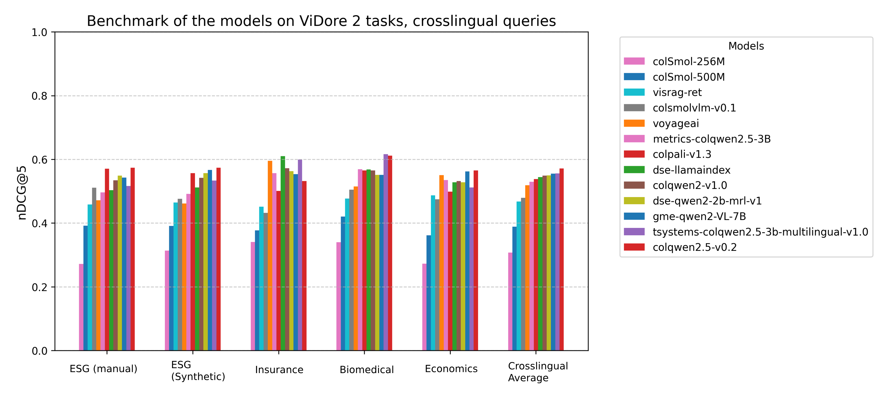

> arXiv: <https://arxiv.org/abs/2505.17166>
> local PDF: `docs/papers/embedding/ViDoRev2_2505.17166.pdf`
> 说明: 本文为 ViDoRe Benchmark V2 short paper（6 页）的中文技术展开；公式/表格编号与原文一致；图片自 arXiv 原图抽取，caption 中译；数值原样保留。

**预印本信息：** arXiv:2505.17166v2 [cs.IR]，首发 2025-03-18，v2 修订 2025-09-19。ColPali 团队面向视觉文档检索（Visual Document Retrieval, VDR）方向的评测基准升级。

**开源与相关链接：**

- Blog: <https://huggingface.co/blog/manu/vidore-v2>
- Leaderboard: <https://huggingface.co/spaces/vidore/vidore-leaderboard>
- 数据集合集: <https://huggingface.co/collections/vidore/vidore-benchmark-v2-dev-67ae03e3924e85b36e7f53b0>
- 代码仓库: <https://github.com/illuin-tech/vidore-benchmark>

---

# ViDoRe Benchmark V2：为视觉检索抬高门槛（Raising the Bar for Visual Retrieval）

| 字段 | 内容 |
| :--- | :--- |
| 发布 | arXiv 首发 2025-03-18 |
| 作者 | Quentin Macé¹、António Loison¹、Manuel Faysse¹²|
| 单位 | ¹Illuin Technology　²CentraleSupélec |
| 邮箱 | `quentin.mace@illuin.tech` |
| 关键 refs | ColPali [Faysse et al., 2025]、DSE [Ma et al., 2024]、VisRAG [Yu et al., 2024]、GME [Zhang et al., 2024]、Nomic Embed Multimodal [Team, 2025]、FreshStack [Thakur et al., 2025]、MTEB [Muennighoff et al., 2022] |
| Modality | 视觉文档（页面截图） + 文本 query |
| Languages | 英 / 法 / 西 / 德（跨语言 query） |
| Task | 页面级视觉文档检索，评测指标 nDCG@5 |

---

## 摘要（Abstract）

**ViDoRe Benchmark V1** 已趋于饱和——榜首模型的 nDCG@5 越过 90%，让新方法之间的差距难以被度量。**ViDoRe Benchmark V2** 通过三项设计把评测拉回真实的检索场景：**盲上下文构造（blind contextual querying）**、**长文/跨文档 query**、以及**合成 + 人工回环（hybrid synthetic and human-in-the-loop）** 的 query 生成流水线。它包含 4 个多样化、多语言的数据集，并给出统一的评测指令。首批结果显示，现有模型在 V2 上仍有充足的提升空间，同时暴露了跨领域泛化与非英语能力上的短板。ViDoRe V2 被设计为一个「living benchmark」——鼓励社区持续贡献任务、维持基准的时效性。

---

## 为什么需要新基准（Why a new benchmark?）

自 **ViDoRe Benchmark V1**（Faysse et al., 2025）发布以来，视觉文档检索模型进步显著：初代 **ColPali** 的平均 nDCG@5 约 81.3，而当前榜首模型普遍越过 90，部分子任务已经「过于简单」，无法提供有区分度的信号。基准饱和意味着继续测下去只能测出微弱噪声，也就无法反映现实场景中模型真正的能力差距。为持续推动 VDR 前沿，作者提出 **ViDoRe Benchmark V2**，专门针对**已经很强的模型**再抬高一档门槛。

---

## ViDoRe V2 的动机（Motivating the Creation of ViDoRe Benchmark V2）

作者对现有 benchmark 归纳了三个偏离真实用户行为的问题（与 FreshStack [Thakur et al., 2025] 的观察一致）：

1. **抽取式 query（Extractive Nature of Queries）**：现有基准的 query 常常是从文档中直接抽片段改写而成，让检索任务变成「找出原句」，与真实用户「不知道文档内容、凭意图提问」的场景差距很大。
2. **单页 query 偏置（Single-Page Query Bias）**：许多基准把 query 绑定到**单页**答案上，忽视了真实应用中大量存在的**跨页 / 跨文档综合**问题。
3. **纯合成 query 的可用性问题（Synthetic Query Generation Challenges）**：纯合成方案在原理上很有吸引力，但没有大量人工把关时会出很多 outlier、不相关或平凡的 query，最终仍需要昂贵的人工过滤。

上述三点共同解释了「V1 快速饱和 + V2 必须换思路」的必要性。

---

## 设计决策与技术（Design Decisions and Techniques Used）

针对上述三个问题，ViDoRe V2 采用了以下核心设计：

- **盲上下文构造 query（Blind Contextual Querying）**：真实用户提问时并不掌握文档全文。作者只把**极有限的上下文**（摘要、元数据等）喂给 query 标注模型，让它在「不知道文档具体内容」的条件下写 query，然后用后置过滤丢掉与文档无关的样本。这样生成的 query 明显减弱了「抽取式偏置」，更贴近真实用户与语料的交互方式。
- **长 query 与跨文档 query（Long and Cross-Document Queries）**：不同于传统偏向短语 query 的基准，V2 有意提高长 query 与跨文档 query 的比例——多个子数据集专注于「一次提问要综合多页 / 多个文档才能回答」的形态。
- **合成 + 人工回环（Hybrid Synthetic and Human-in-the-Loop）**：合成负责规模，人工负责质量。作者先合成候选 query，再由标注员大量修改、剔除、复审。这一过程虽然重，但明显提升了 query 质量与最终数据集的可靠性。

---

## 数据集选择（Dataset Selection for ViDoRe Benchmark V2）

V2 选取了 4 个公开、领域多样、视觉复杂度高的数据集（表 1）。每个数据集都给出**多语言版本**（query 翻译为法/英/西/德），扩大适用范围与难度。

**表 1（原文 Table 1）：** ViDoRe V2 数据集统计概要（数值原样保留，表头中译）。

| 数据集 | 原始语言 | Query 语言 | 唯一文档数 | 页数 | Query 子集 | Query 数 | 相关判定数 (Qrels) | 平均相关页 / query | 备注 |
| :--- | :---: | :---: | ---: | ---: | :---: | ---: | ---: | ---: | :--- |
| Insurance Terms of Service¹ | Fr | Fr | 4 | 260 | – | 18 | 86 | 4.8 | 规模小但难度高，多文档 |
| Biomedical | En | En | 27 | 1,016 | – | 160 | 515 | 3.2 | 数据集最大，最偏抽取式 |
| Economics | En | En | 5 | 452 | – | 58 | 907 | 15.6 | 跨文档 query，复杂度最高 |
| ESG Reports | En | En | 30 | 1,538 | Synthetic | 57 | 222 | 3.9 | 天然跨语，行业专属 |
|  |  |  |  |  | Human | 52 | 128 | 2.5 | 同数据集的人工 query 划分 |

¹ 数据集发布后，Insurance 因法律版权原因已被移除，其榜单历史结果仍作为参考保留。

四个数据集的核心画像：

- **Insurance（保险条款）**：规模最小但**跨文档**——一个 query 平均对应 4.8 个相关页面，考察模型跨条款、跨保单聚合信息的能力；同时天然是法语场景，检验非英语能力。
- **Biomedical（生物医学）**：最大、最偏抽取式，可作为「V1 风格」难度基线，同时验证专业术语场景。
- **Economics（经济学）**：一个 query 平均需要 **15.6 个相关页面**才能覆盖答案，是四组中**跨文档程度最高**的部分，专门用来暴露 single-page bias 模型的短板。
- **ESG Reports（企业 ESG 报告）**：**同时提供合成 query（Synthetic）和人工 query（Human）两个划分**，用来对照「纯合成 vs. 人工回环」两种 query 生成方式在评测区分度上的差异（对应 §5 中「人工划分对模型排序更有区分度」的观察）。

---

## 模型评测（Evaluating Models）

V2 提供两种评测入口：

**选项 1：CLI（快速上手）**——以 ColPali 家族的 retriever 为例，通过官方 `vidore-benchmark` 工具直接跑：

```bash
vidore-benchmark evaluate-retriever \
    --model-class colpali \
    --model-name vidore/colpali-v1.3 \
    --collection-name vidore/vidore-benchmark-v2-dev-67ae03e3924e85b36e7f53b0 \
    --dataset-format beir \
    --split test
```

**选项 2：自定义 retriever**——非 ColPali 类模型可按仓库 <https://github.com/illuin-tech/vidore-benchmark> 中的接口自行接入。作者已宣布后续将迁移到 **MTEB**（Muennighoff et al., 2022），把 ViDoRe 融进社区统一的 embedding 评测生态里。

主评测指标：**nDCG@5**（跨所有子任务、跨单语与跨语言划分求平均）。

---

## 结果（Results）

**表 2（原文 Table 2）：** 各模型在 ViDoRe V2 各子任务上的 **nDCG@5**（数值原样保留，每列最大值加粗）。列包括 ESG Reports (Manual)、Insurance、Insurance Multilingual、Economics、Biomedical、Bio Multilingual、ESG Reports、ESG Reports Multilingual、Economics Multilingual、Average。

| 模型 | ESG Reports (Manual) | Insurance | Insurance Multilingual | Economics | Biomedical | Bio Multilingual | ESG Reports | ESG Reports Multilingual | Economics Multilingual | Average |
| :--- | ---: | ---: | ---: | ---: | ---: | ---: | ---: | ---: | ---: | ---: |
| voyageai | 0.561 | 0.641 | 0.595 | 0.588 | 0.564 | 0.515 | 0.472 | 0.462 | 0.550 | 0.550 |
| metrics-AI/colqwen2.5-3B | 0.645 | 0.579 | 0.557 | 0.566 | 0.639 | 0.569 | 0.496 | 0.492 | 0.535 | 0.564 |
| colsmolvlm-v0.1 | 0.624 | 0.555 | 0.432 | 0.609 | 0.581 | 0.505 | 0.511 | 0.476 | 0.474 | 0.530 |
| colqwen2-v1.0 | 0.622 | 0.651 | 0.572 | 0.615 | 0.618 | 0.565 | 0.534 | 0.542 | 0.532 | 0.583 |
| colpali-v1.2 | 0.321 | 0.560 | 0.458 | 0.531 | 0.585 | 0.557 | 0.519 | 0.540 | 0.479 | 0.505 |
| dse-qwen2-2b-mrl-v1 | 0.614 | 0.655 | 0.563 | 0.615 | 0.592 | 0.551 | 0.549 | 0.557 | 0.528 | 0.580 |
| colSmol-256M | 0.460 | 0.504 | 0.341 | 0.534 | 0.532 | 0.340 | 0.272 | 0.313 | 0.273 | 0.397 |
| colpali-v1.3 | 0.511 | 0.598 | 0.501 | 0.516 | 0.597 | 0.565 | 0.570 | 0.557 | 0.499 | 0.546 |
| colqwen2.5-v0.2 | 0.684 | 0.603 | 0.532 | 0.598 | 0.636 | 0.611 | 0.574 | 0.574 | 0.565 | **0.597** |
| dse-llamaindex | 0.631 | 0.688 | 0.610 | 0.612 | 0.606 | 0.569 | 0.503 | 0.512 | 0.528 | 0.584 |
| tsystems/colqwen2.5-3b-multi-v1.0 | **0.721** | **0.693** | 0.600 | 0.548 | **0.653** | **0.617** | 0.517 | 0.533 | 0.512 | **0.599** |
| gme-qwen2-VL-7B | 0.658 | 0.607 | 0.554 | **0.629** | 0.640 | 0.551 | 0.543 | 0.567 | 0.562 | 0.590 |
| visrag-ret | 0.537 | 0.505 | 0.452 | 0.596 | 0.548 | 0.477 | 0.459 | 0.464 | 0.487 | 0.503 |
| colSmol-500M | 0.522 | 0.587 | 0.377 | 0.503 | 0.543 | 0.421 | 0.392 | 0.391 | 0.361 | 0.455 |
| colpali-v1.1 | 0.465 | 0.547 | 0.484 | 0.567 | 0.564 | 0.507 | 0.461 | 0.481 | 0.438 | 0.502 |

> 说明：作者对 voyageAI API 的评测流程做了轻微适配（把输入图最大高度统一到 1200 px 以便高效评测），因此其在 V1 上的成绩比 voyageAI 官方汇报略低，读者比较时需注意。

### 主要发现（Takeaways）

- **排序保持一致，但差距被拉开**：V2 与 V1 上的模型排序总体保持强相关，说明 V2 没有把原基准的信号「打乱」；但 V1 顶端已被压缩到 0.9 以上的窄带，V2 则把整体分数拉低到 0.4–0.6 区间，模型间差距重新可辨（见图 1、图 2）。
- **V2 留出充足提升空间**：与 V1 逼近饱和相比，V2 上表现最好的模型平均分也才 0.6 左右，为下一代 VDR 模型明确了新的「起跑线」。
- **过拟合训练分布的信号**：`colSmol-256M / 500M`、`Metric-AI/ColQwen2.5-3b-multilingual-v1.0` 等模型在 V1 上表现相对不差，但在 V2 上明显掉队，说明它们对训练分布的贴合度过高，泛化能力被 V2 的新分布抓出问题（图 1 中「偏离对角线」的点即为此类）。
- **多语言划分暴露非英语短板**：只用英文数据 + 英文 VLM 训出来的模型在跨语 split 上性能显著低于自带多语基础的模型（图 3）。
- **规模有用，但成本可观**：`gme-qwen2-VL-7B` 用 7B 规模换来稳定的高分，但推理延迟与算力开销明显；反过来，<1B 参数量的模型在未见分布上普遍拉胯——特别是 `colSmol-256M`。
- **人工划分更有区分度**：`ESG (Manual)` 上模型间的差距明显大于 `ESG (Synthetic)`，说明人工回环 query 比纯合成 query 更能拉开模型之间的高下，也侧面印证「盲上下文 + 人工回环」这条流水线值得投入。


**图 1 说明：** 横轴是各模型在 **ViDoRe V1** 上的平均 nDCG@5，纵轴是同一批模型在 **ViDoRe V2** 上的平均 nDCG@5。整体呈正相关（V1 强的模型 V2 上通常也不错），说明 V2 的评测方向与 V1 是一致的、没有推翻既有判断；但图中散点在横轴 0.86–0.90 区间高度拥挤，而在纵轴上仍拉开约 0.10 的差距——直接对应「V1 饱和、V2 仍具区分度」的核心观察。此外，若某点显著偏离对角线趋势线（例如 `colSmol-256M` 落到左下角、`tsystems/colqwen2.5-3b-multi` 在 V1 高分而 V2 相对靠下），就是「疑似过拟合训练分布」的可视化证据。


**图 2 说明：** 分组柱状图，按数据集展示模型在 ViDoRe V2 **单语（monolingual）** 划分上的 nDCG@5，包括 `ESG (manual)`、`Biomedical`、`Economics`、`Insurance` 与右侧的 `Monolingual Average`。可以直观读出三点：其一，几乎所有模型在 4 个子任务上的绝对分都在 0.5–0.7 区间，远未逼近 V1 顶端的 0.9+，为改进留了空间；其二，`ESG (manual)` 上柱子之间的高度差最明显，`tsystems-colqwen2.5-3b-multi` 与顶部若干模型明显高于 `colSmol` 系列，印证了「人工标注 query 具有更强的区分度」；其三，`colSmol-256M`（图中最矮的浅粉色柱）在几乎所有任务上都吊车尾，规模不足在陌生分布上尤其吃亏。



**图 3 说明：** 结构同图 2，但换成 **跨语（crosslingual）** 划分，覆盖 `ESG (manual)`、`ESG (Synthetic)`、`Insurance`、`Biomedical`、`Economics` 与 `Crosslingual Average`。相较于图 2，两个信号更明显：一是柱子的整体高度下降——同一模型跨语场景普遍比英文单语掉 5–10 分；二是「专门做多语训练」的模型（如 `tsystems-colqwen2.5-3b-multilingual-v1.0`、`gme-qwen2-VL-7B`、`dse-llamaindex`）在跨语平均上明显领先只用英文数据训练的对照组（例如 `colSmol` 系列的柱子在跨语几乎全线塌陷）。这直接支撑了原文「V2 的多语划分能更真实地度量非英语能力」的结论。

---

## 未来方向（Moving Forward）

作者把 ViDoRe V2 定位为**「living benchmark」**——不是一次性快照，而是持续接受社区新任务、新数据集的动态基准。除此之外，规划中的扩展包括：

- **新的检索侧指标**：例如置信度估计（confidence estimation）与放弃机制（abstention），参考 Gisserot-Boukhlef et al., 2024。
- **更广的语言覆盖**：随着 EuroBERT（Boizard et al., 2025）、Qwen2.5-1M（Yang et al., 2025）等新一代多语底座的出现，可支持更多语言的 query 与文档。
- **更多模态**：把 leaderboard 扩展到音频 query、以图检文（image querying）等场景。

**致谢：** 训练与评测算力来自 GENCI IDRIS 的 Jean Zay 超算，compute grant AD011016393。社区可通过 `contact@illuin.tech` 或 <https://www.illuin.tech> 参与 Visual RAG、ColPali、agentic system 方向的合作。

---

## 术语与翻译约定

| 英文 | 中文 |
| :--- | :--- |
| Visual Document Retrieval (VDR) | 视觉文档检索 |
| benchmark saturation | 基准饱和 |
| blind contextual querying | 盲上下文构造 query |
| extractive query | 抽取式 query |
| single-page bias | 单页偏置 |
| cross-document query | 跨文档 query |
| human-in-the-loop | 人工回环 |
| living benchmark | 持续演进的基准 |
| monolingual / crosslingual split | 单语 / 跨语划分 |
| Qrels (query relevance judgments) | 相关判定数 |
| nDCG@5 | 归一化折损累积增益 @ Top-5，本文主指标 |
| confidence estimation / abstention | 置信度估计 / 放弃机制 |

