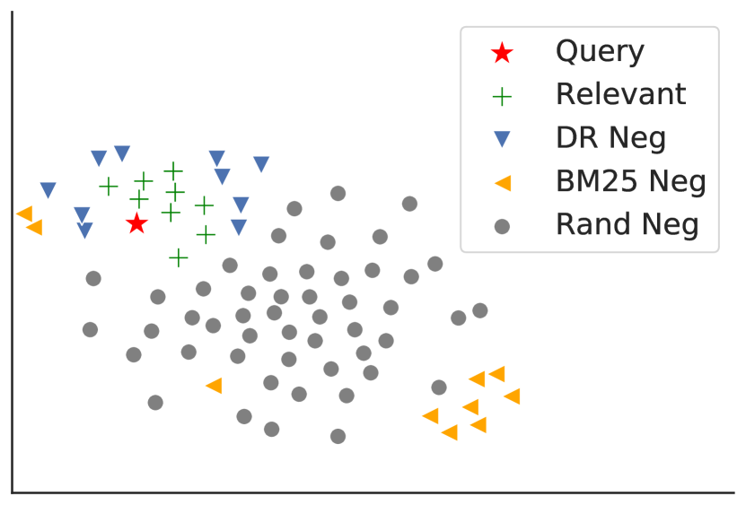
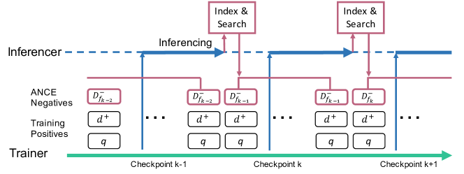
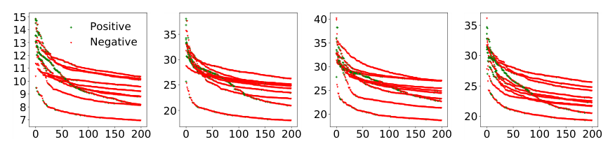
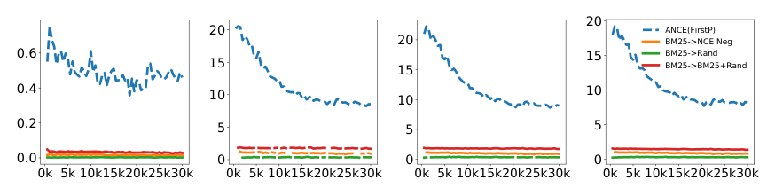
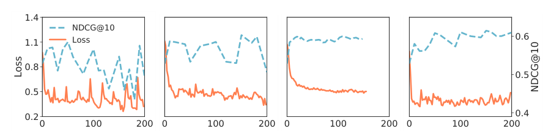
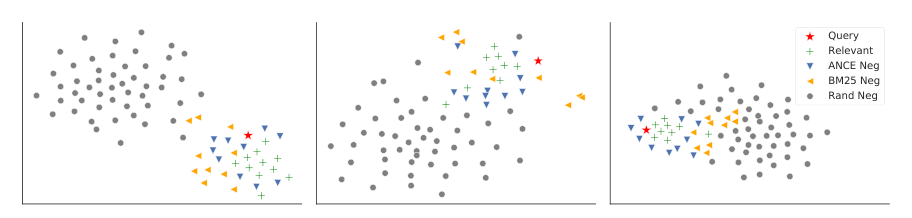
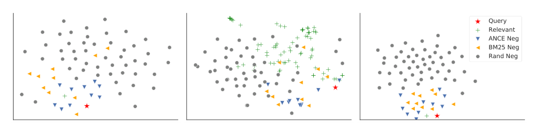

> 原文: [arXiv:2007.00808](https://arxiv.org/abs/2007.00808)（ICLR 2021 preprint）
> 说明: 本文为论文全文中文翻译，公式编号与原文一致；图表仅保留标题/说明的中译，数值表尽量原样保留数字。

**预印本信息：** arXiv:2007.00808v2 [cs.IR]，2020 年 10 月 20 日提交；会议版本：ICLR 2021。

**关键词（隐含）：** 稠密检索、负采样、对比学习、近似最近邻、表示学习、信息检索。

**代码与模型：** https://aka.ms/ance

# 近似最近邻负对比学习用于稠密文本检索（Approximate Nearest Neighbor Negative Contrastive Learning for Dense Text Retrieval）

**作者：** Lee Xiong\*、Chenyan Xiong\*、Ye Li、Kwok-Fung Tang、Jialin Liu、Paul Bennett、Junaid Ahmed、Arnold Overwijk

**单位：** Microsoft

**邮箱：** lexion, chenyan.xiong, yeli1, kwokfung.tang, jialliu, paul.n.bennett, jahmed, arnold.overwijk@microsoft.com

\* Lee 与 Chenyan 贡献相同。

---

## 摘要（Abstract）

在稠密表示空间中进行文本检索具有许多引人注目的优势。然而，端到端学习的稠密检索（Dense Retrieval, DR）往往表现不如基于词项的稀疏检索。本文首先从理论上表明，稠密检索的学习瓶颈在于：在 batch 内局部采样的无信息负样本占主导，导致梯度范数递减、随机梯度方差较大、学习收敛缓慢。随后我们提出近似最近邻负对比学习（Approximate nearest neighbor Negative Contrastive Learning, ANCE），一种利用异步更新的近似最近邻（Approximate Nearest Neighbor, ANN）索引，从整个语料库全局选取困难训练负样本的学习机制。实验表明 ANCE 在 Web 搜索、问答以及商业搜索引擎环境中均有效：ANCE 的点积检索精度几乎可匹敌基于 BERT 的级联信息检索（Information Retrieval, IR）流水线，同时效率提升约 100 倍。

---

## 1 引言（Introduction）

许多语言系统依赖文本检索作为第一步以找到相关信息。例如，搜索排序（Nogueira & Cho, 2019）、开放域问答（Open Domain Question Answering, OpenQA）（Chen et al., 2017）以及事实验证（Thorne et al., 2018）均先检索相关文档，再供后续重排序、机器阅读与推理模型使用。这些后续模型受益于深度学习技术的进步（Rajpurkar et al., 2016; Wang et al., 2018），而第一阶段检索仍主要依赖离散词袋匹配，例如 BM25，这已成为许多系统的瓶颈（Nogueira & Cho, 2019; Luan et al., 2020; Zhao et al., 2020）。

稠密检索（Dense Retrieval, DR）旨在通过在深度神经网络学习的连续表示空间中匹配文本，克服稀疏检索的瓶颈（Lee et al., 2019; Karpukhin et al., 2020; Luan et al., 2020）。它具有诸多理想性质：表示完全可学习、易于与预训练集成，并可借助近似最近邻（ANN）搜索获得效率支持（Johnson et al., 2019）。这使得稠密检索成为从根本上克服稀疏检索某些内在局限（例如词汇不匹配（Croft et al., 2010））的潜在有力选择。

DR 的一个关键挑战是在表示学习过程中构造合适的负样本（Karpukhin et al., 2020）。与重排序不同——其负样本自然来自前一检索阶段的不相关文档——在第一阶段检索中，DR 模型必须将相关文档与语料库中全部不相关文档区分开。如图 1 所示，这些全局负样本与稀疏模型检索到的负样本截然不同。

近期研究探索了多种为稠密检索构造负训练样本的方式（Huang et al., 2020; Karpukhin et al., 2020），例如使用对比学习（Contrastive Learning）（Faghri et al., 2017; Oord et al., 2018; He et al., 2019; Chen et al., 2020a）在当前或近期 mini-batch 中选取困难负样本。然而，如近期研究所观察到的（Karpukhin et al., 2020），batch 内局部负样本虽在学习词或视觉表示时有效，在稠密检索的表示学习中却并未显著优于稀疏检索得到的负样本。此外，稠密检索模型的精度常低于 BM25，尤其在文档检索上（Lee et al., 2019; Gao et al., 2020b; Luan et al., 2020）。

本文首先对带负采样的稠密检索训练收敛性进行理论分析。在方差缩减框架（Alain et al., 2015; Katharopoulos & Fleuret, 2018）下，我们表明：在稠密检索中常见的条件下，batch 内局部负样本导致梯度范数递减，进而带来高随机梯度方差与慢训练收敛——局部负采样是稠密检索有效性的瓶颈。

基于上述分析，我们提出近似最近邻噪声对比估计（Approximate nearest neighbor Negative Contrastive Estimation, ANCE），一种面向稠密检索的新对比表示学习机制。ANCE 不再使用随机或 batch 内局部负样本，而是利用正在优化的 DR 模型从整个语料库检索，构造全局负样本。这在根本上使训练负样本的分布与测试中需分离的不相关文档分布对齐。从方差缩减角度看，这些 ANCE 负样本抬升了单样本梯度范数的上界，降低随机梯度估计的方差，并加速学习收敛。

我们使用语料表示的异步更新 ANN 索引实现 ANCE。与 Guu et al. (2020) 类似，我们维护一个 Inferencer，并行地用 DR 模型近期 checkpoint 计算文档编码，并在完成后刷新用于负采样的 ANN 索引，以跟上模型训练。实验在三种文本检索场景展示 ANCE 的优势：标准 Web 搜索（Craswell et al., 2020）、OpenQA（Rajpurkar et al., 2016; Kwiatkowski et al., 2019），以及商业搜索引擎的检索系统。我们还通过实验验证理论：ANCE 采样负样本上的梯度范数远大于局部负样本，从而改善稠密检索模型的收敛。代码与训练模型见 https://aka.ms/ance。

**图 1：** t-SNE（Maaten & Hinton, 2008）表示可视化。图中展示查询（Query）、相关文档（Relevant）、稠密检索测试负样本（DR Neg）、BM25 检索负样本（BM25 Neg）与随机采样负样本（Rand Neg）在表示空间中的分布。可见：训练阶段常用的 BM25 负样本或随机负样本，与测试阶段 DR 模型需区分的不相关文档（DR Neg）在分布上差异显著；因此需要从全局语料、按当前 DR 模型检索结果构造负样本。

---

## 2 预备知识（Preliminaries）

本节讨论稠密检索及其表示学习的预备内容。

**任务定义：** 给定查询 $q$ 与语料库 $C$，第一阶段检索从 $C$ 中找出与查询相关的一组文档 $D^+ = \{d_1, \ldots, d_i, \ldots, d_n\}$（$|D^+| \ll |C|$），作为后续更复杂模型的输入（Croft et al., 2010）。稠密检索不使用稀疏词项匹配与倒排索引，而在学习的嵌入空间中用相似度计算检索得分 $f(\cdot)$（Lee et al., 2019; Luan et al., 2020; Karpukhin et al., 2020）：

$$
f(q, d) = \mathrm{sim}(g(q; \theta), g(d; \theta)), \tag{1}
$$

其中 $g(\cdot)$ 为将查询或文档编码为稠密嵌入的表示模型。编码器参数 $\theta$ 提供主要容量，常从预训练 Transformer（如 BERT（Lee et al., 2019））微调。相似度函数 $\mathrm{sim}(\cdot)$ 常为余弦或点积，以利用高效 ANN 检索（Johnson et al., 2019; Guo et al., 2020）。

**带负采样的学习：** DR 的有效性在于学习良好的表示空间：将查询与相关文档映射靠近，并分离不相关文档。该表示学习常遵循标准排序学习（Learning to Rank）（Liu, 2009）：给定查询 $q$、相关文档集 $D^+$ 与不相关文档集 $D^-$，求最优 $\theta^*$：

$$
\theta^* = \arg\min_\theta \sum_q \sum_{d^+ \in D^+} \sum_{d^- \in D^-} l(f(q, d^+), f(q, d^-)). \tag{2}
$$

损失 $l(\cdot)$ 可为二元交叉熵（Binary Cross Entropy, BCE）、hinge 损失或负对数似然（Negative Log Likelihood, NLL）。

面向第一阶段检索的稠密检索的独特挑战在于：需分离的不相关文档来自整个语料库（$D^- = C \setminus D^+$）。这往往导致数百万负样本，训练时必须采样：

$$
\theta^* = \arg\min_\theta \sum_q \sum_{d^+ \in D^+} \sum_{d^- \in \hat{D}^-} l(f(q, d^+), f(q, d^-)). \tag{3}
$$

自然选择是从 BM25 检索的 top 文档中采样负样本 $\hat{D}^-$。然而它们可能使 DR 模型偏向仅学习稀疏检索，难以显著超越 BM25（Luan et al., 2020）。另一种方式是在局部 mini-batch 内采样负样本，例如对比学习（Oord et al., 2018; Chen et al., 2020a），但这些局部负样本并未显著优于 BM25 负样本（Karpukhin et al., 2020; Luan et al., 2020）。

---

## 3 稠密检索训练收敛性分析（Analyses on the Convergence of Dense Retrieval Training）

本节对稠密检索中表示训练的收敛性给出理论分析。我们先展示学习收敛与梯度范数的联系，再说明无信息负样本对梯度范数的界，最后说明在稠密检索常见条件下 batch 内局部负样本为何无效。

**收敛率与梯度范数：** 设 $l(d^+, d^-) = l(f(q, d^+), f(q, d^-))$ 为训练三元组 $(q, d^+, d^-)$ 上的损失，$P_{D^-}$ 为给定 $(q, d^+)$ 的负采样分布，$p_{d^-}$ 为负样本 $d^-$ 的采样概率。带重要性采样（Importance Sampling）的随机梯度下降（Stochastic Gradient Descent, SGD）一步（Alain et al., 2015）为：

$$
\theta_{t+1} = \theta_t - \eta \frac{1}{N p_{d^-}} \nabla_\theta l(d^+, d^-), \tag{4}
$$

其中 $\theta_t$ 为第 $t$ 步参数，$\theta_{t+1}$ 为更新后参数，$N$ 为负样本总数。缩放因子 $\frac{1}{N p_{d^-}}$ 保证式 (4) 为全梯度的无偏估计。

于是可将该 SGD 步的收敛率刻画为向最优 $\theta^*$ 的移动。沿用方差缩减推导（Katharopoulos & Fleuret, 2018; Johnson & Guestrin, 2018），令 $g_{d^-} = \frac{1}{N p_{d^-}} \nabla_{\theta_t} l(d^+, d^-)$ 为加权梯度，收敛率为：

$$
\begin{aligned}
E\Delta_t &= \|\theta_t - \theta^*\|^2 - \mathbb{E}_{P_{D^-}}(\|\theta_{t+1} - \theta^*\|^2) \\
&= \|\theta_t\|^2 - 2\theta_t^\top \theta^* - \mathbb{E}_{P_{D^-}}(\|\theta_t - \eta g_{d^-}\|^2) + 2\theta^{*\top} \mathbb{E}_{P_{D^-}}(\theta_t - \eta g_{d^-}) \tag{5} \\
&= -\eta^2 \mathbb{E}_{P_{D^-}}(\|g_{d^-}\|^2) + 2\eta \theta_t^\top \mathbb{E}_{P_{D^-}}(g_{d^-}) - 2\eta \theta^{*\top} \mathbb{E}_{P_{D^-}}(g_{d^-}) \tag{6} \\
&= 2\eta \mathbb{E}_{P_{D^-}}(g_{d^-})^\top (\theta_t - \theta^*) - \eta^2 \mathbb{E}_{P_{D^-}}(\|g_{d^-}\|^2) \tag{7} \\
&= 2\eta \mathbb{E}_{P_{D^-}}(g_{d^-})^\top (\theta_t - \theta^*) - \eta^2 \mathbb{E}_{P_{D^-}}(\|g_{d^-}\|^2) \tag{8} \\
&= 2\eta \mathbb{E}_{P_{D^-}}(g_{d^-})^\top (\theta_t - \theta^*) - \eta^2 \mathbb{E}_{P_{D^-}}(g_{d^-}) \mathbb{E}_{P_{D^-}}(g_{d^-}) - \eta^2 \mathrm{Tr}(\mathrm{V}_{P_{D^-}}(g_{d^-})). \tag{9}
\end{aligned}
$$

这表明：通过从最小化梯度估计方差 $\mathbb{E}_{P_{D^-}}(\|g_{d^-}\|^2)$ 或 $\mathrm{Tr}(\mathrm{V}_{P_{D^-}}(g_{d^-}))$ 的分布 $P_{D^-}$ 采样（估计无偏），可获得更好收敛率。

存在最优分布：

$$
p^*_{d^-} = \arg\min_{p_{d^-}} \mathrm{Tr}(\mathrm{V}_{P_{D^-}}(g_{d^-})) \propto \|\nabla_{\theta_t} l(d^+, d^-)\|^2, \tag{10}
$$

即按单样本梯度范数比例采样。这是重要性采样中的已知结果（Alain et al., 2015; Johnson & Guestrin, 2018），可对梯度方差应用 Jensen 不等式并验证式 (10) 达到最小；证明从略，详见 Johnson & Guestrin (2018)。

直观上，梯度范数更大的负样本更可能显著降低训练损失，而梯度趋零者无信息。经验上，梯度范数与训练收敛的相关性在 BERT 微调中亦有观察（Mosbach et al., 2020）。

**无信息负样本的递减梯度：** 式 (10) 的最优（oracle）采样分布计算代价过高，且深度网络中梯度范数闭式可能复杂。但对 MLP，Katharopoulos & Fleuret (2018) 给出单样本梯度范数上界：

$$
\|\nabla_{\theta_t} l(d^+, d^-)\|^2 \leq L \rho \|\nabla_{\varphi_L} l(d^+, d^-)\|^2, \tag{11}
$$

其中 $L$ 为层数，$\rho$ 由中间层预激活权重与梯度组成，$\|\nabla_{\varphi_L} l(d^+, d^-)\|^2$ 为对最后一层的梯度。直观上，中间层受多种归一化约束；主要变化在 $\|\nabla_{\varphi_L} l(d^+, d^-)\|^2$（Katharopoulos & Fleuret, 2018）。

对常见排序损失（如 BCE 与 pairwise hinge），可验证（Katharopoulos & Fleuret, 2018）：

$$
l(d^+, d^-) \to 0 \Rightarrow \|\nabla_{\varphi_L} l(d^+, d^-)\|^2 \to 0 \Rightarrow \|\nabla_{\theta_t} l(d^+, d^-)\|^2 \to 0. \tag{12}
$$

直观上，损失近零的负样本梯度近零，对收敛贡献很小。稠密检索模型训练收敛依赖所构造负样本的信息量。

**batch 内局部负样本的无效性：** 我们认为 batch 内局部负样本难以提供有信息样本，原因来自文本检索的两条常见性质。

设 $D^{-*}$ 为与 $D^+$ 难以区分的有信息负样本集，$b$ 为 batch 大小，则：(1) $b \ll |C|$，batch 远小于语料；(2) $|D^{-*}| \ll |C|$，仅少数负样本有信息，语料绝大部分显然不相关。

两条性质在稠密检索基准上易于实验验证。二者合起来，随机 mini-batch 包含有信息负样本的概率 $p = \frac{b |D^{-*}|}{|C|^2}$ 接近零。从局部训练 batch 选取负样本，难以为稠密检索提供最优训练信号。

---

## 4 近似最近邻噪声对比估计（Approximate Nearest Neighbor Noise Contrastive Estimation）

分析表明，从语料库全局构造负样本重要乃至必要。本节提出近似最近邻噪声对比估计（Approximate nearest neighbor Negative Contrastive Estimation, ANCE），利用异步更新的 ANN 索引从整个语料库选取负样本。

ANCE 通过 DR 模型在 ANN 索引上检索的 top 文档采样负样本：

$$
\theta^* = \arg\min_\theta \sum_q \sum_{d^+ \in D^+} \sum_{d^- \in D^-_{\mathrm{ANCE}}} l(f(q, d^+), f(q, d^-)), \tag{13}
$$

其中 $D^-_{\mathrm{ANCE}} = \mathrm{ANN}_f(q,d) \setminus D^+$，$\mathrm{ANN}_f(q,d)$ 为 $f(\cdot)$ 在 ANN 索引上检索的 top 文档。按定义，$D^-_{\mathrm{ANCE}}$ 是当前 DR 模型最难的负样本：$D^-_{\mathrm{ANCE}} \approx D^{-*}$。理论上，这些更有信息的负样本具有更高训练损失、更高的梯度范数上界，将改善训练收敛。

ANCE 可用于训练任意稠密检索模型。为简洁，我们采用近期研究（Luan et al., 2020）的简单设置：BERT 孪生/双编码器（Siamese/Dual Encoder，$q$ 与 $d$ 共享）、点积相似度、NLL 损失。

**异步索引刷新：** 随机训练中，每 mini-batch 更新 DR 模型 $f(\cdot)$。维护与当前模型同步的 ANN 索引以选取最新的 ANCE 负样本具有挑战，因索引更新需两步：(1) **推理（Inference）**：用更新后的 DR 模型刷新语料库全部文档表示；(2) **索引（Index）**：用新表示重建 ANN 索引。索引构建高效（Johnson et al., 2019），但推理对每个 batch 过于昂贵——需对整个语料（远大于训练 batch）前向传播。

因此我们实现与 Guu et al. (2020) 类似的异步索引刷新：每 $m$ 个 batch 更新一次 ANN 索引，即使用 checkpoint $f_k$。如图 2，除 Trainer 外运行 Inferencer，取最新 checkpoint（如 $f_k$）重算整个语料编码；并行地，Trainer 继续用 $\mathrm{ANN}_{f_{k-1}}$ 的 $D^-_{f_{k-1}}$ 做随机学习。语料重编码完成后，Inferencer 更新 ANN 索引（$\mathrm{ANN}_{f_k}$）并交给 Trainer。

在此过程中，ANCE 负样本（$D^-_{\mathrm{ANCE}}$）异步更新以“追赶”随机训练。ANN 索引与 DR 优化之间的时滞（gap）取决于 Trainer 与 Inferencer 的计算资源分配。附录 A.3 表明 1:1 GPU 分配足以最小化该时滞的影响。

**图 2：** ANCE 异步训练。Trainer 用 ANN 索引中的负样本学习表示。Inferencer 用近期 checkpoint 更新语料文档表示，完成后用最新编码刷新 ANN 索引。

---

## 5 实验方法（Experimental Methodologies）

本节描述实验设置。更多细节见附录 A.1 与 A.2。

**基准：** Web 搜索实验使用 TREC 2019 Deep Learning（DL）Track 基准（Craswell et al., 2020），大规模即席（ad hoc）检索数据集。我们遵循官方指南，主要在检索设置下评估，也报告对 BM25 top 100 候选重排序的结果。OpenQA 实验使用 Natural Questions（NQ）（Kwiatkowski et al., 2019）与 TriviaQA（TQA）（Joshi et al., 2017），完全遵循 Karpukhin et al. (2020) 的设置。指标为 Coverage@20/100，评估 Top-20/100 检索段落是否包含答案。我们还评估 ANCE 更好检索能否带来更好答案精度：在 ANCE 而非 DPR 检索之上运行当前最优（SOTA）系统的 Reader——NQ 上用 RAG-Token（Lewis et al., 2020b），TQA 上用 DPR Reader，均采用其建议设置。

我们还研究 ANCE 在商业搜索引擎生产系统第一阶段检索中的有效性：将生产级 DR 模型训练改为 ANCE，在不同语料规模、编码维度、精确/近似搜索下评估离线增益。

**基线：** TREC DL 中包含相关类别最佳提交结果（run），更多基线分数见 Craswell et al. (2020)。我们实现近期 DR 基线：相同 BERT-Siamese，负样本构造不同——batch 内随机采样（Rand Neg）、BM25 top 100 随机采样（BM25 Neg）（Lee et al., 2019; Gao et al., 2020b）、BM25 与随机负样本 1:1 组合（BM25 + Rand Neg）（Karpukhin et al., 2020; Luan et al., 2020）。并与对比学习/噪声对比估计（Noise Contrastive Estimation, NCE）比较，其在 batch 内使用最难负样本（NCE Neg）（Gutmann & Hyvärinen, 2010; Oord et al., 2018; Chen et al., 2020a）。OpenQA 上与 DPR、BM25 及其组合比较（Karpukhin et al., 2020）。

**实现细节：** TREC DL 中，近期研究发现 MARCO 段落训练标签更干净（Yan et al., 2019），BM25 负样本有助于训练稠密检索（Karpukhin et al., 2020; Luan et al., 2020）。因此包含 “BM25 预热（BM25 Warm Up）” 设置（BM25 → ∗）：DR 模型先用 MARCO 官方 BM25 负样本训练。ANCE 亦经 BM25 负样本预热。TREC DL 中所有 DR 模型从 RoBERTa base（Liu et al., 2019）微调。OpenQA 中，用发布的 DPR checkpoint（Karpukhin et al., 2020）预热 ANCE。

为在 BERT-Siamese 中容纳长文档，ANCE 采用 Dai & Callan (2019b) 的两种设置：**FirstP** 使用文档前 512 token；**MaxP** 将文档切为 512-token 段落（最多 4 段），段落级分数 max-pooling，该操作 ANN 原生支持。ANN 搜索使用 Faiss IndexFlatIP（Johnson et al., 2019）。采用 1:1 Trainer:Inference GPU 分配，每 10k 训练 batch 刷新索引，batch size 8，4 GPU 上 gradient accumulation step 2。每个正样本从 ANN top 200 均匀采样一个负样本。ANCE 效率在单块 32GB V100 GPU 上测量，云 VM 配置 Intel(R) Xeon(R) Platinum 8168 CPU、650GB RAM。

---

## 6 评估结果（Evaluation Results）

本节先评估 ANCE 的有效性与效率，再依据理论通过实验研究 ANCE 训练收敛。

### 6.1 有效性与效率（Effectiveness and Efficiency）

TREC 2019 DL 基准结果见表 1。ANCE 显著优于所有稀疏检索，包括用 BERT 学习词项权重的 DeepCT（Dai et al., 2019）。在各种负样本构造机制中，ANCE 是唯一使 BERT-Siamese 在文档检索上稳定超越稀疏方法者。OpenQA 段落检索上也优于 DPR（表 2）。ANCE 有效性在生产环境（表 3）更明显，相对增益约 15%。更好检索确实带来更好答案精度——在 RAG（Lewis et al., 2020b）与 DPR 使用的相同 Reader 上（表 4）。

在所有 DR 模型中，ANCE 检索与重排序精度差距最小，表明训练检索模型时全局负样本的重要性。ANCE 检索几乎匹敌带交互式 BERT Reranker 的级联 IR 精度。这推翻了此前认为搜索中必须建模词项级交互的信念（Xiong et al., 2017; Qiao et al., 2019）。借助 ANCE，可学习有效捕获搜索相关性细微差别的表示空间。

表 5 测量 TREC DL 文档检索中 ANCE（FirstP）的效率。在线延迟为单查询检索 100 篇文档。标准 batching 的 DR 相对 BERT Rerank 约 100 倍加速——孪生网络与可预计算文档编码的自然收益。ANCE 训练中，主要计算是用新 checkpoint 更新训练语料编码。假设采样负样本与待学习模型相同，这不可避免，但可通过异步索引刷新缓解。

**表 1：** TREC 2019 Deep Learning Track 结果。不可用结果标 “n.a.”，不适用标 “–”。各类别最佳结果加粗。

| 方法 | MARCO Dev Passage Retrieval MRR@10 | MARCO Dev Passage Retrieval Recall@1k | TREC DL Passage NDCG@10 Rerank | TREC DL Passage NDCG@10 Retrieval | TREC DL Document NDCG@10 Rerank | TREC DL Document NDCG@10 Retrieval |
|------|-------------------------------------|----------------------------------------|--------------------------------|-----------------------------------|--------------------------------|-------------------------------------|
| **Sparse & Cascade IR** | | | | | | |
| BM25 | 0.240 | 0.814 | – | 0.506 | – | 0.519 |
| Best DeepCT | 0.243 | n.a. | – | n.a. | – | 0.554 |
| Best TREC Trad Retrieval | 0.240 | n.a. | – | 0.554 | – | 0.549 |
| BERT Reranker | – | – | 0.742 | – | 0.646 | – |
| **Dense Retrieval** | | | | | | |
| Rand Neg | 0.261 | 0.949 | 0.605 | 0.552 | 0.615 | 0.543 |
| NCE Neg | 0.256 | 0.943 | 0.602 | 0.539 | 0.618 | 0.542 |
| BM25 Neg | 0.299 | 0.928 | 0.664 | 0.591 | 0.626 | 0.529 |
| DPR (BM25 + Rand Neg) | 0.311 | 0.952 | 0.653 | 0.600 | 0.629 | 0.557 |
| BM25 → Rand | 0.280 | 0.948 | 0.609 | 0.576 | 0.637 | 0.566 |
| BM25 → NCE Neg | 0.279 | 0.942 | 0.608 | 0.571 | 0.638 | 0.564 |
| BM25 → BM25 + Rand | 0.306 | 0.939 | 0.648 | 0.591 | 0.626 | 0.540 |
| ANCE (FirstP) | 0.330 | 0.959 | 0.677 | 0.648 | 0.641 | 0.615 |
| ANCE (MaxP) | – | – | – | – | 0.671 | 0.628 |

**表 2：** Natural Questions（NQ）与 Trivia QA（TQA）检索结果（Top-20/100 答案覆盖率），设置来自 Karpukhin et al. (2020)。

| Retriever | Single Task NQ Top-20/100 | Single Task TQA Top-20/100 | Multi Task NQ Top-20/100 | Multi Task TQA Top-20/100 |
|-----------|---------------------------|----------------------------|--------------------------|---------------------------|
| BM25 | 59.1/73.7 | 66.9/76.7 | –/– | –/– |
| DPR | 78.4/85.4 | 79.4/85.0 | 79.4/86.0 | 78.8/84.7 |
| BM25+DPR | 76.6/83.8 | 79.8/84.5 | 78.0/83.9 | 79.9/84.4 |
| ANCE | 81.9/87.5 | 80.3/85.3 | 82.1/87.9 | 80.3/85.2 |

**表 3：** 商业搜索引擎第一阶段检索相对增益。增益来自将生产 DR 模型训练改为 ANCE。

| Corpus Size | Dim | Search | Gain |
|-------------|-----|--------|------|
| 250 Million | 768 | KNN | +18.4% |
| 8 Billion | 64 | KNN | +14.2% |
| 8 Billion | 64 | ANN | +15.5% |

**表 4：** 单任务 OpenQA 测试分数。ANCE+Reader 将系统检索从 DPR 换为 ANCE，Reader 不变：NQ 用 RAG-Token，TQA 用 DPR Reader。

| Model | NQ | TQA |
|-------|-----|-----|
| T5-11B (Roberts et al., 2020) | 34.5 | - |
| T5-11B + SSM (Roberts et al., 2020) | 36.6 | - |
| REALM (Guu et al., 2020) | 40.4 | - |
| DPR (Karpukhin et al., 2020) | 41.5 | 56.8 |
| DPR + BM25 (Karpukhin et al., 2020) | 39.0 | 57.0 |
| RAG-Token (Lewis et al., 2020b) | 44.1 | 55.2 |
| RAG-Sequence (Lewis et al., 2020b) | 44.5 | 56.1 |
| ANCE + Reader | 46.0 | 57.5 |

**表 5：** ANCE 搜索与训练效率。

| Operation | Offline | Online |
|-----------|---------|--------|
| BM25 Index Build | 3h | – |
| BM25 Retrieval | – | 37ms |
| BERT Rerank | – | 1.15s |
| Sparse IR Total (BM25 + BERT) | – | 1.42s |
| **ANCE Inference** | | |
| Encoding of Corpus/Per doc | 10h/4.5ms | – |
| Query Encoding | – | 2.6ms |
| ANN Retrieval (batched q) | – | 9ms |
| Dense Retrieval Total | – | 11.6ms |
| **ANCE Training** | | |
| Encoding of Corpus/Per doc | 10h/4.5ms | – |
| ANN Index Build | 10s | – |
| Neg Construction Per Batch | 72ms | – |
| Back Propagation Per Batch | 19ms | – |

**图 3：** 10 条随机 TREC DL 测试查询的 top DR 分数。横轴为排序位次，纵轴为检索分数减语料平均分。所有模型经 BM25 Neg 预热。百分数为测试与训练负样本在接近收敛时的重叠率。(a) ANCE FirstP (100%)；(b) NCE Neg (0%)；(c) Rand Neg (0%)；(d) BM25+Rand (7%)。

图 3 中 “Positive” 表示相关文档，“Negative” 表示各类负样本。子图 (a) 显示 ANCE 训练负样本与测试阶段 DR 检索的 top 负样本完全重叠；(b)(c) 显示 NCE Neg 与 Rand Neg 与测试负样本重叠率为 0%；(d) 显示 BM25+Rand 仅有 7% 重叠。

### 6.2 训练收敛的 empirical 分析（Empirical Analyses on Training Convergence）

我们首先展示稠密检索中搜索相关性的长尾分布。如图 3，每个查询仅有少数实例具有显著更高检索分数，多数构成长尾。检索/排序的关键挑战是在最高分文档中区分相关者；其余显然不相关。我们还通过实验测量 batch 内局部负样本包含有信息负样本（$D^{-*}$）的概率——通过与 top 100 最高分负样本的重叠。该概率在使用 NCE Neg 或 Rand Neg 时为零，与理论假设一致。相比之下，BM25 Neg 与 top DR 检索负样本重叠 15%，ANCE 负样本重叠从 63% 起并按设计收敛至 100%。

随后通过实验验证理论：局部负样本导致更低损失、有界梯度范数、从而慢收敛。图 4 绘制 DR 训练（BM25 预热后）的训练损失与 clip 前梯度范数。如预期，无信息局部负样本极易分离，训练损失近零；ANCE 全局负样本更难，维持高训练损失。与理论假设一致，局部负样本梯度范数被限制在近零。相比之下，ANCE 全局负样本梯度范数大数个数量级。这确认 ANCE 更好近似最优重要性采样分布 $p^*_{d^-} \propto \|\nabla_{\theta_t} l(d^+, d^-)\|^2$，并改善学习收敛。

**图 4：** DR 训练（BM25 预热后）的损失与梯度范数。梯度范数分别对应 BERT 底层（1–4）、中层（5–8）、顶层（9–12）。横轴为训练步数。子图 (a) 为训练损失；(b)(c)(d) 分别为底层、中层、顶层梯度范数。可见 ANCE 在各层均维持更大梯度范数，而局部负样本方法梯度迅速衰减。

### 6.3 讨论（Discussions）

我们使用 BERT-Siamese 与 NLL 损失以与近期研究一致。我们也实验余弦相似度与 BCE/hinge 损失，观察到局部负样本上更小的梯度范数，但检索精度提升不大。附录含额外实验。A.2 讨论稠密与稀疏检索结果出人意料地小重叠（<25%）。DR 是根本不同路径，需更多研究理解其行为。A.3 与 A.4 研究异步时滞与超参。A.5 案例表明 ANCE 的不相关文档常仍“语义相关”，与稀疏检索构造的负样本非常不同。

---

## 7 相关工作（Related Work）

早期神经信息检索（Neural Information Retrieval, Neu-IR）研究（Mitra et al., 2018）中，常见信念是交互模型——专门处理词项级匹配——更有效但更贵（Guo et al., 2016; Xiong et al., 2017; Nogueira & Cho, 2019）。诸多技术降低其成本，如蒸馏（Gao et al., 2020a）与缓存（Humeau et al., 2020; Khattab & Zaharia, 2020; MacAvaney et al., 2020）。ANCE 表明，经恰当训练的基于表示的 BERT-Siamese 事实上与基于交互的 BERT 排序器同样有效。该发现将激励 Neu-IR 诸多新探索。

深度学习已用于改进稀疏检索各组件，如词项加权（Dai & Callan, 2019b）、查询扩展（Zheng et al., 2020）、文档扩展（Nogueira et al., 2019）。稠密检索选择不同路径，纯在嵌入空间经 ANN 搜索检索（Lee et al., 2019; Chang et al., 2020; Karpukhin et al., 2020; Luan et al., 2020）。本工作表明简单稠密检索系统可达当前最优（SOTA）精度，且与经典检索行为显著不同。稠密检索近期进展或催生新一代搜索系统。

对比表示学习近期研究亦显示从更大候选池采样负样本的收益。计算机视觉中，He et al. (2019) 通过维护近期 batch 的负候选池并用 momentum 更新其表示，解耦负采样池大小与训练 batch 大小；扩大负池显著改善无监督视觉表示学习（Chen et al., 2020b）。并行工作（Xiong et al., 2020）通过 memory bank（Wu et al., 2018）采样负样本改进 DPR——负候选表示冻结以存储更多候选。ANCE 沿此轨迹更进一步：用异步更新 ANN 索引从整个语料库全局构造负样本。

除自身为现实应用外，稠密检索也是许多语言系统的核心组件，例如为 grounded 语言模型检索相关信息（Khandelwal et al., 2019; Guu et al., 2020）、抽取/生成式 QA（Karpukhin et al., 2020; Lewis et al., 2020b）与事实验证（Xiong et al., 2020），或找预训练释义对（Lewis et al., 2020a）。其中稠密检索模型或冻结，或经下游任务信号间接优化。ANCE 与这些研究正交，聚焦稠密检索的表示学习；其更好检索精度可惠及诸多语言系统。

---

## 8 结论（Conclusion）

本文首先对稠密检索表示学习收敛性给出理论分析。我们表明：在文本检索常见条件下，DR 训练中使用的局部负样本无信息，梯度范数低，对收敛贡献小。随后提出 ANCE，通过从整个语料库全局构造训练负样本消除该瓶颈。实验在 Web 搜索、OpenQA 与商业搜索引擎生产系统展示 ANCE 优势。研究通过实验验证理论：ANCE 负样本梯度范数大得多，降低随机梯度方差，改善训练收敛。

---

**表 6：** TREC 2019 DL Track 标签在稠密检索方法上的覆盖率。与 BM25 重叠在 top 100 检索文档上计算。

| Method | TREC DL Passage Recall@1K | TREC DL Passage Hole@10 | TREC DL Passage Overlap w. BM25 | TREC DL Document Recall@100 | TREC DL Document Hole@10 | TREC DL Document Overlap w. BM25 |
|--------|---------------------------|-------------------------|----------------------------------|----------------------------|---------------------------|----------------------------------|
| BM25 | 0.685 | 5.9% | 100% | 0.387 | 0.2% | 100% |
| BM25 Neg | 0.569 | 25.8% | 11.9% | 0.217 | 28.1% | 17.9% |
| BM25 + Rand Neg | 0.662 | 20.2% | 16.4% | 0.240 | 21.4% | 21.0% |
| ANCE (FirstP) | 0.661 | 14.8% | 17.4% | 0.266 | 13.3% | 24.4% |
| ANCE (MaxP) | - | - | - | 0.286 | 11.9% | 24.9% |

---

## 附录（Appendix）

### A.1 更多实验细节（More Experimental Details）

**TREC DL 基准更多细节：** TREC DL 2019 Track 有两项任务：文档检索与段落检索。训练与开发集来自 MS MARCO，含一百万 Bing 查询的段落级相关标签（Bajaj et al., 2016）。文档语料通过回填段落 URL 正文构造，标签继承自段落（Craswell et al., 2020）。测试集由 NIST 评估员对往届 Track 参与者 top 10 排序结果标注（Craswell et al., 2020）。

TREC DL 官方指标含测试 NDCG@10 与 MARCO Passage Dev MRR@10。MARCO Document Dev 噪声较大，且 DR 结果标签覆盖低使 DL Track 测试 recall 意义有限。段落训练数据构造与全文回填间隔约两年，部分原文档已不可用；两年间文档内容亦有相当变化，许多不再含原段落。该回填或是许多 Track 参与者发现段落训练数据比继承文档标签更有效的原因。注意 TREC 测试标签不受影响——标注时提供相同文档内容。

所有 TREC DL 提交结果（run）用上述训练数据训练。文档与段落检索任务测试查询的推理结果由 NIST 评估员用标准 TREC 合并评估（pooling）评估（Voorhees, 2000）。合并深度为 10，即评估所有参与 run 的 top 10，这些评估标签作为官方 TREC DL 段落与文档检索基准发布。

**OpenQA 实验更多细节：** 所有 DPR 相关实验设置、基线系统与 DPR Reader 基于其开源库¹。RAG-Token reader 使用 huggingface² 开源发布。实验时 huggingface 的 RAG-Seq 尚不稳定，故 OpenQA 选用 RAG-Token。RAG 仅发布 NQ 模型，TriviaQA 用 DPR reader。NQ 上向 RAG-Token 喂 ANCE top 20 段落，向 DPR BERT Reader 喂 top 100，遵循开源代码指南。

**基线更多细节：** TREC DL 最具代表性的稀疏检索基线包括标准 BM25（“bm25base” 或 “bm25base_p”）、带调参查询扩展的最佳 TREC 稀疏检索（“bm25tuned_rm3” 或 “bm25tuned_prf_p”）（Lavrenko & Croft, 2017）、最佳 DeepCT（“dct_tp_bm25e2”，仅 doc），用 BERT 估计 BM25 词项重要性（Dai & Callan, 2019a）。三者分别代表标准稀疏检索、最佳经典稀疏检索、以及用 BERT 改进稀疏检索的近期进展。我们还包含标准级联检索-重排序系统 BERT Reranker（“bm25exp_marcomb” 或 “p_exp_rm3_bert”），即在查询/文档扩展之上用标准 BERT 的最佳提交结果，来自多个 top MARCO run 的组（Nogueira & Cho, 2019; Nogueira et al., 2019）。

**BERT-Siamese 配置：** 所有稠密检索方法遵循 Luan et al. (2020) 的网络配置，我们发现其最稳定。具体地，用 RoBERTa base（Liu et al., 2019）初始化 BERT-Siamese，在最后一层 “[CLS]” token 上加 $768 \times 768$ 投影层，接 layer norm。

**实现细节：** 训练常约每 ANCE epoch 1–2 小时——新 ANCE 负样本就绪即替换训练中现有负样本，不等待。约 10 epoch 收敛，与其他 DR 基线类似。优化用 LAMB，文档检索学习率 5e-6、段落 1e-6，5000 步后线性 warm-up 与 decay。更详细超参见代码发布。

¹ https://github.com/facebookresearch/DPR  
² https://huggingface.co/transformers/master/model_doc/rag.html

**图 5：** 文档上 ANCE（FirstP）的训练损失与测试 NDCG，不同 ANN 索引刷新（如每 10k Batch）、Trainer:Inferencer GPU 分配与学习率（如 1e-5）。横轴为训练步数（千）。

**表 7：** 若干超参配置结果。“Top K Neg” 为采样 ANCE 负样本所来自的 top k ANN 检索候选。

| 配置 | Learning rate | Top K Neg | Refresh (step) | MARCO Dev Passage Retrieval MRR@10 | TREC DL Document Retrieval NDCG@10 |
|------|---------------|-----------|----------------|-------------------------------------|-------------------------------------|
| Passage ANCE | 1e-6 | 200 | 10k | 0.33 | – |
| Passage ANCE | 1e-6 | 500 | 10k | 0.31 | – |
| Passage ANCE | 2e-6 | 200 | 10k | 0.29 | – |
| Passage ANCE | 2e-7 | 500 | 20k | 0.303 | – |
| Passage ANCE | 2e-7 | 1000 | 20k | 0.302 | – |
| Document ANCE | 1e-5 | 100 | 10k | – | 0.58 |
| Document ANCE | 1e-6 | 100 | 20k | – | 0.59 |
| Document ANCE | 1e-6 | 100 | 5k | – | 0.60 |
| Document ANCE | 5e-6 | 200 | 10k | – | 0.614 |
| Document ANCE | 1e-6 | 200 | 10k | – | 0.61 |

### A.2 与 TREC 2019 DL Track 稀疏检索的重叠（Overlap with Sparse Retrieval in TREC 2019 DL Track）

TREC 式合并（pooling）评估的自然结果是：仅 2019 TREC 参与系统 top 10 内的结果被标注。因此未入合并池（pool）、未标注的文档均视为不相关，其中可能仍有相关文档。复用 TREC 式相关标签时，必须跟踪评估系统的 “空洞率（hole rate）”，即 top K 排序结果中无 TREC 标签（不在 pool 中）的比例。空洞率越大，说明评估方法与参与 Track 并贡献 pool 的系统差异越大，评估结果并不完美。注意空洞率不一定反映系统精度，仅反映差异。

TREC 2019 Deep Learning Track 中，参与系统均基于稀疏检索。稠密检索常与稀疏检索差异显著，一般会检索许多新文档。表 6 证实：所有 DR 方法在 top 100 检索文档上与官方 BM25 重叠很低，DR 检索文档最多仅约 25% 也被 BM25 检索到。这使空洞率相当高、recall 指标参考价值有限，也表明若参与者贡献 DR 系统，DR 方法或在 TREC 2020 Deep Learning Track 受益更多。

MS MARCO 排序标签并非基于稀疏检索结果合并构造，而来自 Bing（Bajaj et al., 2016），使用词项重叠之外的诸多信号。这使 MS MARCO 的 recall 更稳健，反映单一模型能否恢复复杂在线系统。

### A.3 异步时滞的影响（Impact of Asynchronous Gap）

图 5 展示不同配置下异步学习行为。大学习率或低刷新率（图 5(a)(b)）导致波动，因 ANN 索引的异步时滞可能将表示学习驱向不期望的局部最优。每 5k Batch 刷新可平滑收敛（图 5(c)），但需 Inferencer 分配两倍 GPU。Trainer 与 Inference 1:1 GPU 分配配合适当学习率，足以最小化异步时滞影响。

图 5 四组配置分别为：(a) 每 10k batch 刷新、4:4 GPU、学习率 1e-5；(b) 每 20k batch 刷新、8:4 GPU、1e-6；(c) 每 5k batch 刷新、4:8 GPU、1e-6；(d) 每 10k batch 刷新、4:4 GPU、5e-6。横轴为训练步数（千）。

### A.4 超参研究（Hyperparameter Studies）

表 7 展示部分超参配置结果。BERT 训练成本使大量超参探索困难；失败配置常在训练早期发散。因预训练语言模型耗时，我们几乎未探索其他配置。DR 模型架构与近期并行工作一致，表 7 学习配置即我们几乎全部探索。多数超参仅凭训练损失曲线决定，否则凭 MARCO Dev 损失。我们发现训练损失、验证 NDCG 与测试表现在我们（有限）超参探索中一致性良好。

### A.5 案例研究（Case Studies）

本节展示 ANCE 与 BM25 的胜负案例。TREC 2019 DL Track 文档任务 43 条评估查询中，ANCE 在 29 条优于 BM25，13 条劣于 BM25，1 条持平。获胜示例见表 8，失败见表 9。对应 ANCE 学习（FirstP）表示的 t-SNE 见图 6 与图 7。

总体上，ANCE 更好捕获文档语义及其与查询的相关性。获胜案例展示稀疏检索内在局限。例如 BM25 在查询 “what is the most popular food in Switzerland” 中精确匹配 “most popular food”，但文档关于 Mexico；“Switzerland” 仅出现在网页相关问题区。

表 9 的失败案例亦颇具启发。多次发现并非 DR 完全失败、检索与查询信息需求完全无关的文档——这是我们开始 DR 研究时的大担忧。ANCE 错误包括：检索相关但不完全匹配查询的文档，例如 “yoga pose” 对 “bow in yoga”；或因缺乏领域知识检索错误文档——预训练语言模型可能不知 “active margin” 是地理术语而非金融术语（我们案例研究时也花时间才弄清）。亦有稠密检索文档对我们合理但被标为不相关的案例。

图 6 与图 7 的 t-SNE 展示学习表示空间的诸多有趣模式。ANCE 获胜案例常对应不同文档组的清晰分离；失败案例表示空间更混杂，或相关文档过少导致性能方差。ANCE 学习表示空间亦有诸多不同有趣模式。我们在补充材料（supplementary material）中包含全部 43 条 TREC DL Track 查询的 t-SNE 图。对未来表示空间已学习模式的更多分析或有助于理解稠密检索。

**表 8：** TREC 2019 DL Track 文档排序任务中 ANCE 优于 BM25 的查询。片段手工提取。展示首个分歧排序位的文档，所有示例 ANCE 获胜。列出对应查询上 ANCE 与 BM25 的 NDCG@10。

| 字段 | ANCE | BM25 |
|------|------|------|
| **Query 1** | qid (104861): Cost of interior concrete flooring | |
| Title | Concrete network: Concrete Floor Cost Pinterest: Types of Flooring | |
| DocNo | D293855 | D2692315 |
| Snippet | 对于基础装修的混凝土地面，每平方米约 2–12 美元……（原文：For a concrete floor with a basic finish, you can expect to pay $2 to $12 per square foot. . .） |  hardwood 地板类型介绍……（原文：Know About Hardwood Flooring And Its Types White Oak Floors Oak Flooring Laminate Flooring In Bathroom . . .） |
| Ranking Position | 1 | 1 |
| TREC Label | 3 (Very Relevant) | 0 (Irrelevant) |
| NDCG@10 | 0.86 | 0.15 |
| **Query 2** | qid (833860): What is the most popular food in Switzerland | |
| Title | Wikipedia: Swiss cuisine | Answers.com: Most popular traditional food dishes of Mexico |
| DocNo | D1927155 | D3192888 |
| Snippet | Swiss cuisine bears witness to many regional influences, . . . Switzerland was historically a country of farmers, so traditional Swiss dishes tend not to be. . . | One of the most popular traditional Mexican deserts is a spongy cake . . . (in the related questions section) What is the most popular food dish in Switzerland?. . . |
| Ranking Position | 1 | 1 |
| TREC Label | 3 (Very Relevant) | 0 (Irrelevant) |
| NDCG@10 | 0.90 | 0.14 |
| **Query 3** | qid (1106007): Define visceral | |
| Title | Vocabulary.com: Visceral | Quizlet.com: A&P EX3 autonomic 9-10 |
| DocNo | D542828 | D830758 |
| Snippet | When something's visceral, you feel it in your guts. A visceral feeling is intuitive — there might not be a rational explanation, but you feel that you know what's best. . . | Acetylcholine A neurotransmitter liberated by many peripheral nervous system neurons and some central nervous system neurons. . . |
| Ranking Position | 1 | 1 |
| TREC Label | 3 (Very Relevant) | 0 (Irrelevant) |
| NDCG@10 | 0.80 | 0.14 |

**图 6：** 表 8 获胜案例的 t-SNE 图。(a) 104861: interior flooring cost；(b) 833860: popular Swiss food；(c) 1106007: define visceral。图例：Query（查询）、Relevant（相关文档）、ANCE Neg、BM25 Neg、Rand Neg。

**表 9：** TREC 2019 DL Track 文档排序任务中 ANCE 劣于 BM25 的查询。片段手工提取。展示 BM25 获胜的首位文档。列出对应查询 NDCG@10。查询中的拼写错误来自 TREC 真实 Web 搜索查询。

| 字段 | ANCE | BM25 |
|------|------|------|
| **Query 1** | qid (182539): Example of monotonic function | |
| Title | Wikipedia: Monotonic function | Explain Extended: Things SQL needs: sargability of monotonic functions |
| DocNo | D510209 | D175960 |
| Snippet | In mathematics, a monotonic function (or monotone function) is a function between ordered sets that preserves or reverses the given order... For example, if y=g(x) is strictly monotonic on the range [a,b] . . . | I'm going to write a series of articles about the things SQL needs to work faster and more efficienly. . . |
| Ranking Position | 1 | 1 |
| TREC Label | 0 (Irrelevant) | 2 (Relevant) |
| NDCG@10 | 0.25 | 0.61 |
| **Query 2** | qid (1117099): What is a active margin | |
| Title | Wikipedia: Margin (finance) | Yahoo Answer: What is the difference between passive and active continental margins |
| DocNo | D166625 | D2907204 |
| Snippet | In finance, margin is collateral that the holder of a financial instrument . . . | An active continental margin is found on the leading edge of the continent where ... |
| Ranking Position | 2 | 2 |
| TREC Label | 0 (Irrelevant) | 3 (Very Relevant) |
| NDCG@10 | 0.44 | 0.74 |
| **Query 3** | qid (1132213): How long to hold bow in yoga | |
| Title | Yahoo Answer: How long should you hold a yoga pose for | yogaoutlet.com: How to do bow pose in yoga |
| DocNo | D3043610 | D3378723 |
| Snippet | so i've been doing yoga for a few weeks now and already notice that my flexibility has increased drastically. . . . That depends on the posture itself . . . | Bow Pose is an intermediate yoga backbend that deeply opens the chest and the front of the body. . . Hold for up to 30 seconds . . . |
| Ranking Position | 3 | 3 |
| TREC Label | 0 (Irrelevant) | 3 (Very Relevant) |
| NDCG@10 | 0.66 | 0.74 |

**图 7：** 表 9 失败案例的 t-SNE 图。(a) 182539: monotonic function；(b) 1117099: active margin；(c) 1132213: yoga bow。失败案例中查询与 ANCE Neg、Relevant 在表示空间中距离更近，说明模型仍捕捉到语义相关性，但未能精确匹配标注者的相关判断。

---

*翻译说明：本文依据 arXiv:2007.00808v2 预印本全文译出；专有名词首次出现处括注英文；公式编号与原文一致。*

---

## 参考文献（References）

Guillaume Alain, Alex Lamb, Chinnadhurai Sankar, Aaron Courville, and Yoshua Bengio. Variance reduction in sgd by distributed importance sampling. arXiv preprint arXiv:1511.06481, 2015.  
（分布式重要性采样下的 SGD 方差缩减）

Payal Bajaj, Daniel Campos, Nick Craswell, Li Deng, Jianfeng Gao, Xiaodong Liu, Rangan Majumder, Andrew McNamara, Bhaskar Mitra, Tri Nguyen, et al. Ms marco: A human generated machine reading comprehension dataset. arXiv preprint arXiv:1611.09268, 2016.  
（MS MARCO：人工生成的机器阅读理解数据集）

Wei-Cheng Chang, Felix X Yu, Yin-Wen Chang, Yiming Yang, and Sanjiv Kumar. Pre-training tasks for embedding-based large-scale retrieval. arXiv preprint arXiv:2002.03932, 2020.  
（面向基于嵌入的大规模检索的预训练任务）

Danqi Chen, Adam Fisch, Jason Weston, and Antoine Bordes. Reading wikipedia to answer open-oomain questions. In Proceedings of the 55th Annual Meeting of the Association for Computational Linguistics, pp. 1870–1879, 2017.  
（读 Wikipedia 回答开放域问题）

Ting Chen, Simon Kornblith, Mohammad Norouzi, and Geoffrey Hinton. A simple framework for contrastive learning of visual representations. arXiv preprint arXiv:2002.05709, 2020a.  
（视觉表示对比学习的简单框架）

Xinlei Chen, Haoqi Fan, Ross Girshick, and Kaiming He. Improved baselines with momentum contrastive learning. arXiv preprint arXiv:2003.04297, 2020b.  
（动量对比学习的改进基线）

Nick Craswell, Bhaskar Mitra, Emine Yilmaz, Daniel Campos, and Ellen M. Voorhees. Overview of the trec 2019 deep learning track. In Text REtrieval Conference (TREC). TREC, 2020.  
（TREC 2019 深度学习赛道概述）

W Bruce Croft, Donald Metzler, and Trevor Strohman. Search engines: information retrieval in practice, volume 520. Addison-Wesley Reading, 2010.  
（搜索引擎：信息检索实践）

Zhuyun Dai and Jamie Callan. Context-aware sentence/passage term importance estimation for first stage retrieval. arXiv preprint arXiv:1910.10687, 2019a.  
（第一阶段检索的上下文感知句/段落词项重要性估计）

Zhuyun Dai and Jamie Callan. Deeper text understanding for ir with contextual neural language modeling. In Proceedings of the 42nd International ACM SIGIR Conference on Research and Development in Information Retrieval, pp. 985–988, 2019b.  
（基于上下文神经语言模型的 IR 更深文本理解）

Zihang Dai, Zhilin Yang, Yiming Yang, Jaime Carbonell, Quoc Le, and Ruslan Salakhutdinov. Transformer-XL: attentive language models beyond a fixed-length context. In Proceedings of the 57th Annual Meeting of the Association for Computational Linguistics, pp. 2978–2988, 2019.  
（Transformer-XL：超越固定长度上下文的注意力语言模型）

Fartash Faghri, David J Fleet, Jamie Ryan Kiros, and Sanja Fidler. Vse++: Improving visual-semantic embeddings with hard negatives. arXiv preprint arXiv:1707.05612, 2017.  
（VSE++：用困难负样本改进视觉-语义嵌入）

Luyu Gao, Zhuyun Dai, and Jamie Callan. Understanding bert rankers under distillation. In Proceedings of the 2020 ACM SIGIR on International Conference on Theory of Information Retrieval, pp. 149–152, 2020a.  
（蒸馏下理解 BERT 排序器）

Luyu Gao, Zhuyun Dai, Zhen Fan, and Jamie Callan. Complementing lexical retrieval with semantic residual embedding. arXiv preprint arXiv:2004.13969, 2020b.  
（用语义残差嵌入补充词法检索）

Jiafeng Guo, Yixing Fan, Qingyao Ai, and W Bruce Croft. A deep relevance matching model for ad-hoc retrieval. In Proceedings of the 25th ACM International on Conference on Information and Knowledge Management, pp. 55–64, 2016.  
（ad hoc 检索的深度相关性匹配模型）

Ruiqi Guo, Philip Sun, Erik Lindgren, Quan Geng, David Simcha, Felix Chern, and Sanjiv Kumar. Accelerating large-scale inference with anisotropic vector quantization. arXiv preprint arXiv:1908.10396, 2020.  
（各向异性向量量化加速大规模推理）

Michael Gutmann and Aapo Hyvärinen. Noise-contrastive estimation: a new estimation principle for unnormalized statistical models. In Proceedings of the 13th International Conference on Artificial Intelligence and Statistics, pp. 297–304, 2010.  
（噪声对比估计：非归一化统计模型的新估计原理）

Kelvin Guu, Kenton Lee, Zora Tung, Panupong Pasupat, and Ming-Wei Chang. Realm: retrieval-augmented language model pre-training. arXiv preprint arXiv:2002.08909, 2020.  
（REALM：检索增强语言模型预训练）

Kaiming He, Haoqi Fan, Yuxin Wu, Saining Xie, and Ross Girshick. Momentum contrast for unsupervised visual representation learning. arXiv preprint arXiv:1911.05722, 2019.  
（无监督视觉表示学习的动量对比）

Jui-Ting Huang, Ashish Sharma, Shuying Sun, Li Xia, David Zhang, Philip Pronin, Janani Padmanabhan, Giuseppe Ottaviano, and Linjun Yang. Embedding-based retrieval in facebook search. In Proceedings of the 26th ACM SIGKDD International Conference on Knowledge Discovery & Data Mining, pp. 2553–2561, 2020.  
（Facebook 搜索中的基于嵌入检索）

Samuel Humeau, Kurt Shuster, Marie-Anne Lachaux, and Jason Weston. Poly-encoders: architectures and pre-training strategies for fast and accurate multi-sentence scoring. In International Conference on Learning Representations, 2020.  
（Poly-encoders：快速准确多句打分的架构与预训练策略）

Jeff Johnson, Matthijs Douze, and Hervé Jégou. Billion-scale similarity search with gpus. IEEE Transactions on Big Data, 2019.  
（GPU 十亿级相似度搜索）

Tyler B Johnson and Carlos Guestrin. Training deep models faster with robust, approximate importance sampling. In Advances in Neural Information Processing Systems, pp. 7265–7275, 2018.  
（鲁棒近似重要性采样加速深度模型训练）

Mandar Joshi, Eunsol Choi, Daniel S Weld, and Luke Zettlemoyer. Triviaqa: a large scale distantly supervised challenge dataset for reading comprehension. In Proceedings of the 55th Annual Meeting of the Association for Computational Linguistics, pp. 1601–1611, 2017.  
（TriviaQA：大规模远程监督阅读理解挑战数据集）

Vladimir Karpukhin, Barlas Oğuz, Sewon Min, Ledell Wu, Sergey Edunov, Danqi Chen, and Wen-tau Yih. Dense passage retrieval for open-domain question answering. arXiv preprint arXiv:2004.04906, 2020.  
（开放域问答的稠密段落检索）

Angelos Katharopoulos and François Fleuret. Not all samples are created equal: Deep learning with importance sampling. arXiv preprint arXiv:1803.00942, 2018.  
（样本并非同等重要：重要性采样深度学习）

Urvashi Khandelwal, Omer Levy, Dan Jurafsky, Luke Zettlemoyer, and Mike Lewis. Generalization through memorization: Nearest neighbor language models. arXiv preprint arXiv:1911.00172, 2019.  
（通过记忆泛化：最近邻语言模型）

Omar Khattab and Matei Zaharia. Colbert: Efficient and effective passage search via contextualized late interaction over bert. arXiv preprint arXiv:2004.12832, 2020.  
（ColBERT：基于 BERT 上下文后期交互的高效段落搜索）

Tom Kwiatkowski, Jennimaria Palomaki, Olivia Redfield, Michael Collins, Ankur Parikh, Chris Alberti, Danielle Epstein, Illia Polosukhin, Jacob Devlin, Kenton Lee, et al. Natural questions: a benchmark for question answering research. Transactions of the Association for Computational Linguistics, 7:453–466, 2019.  
（Natural Questions：问答研究基准）

Victor Lavrenko and W Bruce Croft. Relevance-based language models. In Association for Computing Machinery (ACM) Special Interest Group on Information Retrieval (SIGIR) Forum, volume 51, pp. 260–267. ACM New York, NY, USA, 2017.  
（基于相关性的语言模型）

Kenton Lee, Ming-Wei Chang, and Kristina Toutanova. Latent retrieval for weakly supervised open domain question answering. In Proceedings of the 57th Annual Meeting of the Association for Computational Linguistics, pp. 6086–6096, 2019.  
（弱监督开放域问答的潜在检索）

Mike Lewis, Marjan Ghazvininejad, Gargi Ghosh, Armen Aghajanyan, Sida Wang, and Luke Zettlemoyer. Pre-training via paraphrasing. arXiv preprint arXiv:2006.15020, 2020a.  
（通过释义预训练）

Patrick Lewis, Ethan Perez, Aleksandara Piktus, Fabio Petroni, Vladimir Karpukhin, Naman Goyal, Heinrich Küttler, Mike Lewis, Wen-tau Yih, Tim Rocktäschel, et al. Retrieval-augmented generation for knowledge-intensive nlp tasks. arXiv preprint arXiv:2005.11401, 2020b.  
（知识密集型 NLP 任务的检索增强生成）

Tie-Yan Liu. Learning to rank for information retrieval. Foundations and trends in information retrieval, 3(3):225–331, 2009.  
（信息检索排序学习）

Yinhan Liu, Myle Ott, Naman Goyal, Jingfei Du, Mandar Joshi, Danqi Chen, Omer Levy, Mike Lewis, Luke Zettlemoyer, and Veselin Stoyanov. RoBERTa: a robustly optimized BERT pretraining approach. arXiv preprint arXiv:1907.11692, 2019.  
（RoBERTa：鲁棒优化的 BERT 预训练方法）

Yi Luan, Jacob Eisenstein, Kristina Toutanova, and Michael Collins. Sparse, dense, and attentional representations for text retrieval. arXiv preprint arXiv:2005.00181, 2020.  
（文本检索的稀疏、稠密与注意力表示）

Laurens van der Maaten and Geoffrey Hinton. Visualizing data using t-sne. Journal of Machine Learning Research, 9(Nov):2579–2605, 2008.  
（用 t-SNE 可视化数据）

Sean MacAvaney, Franco Maria Nardini, Raffaele Perego, Nicola Tonellotto, Nazli Goharian, and Ophir Frieder. Efficient document re-ranking for transformers by precomputing term representations. arXiv preprint arXiv:2004.14255, 2020.  
（预计算词项表示实现 Transformer 高效文档重排序）

Bhaskar Mitra, Nick Craswell, et al. An introduction to neural information retrieval. Foundations and Trends® in Information Retrieval, 13(1):1–126, 2018.  
（神经信息检索导论）

Marius Mosbach, Maksym Andriushchenko, and Dietrich Klakow. On the stability of fine-tuning bert: Misconceptions, explanations, and strong baselines. arXiv preprint arXiv:2006.04884, 2020.  
（BERT 微调稳定性：误解、解释与强基线）

Rodrigo Nogueira and Kyunghyun Cho. Passage Re-ranking with BERT. arXiv preprint arXiv:1901.04085, 2019.  
（基于 BERT 的段落重排序）

Rodrigo Nogueira, Wei Yang, Jimmy Lin, and Kyunghyun Cho. Document expansion by query prediction. arXiv preprint arXiv:1904.08375, 2019.  
（通过查询预测的文档扩展）

Aaron van den Oord, Yazhe Li, and Oriol Vinyals. Representation learning with contrastive predictive coding. arXiv preprint arXiv:1807.03748, 2018.  
（对比预测编码表示学习）

Yifan Qiao, Chenyan Xiong, Zhenghao Liu, and Zhiyuan Liu. Understanding the behaviors of bert in ranking. arXiv preprint arXiv:1904.07531, 2019.  
（理解 BERT 在排序中的行为）

Pranav Rajpurkar, Jian Zhang, Konstantin Lopyrev, and Percy Liang. Squad: 100,000+ questions for machine comprehension of text. In Proceedings of the 2016 Conference on Empirical Methods in Natural Language Processing, pp. 2383–2392, 2016.  
（SQuAD：十万+ 文本机器理解问题）

Adam Roberts, Colin Raffel, and Noam Shazeer. How much knowledge can you pack into the parameters of a language model? arXiv preprint arXiv:2002.08910, 2020.  
（语言模型参数能装多少知识）

James Thorne, Andreas Vlachos, Oana Cocarascu, Christos Christodoulopoulos, and Arpit Mittal. The fact extraction and verification (FEVER) shared task. In Proceedings of the 1st Workshop on Fact Extraction and VERification (FEVER), pp. 1–9, 2018.  
（FEVER 事实抽取与验证共享任务）

Ellen M Voorhees. Variations in relevance judgments and the measurement of retrieval effectiveness. Information Processing & Management, 36(5):697–716, 2000.  
（相关判断差异与检索有效性度量）

Alex Wang, Amanpreet Singh, Julian Michael, Felix Hill, Omer Levy, and Samuel R Bowman. Glue: a multi-task benchmark and analysis platform for natural language understanding. arXiv preprint arXiv:1804.07461, 2018.  
（GLUE：自然语言理解多任务基准与分析平台）

Zhirong Wu, Yuanjun Xiong, Stella Yu, and Dahua Lin. Unsupervised feature learning via non-parametric instance-level discrimination. arXiv preprint arXiv:1805.01978, 2018.  
（非参数实例级判别无监督特征学习）

Chenyan Xiong, Zhuyun Dai, Jamie Callan, Zhiyuan Liu, and Russell Power. End-to-end neural ad-hoc ranking with kernel pooling. In Proceedings of the 40th International ACM SIGIR Conference on Research and Development in Information Retrieval, pp. 55–64, 2017.  
（核池化端到端神经 ad hoc 排序）

Wenhan Xiong, Xiang Lorraine Li, Srini Iyer, Jingfei Du, Patrick Lewis, William Yang Wang, Yashar Mehdad, Wen-tau Yih, Sebastian Riedel, Douwe Kiela, and Barlas Oğuz. Answering complex open-domain questions with multi-hop dense retrieval. arXiv preprint arXiv:2009.12756, 2020.  
（多跳稠密检索回答复杂开放域问题）

Ming Yan, Chenliang Li, Chen Wu, Bin Bi, Wei Wang, Jiangnan Xia, and Luo Si. Idst at trec 2019 deep learning track: Deep cascade ranking with generation-based document expansion and pre-trained language modeling. In Text REtrieval Conference. TREC, 2019.  
（IDST 在 TREC 2019 DL Track：生成式文档扩展与预训练语言模型的深度级联排序）

Chen Zhao, Chenyan Xiong, Corby Rosset, Xia Song, Paul Bennett, and Saurabh Tiwary. Transformer-xh: multi-evidence reasoning with extra hop attention. In International Conference on Learning Representations, 2020.  
（Transformer-XH：额外跳注意力多证据推理）

Zhi Zheng, Kai Hui, Ben He, Xianpei Han, Le Sun, and Andrew Yates. Bert-qe: Contextualized query expansion for document re-ranking. arXiv preprint arXiv:2009.07258, 2020.  
（BERT-QE：文档重排序的上下文查询扩展）
