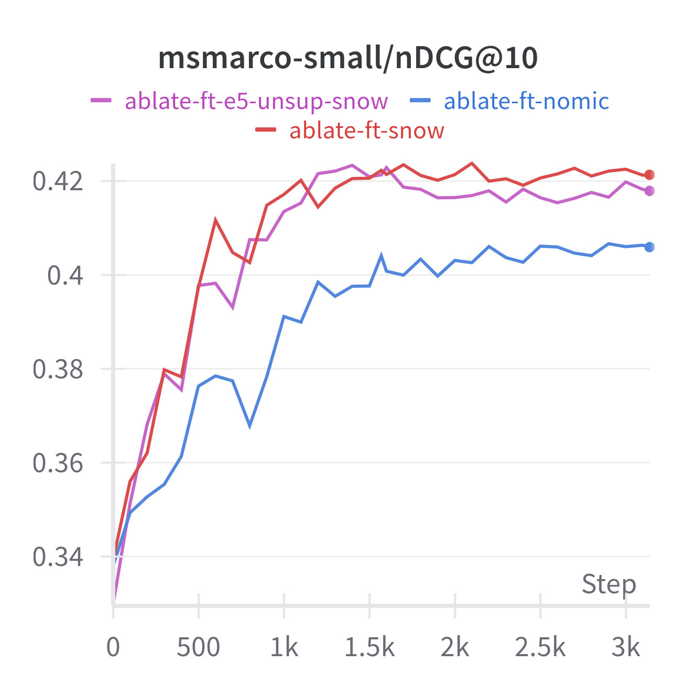

> 原文: [arXiv:2405.05374](https://arxiv.org/abs/2405.05374)
> 说明: 本文为技术报告全文中文技术展开，公式/图表编号与原文一致；图片自 arXiv HTML 抽取，caption 中译；数值原样保留。

**预印本信息：** arXiv:2405.05374v1 [cs.IR]，2024 年 5 月。

**开源：** https://huggingface.co/Snowflake/snowflake-arctic-embed-{xs,s,m,m-long,l}

---

# Arctic-Embed：可扩展、高效、精准的文本嵌入模型（Scalable, Efficient, and Accurate Text Embedding Models）

**作者：** Luke Merrick\*、Danmei Xu、Gaurav Nuti、Daniel Campos

**单位：** Snowflake Inc.

**邮箱：** luke.merrick@snowflake.com

---

## 摘要（Abstract）

本报告介绍 **arctic-embed** 文本嵌入模型族背后的**训练数据构造与训练配方**——共 5 个规模、22M 到 334M 参数、Apache-2 开源。发布时每个模型都在 MTEB Retrieval 上达到**同参数下 SOTA**——最大的 arctic-embed-l **超过 Cohere embed-v3、OpenAI text-embed-3-large 等闭源模型**。除了训练细节，作者还提供多个信息量丰富的**消融实验**——这些是模型高性能的**根源**。

---

## 1 引言（Introduction）

**背景**：嵌入模型在搜索、RAG 中广泛应用——不像关键词搜索，嵌入能捕捉 token 重叠之外的信息（如 "How tall is Tom Cruise?" 与 "Height of the actor who plays Maverick in Top Gun" 无共词但语义相似）。

**近期开源前沿**：E5、GTE、Jina、Nomic、BGE 等推动 SOTA 边界。

**Arctic-Embed 的贡献**：5 个不同规模的嵌入模型（xs/s/m/m-long/l），基于**同一套数据+配方**训练。发布时每个都是同规模 SOTA（见图 1）。

**图 1（原文 Figure 1）：** Snowflake Arctic-embed 5 个模型（xs → l）在**参数量（M，log 刻度）与 MTEB Retrieval 平均 nDCG@10** 平面上的位置。Arctic 系列（紫色）在同参数下**推 Pareto 前沿**：22M 的 arctic-embed-xs、33M 的 s、110M 的 m、137M 的 m-long、334M 的 l 都超过 other/bge/e5-v2/gte 同参数模型。

**贡献要点**：

1. **开源模型**：5 尺寸、Apache-2、同规模 SOTA；
2. **数据组织比 scale 更重要**：作者的消融显示"训练时数据采样与 negative mining"比"扩数据/batch"更影响最终性能；
3. **改进的合成数据**：**用挖到的 hard negative "锚定" query 生成**（Grounded Query Generation）——比"同时生成 query + negative"更有效，是关键 ingredient。

---

## 2 背景（Background）

### 2.1 任务定义

嵌入模型：把可变输入映射到固定维向量。文本检索任务：**最大化 query 与相关 document 的相似度、最小化与无关 document 的相似度**。**Representation-based retrieval** 是主流范式——离线预处理 doc 到向量、在线只算 query 向量与近似最近邻查找。

### 2.2 表示学习

从 word2vec / GloVe → Sentence-BERT → contrastive loss（Hadsell 2006）→ **InfoNCE**（van den Oord 2018）——已成为嵌入模型主流损失。

---

## 3 Arctic Embed 概述

**总方针**：从领域共识的最佳实践起手，从头训练。沿用 E5/BGE/GTE/Jina/Nomic 的**两轮训练**框架：

1. **Pretraining（大规模）**：只用 **in-batch negatives**，数据是 (query, positive) 对；
2. **Fine-tuning**：加入 hard negatives，约 1M 样本，用**可调 hard-negative mining** 策略构造。

**为什么 Arctic 更强**？作者假设的关键差异（表 2）：

| 差异 | 描述 | 消融验证 |
| :--- | :--- | :--- |
| **更好的数据** | 用 web search data + 常见 web 数据过滤 | 有提升 |
| **Source stratification** | 每个 mini-batch 全部来自**同一数据源**（Nomic 也用）| 有提升 |
| **更长的预训练序列长度** | 256 token（GTE/BGE 是 128）| 有提升 |
| **retrieval 预训练的 base 模型** | 用 e5-unsupervised-base 而非 bert-base-uncased 初始化 | 不一致 |
| **[CLS] embedding** | Arctic 用 [CLS] 而非 mean pool（BGE 也用）| 未消融 |
| **实现与调参** | 数据 mix、negative mining、batch、其它超参反复迭代 | 未消融 |

### 3.1 模型架构

**表 1**：

| 规模 | Base 模型 | 参数 (M) | 嵌入维度 |
| :--- | :--- | ---: | ---: |
| xs | nreimers/MiniLM-L6-H384-uncased | 23 | 384 |
| s | intfloat/e5-unsupervised-small | 33 | 384 |
| m | intfloat/e5-unsupervised-base | 110 | 764 |
| m-long | nomic-ai/nomic-embed-text-v1-unsupervised | 137 | 768 |
| l | intfloat/e5-unsupervised-large | 334 | 1024 |

### 3.2 训练数据集

**预训练数据**：Web search data + PAQ + StackExchange title-body + Common Crawl title-body + S2ORC title-abstract。

**过滤（一致性 + 质量）**：

- **一致性过滤**：用 fastText word2vec 做低精度、高吞吐的 pair-similarity（CPU 可跑）——把（q, d）作为整体过滤，而不是独立文本过滤；
- **质量过滤**：借鉴 Snowflake Arctic 大模型训练 cookbook——按内容质量、语言结构、去重等标准过滤。

**Fine-tuning 数据集**（图 3）：约 1M query，每个配一个 positive + 若干 hard negative。混合 web search data + HotpotQA + NQ + Fever + StackExchange title-body + **合成数据**。**故意省略** NLI、MEDI、WikiAnswers、SQuAD——作者观察这些 positive 一致性差或 negative 不够 hard。

**结论**：**质量 > 数量**——过量低质数据会拖垮 fine-tune。

### 3.3 合成数据（Grounded Query Generation）

**问题**：fine-tuning 数据稀缺。

**方案**：用 LLM 生成 novel query（类似 Promptagator）。**关键创新**：**LLM 输入中加入"mined negative"作为锚点**——Algorithm 2（附录）：

- 从 corpus 中挖 hard negative；
- 把 (positive doc, hard negative) 一起喂给 LLM；
- 让 LLM 生成**能区分二者的 query**。

**Only 生成 query，不生成 negative**——因为 LLM 生成的负样本质量远不如从真实 corpus 里挖的。

**图 4 效果**：用 HotpotQA 语料 + Algorithm 2 生成的合成 query，达到接近原 HotpotQA 训练效果的分数——**证明这种"锚定 negative"的合成 query 是有效的**。

### 3.4 可调 Hard Negative Mining（Algorithm 1）

**问题**：hard negative 应该多"hard"？

**方案**：

1. 用一个既有 embedding 模型（teacher）打分每个 (q, candidate) 对；
2. 检索每个 query 的 **top 100 hardest negatives**；
3. **应用一个"上限"阈值** 过滤过度 hard 的 negative（可能是假负例）——实际中作者观察**只用上限、不用下限**性能优化更好。

**为什么 Threshold 优于固定 Rank？** 不同 query 的 top-k negative 硬度差异极大——同 rank 对某些 query 太 easy、对另一些太 hard。**用相对相似度阈值**能自适应。

**表 8**：消融阈值——**过低（负例太 hard，接近假负例）与过高（太 easy）都损害性能**——需要调参。

**Curriculum Learning（图 5）**：从 easy 到 hard 顺序训练带来少许提升——但作者未在正式模型中采用。

---

## 4 训练配方（Training Recipe）

### 4.1 模型初始化

优先用 retrieval 预训练的模型（如 e5-unsupervised-base）而非通用 BERT——**收敛更快**（图 6：红色 E5 vs 蓝色 BERT），但**最终分数差异微弱**（消融见 §7.1、7.3）。

### 4.2 大规模对比训练

- **单 epoch**、**AdamW**、PyTorch 默认超参；
- **linear warmup**（数百步）+ **linear decay 到初始 lr 的 10%**；
- **表 3**（batch size + lr）：

| 规模 | Pre Batch | Pre LR | Finetune Batch | Fine LR |
| :--- | ---: | ---: | ---: | ---: |
| xs | 24,576 | 6e-4 | 768 | 4e-5 |
| s | 32,768 | 5e-4 | 1,024 | 4e-5 |
| m | 16,384 | 2e-4 | 512 | 1e-5 |
| m-long | 12,288 | 1e-4 | 512 | 1e-5 |
| l | 12,480 | 1e-4 | 512 | 9e-6 |

### 4.3 更长的截断长度

- **Query**：截到 32 token（与 BGE 源码一致）；
- **Document**：**截到 256 token**（vs. GTE/BGE 的 128）——即使 batch size 相当。

**消融表 5** 显示 128 vs 256：**+1.44 分**（Run F 45.53 vs. Run A 46.97）。

### 4.4 Source Stratification

**每个 mini-batch 只装同一数据源的样本**——避免跨源 in-batch negatives 引入的负样本"假易"问题（不同源的文档一般不重叠，判为负太简单）。

**消融表 5**：Yes vs No：**+3.23 分**（Run A 46.97 vs. Run D 43.74）——**巨大提升**。

### 4.5 高质量 Fine-tune with Curated Negatives

Fine-tuning：**每 query 1 个正 + 10 个 hard negative**；序列截到 512（含 m-long）；无 warmup、linear decay lr；数据 mix 优化。

---

## 5 长文本模型（m-long, 2048 token 输入）

**LoCo 长文本 benchmark 结果**（表 4）：

| 模型 | Seq Len | Summ. Scr. FD | Gov. Report | QMSUM | QASPER Title | QASPER Abs. | **Avg** |
| :--- | ---: | ---: | ---: | ---: | ---: | ---: | ---: |
| **arctic-embed-m-long** | 2048 | 63.2 | 93.8 | 45.8 | 77.3 | 95.8 | 75.2 |
| **arctic-embed-m-long** | 4096 | 81.8 | 96.0 | 39.7 | 85.9 | 99.0 | 80.5 |
| **arctic-embed-m-long** | 8192 | 86.6 | 96.5 | 31.7 | 81.6 | 99.7 | 79.2 |
| jina-base-v2 | 8192 | 93.3 | 98.6 | 40.8 | 95.1 | 99.3 | 85.5 |
| nomic-embed-text-v1 | 8192 | 90.9 | 97.8 | 44.2 | 94.9 | 99.9 | 85.5 |
| e5-mistral | 4096 | 95.9 | 98.3 | 46.8 | 98.4 | 99.8 | **87.8** |

**结论**：arctic-embed-m-long 在长文本 LoCo 上不如 nomic-embed（专为长文训练）、jina-base-v2、e5-mistral——但 MTEB Retrieval 上仍强，**适合长短混合场景**。

---

## 6 MTEB 主结果

MTEB Retrieval 15 数据集平均 nDCG@10（发布时）：

- **arctic-embed-xs (22M)**：**50.15** → 同规模 SOTA；
- **arctic-embed-s (33M)**：**51.98** → 同规模 SOTA；
- **arctic-embed-m (110M)**：**54.90** → 同规模 SOTA；
- **arctic-embed-m-long (137M)**：**54.83** → 同规模 SOTA（长文本 opts）；
- **arctic-embed-l (334M)**：**55.98** → **超过 Cohere embed-v3、OpenAI text-embed-3-large 等闭源模型**。

---

## 7 消融实验（Ablations）

### 7.1 预训练消融（表 5）

| Run | Base Model | Data | Stratify | Batch | Seq Len | Score |
| :--- | :--- | :--- | :--- | ---: | ---: | ---: |
| A | bert-base-uncased | Snowflake | Yes | 16,384 | 256 | **46.97** |
| B | e5-unsupervised-base | Snowflake | Yes | 16,384 | 256 | 46.96 |
| C | bert-base-uncased | Nomic | Yes | 16,384 | 256 | 46.55 |
| D | bert-base-uncased | Snowflake | **No** | 16,384 | 256 | **43.74** |
| E | bert-base-uncased | Snowflake | Yes | **4,096** | 256 | 45.36 |
| F | bert-base-uncased | Snowflake | Yes | 16,384 | **128** | 45.53 |

**关键 finding**：

- **Source Stratification 影响最大**（-3.23）；
- **Batch size 从 16k 到 4k**：-1.61；
- **Seq len 从 256 到 128**：-1.44；
- **Base model E5 vs BERT**：几乎无差（46.96 vs. 46.97）；
- **数据源 Snowflake vs Nomic**：+0.42（微弱）。

**图 7（原文 Figure 7）：** 训练过程中不同因素的影响。**source stratification 的重要性在训练后期显现**——与 batch size 等因素的曲线交叉揭示——**stratification 类似 curriculum learning**，在训练后期更关键。

### 7.2 Fine-tune 消融

**图 8**：hard negative 阈值扫参——太低（过 hard，含假负）与太高（过 easy）都显著降低性能。存在明显的**最优 threshold**。

### 7.3 End-to-end 消融

对 pretraining ablation 的 Run A/B/C 继续 fine-tune（表 6）：

| Starting | Pretrain Data | 预训练分数 | 最终分数 |
| :--- | :--- | ---: | ---: |
| bert-base | Snow | 46.97 | 53.92 |
| e5-unsup. | Snow | 46.96 | 54.67 |
| bert-base | Nomic | 46.55 | 52.23 |

**关键发现**：

- **Snowflake vs Nomic 预训练数据**：pretrain 阶段差 0.42，**fine-tune 后差 1.69**——**数据差异在 fine-tune 阶段放大**；
- **BERT vs E5 base 模型**：pretrain 阶段几乎相同，**fine-tune 后 E5 +0.75**——E5 初始化对 fine-tune 略好。

**图 9（原文 Figure 9）：** 3 种预训练配置进入相同 fine-tune 阶段的性能曲线。**预训练数据不同的 gap（Snow vs Nomic）在 fine-tune 阶段快速扩大**；而 base model 权重不同（BERT vs E5）的 gap 在 fine-tune 后期几乎不显现——**证明数据比 base model 更重要**。

---

## 8 结论与未来工作（Conclusion）

Arctic-embed 通过：

1. **Dataset-stratified mini-batches**（同源打包）；
2. **可调 hard negative mining**（阈值而非固定 rank）；
3. **更长的截断序列**（256 vs 128）；
4. **基于 negative 锚定的 grounded query 合成**；
5. **质量优先的 fine-tune 数据混合**。

**未来方向**：

- 更细致的 **curriculum learning**；
- 更好的 **source stratification** 策略；
- 训练更**鲁棒**的量化（binarization / quantization）模型。

---

## 附录索引（Appendix）

- **A** 完整训练超参；
- **B** 详细评测集合（LiteBEIR、MTEB Retrieval、LoCo）；
- **C** 完整数据过滤方法清单；
- **D** Algorithm 1（hard negative mining）、Algorithm 2（grounded query generation）伪代码；
- **E** 消融的完整逐数据集分数；
- **F** 合成数据 prompt 模板；
- **G** Snowflake Arctic model training cookbook 参考。

---

*翻译约定：Source Stratification（同源分层：mini-batch 全部来自同一数据源）、可调硬负例挖掘（tunable hard-negative mining）、锚定 query 生成（grounded query generation）、Curriculum Learning（课程学习）、一致性过滤（consistency filter）、质量过滤（quality filter）、截断长度（truncation length）、[CLS] embedding、mean pooling、InfoNCE、Pareto 前沿。Arctic-embed / MTEB / BEIR / MSMARCO / HotpotQA / NQ / FEVER / SQuAD / NLI / MEDI / PAQ / StackExchange / S2ORC / Wikipedia / Cohere / OpenAI text-embed-3 / GTE / BGE / E5 / Jina / Nomic / Promptagator / fastText / word2vec / GloVe / BERT / T5 / Sentence-BERT / AdamW / LoCo 按惯例不译。*
