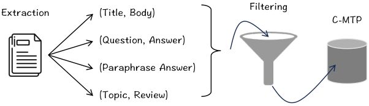

# BGE C-Pack v1 / v1.5：BAAI 通用嵌入的起点

> **paper**：[C-Pack: Packed Resources For General Chinese Embeddings (SIGIR 2024)](https://arxiv.org/abs/2309.07597)
> **code / models / dataset**：[FlagOpen/FlagEmbedding](https://github.com/FlagOpen/FlagEmbedding) · [BAAI/bge-large-zh-v1.5](https://huggingface.co/BAAI/bge-large-zh-v1.5) · [BAAI/bge-large-en-v1.5](https://huggingface.co/BAAI/bge-large-en-v1.5) · [C-MTEB Leaderboard](https://huggingface.co/spaces/mteb/leaderboard) · [C-MTP dataset](https://huggingface.co/datasets/Shitao/c-mtp)
> **refs**：[E5 (Wang 2022)](https://arxiv.org/abs/2212.03533) · [Contriever (Izacard 2022)](https://arxiv.org/abs/2112.09118) · [RetroMAE (Xiao 2022)](https://arxiv.org/abs/2205.12035) · [MTEB (Muennighoff 2022)](https://arxiv.org/abs/2210.07316) · [INSTRUCTOR (Su 2022)](https://arxiv.org/abs/2212.09741) · [ANCE (Xiong 2020)](https://arxiv.org/abs/2007.00808)
> **backbone**：BERT-like（`bge-small` 24M · `bge-base` 102M · `bge-large` 326M）
> **date**：2023-08 首发；v1.5（当前公用版）2023-09；SIGIR 2024 论文正式发表 2024-07
> **modality**：文本
> **languages**：中文（bge-zh）+ 英文（bge-en）；训练数据 C-MTP 中英各一份
>
> 本文写全 **C-Pack 四件套（C-MTEB / C-MTP / BGE / 训练 Recipe）** 是怎么一起把中文通用嵌入从 60 分推到 64 分档、把 BGE 变成全球下载最多的开源嵌入模型（2024-04 累计 2000 万+）；同时讲清 **v1 → v1.5** 只改归一化温度与指令的一次「小改动大收益」升级。这是理解 BGE-M3 / BGE-EN-ICL / bge-multilingual-gemma2 之前的必修课。

---

## 一句话定位

BGE C-Pack 是 **BAAI 打造「通用中文嵌入」的开源基础设施**，它把「模型 + 数据 + 基准 + 训练配方」四样一次性交付给社区：

| 组件      | 内容                                                                              |
| --------- | --------------------------------------------------------------------------------- |
| **C-MTEB** | 中文版 MTEB：**6 类任务 × 35 数据集**（Retrieval / Reranking / STS / Classification / PairCLF / Clustering） |
| **C-MTP** | 100M 无监督对（unlabeled）+ 838k 有监督对（labeled）；同时释放 200M 英文对          |
| **BGE**   | `bge-small-zh` (24M) / `bge-base-zh` (102M) / `bge-large-zh` (326M) 三档 + 对应英文版 |
| **Recipe** | **三阶段训练**：RetroMAE 预训练 → 弱监督对比 → 监督多任务微调 + 指令 + hard neg   |

它的意义**不只是当时 C-MTEB 榜首（63.96 vs 竞对 ~58）**，更是**把整套流水线开源**：C-MTP 是当时最大的中英公开嵌入训练集，Recipe 里的每一步都对社区可复现。BGE C-Pack 之后，中国大厂的嵌入产品（Conan / gte-Qwen / QZhou-Embedding / Piccolo）几乎都在**同一个训练配方上做增量**。

## 谱系与位置

```text
BERT-MLM ──→ RetroMAE (BAAI 2022) ──→ **BGE C-Pack v1 (2023-08)** ──→ v1.5 (2023-09)
                                              │
                                              ├─→ BGE-M3 (2024-02)：多语 + 多粒度 + 三头联合
                                              ├─→ BGE-EN-ICL (2024-09)：ICL 化 + Mistral 骨干
                                              ├─→ bge-multilingual-gemma2 (2024-09)：Gemma2 骨干
                                              ├─→ BGE-Reranker v2 / v2.5：配套精排
                                              └─→ MegaPairs / BGE-VL (2024-12)：多模态
```

后来所有 BGE 系模型都建立在 C-Pack 的三阶段 + RetroMAE 血脉上。理解 C-Pack 后，M3 / EN-ICL / Gemma2 只是「换骨干、换阶段侧重、换任务组合」。

---

## 问题背景：2023 年中文嵌入的现状

C-Pack 之前，中文嵌入生态两头缺：

1. **训练数据缺**：几乎所有公开中文嵌入数据集（LCQMC、CMNLI、DuReader）规模都 < 100 万；相比英文的 CCPairs (270M) 差两个量级。
2. **评测缺**：MTEB (2022) 是英文事实基准，中文没有对应的通用榜单。业界只能用几个孤立的 STS / 检索集打分。
3. **模型没得选**：Text2Vec 系 / Luotuo / M3E 各有短板，没有真正「拿来即用 + 全任务过关」的中文嵌入。

C-Pack 的策略是**把「模型 + 数据 + 评测」一起解决**——三者互相依赖：没有干净的大数据训不出好模型，没有全面基准判不出好模型好在哪，没有好模型验证不了数据配方对不对。


上图论文 Figure 1：C-MTEB 评基准、C-MTP 供数据、BGE 出模型、Recipe 打通流水线。四者组成一个闭环。

---

## C-MTEB：中文 MTEB

C-MTEB 与 MTEB 结构对齐——**6 类任务、35 个数据集**：

| 任务类型         | 数据集数 | 代表数据集                                                    | 主指标           |
| ---------------- | :------: | ------------------------------------------------------------- | ---------------- |
| Retrieval         | 8        | CmedqaRetrieval / DuRetrieval / MMarcoRetrieval / T2Retrieval / VideoRetrieval / CovidRetrieval / EcomRetrieval / MedicalRetrieval | nDCG@10          |
| Reranking         | 4        | CMedQAv1 / CMedQAv2 / MMarcoReranking / T2Reranking          | MAP              |
| STS               | 8        | AFQMC / ATEC / BQ / LCQMC / PAWSX / QBQTC / STS22 / STSB     | Spearman         |
| Classification    | 9        | AmazonReviews-ZH / IFlyTek / JDReview / TNews / Waimai / … | AP (avg. precision) |
| PairCLF           | 2        | Cmnli / Ocnli                                                | AP               |
| Clustering        | 4        | CLSClusteringP2P/S2S / ThuNewsClusteringP2P/S2S              | V-measure        |

评测框架直接对齐 MTEB：**Retrieval 用 BEIR 方案**，**Clustering 用 mini-batch k-means（bs=32）**，**Classification 用 logistic regression 头**。这份对齐让 C-MTEB 和 MTEB 可**跨语言横向比较**——mE5、multilingual-BERT 等多语模型能同时上榜。

**评测流水线**（论文 Figure 3）：

- `FlagDRESModel` 是嵌入模型包装器，实现 `encode_queries` / `encode_corpus`。
- `ChineseTaskList` 列出全部 35 个数据集及配置。
- 一条命令跑完，结果写到 output 文件夹，可以直接提交到 leaderboard。

**结果**（论文 Table 2）：

| 模型         | Dim | Retrieval | STS | PairCLF | CLF | Re-rank | Cluster | Avg   |
| ------------ | :-: | :-------: | :-: | :-----: | :-: | :-----: | :-----: | :---: |
| Text2Vec-large | 1024 | 41.94   | 44.97 | 70.86 | 60.66 | 49.16 | 30.02 | 48.56 |
| Luotuo-large   | 1024 | 44.40   | 42.79 | 66.62 | 61.00 | 49.25 | 44.39 | 50.12 |
| M3E-large     | 1024 | 54.75   | 50.42 | 64.30 | 68.20 | 59.66 | 48.88 | 57.66 |
| mE5-large     | 1024 | 63.66   | 48.44 | 69.89 | 67.34 | 56.00 | 48.23 | 58.84 |
| OpenAI ada-002 | 1536 | 52.00   | 43.35 | 69.56 | 64.31 | 54.28 | 45.68 | 53.02 |
| **BGE-large-zh** | 1024 | **71.53** | **54.98** | **78.94** | **68.32** | **65.11** | **48.39** | **63.96** |

Retrieval **+8** vs mE5、**+16** vs M3E；STS **+5**；PairCLF **+9**。这是 2023 年 8 月中文嵌入的一次跃迁。


上图展示 BGE 各版本相对同期竞品的分数分布——**每个任务类别都是 top-1 或紧咬 top-1**。

---

## C-MTP：100M 无监督 + 838k 监督

### C-MTP (unlabeled)：100M 弱对

策略与 E5 CCPairs 一致：**从半结构化 Web 数据抓「已经像 (q, d)」的对，再一致性过滤**。

**16 个数据源**，按类型分：

- **百科风格**：Wudao Corpora（Chinese Wikipedia-style）→ 抽 (title, body) / (subtitle, passage)。
- **社交问答**：Zhihu / Baike → 抽 (question, answer) / (paraphrase questions) / (paraphrase answers)。
- **新闻站**：主流中文新闻网站 → (title, body)。
- **学术**：CSL（科学文献）→ (title, abstract)。
- **电商评论**：Amazon-Review-Zh、JDReview → (topic, review)。
- **多类补充**：Wiki Atomic Edits（同义改写）、CMRC（阅读理解）、XLSUM-Zh（摘要）等。



**过滤链**：

1. **通用过滤**：去非文本、去重、去恶意内容。
2. **语义过滤**：用 **Text2Vec-Chinese** 打分每对相似度，**阈值 0.43**，低于则丢。
3. 保留 **100M 对**。

作者强调这个 0.43 是**经验值**——手工审样看到大部分假正例都在 0.4 以下；不同 teacher 阈值不同。

### C-MTP (labeled)：838k 监督对

集成 8 个中文有监督数据集：

- **T2-Ranking**（大规模检索标注）
- **DuReader**（阅读理解 q-passage）
- **mMARCO-Zh**（MS MARCO 中译）
- **CMedQA-v2**（医疗 QA）
- **multi-cpr**（跨领域检索）
- **NLI-Zh**（自然语言推理）
- **CMNLI / OCNLI**（CLUE NLI）

规模只有 838,465 对，但**每对都是人工或半人工标注，质量远高于 unlabeled**。

同期一起释放 **200M 英文 C-MTP**（Reddit / S2ORC / Wikipedia / StackExchange 等），是当时最大的公开英文嵌入训练数据。

---

## 三阶段训练 Recipe

BGE 的训练由三阶段串行：

### Stage 1：RetroMAE 预训练

**目标**：让 BERT 骨干从「MLM 通用编码」变成「适合检索的句向量编码器」。

用 RetroMAE（[详解](RetroMAE与DupMAE详解.md)）在 Wudao Corpora 上做非对称 MAE：

$$
\min \; \sum_{x \in X}  -\log \mathrm{Dec}\bigl(x \,\big|\, e_{\tilde X}\bigr), \quad e_{\tilde X} \leftarrow \mathrm{Enc}(\tilde X)
$$

- Encoder（12 层 BERT）掩码 30% → 输出 CLS 作 $e_{\tilde X}$。
- Decoder（1 层 Transformer）用被激进掩码（50%+）的 $\tilde X$ 加 $e_{\tilde X}$ 重建原句。

RetroMAE 的关键机制在 [RetroMAE 与 DupMAE 详解](RetroMAE与DupMAE详解.md) 已展开：**「小解码器 + 高掩码率」强制 CLS 承担几乎全部信息压缩**。

### Stage 2：弱监督对比学习

在 C-MTP (unlabeled) 100M 对上做**纯 in-batch neg 对比**，损失为标准温度 InfoNCE：

$$
\mathcal{L} = -\sum_{(p,q)} \log \frac{\exp(\langle e_p, e_q\rangle / \tau)}{\exp(\langle e_p, e_q\rangle / \tau) + \sum_{q' \in Q'} \exp(\langle e_p, e_{q'}\rangle / \tau)}
$$

**关键工程细节**：

- **不显式挖 hard neg**：完全靠**超大 batch**（batch size = **19,200**）撑出足够多的 in-batch 负例。
- **Cross-GPU 广播**：batch 分 shard 到多 GPU，embedding 全 gather 后统一算相似度。
- **温度 $\tau$**：detail 未在正文给出，实现中 v1.5 用 0.02 附近（推理时对应 IP score）。

这一阶段的目标是**「先撑开表征空间」**——用海量弱对让模型学到一个粗糙但覆盖广的语义几何。

### Stage 3：监督多任务微调 + 指令 + hard neg

在 C-MTP (labeled) 838k 对上做**监督多任务微调**。三个关键设计：

1. **Instruction-based fine-tuning**：query 侧加任务指令 $I_t$：$q' \leftarrow I_t + q$。例："Represent this sentence for searching relevant passages: {q}"。BGE-zh 与 BGE-en 都各有一条固定指令模板（写死在 model card）。
2. **Hard negatives (ANN-mined)**：对每对 (p, q) 从对应原语料里挖 1 个 hard neg，用 ANCE-style 挑法（当前模型 top-K，去掉真正的正例）。
3. **多任务合训**：Retrieval、Ranking、STS、PairCLF 数据混在同 batch。指令让不同任务在同一空间里不打架（跟 INSTRUCTOR 结论一致）。

**指令模板样例**（bge-large-zh-v1.5 官方）：

- Retrieval query：`为这个句子生成表示以用于检索相关文章：`
- Retrieval doc / 其他：**无指令**（只对 query 侧加）。

这个「只 query 加指令」的非对称模板被后来 E5-Mistral / gte-Qwen / SFR 全部继承。

---

## v1 → v1.5：一次小改动、大收益

BGE-v1（2023-08）发布后一个月，作者观测到两个可以立刻优化的点：

1. **相似度分数尺度不合适**：v1 用 dot product 未 L2-normalize；不同 doc 长度导致 cosine 与 dot product 尺度错位，用户经常抱怨「BGE 的分数比 OpenAI 大很多，阈值不好设」。
2. **训练 batch 温度需要重新校准**：v1 温度是 0.01，v1.5 调整到 0.02，让分数分布更「均匀」。

**v1.5 的具体改动**（无重大架构 / 数据变化）：

- **训练时**：将温度 $\tau$ 微调；相似度归一化改为 cosine（L2-normalize 后 IP）。
- **模型侧**：Encoder 输出后加 L2 归一化。
- **指令模板**：保持不变（bge-zh 用「为这个句子生成表示以用于检索相关文章：」）。
- **权重更新**：release 新一版 checkpoint（`bge-large-zh-v1.5` 覆盖旧的 `bge-large-zh`）。

结果：

- **cosine 分数变成 [0, 1] 分布，阈值容易设**（用户反馈从「不知道 0.62 是什么意思」变成「> 0.75 大概率相关」）。
- **C-MTEB Retrieval nDCG@10**：71.5 → 71.7（微涨）；主要收益在**可用性**上而非分数。
- 之后所有 BGE 系模型（M3、EN-ICL、Gemma2）都保留 L2-normalize + cosine 的接口约定。

**教训**：**归一化约定是接口契约**——训练、评测、线上向量库（Milvus / FAISS）三处必须一致；不一致会导致「训练分很好，上线掉一半」。这个坑后来 BGE-M3 也犯过（Dense/Sparse/Multi-vec 三头 normalize 方式不同），是接口设计的常见雷。

---

## 关键实验结论

### 数据规模 vs 模型规模

论文 §4.4 消融显示：

| 训练数据                 | small (24M) | base (102M) | large (326M) |
| ------------------------ | :---------: | :---------: | :----------: |
| RetroMAE 预训练 + 直接微调 | 41.5 | 47.3 | 51.2 |
| + C-MTP unlabeled 弱监督   | 55.8 | 59.6 | 61.4 |
| + C-MTP labeled 监督微调   | 58.3 | 62.8 | 63.9 |
| + 指令 + hard neg          | **58.28** | **62.80** | **63.96** |

三条重要结论：

1. **弱监督对比 > 直接监督微调**：从直接 BERT + labeled fine-tune 到「弱监督 + 监督」的两阶段，**large 提 12+ 分**——先用弱对撑空间再用小规模干净数据削尖，是最优顺序。
2. **模型规模作用可预测**：small → base 提 5、base → large 提 1。**24M 已经足够可用**，300M 是甜点上限；再大边际收益递减。
3. **指令 + hard neg 是最后 1 分**：从 pure C-MTP 到「+ instruct + hard neg」，通常 +0.5–1；不改架构但需要 curation。

### 与 mE5 / OpenAI ada-002 的对比

**BGE-large-zh 相对 mE5-large：**

- Retrieval +7.87、STS +6.54、PairCLF +9.05、CLF +0.98、Re-rank +9.11、Cluster +0.16。
- 除聚类外全面领先。

**BGE-large-zh 相对 OpenAI ada-002（中文）：**

- Retrieval +19.5、STS +11.6、Re-rank +10.8。
- 一个 326M 的开源模型全面碾压 OpenAI 商业闭源模型的中文能力——这在 2023 年是罕见事件，也是 BGE 后来病毒式流行的直接原因。

### 训练数据的模态贡献

论文 Table 3 消融进一步分解 C-MTP unlabeled 里的**16 个数据源**对最终分数的贡献：

- **贡献 Top-3**：Wudao (title-body) / Zhihu QA / Baike——大规模、语言正规。
- **贡献 Middle**：CSL / Amazon Review / 新闻 title-body。
- **贡献 Low**：Wiki Atomic Edits / CMRC / XLSUM。

结论：**低贡献不代表可以去掉**——它们提供**任务多样性**。去掉「贡献低但类型不同」的数据源会让 STS / Reranking 掉分（但 Retrieval 不掉，因为主 corpus 已覆盖）。

---

## 训练配置

| 项                | Stage 1 (RetroMAE) | Stage 2 (弱监督)                            | Stage 3 (监督)          |
| ----------------- | :----------------: | :-----------------------------------------: | :---------------------: |
| 数据              | Wudao / 英文 pile   | C-MTP unlabeled 100M 中 / 200M 英             | C-MTP labeled 838k       |
| Loss              | RetroMAE ($\mathcal{L}_{\text{mlm}} + \mathcal{L}_{\text{dec}}$) | InfoNCE (in-batch only) | InfoNCE (指令 + 1 hard neg + in-batch) |
| Temperature       | –                   | ~0.02                                        | ~0.02                    |
| Batch             | 128 / GPU           | **19,200**（cross-GPU）                      | 数百 – 数千               |
| Epochs            | 8                   | 1                                            | 3                        |
| Backbone (large)  | BERT-large-Chinese  | 继承 stage 1                                  | 继承 stage 2              |
| 硬件              | 8× A100 40G         | 数十 A100（大 batch 需要）                    | 8–16× A100                |
| 指令              | 无                  | 无                                            | query 侧固定模板          |

---

## 常见错误用法

1. **推理漏 query 指令**：v1.5 官方模板 `为这个句子生成表示以用于检索相关文章：` 或 `Represent this sentence for searching relevant passages:`。**训练时用了指令、线上不加**会掉 3–5 nDCG@10。
2. **doc 侧也加指令**：BGE 与 E5 一样是**非对称**——只 query 加，doc 不加。误加双侧会污染检索空间。
3. **使用 IP 但不归一化**：v1.5 权重是按 L2-normalize 后 IP 训练的；FAISS `IndexFlatIP` 索引 doc 时若忘归一化，score 就等于「向量长度 × cosine」，长文档天然被推高。**上线前确认 metric 契约**。
4. **拿 bge-en-v1.5 直接用中文**：BGE-zh 与 BGE-en 是**分开训**的两条模型，vocab 也不同。要跨语言用 `bge-m3` 或 mE5，而非跨用 v1.5。
5. **用 STS 数据集验证检索能力**：C-MTEB 分类清楚——**Retrieval 与 STS 是不同任务**，STS 高不代表检索好。生产环境应主看 Retrieval / Reranking，其它当诊断。
6. **蒸馏时用 BGE 的 IP score 当 soft label**：cosine 的动态范围小（-1..1），KL 蒸馏时不如 CE 的 logit 差异大。用 BGE 教师蒸馏 Bi-encoder 时，**用 Margin MSE 或分数排序 KL** 更稳定。
7. **在自定义领域微调时不 warm-up 冻结骨干**：BGE 已经是三阶段训成的，直接大 lr fine-tune 容易破坏已有几何。**先冻结骨干只训投影层 100 步，再放开** 效果更稳。

---

## 与 BGE-M3 / BGE-EN-ICL / bge-multilingual-gemma2 的关系

C-Pack 是所有后续 BGE 变体的地基：

| BGE 变体                    | 相对 C-Pack 的改动                                                              |
| --------------------------- | ------------------------------------------------------------------------------- |
| **BGE-M3** (2024-02)        | 三阶段变四阶段（+ Self-KD 自蒸馏），**Dense + Sparse + Multi-vec 三头联合**，XLM-R 骨干支持 100+ 语，Long context 到 8K；见 [BGE-M3 详解](BGE-M3三功能统一详解报告.md) |
| **BGE-EN-ICL** (2024-09)    | Mistral-7B 骨干 + 数十条 ICL few-shot 例子并入 query 前缀，让 embedding 也能做上下文学习；见 [BGE-EN-ICL 详解](BGE-EN-ICL详解.md)（Batch 3-2 已写） |
| **bge-multilingual-gemma2** (2024-09) | gemma2-9B 骨干 + 多语指令；MTEB 平均 69.88；见 [bge-multilingual-gemma2 详解](BGE-multilingual-gemma2详解.md)（Batch 3-3 已写） |
| **BGE-Reranker v2 / v2.5**  | 与 BGE 嵌入配套的 Cross-encoder Reranker；见 [BGE-Reranker 详解](BGE-Reranker详解.md)（Batch 3-4 已写） |
| **MegaPairs / BGE-VL** (2024-12) | 多模态版；26M 三元组合成 + CLIP/MLLM 双路；见 [MLLM 通用多模态嵌入](MLLM通用多模态嵌入_GME-VLM2Vec-BGEVL.md) |

**共同结构**：RetroMAE 预训练 → 弱监督对比 → 监督多任务 + 指令 + hard neg + 蒸馏。C-Pack 是这条骨架，其它变体只在**骨干、数据规模、附加头、蒸馏信号** 上做增量。

---

## 与本仓库既有报告的挂接

- 前置：[RetroMAE 与 DupMAE 详解](RetroMAE与DupMAE详解.md)（BGE 预训练用的核心机制）· [无监督对比检索三部曲](无监督对比检索三部曲_SimCSE-Contriever-Condenser.md)（Contriever/coCondenser 是 BGE 弱监督阶段的直接借鉴）
- 训练损失：[对比学习与 InfoNCE 精讲](对比学习与InfoNCE精讲.md)
- 后续变体：[BGE-M3 三功能统一详解报告](BGE-M3三功能统一详解报告.md) · Batch 3-2 [BGE-EN-ICL 详解]、Batch 3-3 [bge-multilingual-gemma2 详解]、Batch 3-4 [BGE-Reranker 详解]
- 数据/负例：[难负例挖掘工业实践](难负例挖掘工业实践.md)
- 主文对应：[Embedding 调研报告](Embedding调研报告.md) §5「训练与数据工程」与 §9.2「机制族 B：弱监督课表 + 指令」

---

*本报告基于 C-Pack 论文（arXiv 2309.07597 / SIGIR 2024）、BGE HF 官方 model card 与 [FlagEmbedding 官方 repo](https://github.com/FlagOpen/FlagEmbedding) 整理。分数为 2023-08 首发时的 C-MTEB 分数；后续版本请查最新 leaderboard。BGE-large-zh-v1.5 至 2024-04 累计下载 2000 万+，是全球开源嵌入模型下载量之最。*
