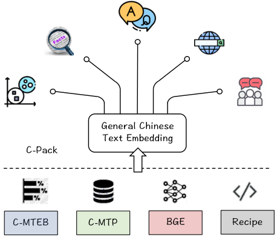
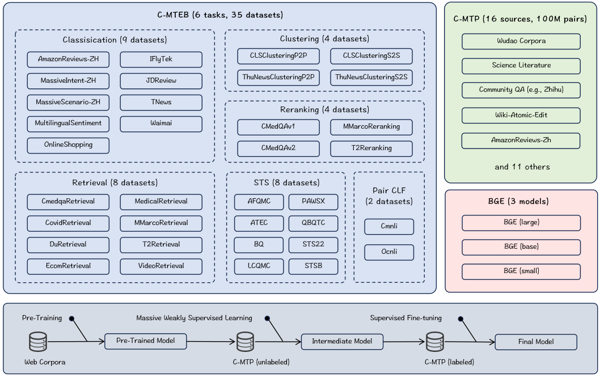
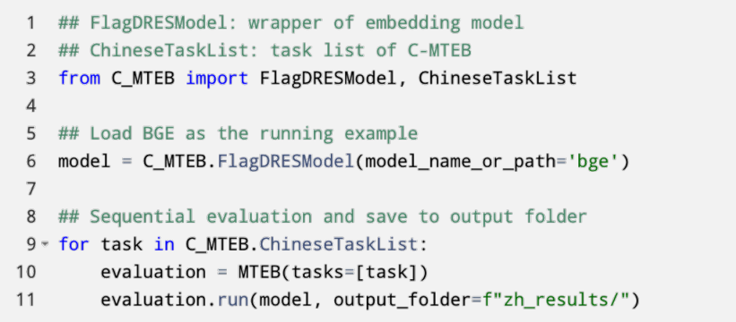

> 原文: [arXiv:2309.07597](https://arxiv.org/abs/2309.07597)（SIGIR 2024）
> 说明: 本文为论文全文中文技术展开，公式/图表编号与原文一致；图片自 arXiv HTML 抽取，caption 中译；数值原样保留。

**预印本信息：** arXiv:2309.07597v5 [cs.CL]，首发 2023-09；SIGIR '24 长文（Washington, DC，2024-07-14 至 07-18）。

**开源：** https://github.com/FlagOpen/FlagEmbedding

---

# C-Pack：面向通用中文嵌入的一揽子资源（C-Pack: Packed Resources For General Chinese Embeddings）

**作者：** Shitao Xiao†、Zheng Liu†\*、Peitian Zhang、Niklas Muennighoff、Defu Lian、Jian-Yun Nie

**单位：** 北京智源人工智能研究院（BAAI）、中国人民大学、HuggingFace、中国科学技术大学、蒙特利尔大学

**邮箱：** stxiao@baai.ac.cn、zhengliu1026@gmail.com、namespace.pt@gmail.com、n.muennighoff@gmail.com、liandefu@ustc.edu.cn、nie@iro.umontreal.ca

† 共同一作；\* 通讯作者。

---

## 摘要（Abstract）

作者发布 **C-Pack**——一整套用于中文通用文本嵌入研究的资源包。C-Pack 含三块关键资产：

1. **C-MTP（Chinese Massive Text Pairs）**——大规模文本对训练数据。以海量无标注语料为主、辅以高质量有标注数据整合而成；
2. **C-MTEB（Chinese Massive Text Embedding Benchmark）**——覆盖 **6 类任务、35 个数据集**的中文文本嵌入综合评测；
3. **BGE（BAAI General Embeddings）**——涵盖多种规模（small/base/large）的中文通用嵌入模型族。发布时在 C-MTEB 上超越所有既有中文嵌入 **+10% 以上**。

作者同时把整套训练配方（pre-training + weakly supervised contrastive + task-specific fine-tuning）整合并开源。除中文之外，C-Pack 还配套发布规模为中文两倍的**英文训练数据（200M 对）**与英文 BGE 模型——后者亦刷新 MTEB SOTA。这是**当时最大的公开文本嵌入训练数据**。

**关键词：** 文本嵌入、训练数据、评测基准、预训练模型。

---

## 1 引言（Introduction）

**文本嵌入的价值。** 用低维稠密向量表征文本，是 IR / QA / 语义匹配的通用底座；LLM 时代由于自身知识与动作空间的局限，需要通过外部知识库、工具、检索增强生成（RAG）来补齐，**嵌入是把 LLM 与外部世界桥接的关键**。这就要求嵌入模型能"一模型走天下"：同一套向量既能做检索、又能做重排、分类、聚类、STS。

**训练通用嵌入的三大关键要素。** 作者把该问题总结为三条主线：

- **数据**：规模（往往需要**上亿量级**训练对，比 MS MARCO/NLI 这类任务数据集高 2–3 个数量级）、来源多样（覆盖网页、百科、社区问答、新闻等）、并且**必须清洗**以剔除弱相关或噪声对。
- **训练**：需要合适的 backbone + **组合式训练配方**——嵌入定向预训练（如 RetroMAE）、带精细负样本采样的对比学习、以及指令化的多任务微调。
- **评测基准**：以 BEIR（18 个检索数据集）与 MTEB（56 个数据集、覆盖检索/重排/聚类/分类/STS 等）为代表；但**中文侧一直没有可与之对标的综合评测**。

**中文的现实困境。** 相较于英文侧的 Contriever / E5 / GTR / OpenAI-Embedding 等成熟工作，中文嵌入既缺**大规模训练数据**又缺**综合评测基准**——这也是 C-Pack 要一揽子解决的。

**C-Pack 的四大资源。**

- **C-MTEB**：以 MTEB 为蓝本的中文扩展。35 个公开数据集分入 **6 类**（Retrieval / Re-ranking / STS / Classification / Pair-Classification / Clustering），统一评测协议 + 一键式评测管线。
- **C-MTP**：**100M 弱监督对** + **约 838K 有标注对**。从悟道语料、知乎、百科、新闻等抽取（title-body / sub-title-passage / QA / paraphrase 等结构对），叠加 T2-Ranking、DuReader、mMARCO-Zh、NLI-Zh 等有监督数据。
- **BGE**：三档尺寸——**BGE-small（24M）/ BGE-base（102M）/ BGE-large（326M）**，兼顾效率与效果。
- **训练配方**：整合并优化了**预训练 → 无监督对比 → 有监督微调**的三阶段流程。

**社区影响力。** 截至论文修订时（2024-04），BGE 系列在 HuggingFace 累计下载 **2000 万+**，是全球最流行的嵌入模型之一，已被 LangChain、LlamaIndex、HuggingFace TEI 等主流 RAG 框架深度整合；C-MTEB 已收到 100+ 次提交，是中文嵌入的事实标准 leaderboard。

图 1 用一张"资源方格图"总览 C-Pack 的四块资产：**C-MTEB**（综合评测基准）、**C-MTP**（大规模训练数据）、**BGE**（预训练模型族）与训练 **Recipe**。这四块并非彼此独立、而是一条闭环——训练数据 + 训练配方共同产出 BGE，BGE 又在 C-MTEB 上被公开评测，成为社区之后继续改进的起点。全文的论证结构基本沿着"评测 → 数据 → 模型 → 配方"展开，然后在实验章节做交叉验证。

---

## 2 相关工作（Related Work）

**通用嵌入的重要性。** 除搜索、问答等经典应用外，近期 RAG / 检索增强 LM（Retro、REPLUG 等）使嵌入承担了更基础的角色——**为 LLM 提供外部记忆的入口**。

**近年代表工作。** Contriever（无监督对比）、GTR（T5 backbone 缩放）、Sentence-T5、Sentence-Transformer、E5（弱监督对比预训练）、OpenAI text-embedding、SGPT 等一系列工作已确立了**"大规模弱监督数据 + 缩放 backbone + 精心配方"** 的技术共识。作者把该领域的经验凝结成四条：

- **数据要大、要多样**：需要从百科、QA、新闻、社交社区等多源做精细整理；**但 C-Pack 之前，这类整理成果罕有公开**。
- **backbone 与训练规模要同步放大**：与 LLM 的 scaling 观察一致；BGE 通过公开预训练成果，把大规模训练的成本从社区侧移除。
- **训练配方要"组合拳"**：预训练 + 负采样对比 + 多任务微调都不可或缺，C-Pack 把三段完整流水线化。
- **需要综合评测基准**：BEIR 与 MTEB 已为英文侧开路；C-MTEB 是**中文侧首个对标 MTEB 的综合基准**。

**结论。** 通用嵌入是"资源密集型"研究——需要数据 + 模型 + 评测三位一体的基础设施。C-Pack 的价值正在于把这三者一次性发布给社区。

---

## 3 C-Pack

本节依次介绍 C-Pack 的三块资源与训练配方。整体架构如图 2 所示。

图 2 把三块资源摊平在一张图里——上半部分列出 C-MTEB 按能力维度组织的 35 个数据集（分类 9、聚类 4、重排 4、检索 8、STS 8、Pair-CLF 2）；中部标注 C-MTP 的 16 大来源（悟道、知乎、百科、CSL、XLSUM-Zh、Amazon-Review-Zh、CMRC 等）；右侧是 BGE-small/base/large 三档模型；最下方一条流水线画出**训练配方**——预训练（Web 语料）→ 大规模弱监督对比（C-MTP unlabeled）→ 有监督微调（C-MTP labeled），中间产物 BGE-pretrain 与最终产物 BGE-finetune 的角色也一目了然。这张图是全文的骨架，之后每小节都是它的展开。

### 3.1 评测基准：C-MTEB（Benchmark）

**动机。** 中文侧长期缺一个像 MTEB 那样的"横向可比"评测——虽然有 CMNLI、DuReader、T2Ranking 等孤立数据集，但缺乏统一协议。C-MTEB 做四件事：

1. 广泛收集可用于嵌入评测的公开数据；
2. 按嵌入的能力维度**归类**（检索 / 重排 / STS / 分类 / Pair 分类 / 聚类）；
3. **标准化评测协议**（统一切分、cut-off、指标）；
4. 建立**一键式评测管线**（图 3）。

**6 类任务 35 数据集。**

- **Retrieval（8）**：CmedqaRetrieval、CovidRetrieval、DuRetrieval、EcomRetrieval、MedicalRetrieval、MMarcoRetrieval、T2Retrieval、VideoRetrieval。给定 query 从大语料中召回 Top-k；沿用 BEIR 设置，主指标 **NDCG@10**。
- **Re-ranking（4）**：CMedQAv1、CMedQAv2、MMarcoReranking、T2Reranking。1 正 N 负，按嵌入相似度重排，主指标 **MAP**。
- **STS（8）**：AFQMC、ATEC、BQ、LCQMC、PAWSX、QBQTC、STS22、STSB。沿 Sentence-BERT 用 **Spearman 相关系数**。
- **Classification（9）**：AmazonReviews-ZH、MassiveIntent-ZH、MassiveScenario-ZH、MultilingualSentiment、OnlineShopping、IFlyTek、JDReview、TNews、Waimai。沿 MTEB 用 logistic 回归 + 平均精度。
- **Pair-CLF（2）**：Cmnli、Ocnli。二分类，用平均精度。
- **Clustering（4）**：CLSClusteringP2P/S2S、ThuNewsClusteringP2P/S2S。沿 MTEB 用 mini-batch K-Means（batch 32、k=mini-batch 内标签数），主指标 **V-measure**。

**总体分数：** 每类内先对该类的数据集取平均，再对 6 类跨类取整体平均。

图 3 展示 C-MTEB 的评测调用流程：使用方实现一个 `FlagDRESModel` 包装类（提供 `encode_query` / `encode_doc` 方法），然后把它交给 `ChineseTaskList`——后者按 6 类任务、35 数据集顺序跑遍所有评测，把结果落到指定输出目录，并可直接提交至 MTEB leaderboard。评测的"薄封装 + 统一 IO"设计让不同嵌入模型可以放在同一把尺子下比较，与 MTEB leaderboard 无缝对接。

### 3.2 训练数据：C-MTP（Training Data）

C-MTP 由两块构成，规模与用途见表 1。

**表 1：C-MTP 组成（原文 Table 1）**

| 数据 | C-MTP (unlabeled) | C-MTP (labeled) |
| :--- | :--- | :--- |
| 来源 | Wudao、Zhihu、Baike、CSL、XLSUM-Zh、Amazon-Review-Zh、CMRC 等 16 类 | T2-Ranking、mMARCO-Zh、DuReader、NLI-Zh 等 |
| 规模 | 100M 对 | 838K 对 |

**C-MTP（unlabeled）。** 主源是**悟道语料（Wudao Corpora）**——目前最大规模的规整中文文章级预训练语料库；从每篇文章抽取 (title, body) / (sub-title, passage) 等结构化对。此外从**知乎（Zhihu）、百科（Baike）、新闻站**补充 (question, answer) / (paraphrase title) / (paraphrase answer) 等形式；再从 CSL（科技文献）、Amazon-Review-Zh（话题-评论）、Wiki Atomic Edits（同义改写）、CMRC（阅读理解）、XLSUM-Zh（摘要）等公开数据源补齐多样性。

**两步清洗：**

1. **通用过滤**：去除非文本、重复、恶意内容；
2. **语义过滤**：用第三方模型 `Text2Vec-Chinese` 给每对文本打相关性分，**阈值 0.43**，低于阈值的丢弃。

作者报告：该"简单但奏效"的清洗组合把 100M 弱相关对从原始语料中筛出，人工抽查显示无关对被有效剔除，训得的 BGE-pretrain 表现验证了这套清洗的实用性。

**C-MTP（labeled）。** 由多份高质量人工标注数据集整合而来，覆盖检索、重排、相似度、NLI 等能力：

- **T2-Ranking** [Xie 2023]、**DuReader** [He / Qu]、**mMARCO** [Bonifacio 2021]
- **CMedQA-v2** [Zhang 2018]、**Multi-CPR**、**NLI-Zh**、**CMNLI/OCNLI**（来自 CLUE）

合计 **838,465 对**，为最终微调阶段提供高置信度监督信号。

**关键数据集简介。**

- **悟道语料（Wudao）**：BAAI 出品的大规模中文文章级预训练语料，涵盖百科、新闻、书籍、论文等多种正式文体，是中文预训练"事实标准"级语料。
- **T2-Ranking**：清华与百度联合发布的中文段落排序基准，包含真实搜索日志衍生的 query-doc 对；既做训练也做 C-MTEB 的检索/重排评测。
- **DuReader**：百度中文机器阅读理解与段落检索基准，问答与真实用户 query 密度高。
- **mMARCO-Zh**：MS MARCO 的多语翻译版，为中文提供了 Web 搜索类通用 query。
- **NLI-Zh / CMNLI / OCNLI**：中文自然语言推理数据，提供 (前提, 蕴含) 与 (前提, 矛盾) 对，用于强化模型的语义辨析。

图 4 把 C-MTP 的生产流水线画成两步——**抽取 (Extraction)** 与 **过滤 (Filtering)**。左侧列出多种源结构：(Title, Body)、(Question, Answer)、(Paraphrase Answer)、(Topic, Review) 等；这些结构对先被抽取出来构成候选池，然后经过通用去噪 + 语义相关性打分（Text2Vec-Chinese 阈值 0.43）两轮过滤，最终产出 C-MTP。整张图想传达的核心信息是：**大规模弱监督数据的价值不在"堆量"而在"抽取有语义结构的对"**——不是任意两句都能做正例，而是要利用原始语料本身的锚点（标题-正文、问-答、同义改写）。

### 3.3 模型族：BGE（Model Class）

BGE 采用 BERT-like encoder-only 架构，提供三档规模：

- **BGE-large**：326M 参数，1024 维；追求最强泛化，公开可用模型中的 SOTA。
- **BGE-base**：102M 参数，768 维；效果与开销之间的中间档。
- **BGE-small**：24M 参数，512 维；轻量但仍具竞争力——平均分甚至高于许多"大号"基线，适合高吞吐 / 大规模知识库场景。

除了直接可用外，**BGE 也是二次微调的强 backbone**——作者强调经过 BGE 初始化再在应用数据上微调，通常会显著优于从 BERT 起步。

### 3.4 训练配方（Training Recipe）

BGE 的训练配方（图 2 底部流水线）由三阶段构成：**预训练 → 弱监督对比 → 有监督多任务微调**。

**阶段 1：预训练（RetroMAE）。** 目的是让 backbone 在进入对比学习之前，就具备"把文本压成一个稠密向量"的能力。采用 **RetroMAE** 风格的 MAE 目标：把污染后的文本 $\tilde X$ 送进 encoder 得到 embedding $\mathbf{e}_{\tilde X}$，再由一个**轻量 decoder** 基于该 embedding 恢复干净文本 $X$：

$$\min \; \sum_{x \in X} - \log \mathrm{Dec}(x \mid \mathbf{e}_{\tilde X}), \quad \mathbf{e}_{\tilde X} \leftarrow \mathrm{Enc}(\tilde X).$$

其中 $\mathrm{Enc}, \mathrm{Dec}$ 分别是编码/解码算子，$X, \tilde X$ 为原文与污染文本。RetroMAE 的关键在于 decoder 极轻——这迫使 encoder 把语义信息全部压进单一向量，是**天然对齐 embedding 任务的预训练目标**。语料使用悟道。

**阶段 2：无监督对比（C-MTP unlabeled）。** 在预训练模型上做通用对比学习：给定正对 $(p, q)$，用 InfoNCE 拉近正例、推远负例：

$$\min \; \sum_{(p, q)} - \log \frac{e^{\langle \mathbf{e}_p, \mathbf{e}_q \rangle / \tau}}{e^{\langle \mathbf{e}_p, \mathbf{e}_q \rangle / \tau} + \sum_{Q'} e^{\langle \mathbf{e}_p, \mathbf{e}_{q'} \rangle / \tau}}$$

其中 $\tau$ 是温度，$q' \in Q'$ 为负样本。作者**不刻意挖掘 hard negative**，而是完全依赖 **in-batch negatives**，并把 batch size 扩到 **19,200**——通过梯度检查点 + 跨卡 embedding 共享把显存打满。这一步的产出称为 **BGE-pretrain**（中间检查点）。

**阶段 3：有监督微调（C-MTP labeled）。** 用 838K 高质量对进一步微调。由于此阶段包含检索、重排、STS、NLI 等**不同任务**，目标之间可能互相冲突，作者用两个技巧缓解：

1. **指令微调（instruction-based fine-tuning）**：给每对 $(p, q)$ 在 query 侧拼一段任务指令 $I_t$：
   $$q' \leftarrow q + I_t$$
   例如"为该 query 检索相关段落"。指令让同一模型对不同任务显式区分激活模式，避免任务干扰。
2. **加入 hard negative**：除 in-batch 负样本外，为每个正对额外挖 1 个 hard negative——从该任务原始语料中按 ANN 风格采样（Xiong et al., 2020）。

最终产物为 **BGE-finetune**。

---

## 4 实验（Experiments）

**基线：** Text2Vec-Chinese base/large、Luotuo-large、M3E base/large、multilingual E5 base/large、OpenAI text-embedding-ada-002。所有模型在 C-MTEB 6 类任务上按各自主指标评测。

### 4.1 C-MTEB 综合评测（General Evaluation）

**表 2：各模型在 C-MTEB 上的综合表现（原文 Table 2；数值原样保留）**

| 模型 | 维度 | Retrieval | STS | Pair CLF | CLF | Re-rank | Cluster | **Average** |
| :--- | ---: | ---: | ---: | ---: | ---: | ---: | ---: | ---: |
| Text2Vec (base) | 768 | 38.79 | 43.41 | 67.41 | 62.19 | 49.45 | 37.66 | 48.59 |
| Text2Vec (large) | 1024 | 41.94 | 44.97 | 70.86 | 60.66 | 49.16 | 30.02 | 48.56 |
| Luotuo (large) | 1024 | 44.40 | 42.79 | 66.62 | 61.00 | 49.25 | 44.39 | 50.12 |
| M3E (base) | 768 | 56.91 | 50.47 | 63.99 | 67.52 | 59.34 | 47.68 | 57.79 |
| M3E (large) | 1024 | 54.75 | 50.42 | 64.30 | 68.20 | 59.66 | 48.88 | 57.66 |
| Multi. E5 (base) | 768 | 61.63 | 46.49 | 67.07 | 65.35 | 54.35 | 40.68 | 56.21 |
| Multi. E5 (large) | 1024 | 63.66 | 48.44 | 69.89 | 67.34 | 56.00 | 48.23 | 58.84 |
| OpenAI-Ada-002 | 1536 | 52.00 | 43.35 | 69.56 | 64.31 | 54.28 | 45.68 | 53.02 |
| **BGE (small)** | 512 | 63.07 | 49.45 | 70.35 | 63.64 | 61.48 | 45.09 | 58.28 |
| **BGE (base)** | 768 | 69.53 | 54.12 | 77.50 | 67.07 | 64.91 | 47.63 | 62.80 |
| **BGE (large)** | 1024 | **71.53** | **54.98** | **78.94** | 68.32 | **65.11** | 48.39 | **63.96** |

**观察：**

- **BGE-large 全面领先**：平均 63.96，比最强基线 Multi. E5 (large) 的 58.84 高 +5.12；比 OpenAI-Ada-002（1536 维）高 +10.94。**检索**（+7.87 vs. E5-large）与 **STS**（+6.54）、**Pair-CLF**（+9.05）优势最明显——这正是嵌入在搜索、问答、RAG 中最常用的三类能力。
- **模型缩放收益明显**：small→base→large 平均 58.28 → 62.80 → 63.96；每一档均在所有 6 类任务上单调提升，说明 backbone 缩放对通用嵌入始终有效。
- **BGE-small 依然有竞争力**：24M 参数、512 维就打到 58.28 的平均，已经**超过**大多数基线的 large 档——适合部署到高吞吐场景或大规模知识库。

**英文侧：** 同一套配方也用来训英文 BGE（见表 5），发布时也刷新 MTEB SOTA、比之前最强模型再拉 +1.1 点。

### 4.2 消融与详细分析（Detailed Analysis）

**表 3：C-MTP 与训练配方的消融（原文 Table 3）**

| 模型 | 维度 | Retrieval | STS | Pair CLF | CLF | Re-rank | Cluster | Average |
| :--- | ---: | ---: | ---: | ---: | ---: | ---: | ---: | ---: |
| M3E (large) | 1024 | 54.75 | 50.42 | 64.30 | 68.20 | 59.66 | 48.88 | 57.66 |
| OpenAI-Ada-002 | 1536 | 52.00 | 43.35 | 69.56 | 64.31 | 54.28 | 45.68 | 53.02 |
| **BGE-pretrain**（仅 stage 1+2） | 1024 | 63.90 | 47.71 | 61.67 | 68.59 | 60.12 | 47.73 | 59.00 |
| BGE w.o. pre-train（跳过 RetroMAE） | 1024 | 62.56 | 48.06 | 61.66 | 67.89 | 61.25 | 46.82 | 58.62 |
| BGE w.o. Instruct（微调阶段不加指令） | 1024 | 70.55 | 53.00 | 76.77 | 68.58 | 64.91 | 50.01 | 63.40 |
| **BGE-finetune**（完整三阶段） | 1024 | 71.53 | 54.98 | 78.94 | 68.32 | 65.11 | 48.39 | 63.96 |

**关键结论：**

- **C-MTP（unlabeled）单独就很强**：BGE-pretrain（59.00）已高于 M3E-large（57.66）与 OpenAI-Ada-002（53.02）。**检索**受益最大——这是通用嵌入的核心能力；STS、Cluster 等能力也已接近基线 SOTA，为后续微调打下了良好的起点。
- **C-MTP（labeled）拉最后一段收益**：加入 838K 高质量对做微调，平均从 59.00 → 63.96（+4.96）。提升集中在**检索、重排、STS、Pair-CLF**——这与 labeled 数据本身多来自检索与 NLI 任务一致；其余任务则**保持或轻微改善**。这印证了"高质量 + 多样化 labeled 数据能全面提升嵌入"的常识。
- **RetroMAE 预训练的作用**：对比 BGE-pretrain vs. BGE w.o. pre-train（把 RetroMAE 替换成 chinese-roberta），**检索能力有明显下降（63.90 → 62.56）**，其余能力大致持平——预训练主要买的是"检索友好"的表征能力，与 RetroMAE 把语义压进单向量的目标一致。
- **指令微调（Instruct）的作用**：BGE-finetune vs. BGE w.o. Instruct，平均 +0.56；受益最明显的仍是**检索、STS、Pair-CLF、重排**——labeled 数据涉及的任务类型。指令作为 hard prompt 让模型区分任务模式，因而**在多任务混训时缓解任务干扰**。

**表 4：Batch size 对无监督对比阶段的影响（原文 Table 4）**

| 任务 | bz=256 | bz=2,048 | bz=19,200 |
| :--- | ---: | ---: | ---: |
| Retrieval | 57.25 | 60.96 | 63.90 |
| STS | 46.16 | 46.60 | 47.71 |
| Pair CLF | 62.02 | 61.91 | 61.67 |
| CLF | 65.71 | 67.42 | 68.59 |
| Re-rank | 58.59 | 59.98 | 60.12 |
| Cluster | 49.52 | 49.04 | 47.73 |
| Average | 56.43 | 57.92 | **59.00** |

**观察：** 平均分随 batch 单调上涨；**检索**从 57.25 → 63.90（+6.65）拿到最大收益——因为检索需要在**大候选池**里做区分，in-batch 负样本越多，模型越"见过世面"。Pair CLF 与 Cluster 对 batch 不敏感（甚至略降），说明大 batch 主要利于"打向量池"的能力。作者靠**梯度检查点 + 跨卡 embedding 共享**（GradCache 思路）把 batch 拉到 19,200，是无监督阶段效果的重要来源。

**表 5：英文 BGE 在 MTEB 上的表现（原文 Table 5）**

| 模型 | 维度 | Average | Retrieval | Cluster | Pair CLF | Re-rank | STS | Summarize | CLF |
| :--- | ---: | ---: | ---: | ---: | ---: | ---: | ---: | ---: | ---: |
| GTE (large) | 1024 | 63.13 | 52.22 | 46.84 | 85.00 | 59.13 | 83.35 | 31.66 | 73.33 |
| GTE (base) | 768 | 62.39 | 51.14 | 46.20 | 84.57 | 58.61 | 82.30 | 31.17 | 73.01 |
| E5 (large) | 1024 | 62.25 | 50.56 | 44.49 | 86.03 | 56.61 | 82.05 | 30.19 | 75.24 |
| Instructor-XL | 768 | 61.79 | 49.26 | 44.74 | 86.62 | 57.29 | 83.06 | 32.32 | 61.79 |
| E5 (base) | 768 | 61.50 | 50.29 | 43.80 | 85.73 | 55.91 | 81.05 | 30.28 | 73.84 |
| OpenAI Ada 002 | 1536 | 60.99 | 49.25 | 45.90 | 84.89 | 56.32 | 80.97 | 30.80 | 70.93 |
| ST5 (XXL) | 768 | 59.51 | 42.24 | 43.72 | 85.06 | 56.42 | 82.63 | 30.08 | 73.42 |
| SGPT Bloom (7.1B) | 4096 | 57.59 | 48.22 | 38.93 | 81.90 | 55.65 | 77.74 | 33.60 | 66.19 |
| **BGE (small)** | 384 | 62.17 | 51.68 | 43.82 | 84.92 | 58.36 | 81.59 | 30.12 | 74.14 |
| **BGE (base)** | 768 | 63.55 | 53.25 | 45.77 | 86.55 | 58.86 | 82.40 | 31.07 | 75.53 |
| **BGE (large)** | 1024 | **64.23** | **54.29** | 46.08 | **87.12** | **60.03** | 83.11 | 31.61 | **75.97** |

发布时 BGE-large 以 **64.23** 刷新 MTEB 综合平均分（比之前 SOTA GTE-large 63.13 高 +1.10），检索、重排、Pair-CLF、CLF 单项也均登顶——验证了"同一套配方跨语种复用"的可行性。

---

## 5 结论（Conclusion）

C-Pack 是中文通用嵌入方向的**基础设施级**贡献：

- **C-MTEB** 让中文嵌入终于有一把统一的横向尺子；
- **C-MTP** 把上亿量级的中文文本对首次公开；
- **BGE** 提供三档尺寸的即用模型 + 强 backbone；
- **训练配方**（RetroMAE + 大 batch 对比 + 指令 + hard negative）把工业级的完整流水线开源给社区。

发布后 BGE 系列的 20M+ 下载与 C-MTEB 的 100+ 提交，验证了这一"数据 + 模型 + 评测 + 配方"打包发布的路线在中文侧是可行且高影响力的——它也奠定了后续 BGE-M3、BGE-en-ICL 等改进工作的基础。

---

## 术语约定（Glossary）

| 英文 | 中文 | 说明 |
| :--- | :--- | :--- |
| Text embedding | 文本嵌入 | 把文本映射为稠密向量的表征 |
| General-purpose embedding | 通用嵌入 | 单一模型覆盖检索/重排/分类/聚类/STS 等多任务 |
| Backbone | 骨干 | 嵌入模型使用的预训练 encoder（如 BERT-like） |
| Retrieval / Re-ranking | 检索 / 重排 | 从大语料召回 Top-k；对候选按相似度重排 |
| STS | 语义相似度 | Semantic Textual Similarity，Spearman 相关系数 |
| Pair Classification | 对分类 | 判定两文本的关系（如蕴含/矛盾） |
| Clustering | 聚类 | 无监督分组，V-measure 打分 |
| RetroMAE | RetroMAE | 面向检索的 MAE 风格预训练：轻量 decoder 从压缩向量还原文本 |
| Contrastive learning | 对比学习 | InfoNCE 式拉近正例、推远负例 |
| In-batch negatives | 批内负样本 | 用同 batch 内其他正例的文档作为当前 query 的负样本 |
| Hard negative | 难负样本 | 语义相似但非正例的负样本，通过 ANN 采样挖掘 |
| Instruction-based fine-tuning | 指令微调 | 在 query 前拼任务描述以区分不同任务的激活模式 |
| Gradient checkpointing | 梯度检查点 | 反传中重算激活以节省显存、支持大 batch |
| C-MTEB / C-MTP / BGE | 见正文 | 中文嵌入综合评测 / 训练对 / BAAI General Embedding |
