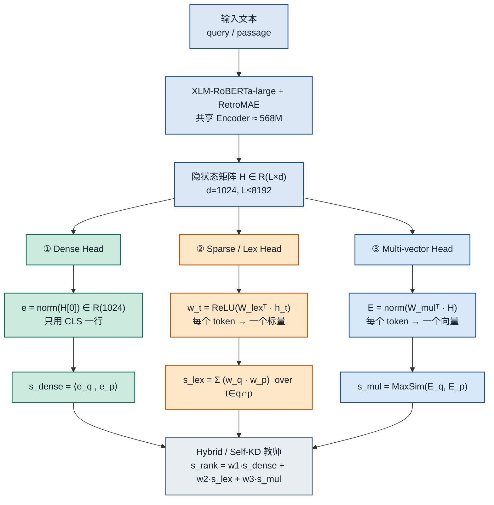
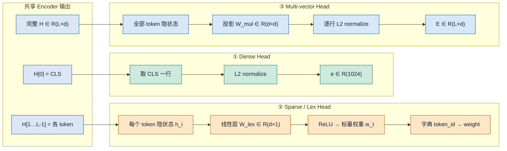
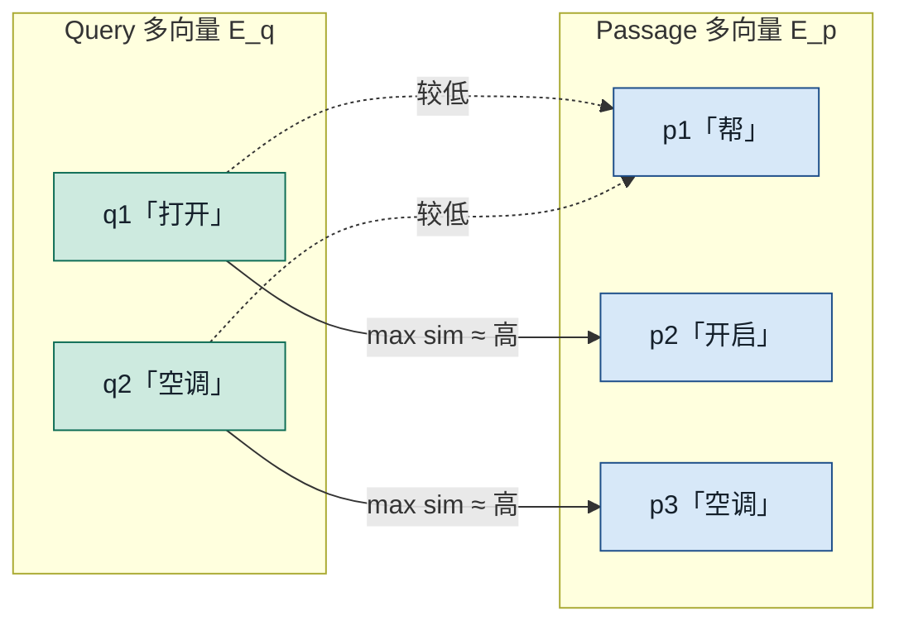
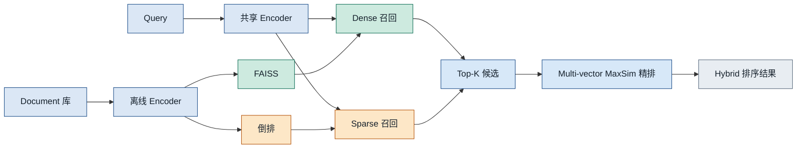

# BGE-M3 三功能统一详解报告

## Dense + Sparse + Late Interaction：从零理解到论文级机制

> **版本**: v1.1
> **日期**: 2026-07-17
> **定位**: 《[Embedding 调研报告](../../Embedding调研报告.md)》的专题深读材料；面向「只熟悉 BERT / Qwen-VL 类稠密表示」的读者
> **主文献**: Chen et al., *M3-Embedding: Multi-Linguality, Multi-Functionality, Multi-Granularity Text Embeddings Through Self-Knowledge Distillation*, arXiv:2402.03216
> **配套代码**: [FlagEmbedding](https://github.com/FlagOpen/FlagEmbedding) · 模型卡 `BAAI/bge-m3`

---

## 目录

1. [先回答核心问题](#1-先回答核心问题)
2. [从你熟悉的世界出发](#2-从你熟悉的世界出发)
3. [Sparse Embedding 从零讲起](#3-sparse-embedding-从零讲起)
4. [三种检索范式对照](#4-三种检索范式对照)
5. [BGE-M3 是什么：M³ 含义](#5-bge-m3-是什么m³-含义)
6. [为什么一份模型能同时支持三种功能](#6-为什么一份模型能同时支持三种功能)
7. [三个 Head 的精确公式](#7-三个-head-的精确公式)
8. [自知识蒸馏：怎么把三路训在一起](#8-自知识蒸馏怎么把三路训在一起)
9. [数据与多阶段训练](#9-数据与多阶段训练)（含无监督语料表与样例）
10. [工程用法：Hybrid 与部署](#10-工程用法hybrid-与部署)
11. [论文实验要点](#11-论文实验要点)
12. [与 BERT / Qwen-VL 心智模型的对照](#12-与-bert--qwen-vl-心智模型的对照)
13. [选型建议与常见误解](#13-选型建议与常见误解)
14. [参考文献与延伸阅读](#14-参考文献与延伸阅读)

---

## 1. 先回答核心问题

**为什么 BGE-M3 可以同时支持 Dense + Sparse + Late Interaction？**

一句话：

> **同一套 Transformer 编码器只跑一遍，得到每个 token 的隐状态矩阵 $\mathbf{H}$；再用三个极轻量的「读出头」（readout heads）分别从 $\mathbf{H}$ 抽出三种表示。三种功能共享骨干、共享语义空间，但打分公式不同——因此可以单独用，也可以加权融合成 Hybrid。**

更具体地说：

| 功能                                      | 从$\mathbf{H}$ 怎么读                                     | 产出                                    | 打分               |
| ----------------------------------------- | ----------------------------------------------------------- | --------------------------------------- | ------------------ |
| **Dense**                           | 取`[CLS]` 一行并 L2 归一化                                | 1 个 1024 维向量                        | 点积 / 余弦        |
| **Sparse（Lexical）**               | 每个 token 隐状态$\to$ 线性层 + ReLU $\to$ 一个标量权重 | 词表上的稀疏权重（近似「可学习的 TF」） | 共现词权重乘积求和 |
| **Multi-vector / Late Interaction** | 全部 token 隐状态经投影矩阵后归一化                         | $N$ 个向量（$N$=序列长）            | ColBERT 式 MaxSim  |

所以它**不是**「三个互不相干的模型塞进一个文件」，而是：

**图 1 · 总览：一次 Encoder 前向 → 三个读出头 →（可选）融合打分**



```legend
backbone|共享 Encoder / 隐状态 H
dense|Dense：CLS → 单向量
sparse|Sparse：token → 词权重
mul|Multi-vector：token → 多向量
fusion|Hybrid 融合 / Self-KD 教师
```

训练时用 **Self-Knowledge Distillation（自知识蒸馏）** 把三路分数集合成更强的「教师信号」，再反哺每一路，避免多目标互相打架。这是论文声称「能真正统一三功能」的关键训练技巧，而不只是架构拼装。

---

## 2. 从你熟悉的世界出发

假设你熟悉的是：

- **BERT**：输入文本 → 每层 attention → 最后一层每个 token 有一个隐向量；常用 `[CLS]` 做分类。
- **Sentence-BERT / E5 / BGE-v1.5**：把 BERT 式编码器训成「一句一个稠密向量」，用余弦相似度检索。
- **Qwen-VL**：多模态时也是「编码成向量 / 再生成」；检索向的 VL Embedding 多数仍是 **稠密单向量**（或 patch 多向量）。

这些都属于 **Dense（稠密）表示**：向量几乎每个维度都非零，维度 $d$ 通常 384～4096，远小于词表大小。

BGE-M3 的骨干正是这类东西——**扩展过位置编码的 XLM-RoBERTa-large（约 568M）**，上下文可达 **8192 tokens**。它并没有发明全新骨干，而是问：

> 既然 Encoder 已经为**每个 token**算出了隐状态，为什么只扔给 `[CLS]`？其余 token 的信息能不能再读出两种「检索语言」——词级稀疏权重、以及 ColBERT 式多向量？

答案是可以。Dense / Sparse / Late Interaction 在表示论上是三种**读出与打分约定**，不必各训一个完整 Encoder。

---

## 3. Sparse Embedding 从零讲起

### 3.1 先忘掉「Embedding = 稠密向量」

检索史上更早、至今仍极强的是 **词袋 / 倒排索引**：

- 文档用「出现了哪些词、权重多少」表示；
- Query 也是词集合；
- 靠 **共现词** 打分（经典是 **BM25**）。

这种表示在数学上是一个 **几乎全是 0、只有出现过的词位置非零** 的超高维向量——维度 = 词表大小 $|V|$（常 $3\times10^4$～$2\times10^5$）。这就是 **Sparse（稀疏）向量**。

|            | Dense                              | Sparse（词法）                     |
| ---------- | ---------------------------------- | ---------------------------------- |
| 维度       | 低（如 1024）                      | 高（≈词表）                       |
| 非零元素   | 几乎全非零                         | 极少（句子里出现的词）             |
| 相似度含义 | 语义相近即可（「打开」≈「开启」） | 更强调**字面/词项**重合      |
| 索引       | FAISS / HNSW 等 ANN                | Lucene / 倒排索引                  |
| 典型弱点   | 专有名词、精确 SKU、稀有词易糊     | 同义改写、跨语意近但用词不同时易漏 |

**Hybrid 检索**之所以成为工业标配，正是因为两者互补：Dense 抓语义，Sparse/BM25 抓关键词。

### 3.2 「可学习的 Sparse」和 BM25 差在哪

BM25 的词权重来自统计公式（TF、IDF、文档长度），**没有神经网络**。

神经稀疏检索（如 **SPLADE**、DeepCT、uniCOIL，以及 BGE-M3 的 Lexical 头）则是：

> 用 Encoder 的 token 隐状态，**预测每个词项有多重要**；还可以隐式做「扩展」（模型给未出现的相关词也打一点权重——视实现而定）。

BGE-M3 的 Sparse 头相对直接（更接近「学习到的词项重要性」，而不是完整 SPLADE 那套 MLM 扩展）：

对 query 第 $i$ 个 token（对应词项 $t$）：

$$
w_{q_t} = \mathrm{ReLU}\big(\mathbf{W}_{lex}^{T} \mathbf{H}_q[i]\big)
$$

- $\mathbf{W}_{lex} \in \mathbb{R}^{d \times 1}$：把 $d$ 维隐状态压成 **一个正数权重**（ReLU 保证非负）；
- 同一词项出现多次时，**只保留最大权重**；
- Passage 侧同理得到 $w_{p_t}$。

相关分数只在 **query 与 passage 共现的词项** 上求和：

$$
s_{lex} = \sum_{t \in q \cap p} \big(w_{q_t} \cdot w_{p_t}\big)
$$

直观例子：

| Query              | Passage                         | Dense 可能     | Sparse 可能                    |
| ------------------ | ------------------------------- | -------------- | ------------------------------ |
| 「iPhone 15 蓝色」 | 「苹果手机第十五代 蓝色款参数」 | 语义近 → 高分 | 若分词后字面重合少 → 可能偏低 |
| 「SKU-A1934」      | 含精确 SKU 的规格页             | 偶发漏检       | 词项重合 → 高分               |

因此 Sparse **不是**「另一种 Dense」，而是 **把神经网络接到传统倒排打分接口上**：输出仍可进 Lucene 一类稀疏索引，延迟接近 BM25，但权重量是学出来的。

### 3.3 和你熟悉的 BERT 输出如何对应

BERT 最后一层：`hidden_states` 形状 `[batch, seq_len, hidden]`。

- 做分类 / Dense 检索：常用 `hidden[:, 0, :]`（`[CLS]`）或 mean-pool。
- 做 BGE-M3 Sparse：对 `hidden[:, i, :]` 每个位置过同一个 `Linear(d→1)+ReLU`，得到该位置 token 的重要性；再按 **词表 id** 聚合到稀疏向量。

你不需要新学一种「神秘 Embedding」——它就是 **对 BERT 式隐状态做另一种 readout**。

---

## 4. 三种检索范式对照

```
┌──────────────┬────────────────────┬─────────────────────────────┬──────────────────┐
│ 范式         │ 每条文本存什么      │ 交互时机                     │ 代表             │
├──────────────┼────────────────────┼─────────────────────────────┼──────────────────┤
│ Dense        │ 1 个稠密向量        │ 编码后点积（几乎无交互）      │ DPR, E5, BGE     │
│ Sparse       │ 词表上稀疏权重      │ 编码后按共现词乘加            │ BM25, SPLADE, M3 │
│ Late Inter.  │ 每 token 一个向量   │ 编码后 MaxSim（晚期交互）     │ ColBERT, M3 mul  │
│ Cross-Enc.   │ 不预存（成对算）    │ 编码前就拼在一起全注意力      │ Reranker         │
└──────────────┴────────────────────┴─────────────────────────────┴──────────────────┘
```

**Late Interaction（晚期交互）** 提醒：query / doc **仍可独立编码、离线建库**；交互发生在检索打分阶段（MaxSim），所以叫 late——相对 Cross-Encoder 的 early full interaction。详见此前对话中的 ColBERT 讲解；BGE-M3 的 multi-vector 头就是 ColBERT 风格实现。

---

## 5. BGE-M3 是什么：M³ 含义

论文标题里的 **M3** = 三重「Multi」：

| 维度                          | 含义        | BGE-M3 做到什么                                         |
| ----------------------------- | ----------- | ------------------------------------------------------- |
| **Multi-Linguality**    | 多语 / 跨语 | 100+ 语言；同语检索 + 跨语检索（如中文 query 搜英文库） |
| **Multi-Functionality** | 多检索功能  | Dense + Sparse + Multi-vector 同一模型                  |
| **Multi-Granularity**   | 多粒度输入  | 短句 → 长文档，最长**8192** tokens               |

**规格速览**（以公开模型卡为准）：

| 项         | 值                                                                           |
| ---------- | ---------------------------------------------------------------------------- |
| 骨干       | XLM-RoBERTa-large 系，RetroMAE 适配                                          |
| 参数量     | ~568M                                                                        |
| Dense 维度 | 1024                                                                         |
| 最大长度   | 8192                                                                         |
| 许可       | MIT（FlagEmbedding / BAAI）                                                  |
| 定位       | 生产 RAG 里「可私有化的多语 Hybrid 底座」常客；MTEB 未必最高，但工程功能极全 |

---

## 6. 为什么一份模型能同时支持三种功能

从设计原则拆开看：

### 6.1 共享 Encoder，异构读出（Heterogeneous Predictors）

论文明确写：`[CLS]` 用于 Dense；**其余 token 的 embedding** 用于 Sparse 与 Multi-vector。三者都是对同一 $\mathbf{H}$ 的不同函数：

- Dense：全局语义摘要（句子/段落级）；
- Sparse：词项重要性（词汇级、可解释、可倒排）；
- Multi-vector：保留 token 级几何，供 MaxSim 细粒度对齐。

这符合集成学习直觉：**异构预测器**（看问题的粒度不同）合成后往往更强——也为下一节的自蒸馏提供了「教师」候选。

**图 2 · 三个 Head 怎么从同一份 $\mathbf{H}$ 读出**



```legend
backbone|共享隐状态 H（只算一遍）
dense|Dense：几乎零额外参数
sparse|Sparse：W_lex 仅 d×1
mul|Mul：W_mul 为 d×d 投影
```

要点对照：

| Head | 读哪些行 | 额外参数 | 产出形态 | 典型索引 |
|------|----------|----------|----------|----------|
| Dense | 仅 `H[0]`（CLS） | 无 | 1 个稠密向量 | FAISS / HNSW |
| Sparse | 每个 token（常含全部位置） | $\mathbf{W}_{lex}$ | 稀疏 `{词:权重}` | Lucene / 倒排 |
| Multi-vector | 全部 token | $\mathbf{W}_{mul}$ | $L$ 个向量 | 多向量索引 / 作精排 |

### 6.2 参数增量极小

相对整颗 568M Encoder：

- Dense：基本无额外参数（归一化 `[CLS]`）；
- Sparse：$\mathbf{W}_{lex}$ 仅 $d\times 1$（约一千个参数量级）；
- Multi-vector：$\mathbf{W}_{mul} \in \mathbb{R}^{d\times d}$（百万级，相对骨干仍小）。

因此「三功能」主要是 **训练目标与推理接口** 的统一，不是三倍算力的三个模型。

### 6.3 推理时仍可「各取所需」

同一 `encode` 可按需返回：

```text
return_dense / return_sparse / return_colbert_vecs
```

工程上常见组合：

1. **召回**：Dense（FAISS）和/或 Sparse（Lucene）——快、可扩展；
2. **精排**：对 Top-K 用 Multi-vector MaxSim，或再上 Cross-Encoder Reranker；
3. **融合**：加权和 $s_{rank}$（见 §10）。

Multi-vector **通常不做全库扫描**（存储与算力约为 Dense 的序列长度倍），论文实验里也常把它当 reranker。

### 6.4 关键：必须用联合训练技巧压住冲突

若简单把三个 InfoNCE 损失相加，目标可能互相冲突（例如过度偏向字面匹配会伤跨语 Dense）。BGE-M3 用 **Self-Knowledge Distillation**（§8）把三路分数合成教师，再蒸馏回各头——这是「能同时支持且都好用」的训练侧答案，与架构侧「三个 head」同等重要。

---

## 7. 三个 Head 的精确公式

以下与论文 §3.2 / 官方文档一致。记 Encoder 输出为 $\mathbf{H}_q, \mathbf{H}_p$。

### 7.1 Dense

$$
e_q = \mathrm{norm}(\mathbf{H}_q[0]),\quad e_p = \mathrm{norm}(\mathbf{H}_p[0])
$$

$$
s_{dense} = \langle e_q, e_p \rangle
$$

即：归一化 `[CLS]` 的内积（等价于余弦，因已 L2 norm）。

### 7.2 Sparse / Lexical

$$
w_{q_t} = \mathrm{ReLU}(\mathbf{W}_{lex}^{T} \mathbf{H}_q[i]),\quad
s_{lex} = \sum_{t \in q \cap p}(w_{q_t}\cdot w_{p_t})
$$

同词多项取 max weight。实现上常得到 `{token_id: weight}` 字典，便于进稀疏索引。

### 7.3 Multi-vector（Late Interaction）

$$
E_q = \mathrm{norm}(\mathbf{W}_{mul}^{T} \mathbf{H}_q),\quad
E_p = \mathrm{norm}(\mathbf{W}_{mul}^{T} \mathbf{H}_p)
$$

$$
s_{mul} = \frac{1}{N}\sum_{i=1}^{N}\max_{j=1}^{M}\, E_q[i]\cdot E_p[j]^{\top}
$$

即 ColBERT **MaxSim**：每个 query token 向量在 doc 侧找最相似 token，再对 query 长度取平均。

**图 3 · MaxSim 打分示意（Late Interaction）**



```legend
dense|Query token 向量（在线编码）
mul|Passage token 向量（可离线入库）
```

读图：实线是每个 $q_i$ 取到的 **max** 对齐；虚线是未入选的候选。总分 $\approx$ 各实线相似度之和（再按论文公式对 $N$ 平均）。

### 7.4 Hybrid 融合

$$
s_{rank} = w_1\cdot s_{dense} + w_2\cdot s_{lex} + w_3\cdot s_{mul}
$$

论文示例权重：$w_1=1,\ w_2=0.3,\ w_3=1$（可按任务调；Sparse 权重偏低是因其尺度与稳定性）。

---

## 8. 自知识蒸馏：怎么把三路训在一起

### 8.1 单路损失：InfoNCE

对任一打分函数 $s(\cdot)\in\{s_{dense}, s_{lex}, s_{mul}\}$：

$$
\mathcal{L}_{s} = -\log\frac{\exp(s(q,p^{*})/\tau)}{\sum_{p\in\{p^{*}\}\cup P'}\exp(s(q,p)/\tau)}
$$

### 8.2 集成分数作教师

$$
s_{inter} = w_1 s_{dense} + w_2 s_{lex} + w_3 s_{mul}
$$

直觉：三路异构，集成后排序信号更稳，当作 **软标签教师**（无需外挂大 Reranker）。

### 8.3 蒸馏损失 + 最终目标

对各头用教师分布做蒸馏（论文形式）：

$$
\mathcal{L}'_* = -p(s_{inter})\,\log p(s_*)
$$

再与原生多任务损失组合。训练初期 Sparse 头随机初始化较差，故设较小的 $w_2,\lambda_2$（如 $0.3 / 0.1$），避免早期脏信号主导。

**要点**：所谓「Self」是指教师来自 **模型自身三路输出的集成**，不是另一个冻结大模型——与外部 Cross-Encoder 蒸馏不同，但思想同属「软标签优于 hard one-hot」。

---

## 9. 数据与多阶段训练

### 9.1 先澄清：不是「图像多模态」

论文标题里的 **Multi-** 是 **Multi-Linguality / Multi-Functionality / Multi-Granularity**（多语、多功能、多粒度），**不是** CLIP 那种图像–文本多模态。

所谓 **Unsupervised Contrastive（无监督对比预训练）**，指的是：

- **没有**人工标的「相关 / 不相关」检索标签；
- 从大规模**纯文本**语料里挖 **天然结构对** `(query_side, positive_side)`；
- 用 **InfoNCE**（主要训 Dense）把语义空间先拉顺；
- 得到中间权重 `BAAI/bge-m3-unsupervised`，再进入有监督三功能微调。

负样本主要来自 **in-batch negatives**（同 batch 其它样本的 positive），因此要尽量做大 batch。

### 9.2 数据三类（互补）

1. **无监督结构对**（论文 Table 1：**约 1.2B 文本对**，194 语 + 大量跨语对应）：见下节。
2. **有监督检索/匹配数据**：英（MS MARCO、NQ、HotpotQA…）、中（DuReader、T2-Ranking…）、多语（MIRACL、Mr. TyDi…）。
3. **合成长文档数据（MultiLongDoc / MLDR）**：从 Wiki / mC4 等长文采段落，用 GPT-3.5 生成问题 → `(问题, 全文)`，服务长文检索（属微调阶段，不是无监督主盘）。

### 9.3 无监督语料：来源、规模与构造方式

规模与来源以论文 Table 1 为准：

| 来源组 | 规模 | 语言面 | 挖出的结构对 |
|--------|------|--------|--------------|
| **MTP**（BGE 既有整理） | 291.1M | EN, ZH | 已清洗的多样文本对（标题–段落等） |
| **S2ORC + Wikipedia** | 48.3M | 以 EN 为主 | 论文 **title–abstract**；维基 **title–body** |
| **xP3 + mC4 + CC-News** | 488.4M | 多语 | **instruction–output**；网页/新闻 **title–body** 或邻近段落 |
| **NLLB + CCMatrix** | 391.3M | 跨语 | **平行句**（同一语义、不同语言） |
| **CodeSearchNet** | 344.1K | 文本–代码 | **docstring / 注释 ↔ 函数代码** |
| **合计** | **≈1.2B** | 194 语 | 过滤低质 / 低相关后入库 |

构造逻辑一句话：**文档自己带的「短侧 ↔ 长侧」或「语 A ↔ 语 B」当正样本**，不靠人工点相关。

### 9.4 各源示意样例（按结构摘录）

> 说明：FlagEmbedding **未**公开逐条 dump 的 1.2B 无监督对。下列样例按论文所述结构，从**对应公开语料的典型条目**整理，用于建立直觉；截断过长正文。真实训练前还会做噪声过滤与相关度筛选。

#### A. Wikipedia：`title → body`（S2ORC/Wiki 组）

| 角色 | 内容 |
|------|------|
| query（标题） | `北京` |
| positive（正文节选） | `北京是中华人民共和国的首都，也是全国的政治、文化中心……位于华北平原北部，……` |

| 角色 | 内容 |
|------|------|
| query | `Attention Is All You Need` |
| positive | `Attention Is All You Need is a 2017 landmark research paper in machine learning, authored by eight scientists working at Google. The paper introduced … the Transformer …` |

#### B. S2ORC：`title → abstract`（学术）

| 角色 | 内容 |
|------|------|
| query | `Attention Is All You Need` |
| positive | `The dominant sequence transduction models are based on complex recurrent or convolutional neural networks that include an encoder and a decoder. The best performing models also connect the encoder and decoder through an attention mechanism. We propose a new simple network architecture, the Transformer, based solely on attention mechanisms…` |

（正样本来自公开论文摘要；S2ORC 里大量条目都是这种 title–abstract 形态。）

#### C. xP3：`instruction → output`（指令跟随语料）

| 角色 | 内容 |
|------|------|
| query | `Translate the following sentence to Chinese: The weather is nice today.` |
| positive | `今天天气很好。` |

| 角色 | 内容 |
|------|------|
| query | `Summarize in one sentence: Knowledge distillation trains a smaller student model to mimic a larger teacher by matching soft probability distributions.` |
| positive | `Knowledge distillation compresses models by transferring a teacher's soft predictions to a student.` |

#### D. mC4 / CC-News：`title → article`（网页 / 新闻）

| 角色 | 内容 |
|------|------|
| query | `OpenAI releases CLIP for connecting images and text` |
| positive | `Researchers introduced a model that learns visual concepts from natural language supervision by jointly training an image encoder and a text encoder on hundreds of millions of image–text pairs collected from the internet…` |

（真实 CC-News / mC4 条目噪声更大；训练时会滤掉明显低相关对。）

#### E. NLLB / CCMatrix：跨语平行句

| 角色 | 内容 |
|------|------|
| query（英） | `The committee will meet next Monday.` |
| positive（中） | `委员会将于下周一开会。` |

| 角色 | 内容 |
|------|------|
| query（英） | `Please turn on the air conditioner.` |
| positive（德） | `Bitte schalten Sie die Klimaanlage ein.` |

这类对强迫模型把**同一语义的不同语言**拉到同一邻域——正是 Multi-Linguality / 跨语检索的基础。

#### F. CodeSearchNet：`docstring → code`（官方 README 示例形态）

| 角色 | 内容 |
|------|------|
| query | `Extracts video ID from URL.` |
| positive | `def get_vid_from_url(url):\n    return match1(url, r'youtu\\.be/([^?/]+)') or \\\n           match1(url, r'youtube\\.com/embed/([^/?]+)') or …` |

（出自 CodeSearchNet 公开示例 `YouTube.get_vid_from_url` / soimort/you-get。）

#### G. MTP（EN/ZH 已整理对）

MTP 是 BGE 系列沿用的大规模中英文本对合集（论文计入 291.1M），形态仍是「短文本 ↔ 相关长文本 / 平行释义」等，**不是**新造的一种模态；可把它理解成「已经帮你洗过、配对过的 Wikipedia/问答/标题段落等大杂烩」。

### 9.5 训练阶段（与总调研报告表述对齐并细化）

| 阶段                     | 做什么                                             | 启用功能         | 主要数据        |
| ------------------------ | -------------------------------------------------- | ---------------- | --------------- |
| RetroMAE 适配            | 掩码自编码增强 Encoder 表示                        | 骨干             | 通用语料        |
| Unsupervised Contrastive | 大规模无监督对比，先把 Dense 空间拉好              | **主要 Dense**   | §9.3 的 1.2B 对 |
| Unified Fine-tuning      | 三功能联合 + Self-KD + hard negatives（ANCE 风格） | Dense+Sparse+Mul | 有监督 + MultiLongDoc |

长序列训练靠 **按长度分桶 batching、gradient checkpointing、跨 GPU broadcast 扩大 in-batch negatives**，否则 8K 上下文下 batch 太小会伤对比学习判别力。论文还提到推理侧可选的 **MCLS**（插入多个 `[CLS]` 再平均）作为轻量长文技巧。

---

## 10. 工程用法：Hybrid 与部署

### 10.1 推荐 Pipeline（与论文一致）

```
Corpus 离线:
  encode → Dense 向量库 (FAISS)
         → Sparse 倒排 (Lucene)
         → (可选) 存 ColBERT 多向量供精排

Query 在线:
  ① Dense Top-1000  ∪  Sparse Top-1000
  ② 融合 / 或再对 Dense Top-200 做 Multi-vec MaxSim
  ③ (可选) Cross-Encoder Reranker（如 bge-reranker-v2-m3）
  ④ 送入 LLM 生成
```

### 10.2 FlagEmbedding 使用示意

```python
from FlagEmbedding import BGEM3FlagModel

model = BGEM3FlagModel("BAAI/bge-m3", use_fp16=True)
out = model.encode(
    ["打开空调"],
    return_dense=True,
    return_sparse=True,
    return_colbert_vecs=True,
)
# out["dense_vecs"], out["lexical_weights"], out["colbert_vecs"]
```

### 10.3 存储与延迟直觉

| 模式      | 每文档存储          | 全库检索代价      | 适合       |
| --------- | ------------------- | ----------------- | ---------- |
| Dense     | $O(d)$            | ANN 亚线性        | 主召回     |
| Sparse    | $O(\#$非零词$)$ | 倒排，类似 BM25   | 关键词互补 |
| Multi-vec | $O(L\cdot d')$    | 重，宜 Top-K 精排 | 细粒度重排 |

---

## 11. 论文实验要点

以下为论文表格量级结论（细节以 arXiv:2402.03216 为准）：

1. **MIRACL（18 语同语检索）**

   - Dense 已强于多数多语 Dense 基线（含部分更大 LLM Embedding）；
   - Sparse 全面超过同 tokenizer 设定下的 BM25；
   - Multi-vec 再提升；**Dense+Sparse** 与 **All 三路融合** 达到最佳。
2. **MKQA（跨语）**

   - Dense / 融合显著强于 BM25；Sparse 单独跨语较弱（符合「依赖词面重合」直觉），但进融合仍有贡献。
3. **MLDR 长文档**

   - 在 8K 设定下，**Sparse 与 Dense+Sparse 优势明显**（长文里关键词锚点极重要）；
   - 去掉长文训练数据会明显掉点 → Multi-Granularity 不是「拉长位置编码」这么简单，需要数据与 batch 策略。
4. **消融**

   - 自蒸馏、大数据、高效 batch 均对最终质量有贡献；三功能协作 > 单功能。

---

## 12. 与 BERT / Qwen-VL 心智模型的对照

| 你已有的概念                    | BGE-M3 中的对应                                                                             |
| ------------------------------- | ------------------------------------------------------------------------------------------- |
| BERT`[CLS]` 分类向量          | Dense 检索向量                                                                              |
| BERT 每 token hidden            | Sparse 权重与 ColBERT 向量的原料                                                            |
| 「语义相似度」                  | Dense / 部分 Late Interaction                                                               |
| 「关键词 / 精确匹配」           | Sparse（学出来的词权重）≈ 神经版 BM25                                                      |
| Qwen-VL 的 patch / token 多向量 | 同「Late Interaction」家族；M3 是**纯文本**版，ColPali/ColQwen 是**页面图像**版 |
| 再训一个 Reranker               | M3 的 mul 头可当轻量 late interaction 精排；更强精排仍可用 Cross-Encoder                    |

**BGE-M3 不能替代**：跨模态图文检索（需 BGE-VL / GME / Qwen3-VL-Embedding 等）；也不自动等于生成式 LLM Embedding（Qwen3-Embedding）的指令跟随能力。

---

## 13. 选型建议与常见误解

### 13.1 什么时候优先 BGE-M3

- 需要 **中英/多语** + **长文** + **Hybrid** 的自托管 RAG；
- 希望 **一个 checkpoint** 同时提供稠密向量与可学习稀疏特征；
- 算力预算在 ~0.5B Encoder 量级，而不是 7B LLM Embedding。

### 13.2 常见误解

| 误解                                        | 澄清                                                                                  |
| ------------------------------------------- | ------------------------------------------------------------------------------------- |
| 「Sparse Embedding 就是另一种 1024 维向量」 | 否；是词表维稀疏权重，索引方式也不同                                                  |
| 「M3 的无监督预训练是图文多模态」          | 否；是 **多语纯文本**结构对（title–body 等）对比学习，见 §9                             |
| 「开了三功能等于三倍显存推理」              | 共享一次 Encoder 前向；额外 head 很轻。贵的是**存三套索引 / 算 MaxSim**         |
| 「有了 M3 就不用 Reranker」                 | Hybrid 已很强，但 Cross-Encoder 精排在高难度集上仍常再涨一截                          |
| 「M3 MTEB 不是第一就过时了」                | M3 卖点是**功能统一与工程形态**；纯英文短文本榜单可另选 Qwen3-Emb / NV-Embed 等 |

---

## 14. 参考文献与延伸阅读

### 主文献

1. Chen, J., Xiao, S., Zhang, P., Luo, K., Lian, D., Liu, Z. (2024). **M3-Embedding: Multi-Linguality, Multi-Functionality, Multi-Granularity Text Embeddings Through Self-Knowledge Distillation**. arXiv:2402.03216.
2. BAAI FlagEmbedding 文档： [BGE-M3](https://bge-model.com/bge/bge_m3.html) · [Tutorial](https://bge-model.com/tutorial/1_Embedding/1.2.4.html)
3. GitHub: [FlagOpen/FlagEmbedding](https://github.com/FlagOpen/FlagEmbedding)
4. Hugging Face: [`BAAI/bge-m3`](https://huggingface.co/BAAI/bge-m3)

### Sparse / Late Interaction 背景

5. Robertson & Zaragoza (2009). The Probabilistic Relevance Framework: BM25 and Beyond.
6. Formal et al. (2021). **SPLADE v2**: Sparse Lexical and Expansion Model. SIGIR.
7. Khattab & Zaharia (2020). **ColBERT**: Efficient and Effective Passage Search. SIGIR.
8. Gao et al. (2021). COIL / 相关 lexical neural retrieval 工作线.
9. Xiao et al. (2022). **RetroMAE**. （M3 骨干增强）

### 本仓库关联文档

- 总览与选型：[Embedding 调研报告](../../Embedding调研报告.md)（§2.1.6 BGE 全家桶、§3.2 三范式、§5 训练、§8 Hybrid）
- 蒸馏视角：M3 的 Self-KD 与《[知识蒸馏技术深度调研报告](../../../distillation/知识蒸馏技术深度调研报告.md)》中 Embedding 自蒸馏条目互参

---

## 附录 A：一张图记住全部

见正文 **图 1**（总览）与 **图 2**（三头读出）。部署时再记一句：



```legend
backbone|编码（doc 侧可离线）
dense|Dense 召回通路
sparse|Sparse 召回通路
mul|Late Interaction 精排
fusion|最终输出
```

## 附录 B：术语速查

| 术语                        | 含义                                       |
| --------------------------- | ------------------------------------------ |
| Lexical / Sparse retrieval  | 基于词项权重的稀疏检索                     |
| MaxSim                      | 每个 query 向量对 doc 向量取最大相似再聚合 |
| Self-Knowledge Distillation | 用自身多路集成分数作教师蒸馏               |
| RetroMAE                    | 检索向掩码自编码预训练                     |
| Hybrid                      | 多路召回/打分融合                          |
| MCLS                        | 多`[CLS]` 平均的长文推理技巧             |

---

*本报告依据 arXiv:2402.03216、FlagEmbedding 官方文档与公开技术解读整理，作为仓库内 Embedding 调研的专题参考；公式与实验数字以原论文为准。*
