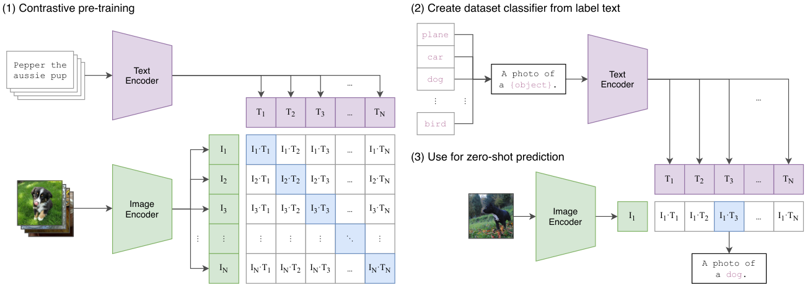
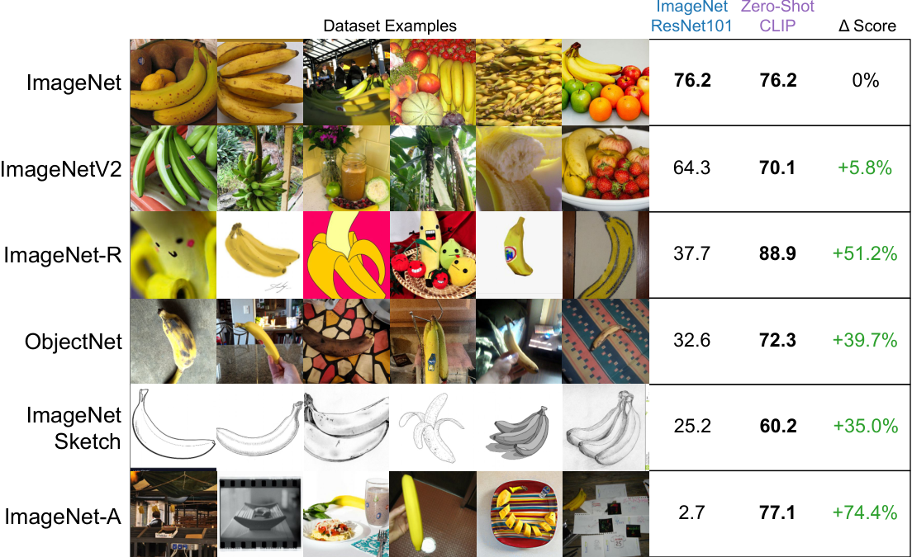
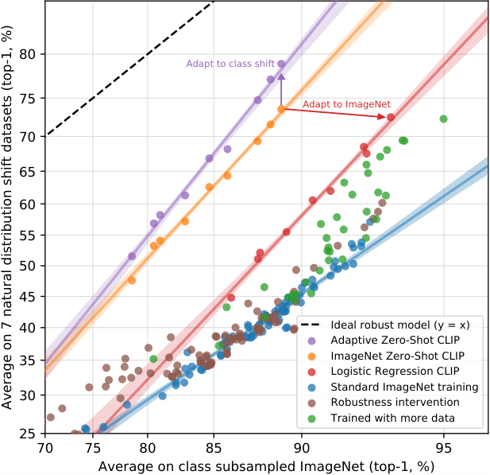
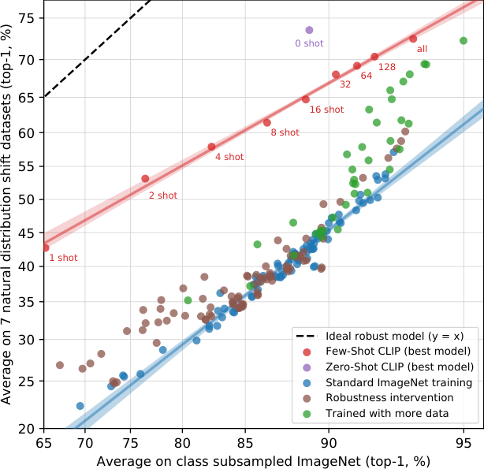
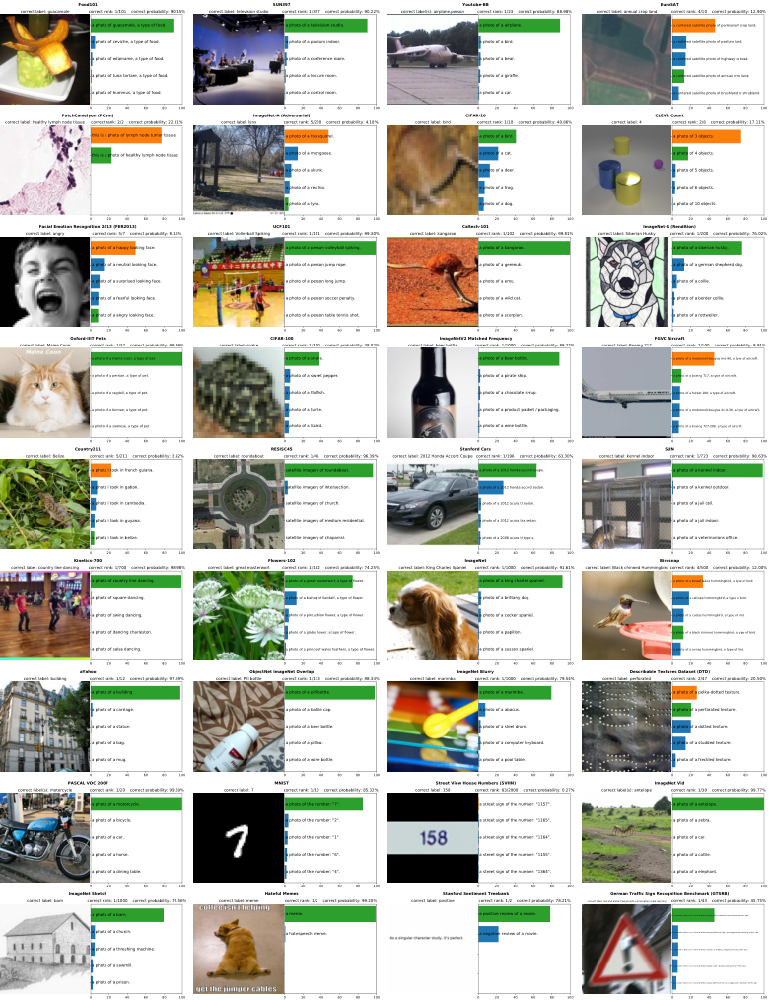

# CLIP：自然语言监督下的可迁移视觉表征

> **paper**：[Learning Transferable Visual Models From Natural Language Supervision (ICML 2021)](https://arxiv.org/abs/2103.00020)
> **project / code / weights**：[openai.com/research/clip](https://openai.com/research/clip) · [OpenAI/CLIP](https://github.com/OpenAI/CLIP)
> **refs**：[ConVIRT (Zhang 2020)](https://arxiv.org/abs/2010.00747) · [VirTex (Desai & Johnson 2020)](https://arxiv.org/abs/2006.06666) · [Multi-class N-pair loss (Sohn 2016)](https://papers.nips.cc/paper/2016/hash/6b180037abbebea991d8b1232f8a8ca9-Abstract.html) · [InfoNCE (Oord 2018)](https://arxiv.org/abs/1807.03748) · [ViT (Dosovitskiy 2020)](https://arxiv.org/abs/2010.11929)
> **backbone**：ResNet 家族（RN50 / 101 / RN50x4 / x16 / x64；EfficientNet-style scaling）+ ViT-B/32、B/16、L/14、L/14@336px；Text encoder = 12 层 63M Transformer；Vocab 49k BPE
> **date**：2021-02
> **modality**：文本 ↔ 图像（双塔）
> **languages**：英文（4 亿 WIT 抓取时按英文 query 挑选）；OpenCLIP / MetaCLIP 后续做了多语延展
>
> 本文按机制而不是按主表读 CLIP：为什么弱监督对比学习是**训练效率**的最优解、双塔对称 InfoNCE 的实现细节、prompt engineering + 分类头「用文本合成」的推理机理、以及零样本在自然分布漂移下的鲁棒性。跳过大部分具体数据集分数——那是 4 年前的榜，参考价值不高。

---

## 一句话定位

CLIP = **图像塔 + 文本塔 + 对称 InfoNCE + 4 亿 (image, text) 对**，学到一个**跨模态共享向量空间**。它的贡献不是把 ImageNet 准确率再刷高，而是：

1. **零样本视觉分类**：不需要任何目标数据集标注，把类名塞进文本塔就能推理。
2. **一次训练，跨 30+ 数据集迁移**：ResNet-50 zero-shot 打平原生 ResNet-50 全监督；后续 ImageNet-Sketch / ObjectNet 等自然分布漂移下 CLIP 稳，而 ImageNet 全监督模型崩。
3. **一套开箱可用的图文嵌入基础**：BLIP、SigLIP、Jina-CLIP、ColPali、GME-Qwen-VL、Nomic-Embed-Vision、Cohere Embed-v4 等**几乎所有开源图文嵌入模型都以 CLIP 双塔为起点**。

| 项              | 内容                                                          |
| --------------- | ------------------------------------------------------------- |
| 训练数据        | **WIT (WebImageText)**：4 亿 (image, text) 对；50 万 query 覆盖 |
| 图像塔（最终推荐）| **ViT-L/14@336px**（12 天 × 256× V100）                       |
| 文本塔          | 12 层 Transformer, 512 宽, 8 头, 63M 参；BPE 49k              |
| 相似度          | L2-normalized cosine，可学温度 $\tau$                          |
| batch size      | **32,768**（跨 GPU 分片计算相似度）                            |
| 训练 epochs     | 32                                                             |
| Zero-shot 主表  | ImageNet-1k top-1 **76.2%**（无一张训练图）；top-5 95%          |

## 谱系与位置

```text
Visual N-Grams (2017)  ─┐  弱监督图文，11.5% ImageNet zero-shot
VirTex / ICMLM (2020)   ├─→  CLIP (2021) ──→ ALIGN (Google)、Florence
ConVIRT (2020, 医疗)    ─┘         │
                                   ├─→ OpenCLIP (LAION 5B)
                                   ├─→ SigLIP / SigLIP 2 (sigmoid loss)
                                   ├─→ EVA-CLIP / MetaCLIP (数据/骨干迭代)
                                   ├─→ Jina-CLIP v1/v2、Nomic Embed Vision、BGE-VL
                                   ├─→ VLM 视觉塔基石（LLaVA / Qwen-VL / …）
                                   └─→ ColPali / ColQwen（视觉文档 Late Interaction）
```

CLIP 是**图文嵌入的公理**：4 年后的今天，几乎每一篇多模态嵌入论文都会引 CLIP、并在骨干或数据配方上对它做局部改动。理解 CLIP 后，SigLIP 只是把 softmax 换成 sigmoid、MetaCLIP 只是把数据 curation 公开可复现、BGE-VL 只是把训练数据合成流程系统化。

---

## 问题背景：为什么此前弱监督图文表征做不起来

CLIP 之前，「用自然语言 caption 监督视觉表征学习」已被研究 20+ 年（Mori 1999、Quattoni 2007、Joulin 2016、Li 2017）。但直到 2020 年，用这条路做出的 ImageNet zero-shot 也仅 **11.5%**（Visual N-Grams）——远低于全监督 SOTA 88.4%，甚至低于经典视觉方法。

问题不在思路，在**规模与训练目标**：

1. **数据规模不够大**：MS-COCO、Visual Genome 都只有 ~10 万张标注图；YFCC100M 有 1 亿，但英文自然语言描述过滤后只剩 1500 万。
2. **训练目标太苛刻**：VirTex / ICMLM 走**预测 caption 每个词**（生成式），要求视觉塔编码到能被文本塔解码出完整原句 —— 这个约束太强，图像可能有无数种「合理描述」。
3. **计算量与预测目标不匹配**：预测每一个词等于强迫模型记住 caption 的表面变体，训练效率极差。

CLIP 的三个转向：

1. **数据规模翻数十倍**：抓取 **4 亿** 图文对（WIT），比 YFCC 大 4 倍、比 ImageNet 大 320 倍。
2. **弃生成式改对比式**：不再预测每个词，只预测**整段 caption 是否与图像配对**——一个更容易的代理任务。
3. **训练效率专项优化**：Prompt 简化、单一 random crop 数据增强、可学温度、大 batch 分片计算。

论文 Figure 2 明确画出这一效率跃迁：

- Transformer LM 生成式（VirTex 类）zero-shot ImageNet：进展缓慢
- 换成 **Bag-of-Words 预测**：**3× 效率**
- 再换成 **对比 InfoNCE**（CLIP）：**再 4× 效率** —— 合起来是 12×

「简化训练任务，把资源砸向数据规模」这条洞察就是 CLIP 相对 VirTex 的分水岭。

---

## 方法：双塔对称 InfoNCE

### 训练视图



上图左半 (1) 是训练：给一个 $N$-对 batch $\{(I_i, T_i)\}$，图像塔与文本塔独立编码，得到 $\{I_i^f, T_i^f\}$，再各自过一个线性投影 + L2 归一化，得到 $\{I_i^e, T_i^e\} \subset \mathbb{S}^{d-1}$（单位超球）。

相似度矩阵 $\mathbf{S} \in \mathbb{R}^{N\times N}$：

$$
\mathbf{S}_{ij} \;=\; \frac{I_i^e \cdot T_j^e}{\|I_i^e\| \, \|T_j^e\|} \cdot \exp(\tau)
$$

（因为 embed 已 L2-normalized，分母恒为 1；$\tau$ 是可学的对数温度）。

对角线是真配对、非对角线是错配对（$N \times N - N$ 个）。CLIP 用**对称交叉熵**：

$$
\mathcal{L}_{\text{img}\rightarrow\text{txt}} \;=\; -\frac{1}{N}\sum_{i=1}^{N} \log \frac{e^{\mathbf{S}_{ii}}}{\sum_{j=1}^{N} e^{\mathbf{S}_{ij}}}
$$

$$
\mathcal{L}_{\text{txt}\rightarrow\text{img}} \;=\; -\frac{1}{N}\sum_{i=1}^{N} \log \frac{e^{\mathbf{S}_{ii}}}{\sum_{j=1}^{N} e^{\mathbf{S}_{ji}}}
$$

$$
\mathcal{L} \;=\; \frac{1}{2}\bigl( \mathcal{L}_{\text{img}\rightarrow\text{txt}} + \mathcal{L}_{\text{txt}\rightarrow\text{img}} \bigr)
$$

**核心是「row-softmax + column-softmax + 平均」**：既让每张图找到对的文本（图→文检索），也让每段文本找到对的图（文→图检索）。这与后来 GTR / INSTRUCTOR 的「双向 in-batch」完全同源，但 CLIP 是把它推到跨模态的第一个大规模案例。

### 官方伪代码

```python
# I: minibatch images [N, H, W, C]
# T: minibatch texts  [N, L]
# W_i, W_t: 学的投影
# t: 学的对数温度参数

I_f = image_encoder(I)          # [N, d_i]
T_f = text_encoder(T)           # [N, d_t]

I_e = l2_normalize(I_f @ W_i)   # [N, d_e]
T_e = l2_normalize(T_f @ W_t)   # [N, d_e]

logits = I_e @ T_e.T * exp(t)   # [N, N]  相似度矩阵
labels = arange(N)              # 对角线为正例

loss_i = cross_entropy(logits,   labels, axis=0)  # 图 → 文
loss_t = cross_entropy(logits,   labels, axis=1)  # 文 → 图
loss   = (loss_i + loss_t) / 2
```

### 三个刻意简化

CLIP 与 ConVIRT（前身）相比，特意去掉了几处「原本以为该有」的复杂度：

1. **不用非线性投影头**：MoCo / SimCLR 里流行的 MLP projection 换成**一层线性投影 + L2 归一化**——作者认为 MLP 是与视觉自监督特定训练细节耦合出来的，对图文对比没帮助（并做了消融验证）。
2. **只做 random square crop**：抛弃 SimCLR 那套复杂的颜色抖动 / 灰度化等增强——因为数据量大到足以覆盖分布，不再需要增强来喂多样性。
3. **温度 $\tau$ 可学**：初始化为 $\log(1/0.07)$（约 2.66，等价 $\tau=0.07$），训练中直接优化，**上界剪到不超过 100**（$\log \tau_{\max} \approx 4.6$）——超过就训练不稳。

### 骨干与规模

- **图像塔**：
  - 5 个 ResNet：ResNet-50、ResNet-101、RN50×4、×16、×64（宽 × 深 × 分辨率同步 scaling，遵循 EfficientNet 建议）。原始 ResNet 头换成 **transformer-style attention pooling**（single-head QKV）以替代 global avg pool。
  - 3 个 ViT：ViT-B/32、B/16、L/14。加了 patch+pos embed 后的一层额外 LayerNorm。
  - 论文最终推荐版本：**ViT-L/14@336px**（预训完成后在 336 分辨率再训 1 epoch，仿 FixRes）。
- **文本塔**：63M 参、12 层、512 宽的 Transformer；BPE 49k；序列 76 token。用 [SOS] 与 [EOS] 包裹，取 [EOS] 位的 last-layer 表征做投影。**保留了 causal mask**（虽然对比学习不需要，但保持可继续做 LM 预训练的可能性）。

### 训练配置

| 项              | 值                                                       |
| --------------- | -------------------------------------------------------- |
| 优化器          | Adam + decoupled weight decay                            |
| lr schedule     | Cosine，Adam ε=1e-6                                       |
| batch size      | **32,768**                                               |
| epoch           | 32                                                        |
| 温度初始值      | 0.07（clip 到 log ≤ 4.6）                                 |
| Mixed precision | 是（FP16 + FP32 master）                                  |
| 显存优化        | Gradient checkpointing / half-precision Adam / 半精度 stochastic-rounded 文本塔权重 |
| 相似度分片      | 每 GPU 只算自己那一段对的相似度，然后汇总                |
| 训练时长        | RN50×64 用 592× V100 训 18 天；ViT-L/14 用 256× V100 训 12 天 |

「相似度分片」是 batch 3.2 万能训起来的工程关键：直接做 $32768 \times 32768$ 的相似度矩阵会爆显存；CLIP 把每个 GPU 分到的相似度子块单独算，然后 all-gather 汇总，避免了完整矩阵物化。

---

## Zero-Shot 推理：用文本合成分类头

CLIP 最大的实用价值是**推理阶段用类名当分类器**。对任意视觉分类数据集：

1. **文本合成头**：取所有类名 $\{c_1, \dots, c_K\}$，加 prompt 模板得到 $\{T_k\} = \{\text{"A photo of a } c_k\text{."}\}$；过文本塔得到 $\{T_k^e\}$，构成 $[K, d_e]$ 的分类器权重矩阵。
2. **图像编码**：$I^e = \text{ImageEncoder}(I)$。
3. **打分与预测**：$\hat y = \arg\max_k \, I^e \cdot T_k^e$。

**这个 3 步等价于一个「无 bias、L2 归一权重、可学温度」的多分类逻辑回归**。文本塔在扮演 hypernetwork（Ha 2016）的角色：它根据输入类名**动态生成分类器权重**。

### Prompt engineering：从 "cat" 到 "A photo of a cat"

论文 §3.1.4 强调，直接用类名 `cat` 会因 **多义性**（cat 可以是动物、可以是船缆）在很多数据集上掉分。改成 `A photo of a cat.` 后（一个非常简单的模板），平均 ImageNet 类型的准确率提升约 **1.3%**。更精细的 prompt：

- 对细粒度类（鸟、飞机）：`A photo of a {c}, a type of {supercategory}.`
- 对 OCR 任务：`A photo of the number: "{c}".`
- 对卫星图：`A satellite photo of {c}.`

再加 **prompt ensembling**：为同一个 dataset 写多个 prompt 模板，把它们的文本 embedding **平均**（而不是概率平均），当作最终分类器权重。总合起来在 27 个数据集上均值 **+5** 点、且**几乎不增加推理成本**（一次性合成、缓存）。

论文 Appendix 里附了 80 个 prompt 模板，工程上直接可用。

---

## 关键实验：机制级观察

### 1. 训练效率跃迁

上文 §问题背景 已提到：**BoW 预测 vs Transformer LM 生成 → 3×**；**InfoNCE 对比 vs BoW 预测 → 再 4×**。这是 CLIP 相对之前弱监督路线的最根本区别，也是后续 SigLIP / ALIGN / Florence 都沿用「双塔 + InfoNCE」的原因。

### 2. Zero-Shot 强于全监督 ImageNet ResNet-50

CLIP ViT-L/14@336px 在 ImageNet-1k zero-shot 拿到 **top-1 76.2% / top-5 95%**。作为对比：

- Visual N-Grams (2017)：11.5%
- 原生 ResNet-50（全监督）：76.1%
- CLIP zero-shot ResNet-50（小尺寸）：59.6% —— 与全监督 ResNet-50 差距近 16 个点，但**没用任何 ImageNet 训练标注**。

CLIP zero-shot **在 27 个数据集里 21 个胜过 Noisy Student EfficientNet-L2 的 linear probe**——尤其是 OCR（SST2 +23.6、HatefulMemes +18.8）、地理定位（Country211 +22.7）、动作识别（Kinetics700 +6.2）、精细车型识别（Stanford Cars +15.9）。这些是 ImageNet 全监督模型「没学过」的分布或粒度。

### 3. 对自然分布漂移的鲁棒性



上图右侧的具体数字（bananas 类别）：

- **ImageNet val**：ResNet-101 76.2%，CLIP 76.2%（**并列**）
- **ImageNetV2**：ResNet-101 64.3%，CLIP 70.1%（**+5.8%**）
- **ImageNet-R**（rendition）：ResNet-101 37.7%，CLIP 88.9%（**+51.2%**）
- **ObjectNet**：ResNet-101 32.6%，CLIP 72.3%（**+39.7%**）
- **ImageNet-A**（adversarial nature）：ResNet-101 2.7%，CLIP 77.1%（**+74.4%**）
- **ImageNet Sketch**：ResNet-101 25.2%，CLIP 60.2%（**+35.0%**）

在 ImageNet val 完全并列的两个模型，一到分布漂移就相差几十个点。这说明**ImageNet 全监督模型学到了很多与训练分布高度相关但对真实世界不 transferable 的 spurious features**；CLIP 因为训练在极其多样的 web 图文分布上，天然更鲁棒。

论文进一步做的实验（Figure 14）：把 CLIP 用 L2-regularized logistic regression **适配到 ImageNet 分布**后，ImageNet val 从 76.2 拉到 **85.4**（+9.2%），但**在 7 个分布漂移数据集上平均反而略降**——**「适配到某个具体分布」这个动作本身就会削减鲁棒性**。



这个观察对下游应用非常重要：**如果目标场景本身就有分布漂移风险，直接用 CLIP zero-shot 或 few-shot 优于在训练分布上过度微调**。

### 4. Few-Shot 弱：CLIP 的一大反直觉限制

论文承认：**加少量标注（0 → k-shot linear probe）之后，短期内 CLIP 分数会下降**，直到 k ≈ 16 才回到 zero-shot 水平。原因是 zero-shot 分类器是「文本塔合成的」，在语义空间上比几个样本 fit 的 logistic regression 更 robust——加少量样本反而把权重从「语义位置」拉偏到「样本经验位置」。



**实用推论**：如果你只有 <= 8 个标注样本，**不要做 fine-tune**，直接 zero-shot + prompt engineering 更好；有大量标注时才走 linear probe 或全模型微调。

### 5. 定性可视化



从代表性数据集里挑的 zero-shot 样例：Food101 上把烤菜准确识别到 `beignets`；Country211 上从街景识别国家；SUN397 上区分「实验室」vs「机房」。这些是没有 ImageNet 全监督模型能做到的开放集分类。

---

## 训练数据集与评测速览

### WIT (WebImageText)

- **规模**：**4 亿** (image, text) 对
- **收集**：50 万种 query（英文 Wikipedia 词频 ≥100 的词、常见 bigram、Wikipedia 高访问量文章名、WordNet synset 补全），每 query 最多 20k 对（类平衡）。
- **文本总词数**：与 GPT-2 训练用的 WebText 相当。
- **公开状态**：数据本身**未开源**（OpenAI 的隐私/版权顾虑）；后来 **LAION-400M / LAION-5B** 与 **MetaCLIP** 用类似方法复现并公开。

### 评测：30+ 数据集，覆盖多个任务与分布

- **通用分类**：ImageNet、CIFAR-10/100、Food101、Flowers102、Oxford-Pets、StanfordCars、Birdsnap、SUN397、Caltech101…
- **OCR / Digit**：MNIST、SST2、HatefulMemes、SVHN…
- **细粒度 / 专业**：FGVCAircraft、GTSRB（交通标志）、RESISC45（卫星）、EuroSAT
- **视频动作**：Kinetics700、UCF101
- **视频 / 时序**：Youtube-BB、ImageNet-Vid
- **分布漂移**：ImageNetV2、ImageNet-Sketch、ImageNet-R、ObjectNet、ImageNet-A
- **地理 / 场景**：Country211、SUN397
- **对抗视觉**：ImageNet-A

**关键数据集简介**：

- **ImageNet**：1000 类 / 128 万训练 / 5 万验证；社区经典基准。
- **ImageNetV2 / ImageNet-R / ImageNet-A / ObjectNet**：都在 ImageNet 类别体系下但故意造分布漂移——V2 是重新采样的自然分布、R 是艺术风格化、A 是自然对抗、ObjectNet 是不同姿态与背景。
- **Country211**：从 YFCC100M 中筛出的国家标注集，测地理线索识别能力，是 CLIP 论文自造的。
- **SUN397**：397 类场景识别，含实验室 / 街景 / 建筑 / 自然等大类。

---

## 常见错误用法

1. **拿 CLIP 直接做「细粒度精细分类」的产品化决策**：论文承认在花草、动物子种、抽象概念（数数、几何）上仍弱。要么做 SFT，要么走「先 CLIP 召回 → 后接细粒度分类器」。
2. **不做 prompt engineering**：直接把类名当输入平均掉 5+ 点分数。**至少加 `A photo of a {c}.` 模板**，能做 ensemble 更好。
3. **在小样本场景 fine-tune 全模型**：< 16-shot 通常弱于 zero-shot。少量数据下走 zero-shot + prompt engineering，或最多做 linear probe。
4. **忘了 L2 归一化**：CLIP 的 embedding 是**在单位超球上**做余弦相似度；下游若用未归一的原 feature 计算内积，结果偏差大。ANN 索引里 IP 必须先归一化。
5. **拿 CLIP 视觉塔当 DINO 用**：CLIP 视觉塔在**图文对齐**上强，但在**纯视觉自监督**（如物体聚类、DINO 那种密集匹配）上不必然优于 DINOv2。图搜图任务里更常用 DINOv2；「文本描述搜图」才用 CLIP。
6. **训练分布强适配后期望仍鲁棒**：Figure 14 已明证——把 CLIP 适配到某分布会打掉一部分分布外鲁棒性。若要同时保留零样本能力，考虑 CLIP-Adapter、LoRA、或多任务微调。

---

## 局限与后续改进方向

论文 §6 已经列出了几点公开限制，这些也是后续几年 CLIP 系工作的主要发力点：

1. **零样本 SOTA 只在部分数据集**：细粒度、专家性任务差；后来 EVA-CLIP、Florence、InternVL、SigLIP 2 都在这些短板上持续增强。
2. **训练效率仍有很大空间**：CLIP RN50x64 训 18 天，SigLIP 用 sigmoid loss 后能显著缩短同精度训练时间；MetaCLIP 通过数据 curation 让复现更便宜。
3. **数据未开源**：LAION 用开源数据部分复现，OpenCLIP 训了公开权重；MetaCLIP 复现出与 CLIP 同精度的数据配方。
4. **推理耗算力**：ViT-L/14 GFLOPs 高；后续 MobileCLIP、Nomic-Embed-Vision 等主打小模型推理。
5. **多语弱**：训练时按英文 query 筛选，非英文性能差。后来 mCLIP、Multilingual-CLIP、SigLIP 2 mSigLIP、jina-clip-v2 都补齐多语。

CLIP 之后 4 年，**双塔 InfoNCE + 大规模弱监督图文对**这个配方一直没变过，变的只是骨干、数据规模、损失细节（sigmoid loss、hard neg mining、KD）与多语支持。理解 CLIP 就是理解现代图文嵌入的坐标原点。

---

## 与本仓库既有报告的挂接

- 图文四类路线全景：见[图文 Embedding 模型技术综述](图文Embedding模型技术综述.md)（CLIP 是「① 双塔」路线的开山）。
- Jina 系（CLIP 血脉的直接后续）：[jina-clip 系列详解](jina-clip系列详解.md)。
- 视觉文档多向量派（CLIP 的另一条支线）：[ColPali 详解](ColPali详解.md)、[ColQwen 系列详解](ColQwen系列详解.md)。
- 图搜图行动线（对比 DINOv2 vs CLIP 空间选择）：[0.6B 图搜图文搜图自训学习行动路线](0.6B图搜图文搜图自训学习行动路线.md)。
- 主文 §3 表示范式与 §10 多模态章：见 [Embedding 调研报告](Embedding调研报告.md)。

---

*本报告基于 OpenAI CLIP 论文（arXiv 2103.00020）整理，图片取自 arXiv HTML 原文。数据集与准确率数字均引自论文表 1、11–14 与附录 A。CLIP 已开源代码与权重（[OpenAI/CLIP](https://github.com/OpenAI/CLIP)），后续复现建议使用 OpenCLIP / MetaCLIP。*
