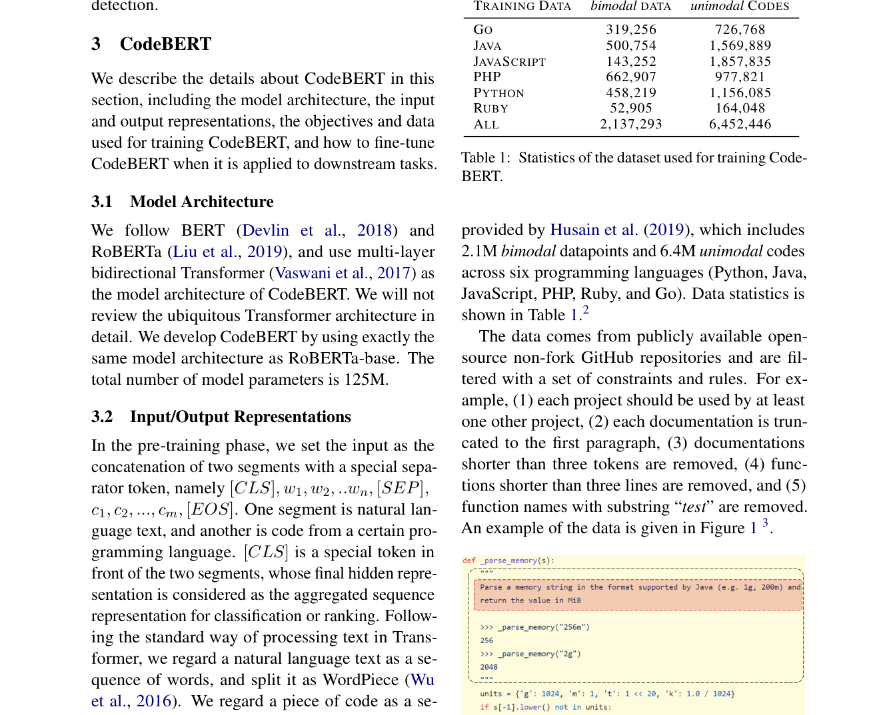
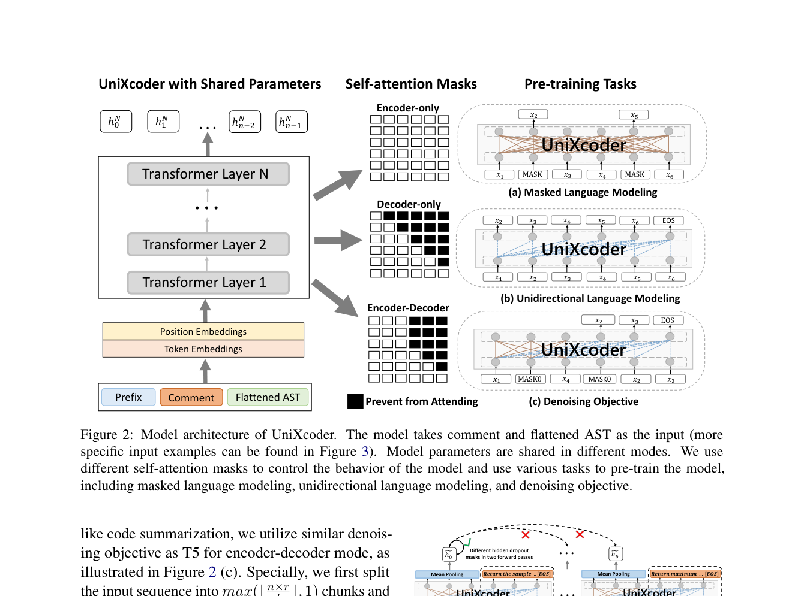
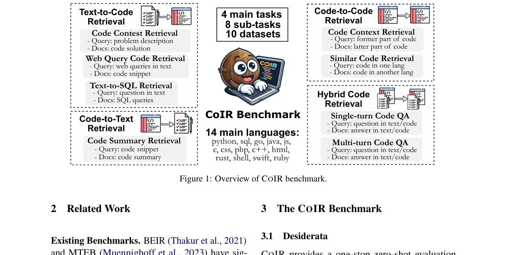
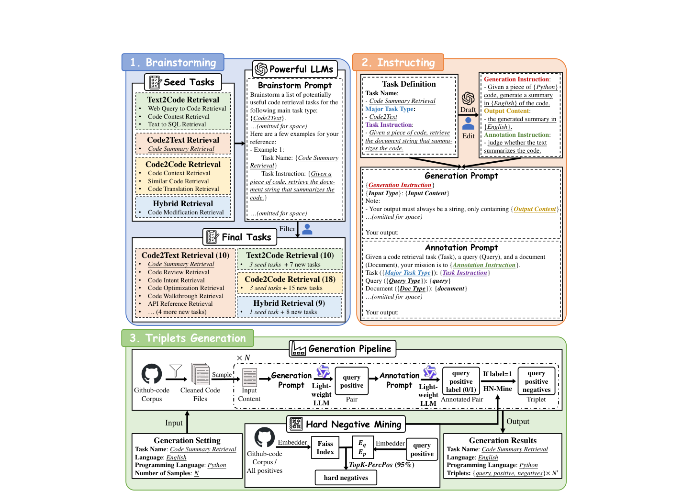

# 代码检索 Embedding 合写

> papers: CodeBERT [arXiv:2002.08155](https://arxiv.org/abs/2002.08155)（EMNLP 2020）；UniXcoder [arXiv:2203.03850](https://arxiv.org/abs/2203.03850)（ACL 2022）；CoIR [arXiv:2407.02883](https://arxiv.org/abs/2407.02883)；BGE-Code / CodeR [arXiv:2505.12697](https://arxiv.org/abs/2505.12697)
> code: [microsoft/CodeBERT](https://github.com/microsoft/CodeBERT) · [microsoft/unixcoder](https://github.com/microsoft/CodeBERT/tree/master/UniXcoder) · [CoIR-team/CoIR](https://github.com/CoIR-team/coir) · [BAAI/bge-code-v1](https://huggingface.co/BAAI/bge-code-v1)
> refs: CodeSearchNet [1909.09436](https://arxiv.org/abs/1909.09436)；GTE 文中「代码当文本」对照
> backbone: Transformer encoder（CodeBERT / UniXcoder）；通用 Embedding 骨干 + 海量合成检索数据（CodeR）
> date: 2020–2025
> modality: 自然语言 ↔ 代码、代码 ↔ 代码
> languages: 多编程语言（CoIR 约 14 种主语言；CodeR-Pile 宣称更广）

> 四篇合写：前两篇解决「代码不是纯文本」、CoIR 解决「代码 IR 不能只测 CodeSearchNet」、BGE-Code 解决「没有标注就合成」。领域课表级结论见《[领域专用 Embedding 适配实践](../领域专用Embedding适配实践.md)》。

---

## 一句话定位

代码检索的领域性来自 **标识符、语法、跨语言同语义**，不是来自「又一个垂直语料」。CodeBERT 把 NL–PL 双模态塞进 BERT；UniXcoder 把 AST 展平并切换编解码注意力；CoIR 证明通用文本 Embedding 在代码 IR 上会翻车；BGE-Code（CodeR）用 LLM 合成海量异构检索任务，把通用ist 代码向量做成可训练的数据问题。

| 项 | 内容 |
| --- | --- |
| 任务形态 | Text→Code、Code→Text、Code→Code、Hybrid（NL+code 混合 query） |
| 通用模型的失败 | API 名 OOV、把代码当英文散文、只在 CSN docstring 检索上虚高 |
| 专用解 | 代码预训练目标 + 结构信号 + 代码 IR 基准 + 合成检索三元组 |

---

## CodeBERT：NL–PL 双模态预训练

CodeBERT 的输入是 **自然语言文档串 + 代码 token** 的双段序列，骨干是 BERT。预训练两个目标：

1. **MLM**：两边都可以 mask。
2. **RTD**（Replaced Token Detection）：判别器判断被生成器替换过的 token——对标识符这种「换一个字母就成另一 API」的序列特别有用。

数据主源是 **CodeSearchNet**（六种语言的函数–docstring 对）再加单模态代码。下游主打 **NL 搜代码**（MRR）和文档生成。

上图是 CodeBERT 把「注释 / docstring」和「代码」当成一对跨模态序列。这已经是 Bi-Encoder 检索的预训练形态：NL 与 PL 必须进同一空间，否则 docstring 检索无解。GTE 论文里说的「把代码当文本继续对比」是更粗的路线——能用，但丢了 RTD / 标识符级信号。

**对后续的影响**：它证明领域预训练目标要改，不只是换语料继续 MLM。局限是结构信号弱（代码当 token 流）、生成与理解要靠下游微调分家。

---

## UniXcoder：AST + 统一编解码

UniXcoder 针对 CodeBERT 的两个缺口：

1. **结构**：把 AST 用一对一映射展平成 token 序列，和 comment 拼在一起。
2. **多任务形态**：同一个 Transformer 用 **注意力 mask 前缀** 切 encoder-only / decoder-only / encoder-decoder，分别服务检索、补全、翻译。

预训练除 MLM、单向 LM、denoising 外，还有 **code fragment 对比学习**：把同一段代码的不同视图（或 comment–code）拉近。这已经是显式的代码 embedding 目标，而不只是填词。

上图（论文 Figure 2 区域）是「一个骨干、三种注意力」。检索用 encoder-only 出向量；生成用 decoder。对比损失让代码片段表示在 CosQA / CodeSearch 上明显好于「只 MLM 的 CodeBERT」。

**评测**（论文主表）：clone detection、code search（CSN / CosQA / AdvTest）、code summarization。对比 RoBERTa、CodeBERT、GraphCodeBERT。结构 + 对比，是检索项上涨的主因。

---

## CoIR：代码 IR 不能只测 CodeSearchNet

到 2024 年，通用文本 Embedding（BGE / GTE / E5）已经很强，不少工作直接把代码当长文本 encode。CoIR 要回答：**这样到底行不行？**

基准覆盖 **10 个数据集、4 类主任务、约 14 种语言**：

| 主任务 | 例子 | 通用文本模型容易怎样 |
| --- | --- | --- |
| Text-to-Code | Apps 竞赛题、CosQA、Text2SQL | docstring 检索虚高，竞赛/SQL 掉下来 |
| Code-to-Text | 从代码找回文档 / 问答 | 标识符对不上自然语言改写 |
| Code-to-Code | 跨语言同语义、克隆 | 词面像但语义不同；或语义同词面完全不同 |
| Hybrid | 对话式改代码、NL+snippet | 真实 IDE 查询，单模态预训练没见过 |

上图是 CoIR 的任务地图。论文还指出 CodeSearchNet 作为训练+测试的过拟合：在 CSN 上很高的模型，换 Apps / 跨语言 / Hybrid 会塌。这和「MTEB 高、业务 Recall 低」是同一类污染 / 分布错位。

**对比结论（机制层）**：当时领先的通用 Embedding 在 CoIR 平均分上**不能**当代码 IR SOTA；Voyage-code、代码专用双塔、以及后来的 CodeR 才对得齐。长上下文（GTE / BGE-M3 8k）对仓库级文件有帮助，但不替代代码目标。

---

## BGE-Code（CodeR）：用合成数据训通用ist 代码向量

[2505.12697](https://arxiv.org/abs/2505.12697) 的主张：代码检索缺的不是更大的 CodeBERT，而是 **覆盖任务类型的三元组**。他们造 **CodeR-Pile**，再训 **CodeR**（开源权重对应 BGE-Code 路线）。

合成流水线三步：

1. **Brainstorm**：从少量 seed 任务（Text2Code / Code2Text / Code2Code / Hybrid）让强 LLM 扩出更多检索任务，人再滤。
2. **Instruct**：为每个任务写 generation / annotation 指令。
3. **Triplets**：轻量 LLM 在 GitHub 代码上产 (query, positive)，再用 embedder + Faiss 挖 **TopK-PercPos** 式难负例（和 NV-Retriever 同一家族）。

上图是领域适配里「没有标注怎么办」的完整答案：任务覆盖比单条数据规模更重要。论文用 CoIR 与 CodeRAG（HumanEval / MBPP / RepoEval / SWE-bench-Lite 等）证明：合成数据的 **任务种类、难负例、LLM 生成质量** 都有消融收益。

训练课表（论文 Figure 3）仍是通用 Embedding 的 Stage 2 味道：已有代码检索数据 + 合成数据 + 检索到的 hard / 简单负例，对比学习。不是从字符级重新训一个代码 LM。

---

## 训练数据与基准对照

| 来源 | 规模量级 | 用途 |
| --- | --- | --- |
| CodeSearchNet | 百万级函数–docstring | CodeBERT / 早期 code search |
| GraphCodeBERT 数据 | 数据流边 + CSN | 结构预训练 |
| CoIR 十集 | 评测为主，部分含 train | 代码 IR 榜 |
| CodeR-Pile | 合成、多任务、多语言 | BGE-Code 主训练 |
| CodeRAG 集 | 仓库 / 竞赛 / SWE | RAG 向代码检索 |

**对比方法**要按「预训练目标」和「检索数据」两列看，不要只比参数量：CodeBERT < UniXcoder（结构+对比）< 通用文本 Embedding 直接 encode（CoIR 上不稳）< CodeR 式合成检索数据。

---

## 可迁移实践

1. **领域不是换语料再 MLM 就完。** 代码要标识符 / AST / 跨语言同语义；商品图要视觉属性；法律要结构段。
2. **评测集不要用训练集的 docstring 克隆。** CoIR 就是为这个存在的。
3. **没有标注时合成任务表，而不是合成同一模板的 1000 万条。** CodeR 的 brainstorm 是主贡献。
4. **难负例用正例感知阈值**（PercPos），代码里「几乎同一函数换个变量名」既可能是正例（克隆）也可能是负例（不同题），必须按任务定义过滤。
5. 文搜图不要把图像当「另一种 token 流」硬套 CodeBERT；要对齐的是 **跨模态共空间**，结构信号在视觉侧是属性 / SKU / 同款图，不是 AST。
