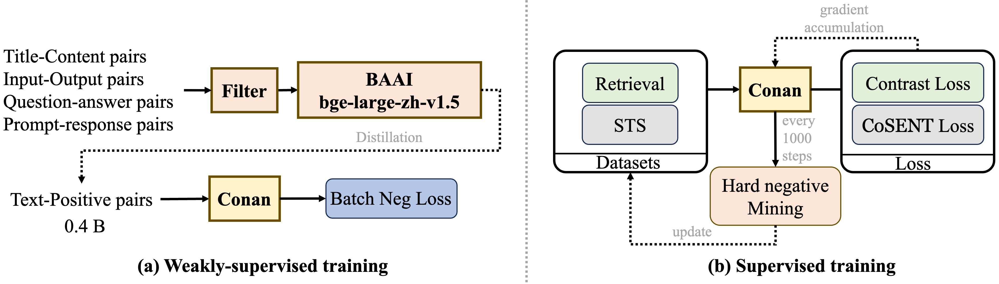
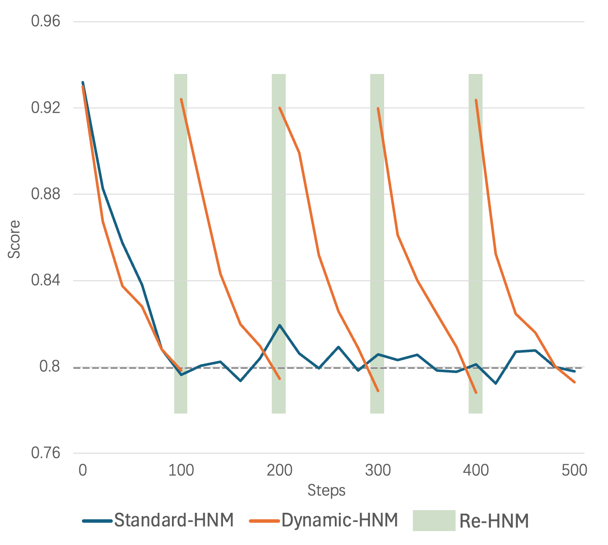
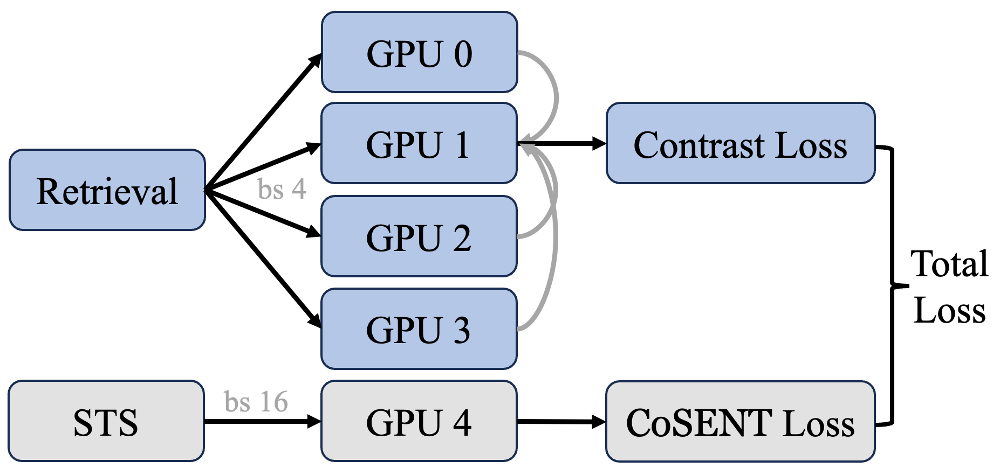
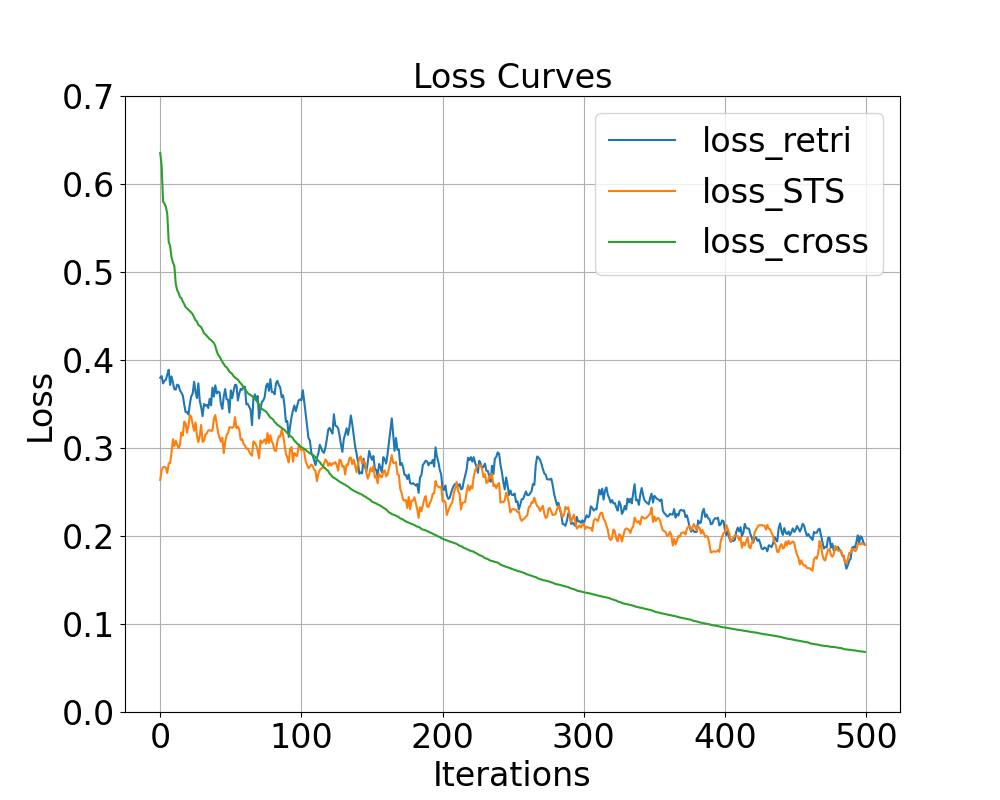

> 原文: [arXiv:2408.15710](https://arxiv.org/abs/2408.15710)（v2, 2024-08-29）
> 说明: 本文为论文全文中文翻译，公式编号与原文一致；图表仅保留标题/说明的中译，数值表尽量原样保留数字。

# Conan-embedding：用更多、更好的负例做通用文本嵌入

**Conan-embedding: General Text Embedding with More and Better Negative Samples**

Shiyu Li1,2\* Yang Tang2 Shi-Zhe Chen2 Xi Chen2

1 ECE, Peking University 2 BAC, Tencent PCG

shiyuli@stu.pku.edu.cn {ethanntang, shizhechen, jasonxchen}@tencent.com

\* 本工作完成于李诗雨在腾讯平台与内容事业群（PCG）实习期间。

---

## 摘要（Abstract）

随着 RAG（检索增强生成）日益流行，嵌入模型的能力受到越来越多关注。嵌入模型主要通过对比学习训练，负例是其中的关键组成部分。已有工作提出了多种难负例挖掘策略，但这些策略通常只作为预处理步骤使用。本文提出 **conan-embedding** 模型，最大化利用更多、更高质量的负例。具体而言：由于模型处理预处理负例的能力会随训练演化，我们提出**动态难负例挖掘（dynamic hard negative mining）**，使模型在整个训练过程中持续接触更具挑战性的负例；其次，对比学习需要尽可能多的负例，却受 GPU 显存限制，因此我们使用 **Cross-GPU balancing Loss** 为嵌入训练提供更多负例，并在多任务间平衡 batch size。此外，我们发现 LLM 的 prompt–response 对也可用于嵌入训练。我们的方法有效提升了嵌入模型能力，目前在 Massive Text Embedding Benchmark（MTEB）中文榜上排名第一。

---

## 1 引言（Introduction）

随着自然语言处理技术的快速发展，嵌入模型（Su et al., 2022; Xiao et al., 2023; Wang et al., 2023）在文本表示、信息检索与生成任务中发挥着关键作用。嵌入模型将词、句子或文档映射到高维连续空间，使相似文本具有更接近的向量表示。这种表示不仅提升了文本数据的可操作性，也显著改善了各类下游任务的表现。尤其在检索增强生成（RAG）技术中，嵌入模型的能力直接影响生成结果的质量。

尽管嵌入模型已取得显著进展，现有方法在负例选择上仍有不足。嵌入模型通常通过对比学习训练，负例质量对模型性能至关重要。先前研究（Wang et al., 2022; Moreira et al., 2024）提出了多种难负例挖掘策略，在一定程度上提升了性能；但这些策略大多作为预处理步骤，限制了模型在复杂、多变训练数据上的表现。

为解决上述问题，本文提出 **Conan-Embedding Model**，最大化利用更多、更高质量的负例。具体地，我们在训练过程中迭代挖掘难负例，使模型动态适应变化的训练数据；同时引入 cross-GPU balancing Loss，以在多任务间平衡负例数量，提升训练效率与效果。我们还发现，大语言模型（LLM）的 prompt–response 对可用作训练数据，进一步提升嵌入模型性能。凭借这些改进，我们的方法在中文 Massive Text Embedding Benchmark（CMTEB）排行榜上取得第一名，展现出优异性能与广阔应用前景。

---

## 2 方法（Methods）

**图 1**：方法流程，包含弱监督与监督训练。弱监督阶段收集 7.5 亿对数据并筛选出 4 亿对；监督阶段采用动态难负例挖掘策略以更好地微调模型。

### 2.1 训练流程（Training Workflow）

#### 2.1.1 预训练（Pre-training）

遵循 Li et al. (2023a)，我们同样采用多阶段训练，将训练分为预训练与微调。如图 1(a) 所示，预训练阶段使用 Cai et al. (2024) 所述的标准数据过滤方法；过滤后用 `bge-large-zh-v1.5`（Xiao et al., 2023）打分，丢弃分数低于 0.4 的数据。为高效、充分地利用预训练数据，我们使用带 **In-Batch Negative** 的 InfoNCE 损失：

$$
\mathcal{L}_{\mathrm{neg}} = -\sum_{i=1}^{N}\log\frac{\exp(\mathrm{sim}(x_i, y_i^{+}))}{\sum_{j=1}^{M}\exp(\mathrm{sim}(x_i, y_j))}
\tag{1}
$$

其中 $x_i$ 表示正样本的 query，$y_i^{+}$ 表示正样本的 passage，$y_j$ 表示同一 batch 内其他样本的 passage，被视为负样本。

In-Batch Negative InfoNCE Loss（Gutmann & Hyvärinen, 2010）是一种对比学习损失函数：在每个 mini-batch 中，除目标样本正对外的所有样本都视为负例。通过最大化正对相似度、最小化负对相似度，该方法能有效提升模型判别能力与表示学习性能；并充分利用 batch 内样本，提高训练效率、减少额外负样本生成需求。

#### 2.1.2 监督微调（Supervised Fine-tuning）

监督微调阶段针对不同下游任务做任务特化微调。如图 1(b) 所示，我们将任务分为两类：检索（retrieval）与 STS（语义文本相似度）。检索任务包含 query、正文本与负文本，经典损失为 InfoNCE；STS 任务区分两段文本的相似度，经典损失为交叉熵。根据 Su (2022) 及其他工作（Wang Yuxin, 2023），**CoSENT** 损失略优于交叉熵，因此我们也采用 CoSENT 优化 STS 任务：

$$
\mathcal{L}_{\mathrm{cos}}=\log\left(1+\sum_{\mathrm{sim}(i,j)>\mathrm{sim}(k,l)}\exp\left(\frac{\cos(x_k,x_l)-\cos(x_i,x_j)}{\tau}\right)\right)
\tag{2}
$$

其中 $\tau$ 为温度系数，$\cos(\cdot)$ 为余弦相似度，$\mathrm{sim}(k,l)$ 为 $x_i$ 与 $x_j$ 之间的（标注）相似度关系。

### 2.2 动态难负例挖掘（Dynamic Hard Negative Mining）

先前工作主要在数据预处理阶段做难负例挖掘。对给定权重的嵌入模型，难负例是固定的；但随训练推进、模型权重更新，对应当前权重的难负例会发生变化——预处理阶段挖出的难负例在若干次迭代后可能不再难。

基于这一观察，我们提出动态难负例挖掘方法。对每个数据点，记录难负例相对 query 的当前平均分数。每 100 次迭代：若该分数乘以 1.15 后仍小于初始分数，且分数绝对值小于 0.8，则认为负例已不再困难，进行新一轮难负例挖掘。每次动态挖掘需要替换时，使用第 $(i-1)\times n+10$ 到 $i\times n+10$ 个候选作为负例，其中 $i$ 表示第 $i$ 次替换，$n$ 表示每次使用的难负例个数。整个过程的开销约等于一步迭代。

**图 2**：动态难负例挖掘 vs 标准难负例挖掘的 Score–Steps 曲线。每 100 step 检查一次；当分数 $\times 1.15$ 小于初始分数且绝对值小于 0.8 时，认为负例不再困难并用新难负例替换。

相较 In-Batch Negative InfoNCE，我们认为更高质量、更贴合当前模型权重的难负例更为重要。图 2 展示了动态与标准难负例挖掘下正/负例分数随 step 的变化：标准方法中，随步数增加负例分数停止下降并开始震荡，说明模型已学完该批负例；而动态方法一旦检测到负例对模型不再具挑战性，就会替换难负例。

### 2.3 Cross-GPU Batch Balance Loss

为更好利用难例，我们采用 **Cross-GPU Batch Balance Loss（CBB）**。先前做法（Li et al., 2023b）通常在训练中随机为每个 batch 分配任务：例如 iteration 0 选 STS 样本并用 STS 损失反传更新；iteration 1 可能分配检索任务。我们称之为顺序随机任务训练。这种训练常使单次迭代优化的搜索空间与嵌入模型的全局搜索空间不一致，导致训练震荡，阻碍收敛到全局最优（见 §3.5）。

为此，我们在每个 Forward–Loss–Backward–Update 周期中平衡地引入各任务，以获得稳定的搜索空间，并缩小单次更新方向与全局最优的偏差。因此 CBB 策略不仅考虑不同 GPU 间通信，也考虑不同任务间通信，从而实现更好的 batch 平衡。如图 3 所示：对检索任务，保证各 GPU（gpu0–gpu3）共享相同 query 与正例、但持有不同负例，以纳入更多负例；对 STS 任务，增大 batch size 以纳入更多比较样本。检索任务上各 GPU 计算对应 batch 损失并在 gpu1 聚合；STS 由 gpu4 计算损失；最终聚合得到当前 iteration 的组合 CBB Loss：

$$
\mathcal{L}_{\mathrm{CBB}}=-\frac{1}{n}\sum_i\log\frac{\exp(s(x_i,y_i^{+})/\tau)}{\exp(s(x_i,y_i^{+})/\tau)+\sum_{k=1}^{N}\sum_{j=1}^{n}\exp(s(x_i,y_{j}^{-})/\tau)}+\beta\times\mathcal{L}_{\mathrm{cos}}
\tag{3}
$$

其中 $s(x_i,y_i^{+})$ 为 query 与正文本的打分函数（常取余弦相似度），$N$ 为共享该 query 与正文本的 GPU 数，$\tau$ 为温度。经验上将 $\beta$ 设为 0.8。

**图 3**：Cross-GPU Batch Balance Loss 示例。检索任务用多卡纳入更多负例；STS 任务增大 batch 以纳入更多比较样本。

---

## 3 实验（Experiments）

### 3.1 实现细节（Implementation details）

与多数嵌入模型一样，我们以 BERT-large（Devlin et al., 2018）为基座，并用线性层将维度从 1024 扩展到 1792，总参数量约 **326M**。受 OpenAI text-embedding-v3（openai, 2024）启发，我们也采用 Matryoshka Representation Learning（MRL）（Kusupati et al., 2022）以实现灵活维度。最大输入长度 512 tokens。为提升效率，使用混合精度训练与 DeepSpeed ZeRO stage 1（Rajbhandari et al., 2020）。

预训练：AdamW（Loshchilov & Hutter, 2017），学习率 $1\times10^{-5}$，warmup ratio 0.05，weight decay 0.001，batch size 8；使用 64 张 Ascend 910B，耗时 138 小时。

微调：MRL 维度配置为 256、512、768、1024、1280、1536、1792；检索任务 batch size 4，STS 任务 batch size 32；优化器与学习率同预训练；16 张 Ascend 910B，耗时 13 小时。

### 3.2 数据集（Datasets）

预训练阶段从互联网收集 7.5 亿文本对，类别包括 title–content、input–output、question–answer。我们发现：经规则过滤筛选后，高质量 LLM 指令微调数据（如 prompt–response）可提升嵌入模型表现；此外还用 LLM 基于已有语料生成了一批数据。详见表 1。

**表 1：预训练数据来源概览**

| Categories | Data Format | Prop | Numbers |
| --- | --- | --- | --- |
| News | (title, content) | 27.3% | 233M |
| Knowledge Base | (question, answer) | 7.7% | 66M |
| Social Media | (title, content) | 39.9% | 341M |
| Web Page | (input, output) | 4.6% | 39M |
| Academic Paper | (title, content) | 6.0% | 51M |
| Community QA | (question, answer) | 1.6% | 14M |
| Instruction datasets | (prompt, response) | 11.7% | 100M |
| LLM generated | (question, answer) | 1.2% | 10M |

微调阶段为使模型适应多种任务，选取常见检索、分类与 STS 数据集。对分类任务：将同类数据视为正文本、异类视为负文本，并入检索任务处理。数据量见表 2。

**表 2：不同任务的数据格式与数量**

| Tasks | Data Format | Loss | Numbers |
| --- | --- | --- | --- |
| STS | (text, text pairs, score) | CoSENT Loss | 1.3M |
| Retrieval | (text, text positive, text negative) | InfoNCE loss | 1.8M |
| STS generated | (text, text pairs, score) | CoSENT Loss | 0.6M |
| Retrieval generated | (text, text positive, text negative) | InfoNCE loss | 0.5M |

### 3.3 CMTEB 结果

MTEB（Muennighoff et al., 2022）是最权威、流行的大规模文本嵌入评测基准。Xiao et al. (2023) 构建了中文评测集 CMTEB，含 35 个数据集、跨 6 类：Classification、Clustering、Pair Classification、Rerank、Retrieval、STS。表 3 比较了我们与其他模型在 CMTEB 上的表现；我们的模型在几乎所有任务上超越此前 SOTA。

**表 3：CMTEB 结果。** 报告六类任务平均：Classification (CLS)、Clustering (Cluster)、Pair Classification (Pair CLS)、Reranking (Rerank)、Retrieval (Retri)、Semantic Textual Similarity (STS)。

| Models | Average | CLS | Cluster | Rerank | Retri | STS | Pair CLS |
| --- | --- | --- | --- | --- | --- | --- | --- |
| piccolo-large-zh-v2 | 70.95 | 74.59 | 62.17 | 70.00 | 74.36 | 63.50 | 90.24 |
| IYun-large-zh | 71.04 | 74.18 | 66.35 | 69.30 | 73.56 | 63.23 | 90.87 |
| zpoint-large-embedding-zh | 71.88 | 74.43 | 62.23 | 72.34 | 76.36 | 64.22 | 91.55 |
| gte-Qwen2-7B-instruct | 72.05 | 75.09 | 66.06 | 68.92 | 76.03 | 65.33 | 87.48 |
| xiaobu-embedding-v2 | 72.43 | 74.67 | 65.17 | 72.58 | 76.50 | 64.53 | 91.87 |
| **Conan-embedding** | **72.62** | **75.03** | **66.33** | **72.76** | **76.67** | **64.18** | **91.66** |

### 3.4 消融实验（Ablation Study）

为验证方法有效性，我们在 CMTEB 上进行全面消融（表 4）。可见动态难负例挖掘与 Cross-GPU Batch Balance Loss 均显著优于直接微调的 vanilla。Conan-embedding 在检索与重排上提升尤为明显，说明负例数量与质量的增加使模型见到更多有挑战的负例，从而增强召回能力。

**表 4：CMTEB 消融结果。** Baseline 为预训练后结果；Vanilla 表示用标准 InfoNCE + CoSENT 直接微调；DHNM 仅用动态难负例挖掘；CBB Loss 仅用 Cross-GPU Batch Balance Loss。

| Methods | Average | CLS | Cluster | Rerank | Retri | STS | Pair CLS |
| --- | --- | --- | --- | --- | --- | --- | --- |
| Baseline | 62.9 | 60.4 | 62.7 | 70.4 | 63.2 | 55.2 | 87.3 |
| Vanilla | 68.8 | 71.4 | 62.0 | 67.0 | 72.4 | 61.3 | 89.9 |
| CBB Loss | 70.4 | 73.0 | 65.6 | 68.1 | 72.3 | 64.1 | 90.0 |
| DHNM | 71.2 | 74.4 | 66.2 | 69.0 | 73.8 | 63.5 | 90.4 |
| **Conan-embedding** | **72.62** | **75.03** | **66.33** | **72.76** | **76.67** | **64.18** | **91.66** |

### 3.5 分析（Analysis）

为更好评估 CBB 效果，图 4 给出使用该损失前后的 loss 曲线。retri 与 STS loss 表示两任务一起训练时各自的损失：波动大、下降慢、且不同步——说明不同任务向量空间存在差距，直接用不同损失更新难以达到最优。cross loss 表示使用 CBB 后：损失平滑持续下降，最终损失（0.08）远小于 retri+STS 之和（0.38）。

**图 4**：使用 Cross-GPU Batch Balance Loss 前后的损失曲线对比。

---

## 4 结论（Conclusion）

本文介绍了 conan-embedding 模型，通过最大化负例的质量与数量来提升嵌入模型性能。方法围绕两项关键创新：**动态难负例挖掘**与 **Cross-GPU balancing loss**。其有效性由模型在 MTEB 中文榜第一名所验证。希望我们的方法能启发更多关于难负例挖掘新路径的探索。模型已上传至 Hugging Face：`Conan-embedding-v1`。

---

## 参考文献（References）

Zheng Cai, Maosong Cao, Haojiong Chen, Kai Chen, Keyu Chen, Xin Chen, Xun Chen, Zehui Chen, Zhi Chen, Pei Chu, et al. Internlm2 technical report. arXiv preprint arXiv:2403.17297, 2024.

Jacob Devlin, Ming-Wei Chang, Kenton Lee, and Kristina Toutanova. BERT: pre-training of deep bidirectional transformers for language understanding. CoRR, abs/1810.04805, 2018. URL http://arxiv.org/abs/1810.04805.

Michael Gutmann and Aapo Hyvärinen. Noise-contrastive estimation: A new estimation principle for unnormalized statistical models. In Proceedings of the thirteenth international conference on artificial intelligence and statistics, pp. 297–304. JMLR Workshop and Conference Proceedings, 2010.

Aditya Kusupati, Gantavya Bhatt, Aniket Rege, Matthew Wallingford, Aditya Sinha, Vivek Ramanujan, William Howard-Snyder, Kaifeng Chen, Sham Kakade, Prateek Jain, et al. Matryoshka representation learning. Advances in Neural Information Processing Systems, 35: 30233–30249, 2022.

Zehan Li, Xin Zhang, Yanzhao Zhang, Dingkun Long, Pengjun Xie, and Meishan Zhang. Towards general text embeddings with multi-stage contrastive learning. arXiv preprint arXiv:2308.03281, 2023a.

Zehan Li, Yanzhao Zhang, Dingkun Long, and Pengjun Xie. Challenging decoder helps in masked auto-encoder pre-training for dense passage retrieval. arXiv preprint arXiv:2305.13197, 2023b.

Ilya Loshchilov and Frank Hutter. Decoupled weight decay regularization. arXiv preprint arXiv:1711.05101, 2017.

Gabriel de Souza P Moreira, Radek Osmulski, Mengyao Xu, Ronay Ak, Benedikt Schifferer, and Even Oldridge. Nv-retriever: Improving text embedding models with effective hard-negative mining. arXiv preprint arXiv:2407.15831, 2024.

Niklas Muennighoff, Nouamane Tazi, Loïc Magne, and Nils Reimers. Mteb: Massive text embedding benchmark. arXiv preprint arXiv:2210.07316, 2022.

openai. text-embedding-v3. openai blogs, 2024. URL https://openai.com/blog/new-embedding-models-and-api-updates.

Samyam Rajbhandari, Jeff Rasley, Olatunji Ruwase, and Yuxiong He. Zero: Memory optimizations toward training trillion parameter models. In SC20: International Conference for High Performance Computing, Networking, Storage and Analysis, pp. 1–16. IEEE, 2020.

Hongjin Su, Weijia Shi, Jungo Kasai, Yizhong Wang, Yushi Hu, Mari Ostendorf, Wen-tau Yih, Noah A Smith, Luke Zettlemoyer, and Tao Yu. One embedder, any task: Instruction-finetuned text embeddings. arXiv preprint arXiv:2212.09741, 2022.

Jianlin Su. Cosent, Nov 2022. URL https://spaces.ac.cn/archives/9341.

Liang Wang, Nan Yang, Xiaolong Huang, Jiao Binxing, Linjun Yang, Daxin Jiang, Rangan Majumder, and Furu Wei. Text embeddings by weakly-supervised contrastive pre-training. Cornell University - arXiv, Dec 2022.

Liang Wang, Nan Yang, Xiaolong Huang, Linjun Yang, Rangan Majumder, and Furu Wei. Improving text embeddings with large language models. arXiv preprint arXiv:2401.00368, 2023.

He sicheng Wang Yuxin, Sun Qingxuan. M3e: Moka massive mixed embedding model, 2023.

Shitao Xiao, Zheng Liu, Peitian Zhang, and Niklas Muennighoff. C-pack: Packaged resources to advance general chinese embedding, 2023.
