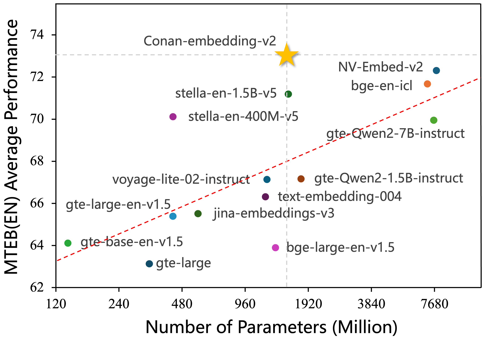
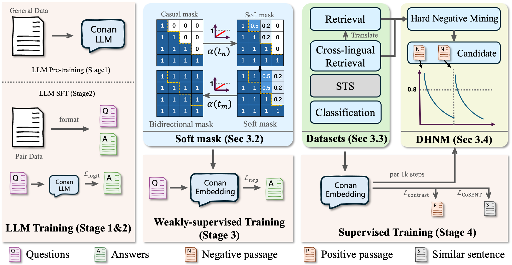
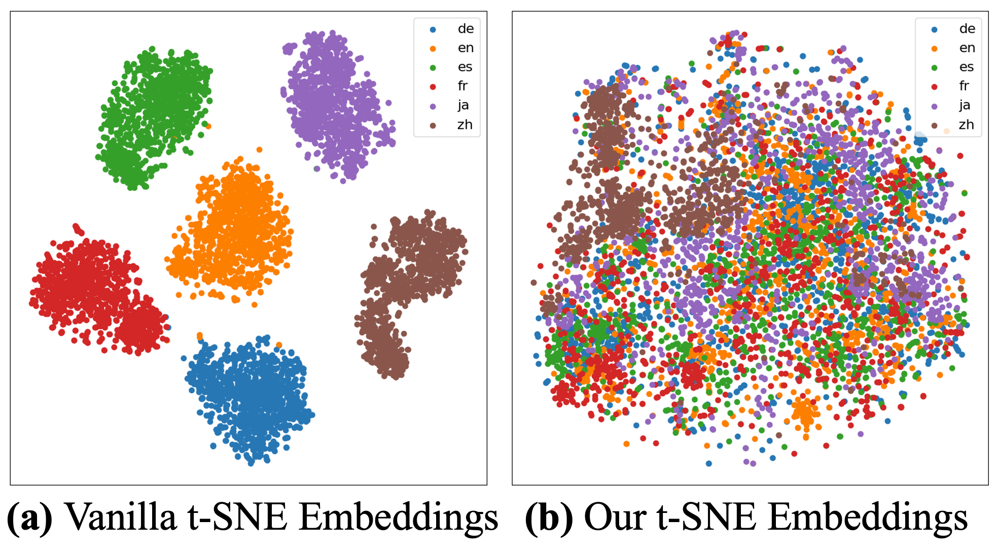

# Conan-Embedding-v2：从零训练用于文本嵌入的大语言模型

**Conan-Embedding-v2: Training an LLM from Scratch for Text Embeddings**

Shiyu Li¹, Yang Tang¹, Ruijie Liu¹, Shi-Zhe Chen¹, Xi Chen¹*

¹ 腾讯 PCG 基础算法中心

{shyuli, ethanntang, jackrjliu, shizhechen, jasonxchen}@tencent.com

\* 通讯作者

> 原文: [arXiv:2509.12892](https://arxiv.org/abs/2509.12892)（EMNLP 2025）
> 说明: 本文为论文全文中文翻译，公式编号与原文一致；图表仅保留标题/说明的中译，数值表尽量原样保留数字。

---

## 摘要

大语言模型（Large Language Models, LLMs）最近在文本嵌入任务上展现出优异性能。以往工作通常使用 LoRA（Low-Rank Adaptation）对现有 LLM 进行微调，但受限于 LLM 与嵌入模型之间的数据差异和训练差异。本文提出 **Conan-embedding-v2**：一个从零开始训练、并微调为文本嵌入器（text embedder）的 14 亿参数新 LLM。首先，我们在 LLM 预训练中补充新闻数据和多语言配对数据，以弥合数据鸿沟；在此基础上，我们提出跨语言检索数据集（Cross-lingual Retrieval Dataset, CLR），使 LLM 能更好地融合不同语言的嵌入表示。其次，LLM 使用因果掩码（causal mask）与 token 级损失，而嵌入模型使用双向掩码（bidirectional mask）与句子级损失；这一训练差异使得全参数微调（full fine-tuning）不如 LoRA 有效。我们引入 **soft-mask（软掩码）** 机制，在两类掩码之间逐步过渡，使模型学习更全面的表示。在此基础上，我们提出 **动态困难负样本挖掘**（Dynamic Hard Negative Mining, DHNM）方法，在训练全程让模型接触更难的负例。该方法直观且有效：在约 14 亿参数规模下，Conan-embedding-v2 在 Massive Text Embedding Benchmark（MTEB）与 Chinese MTEB（2025 年 5 月 19 日）上均达到 SOTA。

**图 1 说明**：Conan-embedding-v2 与其他嵌入模型在 MTEB 英文基准（2025 年 5 月 19 日）上的对比。该基准在七类任务上评估模型：分类、聚类、配对分类、重排序、检索、语义文本相似度（STS）与摘要。红色虚线为除 Conan-embedding-v2 外所有基线模型性能的对数趋势线。

---

## 1 引言（Introduction）

文本嵌入将词、句或文档映射到高维连续空间，使语义相近的文本在向量空间中彼此靠近（Mikolov et al., 2013; Karpukhin et al., 2020）。这种表示不仅提升了文本数据的可操作性，也显著改善各类下游任务表现（Devlin et al., 2018; Radford, 2018; Reimers, 2019）。随着大语言模型快速发展，基于 LLM 的嵌入模型（Wang et al., 2023; Li et al., 2023; Wang et al., 2024a）在文本表示与信息检索中扮演关键角色。

然而，以往基于 LLM 的工作通常以预训练的 Mistral-7B（Jiang et al., 2023）为起点，用 LoRA（Hu et al., 2021）微调嵌入模型。该路线可能受限于 LLM 与嵌入模型在训练数据与训练过程上的差异。其一，效果依赖基座 LLM 的能力，而基座 LLM 所用语料与嵌入训练所需数据存在鸿沟。其二，LLM 与嵌入模型的训练范式根本不同：LLM 训练下一 token 预测，嵌入模型则需基于整句 query 或候选句生成嵌入向量。这一 **训练鸿沟** 使全参数微调不如 LoRA，且 LoRA 带来的提升存在固有上限（Biderman et al., 2024）。

为应对上述挑战，我们提出 **Conan-embedding-v2**：从零训练并微调为文本嵌入器的新 LLM，在训练数据与方法上均扩展自 BERT 版 conan-v1（Li et al., 2024b）。**数据方面**，Conan-embedding-v2 在 LLM 训练中结合大规模新闻预训练与专用嵌入语料微调，以弥合数据鸿沟。**训练方面**，我们设计 soft-mask 机制，从因果掩码逐步过渡到双向掩码，使掩码秩（rank）逐渐下降，从而在训练早期学习更全面的特征表示。由于 LLM 不再受基座语料约束，我们引入新颖的跨语言检索数据集，支持 26 种语言间的双向检索，使模型能融合多语言嵌入。又因不再受 LoRA 约束，我们提出 **DHNM**，在训练全程保持负样本的高价值。

如图 1 所示，Conan-embedding-v2 在保持高效架构与适中规模的同时，超越 BERT 系与 LLM 系方法，达到 SOTA。主要贡献如下：

- 提出 Conan-embedding-v2：从零训练并微调为文本嵌入器的新 LLM，应对 LLM 与嵌入模型之间的数据与训练鸿沟。
- 引入跨语言检索数据集，支持 26 种语言双向检索，改善多语言嵌入融合。
- 通过实证评估表明，该方法在英文与中文 MTEB 上达到 SOTA，同时保持合理模型规模与推理速度。

---

## 2 相关工作（Related Work）

### 2.1 基于 LLM 的嵌入模型（LLM-based Embedding Models）

LLM 的近期进展显著推动了文本嵌入模型发展，使表示更高效、更通用。通过在合成数据上微调预训练 LLM，（Wang et al., 2023）以极少训练步数取得出色性能，证实利用 LLM 做嵌入既高效又有效。后续研究从多角度增强 LLM 文本嵌入器：NV-Embed（Lee et al., 2024）通过 latent attention 与去除因果注意力编码提升表示能力；bge-en-icl（Li et al., 2024a）利用 LLM 上下文学习（in-context learning）做少样本高质量嵌入；NV-Retriever（Moreira et al., 2024）用正例相关性分数挖掘负样本、剔除假负例；mE5（Wang et al., 2024a）与 M3-Embedding（Chen et al., 2024b）聚焦多语言文本嵌入。上述工作显著提升了基于 LLM 的文本嵌入性能。

### 2.2 跨语言信息检索（Cross-lingual Information Retrieval）

尽管 LLM 嵌入模型进展显著，其在跨语言信息检索（Cross-lingual Information Retrieval, CLIR）中的应用仍面临独特挑战与机遇（Hämmerl et al., 2024）。传统 CLIR 难以同时支持多语言、保持计算效率并取得高检索性能。M3-Embedding 与 mE5 等 multilingual 方法通过对比学习与知识蒸馏，在多语言处理与效率上表现突出。LECCR（Wang et al., 2024b）开始引入多模态 LLM，桥接不同模态与语言间的语义鸿沟，显著改善跨语言跨模态检索。针对低资源语言，近期研究（Miao et al., 2024; Litschko et al., 2024）提出词对齐与方言特定方案以增强嵌入质量。

---

## 3 方法（Method）

### 3.1 整体流程（Overall Pipeline）

Conan-embedding-v2 从零训练，流程分为四阶段：**LLM 预训练**、**LLM 监督微调（SFT）**、**嵌入弱监督训练**、**嵌入监督训练**。各阶段数据格式与损失函数不同。

#### 3.1.1 LLM 训练

为更好适配 LLM 到嵌入任务，Conan-embedding-v2 采用 8 层、隐藏维度 3584，最长输入 32,768 token，共约 **14 亿参数**，在更少参数下提供更高嵌入维度。我们在约 40 万条多语言语料上训练 Conan 分词器，词表规模 150,000。如图 2 所示，预训练约 **3T token** 通用数据，重点增加新闻、问答与网页数据，并采用（Cai et al., 2024）的标准数据过滤。随后收集约 **6 亿** 条 SFT 数据，格式为 instruction、input、output 的配对（query-positive）。

#### 3.1.2 嵌入训练

**弱监督训练。** 嵌入训练先做弱监督，使模型初步学习嵌入表示。此阶段使用与 LLM SFT 相同数据，但格式与损失不同：instruction + input 为 query，output 为正例 passage。为保证质量，用 gte-Qwen2-7B-instruct（Li et al., 2023）打分，丢弃分数低于 0.4 的样本。对配对数据采用 **InfoNCE** 损失与 **In-Batch Negative** 采样（Gutmann and Hyvärinen, 2010）：

$$
L_{\text{neg}} = -\sum_{i=1}^{N} \log \frac{\exp(\cos(x_i, y_i^+))}{\sum_{j=1}^{M} \exp(\cos(x_i, y_j))} \tag{1}
$$

其中 $x_i$ 为正例 query，$y_i^+$ 为正例 passage，$y_j$ 为 batch 内其他 passage（负例）。

**监督训练。** 弱监督后，针对不同下游任务做任务特定微调。如图 2，任务分为四类：**检索**、**跨语言检索**、**分类**、**STS**（semantic textual similarity，语义文本相似度）。前三类含 query、正例与若干负例，使用经典 InfoNCE。STS 需区分两句相似度，经典损失为交叉熵；据（Su, 2022）及（Wang Yuxin, 2023）等，**CoSENT** 略优于交叉熵，故 STS 亦采用 CoSENT：

$$
L_{\cos} = \log \left( 1 + \sum_{\text{Order}} \exp \frac{\langle x_k, x_l \rangle - \langle x_i, x_j \rangle}{\tau} \right) \tag{2}
$$

其中 $\text{Order} = \text{sim}(i,j) > \text{sim}(k,l)$，$\text{sim}(k,l)$ 为 $x_i$ 与 $x_j$ 的真值相似度，$\langle x_k, x_l \rangle$ 为 $x_k$ 与 $x_l$ 的余弦相似度，$\tau$ 为缩放温度。

**图 2 说明**：Conan-embedding-v2 概览。LLM 训练（阶段 1、2）中加入嵌入相关数据以更好对齐嵌入任务；弱监督阶段复用 LLM SFT 配对并应用 soft-mask 桥接 LLM 与嵌入模型；监督阶段结合跨语言检索数据集与 DHNM 提升数据多样性与价值。

### 3.2 软掩码（Soft Mask）

LLM 训练使用 **因果掩码**，当前 token 不可见后续 token，适合 token 级语言建模。嵌入训练则需整句理解，使用 **双向掩码** 做向量级建模。两类掩码存在若干关键差异。

其一，因果掩码上三角全为 0，前向时该区域注意力权重未使用；若直接切到双向掩码，这些权重需重新学习。其二，因果掩码为 **满秩**（full-rank），表达力更强；双向掩码秩恒为 1。若在弱监督微调阶段直接从因果掩码切到双向掩码，训练可能因低秩而快速收敛，但易陷入局部最优，难以继续优化。

如图 2，我们提出 **soft-mask 机制**。首先，为缓解注意力权重问题，在 soft mask 中引入调度项 $\alpha(t)$，使掩码从 0 逐步过渡到 1，模型渐进更新参数。$\tau$ 设为总步数以归一化：

$$
\alpha(t) = \frac{t}{\tau} \tag{3}
$$

其次，弱监督需学习更丰富特征，我们提出 **动态秩下降**：用 $M_{ij}$ 表示掩码矩阵，将前 $i$ 列置 1，秩为 $N-i$。结合权重调整，越靠前的列越快变为 1。soft mask 公式为：

$$
M_{ij}(t) = \begin{cases}
1 & \text{if } i \geq j \\
\min\left(\alpha(t) \times \frac{i}{l}, 1\right) & \text{if } i < j
\end{cases} \tag{4}
$$

$i < j$ 表示修改上三角。$l$ 为训练序列长度。最大值 capped 为 1，且前列更快达到 1。这样既使秩逐渐下降，也符合从前向后阅读、权重渐减的趋势。不同 $\alpha(t)$ 的影响见附录 C。

### 3.3 跨语言检索数据集（Cross-lingual Retrieval Dataset, CLR）

为发展多语言 LLM，我们希望 Conan-embedding-v2 学习跨语言表示。以往工作多直接微调多语言语料，或使用译文平行语料，常忽略语言间内在关系。为此我们提出 **CLR**，通过跨语言检索融合不同语言表示，缩小表示鸿沟。

我们从现有检索数据集出发，扩展为跨语言检索。为减轻工作量，仅用 Qwen2.5-7B（Team, 2024）**翻译 query 部分**。例如将 MSMARCO（Nguyen et al., 2016）英文子集 query 译为中文，实现中译英检索；对其他任务同理，将 query 译为 26 种语言以支持跨语言检索，共约 **1000 万** 对。

为更直观展示嵌入分布，我们在 **Multilingual Amazon Reviews Corpus**（Keung et al., 2020，未纳入 CLR 训练）上做对比。语料含英、日、德、法、中、西等语言，每种语言从测试集采样 1000 句。如图 3，**vanilla** 为未使用 CLR 的模型：六种语言嵌入明显分簇。**Conan-embedding-v2** 则将各语言嵌入融合为统一分布，证明其多语言表示更 cohesive。

**图 3 说明**：跨语言检索数据集训练前后嵌入分布对比。

### 3.4 动态困难负样本挖掘（Dynamic Hard Negative Mining, DHNM）

以往工作多在数据预处理阶段用现有嵌入模型挖掘困难负例，得到 **固定** 困难负样本。但其他模型认为的困难负例，与当前训练模型可能不同；且随训练进行，同一负例对当前权重的难度分数也会变化，预处理阶段挖掘的负例可能在若干迭代后不再困难。

基于这一认识，我们在 conan-v1（Li et al., 2024b）中提出 **DHNM**：训练过程中动态检测样本难度并按难度替换。用分数表示难度：

$$
S = \cos\langle f(q), f(p) \rangle \tag{5}
$$

$S$ 为余弦分数，$f(q)$ 为 query 嵌入，$f(p)$ 为困难负例嵌入。

与 v1 的替换准则不同，本文若分数绝对值 **小于 0.4**（初始步亦丢弃），当前检测公式为：

$$
N_i = \begin{cases}
N_{i+1} & S_0 < 0.4 \\
N_{i+1} & 1.2 \cdot S_i < S_0 \ \& \ S_i < 0.7 \\
N_i & \text{otherwise}
\end{cases} \tag{6}
$$

$N_i$ 为第 $i$ 个困难负例，$S_{i,0}$ 为其初始分数，$S_i$ 为当前分数。若分数乘 1.2 仍小于初始分且绝对值小于 0.7，则认为该负例不再困难，从困难负例池换入 $N_{i+1}$。

此外，v1 每 1k 步检查一次；本文利用 loss 计算中已得到 query 与各困难负例相似度，在每次 loss 计算时轻量缓存各困难负例当前分数并判断是否仍足够难；若应替换，下一步从候选池采样新困难负例。该过程使困难负例集在训练中保持更新与挑战性，且不增加额外计算开销。

---

## 4 实验（Experiments）

### 4.1 训练数据（Training Data）

为实现 Conan-embedding-v2 的多语言能力，我们收集大规模多样数据用于弱监督预训练与嵌入微调。弱监督预训练主要来自新闻与网站的 **标题-正文** 对：CC-News（Hamborg et al., 2017）、mC4（Karpukhin et al., 2020）、Wikipedia、Chinese Corpora Internet（BAAI, 2023）。用 Data-Juicer（Chen et al., 2024a）系统剔除低质量、重复与有害内容。

**嵌入监督训练**：中英文各编译五类任务数据——检索、重排序、分类、聚类、STS；并过滤与 MTEB 评测集重叠的训练数据。详细数据用法见附录 B。

**表 1**：MTEB 英文与中文结果。

| 嵌入任务 | Class. | Clust | PairClass | Rerank | Retri | STS | Summ. | Avg. |
|----------|--------|-------|-----------|--------|-------|-----|-------|------|
| **Languages** | | | | | | | | |
| **Metric** | Acc. | V-Meas. | AP | MAP | nDCG@10 | Spear. | Spear. | |
| **English** | | | | | | | | |
| e5-mistral-7b-instruct | 79.85 | 51.44 | 88.42 | 49.78 | 57.62 | 84.32 | 36.57 | 67.97 |
| stella-en-1.5B-v5 | 89.38 | 57.06 | 88.02 | 50.19 | 52.42 | 83.27 | 36.91 | 69.43 |
| NV-Embed-v2 | 87.19 | 47.66 | 88.69 | 49.61 | 62.84 | 83.82 | 35.21 | 69.81 |
| gte-Qwen2-7B-instruct | 88.52 | 58.97 | 85.9 | 50.47 | 58.09 | 82.69 | 35.74 | 70.72 |
| jasper-en-v1 | 90.27 | 60.52 | 88.14 | 50 | 56.05 | 84.37 | 37.19 | 71.41 |
| gemini-embedding-exp-03-07 | 90.05 | 59.39 | 87.70 | 48.59 | 64.35 | 85.29 | 38.28 | 73.30 |
| **Conan-embedding-v2** | **90.98** | **59.96** | **92.35** | 49.07 | **66.24** | 85.12 | 35.48 | **73.52** |
| **Chinese** | | | | | | | | |
| e5-mistral-7b-instruct | 72.96 | 52.30 | 66.31 | 61.38 | 61.75 | 48.34 | - | 59.92 |
| gte-Qwen2-1.5B-instruct | 72.53 | 54.61 | 79.50 | 68.21 | 71.86 | 60.05 | - | 67.12 |
| bge-multilingual-gemma2 | 75.31 | 59.30 | 79.30 | 68.28 | 73.73 | 55.19 | - | 67.64 |
| gte-Qwen2-7B-instruct | 75.77 | 66.06 | 81.16 | 69.24 | 75.70 | 65.20 | - | 71.62 |
| xiaobu-embedding-v2 | 76.53 | 65.17 | 85.94 | 72.58 | 76.49 | 64.18 | - | 72.36 |
| Conan-embedding-v1 | 76.77 | 66.33 | 85.68 | 72.76 | 76.67 | 63.67 | - | 72.50 |
| retrieve-zh-v1 | 76.88 | 66.50 | 85.98 | 72.86 | 76.97 | 63.92 | - | 72.71 |
| **Conan-embedding-v2** | 76.47 | **68.84** | **92.44** | **74.41** | **78.31** | **65.48** | - | **74.24** |

### 4.2 模型架构（Model Architecture）

如（Kaplan et al., 2020）所示，在固定参数预算下，Transformer 层数超过 7 后测试 loss 几乎不变。因此我们策略性选择 **8 层**，将更多参数分配给隐藏维度与注意力头数，在给定约束下最大化理论表示容量。尽管仅 14 亿参数，隐藏维度与 gte-Qwen2-7B-instruct（Li et al., 2023）相同（3584 维、28 隐藏层、28 注意力头——本文模型为 8 层）。此外配置 **32 注意力头、8 KV 头**（GQA 优化）、FFN 中间维 8192、最大上下文 32,768 token、词表 150,000。

### 4.3 MTEB 结果

本节给出 MTEB 英文、中文基准实验结果及与 SOTA 的对比。

**MTEB 英文与中文结果。** 表 1 详列性能。英文基准额外含摘要（summ.）任务，与 STS 类似，均用 Spearman 相关系数。Conan-embedding-v2 在中英文基准均达 SOTA，分类（英文 91.11、中文 76.8）与重排序（英文 51.49、中文 73.69）表现突出，与多语言基准结论一致。STS 略弱于部分模型，可能因 STS 训练数据占比较其他任务更低。

**MTEB 英文零样本结果。** 为验证有效性与泛化，我们遵循 e5-mistral-7b-instruct（Wang et al., 2023）的数据选择策略，仅用 MTEB 训练集一小部分做零样本训练，包括 MSMARCO、NQ、XQuADRetrieval、FEVER、HotpotQA、MIRACLRetrieval、MrTidyRetrieval。表 2 汇总零样本英文 MTEB。相较 Linq-Embed-Mistral（7B），Conan-embedding-v2（1.4B）显著提升，表明从零训练与 soft-mask 等创新在更小模型上仍具强零样本性能与效率。

**表 2**：MTEB 英文零样本结果。

| 嵌入任务 | Zero-shot | Class. | Clust. | PairClass. | Rerank. | Retri. | STS | Summ. | Avg. |
|----------|-----------|--------|--------|------------|---------|--------|-----|-------|------|
| Metric | | Acc. | V-Meas. | AP | MAP | nDCG@10 | Spear. | Spear. | |
| bge-large-en-v1.5 | 100% | 78.34 | 48.01 | 87.13 | 48.26 | 55.44 | 82.79 | 33.13 | 65.89 |
| multilingual-e5-large-instruct | 95% | 75.54 | 49.89 | 86.24 | 48.74 | 53.47 | 84.72 | 29.89 | 65.53 |
| GIST-Embedding-v0 | 80% | 78.16 | 48.50 | 86.33 | 47.52 | 53.59 | 83.35 | 32.32 | 65.50 |
| UAE-Large-v1 | 100% | 79.08 | 47.86 | 87.25 | 48.35 | 55.91 | 84.37 | 30.13 | 66.40 |
| mxbai-embed-large-v1 | 100% | 79.10 | 47.48 | 87.20 | 48.05 | 55.40 | 84.42 | 32.63 | 66.26 |
| GritLM-7B | 95% | 81.25 | 50.82 | 87.29 | 49.59 | 54.95 | 83.03 | 35.65 | 67.07 |
| e5-mistral-7b-instruct | 95% | 79.85 | 51.44 | 88.42 | 49.78 | 57.62 | 84.32 | 36.57 | 67.97 |
| text-embedding-005 | 95% | 86.03 | 51.91 | 87.62 | 48.84 | 58.77 | 85.18 | 35.05 | 69.60 |
| SFR-Embedding-Mistral | 85% | 80.47 | 54.93 | 88.59 | 50.15 | 59.33 | 84.77 | 36.32 | 69.31 |
| Linq-Embed-Mistral | 95% | 83.00 | 54.07 | 88.44 | 49.44 | 60.14 | 84.69 | 37.26 | 69.80 |
| **Conan-embedding-v2** | 95% | **88.35** | **57.34** | **90.97** | 47.21 | **63.84** | 83.77 | 35.20 | **71.43** |

### 4.4 MKQA 基准

为评估跨语言检索，我们在 Multilingual Knowledge Questions & Answers（MKQA）（Longpre et al., 2021）上实验。该基准含专业翻译 query，来自 NQ 的 1 万问答对，对齐 **26** 种类型多样语言（共 26 万对）。

遵循（Izacard et al., 2021; Chen et al., 2024b），对给定语言的 question 在 NQ 中检索，评估英文 passage 是否出现在检索结果中。对多语言模型，计算全部 25 目标语言的 nDCG@10 与 Recall@k（k=20,100）。各语言细节见附录 D.1。

如表 3，Conan-embedding-v2 在所有指标上达 SOTA，相较最强基线 M3-Embedding，R@20 **+3.6%**、nDCG@10 **+5.7%**，跨语言对齐能力更强。

**表 3**：MKQA 跨语言检索结果。

| Model | R@20 | R@100 | nDCG@10 |
|-------|------|-------|---------|
| BM25 | 28.1 | 39.9 | 25.4 |
| mContriever | 56.3 | 67.9 | 44.9 |
| text-embedding-v3 | 62.1 | 69.5 | 48.1 |
| e5-mistral | 62.4 | 70.1 | 47.5 |
| M3-Embedding | 68.8 | 75.5 | 53.2 |
| **Conan-embedding-v2** | **72.5** | **80.2** | **59.1** |

### 4.5 消融实验（Ablation Study）

我们系统评估各组件贡献（表 4）。单独 **CLR**（第 2 行）将多语言性能提升至 62.69%（较仅 SM **+1.96% Multi**），单语言分数稳定，体现跨语言表示的针对性。**仅 DHNM**（第 3 行）在单组件中语言特定结果最佳（71.50% Eng / 72.09% Zh），证实自适应负采样对细粒度语义边界有效。**SM+CLR**（第 4 行）多语言性能跃升至 64.45%（较仅 SM **+3.56%**）；**SM+DHNM**（第 5 行）在完全组合前达到语言特定峰值。部分组合仍暴露多语言与单语言任务间的精度权衡。**完整框架**（末行）协同 SM 的初始化稳定性、CLR 的跨语言对齐与 DHNM 的判别训练，在所有任务上达到 SOTA。

**表 4**：MTEB 消融结果。SM、CLR、DHNM 定义见第 3 节。

| SM | CLR | DHNM | Multi | Eng | Zh |
|----|-----|------|-------|-----|-----|
| ✔ | ✗ | ✗ | 61.73 | 70.41 | 70.99 |
| ✗ | ✔ | ✗ | 62.69 | 70.94 | 71.41 |
| ✗ | ✗ | ✔ | 61.81 | 71.50 | 72.09 |
| ✔ | ✔ | ✗ | 64.45 | 72.14 | 71.79 |
| ✔ | ✗ | ✔ | 63.03 | 72.78 | 72.44 |
| ✔ | ✔ | ✔ | **65.17** | **73.52** | **74.24** |

### 4.6 分析（Analysis）

#### 4.6.1 实用考量（Practical Considerations）

除性能外，嵌入模型选型还受模型规模、嵌入维度、推理时间、是否支持 **Matryoshka Representation Learning（MRL）**（Kusupati et al., 2022，即是否支持多种嵌入维度）等影响。推理时间在单张 910B GPU 上，基于 Multilingual Amazon Reviews Corpus 英文 train query 测得（单位：分钟）。表 5 对比若干代表模型与本文模型。

Conan-embedding-v2 参数量 **1503M**、嵌入维 **3584**，推理仅 **5.14 分钟**，速度领先；并支持 MRL（与 stella-en-1.5B-v5 同，但后者维数 1536、平均分 71.19 更低）。表内亦给出 MTEB 英文均分作性能参考。

**表 5**：不同嵌入模型实用因素对比。

| Model | Model Size (million) | Embedding Dim. | Infer Time (min.) | MRL | Avg. |
|-------|----------------------|----------------|-------------------|-----|------|
| gte-large-en-v1.5 | 335 | 1024 | 1.12 | ✗ | 65.89 |
| stella-en-1.5B-v5 | 1543 | 1536 | 5.54 | ✔ | 69.43 |
| Linq-Embed-Mistral | 6782 | 4096 | 30.61 | ✗ | 69.80 |
| NV-Embed-v2 | 7851 | 4096 | 33.58 | ✗ | 69.81 |
| gte-Qwen2-7B-instruct | 7613 | 3584 | 31.78 | ✗ | 70.72 |
| **Conan-embedding-v2** | **1503** | **3584** | **5.14** | **✔** | **73.52** |

#### 4.6.2 训练鸿沟（Training Gap）

Token 级 LLM 损失与句子级对比损失优化 landscape 根本不同。全参数微调在两种范式间 ** abrupt 切换** 易导致表示坍塌（Luo et al., 2023）；LoRA 仅更新少量参数，优化路径更平滑（Zhang et al., 2024）。表 6 比较 Conan-embedding-v2 上不同微调方式在 MTEB-EN 的结果，印证（Zhang et al., 2024）结论；但在 **使用 soft-mask** 时，更高 LoRA rank  consistently 更好，说明 soft-mask 有效桥接 LLM 生成式训练与对比学习目标。

**表 6**：MTEB 英文上是否使用 SoftMask 的结果。

| Method | w/o SoftMask | w/ SoftMask |
|--------|--------------|-------------|
| LoRA r = 16 | 72.18 | 72.12 |
| LoRA r = 32 | 72.08 | 72.23 |
| LoRA r = 64 | 71.83 | 72.40 |
| Full fine-tuning | 71.50 | **73.52** |

---

## 5 结论（Conclusion）

本文提出 Conan-embedding-v2：从零训练并微调为文本嵌入器的新 LLM。针对 LLM 与嵌入模型的数据与训练鸿沟，我们利用配对数据进行 LLM 训练、soft-mask 做嵌入弱监督、CLR 与 DHNM 做嵌入监督训练，在保持合理规模与推理速度的同时达到 SOTA。嵌入模型是推荐、文本匹配、实体识别等领域的重要工具；我们希望启发后续嵌入训练方法研究，并探索更多应用。未来将继续更新模型以提升性能，并扩展跨模态检索能力。

---

## 局限性（Limitations）

（正文未单独展开；跨语言数据构建的有效性分析见附录 A，数值不一致等错误分析见附录 B。）

---

## 附录 A 跨语言检索数据分析（Cross-lingual Retrieval Data Analysis）

为理解第 3.3 节跨语言检索数据集构建方法的有效性与局限，我们分析数据集内语言分布的潜在影响。

### A.1 不同语言对的比例（Proportion of Different Language Pairs）

跨语言检索中，我们使用 T2Retrieval 做中译英检索，MSMARCO 做将 query 译为 26 语言的多语言检索。翻译过程参考 MTEB 基准的语言分布分配语言对，约 **100 万** 对，如表 7。

**表 7**：翻译语言对分布。

| Language | Proportion | Language | Proportion |
|----------|------------|----------|------------|
| English | 25% | Swedish | 2% |
| Chinese | 12% | Thai | 2% |
| Spanish | 8% | Malay | 2% |
| French | 6% | Turkish | 2% |
| Japanese | 6% | Vietnamese | 2% |
| German | 5% | Dutch | 2% |
| Russian | 5% | Polish | 2% |
| Italian | 4% | Hindi | 2% |
| Portuguese | 4% | Khmer | 1% |
| Arabic | 3% | Finnish | 1% |
| Korean | 3% | Hebrew | 1% |
| Bengali | 2% | Hungarian | 1% |
| Danish | 2% | Norwegian | 1% |

### A.2 特定语言上的表现（Performance on Specific Languages）

性能因资源多寡差异显著。表 8 为 MKQA 上不同资源等级语言的指标。中等资源语言（西、法、日、德、俄、意、葡等）优于低资源语言，差距可能来自训练数据比例不均。

尽管中文为高资源语言，表现仍偏低，可能因独特的中英映射与 MKQA「多语言 query → 英文 passage」评测设定不一致。未来将改进低资源语言数据处理与均衡采样。

**表 8**：MKQA 上按语言资源等级的性能。

| Resource | Proportion | Performance |
|----------|------------|-------------|
| High-resource | 37% | 70.6 |
| Mid-resource | 45% | 73.47 |
| Low-resource | 18% | 72.19 |

### A.3 潜在偏差（Potential Biases）

英中数据占比较高可能使同源语言指标偏高，在不同语系与语言特征间引入偏差。我们按语系评估性能。表 9 显示日耳曼、斯拉夫、罗曼语系（均属印欧语系）表现强；与英语类型距离较远的阿拉伯语（65.2%）、韩语（67.5%）明显更低，表明 **与英语的 linguistic 相似度** 而非单纯数据量，可能是主要因素。这凸显在多样语系间取得一致性能的挑战。

**表 9**：按语系的平均性能与数据占比。

| Language Family | Avg. Score | Total Share |
|-----------------|------------|-------------|
| Chinese | 70.4 | 37% |
| Germanic | 74.6 | 36% |
| Romance | 73.9 | 22% |
| Slavic | 75.5 | 7% |
| Arabic | 65.2 | 3% |
| Korean | 67.5 | 3% |
| Others | 67.7 | 11% |

---

## 附录 B 数据细节与错误分析（Data Details & Error Analysis）

### B.1 错误分析（Error Analysis）

嵌入模型常在语义相近但 **数值不一致** 的内容上表现不佳。例如检索「3 fairy tales」时，对含「5 fairy tales」的内容可能给低相似度，尽管核心语义相关——因模型将数字当作普通 token，未理解数量关系。改进方向包括：检索增强生成（RAG）引入外部数值知识；在训练数据中增加更多数值变体以增强数量关系理解。

### B.2 实现细节（Implementation Details）

最大输入长度 32,768 token。采用混合精度与 DeepSpeed ZeRO stage 1（Rajbhandari et al., 2020）。

- **LLM 预训练**：AdamW（Loshchilov and Hutter, 2017），lr=1e-4，warmup 0.05，weight decay 0.001，batch 256；64 张 Ascend 910B，219 小时。
- **LLM 微调**：AdamW，lr=2e-5，warmup 0.02，weight decay 0.001，batch 64；16 张 910B，38 小时。
- **嵌入弱监督**：优化器与学习率同预训练，batch 64；16 张 910B，97 小时。
- **嵌入监督**：MRL 维度 256, 512, 1024, 1536, 2048, 3072, 3584；检索 batch 4、STS batch 32；每 query 采样 7 个负例；优化器同预训练；16 张 910B，13 小时。

### B.3 数据详情（Data Details）

第 3.1.1 节已介绍 LLM 阶段数据集；第 4.1 节讨论嵌入弱监督与监督阶段数据类型。

**检索（Retrieval）**：TriviaQA、HotpotQA、NQ、MSMARCO、PubMedQA、SQuAD、DuReader、SimCSE、FEVER 等。

**重排序（Reranking）**：StackOverFlow DupQuestions、T2Ranking、CMedQAv2。

**分类（Classification）**：AmazonReviews、AmazonCounterfactual、Banking77、Emotion、TweetSentimentExtraction、MTOPIntent、IMDB、ToxicConversations、Tnews、Iflytek、Multilingualsentiments 等。

**聚类（Clustering）**：{Arxiv/Biorxiv/Medrxiv/Reddit/StackExchange/Thunews/CSL}-Clustering-S2S/P2P、TwentyNewsgroups 等。

**STS**：STS12、STS22、STS-Benchmark、AFQMC、QBQTC、Cmnli、Ocnli 等。

其他语言还使用 Mr.Tydi（Zhang et al., 2021）与 MIRACL（Zhang et al., 2023）训练数据。

表 10、11 显示：弱监督阶段约 **17.66 亿** 对；微调阶段约 **1060 万** 对。弱监督涵盖 News、Knowledge Base、Social Media、Web Page、Academic Paper、Community QA、Instruction Datasets；监督阶段聚焦 STS、CLR、Retrieval、Classification。

**表 10**：嵌入弱监督训练数据来源概览。

| Categories | Data Format | Numbers |
|------------|-------------|---------|
| News | (title, content) | 620M |
| Knowledge Base | (question, answer) | 106M |
| Social Media | (title, content) | 690M |
| Web Page | (input, output) | 70M |
| Academic Paper | (title, content) | 50M |
| Community QA | (question, answer) | 30M |
| Instruction datasets | (prompt, response) | 200M |

**表 11**：嵌入监督训练数据概览。

| Tasks | Data Format | Numbers |
|-------|-------------|---------|
| STS | (sentence, sentence pairs) | 1.8M |
| CLR | (text, pos text, neg text) | 3.0M |
| Retrieval | (text, pos text, neg text) | 3.0M |
| classification | (text, pos label, neg label) | 2.8M |

---

## 附录 C 软掩码函数（Soft Mask Function）

第 3.2 节 $\alpha(t)$ 的三种实现：**线性衰减**、**二次衰减（加速）**、**二次衰减（减速）**：

- 线性：$\alpha(t) = \frac{t}{\tau}$
- 二次（加速）：$\alpha(t) = \left(\frac{t}{\tau}\right)^2$
- 二次（减速）：$\alpha(t) = 1 - \left(1 - \frac{t}{\tau}\right)^2$

$t$ 为当前步，$\tau$ 为总步数。实验仅使用 soft mask（不含 CLR、DHNM）。表 12 显示 **Linear** 最佳，**Decelerating** 性能下降。

**表 12**：不同 soft mask 函数结果。

| Function | Multi | Eng | Zh |
|----------|-------|-----|-----|
| Linear | 61.73 | 70.41 | 70.99 |
| Accelerating | 61.50 | 70.51 | 70.81 |
| Decelerating | 61.43 | 70.01 | 70.37 |

---

## 附录 D 更多结果（More Results）

### D.1 MKQA 分语言结果（MKQA Results）

表 13 给出 MKQA 上 **25 种语言** 的 Recall@20。Conan-embedding-v2 平均超越所有基线。

**表 13**：MKQA 跨语言检索 25 种语言 Recall@20。

| | BM25 | mDPR | mContriever | Multilingual-E5-large | e5-mistral-7b-instruct | text-embedding-v3 | M3-embedding | Conan-embedding-v2 |
|---|------|------|-------------|----------------------|------------------------|-------------------|--------------|-------------------|
| ar | 13.4 | 33.8 | 43.8 | 59.7 | 47.6 | 55.1 | 63.0 | 65.2 |
| da | 36.2 | 55.7 | 63.3 | 71.7 | 72.3 | 67.6 | 72.0 | 73.1 |
| de | 23.3 | 53.2 | 60.2 | 71.2 | 70.8 | 67.6 | 70.4 | 72.8 |
| es | 29.8 | 55.4 | 62.3 | 70.8 | 71.6 | 68.0 | 70.7 | 73.2 |
| fi | 33.2 | 42.8 | 58.7 | 67.7 | 63.6 | 65.5 | 68.9 | 71.6 |
| fr | 30.3 | 56.5 | 62.6 | 69.5 | 72.7 | 68.2 | 70.8 | 73.5 |
| he | 16.1 | 34.0 | 50.5 | 61.4 | 32.4 | 46.3 | 64.6 | 66.7 |
| hu | 26.1 | 46.1 | 57.1 | 68.0 | 68.3 | 64.0 | 67.9 | 70.2 |
| it | 31.5 | 53.8 | 62.0 | 71.2 | 71.3 | 67.6 | 70.3 | 73.9 |
| ja | 14.5 | 46.3 | 50.7 | 63.1 | 57.6 | 64.2 | 67.9 | 71.8 |
| km | 20.7 | 20.6 | 18.7 | 18.3 | 23.3 | 25.7 | 59.5 | 62.4 |
| ko | 18.3 | 36.8 | 44.9 | 58.9 | 49.4 | 53.9 | 63.3 | 67.5 |
| ms | 42.3 | 53.8 | 63.7 | 70.2 | 71.1 | 66.1 | 72.3 | 78.4 |
| nl | 42.5 | 56.9 | 63.9 | 73.0 | 74.5 | 68.8 | 72.3 | 75.6 |
| no | 38.5 | 55.2 | 63.0 | 71.1 | 70.8 | 67.0 | 71.6 | 76.9 |
| pl | 28.7 | 50.4 | 60.9 | 70.5 | 71.5 | 66.1 | 70.4 | 76.7 |
| pt | 31.8 | 52.5 | 61.0 | 66.8 | 71.6 | 67.7 | 70.6 | 74.8 |
| ru | 21.8 | 49.8 | 57.9 | 70.6 | 68.7 | 65.1 | 70.0 | 74.3 |
| sv | 41.1 | 54.9 | 62.7 | 72.0 | 73.3 | 67.8 | 71.5 | 74.8 |
| th | 28.4 | 40.9 | 54.4 | 69.7 | 57.1 | 55.2 | 70.8 | 75.9 |
| tr | 33.5 | 45.5 | 59.9 | 67.3 | 65.5 | 64.9 | 69.6 | 75.8 |
| vi | 33.6 | 51.3 | 59.9 | 68.7 | 62.3 | 63.5 | 70.9 | 73.0 |
| zh_cn | 19.4 | 50.1 | 55.9 | 44.3 | 61.2 | 62.7 | 67.3 | 70.4 |
| zh_hk | 23.9 | 50.2 | 55.5 | 46.4 | 55.9 | 61.4 | 66.7 | 71.8 |
| zh_tw | 22.5 | 50.6 | 55.2 | 45.9 | 56.5 | 61.6 | 65.6 | 69.7 |
| **Avg** | **28.1** | **47.9** | **56.3** | **63.5** | **62.4** | **62.1** | **68.8** | **72.4** |

### D.2 MTEB 补充结果（MTEB Results）

表 14、15 为 MTEB 英文（56 任务）与中文（35 任务）各子任务分数。Conan-embedding-v2 平均均超越基线。

**表 14**：MTEB 英文基准（56 任务）。

| | Bge-multilingual-gemma2 | Gte-Qwen2-7B-instruct | SFR-Embedding-2R | Stella-en1.5B-v5 | bge-en-icl | Conan-embedding-v2 |
|---|-------------------------|----------------------|------------------|------------------|------------|-------------------|
| ArguAna | 77.37 | 64.27 | 62.34 | 65.27 | 82.76 | 88.18 |
| ClimateFEVER | 39.47 | 45.88 | 34.43 | 46.11 | 45.35 | 44.45 |
| CQADupStack | 47.94 | 46.43 | 46.11 | 47.75 | 47.23 | 52.11 |
| DBPedia | 51.37 | 52.42 | 51.21 | 52.28 | 50.42 | 56.33 |
| FEVER | 90.38 | 95.11 | 92.16 | 94.83 | 91.96 | 92.52 |
| FiQA2018 | 60.04 | 62.03 | 61.17 | 60.48 | 58.77 | 62.16 |
| HotpotQA | 83.26 | 73.08 | 81.36 | 76.67 | 84.98 | 83.36 |
| MSMARCO | 45.71 | 45.92 | 42.18 | 45.22 | 46.72 | 52.38 |
| NFCorpus | 38.11 | 40.6 | 41.34 | 42 | 40.69 | 42.09 |
| Natural Questions | 71.45 | 67.73 | 73.96 | 71.8 | 73.85 | 82.81 |
| QuoraRetrieval | 90.04 | 90.09 | 89.58 | 90.03 | 91.02 | 90.58 |
| SCIDOCS | 26.93 | 28.91 | 24.87 | 26.64 | 25.25 | 30.21 |
| SciFact | 72.05 | 79.06 | 85.91 | 80.99 | 78.33 | 87.60 |
| Touche2020 | 30.26 | 30.57 | 28.18 | 29.94 | 29.67 | 31.09 |
| TREC-COVID | 64.27 | 82.26 | 87.28 | 85.98 | 78.11 | 93.87 |
| BIOSSES | 85.74 | 81.37 | 87.6 | 83.11 | 86.35 | 84.78 |
| SICK-R | 82.66 | 79.28 | 77.01 | 82.99 | 83.7 | 81.91 |
| STS12 | 77.71 | 79.55 | 75.67 | 80.09 | 77.73 | 84.07 |
| STS13 | 87.45 | 88.83 | 82.94 | 86.09 | 85.98 | 86.7 |
| STS14 | 83.48 | 85.73 | 78.43 | 87.32 | 82.94 | 83.18 |
| STS15 | 87.63 | 88.54 | 85.82 | 89.13 | 86.54 | 86.54 |
| STS16 | 86.49 | 85.84 | 87.15 | 86.54 | 87.24 | 87.52 |
| STS17 | 91.18 | 88.93 | 88.9 | 91.05 | 91.82 | 89.09 |
| STS22 | 69.02 | 66.88 | 67.1 | 68.01 | 68.08 | 69.3 |
| STSBenchmark | 87.25 | 83.63 | 88.23 | 88.92 | 86.14 | 87.01 |
| SummEval | 31.2 | 31.35 | 31.4 | 30.75 | 30.70 | 30.64 |
| SprintDuplicateQuestions | 79.32 | 97.62 | 97.61 | 97.05 | 95.04 | 94.99 |
| TwitterSemEval2015 | 79.64 | 77.88 | 80.58 | 78.54 | 78.73 | 80.34 |
| TwitterURLCorpus | 86.95 | 86.59 | 88.03 | 87.58 | 87.19 | 89.38 |
| AmazonCounterfactual | 98.49 | 98.87 | 97.88 | 97.89 | 95.12 | 97.12 |
| AmazonPolarity | 96.9 | 97.31 | 97.1 | 96.86 | 97.14 | 98.91 |
| AmazonReviews | 62.56 | 61.04 | 59.36 | 61.28 | 61.47 | 66.01 |
| Banking77 | 92.53 | 90.2 | 90.41 | 90.41 | 90.34 | 91.05 |
| Emotion | 92.97 | 79.45 | 93.37 | 84.29 | 93.31 | 93.68 |
| Imdb | 96.66 | 96.8 | 96.7 | 96.8 | 96.7 | 96.9 |
| MassiveIntent | 82.05 | 85.7 | 85.85 | 85.83 | 82.26 | 88.71 |
| MassiveScenario | 84.4 | 89.97 | 90.61 | 90.21 | 83.92 | 90.1 |
| MTOPDomain | 98.61 | 98.04 | 98.1 | 98.2 | 96.51 | 95.76 |
| MTOPIntent | 95.51 | 91.88 | 91.3 | 92.78 | 93.56 | 96.97 |
| ToxicConversations | 85.12 | 91.14 | 88.75 | 93.16 | 92.77 | 93.08 |
| TweetSentimentExtraction | 78.58 | 79.7 | 74.84 | 78.3 | 80.6 | 85.03 |
| Arxiv-P2P | 54.91 | 54.46 | 54.02 | 55.44 | 54.42 | 56.31 |
| Arxiv-S2S | 50.28 | 51.74 | 48.82 | 51.44 | 49.59 | 57.03 |
| Biorxiv-P2P | 52.64 | 50.09 | 50.76 | 50.68 | 52.32 | 52.32 |
| Biorxiv-S2S | 49.2 | 46.56 | 47.67 | 48.67 | 44.36 | 48.39 |
| Medrxiv-P2P | 45.81 | 46.23 | 46.66 | 46.8 | 46.13 | 46.19 |
| Medrxiv-S2S | 44.11 | 44.18 | 44.65 | 44.65 | 41.36 | 46.58 |
| Reddit | 56.03 | 73.55 | 62.92 | 72.86 | 71.2 | 72.32 |
| Reddit-P2P | 65.83 | 74.13 | 72.74 | 75.27 | 72.17 | 76.15 |
| StackExchange | 66.21 | 79.86 | 76.48 | 80.29 | 81.29 | 82.13 |
| StackExchange-P2P | 45.74 | 49.4 | 48.29 | 49.57 | 45.53 | 53.64 |
| TwentyNewsgroups | 70.44 | 53.91 | 66.42 | 61.43 | 68.51 | 64.17 |
| AskUbuntuDupQuestions | 64.59 | 67.58 | 66.71 | 67.33 | 64.8 | 67.46 |
| MindSmallRank | 31.79 | 33.36 | 31.26 | 33.05 | 30.6 | 33.28 |
| SciDocsRR | 87.6 | 89.09 | 87.29 | 89.2 | 86.9 | 88.94 |
| StackOverflowDupQuestions | 54.9 | 55.06 | 55.32 | 55.25 | 56.32 | 56.28 |
| **MTEB Average (56)** | **69.88** | **70.24** | **70.31** | **71.19** | **71.24** | **73.09** |

**表 15**：MTEB 中文基准（35 任务）。

| | e5-mistral-7b-instruct | gte-Qwen2-7B-instruct | xiaobu-embedding-v2 | Conan-embedding-v1 | bge-multilingual-gemma2 | gte-Qwen2-1.5B-instruct | Conan-embedding-v2 |
|---|------------------------|----------------------|---------------------|-------------------|-------------------------|-------------------------|-------------------|
| CmedqaRetrieval | 34.23 | 48.69 | 47.14 | 47.61 | 42.21 | 46.97 | 45.32 |
| CovidRetrieval | 73.11 | 81.04 | 89.40 | 92.35 | 77.46 | 80.79 | 79.88 |
| DuRetrieval | 87.04 | 87.44 | 89.44 | 88.53 | 90.46 | 89.40 | 88.72 |
| EcomRetrieval | 45.95 | 71.15 | 70.50 | 70.99 | 69.30 | 62.51 | 68.12 |
| MMarcoRetrieval | 74.84 | 85.16 | 82.19 | 82.25 | 84.70 | 83.01 | 83.45 |
| MedicalRetrieval | 52.83 | 65.59 | 68.19 | 67.94 | 62.02 | 58.65 | 62.56 |
| T2Retrieval | 80.68 | 87.73 | 85.01 | 83.31 | 86.26 | 85.47 | 84.92 |
| VideoRetrieval | 45.34 | 78.84 | 80.09 | 80.40 | 77.40 | 68.11 | 76.55 |
| Ocnli | 80.21 | 90.18 | 92.84 | 92.54 | 86.22 | 90.13 | 92.74 |
| Cmnli | 72.19 | 87.48 | 91.87 | 91.66 | 86.91 | 86.67 | 89.90 |
| AmazonReviews | 47.6 | 53.55 | 50.07 | 50.31 | 54.34 | 52.95 | 53.81 |
| MassiveIntent | 72.46 | 81.09 | 77.45 | 78.14 | 78.19 | 76.25 | 80.51 |
| MassiveScenario | 76.4 | 85.74 | 85.3 | 86.2 | 82.58 | 77.26 | 86.45 |
| IFlyTek | 48.65 | 54.52 | 51.76 | 51.94 | 49.94 | 44.85 | 50.32 |
| JDReview | 84.69 | 86.51 | 89.08 | 90.32 | 88.91 | 85.82 | 90.09 |
| MultilingualSentiment | 74.64 | 76.88 | 79.45 | 78.58 | 78.91 | 77.42 | 80.17 |
| OnlineShopping | 92.56 | 94.30 | 94.90 | 95.07 | 94.59 | 93.50 | 94.19 |
| TNews | 50.58 | 52.97 | 54.64 | 55.03 | 50.26 | 49.95 | 58.21 |
| Waimai | 87.79 | 89.47 | 89.34 | 89.70 | 89.26 | 86.63 | 88.45 |
| CMedQAv1-reranking | 76.82 | 88.20 | 90.96 | 91.39 | 84.62 | 88.16 | 91.81 |
| CMedQAv2-reranking | 77.59 | 89.31 | 90.41 | 89.72 | 85.60 | 88.12 | 89.45 |
| MMarcoReranking | 24.21 | 31.65 | 39.91 | 41.58 | 35.43 | 29.14 | 41.59 |
| T2Reranking | 66.90 | 67.80 | 69.03 | 68.36 | 67.48 | 67.43 | 71.91 |
| AFQMC | 38.99 | 72.25 | 60.96 | 60.66 | 47.17 | 58.42 | 60.32 |
| ATEC | 43.58 | 62.62 | 58.81 | 58.64 | 50.75 | 55.65 | 59.23 |
| BQ | 54.67 | 81.25 | 75.08 | 74.51 | 62.02 | 73.85 | 74.63 |
| LCQMC | 75.48 | 73.81 | 79.82 | 79.45 | 75.95 | 75.39 | 80.66 |
| PAWSX | 16.81 | 54.06 | 47.42 | 46.60 | 30.57 | 42.46 | 45.17 |
| QBQTC | 31.80 | 31.37 | 45.14 | 44.58 | 38.98 | 35.15 | 43.98 |
| STSB | 84.77 | 83.88 | 82.05 | 81.24 | 80.87 | 79.4 | 81.15 |
| STS22 | 63.4 | 65.77 | 66.96 | 67.73 | 68.68 | 67.4 | 68.78 |
| CLSClusteringP2P | 44.42 | 47.07 | 60.42 | 60.64 | 54.65 | 45.21 | 64.48 |
| CLSClusteringS2S | 42.58 | 45.99 | 49.54 | 52.65 | 63.68 | 42.50 | 62.83 |
| ThuNewsClusteringP2P | 64.68 | 86.08 | 78.76 | 77.84 | 64.32 | 68.24 | 76.11 |
| ThuNewsClusteringS2S | 57.53 | 85.11 | 71.96 | 74.20 | 54.57 | 62.50 | 73.59 |
| **MTEB Average (35)** | **60.89** | **71.94** | **72.43** | **72.62** | **68.44** | **67.75** | **72.83** |

---

## 参考文献（References）

Eneko Agirre, Daniel Cer, Mona Diab, and Aitor Gonzalez-Agirre. 2012. Semeval-2012 task 6: A pilot on semantic textual similarity. Joint Conference on Lexical and Computational Semantics.

BAAI. 2023. Baai-cci: A comprehensive chinese corpus for ai research. https://data.baai.ac.cn/details/BAAI-CCI. Accessed: 2023-10-10.

Dan Biderman, Jacob Portes, Jose Javier Gonzalez Ortiz, Mansheej Paul, Philip Greengard, Connor Jennings, Daniel King, Sam Havens, Vitaliy Chiley, Jonathan Frankle, et al. 2024. Lora learns less and forgets less. arXiv preprint arXiv:2405.09673.

Zheng Cai, Maosong Cao, Haojiong Chen, Kai Chen, Keyu Chen, Xin Chen, Xun Chen, Zehui Chen, Zhi Chen, Pei Chu, et al. 2024. Internlm2 technical report. arXiv preprint arXiv:2403.17297.

Iñigo Casanueva, Tadas Temčinas, Daniela Gerz, Matthew Henderson, and Ivan Vulić. 2020. Efficient intent detection with dual sentence encoders. In Proceedings of the 2nd Workshop on Natural Language Processing for Conversational AI.

Daoyuan Chen, Yilun Huang, Zhijian Ma, Hesen Chen, Xuchen Pan, Ce Ge, Dawei Gao, Yuexiang Xie, Zhaoyang Liu, Jinyang Gao, Yaliang Li, Bolin Ding, and Jingren Zhou. 2024a. Data-juicer: A one-stop data processing system for large language models. In International Conference on Management of Data.

Jianlyu Chen, Shitao Xiao, Peitian Zhang, Kun Luo, Defu Lian, and Zheng Liu. 2024b. M3-embedding: Multi-linguality, multi-functionality, multi-granularity text embeddings through self-knowledge distillation. In Findings of the Association for Computational Linguistics: ACL 2024, pages 2318–2335, Bangkok, Thailand. Association for Computational Linguistics.

Xi Chen, Ali Zeynali, Chico Q Camargo, Fabian Flöck, Devin Gaffney, Przemyslaw A Grabowicz, Scott A Hale, David Jurgens, and Mattia Samory. 2022. Semeval-2022 task 8: Multilingual news article similarity.

Daniel Cer, Mona Diab, Eneko Agirre, Inigo Lopez-Gazpio, and Lucia Specia. 2017. Semeval-2017 task 1: Semantic textual similarity multilingual and crosslingual focused evaluation. In Proceedings of the 11th International Workshop on Semantic Evaluation (SemEval-2017).

Jacob Devlin, Ming-Wei Chang, Kenton Lee, and Kristina Toutanova. 2018. BERT: pre-training of deep bidirectional transformers for language understanding. CoRR, abs/1810.04805.

Quan Do. 2019. Jigsaw unintended bias in toxicity classification.

Tianyu Gao, Xingcheng Yao, and Danqi Chen. 2021. Simcse: Simple contrastive learning of sentence embeddings. In Proceedings of the 2021 Conference on Empirical Methods in Natural Language Processing.

Gregor Geigle, Nils Reimers, Andreas Rücklé, and Iryna Gurevych. 2021. Tweac: transformer with extendable qa agent classifiers. arXiv preprint arXiv:2104.07081.

Michael Gutmann and Aapo Hyvärinen. 2010. Noise-contrastive estimation: A new estimation principle for unnormalized statistical models. In Proceedings of the thirteenth international conference on artificial intelligence and statistics, pages 297–304. JMLR Workshop and Conference Proceedings.

Felix Hamborg, Norman Meuschke, Corinna Breitinger, and Bela Gipp. 2017. news-please : a generic news crawler and extractor. Ingénierie Des Systèmes D'information.

Katharina Hämmerl, Jindřich Libovický, and Alexander Fraser. 2024. Understanding cross-lingual alignment– a survey. arXiv preprint arXiv:2404.06228.

Wei He, Kai Liu, Jing Liu, Yajuan Lyu, Shiqi Zhao, Xinyan Xiao, Yuan Liu, Yizhong Wang, Hua Wu, Qiaoqiao She, Xuan Liu, Tian Wu, and Haifeng Wang. 2018. Dureader: a chinese machine reading comprehension dataset from real-world applications. In Proceedings of the Workshop on Machine Reading for Question Answering.

Edward J Hu, Yelong Shen, Phillip Wallis, Zeyuan Allen-Zhu, Yuanzhi Li, Shean Wang, Lu Wang, and Weizhu Chen. 2021. Lora: Low-rank adaptation of large language models. arXiv preprint arXiv:2106.09685.

Hai Hu, Kyle Richardson, Liang Xu, Lu Li, Sandra Kübler, and Lawrence Moss. 2020. Ocnli: Original chinese natural language inference. In Findings of the Association for Computational Linguistics: EMNLP 2020.

Gautier Izacard, Mathilde Caron, Lucas Hosseini, Sebastian Riedel, Piotr Bojanowski, Armand Joulin, and Edouard Grave. 2021. Unsupervised dense information retrieval with contrastive learning. arXiv preprint arXiv:2112.09118.

Albert Q Jiang, Alexandre Sablayrolles, Arthur Mensch, Chris Bamford, Devendra Singh Chaplot, Diego de las Casas, Florian Bressand, Gianna Lengyel, Guillaume Lample, Lucile Saulnier, et al. 2023. Mistral 7b. arXiv preprint arXiv:2310.06825.

Qiao Jin, Bhuwan Dhingra, Zhengping Liu, WilliamW. Cohen, and Xinghua Lu. 2019. Pubmedqa: A dataset for biomedical research question answering. Cornell University - arXiv.

Mandar Joshi, Eunsol Choi, DanielS. Weld, and Luke Zettlemoyer. 2017. Triviaqa: A large scale distantly supervised challenge dataset for reading comprehension. Cornell University - arXiv.

Jared Kaplan, Sam McCandlish, Tom Henighan, Tom B Brown, Benjamin Chess, Rewon Child, Scott Gray, Alec Radford, Jeffrey Wu, and Dario Amodei. 2020. Scaling laws for neural language models. arXiv preprint arXiv:2001.08361.

Vladimir Karpukhin, Barlas Oguz, Sewon Min, Patrick Lewis, Ledell Wu, Sergey Edunov, Danqi Chen, and Wen-tau Yih. 2020. Dense passage retrieval for open-domain question answering. In Proceedings of the 2020 Conference on Empirical Methods in Natural Language Processing (EMNLP).

Phillip Keung, Yichao Lu, György Szarvas, and Noah A. Smith. 2020. The multilingual amazon reviews corpus. In Proceedings of the 2020 Conference on Empirical Methods in Natural Language Processing.

Aditya Kusupati, Gantavya Bhatt, Aniket Rege, Matthew Wallingford, Aditya Sinha, Vivek Ramanujan, William Howard-Snyder, Kaifeng Chen, Sham Kakade, Prateek Jain, et al. 2022. Matryoshka representation learning. Advances in Neural Information Processing Systems, 35:30233–30249.

Tom Kwiatkowski, Jennimaria Palomaki, Olivia Redfield, Michael Collins, Ankur Parikh, Chris Alberti, Danielle Epstein, Illia Polosukhin, Jacob Devlin, Kenton Lee, Kristina Toutanova, Llion Jones, Matthew Kelcey, Ming-Wei Chang, Andrew M. Dai, Jakob Uszkoreit, Quoc Le, and Slav Petrov. 2019. Natural questions: A benchmark for question answering research. Transactions of the Association for Computational Linguistics, page 453–466.

Ken Lang. 1995. NewsWeeder: Learning to Filter Netnews, page 331–339.

Chankyu Lee, Rajarshi Roy, Mengyao Xu, Jonathan Raiman, Mohammad Shoeybi, Bryan Catanzaro, and Wei Ping. 2024. Nv-embed: Improved techniques for training llms as generalist embedding models. arXiv preprint arXiv:2405.17428.

Chaofan Li, MingHao Qin, Shitao Xiao, Jianlyu Chen, Kun Luo, Yingxia Shao, Defu Lian, and Zheng Liu. 2024a. Making text embedders few-shot learners. arXiv preprint arXiv:2409.15700.

Haoran Li, Abhinav Arora, Shuohui Chen, Anchit Gupta, Sonal Gupta, and Yashar Mehdad. 2020. Mtop: A comprehensive multilingual task-oriented semantic parsing benchmark. arXiv preprint arXiv:2008.09335.

Jingyang Li, Maosong Sun, and Xian Zhang. 2006. A comparison and semi-quantitative analysis of words and character-bigrams as features in chinese text categorization. In Proceedings of the 21st International Conference on Computational Linguistics and the 44th annual meeting of the ACL - ACL '06.

Shiyu Li, Yang Tang, Shizhe Chen, and Xi Chen. 2024b. Conan-embedding: General text embedding with more and better negative samples. arXiv preprint arXiv:2408.15710.

Yudong Li, Yuqing Zhang, Zhe Zhao, Linlin Shen, Weijie Liu, Weiquan Mao, and Hui Zhang. Csl: A large-scale chinese scientific literature dataset.

Zehan Li, Xin Zhang, Yanzhao Zhang, Dingkun Long, Pengjun Xie, and Meishan Zhang. 2023. Towards general text embeddings with multi-stage contrastive learning. arXiv preprint arXiv:2308.03281.

Robert Litschko, Oliver Kraus, Verena Blaschke, and Barbara Plank. 2024. Cross-dialect information retrieval: Information access in low-resource and high-variance languages. arXiv preprint arXiv:2412.12806.

Xueqing Liu, Chi Wang, Yue Leng, and ChengXiang Zhai. 2018. Linkso: a dataset for learning to retrieve similar question answer pairs on software development forums. In Proceedings of the 4th ACM SIGSOFT International Workshop on NLP for Software Engineering, pages 2–5.

Shayne Longpre, Yi Lu, and Joachim Daiber. 2021. Mkqa: A linguistically diverse benchmark for multilingual open domain question answering. Transactions of the Association for Computational Linguistics, 9:1389–1406.

Ilya Loshchilov and Frank Hutter. 2017. Decoupled weight decay regularization. arXiv preprint arXiv:1711.05101.

Yun Luo, Zhen Yang, Fandong Meng, Yafu Li, Jie Zhou, and Yue Zhang. 2023. An empirical study of catastrophic forgetting in large language models during continual fine-tuning. arXiv preprint arXiv:2308.08747.

AndrewL. Maas, RaymondE. Daly, Peter Pham, Dan Huang, AndrewY. Ng, and Christopher Potts. 2011. Learning word vectors for sentiment analysis. Meeting of the Association for Computational Linguistics.

Maggie, Phil Culliton, and Wei Chen. 2020. Tweet sentiment extraction. https://kaggle.com/competitions/tweet-sentiment-extraction. Kaggle.

Julian McAuley and Jure Leskovec. 2013a. Hidden factors and hidden topics. In Proceedings of the 7th ACM conference on Recommender systems.

Julian McAuley and Jure Leskovec. 2013b. Hidden factors and hidden topics: understanding rating dimensions with review text. In Proceedings of the 7th ACM conference on Recommender systems, pages 165–172.

Zhongtao Miao, Qiyu Wu, Kaiyan Zhao, Zilong Wu, and Yoshimasa Tsuruoka. 2024. Enhancing cross-lingual sentence embedding for low-resource languages with word alignment. arXiv preprint arXiv:2404.02490.

Tomas Mikolov, Ilya Sutskever, Kai Chen, GregS. Corrado, and J.Michael Dean. 2013. Distributed representations of words and phrases and their compositionality. Cornell University - arXiv.

Gabriel de Souza P Moreira, Radek Osmulski, Mengyao Xu, Ronay Ak, Benedikt Schifferer, and Even Oldridge. 2024. Nv-retriever: Improving text embedding models with effective hard-negative mining. arXiv preprint arXiv:2407.15831.

Niklas Muennighoff, Nouamane Tazi, Loïc Magne, and Nils Reimers. 2022. Mteb: Massive text embedding benchmark. arXiv preprint arXiv:2210.07316.

Tri Nguyen, Mir Rosenberg, Xia Song, Jianfeng Gao, Saurabh Tiwary, Rangan Majumder, and Li Deng. 2016. Ms marco: A human-generated machine reading comprehension dataset.

JamesA. O'Neill, Polina Rozenshtein, Ryuichi Kiryo, Motoko Kubota, and Danushka Bollegala. 2021. I wish i would have loved this one, but i didn't: A multilingual dataset for counterfactual detection in product reviews. Empirical Methods in Natural Language Processing.

Alec Radford. 2018. Improving language understanding by generative pre-training.

Samyam Rajbhandari, Jeff Rasley, Olatunji Ruwase, and Yuxiong He. 2020. Zero: Memory optimizations toward training trillion parameter models. In SC20: International Conference for High Performance Computing, Networking, Storage and Analysis, pages 1–16. IEEE.

Pranav Rajpurkar, Jian Zhang, Konstantin Lopyrev, and Percy Liang. 2016a. SQuAD: 100,000+ questions for machine comprehension of text. In Proceedings of the 2016 Conference on Empirical Methods in Natural Language Processing, pages 2383–2392, Austin, Texas. Association for Computational Linguistics.

Pranav Rajpurkar, Jian Zhang, Konstantin Lopyrev, and Percy Liang. 2016b. Squad: 100,000+ questions for machine comprehension of text. In Proceedings of the 2016 Conference on Empirical Methods in Natural Language Processing.

N Reimers. 2019. Sentence-bert: Sentence embeddings using siamese bert-networks. arXiv preprint arXiv:1908.10084.

Elvis Saravia, Hsien-Chi Toby Liu, Yen-Hao Huang, Junlin Wu, and Yi-Shin Chen. 2018. Carer: Contextualized affect representations for emotion recognition. In Proceedings of the 2018 Conference on Empirical Methods in Natural Language Processing.

Jianlin Su. 2022. Cosent.

Qwen Team. 2024. Qwen2.5: A party of foundation models.

He sicheng Wang Yuxin, Sun Qingxuan. 2023. M3e: Moka massive mixed embedding model.

Liang Wang, Nan Yang, Xiaolong Huang, Linjun Yang, Rangan Majumder, and Furu Wei. 2023. Improving text embeddings with large language models. arXiv preprint arXiv:2401.00368.

Liang Wang, Nan Yang, Xiaolong Huang, Linjun Yang, Rangan Majumder, and Furu Wei. 2024a. Multilingual e5 text embeddings: A technical report. arXiv preprint arXiv:2402.05672.

Yabing Wang, Le Wang, Qiang Zhou, Zhibin Wang, Hao Li, Gang Hua, and Wei Tang. 2024b. Multimodal llm enhanced cross-lingual cross-modal retrieval. In Proceedings of the 32nd ACM International Conference on Multimedia, pages 8296–8305.

Xiaohui Xie, Qian Dong, Bingning Wang, Feiyang Lv, Ting Yao, Weinan Gan, Zhijing Wu, Xiangsheng Li, Haitao Li, Yiqun Liu, and Jin Ma. 2023. T2ranking: A large-scale chinese benchmark for passage ranking.

Liang Xu, Hai Hu, Xuanwei Zhang, Lu Li, Chenjie Cao, Yudong Li, Yechen Xu, Kai Sun, Dian Yu, Cong Yu, Yin Tian, Qianqian Dong, Weitang Liu, Bo Shi, Yiming Cui, Junyi Li, Jun Zeng, Rongzhao Wang, Weijian Xie, Yanting Li, Yina Patterson, Zuoyu Tian, Yiwen Zhang, He Zhou, Shaoweihua Liu, Zhe Zhao, Qipeng Zhao, Cong Yue, Xinrui Zhang, Zhengliang Yang, Kyle Richardson, and Zhenzhong Lan. 2020. Clue: A chinese language understanding evaluation benchmark. In Proceedings of the 28th International Conference on Computational Linguistics.

Zhilin Yang, Peng Qi, Saizheng Zhang, Yoshua Bengio, William Cohen, Ruslan Salakhutdinov, and Christopher D. Manning. 2018. Hotpotqa: A dataset for diverse, explainable multi-hop question answering. In Proceedings of the 2018 Conference on Empirical Methods in Natural Language Processing.

Sheng Zhang, Xin Zhang, Hui Wang, Lixiang Guo, and Shanshan Liu. 2018. Multi-scale attentive interaction networks for chinese medical question answer selection. IEEE Access, 6:74061–74071.

Xin Zhang, Yanzhao Zhang, Dingkun Long, Wen Xie, Ziqi Dai, Jialong Tang, Huan Lin, Baosong Yang, Pengjun Xie, Fei Huang, et al. 2024. mgte: Generalized long-context text representation and reranking models for multilingual text retrieval. arXiv preprint arXiv:2407.19669.

Xinyu Zhang, Xueguang Ma, Peng Shi, and Jimmy Lin. 2021. Mr. tydi: A multi-lingual benchmark for dense retrieval.

Xinyu Zhang, Nandan Thakur, Odunayo Ogundepo, Ehsan Kamalloo, David Alfonso-Hermelo, Xiaoguang Li, Qun Liu, Mehdi Rezagholizadeh, and Jimmy Lin. 2023. Miracl: A multilingual retrieval dataset covering 18 diverse languages. Transactions of the Association for Computational Linguistics, 11:1114–1131.
