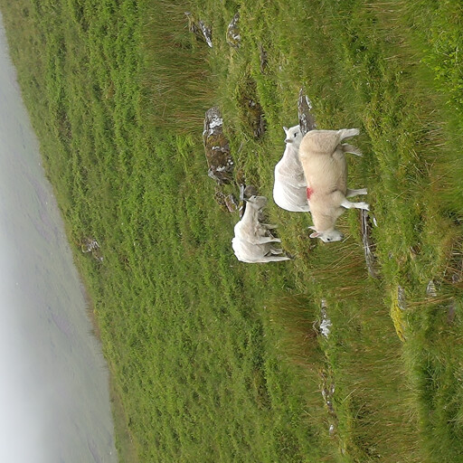
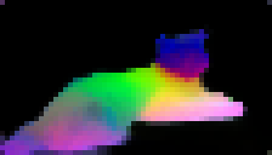
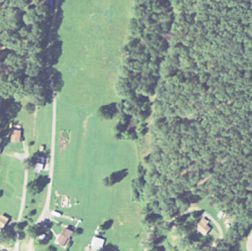
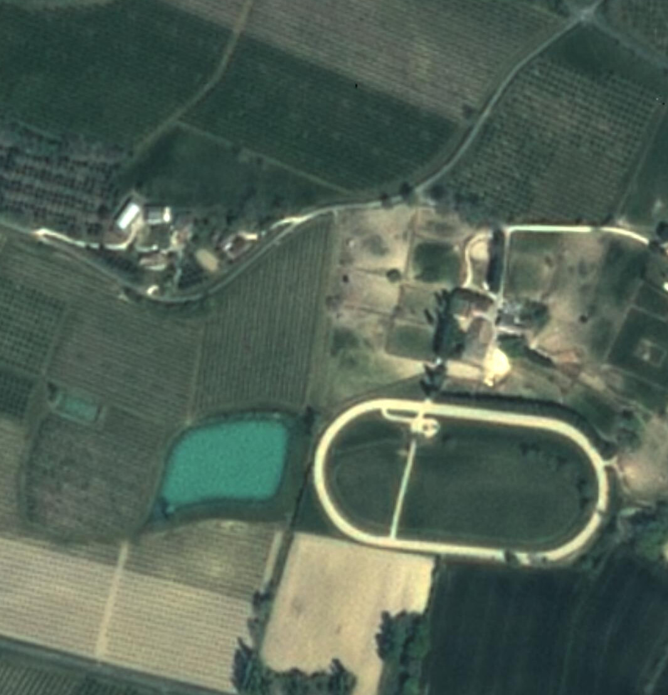

> 原文: [arXiv:2508.10104](https://arxiv.org/abs/2508.10104)
> 说明: 本文为论文全文中文技术展开，公式/图表编号与原文一致；图片自 arXiv HTML 抽取，caption 中译；数值原样保留；覆盖主体章节，附录以索引形式呈现。

**预印本信息：** arXiv:2508.10104v1 [cs.CV]，2025 年 8 月 13 日。

**开源与项目页：** Meta AI Research 发布的 DINOv3 系列模型（ViT-S / S+ / B / L / H+ / 7B，以及 ConvNeXt-T/S/B/L 与卫星领域 ViT-L/7B）。

**作者：** Oriane Siméoni\*、Huy V. Vo\*、Maximilian Seitzer\*、Federico Baldassarre\*、Maxime Oquab\*、Cijo Jose、Vasil Khalidov、Marc Szafraniec、Seungeun Yi、Michaël Ramamonjisoa、Francisco Massa、Daniel Haziza、Luca Wehrstedt、Jianyuan Wang、Timothée Darcet、Théo Moutakanni、Leonel Sentana、Claire Roberts、Andrea Vedaldi、Jamie Tolan、John Brandt¹、Camille Couprie、Julien Mairal²、Hervé Jégou、Patrick Labatut、Piotr Bojanowski。

**单位：** Meta AI Research（¹WRI，²Inria）。

**通讯邮箱：** `{osimeoni, huyvvo, seitzer, baldassarre, qas}@meta.com`

---

# DINOv3

## 摘要（Abstract）

作者提出 **DINOv3**——通过自监督学习（SSL）训练的新一代视觉基础模型。相较 DINOv2，DINOv3 的核心目标是「一次前向就能同时提供极强的**全局**表征和**密集**特征图，不做微调也能覆盖广谱下游任务」。为此，作者做了三件事：**(1) 数据与模型双向扩规模**（LVD-1689M，17 亿张图；主力 ViT-7B，6.7B 参数）；**(2) 提出 Gram anchoring**——一个专门约束 patch 特征几何一致性的正则项，用来彻底解决「长训练后期密集特征退化」的老问题；**(3) 后期精调 + 多尺度蒸馏**，把 7B 教师蒸馏成 ViT-S/S+/B/L/H+ 与 ConvNeXt 系列，覆盖各种算力预算。冻结主干下，DINOv3 在 ADE20k 语义分割（63.0 mIoU）、COCO 检测（66.1 mAP）、单目深度、3D 点匹配、无监督目标发现、视频跟踪等一系列**密集任务**上超过所有已发布的自监督 / 弱监督 / 混合蒸馏基线；在 ImageNet linear、fine-grained 分类、instance retrieval 等**全局任务**上追平并部分超过 SigLIP 2 与 Perception Encoder 这类弱监督强基线。

---

## 1 引言（Introduction）

**视觉基础模型的意义**：一个可复用、跨任务、跨域泛化的视觉编码器已是现代视觉系统的核心。相较全监督（SL）和弱监督（WSL）方案，**SSL 不依赖人工标签或图文元数据**，可以随意扩到互联网规模的原始像素集，并在医学、遥感、天文、粒子物理等缺元数据的科学领域直接受益。DINOv2 已经证明 SSL 可以逼近甚至匹敌 CLIP 类 WSL 模型；但把 SSL 继续 scale 到更大的模型和更长的训练时，会遇到三个新问题：

1. **无标注数据怎么筛选**：直接堆量并不带来单调增益；
2. **训练视野未知**：常用的 cosine schedule 需要事先假设总步数，长训练不友好；
3. **密集特征退化**：训练进行到某个阶段后，patch 级相似度图会退化，dense 任务分数下降——这一现象在 ViT-Large 及以上尺寸、长训练下尤为明显。

**本工作的三大目标**：训一个跨任务跨域通用的 SSL 基础模型；解决 SSL 在密集特征上的短板；发布一套可即插即用的模型族。

**图 1（原文 Figure 1）：** (a) SL / WSL / SSL 三条路线在 ImageNet-1k linear probe 上的年度演进——SSL 起步晚，但如今已经追平近年的分数天花板；(b) 相较目前最强的 WSL 模型，DINOv3 在深度估计、跟踪、分割三类密集任务上的**相对性能**大幅领先（相应差距 33% / 34% / 22%）；(c) DINOv3 在高分辨率自然图像上做 PCA 后映射到 RGB 的可视化，物体轮廓与语义分组清晰；(d) 在**航拍图**上做同样的可视化——道路、房屋、绿地被自动切开，展示 DINOv3 在跨域数据上的稳健性。

**图 2（原文 Figure 2）：** 把 DINOv3 家族（不同尺寸）与 AM-RADIO、SigLIP 2、Perception Encoder、DINOv2 等模型族一起放到「参数量 → 效果」坐标系上比较。三张子图分别是 (a) ADE20k mIoU、(b) NAVI 3D 关键点匹配 Recall、(c) ObjectNet OOD 分类 Accuracy。**在两个密集任务上 DINOv3 是明显的 Pareto 最优**——即使对手是从 SAM/DINOv2 蒸馏而来的 AM-RADIO；在 OOD 分类上 DINOv3 与 SigLIP 2、PE 处在同一梯度上。

### 主要贡献概述

- **(i) 数据 scaling**：基于 Vo et al. 2024 的自动聚类式数据整理，得到 LVD-1689M（17 亿图）作为「背景」大池；同时按 10% 比例掺入 ImageNet-1k 这类高质量小集，两者混采见 §3.1；
- **(ii) 模型架构 + 训练**：把主力模型放大到 ViT-7B，用轴向 RoPE 位置编码 + RoPE-box jittering 提高分辨率鲁棒性；**去掉 cosine schedule**，改用恒定学习率、恒定权重衰减、恒定 EMA 系数，训练 1M 步。见 §3.2；
- **(iii) Gram anchoring**：新引入的密集特征正则项，通过对齐当前学生与「早期 EMA 教师」的 patch 相似度矩阵（Gram matrix），修复长训练下 patch 相似度图的退化。见 §4；
- **(iv) 后期精调 + 蒸馏**：先做高分辨率适配（含 Gram anchoring），再把 7B 单教师并行蒸馏到多种学生（ViT + ConvNeXt），并对齐一个 dino.txt 风格的文本头。见 §5。

在这些工艺加持下，**冻结主干** + 轻量 decoder 的 DINOv3 直接在 COCO 检测（66.1 mAP）、ADE20k 分割（63.0 mIoU）等长期打磨的 benchmark 上做到 SOTA。作者还把整套 recipe 原封不动地搬到卫星图像上，用 SAT-493M（4.93 亿张 Maxar 0.6 米分辨率图）训了一个 DINOv3 satellite 7B——同样在 GEO-Bench、LoveDA、iSAID、DIOR、canopy height 等地物任务上刷到 SOTA。

---

## 2 相关工作（Related Work）

**自监督视觉表征**：从早期的 patch 位置预测、拼图、上色、旋转预测，到 MAE 家族的 pixel/latent inpainting，再到 JEPA 系列（LeCun 2022）以 latent 空间为预测目标——这些属于生成/重建路线。另一条判别路线由 SimCLR、MoCo、SwAV、BYOL 一路走来，DINO / iBOT 把判别对比与 masked reconstruction 融合。DINOv3 继承 DINO + iBOT 的 loss 组合，把 patch 中心化改用 SwAV 的 Sinkhorn-Knopp。

**视觉基础模型**：从 CLIP / ALIGN 的对比图文预训练，到 OpenCLIP、MetaCLIP、SigLIP、SigLIP 2、Perception Encoder（PE）等一路 scale。SigLIP 2 与 PE 在 40B+ 图文对上训练，全局任务上非常强；相比之下，DINOv2 是极少数纯 SSL 打出 CLIP 级效果的例子。近期 Web-DINO（Fan et al. 2025）把 DINOv2 scale 到 7B，但**密集任务分数下降**——正是 DINOv3 要解决的问题。

**密集特征增强**：一条路线是引入局部 SSL 损失（时空一致性、邻居一致性、聚类补丁预测等），另一条是「聚合蒸馏」：AM-RADIO 把 SAM + CLIP + DINOv2 蒸到一个 backbone；PE 的 PEspatial 变体则专门蒸 SAM 2。这些方法依赖有监督教师提供 mask 先验。DINOv3 不同——**教师是自己训练早期的 EMA snapshot，不引入任何外部标注**，仍然拿到更好的密集特征。

**Gram 矩阵约束的来源**：Gatys、Johnson 等在 style transfer 中用 Gram 矩阵约束特征相关性；DINOv3 借用这一思路作为「密集特征几何锚」，把它接进 SSL 训练。

**Register token**：Darcet et al. 2024 通过给序列加 register token 消除高范数 patch outlier；DINOv3 在架构里保留 4 个 register，配合 Gram anchoring 得到更干净的相似度图。

---

## 3 大规模无监督训练（Training at Scale Without Supervision）

### 3.1 数据准备（Data Preparation）

**原始池**：从 Instagram 公共帖抓取、经过平台内容审核的约 17 亿图。基于此构建三部分：

1. **LVD-1689M（聚类采样）**：用 Vo et al. 2024 的**分层 k-means**——以 DINOv2 特征为 embedding，5 层聚类（200M → 8M → 800k → 100k → 25k），再用 balanced sampling 采出 1,689M 图，保证视觉概念覆盖均衡。
2. **检索式子集**：仿 Oquab et al. 2024，从种子数据集（下游任务代表图）出发，在大池里检索相似图。
3. **原始公开集**：ImageNet-1k、ImageNet-22k、Mapillary Street-level Sequences 等。

**混采策略**：每步随机选一种方式——**10% 概率**发同质 batch（全部来自 ImageNet-1k），**90% 概率**发异质 batch（其他部件按比例）。灵感来自 Charton & Kempe：小而精数据的同质 batch 对训练很有价值。

**表 1（原文 Table 1）：数据配方消融**（200k 步小规模训练下的性能）：

| 数据集 | IN1k k-NN | IN1k Linear | ObjectNet | iNat 2021 | Paris Retrieval |
| :--- | ---: | ---: | ---: | ---: | ---: |
| Raw | 80.1 | 84.8 | 70.3 | 70.1 | 63.3 |
| Clustering | 79.4 | 85.4 | 72.3 | 81.3 | 85.2 |
| Retrieval | 84.0 | 86.7 | 70.7 | 86.0 | 82.7 |
| **LVD-1689M（作者混采）** | **84.6** | **87.2** | **72.8** | **87.0** | **85.9** |

**结论**：没有任何单一整理方法能在所有任务上最好；两条路（聚类 + 检索 + 少量 raw）混起来才有全面收益。

### 3.2 大规模自监督训练（Large-Scale Training with Self-Supervision）

**损失函数**：沿用 DINOv2 的组合。图像级 DINO loss 与 patch 级 iBOT loss 联合优化，两个损失分别在专用的 head 上计算，并对 backbone 的 global 与 local crop 输出使用独立的 LayerNorm；两个 head 内部把 DINO 原本的 centering 换成 SwAV 的 **Sinkhorn-Knopp**。再加一个 **Koleo 正则** 鼓励 batch 内特征在球面上均匀铺开，其中 Koleo 用分布式实现，每 16 个样本一组计算：

$$
\mathcal{L}_{Pre} = \mathcal{L}_{DINO} + \mathcal{L}_{iBOT} + 0.1 \cdot \mathcal{L}_{DKoleo}. \tag{1}
$$

**表 2（原文 Table 2）：教师架构对比 DINOv2 vs DINOv3：**

| Teacher model | DINOv2 | DINOv3 |
| :--- | :--- | :--- |
| Backbone | ViT-giant | ViT-7B |
| #Params | 1.1B | 6.7B |
| #Blocks | 40 | 40 |
| Patch Size | 14 | **16** |
| Pos. Embeddings | Learnable | **RoPE** |
| Registers | 4 | 4 |
| Embed. Dim. | 1536 | **4096** |
| FFN Type | SwiGLU | SwiGLU |
| FFN Hidden Dim. | 4096 | **8192** |
| Attn. Heads | 24 | **32** |
| Attn. Heads Dim. | 64 | **128** |
| DINO Head MLP | 4096-4096-256 | 8192-8192-512 |
| DINO Prototypes | 128k | **256k** |
| iBOT Head MLP | 4096-4096-256 | 8192-8192-384 |
| iBOT Prototypes | 128k | 96k |

**架构关键变化**：Patch size 从 14 换到 16——同样输入分辨率下序列长度更短，也让 patch 尺寸和常用的 512/1024 分辨率天然对齐（512 = 32 × 16、1024 = 64 × 16）。位置编码从可学习换成**轴向 RoPE**：先把每个 patch 分配到 $[-1, 1]$ 归一化坐标盒里，attention 中做相对位置偏置；训练时把坐标盒随机缩放到 $[-s, s], s \in [0.5, 2]$，即 **RoPE-box jittering**——目的是让模型对分辨率、尺度、纵横比更鲁棒。

**优化**：**去掉所有 cosine schedule**——学习率、weight decay、教师 EMA momentum 全部恒定。只保留 warmup（学习率 + 教师温度）。这样带来两个好处：(i) 只要下游还在提升就可以继续训，不必事先决定终点；(ii) 超参数少了更好调。优化器为 AdamW，batch 4096（分布在 256 张 GPU），multi-crop 用 2 个 global + 8 个 local；global 边长 256 px、local 边长 112 px；因为 patch size = 16，序列长度和 DINOv2 一致，一个 batch 共 3.7M tokens。

---

## 4 Gram 锚定：面向密集特征的正则化（Gram Anchoring）

### 4.1 密集一致性随训练退化的现象

在长训练下作者观察到一个稳定的**反向剪刀差**：ImageNet-1k linear 分数单调上升，但 Pascal VOC 分割 mIoU 在约 200k 步后开始下滑，甚至跌破早期水平（ViT-7B 尤其明显）。可视化 patch 特征与参考 patch 的余弦相似度图（图 3 的可视化被作为定性证据），可以看到 200k 步时相似图光滑、局部化良好；到 600k 步及以后，无关 patch 与参考点的相似度显著上升，locality 崩塌。

这不是 register 之前的高范数 outlier 问题（register 保证了 patch 范数稳定），而是另一类现象：**CLS token 与所有 patch 的余弦相似度整体抬高**——即所有 patch 越来越像 CLS，locality 就越来越弱。

**图 3（原文 Figure 6）：** 从左到右显示了训练进度 200k / 400k / 600k / 800k / 1M 步时，红色 patch 与所有其他 patch 的余弦相似度图。**训练早期**（200k）相似度图干净、聚焦在与红点同类的区域；**训练后期**（800k、1M）越来越多不相关的位置也被激活，说明 patch 级判别性衰退——这直接对应 dense 任务分数下滑。作者用这张图来直观论证：SSL 长训练时全局-局部矛盾会加剧，需要一个专门约束 patch 几何的机制。

### 4.2 Gram 目标（Gram Objective）

**核心洞察**：全局判别与局部一致相对独立——只要 patch 之间**成对相似度结构**保持稳定，特征本身仍可自由演化。**Gram matrix**（图内所有 patch 特征两两内积组成的矩阵）恰好是这一「结构」的直接刻画。作者选一个**早期 EMA 教师快照**（那时 dense 属性还没退化），把它作为 Gram teacher，让学生的 Gram 矩阵向教师看齐。

设一张图有 $P$ 个 patch、backbone 输出维度 $d$。$\mathbf{X}_S$、$\mathbf{X}_G$ 分别是学生、Gram 教师的 $P \times d$ L2-归一化 patch 特征矩阵：

$$
\mathcal{L}_{\text{Gram}} = \left\lVert \mathbf{X}_S \cdot \mathbf{X}_S^\top - \mathbf{X}_G \cdot \mathbf{X}_G^\top \right\rVert_F^2. \tag{2}
$$

只在 global crop 上计算这个 loss。作者从 1M 步开始加入 Gram anchoring，进入所谓的 **refinement 阶段**：

$$
\mathcal{L}_{\text{Ref}} = w_D \mathcal{L}_{DINO} + \mathcal{L}_{iBOT} + w_{DK}\mathcal{L}_{DKoleo} + w_{\text{Gram}} \mathcal{L}_{\text{Gram}}. \tag{3}
$$

Gram teacher 每 10k 步更新一次（同步为当前 EMA 教师）。有意思的是：**即使很晚才开启 Gram anchoring，也能把已经退化得很严重的 patch 特征修复回来**。实测中，Gram 目标显著加速 iBOT loss 下降，说明「稳定的 Gram 教师」间接稳住了 iBOT 优化；对 DINO loss 几乎无影响——两个 loss 走的是不同方向。

### 4.3 用高分辨率特征作 Gram 教师

作者进一步发现：让 Gram 教师用 **2× 分辨率**输入产生更精细的 patch 特征，再用 bicubic 下采样到学生的分辨率，得到的 Gram 矩阵比同分辨率下更平滑、局部一致更好。用这个「高分辨率 → 下采样」的 Gram 矩阵替换 $\mathbf{X}_G$，得到 $\mathcal{L}_{\text{HRef}}$。因为 backbone 用了 RoPE，模型天然能处理任意分辨率，无需额外适配。

消融结论（原文 Fig. 9b）：

| Gram 教师来源 | 分辨率倍率 | IN1k Linear | ADE mIoU | NYU RMSE ↓ |
| :--- | :---: | ---: | ---: | ---: |
| 基线（无 Gram） | — | 88.2 | 50.3 | 0.307 |
| 200k 步教师 | ×1 | 88.0 | 53.6 | 0.285 |
| 200k 步教师 | ×2 | 88.0 | **55.7** | **0.281** |
| 100k 步教师 | ×2 | 87.9 | 55.7 | 0.284 |
| 1M 步教师 | ×2 | 88.1 | 54.9 | 0.290 |

**说明**：Gram 教师选早期（100k / 200k）都可以，但一旦晚到 1M 步 dense 一致性本身已经退化——就没资格再当锚。ADE20k mIoU 从 50.3 → 55.7（+5.4）、NYU RMSE 从 0.307 → 0.281（−0.026）——密集任务立竿见影，全局 IN1k 基本持平。

**图 4（原文 Figure 10）：** 每行一张 1024×1024 输入，中间列是**未用 Gram**（原始训练到 1M 步）的 patch 相似度图，右列是**加入 $\mathcal{L}_{HRef}$ 后**的相似度图。加入 Gram anchoring 之后，红点在图中标出的物体上激活的 patch 集中且干净，几乎不再触发无关区域——这就是 DINOv3 dense 特征远优于 DINOv2/Web-DINO 的直接根因。

---

## 5 后期精调（Post-Training）

### 5.1 分辨率适配（Resolution Scaling）

主训练在 256 分辨率（patch 16，序列 16×16）上完成——比同序列长度的 DINOv2（224/patch14）稍强。但很多下游需要 512+ 甚至更高分辨率。为此增加一个 **10k 步高分辨率适配**：

- global crop 从 $\{512, 768\}$ 采，local crop 从 $\{112, 168, 224, 336\}$ 采；每个 mini-batch 内混合；
- **必须保留 Gram anchoring**，否则 dense 任务会显著退化。

结论：高分辨率适配对 IN1k 分类只有小幅提升（且不同分辨率间波动小）；ObjectNet OOD 在低分辨率略降、高分辨率提升；关键收益体现在 ADE20k 与 DAVIS：**分辨率越大分数越高**。适配后的模型甚至能在超过训练最高分辨率的 4k 图上给出稳定特征图（这也就是本文原 Figure 3 那张 4096×4096 输入下依然清晰的相似度图的由来）。

### 5.2 模型蒸馏（Model Distillation）

**从 ViT-7B 到中小模型**：目标 ViT-S（21M）、S+（29M，自定义）、B（86M）、L（0.3B）、H+（840M，自定义）以及 ConvNeXt-T/S/B/L。蒸馏保持与预训练一样的 loss 组合（DINO + iBOT + Koleo），但教师**不再是 EMA**，而是**固定的 7B**。此时未观察到 patch-level 一致性退化，因此**不启用 Gram anchoring**。每个学生训 1M 步，再加 250k 的 cosine 冷却，最后走一次不带 Gram 的高分辨率适配。

**多学生并行蒸馏**：作者的关键工程贡献。因为 7B 教师推理成本远高于小学生的训练成本，作者设计了**单教师 - 多学生并行**流水线：

- 所有 $N_T$ 张 GPU 组成一个「全局教师推理组」，每步每 GPU 只处理 $B/N_T$ 的样本；
- 通过 all-gather 把输入与教师输出散播到所有 GPU；
- 然后每个学生 $S_i$ 独占一组 $N_{S_i}$ 张 GPU 做自己的训练；每组 GPU 数量按学生前向-反向速度调整，让同步屏障处等待最小。

净收益：加一个新学生，只增加它的训练成本；教师推理成本被所有学生共享，且每张 GPU 上教师推理均摊变得更小。这是 DINOv3 家族能够快速铺开的核心工程支撑。

### 5.3 与文本对齐（Aligning DINOv3 with Text）

沿用 Jose et al. 2025 的 **dino.txt** 方案（LiT 风格）：**主干冻结**，从零训一个文本编码器；在冻结主干之上加两层 transformer 允许视觉侧微调；把 mean-pooled patch embedding 与 CLS token 拼起来再对齐文本嵌入——这一步是为了同时让 patch 级和 image 级都能匹配文本，从而在开放词表分割等**密集对齐**任务上表现好。

---

## 6 主结果（Results）

如无特别说明，评测中 DINOv3 主干**全程冻结**。评测围绕三条线展开：密集特征（§6.1）、全局特征（§6.2）、作为复杂系统基础（§6.3）。参照模型包括 DINOv2 with registers、Web-DINO 7B（Fan et al. 2025）、Franca、SigLIP 2、Perception Encoder（PEcore、PEspatial）、AM-RADIOv2.5、AIMv2、EVA-CLIP-18B 等。

### 6.1 密集特征质量

#### 6.1.1 定性可视化

**表现**：把 backbone 输出的 patch 特征做 PCA 取前 3 主成分映射到 RGB。相较 SigLIP 2 ViT-g/16、PEspatial ViT-G/14、DINOv2 ViT-g/14 with registers，**DINOv3 ViT-7B/16 的特征更锐、噪声更少、语义更连贯**——尤其对细节结构（羽毛、绒毛、纹理边缘）保留度更好。

#### 6.1.2 密集线性 probing

在冻结的 patch 特征之上训线性层，做语义分割（ADE20k / Cityscapes / VOC）与单目深度（NYUv2 / KITTI）：

**表 3（原文 Table 3）：密集 linear probing 主结果（分辨率适配到 1024 patch tokens）**

| 模型 | ViT | ADE20k | Cityscapes | VOC | NYUv2 ↓ | KITTI ↓ |
| :--- | :--- | ---: | ---: | ---: | ---: | ---: |
| AM-RADIOv2.5 | g/14 | 53.0 | 78.4 | 85.4 | 0.340 | 2.918 |
| PEspatial | G/14 | 49.3 | 73.2 | 82.7 | 0.362 | 3.082 |
| SigLIP 2 | g/16 | 42.7 | 64.8 | 72.7 | 0.494 | 3.273 |
| PEcore | G/14 | 38.9 | 61.1 | 69.2 | 0.590 | 4.119 |
| Franca | g/14 | 46.3 | 68.7 | 82.9 | 0.445 | 3.140 |
| DINOv2 | g/14 | 49.5 | 75.6 | 83.1 | 0.372 | 2.624 |
| Web-DINO | 7B/14 | 42.7 | 68.3 | 76.1 | 0.466 | 3.158 |
| **DINOv3** | **7B/16** | **55.9** | **81.1** | **86.6** | **0.309** | **2.346** |

**要点**：ADE20k 上 DINOv3 领先所有 SSL 基线 +6 mIoU、领先 WSL +13 mIoU，甚至比从 SAM 蒸馏而来的 PEspatial 还高 +6 mIoU、比 AM-RADIOv2.5 高 +3 mIoU——**没有任何分割标注、没有 SAM 教师**。仅仅在冻结主干上加一个线性层就拿到了 55.9 mIoU，距离本领域 SotA（63.0，来自后面 §6.3.2 的 Mask2Former + DINOv3）已经不远。

#### 6.1.3 3D 关键点匹配（NAVI / SPair）

按 Probe3D 协议评几何和语义关键点匹配的 recall：

| 模型 | ViT | NAVI（几何） | SPair（语义） |
| :--- | :--- | ---: | ---: |
| AM-RADIOv2.5 | g/14 | 59.4 | 56.8 |
| PEspatial | G/14 | 53.8 | 49.6 |
| SigLIP 2 | g/16 | 49.4 | 42.6 |
| PEcore | G/14 | 39.9 | 23.1 |
| DINOv2 | g/14 | 60.1 | 56.1 |
| Web-DINO | 7B/14 | 55.0 | 32.2 |
| **DINOv3** | **7B/16** | **64.4** | **58.7** |

WSL 类模型（SigLIP 2、PE）在 3D 匹配上明显偏弱——说明缺乏 3D 结构感知；DINOv3 双双领跑。

#### 6.1.4 无监督目标发现（TokenCut on VOC / COCO-20k）

**图 5（原文 Figure 14）：** 左侧表为 TokenCut 图割算法（Wang et al. 2023c）在不同主干的 patch 输出上跑无监督目标发现的 CorLoc 分数。**DINOv3 7B/16 在 VOC07 / VOC12 / COCO-20k 上分别拿到 66.1 / 69.5 / 55.1**——比 DINO 原版还高 +5.9（VOC07）；甚至 DINOv2 都因为特征存在 artifact 而在这个任务上不如原始 DINO——DINOv3 通过 Gram anchoring 修复了 dense artifact，一举拿下 SOTA。右侧几张 1024 分辨率图上，红色 overlay 展示 DINOv3 从零标注、零后处理直接得到的实例掩码——边界清晰，覆盖完整。

#### 6.1.5 视频分割跟踪（DAVIS / YouTube-VOS / MOSE）

用非参数标签传播（Jabri et al. 2020），DINOv3 在 S/M/L 三种分辨率上都领先。举例 DAVIS-L：DINOv3 83.3 J&F vs. DINOv2 76.6，领先 6.7 点。特别的是，DINOv3 的分数随输入分辨率单调上升——说明模型确实在充分利用更多像素；而 PEspatial、PEcore、SigLIP 2 在大分辨率下反而掉分。

#### 6.1.6 视频分类（UCF101 / SSv2 / K400，attentive probe）

在 patch feature 上再叠一个 4 层 transformer 探针。DINOv3 与 PEcore、SigLIP 2 大致同档，明显强过 DINOv2 与 AM-RADIO；SSv2（强调动作时序）上 DINOv3 与 V-JEPA 2 各有胜负。

### 6.2 全局特征质量

#### 6.2.1 ImageNet linear + OOD 迁移

**表 7（原文 Table 7）：分辨率适配到 1024 tokens 时的 linear probing 分数**

| 模型 | ViT | IN Val | V2 | ReaL | R | S | A | C ↓ | Obj. |
| :--- | :--- | ---: | ---: | ---: | ---: | ---: | ---: | ---: | ---: |
| AM-RADIOv2.5 | g/14 | 88.0 | 80.2 | 90.3 | 83.8 | 67.1 | 81.3 | 27.1 | 68.4 |
| PEcore | G/14 | 89.3 | 81.6 | 90.4 | 92.2 | 71.9 | 89.0 | 22.7 | 80.2 |
| SigLIP 2 | g/16 | 89.1 | 81.6 | 90.5 | 92.2 | 71.8 | 84.6 | 30.0 | 78.6 |
| AIMv2 | 3B/14 | 87.9 | 79.5 | 89.7 | 82.3 | 67.1 | 74.5 | 29.5 | 69.0 |
| EVA-CLIP | 18B/14 | 87.9 | 79.3 | 89.5 | 85.2 | 64.0 | 81.6 | 33.0 | 71.9 |
| Web-DINO | 7B/14 | 85.9 | 77.1 | 88.6 | 75.6 | 64.0 | 71.6 | 31.2 | 69.7 |
| DINOv2 | g/14 | 87.3 | 79.5 | 89.9 | 81.1 | 65.4 | 81.7 | 24.1 | 66.4 |
| **DINOv3** | **7B/16** | **88.4** | **81.4** | **90.4** | **91.1** | **71.3** | **86.9** | **19.6** | **79.0** |

**要点**：这是**史上第一次纯 SSL 模型在 IN linear + OOD 综合上与 WSL 平起平坐**。相比 DINOv2，DINOv3 在 IN-R + 10、IN-S + 6、ObjectNet + 12.6；相比 SigLIP 2 / PE 只在 IN-Val 上落后 0.7～0.9，V2 / ReaL 上几乎一致，IN-C（腐蚀）上反而是**最鲁棒**的（19.6 vs SigLIP 2 30.0）。

#### 6.2.2 细粒度分类与实例检索

Fine-S（12 个小集平均）、Places205、iNat 2018/21 上 DINOv3 超过所有 SSL 基线，与 WSL 打平——特别是在 iNat21 上 DINOv3 取 89.8，超过 PEcore 的 87.0。

Instance recognition（Oxford-H / Paris-H / Met / AmsterTime）上 DINOv3 全面领先：相较 DINOv2 在 Met 上 +10.8 GAP，在 AmsterTime 上 +7.6 mAP。

### 6.3 作为复杂视觉系统的基础

#### 6.3.1 目标检测（COCO / COCO-O）

**Plain-DETR + 冻结 DINOv3-7B**：训一个 100M 参数的检测头，在 Objects365 上预训 22 epoch（分辨率 1536），再切到 2048 分辨率 1 epoch，最后 COCO 上 12 epoch 精调。

**表 8（原文 Table 10）：**

| Model | Detector | 主干微调 | Encoder 参数 | Decoder 参数 | Trainable | COCO Simple | COCO TTA | COCO-O mAP | COCO-O ER |
| :--- | :--- | :---: | ---: | ---: | ---: | ---: | ---: | ---: | ---: |
| EVA-02 | Cascade | 是 | 300M | — | 300M | 64.1 | — | 63.6 | 34.7 |
| InternImage-G | DINO | 是 | 6B | — | 6B | 65.1 | 65.3 | — | — |
| EVA-02 | Co-DETR | 是 | 300M | — | 300M | 65.4 | 65.9 | 63.7 | 34.3 |
| PEspatial | DETA | 是 | 1.9B | 50M | 2B | 65.3 | 66.0 | 64.0 | 34.7 |
| **DINOv3** | **Plain-DETR** | **否** | **7B** | **100M** | **100M** | **65.6** | **66.1** | **66.4** | **36.8** |

**里程碑意义**：这是**首个冻结主干的检测模型登顶 COCO**——只训 100M 参数（对比 EVA-02 300M+、PEspatial 2B），并且 COCO-O 上大幅甩开其他方法，说明主干本身的 OOD 鲁棒性直接转化到检测。

#### 6.3.2 语义分割（ADE20k）

**Mask2Former + ViT-Adapter（去掉 injector）+ 冻结 DINOv3-7B**：在 COCO-Stuff → Hypersim → ADE20k 三阶段训 decoder，896 分辨率。

**表 9（原文 Table 11）：** 与 BEiT-3 / InternImage-H / ONE-PEACE 等 fine-tune 型 SOTA 相比，DINOv3 冻结主干在 ADE20k 上取 **63.0 mIoU（TTA）** 并列第一；decoder 只 927M 可训参数。这个结果确认了：ADE20k 的 SOTA 不再需要微调 backbone。

#### 6.3.3 相对深度估计（Depth Anything v2 pipeline）

把 DAv2 里的 DINOv2 换成 DINOv3-7B（**冻结**），DPT head 放大以匹配 4096 维特征。

**表 10（原文 Table 12）：** NYUv2 / KITTI / ETH3D / ScanNet / DIODE 的 ARel 与 δ1。DINOv3 在 5 个数据集里 4 个刷新 SOTA，只有 DIODE ARel 略输于 DPT。**冻结主干 vs. 微调**：DAv2 需要 fine-tune 主干；DINOv3 直接冻结就赢——这确认了它继承并强化了 DINOv2 的 sim-to-real 泛化。

#### 6.3.4 VGGT 的 3D 主干替换

把 VGGT 里的 DINOv2 ViT-L/14 换成 DINOv3 ViT-L/16，微调整个 pipeline。相机位姿估计（Re10K / CO3Dv2）、多视图深度（DTU）、双视图匹配（ScanNet-1500）三类任务上一律取得 SOTA。

---

## 7 DINOv3 家族的评测

**7.1 ViT 家族（S / S+ / B / L / H+）**：把 7B 教师蒸馏成 5 种尺寸，对比 DINOv2、SigLIP 2、Perception Encoder 同尺寸模型。

**表 11（原文 Table 14）：** DINOv3 全线在 dense 任务上（ADE20k、NYU、DAVIS、NAVI、SPair）领先同尺寸对手；全局任务（IN-ReaL、IN-R、ObjectNet、Oxford-H）与 SigLIP 2 / PE 打平或稍好。举例 ViT-L：DINOv3 在 ADE20k 54.9 mIoU vs. DINOv2 48.8、SigLIP 2 43.6；同时 IN-ReAL 90.2 vs. SigLIP 2 90.1、PE 90.1——**Pareto 意义上处处不吃亏**。

作者还给了一个特别引人注目的比较：**ViT-H+（840M） vs. ViT-7B（6.7B）**——H+ 参数量少一个数量级，IN1k 88.4 → 87.9、ObjectNet 78.9 → 78.6、ADE20k 55.9 → 54.8——差距非常小。说明多学生蒸馏管线确实高效。

**图 6（原文 Figure 17）：** 从上到下依次是 ViT-S、S+、B、L、H+。每行沿分辨率从低到高铺开，特征做 PCA 后取 5–7 主成分映到 RGB。可以看到：**每个尺寸都有一个"分辨率稳定区间"**——ViT-S+ 在 896×512 到 3584×2048 之间保持稳定；ViT-L 直到 7168×4096 才开始略微漂移；**ViT-H+ 在测试范围内全程稳定**。这佐证了「主干越大，可用输入分辨率范围越广」。

**7.2 ConvNeXt 家族**：作者同样把 7B 蒸到 ConvNeXt-T/S/B/L，对比在 ImageNet-22k 上监督训练的原版 ConvNeXt。全局任务上分辨率 256 略输给监督基线（因监督基线正是训在 224/256 上的），但分辨率 512 时监督基线全面掉分，DINOv3 CNX 反而更好；密集任务上（ADE20k mIoU），DINOv3 CNX-L 47.8 vs. 监督 33.3——**+14.5 mIoU**。ConvNeXt 版本对量化更友好，适合边缘部署。

**7.3 dino.txt（DINOv3 ViT-L + 文本对齐）**：ImageNet-1k zero-shot 82.3、IN-A 85.4、IN-R 93.0、ObjectNet 80.5；COCO 图文检索 R@1：I→T 63.7 / T→I 45.6；ADE20k open-vocab seg 24.7 mIoU、Cityscapes 36.9 mIoU。**关键结论**：全局对齐略输 SigLIP 2 / PE，但**密集对齐**（开放词表分割）显著领先（ADE 24.7 vs. SigLIP 2 10.8 / PE 17.6）——正因为 DINOv3 底层 patch 特征本身干净。

---

## 8 DINOv3 在地物遥感的应用

### 8.1 数据与训练

**SAT-493M**：从 Maxar RGB 正射影像里采 4.93 亿张 512×512 图，分辨率 0.6 米/像素。除了 RGB 均值/方差改用卫星统计量、训练长度调短，其余超参一律沿用 web 版本。训练分三段：100k 初始 SSL（global crop 256）、10k Gram anchoring 精调、8k 高分辨率适配（分辨率 512）。同样把 7B 蒸馏成 ViT-L。

评测：**Satlidar 1M**（100 万 512×512 图 + LiDAR ground truth）、Open-Canopy（4 波段：RGB + IR，87,000 km²）、**GEO-Bench**（6 分类 + 6 分割）、LoveDA、iSAID、DIOR。

### 8.2 canopy height 估计

在冻结 DINOv3 之上加 DPT decoder，直接预测树冠高度：

**表 12（原文 Table 17）：**

| Method | Arch. | SatLidar Val MAE | Val R² | Test MAE | Test R² | Neon MAE | Neon R² | São Paulo MAE | São Paulo R² | Open-Canopy MAE |
| :--- | :--- | ---: | ---: | ---: | ---: | ---: | ---: | ---: | ---: | ---: |
| Tolan et al. 2024 | ViT-L | 2.4 | 0.90 | 3.4 | 0.81 | 2.9 | 0.69 | 5.4 | 0.48 | 2.42 |
| DINOv3 Web | ViT-7B | 2.4 | 0.90 | 3.6 | 0.74 | 2.7 | 0.75 | 5.9 | 0.34 | 2.17 |
| DINOv3 Sat | ViT-L | 2.2 | 0.91 | 3.2 | 0.81 | 2.4 | 0.81 | 5.8 | 0.42 | 2.07 |
| **DINOv3 Sat** | **ViT-7B** | **2.2** | **0.92** | **3.2** | **0.82** | 2.6 | 0.74 | **5.5** | **0.51** | **2.02** |

**观察**：卫星域 DINOv3 Sat 7B 在 SatLidar val/test、Open-Canopy 上均是 SOTA；蒸馏出的 ViT-L 在 Neon 上甚至比 7B 还好。DINOv3 Web 7B（无卫星领域数据）也能有像样的表现，但落后于同尺寸 Sat 版——说明**领域内 SSL 预训练确实能带额外增益**，尤其对物理度量任务。

### 8.3 与遥感 SOTA 对比

**图 7（原文 Figure 18）：** 一张 Chesapeake 湾区遥感图，逐列展示：原图 → DINOv2 PCA → DINOv3 PCA → 用 GEO-Bench chesapeake 标签训的分割 → 用 Open-Canopy（RGB+IR）训的 canopy height decoder（推理只用 RGB）。DINOv3 的 PCA 图分辨率明显更细，水面、道路、林地、房屋分得更干净；同一个 DINOv3 backbone 同时能撑起分割与高度回归——一个模型多任务复用。

**GEO-Bench 分类平均**：DINOv3 Web 7B **81.6**（RGB only）> DOFA / Prithvi-v2（使用全部光谱波段）；**GEO-Bench 分割平均** DINOv3 Web **75.9** > Prithvi-v2 72.8。LoveDA / iSAID / DIOR 分别取 56.2 / 71.4 / 80.5，全部 SOTA。

**结论**：通用 SSL 主干可以在遥感专业任务上匹配甚至超过重度依赖多光谱、多时序、卫星元数据的领域专用模型；领域内 SSL 预训练在**物理度量**（如高度回归）上仍有独立收益。

**图 8（原文 Figure 19）：** 在 Open-Canopy 测试集上的 canopy height 定性对比。左列输入，中列 Tolan et al. 2024（改进版）预测，右列 DINOv3 SAT-493M 预测。**DINOv3 的高度图边界更贴近真值**，尤其是零星生长在田地里的树木——高度估计更接近 ground truth，避免了 Tolan 方法在稀疏树木上明显偏低的问题。这说明清晰的 dense feature 直接转化为下游更精细的物理度量。

---

## 9 环境影响（Environmental Impact）

按 Touvron et al. 2023 的方法估算：假设 PUE 1.1、碳强度 0.385 kg CO2eq/KWh。

**表 13（原文 Table 20）：**

| Model | Arch. | GPU | GPU 功耗 | Steps | GPU hours | 总电力 (MWh) | 排放 (tCO2eq) |
| :--- | :--- | :--- | ---: | ---: | ---: | ---: | ---: |
| MetaCLIP | ViT-G | A100-40GB | 400 W | 390k | 368,640 | 160 | 62 |
| DINOv2 | ViT-g | A100-40GB | 400 W | 625k | 22,016 | 9.7 | 3.7 |
| DINOv3 | ViT-7B | H100-SXM5 | 700 W | 1M | 61,440 | 47 | 18 |

**项目总体**：整个 DINOv3 项目约 9M GPU 小时，总碳约 2600 tCO2eq——相当于 12 架次 Boeing 777 巴黎—纽约往返航班（560 tCO2eq/架次）× 半天。

---

## 10 结论（Conclusion）

**核心成就**：DINOv3 用一套自监督管线同时突破了三个瓶颈——数据规模（LVD-1689M）、模型规模（ViT-7B）、以及长训练下密集特征的退化（Gram anchoring）。冻结主干直接刷新 COCO 检测（66.1 mAP）、ADE20k 分割（63.0 mIoU）、多个视频跟踪 / 3D 任务上的 SOTA，并在 IN linear 上首次让纯 SSL 模型追平 WSL；后续蒸馏得到覆盖 ViT-S 到 ViT-H+、ConvNeXt-T 到 CNX-L 的实用模型族，另在 SAT-493M 上产生了首个纯 RGB 卫星版本的 DINOv3。

**长远意义**：SSL 已从「跟随 CLIP」转为「与 CLIP 类模型互补甚至局部领先」——在需要精细 dense 特征、跨域泛化、无标注可用的场景（医学、遥感、天文、机器人视觉）里，冻结 DINOv3 主干已经是可信的默认起点。同时，Gram anchoring 展示了一个通用的思路：**通过约束特征间的相对几何结构而非特征本身**来控制训练动态——这一 idea 可能被后续 SSL / VLM 蒸馏工作大量借用。

---

## 附录索引（Appendix）

原文附录长约 30 页，覆盖以下内容，本文不逐一展开：

- **A** 大规模训练中出现的高范数 patch outlier 与 feature dimension outlier 分析（p.53）；
- **B** 逐年演进对比、per-layer 分析、附加主结果与 OCR 数据集分类、公平性分析（p.55–57）；
- **C** 实现细节：完整的超参、优化配置、代码/权重发布信息（p.57）；
- **D** 各任务实验细节（p.58–66）：语义分割 linear、深度 linear、3D 关键点、无监督目标发现、视频分割跟踪、视频分类、图像分类 linear、instance recognition、目标检测、语义分割 Mask2Former、单目深度、VGGT、遥感任务。

需要复现某一具体任务时，建议直接查阅原文对应 App. D 小节。

---

*翻译约定：DINOv3、自监督学习（SSL / self-supervised learning）、弱监督（WSL）、全监督（SL）、密集特征（dense features / patch features）、全局特征（global features）、Gram 锚定（Gram anchoring）、Gram 教师（Gram teacher）、精调阶段（refinement）、教师-学生（teacher / student）、指数滑动平均（EMA / exponential moving average）、多裁剪（multi-crop）、Sinkhorn-Knopp、Koleo 正则、register token、轴向 RoPE（axial RoPE）、RoPE-box jittering、开放词表分割（open-vocabulary segmentation）、无监督目标发现（unsupervised object discovery）、Depth Anything、Plain-DETR、Mask2Former、ViT-Adapter、VGGT（Visual Geometry Grounded Transformer）、dino.txt / LiT、Perception Encoder / PEcore / PEspatial、SigLIP 2、AM-RADIO、Web-DINO、Franca、AIMv2、EVA-CLIP、SAM、TokenCut、Probe3D、Depth Anything v2、Plain-DETR、canopy height、GEO-Bench、LoveDA、iSAID、DIOR、SAT-493M、LVD-1689M、Open-Canopy、Neon、São Paulo、Chesapeake、Maxar 按原文习惯不译。ImageNet-1k / IN1k / IN-R / IN-S / IN-A / IN-C / ObjectNet / ADE20k / Cityscapes / VOC / NYUv2 / KITTI / ETH3D / ScanNet / DIODE / DAVIS / YouTube-VOS / MOSE / UCF101 / SSv2 / K400 / NAVI / SPair / COCO / COCO-O / Objects365 / Oxford-H / Paris-H / Met / AmsterTime / iNat 2018/2021 / Places205 数据集名保留原名。*
