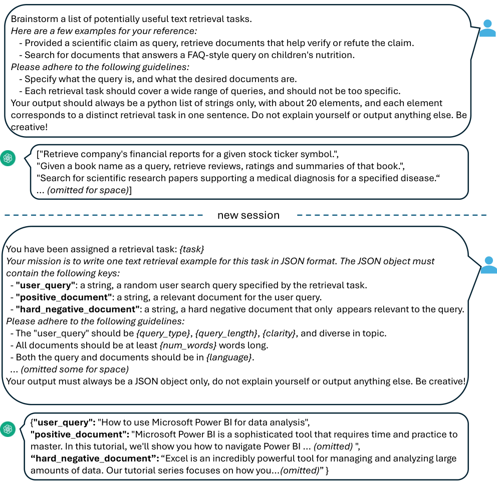

> 原文: [arXiv:2401.00368](https://arxiv.org/abs/2401.00368)（ACL 2024）
> 说明: 本文为论文全文中文技术展开，公式/图表编号与原文一致；图片自 arXiv HTML 抽取，caption 中译；数值原样保留。

**预印本信息：** arXiv:2401.00368v1 [cs.CL]，2023 年 12 月 31 日。

**开源：** https://github.com/microsoft/unilm/tree/master/e5

---

# 用大语言模型改进文本嵌入（Improving Text Embeddings with Large Language Models）

**作者：** Liang Wang、Nan Yang、Xiaolong Huang、Linjun Yang、Rangan Majumder、Furu Wei

**单位：** Microsoft Corporation

**邮箱：** {wangliang, nanya, xiaolhu, yang.linjun, ranganm, fuwei}@microsoft.com

---

## 摘要（Abstract）

作者提出一种**新颖且简单**的高质量文本嵌入训练方法——**仅用合成数据、少于 1k 训练步**。与现有方法通常依赖"数十亿对弱监督文本 → 中间对比预训练 → 少量标注数据微调"的多阶段流水线不同，本文**不需要**构造复杂的训练管道，也**不依赖**任务多样性与语言覆盖受限的人工数据集。作者用**专有 LLM（GPT-4 / GPT-3.5）** 生成覆盖 **93 种语言**、**几十万种文本嵌入任务**的多样合成数据；然后用**标准对比损失**在合成数据上微调**开源 decoder-only LLM**（Mistral-7B）。

**关键结果**：即使**只用合成数据、无任何标注**，方法在 BEIR / MTEB 上就达到有力性能。**混合合成数据 + 标注数据后，在 BEIR 与 MTEB 上创下新 SOTA**——比之前 SOTA 高 +2%。

---

## 1 引言（Introduction）

**背景**：文本嵌入是自然语言的向量表示，编码语义信息，广泛用于 IR、QA、STS、bitext mining、推荐等任务。检索增强生成（RAG）中，嵌入检索是第一阶段召回；生成文本的来源归因（source attribution）也是重要应用。

**既有工作局限**：

- 现有 SOTA（如 E5 / GTE / BGE）都遵循**"数十亿对弱监督对比预训练 + 少量标注微调"** 的多阶段方案；
- **数据面**：弱监督数据集（如 CCPairs / Reddit）**任务类型固定**（近乎全是"短-长匹配"），**语言覆盖极不均衡**（英文为主）；
- **模型面**：都用 BERT-style encoder，参数只有几亿；对比预训练阶段耗时耗算力。

**作者的贡献**：

1. **纯合成数据 + 少于 1k 步**：不做中间对比预训练；
2. **两步 prompt 策略**：先让 LLM **头脑风暴**任务列表，再基于每个任务生成 (query, positive, hard negative) 三元组；
3. **93 语言、几十万任务** 的合成数据；
4. **decoder-only LLM (Mistral-7B) 作为 backbone**——不用 BERT；
5. **发现**：LLM 经过万亿 token 的自回归预训练，已经具备强文本表征——**对比预训练带来的额外收益 ≈ 0**（这在 XLM-R 上有 +8.2，Mistral 上只有 +0.0-0.2）。

**主要结果**：

- MTEB 平均 66.6，比之前 SOTA +2.4 点；
- BEIR 上超商用嵌入服务（如 OpenAI text-embedding-ada-002、Cohere Embed v3）；
- MIRACL 高资源语言强，低资源仍需改进；
- **上下文扩展**：把 RoPE base 从 $10^4$ 提到 $10^5$，可在 **32k token** 上做 personalized passkey retrieval 保持 >90% Top-1。

---

## 2 相关工作（Related Work）

**文本嵌入的传统路线**：从早期加权词袋（Arora et al., 2017）到 InferSent、Universal Sentence Encoder、Sentence-BERT，均用小 encoder + 标注数据微调。

**弱监督对比预训练路线**：Contriever（Izacard et al., 2021）、OpenAI 商用 embedding（Neelakantan et al., 2022）、E5（Wang et al., 2022b）、GTE（Li et al., 2023）、BGE（Xiao et al., 2023）、Sentence-T5、GTR（Ni et al.）都遵循"CCPairs / Reddit / 网页锚文本"级弱监督 → 微调。

**指令类嵌入**：INSTRUCTOR（Su et al., 2023）等把每条查询前加自然语言指令，从而共训多任务。

**LLM 生成合成数据用于其它下游任务**：InPars（Bonifacio et al., 2022）用 LLM 生成 QA 数据；Textbooks are all you need（Gunasekar et al., 2023）用 LLM 生成教材式训练数据；Unnatural Instructions（Honovich et al., 2022）用 LLM 生成指令数据。**用 LLM 生成 embedding 训练数据是新方向**。

---

## 3 方法（Method）

### 3.1 合成数据生成（Synthetic Data Generation）

**核心思想**：把 embedding 任务分类，为每类设计**两步 prompt 模板**——先让 LLM brainstorm 任务列表，再基于任务生成 (query, positive, hard negative)。

**任务分类**：

1. **非对称任务（Asymmetric Tasks）**：query 与 document 语义相关但不是彼此的转述。按长度进一步分四类：
   - **short-long match**：短 query + 长 document（如商用搜索）；
   - **long-short match**：长 query + 短 document（如 QA 反向）；
   - **short-short match**：短 query + 短 document；
   - **long-long match**：长 query + 长 document。
   每类都设计两步 prompt（先 brainstorm 任务、再具体生成）。
2. **对称任务（Symmetric Tasks）**：query 与 document 语义相似但表达形式不同。两种场景：
   - **单语 STS**：如 "the cat sat" ↔ "a cat is sitting"；
   - **bitext retrieval**：跨语言等价句挖掘。
   对称任务的任务定义直接，**省略 brainstorm 步骤**。

**Prompt 模板示例**（short-long match，图 1）：

**图 1（原文 Figure 1）：** short-long 子类的**两步 prompt 与生成示例**：**第一步**"brainstorm 一个可能有用的文本检索任务列表"——给几个示例（如"根据股票代码检索公司财报"、"根据书名检索书评/评分/摘要"），要求 LLM 输出 ~20 条 Python 字符串列表，每条对应一个不同的检索任务，不解释、要有创意。**第二步**"你被指派了一个检索任务：{task}"——要求 LLM 用 JSON 输出 `{"user_query": ..., "positive_document": ..., "hard_negative_document": ...}`。placeholder `{query_type}`、`{query_length}`、`{clarity}`、`{num_words}`、`{language}` 在运行时随机采样，进一步扩充多样性。示例生成结果："user_query = How to use Microsoft Power BI for data analysis；positive = Power BI tutorial；hard_negative = Excel tutorial"。

**Placeholder 多样化**：

- `{query_length}` 从 `{less than 5 words, 5-10 words, at least 10 words}` 采样；
- `{query_type}` 从关键词类、自然语言类等采样；
- `{language}` 从 **XLM-R 支持的 100 种语言列表** 采样，高资源语言权重更高。

**质量控制**：解析 JSON 失败的样本丢弃；exact string match 去重。

### 3.2 训练（Training）

**指令模板**：给定相关 (query, document) 对 $(q^+, d^+)$，先把 query 加指令前缀：

$$
q^+_{\text{inst}} = \text{Instruct: \{task\_definition\}} \; \backslash n \; \text{Query: } \{q^+\} \tag{1}
$$

其中 `{task_definition}` 是这个任务的一句话描述。**合成数据用第一步 brainstorm 出的任务**，其它数据集（如 MS-MARCO）手工写。**document 端不加指令**——文档 index 可**预先构建**，任务切换只需换 query 端。

**Embedding 提取**：给 query 与 document 各追加 `[EOS]` token，送入 LLM，取**最后一层 [EOS] 位向量**作为 embedding $h_{q^+_{\text{inst}}}, h_{d^+}$。

**损失函数（InfoNCE）**：

$$
\mathcal{L} = -\log \frac{\phi(q^+_{\text{inst}}, d^+)}{\phi(q^+_{\text{inst}}, d^+) + \sum_{n_i \in \mathcal{N}} \phi(q^+_{\text{inst}}, n_i)} \tag{2}
$$

其中 $\mathcal{N}$ = in-batch negatives + hard negatives 的集合，$\phi(q, d)$ 是匹配分数：

$$
\phi(q, d) = \exp\!\left(\frac{1}{\tau} \cos(h_q, h_d)\right) \tag{3}
$$

温度 $\tau = 0.02$。

---

## 4 实验（Experiments）

### 4.1 合成数据统计

**图 2 统计**：任务类型分布 short-long 167k、long-short 122k、short-short 13k、long-long 17k、bitext 89k、STS 99k；语言分布 English 43.1%、Polish 3.0%、Japanese 2.9%、Italian 2.9%、Russian 2.9%、Indonesian 2.9%、German 2.9%、Persian 2.9%、Spanish 2.8%、Chinese 2.8%、French 2.8%、Portuguese 2.8%、Dutch 2.8%、Arabic 2.7%、Others 19.8%。

**规模**：500k 样例、150k 独特指令；**25% 由 GPT-3.5-Turbo 生成、75% 由 GPT-4 生成**；**API 消耗 180M token**。为 93 种语言中最底部 75 种低资源语言平均生成 ~1k 条。

**质量**：GPT-3.5-Turbo 输出**不严格遵循**模板的部分有，但整体质量仍可接受——初步实验显示混入仍有正收益。

### 4.2 模型微调与评测

**backbone**：Mistral-7B（Jiang et al., 2023）；

**指令 + 数据**：

- **仅合成**："synthetic data only" 无标注；
- **合成 + MS-MARCO**：加 MS-MARCO passage ranking；
- **full data**：合成 + 13 个公开检索/STS/分类数据集（BEIR retrieval subsets、NLI、SNLI 等）。

**训练**：**LoRA 微调**（rank = 16）；**最多 1k 步**；**8 张 V100**；评测在 MTEB 上要 3 天（大量文档编码）。**长度截到 512**——虽然模型能支持更长。

### 4.3 主结果

**表 1（MTEB 英文子集 56 数据集 平均分）**：

| 模型 | Class. | Clust. | PairClass. | Rerank | Retr. | STS | Summ. | **Avg** |
| :--- | ---: | ---: | ---: | ---: | ---: | ---: | ---: | ---: |
| Glove | 57.3 | 27.7 | 70.9 | 43.3 | 21.6 | 61.9 | 28.9 | 42.0 |
| SimCSE (unsup) | 62.5 | 29.0 | 70.3 | 46.5 | 20.3 | 74.3 | 31.2 | 45.5 |
| SimCSE (sup) | 67.3 | 33.4 | 73.7 | 47.5 | 21.8 | 79.1 | 23.3 | 48.7 |
| Contriever | 66.7 | 41.1 | 82.5 | 53.1 | 41.9 | 76.5 | 30.4 | 56.0 |
| GTR-xxl | 67.4 | 42.4 | 86.1 | 56.7 | 48.5 | 78.4 | 30.6 | 59.0 |
| Sentence-T5-xxl | 73.4 | 43.7 | 85.1 | 56.4 | 42.2 | 82.6 | 30.1 | 59.5 |
| E5-large-v2 | 75.2 | 44.5 | 86.0 | 56.6 | 50.6 | 82.1 | 30.2 | 62.3 |
| GTE-large | 73.3 | 46.8 | 85.0 | 59.1 | 52.2 | 83.4 | 31.7 | 63.1 |
| BGE-large-en-v1.5 | 76.0 | 46.1 | 87.1 | 60.0 | 54.3 | 83.1 | 31.6 | 64.2 |
| **E5-mistral-7b + full data** | **78.5** | **50.3** | **88.3** | **60.2** | **56.9** | **84.6** | **31.4** | **66.6** |
| w/ synthetic data only | 78.2 | 50.5 | 86.0 | 59.0 | 46.9 | 81.2 | 31.9 | 63.1 |
| w/ synthetic + msmarco | 78.3 | 49.9 | 87.1 | 59.5 | 52.2 | 81.2 | 32.7 | 64.5 |

**关键发现**：

- **"E5-mistral-7b + full data"** 平均 **66.6**，创 SOTA（+2.4 vs BGE-large）；
- **仅合成数据 (63.1)** 已经超过 GTR-xxl / Sentence-T5-xxl，逼近 E5-large-v2 / GTE-large——**无标注也能达强性能**；
- 检索（Retr.）分数从 46.9（纯合成）→ 52.2（+ MS-MARCO）→ 56.9（full data）——**标注数据主要提升检索**；
- 分类（Class.）78.2/78.3/78.5 → 合成数据已经**几乎打满**分类能力，标注数据边际收益小。

**BEIR 表现**（表 3）：**E5-mistral-7b 显著超过 OpenAI text-embedding-3、Cohere Embed v3、Voyage 等商用嵌入服务**。

### 4.4 多语言检索

**MIRACL**（Zhang et al., 2023b）nDCG@10（表 2 关键子集）：

| 模型 | 高资源: en | fr | es | ru | 低资源: te | hi | bn | sw |
| :--- | ---: | ---: | ---: | ---: | ---: | ---: | ---: | ---: |
| BM25 | 35.1 | 18.3 | 31.9 | 33.4 | 49.4 | 45.8 | 50.8 | 38.3 |
| mDPR | 39.4 | 43.5 | 47.8 | 40.7 | 35.6 | 38.3 | 44.3 | 29.9 |
| mE5-base | 51.2 | 49.7 | 51.5 | 61.5 | 75.2 | 58.4 | 70.2 | 71.1 |
| mE5-large | 52.9 | 54.5 | 52.9 | 67.4 | **84.6** | **62.0** | **75.9** | **74.9** |
| **E5-mistral-7b + full** | **57.3** | **55.2** | 52.2 | **67.7** | 73.9 | 52.1 | 70.3 | 68.4 |

**发现**：

- **高资源语言（en/fr/es/ru）：E5-mistral 领先** mE5-large 平均 +3-4 点；
- **低资源语言（te/hi/bn/sw）：E5-mistral 落后** mE5-large 3-11 点——因 Mistral-7B 预训练几乎不含这些语言。

**Bitext mining**（表 4）：BUCC 2018 (4 langs)、Tatoeba (112 langs) 上 E5-mistral 高资源上略优，Tatoeba 全球均分不敌 LaBSE（专门为跨语言训练的）。

### 4.5 消融实验（表 5）

| 变体 | Class. | Clust. | PairClass. | Rerank | Retr. | STS | Summ. | Avg | ΔAvg |
| :--- | ---: | ---: | ---: | ---: | ---: | ---: | ---: | ---: | ---: |
| **E5-mistral-7b (default)** | **78.3** | **49.9** | **87.1** | **59.5** | **52.2** | **81.2** | **32.7** | **64.5** | – |
| w/ LLaMA-2 7b init. | 76.2 | 48.1 | 85.1 | 58.9 | 49.6 | 81.2 | 30.8 | 62.9 | -1.6 |
| w/ msmarco data only | 71.6 | 47.1 | 86.1 | 58.8 | 54.4 | 79.5 | 31.7 | 62.7 | -1.8 |
| **pooling type** | | | | | | | | | |
| w/ mean pool | 77.0 | 48.9 | 86.1 | 59.2 | 52.4 | 81.4 | 30.8 | 64.1 | -0.4 |
| w/ weighted mean | 77.0 | 49.0 | 86.1 | 59.2 | 52.0 | 81.4 | 30.2 | 64.0 | -0.5 |
| **LoRA rank** | | | | | | | | | |
| w/ r=8 | 78.4 | 50.3 | 87.1 | 59.3 | 53.0 | 81.0 | 31.7 | 64.8 | +0.3 |
| w/ r=32 | 78.4 | 50.3 | 87.4 | 59.5 | 52.2 | 81.2 | 30.6 | 64.6 | +0.1 |
| **instruction type** | | | | | | | | | |
| w/o instruction | 72.3 | 47.1 | 82.6 | 56.3 | 48.2 | 76.7 | 30.7 | 60.3 | **-4.2** |
| w/ task type prefix | 71.1 | 46.5 | 79.7 | 54.0 | 52.7 | 73.8 | 30.0 | 60.3 | **-4.2** |

**关键发现**：

- **Mistral > LLaMA-2** 初始化 +1.6 点（Mistral 预训练更好）；
- **仅 MS-MARCO 训练** -1.8 点——**合成数据对分类/STS/Rerank/Clust. 帮助大**；
- **pooling 类型影响小**（-0.4 / -0.5）——last-token 略优于 mean pool；
- **LoRA rank 8/16/32 差异 <0.3**——rank 16 已足够；
- **指令类型影响最大**：无指令 / 只有 task type prefix 都掉 4.2 点——**自然语言 instruction 是关键**。

### 5.1 是否需要对比预训练？

**图 3**：对比预训练对 XLM-R-large 与 E5-mistral-7b 的影响：

- **XLM-R-large**：检索 +8.2、分类 +4.3、MTEB +5.7 —— **对比预训练关键**；
- **E5-mistral-7b**：检索 +0.0、分类 +0.2、MTEB +0.1 —— **几乎无收益**。

**结论**：**万亿 token 自回归预训练已把 LLM 训成了"隐式的文本表征模型"**，只需最小微调就能变成 embedding 模型——**对比预训练阶段对 LLM 是冗余的**。

### 5.2 长文本嵌入（长文扩展）

作者提出 **personalized passkey retrieval** 合成任务（图 4）：

- 一批文档，每篇由重复填充文本（"The grass is green. The sky is blue..."）+ 一个人名 + 一个 6 位随机 passkey 组成，passkey 位置随机；
- Query = "what is the pass key for {person name}?"；
- 从 100 个候选文档中检索包含该人名 passkey 的文档；
- 变化上下文长度：256, 512, 1k, 2k, 4k, 8k, 16k, 32k。

**图 5** 结果：

- **默认 sliding window 4k + RoPE base $10^4$**：4k 内 100%，8k 以上快速降到 0；
- **窗口扩到 32k + base $10^4$**：直接更差；
- **窗口扩到 32k + base $10^5$**：32k 内保持 >90% 准确率——但短文本上略有回退；
- **窗口扩到 32k + base $10^6$**：短文本进一步回退。

**结论**：**只需改 RoPE rotation base（$10^4 \to 10^5$），无需任何长文微调**，E5-mistral 就可覆盖 32k 上下文——因为 Mistral 本身是 32k sliding window 预训练的。

---

## 6 结论（Conclusion）

作者展示了**"仅合成数据 + 少于 1k 步"** 可以训练出 SOTA 级文本嵌入模型：

- **两步 prompt** 生成 500k 覆盖 93 语言、几十万任务的多样合成数据；
- **decoder-only LLM (Mistral-7B) + LoRA + last-token pooling + 自然语言 instruction** 是关键；
- **对比预训练在 LLM 上冗余**——直接微调即可；
- 合成 + 标注混合下 **MTEB 66.6 / BEIR SOTA**；
- 通过改 RoPE base 就能扩到 **32k 上下文**。

未来方向：改进多语（尤其低资源）；用开源 LLM 生成合成数据。

**局限**：

- 推理成本大（7B vs BERT-base 100M）；
- **嵌入维度 4096 存储成本高**（未来可考虑 Matryoshka 表征学习 [Kusupati et al., 2022] 降维）；
- 依赖手工 prompt engineering；
- 低资源语言仍需改进。

---

## 附录索引（Appendix）

- **表 6** MIRACL 全 16 语言完整结果；
- **表 7** 对比预训练详细数值；
- **表 16** 合成数据样例；
- **表 17** MTEB 56 数据集逐个分数；
- **表 18-19** 训练超参与实现细节。

---

*翻译约定：合成数据（synthetic data）、指令（instruction）、非对称任务（asymmetric tasks）、对称任务（symmetric tasks）、短-长匹配（short-long match）、双语文本挖掘（bitext mining）、语义相似度（STS）、in-batch negatives、hard negatives、last-token pooling、mean pool、LoRA、RoPE rotation base、personalized passkey retrieval、检索增强生成（Retrieval-Augmented Generation / RAG）。Mistral / LLaMA / XLM-R / GPT-4 / GPT-3.5-Turbo / BEIR / MTEB / MIRACL / MS-MARCO / BUCC / Tatoeba / Contriever / SimCSE / GTR / Sentence-T5 / E5 / GTE / BGE / mE5 / mDPR / BM25 / LaBSE / Cohere / Matryoshka / RoPE / InfoNCE 按惯例不译。*
