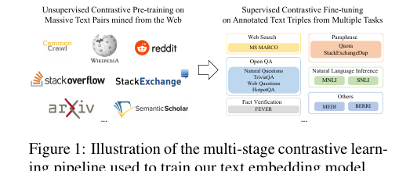

# GTE 多阶段对比学习详解（Li et al. 2023a）

> paper: [Towards General Text Embeddings with Multi-stage Contrastive Learning](https://arxiv.org/abs/2308.03281)（arXiv:2308.03281, 2023-08）
> authors: Zehan Li, Xin Zhang, Yanzhao Zhang, Dingkun Long, Pengjun Xie, Meishan Zhang（阿里巴巴）
> code / model: [thenlper/gte-large](https://huggingface.co/thenlper/gte-large) · [gte-base](https://huggingface.co/thenlper/gte-base) · [gte-small](https://huggingface.co/thenlper/gte-small)
> refs: [E5](https://arxiv.org/abs/2212.03533)（弱监督对比预训练）· [InstructOR](https://arxiv.org/abs/2212.09741)（指令嵌入）· [MTEB](https://arxiv.org/abs/2210.07316)
> 全文中译: `docs/papers/embedding/GTE_2308.03281_zh.md`
> backbone: BERT / MiniLM 编码器（30M / 110M / 330M），mean pooling，双编码器
> date: 2023-08 ; modality: 文本（英文 + 代码）; languages: 英文（本代未做多语）

> 本文聚焦 **GTE 原始论文（BERT 编码器版）的"多阶段对比学习"配方本身**——这正是 Conan-embedding v1、gte-Qwen2 等后续工作在预训练环节所"遵循 Li et al. (2023a)"的那一套。LLM 骨干化的延续见同目录 [gte-Qwen2详解.md](gte-Qwen2详解.md)。

---

## 为什么 Conan-v1 要引用它

Conan-embedding v1 在描述预训练时写道"遵循 Li et al. (2023a)，我们同样采用多阶段训练，将训练分为预训练与微调"。这句话引用的就是本文 GTE。换言之，**GTE 是"弱监督海量对预训练 → 小规模高质量三元组监督微调"这一两阶段范式在开源通用嵌入上的奠基性配方**，被 BGE、Conan、gte-Qwen 等中英文嵌入模型广泛沿用。理解 GTE，就理解了这些模型预训练一节里被一笔带过的"多阶段对比"到底是什么。

GTE 想解决的核心矛盾是：**单一嵌入模型要同时服务非对称检索（短 query → 长文档）与对称相似度（STS / 复述）**，若只用一类数据，另一类就会退化（如 SimCSE 擅长 STS 但检索弱）。GTE 的回答不是换损失，而是**用数据规模 + 数据多样性 + 分阶段课程**把两类几何一起学好。

---

## 一句话定位

**GTE 是仅用开源数据、通过多阶段对比学习训练的通用文本嵌入模型**：先在约 8 亿弱监督文本对上做无监督对比预训练，再在约 300 万带标注（含难负例）的三元组上做监督微调。凭借数据规模与多样性，110M 的 GTE_base 就超过了 OpenAI 的 text-embedding-ada 与体量大 10 倍的模型；330M 的 GTE_large 在当时 MTEB 上刷新 SOTA。

| 项 | 内容 |
| --- | --- |
| 骨干 | BERT-small(MiniLM) / base / large，即 **30M / 110M / 330M** |
| 池化 | **mean pooling**（对 token 表示取均值） |
| 相似度 | 余弦，温度 $\tau=0.01$ |
| 损失 | **改进的双向 InfoNCE**（in-batch query 与 doc 双向互为负例） |
| 预训练 | ∼**800M** 对，max len **128**，batch **>1万**，**50k** 步（约 1 epoch） |
| 微调 | ∼**3M** 三元组，max len **512**，batch **128**，group size **16** |
| 采样 | 多项式分布，指数 **α=0.5**；同 batch 同任务 |
| 数据 | **全开源、不做质量清洗/过滤**（仅精确匹配去重） |
| 亮点 | MTEB 英文 SOTA（当时）；代码检索零样本超过分语言微调基线 |

谱系位置：

```text
SimCSE / DPR（单任务、对称或非对称二选一）
  → E5（弱监督对比预训练 + 微调，但用了数据过滤）
  → GTE：全开源 + 多阶段 + 改进双向 InfoNCE + 更全数据格式   ← 本文
  → BGE / Conan-v1（沿用两阶段；Conan 换 DHNM+CBB）
  → gte-Qwen / e5-mistral（把两阶段配方接到 LLM 骨干）
```

---

## 方法总览：多阶段对比流程



**图解（论文 Figure 1）**：GTE 训练分左右两段。**左：无监督对比预训练**——从 Common Crawl、Wikipedia、Reddit、StackOverflow、StackExchange、arXiv、Semantic Scholar 等网页/社区/学术源，挖出天然成对的文本（如标题-正文、问题-回答、引文-被引），构成海量弱监督"相关对"，只学"相关 vs 随机不相关"的粗语义几何。**右：监督对比微调**——用带人工标注的多任务三元组精修：Web Search（MS MARCO）、Open QA（NQ/TriviaQA/WebQuestions/HotpotQA）、Paraphrase（Quora/StackExchangeDup）、NLI（MNLI/SNLI）、Fact Verification（FEVER），以及 MEDI/BERRI 杂项。两段用的是同一套对比损失，区别只在**数据分布与是否带难负例**——因此本质是一次"数据课程学习"，而非更换损失函数家族。

这套"先粗后精"的动机在论文的阶段消融里得到验证（见后文"多阶段为什么有效"）：只微调分数最低，只预训练已经很强，两段串起来最好。

---

## 模型与损失

### 双编码器 + mean pooling

GTE 是标准双编码器：query 与 doc 用**同一个**编码器 $E$（共享权重）分别编码，取最后一层 token 表示的均值作句向量：

$$
\mathbf{h}=\mathrm{LM}(x)\in\mathbb{R}^{n\times d},\qquad \mathbf{x}=\frac{1}{n}\sum_{i=1}^{n}\mathbf{h}_i\in\mathbb{R}^d .
$$

没有额外投影层、没有 prompt/instruction（这是 GTE 相对 InstructOR 的刻意简化，提升可复现性与易用性）。相似度用 L2 归一化后的余弦。

### 改进的双向 InfoNCE（关键工程点）

朴素 InfoNCE 只把"同 batch 其它 doc"当负例（query→doc 单向）。GTE 用一个**双向、扩池**版本：对 batch $B=\{(q_i,d_i)\}_{i=1}^n$，

$$
\mathcal{L}_{\mathrm{icl}}=-\frac{1}{n}\sum_{i=1}^{n}\log\frac{e^{s(q_i,d_i)/\tau}}{Z},
$$

$$
Z=\underbrace{\sum_{j}e^{s(q_i,d_j)/\tau}}_{q_i\to \text{所有 }d}+\underbrace{\sum_{j\neq i}e^{s(q_i,q_j)/\tau}}_{q_i\to \text{其它 }q}+\underbrace{\sum_{j}e^{s(q_j,d_i)/\tau}}_{d_i\leftarrow \text{所有 }q}+\underbrace{\sum_{j\neq i}e^{s(d_j,d_i)/\tau}}_{d_i\to \text{其它 }d}.
$$

- 前两项：以 $q_i$ 为锚，负例来自"其它 doc + 其它 query"；
- 后两项：反向，以 $d_i$ 为锚同样对比。

直觉：**同一批里的每条文本，既能当 query 又能当 doc，负例数近似翻倍**，在不增显存的前提下逼近更大负例池。$\tau$ 固定 0.01。消融（原文 Table 11）显示：改进损失在预训练与微调两阶段都稳定优于朴素 in-batch 版（PT 57.3→57.8，FT 61.8→62.4）。这与后来 Conan-v1 的 Cross-GPU Batch Balance、E5 的大 batch 思路同源——**对比学习吃负例数量**。

### 两阶段的 batch 哲学差异

- **预训练（只有 in-batch 负例）**：负例质量弱，只能靠**数量**补，所以 max len 压到 128、用 fp16+ZeRO+梯度检查点把 batch 撑到**上万**，跑 50k 步 ≈ 1 epoch。
- **微调（有难负例）**：难负例已提供可靠梯度，不必大 batch，于是 batch 128、group size 16（1 正 + 15 难/随机负），max len 提到 512 处理长文本，学习率降十倍，只训 1 epoch。

---

## 数据：规模、多样性与"不清洗"

GTE 的性能主要来自数据侧的两个决定：

**1）预训练 ∼800M 对，覆盖 8 大类格式**（原文 Table 1）：社交媒体 41.5%、网页 18.7%、超链接 13.4%、其它 11.6%、学术 5.7%、知识库 4.8%、代码 2.5%、社区 QA 1.5%、新闻 0.4%。天然配对方式包括：网页(标题,正文)、论文(标题,摘要)、超链接(引文,被引)、社交(帖子,评论)、知识库(实体,描述)、QA(问题,答案)、代码(文本,代码)。**超链接对**尤其硬——常涉及多跳推理。

**2）刻意"不做质量过滤"**：这是 GTE 与 E5 最显眼的分歧。E5 对弱监督对做了一致性过滤/清洗；GTE **只用开源数据、只做文本对精确匹配去重，不做任何质量清洗**（论文 Related Work 与附录 A.3 明确声明）。作者认为在这种规模下，模型能从噪声里学到泛化，且省掉过滤的人力与不可复现性。

> 对照记忆点：**GTE = 大规模 + 不清洗**；而 Conan-v1 预训练相反——它遵循 GTE 的"多阶段"骨架，却在数据侧改用 **Cai et al. (InternLM2) 的清洗流程 + bge 打分丢弃 <0.4**（见 [InternLM2数据处理与过滤详解.md](InternLM2数据处理与过滤详解.md)）。也就是说 Conan 借了 GTE 的**训练课表**，但把 GTE 明确放弃的**数据过滤**又加了回来。这是两篇被引论文在 Conan 预训练里各自扮演的角色。

**微调 ∼3M 三元组**：MS MARCO（二阶段检索器挖难负例）、NQ（coCondenser）、NLI（SimCSE 的 MNLI+SNLI，蕴含为正/矛盾为负）、FEVER、Quora，以及 MEDI/BERRI（丢掉指令只留三元组）。为防灾难性遗忘，微调时还掺入子采样的预训练数据。

---

## 训练技巧：多项式采样与"同 batch 同任务"

不同数据源规模差异极大（社交媒体 3.27 亿 vs 新闻 300 万）。若按真实比例采样，小源几乎学不到；若均匀采样，又浪费大源。GTE 用**多项式分布 + 指数 α 平滑**：

$$
p_i=\frac{n_i^{\alpha}}{\sum_j n_j^{\alpha}},\qquad \alpha=0.5 .
$$

α=0 退化为各源均匀，α=1 为按真实规模。消融（原文 Table 10）显示 **α=0.5 在检索、STS、MTEB 平均上都最优**（均匀 α=0 检索仅 36.7，α=0.5 达 44.2 且 STS 76.5）。此外，**同一 batch 内所有样本来自同一任务**，避免模型学到"靠任务类型区分"的判别捷径。

---

## 缩放分析：数据源数、batch、参数量

论文用三组消融回答"扩什么最值"：

- **数据源数量**：从 5 个最大源 → 15 个 → 全部 33 个，预训练与微调性能都**单调上升**。多样性本身就是收益来源。
- **预训练 batch size**：按 2 倍递增，性能在**约 1 万时饱和**，再大无增益——印证"改进双向损失 + 上万 batch"已接近负例收益上限。
- **模型参数量**：30M→110M→330M，参数指数增长时性能**近似线性提升**；训练损失也随规模更低（大模型更会区分正负）。
- **训练步**：MTEB 在约 20k 步基本饱和（50k 步收益已很小）。

---

## 实验结论（要点）

- **无监督检索（BEIR，15 集，nDCG@10）**：GTE_base 平均 44.2，超同规模 SimCSE(20.3)/Contriever(36.0)/E5_base(42.9)，逼近 E5_large(44.2)——**没用任何标注就追平大一号的监督前工作**。
- **MTEB 英文（56 集）**：
  - 无监督设置：GTE_small/base/large = 58.5/59.0/59.3，全面超 E5 同规模，并逼近 GTR/Sentence-T5 等监督大模型；
  - 监督设置：GTE_base 62.4 > OpenAI ada-002(61.0)、E5_base(60.4)；GTE_large **63.1** 刷新当时 SOTA，比 InstructOR_large 高 1.5，且**超过 1.5B–4.5B 的 InstructOR_xl / GTR_xxl / Sentence-T5_xxl**。
  - GTE_small(30M) 61.4 ≈ E5_large(330M)，**体量小 10 倍**。
- **代码检索（CodeSearchNet，挑战设置）**：GTE_base 平均 **83.2**，超过为**每种语言单独微调**的 CodeRetriever(77.4)/UniXcoder(74.4)；Python 高达 95.9。说明"把代码当文本 + 大规模多源预训练"就能获得强代码表示，无需注入代码结构先验。

---

## 多阶段为什么有效（阶段消融）

原文 Table 9 是全文最该记住的一张表：

| 设置 | 仅预训练 PT | 仅微调 FT | 两段串联 Full |
| --- | --- | --- | --- |
| MTEB | 59.0 | 57.8 | **62.4** |

- **仅微调最差**：监督数据规模有限，撑不起通用嵌入；
- **仅预训练已很强**：网页级弱监督对 > 仅靠标注微调；
- **两段串联最好**：无监督预训练把 MLM 空间"掰"到适合对比表示，监督微调再精修任务几何。

这条结论正是 Conan-v1、BGE 等"先弱监督后监督"两阶段设计的直接依据。

---

## 局限（作者自述）

- **长度 512、无多语**：源自 BERT 初始化；更长文本需截断/切分。后续 gte-Qwen 用 LLM 骨干 + 32K 解决。
- **数据污染**：只做精确匹配去重（过严），网络大规模预训练的污染难以量化——这也是它与"重清洗"路线（InternLM2/Conan）的取舍点。
- **非因果架构**：作者展望把该配方迁到因果/前缀 LM，联合优化生成与检索（后被 gte-Qwen、GritLM 等验证）。

---

## 对本仓库的可迁移实践

1. **两阶段是默认起点**：弱监督海量对预训练（大 batch、in-batch 双向负例）→ 高质量三元组 + 难负例微调（小 batch、group 16）。cloud_emb 若从零训嵌入应照此分段。
2. **改进双向 InfoNCE**：实现时把 batch 内 query 与 doc 都纳入负例，几乎零成本近似翻倍负例数；配合大 batch 收益明显，但注意约 1 万饱和。
3. **多源采样 α=0.5**：数据源规模悬殊时，用 $n_i^{0.5}$ 平滑；且强制同 batch 同任务。
4. **数据"清洗 vs 规模"是可调的产品决策**：GTE 证明"大而不洗"能work；Conan/InternLM 证明"洗过更稳"。落地时按语料噪声水平选择——干净来源可少洗，Common Crawl 类必洗。
5. **代码当文本**：无需专门代码结构建模，多源文本对预训练即可迁移到代码检索。

---

## 同目录对照

| 文档 | 关系 |
| --- | --- |
| [gte-Qwen2详解.md](gte-Qwen2详解.md) | 同一 GTE 配方接到 Qwen2 LLM 骨干（双向注意力 + query 指令 + last-token） |
| [E5详解.md](E5详解.md) | 弱监督对比预训练的前驱；GTE 相对它去掉了数据过滤 |
| [Conan-embedding详解.md](Conan-embedding详解.md) | "遵循 Li et al. (2023a)"的两阶段引用来源；换 DHNM+CBB |
| [InternLM2数据处理与过滤详解.md](InternLM2数据处理与过滤详解.md) | Conan 预训练数据侧引用的另一半（清洗流程） |
| [难负例挖掘工业实践.md](难负例挖掘工业实践.md) | GTE 微调的难负例挖掘在工业菜单中的位置 |

---

## 参考文献

1. Li et al. (2023). Towards General Text Embeddings with Multi-stage Contrastive Learning. [arXiv:2308.03281](https://arxiv.org/abs/2308.03281)
2. Wang et al. (2022). Text Embeddings by Weakly-Supervised Contrastive Pre-training (E5). [arXiv:2212.03533](https://arxiv.org/abs/2212.03533)
3. Su et al. (2022). One Embedder, Any Task (InstructOR). [arXiv:2212.09741](https://arxiv.org/abs/2212.09741)
4. Muennighoff et al. (2022). MTEB: Massive Text Embedding Benchmark. [arXiv:2210.07316](https://arxiv.org/abs/2210.07316)
5. Thakur et al. (2021). BEIR. [arXiv:2104.08663](https://arxiv.org/abs/2104.08663)
