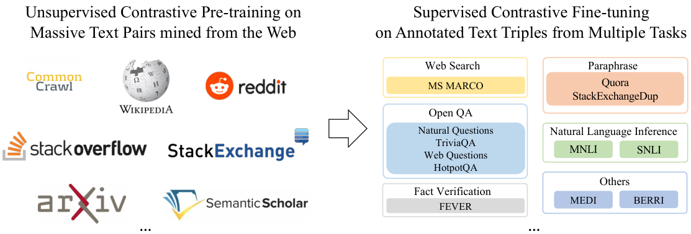
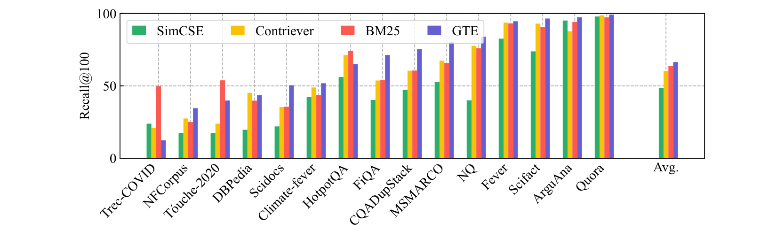
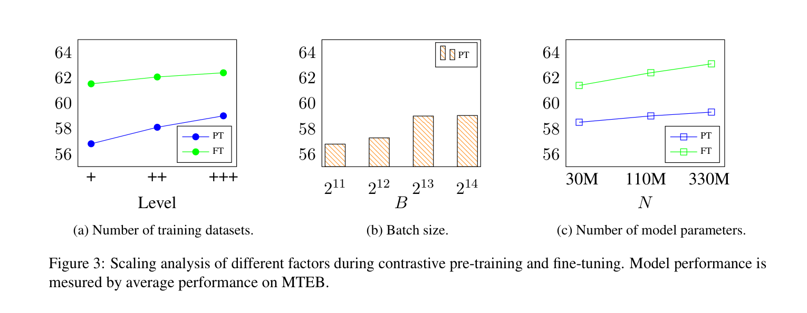
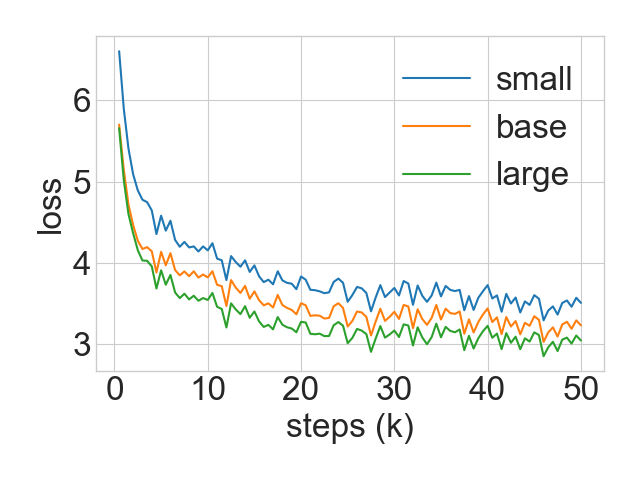
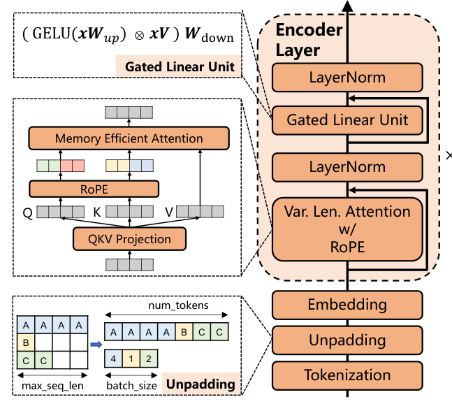
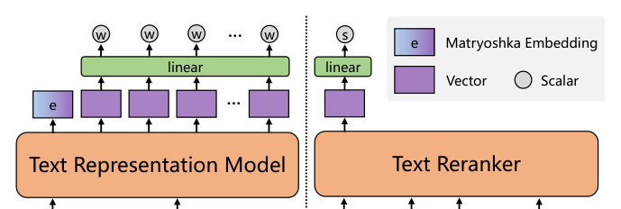
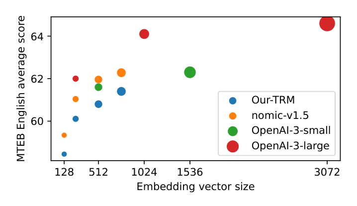
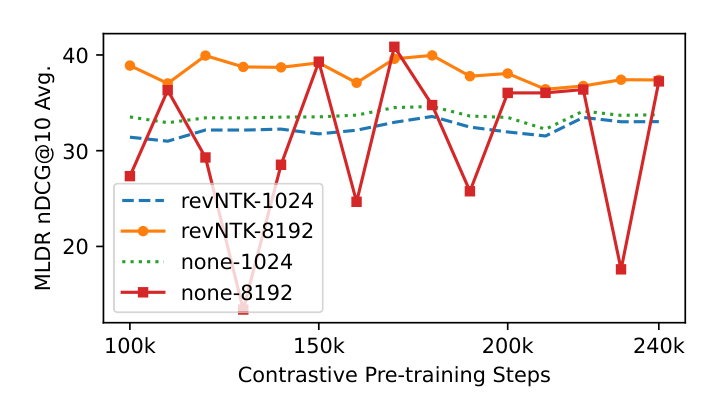

# GTE 系列详解：从 BERT 编码器到 gte-v1.5 再到 Qwen2

> paper: [Towards General Text Embeddings with Multi-stage Contrastive Learning](https://arxiv.org/abs/2308.03281)（GTE, 2023-08）· [mGTE: Generalized Long-Context Text Representation and Reranking Models for Multilingual Text Retrieval](https://arxiv.org/abs/2407.19669)（gte-v1.5 / mGTE, 2024-07）
> code / model: [thenlper/gte-large](https://huggingface.co/thenlper/gte-large) · [Alibaba-NLP/gte-large-en-v1.5](https://huggingface.co/Alibaba-NLP/gte-large-en-v1.5) · [Alibaba-NLP/gte-multilingual-base](https://huggingface.co/Alibaba-NLP/gte-multilingual-base) · [Alibaba-NLP/gte-Qwen2-7B-instruct](https://huggingface.co/Alibaba-NLP/gte-Qwen2-7B-instruct)
> refs: [E5](https://arxiv.org/abs/2212.03533) · [INSTRUCTOR](https://arxiv.org/abs/2212.09741) · [BGE-M3](https://arxiv.org/abs/2402.03216) · [E5-Mistral](https://arxiv.org/abs/2401.00368) · [Nomic Embed](https://arxiv.org/abs/2402.01613)
> backbone: BERT（GTE）→ Transformer++ BERT+RoPE+GLU（gte-v1.5 / mGTE）→ Qwen2 Decoder（gte-Qwen2）
> date: 2023-08 / 2024-06–07 ; modality: 文本 ; languages: 英（GTE）→ 英+75 语（mGTE）→ 中英多语（gte-Qwen2）

> 本文把阿里 GTE 家族三代写进同一篇：**GTE（BERT 多阶段对比）→ gte-v1.5 / mGTE（原生 8K 编码器 + 稀疏/稠密混合）→ gte-Qwen2（Qwen2 双向 LLM 嵌入）**。文末有演变对照。

---

## 系列定位

GTE 想解决的矛盾始终没变：**一个向量同时服务非对称检索、对称 STS、分类/聚类**。三代换的是骨干、上下文、语言覆盖和检索形态，不是换损失家族——主损失一直是 **InfoNCE 对比学习**。

| 代 | 产品名 | 论文 | 骨干 | 上下文 | 池化 | 语言 |
| --- | --- | --- | --- | --- | --- | --- |
| 1 | `thenlper/gte-{small,base,large}` | [2308.03281](https://arxiv.org/abs/2308.03281) | BERT / MiniLM | 512 | mean | 英 + 代码当文本 |
| 2 | `gte-*-en-v1.5` / `gte-multilingual-*` | [2407.19669](https://arxiv.org/abs/2407.19669) | Transformer++（RoPE+GLU+unpadding） | **8192** | [CLS] + 稀疏权重 | 英 / **75 语** |
| 3 | `gte-Qwen2-{1.5B,7B}-instruct` | 无独立论文（方法沿用 GTE + HF 卡） | **Qwen2 Decoder** | **32K** | last-token | 中英多语 |

产品时间线上还有 `gte-Qwen1.5-7B-instruct`（MTEB ≈67.3 / C-MTEB ≈69.5），是 LLM 线的过渡卡，不是 encoder 的 v1.5。用户口中的 **gte-1.5** 指的是 **gte-*-en-v1.5 / mGTE 这篇 2407.19669**。

谱系：

```text
SimCSE / DPR（单任务）
  → E5（弱监督对比 + 数据过滤）
  → GTE（全开源、不清洗、双向 InfoNCE、两阶段）     ← 第一代
  → mGTE / gte-v1.5（从零训 8K 编码器 + 稠密/稀疏/MRL + reranker） ← 第二代
  → gte-Qwen2（同一对比课表接到 Qwen2 + 双向注意力 + query 指令） ← 第三代
  → Qwen3-Embedding / Conan-v2 / QZhou（后继）
```

---

## GTE（2023）：多阶段对比学习

### 一句话

**仅用开源数据、通过两阶段对比学习训练通用文本嵌入**：先在约 **8 亿**弱监督文本对上预训练，再在约 **300 万**带难负例的三元组上微调。110M 的 GTE_base 超过当时 OpenAI `text-embedding-ada-002`；330M 的 GTE_large 在当时英文 MTEB 刷新 SOTA。

| 项 | 内容 |
| --- | --- |
| 骨干 | BERT-small / base / large（**30M / 110M / 330M**） |
| 池化 | **mean pooling** |
| 相似度 | 余弦，$\tau=0.01$ |
| 损失 | **改进双向 InfoNCE**（query 与 doc 互为负例） |
| 预训练 | ∼800M 对，max len **128**，batch **>1 万**，50k 步 |
| 微调 | ∼3M 三元组，max len **512**，batch 128，group size 16 |
| 数据政策 | **全开源、不做质量清洗**（仅精确匹配去重） |

### 方法总览



**图解（论文 Figure 1）**：左是无监督对比预训练——从 Common Crawl、Wikipedia、Reddit、StackOverflow、StackExchange、arXiv、Semantic Scholar 等挖天然成对文本（标题–正文、问题–回答、引文–被引）。右是监督对比微调——Web Search（MS MARCO）、Open QA（NQ / TriviaQA / WebQuestions / HotpotQA）、Paraphrase（Quora / StackExchangeDup）、NLI（MNLI / SNLI）、Fact Verification（FEVER），以及 MEDI / BERRI。两段同一套对比损失，差别只在**数据分布与是否带难负例**。

这就是后来 Conan-v1、BGE、gte-Qwen 预训练一节里「遵循 Li et al. (2023a)」的那张课表。

### 模型与损失

双编码器共享权重，最后一层 token 均值作句向量，没有投影层、没有任务 prompt（相对 INSTRUCTOR 的刻意简化）：

$$
\mathbf{h}=\mathrm{LM}(x)\in\mathbb{R}^{n\times d},\qquad \mathbf{x}=\frac{1}{n}\sum_{i=1}^{n}\mathbf{h}_i .
$$

朴素 InfoNCE 只把「同 batch 其它 doc」当负例。GTE 把 query 与 doc **双向扩池**：

$$
Z=\sum_{j}e^{s(q_i,d_j)/\tau}+\sum_{j\neq i}e^{s(q_i,q_j)/\tau}+\sum_{j}e^{s(q_j,d_i)/\tau}+\sum_{j\neq i}e^{s(d_j,d_i)/\tau}.
$$

同一批里每条文本既能当 query 也能当 doc，负例数近似翻倍。消融：改进损失在预训练与微调都优于朴素 in-batch（PT 57.3→57.8，FT 61.8→62.4）。

两阶段的 batch 哲学相反：预训练没有难负例，靠 **上万 batch + 短序列 128** 堆负例数；微调有难负例，batch 降到 128、长度提到 512。

### 训练数据

预训练覆盖 8 大类格式（原文 Table 1）：社交媒体 41.5%、网页 18.7%、超链接 13.4%、其它 11.6%、学术 5.7%、知识库 4.8%、代码 2.5%、社区 QA 1.5%、新闻 0.4%。**超链接对**常涉及多跳，是检索几何的硬样本。

与 E5 的显眼分歧：**GTE 不做弱监督对的质量过滤**，只做精确匹配去重。作者认为这个规模下模型能从噪声里学泛化，也省掉不可复现的清洗。Conan-v1 借了 GTE 的课表，却把 InternLM2 清洗 + bge 打分过滤加了回来——训练骨架同源，数据政策相反。

微调 ∼3M：MS MARCO（检索器挖难负）、NQ（coCondenser）、NLI（SimCSE 的 MNLI+SNLI）、FEVER、Quora、MEDI/BERRI（丢掉指令只留三元组）。为防遗忘，微调还掺入子采样的预训练数据。

多源规模悬殊，用多项式平滑 $\alpha=0.5$：$p_i \propto n_i^{0.5}$。**同一 batch 只来自同一任务**，避免「靠任务类型作弊」。

### 关键数据集简介

- **MS MARCO**：Bing 搜索点击日志构造的段落排序集；GTE 微调的检索主食，难负例来自二阶段检索器。
- **NQ / TriviaQA / HotpotQA / WebQuestions**：开放域 QA。NQ 问句对维基段落；HotpotQA 多跳，逼表示跨段对齐。
- **MNLI / SNLI**：自然语言推理。蕴含当正、矛盾当负——对称 STS 几何的来源。
- **FEVER**：事实验证；claim–evidence 对，介于检索与 NLI 之间。
- **Quora / StackExchangeDup**：复述 / 重复问题，对称匹配。
- **MEDI / BERRI**：多任务指令嵌入语料；GTE **丢掉指令文本**，只留三元组。
- **CodeSearchNet**：代码检索评测，不是主训练集。GTE 把代码当普通文本，仍超过分语言微调的同规模代码检索器。

### 评测与对比

无监督 BEIR（15 集 nDCG@10）：GTE_base 平均 44.2，超同规模 SimCSE(20.3) / Contriever(36.0) / E5_base(42.9)，逼近 E5_large(44.2)——**没用标注就追平大一号的监督前工作**。



**图解（论文 Figure 2）**：无监督 Recall@100。紫条 GTE 在多数集上最高，平均约 65–67；BM25 在 TREC-COVID / Touche-2020 / HotpotQA 仍能赢，说明词法匹配没死；SimCSE 全面落后——对称 STS 训练迁不到非对称检索。

监督英文 MTEB（56 集）：GTE_base 62.4 > OpenAI ada-002(61.0)、E5_base(60.4)；GTE_large **63.1** 超过 1.5B–4.5B 的 InstructOR_xl / GTR_xxl / Sentence-T5_xxl。GTE_small(30M) 61.4 ≈ E5_large(330M)。

代码检索 CodeSearchNet 挑战设置：GTE_base 平均 **83.2**，超 CodeRetriever(77.4) / UniXcoder(74.4)。

### 缩放与多阶段为什么有效



**图解（论文 Figure 3）**：MTEB 均分随 (a) 数据源数量、(b) 预训练 batch、(c) 参数量变化。数据源从 5→15→33 单调上升；batch 约 $2^{13}$（8192）饱和；30M→110M→330M 近似线性。结论：**扩数据多样性与参数，比盲目再加大 batch 更值。**



**图解（论文 Figure 4）**：small / base / large 预训练损失。更大模型损失更低、更会区分正负；曲线有小幅抖动，对应各 batch 难度不均。性能约 20k 步饱和。

阶段消融（原文 Table 9）是全文最该记住的一张表：

| 设置 | 仅预训练 | 仅微调 | 两段串联 |
| --- | --- | --- | --- |
| MTEB | 59.0 | 57.8 | **62.4** |

仅微调最差（标注规模不够撑通用嵌入）；仅预训练已经很强；两段串联最好。这就是「先弱监督后监督」成为默认起点的实验依据。

### 本代局限

长度 512、无多语、非因果架构。作者自己写了后续要把配方迁到因果/前缀 LM——这正是 gte-Qwen 与 GritLM 后来做的事。

---

## mGTE / gte-v1.5（2024）：原生 8K 多语编码器

HF 上的 **gte-large-en-v1.5 / gte-base-en-v1.5** 与 **gte-multilingual-base** 都指向这篇 [mGTE](https://arxiv.org/abs/2407.19669)（Zhang et al., 2024-07）。英文卡是同一套 Transformer++ 配方的英语言线；论文主体是从零训的 **多语 8K 编码器 + 混合检索 TRM + cross-encoder reranker**。

相对第一代 GTE，这一代要补的短板是：**512 太短、没有多语、只有稠密单向量、没有配套 reranker**。作者没有走「把 XLM-R 位置编码续训到 8K」（BGE-M3 路线），而是 **从随机初始化训出原生 8192 上下文的编码器**。

### 一句话

先用两段 MLM 课表（2048→8192）从零训一个 RoPE+GLU+unpadding 的 base 编码器，再在其上做对比预训练/微调，得到能同时吐 **Matryoshka 稠密向量 + 神经稀疏权重** 的 TRM，以及一个 cross-encoder reranker。304M 的 mGTE 在常规多语检索上贴着更大的 BGE-M3，在 **MLDR / LoCo 长文检索上更好**，编码速度可高一个数量级。

### 训练流水线


**图解（论文 Figure 1）**：Random Encoder → MLM-2048 文本编码器 → MLM-8192 文本编码器；再分叉成 **8K reranker**、以及经 1K 对比预训练得到的 embedder，再微调成 **8K TRM**。编码器是公共祖先；检索器与 reranker 是下游头。

### Encoder：Transformer++

相对 BERT / XLM-R 的改动：

- 绝对位置 → **RoPE**（base 先 10k 再 160k）
- FFN → **GLU**（GELU 门控）
- 注意力 dropout 去掉，以兼容 FlashAttention
- embedding 词表 pad 到 64 的倍数
- **Unpadding**：把 padding 抠掉，用 xFormers 变长注意力，MLM 标签同样 unpad

词表沿用 XLM-R。MLM 概率 30%，去掉 NSP。语言采样 $\alpha=0.5$。



**图解（论文 Figure 2）**：右侧是 Tokenization → Unpadding → Embedding → $N$ 层 Encoder。左侧三块分别是 unpadding 如何把变长 batch 拼成连续 token 流、RoPE + memory-efficient attention、以及 $\mathrm{GELU}(xW_\mathrm{up})\otimes xV$ 再 $W_\mathrm{down}$ 的 GLU。这三件套就是「gte-v1.5 相对原版 GTE 的架构跃迁」。

MLM 数据约 **1028B token / 75 语**（XLM-R tokenizer）：C4、Skypile、mC4（不含英）、CulturaX、Wikipedia、自有书籍。英语约 187B token，西/法/日/俄/中也是大头。

课表：

| 阶段 | 最大长度 | RoPE base | batch | 步数 | 峰值 lr | 耗时（32×A100） |
| --- | --- | --- | --- | --- | --- | --- |
| MLM-2048 | 2048 | 10,000 | 8192 | 250k（约 0.6 epoch） | 5e-4 | 10.75 天 |
| MLM-8192 | 8192 | 160,000 | 2048 | 30k | 5e-5 | 20.5 小时 |

编码器 **304M**（12 层 × 768）。NLU：XTREME-R 零样本跨语均分 mGTE-MLM-2048 **65.24** vs XLM-R-base 62.02（+3.22）；GLUE 83.4 vs XLM-R 80.4，低于英文 RoBERTa-base 的 86.4——多语税。

### TRM：稠密 + 稀疏 + MRL



**图解（论文 Figure 3）**：左是 Text Representation Model——[CLS] 作 Matryoshka 稠密向量 $e$，各 token 隐状态经线性层得到稀疏权重 $w$（同 token 取 max）；右是 Text Reranker——`[CLS] q [SEP] d` 后线性打标量 $s$。第一代 GTE 只有左边的稠密一半，且用 mean pooling；这里改 [CLS]，并补上稀疏与 rerank。

对比损失仍是 InfoNCE。对比预训练：batch **16384**，只 in-batch 负例，$\tau=0.01$，query 截断 512 / doc 1024，**把 RoPE base 从 160k 反标到 20k（revNTK）**，用 1K 训练换 8K 检索能力。数据约 **29.4 亿对**（去重过滤后）：英文弱对、中文弱对、cc-news 多语、xp3x 跨语指令、NLLB 翻译对。

微调目标：

$$
\mathcal{L}_{\mathrm{TRM}}=\lambda\mathcal{L}_{\mathrm{sparse}}+\sum_{d\in D}w_d\,\mathcal{L}_{:d},
$$

$D=\{32,64,\ldots,H\}$ 为 MRL 切维集合。微调数据：英文 1.4M（MS MARCO / NQ / TriviaQA / HotpotQA / SQuAD / FEVER / AllNLI）、中文 2.0M（DuReader / mMARCO-zh / T2-Ranking / CmedQA / SimCLUE / Multi-CPR）、多语 118.9K（MIRACL / Mr.TyDi / MLDR）。每 query 1 正 + 8 难负；动态 batch + 梯度检查点吃 8192。

稀疏侧：$w_t=\mathrm{ReLU}(W h_t)$，分数 $s_{\mathrm{sparse}}=\sum_{t\in q\cap d} w^q_t w^d_t$。这是从 BGE-M3 借来的：长文里稠密向量容易被稀释，稀疏词权重把关键词留住。

Reranker 不再做对比预训练（作者发现无增益），直接在编码器上 InfoNCE；每 query 6 难负 + 4 随机负。

### 评测与对比

多语 MTEB（论文 Table 3，稠密）：

| 模型 | 上下文 | en | zh | fr | pl |
| --- | --- | --- | --- | --- | --- |
| BGE-M3 Dense | 8192 | 59.84 | 60.80 | 58.79 | 60.35 |
| mE5-large | 514 | 61.50 | 58.81 | 56.07 | 60.08 |
| **mGTE-TRM Dense** | 8192 | **61.40** | **62.72** | **59.79** | 58.22 |
| E5-mistral-7b | 32K | 66.63 | 60.81 | 48.33 | — |

中法领先同档 Encoder；英文贴 mE5-large，低于 7B LLM。对比预训练后的 mGTE-CPT 已经全面超过 BGE-M3-unsupervised。

检索（Table 4，nDCG@10 / MKQA recall@20）：

| 模型 | 参数 | Avg | MLDR | MIRACL | MKQA | BEIR | LoCo |
| --- | --- | --- | --- | --- | --- | --- | --- |
| BGE-M3 Dense+Sparse | 568M | 67.7 | 64.8 | **68.9** | **68.1** | 49.4 | 87.4 |
| **mGTE-TRM D+S** | **304M** | **68.9** | **71.3** | 64.5 | 66.0 | **51.4** | **91.3** |
| E5-mistral-7b | 7B | 62.4 | 42.6 | 62.2 | 62.4 | 56.9 | 87.8 |

读法：**短多语检索（MIRACL）BGE-M3 仍略强；长文（MLDR / LoCo）mGTE 明显更好**，且参数几乎减半。稀疏单独在 MLDR 上 71.0，说明长文里词法通道非常关键。

Reranker 叠在自家稠密召回之上：mGTE-reranker 均分 67.4，超过更大的 bge-reranker-v2-m3（65.7），MLDR 78.7 vs 66.8。



**图解（论文 Figure 4）**：MTEB 英文 vs 切维。mGTE-TRM 从 128 维到满维平滑上升，贴近同档英文 nomic-v1.5，仍低于 OpenAI-3-large。多语 304M 能接近英文专用 nomic，已经是这一代的卖点：索引可以按存储预算切维，不必为每种维度训一个模型。



**图解（论文 Figure 5）**：对比预训练步数 vs MLDR。`revNTK-8192` 稳定在高位；**不用 NTK、直接 8K 训会周期性崩到 10 多分**。短上下文 1024 很稳但天花板低。revNTK 是这一代能「用 1K 训练换 8K 推理」的关键技巧。

效率（MLDR-hi，A100 FP16）：BGE-M3 + SDPA 744s vs mGTE + xFormers unpadding **52s**（约 **14×**）。unpadding 相对 padded SDPA 再快约 5×。这是工业侧选 mGTE 而不是「再大一点的 XLM-R」的理由。

### 本代相对 GTE 改了什么

| 维度 | GTE 2023 | mGTE / v1.5 |
| --- | --- | --- |
| 初始化 | 现成 BERT | **从零 MLM** |
| 位置 | 绝对位置 512 | **RoPE 原生 8192** |
| 池化 | mean | **[CLS] + 稀疏 $w_t$** |
| 语言 | 英 | **75 语** |
| 检索形态 | 仅稠密 | 稠密 + 稀疏 + MRL + reranker |
| 数据政策 | 弱监督不清洗 | MLM 过滤；对比阶段去重+低质过滤 |
| 指令 | 无 | 仍基本无 query-instruct（留给下一代） |

---

## gte-Qwen2（2024）：Qwen2 LLM 骨干

没有单独的方法论文。公开叙述是：**把 GTE 多阶段 InfoNCE 接到 Qwen2 Decoder 上**，再加三项嵌入归纳偏置。模型卡：[`gte-Qwen2-7B-instruct`](https://huggingface.co/Alibaba-NLP/gte-Qwen2-7B-instruct) / [`1.5B`](https://huggingface.co/Alibaba-NLP/gte-Qwen2-1.5B-instruct)，约 2024-06。前序产品 `gte-Qwen1.5-7B-instruct` 已证明这条 LLM 线，Qwen2 换底座后英文/中文都再跳一截。

| 项 | gte-Qwen2-7B-instruct | gte-Qwen2-1.5B-instruct |
| --- | --- | --- |
| 骨干 | Qwen2-7B（28 层，GQA / SwiGLU / RoPE） | Qwen2-1.5B |
| 输出维 | **3584** | **1536** |
| 上下文 | **32,000** | 32,000 |
| 注意力 | **训练/推理去掉因果掩码，改双向** | 同左 |
| 指令 | **仅 query 侧** | 同左 |
| 池化 | **last-token** | last-token |
| 许可 | Apache-2.0 | Apache-2.0 |
| 卡称 MTEB / C-MTEB（约 2024-06） | **~70.24 / ~72.05** | ~67.16 / ~67.65 |

### 三项改造

Decoder 默认因果掩码让位置 $i$ 看不见右边。嵌入需要整句上下文，所以推理和对比训练都改成双向：

$$
\mathcal{M}_{ij}^{\mathrm{bi}}=1\quad\forall\,i,j.
$$

这与 LLM2Vec「先改双向再对比」同族，但 gte-Qwen2 是 **训练期直接双向**，不是无监督 MNTP 两步走。

Query 侧拼自然语言任务指令（与 E5-Mistral / INSTRUCTOR 同源），文档侧通常不加，以免建库成本翻倍：

```text
Instruct: Given a web search query, retrieve relevant passages that answer the query
Query: {user_query}
```

池化改 last-token：双向之后最后一个位置能看见全句，维数直接等于 hidden size（7B → 3584）。第一代的 mean pooling、第二代的 [CLS] 在这里都不合适——Decoder 没有 BERT 式 [CLS]。

多阶段仍然是：弱监督大 batch InfoNCE → 监督 + 难负例 → instruct 对齐。骨干语言能力来自 Qwen2 预训练，嵌入能力来自对比阶段；公开叙述不以 next-token CE 为主损失（那是 GritLM 的 Gen/Emb 双任务）。

### 评测与对比

相对 encoder 代：英文 MTEB 从 GTE-large 63.1 / mGTE 61.4 跳到 **~70.2**；中文 C-MTEB **~72.05** 是 2024 开源中文嵌入的第一档。相对 **e5-mistral-7b-instruct**：

| 维度 | e5-mistral-7b-instruct | gte-Qwen2-7B-instruct |
| --- | --- | --- |
| 底座 | Mistral-7B | **Qwen2-7B** |
| 注意力 | 实现上常保留/部分改 | **明确双向** |
| 维数 | 4096 | **3584** |
| 中文 | 中等 | **明显更强** |
| 同期 MTEB EN | ~66.6 | **~70.2** |

选型：偏英文、已有 Mistral 生态 → E5-Mistral 系；要 **中英双强 + 32K + Apache** → gte-Qwen2；要更小更快 → 1.5B 或回头用 mGTE encoder。

部署注意：必须用官方任务指令表；检索/STS 用 L2 + 点积；7B 建库贵、3584-d 索引大约是 768-d 的 4–5 倍内存；32K 注意力 $O(L^2)$，真实长文档仍建议分块。评测时核对英文 v1 任务集、截断长度、指令表、是否归一化——否则「同模型不同分」。

### 本代相对 v1.5 改了什么

Encoder 线（v1.5）把 **效率、8K、多语、稀疏+MRL** 做到 304M 可自托管。LLM 线用两个数量级的参数换 **世界知识、中文、32K、指令跟随**。二者不是替代关系：工业检索第一阶段仍常跑 mGTE / gte-en-v1.5；要榜单与中文 RAG 质量再上 gte-Qwen2。

---

## 版本演变总结

把三代叠在一张表里，看「每代到底加了什么、放弃了什么」。

| 维度 | GTE（2023） | gte-v1.5 / mGTE（2024） | gte-Qwen2（2024） |
| --- | --- | --- | --- |
| 要解决的新问题 | 通用嵌入：检索 vs STS 冲突 | 512 太短、无多语、无稀疏/rerank | Encoder 世界知识与中文不够 |
| 骨干 | 现成 BERT | **从零 Transformer++** | **现成 Qwen2 Decoder** |
| 参数 | 30 / 110 / 330M | **304M**（多语 base） | 1.5B / **7B** |
| 上下文 | 512 | **8192 原生** | **32K** |
| 位置编码 | 绝对位置 | **RoPE + revNTK** | Qwen2 RoPE |
| 池化 | mean | [CLS] + 稀疏 $w_t$ | **last-token** |
| 注意力 | 双向 Encoder | 双向 + unpadding | **去掉因果，强制双向** |
| 损失骨架 | 双向 InfoNCE 两阶段 | 同左 + MRL + 稀疏 InfoNCE | 同左 + query-instruct |
| 弱监督数据 | ~800M 英对，**不清洗** | ~29 亿多语对，**过滤低质** | 多语/中英，配方未完全公开 |
| 监督数据 | ~3M 英三元组 | 英 1.4M + 中 2.0M + 多语 119K | 多任务 + 指令 |
| 检索形态 | 单向量稠密 | **稠密 + 稀疏 + reranker + MRL** | 单向量稠密（高维） |
| 指令 | 无 | 基本无 | **query-side instruct** |
| 代表分数 | MTEB-en 63.1（large） | 多语检索均分 68.9；zh MTEB 62.7 | MTEB-en ~70.2；C-MTEB ~72.1 |
| 工业位置 | 英文小模型基线 | **自托管长文/多语第一阶段** | **中英质量上限 / 教师模型** |

三条不变的设计原则：

1. **多阶段对比是骨架**——弱监督把 MLM/LM 空间掰到「相关 vs 不相关」，监督三元组再修任务几何。只微调或只预训练都更差。
2. **负例数量与质量分阶段互补**——预训练靠大 batch / in-batch（以及后来的双向扩池）；微调靠难负例，不必再堆上万 batch。
3. **骨干决定天花板，数据与指令决定任务几何**——BERT 撑不起 8K 和多语，所以 v1.5 从零训编码器；Encoder 撑不起中文世界知识，所以 Qwen2 上场。指令则是 LLM 代才真正成为一等公民。

落地时的代际选择：

- 英文、512 够用、要小模型 → 原版 GTE / 同档 E5 / BGE。
- 要 8K、多语、自托管、还想稀疏+切维 → **mGTE / gte-*-en-v1.5**，必要时叠自家 reranker。
- 要中英 RAG 质量、32K、能养 7B → **gte-Qwen2**；建库贵就用 1.5B，或拿它当教师蒸到 mGTE 体量（Jasper / Conan 路线）。

不要把「gte-1.5」理解成 Qwen2-1.5B：前者是 **encoder v1.5（8K Transformer++）**，后者是 **LLM 线的小卡**。中间那篇论文就是 mGTE。

### 同目录对照

| 文档 | 关系 |
| --- | --- |
| [E5详解.md](E5详解.md) | 弱监督对比前驱；GTE 相对它去掉过滤，mGTE 又把过滤加回多语数据 |
| [BGE-M3三功能统一详解报告.md](BGE-M3三功能统一详解报告.md) | mGTE 的直接对照：续训 XLM-R vs 从零 8K；稠密+稀疏同源 |
| [Nomic-Embed详解.md](Nomic-Embed详解.md) | 英文从零 8K RoPE 编码器；mGTE Figure 4 的对照曲线 |
| [LLM2Vec详解.md](LLM2Vec详解.md) | Decoder 改双向的无监督配方；gte-Qwen2 是大数据有监督版 |
| [Conan-embedding详解.md](Conan-embedding详解.md) | 「遵循 Li et al. (2023a)」的两阶段引用来源 |
| [QZhou-Embedding详解.md](QZhou-Embedding详解.md) | 双向 Qwen2.5 + 合成数据，GTE-Qwen 线的后继之一 |

### 参考

1. Li et al. (2023). Towards General Text Embeddings with Multi-stage Contrastive Learning. [arXiv:2308.03281](https://arxiv.org/abs/2308.03281)
2. Zhang et al. (2024). mGTE: Generalized Long-Context Text Representation and Reranking Models for Multilingual Text Retrieval. [arXiv:2407.19669](https://arxiv.org/abs/2407.19669)
3. Hugging Face: [gte-Qwen2-7B-instruct](https://huggingface.co/Alibaba-NLP/gte-Qwen2-7B-instruct) · [gte-large-en-v1.5](https://huggingface.co/Alibaba-NLP/gte-large-en-v1.5) · [gte-multilingual-base](https://huggingface.co/Alibaba-NLP/gte-multilingual-base)
4. Wang et al. (2022). Text Embeddings by Weakly-Supervised Contrastive Pre-training (E5). [arXiv:2212.03533](https://arxiv.org/abs/2212.03533)
5. Chen et al. (2024). BGE M3-Embedding. [arXiv:2402.03216](https://arxiv.org/abs/2402.03216)
6. Wang et al. (2024). Improving Text Embeddings with Large Language Models. [arXiv:2401.00368](https://arxiv.org/abs/2401.00368)
