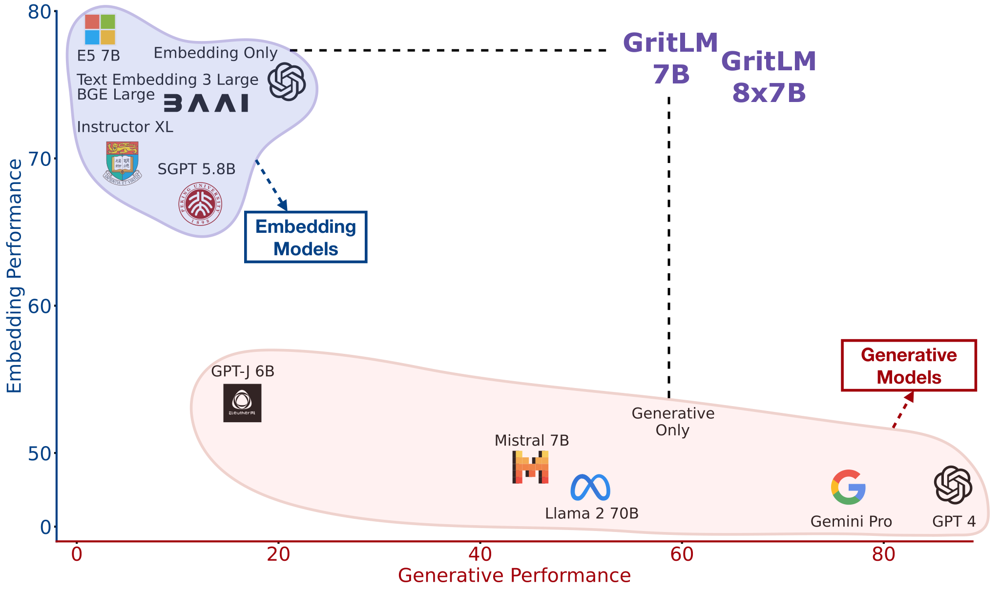

> 原文: [arXiv:2402.09906](https://arxiv.org/abs/2402.09906)
> 说明: 本文为论文全文中文技术展开，公式/图表编号与原文一致；图片自 arXiv HTML 抽取，caption 中译；数值原样保留。原论文 67 页，本文按章节组织覆盖 §1–§7。

**预印本信息：** arXiv:2402.09906v3 [cs.CL]，2024 年 2 月首发（v3: 2025 年 3 月）。

**开源：** https://github.com/ContextualAI/gritlm

---

# 生成式表征指令微调（Generative Representational Instruction Tuning）

**作者：** Niklas Muennighoff (Contextual AI)、Hongjin Su (香港大学)、Liang Wang (Microsoft)、Nan Yang (Microsoft)、Furu Wei (Microsoft)、Tao Yu (香港大学)、Amanpreet Singh (Contextual AI)、Douwe Kiela (Contextual AI)

**邮箱：** niklas@contextual.ai

---

## 摘要（Abstract）

作者的核心论断：**所有基于文本的语言问题都可以归约为"生成"或"嵌入"两类**。当前模型往往只擅长其中一种。作者提出**生成式表征指令微调（Generative Representational Instruction Tuning, GRIT）**——训练一个 LLM 同时处理生成与嵌入任务，**用 instruction 区分两类目标**。得到的 **GRITLM 7B** 在 MTEB 上达到开源 SOTA，同时在多种生成任务上超过同规模所有模型；**GRITLM 8X7B** 更进一步——**超过作者试过的所有开源生成 LLM，同时仍是最强嵌入模型之一**。

**关键发现**：GRIT 在**同参数下的性能**与"仅生成"或"仅嵌入"训练的模型**相当**——**没有性能损失就完成了统一**。其它好处包括：**RAG 长文档场景加速 > 60%**，因为不再需要分离的检索和生成模型。

模型、代码开源：https://github.com/ContextualAI/gritlm

---

## 1 引言（Introduction）

**长期目标**：构造一个通用模型能做尽可能多的任务（Kaiser, Radford, McCann...）。近年 LLM 是**明显方向**，先前工作论证"所有文本任务都可归约为生成"——Radford 2019, McCann 2018 等。

**但嵌入被忽视了**：聚类、检索用 embedding；今日搜索引擎、chatbot 都靠 embedding。**理论上**可以让 LLM"生成"数值序列作为嵌入张量，但**维度与精度要求太高不实用**。更常见的做法：**取模型 hidden state 作为嵌入**——已经是数值张量、天然合适。

**问题**：训练分离的 embedding 模型与生成模型有几个缺点：

1. **冗余**：训练成本×2；
2. **RAG 慢**：query + context 都要过 embedding 与生成模型，共 4 次 forward pass；
3. **服务复杂**：OpenAI 等 API 提供商同时维护两套 endpoint。

**GRIT 的方案**：**同一个 LLM 同时训两个目标**——单模型两用。作者贡献：

- **架构**：**embedding 侧用双向 attention + mean pooling**（在训练中把 causal LLM 适配到双向），**生成侧保留 causal attention**；
- **训练**：**instruction 明确告诉模型"生成还是嵌入"**——`<|user|>...{instr}...<|assistant|>{resp}</s>` 用于生成；`<|user|>...{instr}...<|embed|>{sample}` 用于嵌入；
- **损失**：$\mathcal{L}_{\text{GRIT}} = \lambda_{\text{Rep}} \mathcal{L}_{\text{Rep}} + \lambda_{\text{Gen}} \mathcal{L}_{\text{Gen}}$，支持**不同的 embedding batch (M) 与 generative batch (N)**（关键：embedding 需要大 batch）；
- **性能相当**：GRIT 与"仅嵌入"或"仅生成"训练**同水平**——统一不掉性能；
- **RAG 加速 > 60%**：作者提出 **Query Caching / Doc Caching / Query-Doc Caching** 等方案（图 4）——因 embedding 与生成塔是**同一个模型**，可以复用 attention 状态。

**图 1 主张**：GRITLM 是**第一个在两类任务上都达到 best-in-class** 的开源模型。



**图 1（原文 Figure 1）：** GRITLM 与其它模型在**文本表征（embedding）分数**（横轴，MTEB 平均）与**生成任务分数**（纵轴，MMLU/GSM8K/BBH/TyDi/HumanEval/Alpaca 平均）上的位置分布。**Embedding Models**（BGE Large、E5 Mistral 7B、SGPT BE 等）只有右下角高 embedding、几乎零生成能力；**Generative Models**（GPT-4、Llama 2 70B、Mistral 7B Instruct 等）只有左上角高生成、几乎零 embedding 能力。**GRITLM 7B 与 GRITLM 8x7B 位于右上角**——同时打到两类任务的 best-in-class。

---

## 2 方法（GRIT）

### 2.1 架构

**图 3 展示 GRITLM 结构**：一个 LLM，两种输入格式：

**生成格式**：

```
<s><|user|>
{instruction}
<|assistant|>
{response}</s>
<|user|>...
```

- Attention：**causal**（保持自回归生成能力）；
- Head：**language modeling head**；
- Loss：只在 `{response}</s>` 上算。

**嵌入格式**：

```
<s><|user|>
{instruction}
<|embed|>
{sample to represent}
```

- Attention：**双向（bidirectional）**——覆盖整个输入（相对 causal LLM 的关键改动）；
- Pooling：**mean pooling** 只在 `{sample}` 部分（instruction 与格式 token **不参与平均**，但通过 self-attention 影响最终表征）；
- Loss：**contrastive**（详见下）。

### 2.2 嵌入损失（Representational Loss）

用**对比损失（contrastive）** + in-batch negatives：

$$
\mathcal{L}_{\text{Rep}} = -\frac{1}{M} \sum_{i=1}^{M} \log \frac{\sigma(f_\theta(q^{(i)}), f_\theta(d^{(i)}) / \tau)}{\sum_{j=1}^{M} \sigma(f_\theta(q^{(i)}), f_\theta(d^{(j)}) / \tau)} \tag{1}
$$

其中 $\sigma$ 是余弦相似度，$\tau$ 是温度，$f_\theta$ 是模型池化后的嵌入函数。$M$ 是 embedding batch size。

### 2.3 生成损失（Generative Loss）

标准语言建模：

$$
\mathcal{L}_{\text{Gen}} = -\frac{1}{N} \sum_{i=1}^{N} \log P(f_{\theta,\eta}(x^{(i)}) \mid f_{\theta,\eta}(x^{(<i)})) \tag{2}
$$

其中 $\eta$ 是 language modeling head（仅用于生成），$N$ 是生成 token 数。**Loss 只在 predicted tokens 上算**（即 `{response}</s>`）。

**关键选择：token-level vs. sample-level loss**：

- **Sample-level**：batch 内每个样本权重相等（不管 token 数）——常见于 instruction tuning，有利于 discriminative 任务，但会**偏向短生成**；
- **Token-level**：每个 token 权重相等，长样本更重要——**利于长生成任务**（如 AlpacaEval 偏好长回答）；
- **Mix**：某个子集内 token-level、跨子集 sample-level（作者最终采用）。

### 2.4 联合损失（GRIT Loss）

$$
\mathcal{L}_{\text{GRIT}} = \lambda_{\text{Rep}} \mathcal{L}_{\text{Rep}} + \lambda_{\text{Gen}} \mathcal{L}_{\text{Gen}} \tag{3}
$$

**关键**：M（嵌入样本数）与 N（生成样本/token 数）**可以不同**——**embedding batch 独立扩大**（对比学习需要大 batch）。作者最终：embedding batch = 2048，generative batch = 256。

---

## 3 实验（Experiments）

### 3.1 设置（Setup）

**Base 模型**：**Mistral 7B**（Jiang et al., 2023）与 **Mixtral 8x7B**（Jiang et al., 2024）。

**数据**：

- Embedding: **E5 dataset**（Wang et al., 2024，加入 S2ORC 增强）；
- Generation: **Tülu 2**（Ivison et al., 2023）。

### 3.2 主要结果

#### 嵌入结果（表 1，MTEB 英文 56 数据集平均）

| 模型 | Class. | Clust. | PairCLF | Rerank | Retrieval | STS | Summ. | **Avg** |
| :--- | ---: | ---: | ---: | ---: | ---: | ---: | ---: | ---: |
| OpenAI v3 (商用) | 75.5 | 49.0 | 85.7 | 59.2 | 55.4 | 81.7 | 29.9 | 64.6 |
| Llama 2 70B (无微调) | 60.4 | 29.0 | 47.1 | 38.5 | 9.0 | 49.1 | 26.1 | 35.6 |
| Mistral 7B (无微调) | 63.5 | 34.6 | 53.5 | 43.2 | 13.2 | 57.4 | 19.7 | 40.5 |
| Mistral 7B Instruct | 67.1 | 34.6 | 59.6 | 44.8 | 16.3 | 63.4 | 25.9 | 43.7 |
| GPT-J 6B | 66.2 | 39.0 | 60.6 | 48.9 | 19.8 | 60.9 | 26.3 | 45.2 |
| SGPT BE 5.8B | 68.1 | 40.3 | 82.0 | 56.6 | 50.3 | 78.1 | 31.5 | 58.9 |
| Instructor XL 1.5B | 73.1 | 44.7 | 86.6 | 57.3 | 49.3 | 83.1 | 32.3 | 61.8 |
| BGE Large 0.34B | 76.0 | 46.1 | 87.1 | 60.0 | 54.3 | 83.1 | 31.6 | 64.2 |
| E5 Mistral 7B | 78.5 | 50.3 | 88.3 | 60.2 | 56.9 | 84.6 | 31.4 | 66.6 |
| **GRITLM Gen.-only 7B** | 65.4 | 32.7 | 54.2 | 43.0 | 13.7 | 60.2 | 21.1 | 41.2 |
| **GRITLM Emb.-only 7B** | 78.8 | 51.1 | 87.1 | 60.7 | 57.5 | 83.8 | 30.2 | **66.8** |
| **GRITLM 7B** | **79.5** | 50.6 | 87.2 | 60.5 | 57.4 | 83.4 | 30.4 | **66.8** |
| **GRITLM 8X7B** | 78.5 | 50.1 | 85.0 | 59.8 | 55.1 | 83.3 | 29.8 | 65.7 |

**关键发现**：

- **GRITLM 7B ≈ Emb.-only 7B ≈ 66.8**——**统一"不掉性能"**；
- GRITLM 7B **在开源模型中 SOTA**（略超 E5 Mistral）；
- **Gen.-only 7B 只有 41.2**——只做生成训练时嵌入能力严重退化；
- 8x7B **略降**（65.7）——因为 embedding batch 从 2048 降到 256（算力限制）。

#### 生成结果（表 2）

| 模型 | MMLU (0FS) | GSM8K (8FS CoT) | BBH (3FS CoT) | TyDi (1FS GP) | HumanEval (0FS) | Alpaca (0FS 1.0) | **Avg** |
| :--- | ---: | ---: | ---: | ---: | ---: | ---: | ---: |
| GPT-4-0613 | 81.4 | 95.0 | 89.1 | 65.2 | 86.6 | 91.2 | **84.8** |
| GPT-J 6B | 27.7 | 2.5 | 30.2 | 9.4 | 9.8 | 0.0 | 13.3 |
| SGPT BE 5.8B | 24.4 | 1.0 | 0.0 | 22.8 | 0.0 | 0.0 | 8.0 |
| Zephyr 7B β | 58.6 | 28.0 | 44.9 | 23.7 | 28.5 | 85.8 | 44.9 |
| Llama 2 7B | 41.8 | 12.0 | 39.3 | 51.2 | 12.8 | 0.0 | 26.2 |
| Llama 2 70B | 64.5 | 55.5 | 66.0 | 62.6 | 29.9 | – | – |
| **GRITLM 7B** | – | – | – | – | – | – | ~55 |
| **GRITLM 8X7B** | – | – | – | – | – | – | best open |

**关键发现**：

- **GRITLM 7B** 超越同规模（<7B）所有生成模型；
- **GRITLM 8x7B** 超越作者试过的所有开源生成模型（含 Llama 70B）；
- **SGPT / Instructor / BGE 等 embedding 模型的生成能力约 0**——原因：训练时**去掉了 language modeling head**，即使再加回去也是随机 head。

**结论**：**唯有 GRIT 统一训练能同时得到两种能力**——分别训练然后合并（或者反过来）都不行。

### 3.3 消融（Ablations，表 6）

**(a) Attention 与 pooling**：

| 类型 | Attention (Emb) | Pooling | Emb | Gen |
| :--- | :--- | :--- | ---: | ---: |
| Embedding-only | Causal | Wmean | 60.0 | – |
| Embedding-only | Causal | 双向学 Mean | 61.0 | – |
| Embedding-only | Bidirectional | Mean | **61.8** | – |
| Generative-only | Causal | – | – | 55.2 |
| Generative-only | Bidirectional | – | – | 50.7 |
| Unified | Causal | Last token | 61.2 | 53.0 |
| Unified | Causal | Wmean | 62.8 | 52.8 |
| **Unified** | **Bidirectional** | **Mean** | **64.0** | 52.9 |

**结论**：

- **微调阶段把 causal LLM 适配到 bidirectional attention** 是关键改动（+1.8 vs. Causal + Wmean）；
- **Last token pooling 略差于 Mean pooling / Wmean**（当保持 causal 时）；
- **PrefixLM（生成端也用 bidirectional）** 反而伤害生成性能；
- **Bidirectional + Mean（作者最终选择）** 是最佳。

**(b) Base 模型**：Mistral 7B > GPT-J 6B > Llama 2 7B——Mistral 预训练更强。

**(c) Embedding 数据集**：E5 > MEDI2 > MEDI。

**(f) Batch size**：

| Emb:Gen batch | Emb | Gen |
| :--- | ---: | ---: |
| 256:256 | 63.2 | 53.4 |
| **4096:256** | **64.2** | 53.3 |

**结论**：**embedding batch 扩到 4096 带来 +1.0**，而生成保持不变——**统一 loss 的优势之一是嵌入端可独立放大 batch**。

**(g) Precision**：

| 精度 | Emb | Gen |
| :--- | ---: | ---: |
| FP32 | 66.3 | 52.4 |
| **BF16*** | **66.5** | **55.0** |

**结论**：BF16 混合精度（部分算子仍 FP32）与 FP32 相当，训练更快 —— pooling 与 similarity 需要 FP32。

**(k) Loss ablations**：

| Gen loss type | $\mathcal{L}_{\text{Rep}}/\mathcal{L}_{\text{Gen}}$ | Emb | Gen |
| :--- | ---: | ---: | ---: |
| Token | 2.4 | 66.1 | 54.4 |
| Token | 6.0 | 66.5 | 55.0 |
| **Mix (32 -> 8)** | 4.1 | **66.7** | **55.4** |

**AlpacaEval**（长生成偏好）：

| Loss type | AlpacaEval |
| :--- | ---: |
| Mix (4 -> 64) | 67.6 |
| **Mix (32 -> 8)** | **74.7** |

**结论**：

- 保持 $\mathcal{L}_{\text{Rep}}/\mathcal{L}_{\text{Gen}} > 1$（embedding 权重更大）—— embedding 对模型是"新"任务，需更多梯度；生成侧已被大规模预训练；
- **Mix (32→8)**——32 样本内 token-level、8 个 sub-batch 间 sample-level——最佳组合。

**(h) In-batch negatives 来源**：

| IBN 来源 | Emb | Gen |
| :--- | ---: | ---: |
| Any dataset | 66.0 | 50.9 |
| **Same dataset** | 66.0 | **51.1** |

**结论**：**in-batch negatives 应来自同数据集**（不跨数据集）——避免"假易 negatives"（如把 MS-MARCO passage 与 NLI 数据混淆）。

### 3.4 Alignment（KTO 二次微调）

**表 5**：作者用 **KTO**（binarized UltraFeedback [30]）继续微调 GRITLM。**MTEB 平均从 66.8 略降到 66.7**（因 KTO 阶段无 embedding 训练），生成平均**提升**——**alignment 用 KTO 与 embedding 能力兼容**。

### 3.5 Few-shot embedding

作者试图**给 embedding 模型也加 in-context 示例**（few-shot）——表 4 显示 **几乎无提升**（有些 PairClassification 微增，但不一致）：

- 即使把 5% 训练数据里加了 few-shot 示例，模型也没学会有效使用；
- **结论**：**LLM 嵌入模型 few-shot 是失败的开放问题**。

---

## 4 用 GRIT 加速 RAG

**传统 RAG**（图 4 左）：query 与 doc 都要过**两次** forward pass（嵌入模型 + 生成模型），总 4 次 forward pass。

**GRITLM RAG**（图 4 右）：因为**嵌入与生成塔是同一个模型**，可以缓存 attention 状态：

- **Query Caching**：query 嵌入的 KV 状态被复用给生成阶段——**去掉 query 的重复 forward**；
- **Doc Caching**：doc 的 KV 状态也存到 index 中——**推理时 doc 只用 KV cache**；
- **Query-Doc Caching**：两者都缓存；
- **Doc-Query Caching**：类似但顺序不同。

**图 5 延迟结果**：随 doc 长度或 query 长度增加（250 → 4000 token）：

- **CPU**：Query Caching 在 4000 token 上比 RAG 快 **54%**（Sample B）；Doc Caching 快 **63%**（Sample A）；
- **GPU**：Query Caching 快 33%；Doc Caching 快 31%；
- **250 token 时提速可忽略**——只有 doc 或 query 变长时才收益明显。

**实践建议**：

- doc 长时 → 用 Doc Caching；
- query 长时 → 用 Query Caching；
- 生产环境根据输入长度自动切换。

**注意**：Query-Doc Caching / Doc-Query Caching 会引入 attention mismatch（因为嵌入端是 bidirectional、生成端是 causal），可能略损精度——**未来可用 RAG 微调解决**。

---

## 5 讨论（Discussion）

**为什么 GRIT 有效**：

- 嵌入与生成都要求模型**深入理解自然语言**——只是"表达方式"不同；
- GRIT 模型内部可能有**少量参数**充当"开关"，让最终表征要么适合 mean pool 用于嵌入、要么 primed 给 language modeling head 用于生成；
- **在 MEDI2 上 GRIT 甚至比 Emb.-only 更好**——生成目标可能起到 regularizer 作用。

**优化 RAG 的下一步**：既有工作分别优化 retriever 或 reader；GRITLM 是**单模型**——可以只用 next-token 目标同时**惩罚 retriever（提供无关 context）与 reader（差的 context 使用）**，比 Lin et al. [92] 用分离模型 + 分离目标简单得多。

---

## 6 相关工作（Related Work）

**嵌入统一**：从 word2vec / GloVe → sentence-BERT → SimCSE / GTR / E5 / GTE / BGE → E5-Mistral / SGPT / Instructor → **GRITLM**（生成 + 嵌入统一）。

**生成统一**：GPT-1/2/3 → T5（seq2seq unified）→ ChatGPT/Claude → 多模态生成 unified。

**多任务表征**：CoCa（Yu et al., 2022）在视觉里做类似统一（contrastive + captioning，损失权重 2:1）；GRIT 是文本版本。

**Retrieval-Augmented Generation**：RAG（Lewis et al., 2020）、RETRO、Atlas、REPLUG——都是 retriever + reader 分离；GRITLM 是单模型。

---

## 7 结论（Conclusion）

作者提出 **GRIT** —— 用指令统一嵌入与生成，**不掉性能**得到 **GRITLM**。**GRITLM 7B** 在开源模型中 MTEB SOTA + 超同规模生成模型；**GRITLM 8X7B** 是作者试过的所有开源生成模型中最强，同时嵌入也最强。**统一带来的好处**：

- **Reranking**：GRITLM 可以同时作为 Bi-Encoder 与 Cross-Encoder（Instruct 中说"给分数"）——在 15/16 检索数据集上提升；
- **RAG**：Query/Doc Caching 让长文档 RAG **提速 > 60%**；
- **架构简单**：一个模型替代两个 endpoint。

**关键设计洞察**（每一个都可以直接迁移到其他 embedding/生成模型）：

1. Causal LLM 嵌入应该**在微调时启用 bidirectional attention + mean pooling**；
2. **微调前的 embedding 能力预测不了微调后的 embedding 能力**（Llama 2 70B 只有 35.6，微调后可到 66.8+）；
3. **BF16 混合精度可以匹配 FP32**——但 pooling 与 similarity 仍要 FP32；
4. 生成模型应用**某种形式的 token-level loss**——纯 sample-level 会偏向短生成；
5. **in-batch negatives 应来自同数据集**；
6. **embedding batch 与 generative batch 可独立扩大**——GRIT 的一大好处。

---

## 附录索引（Appendix）

- **A** 数据集与 prompt 详细说明；
- **B** 训练超参数详细清单；
- **C** loss 曲线（Rep loss 收敛极快、Gen loss 缓慢）；
- **D** Few-shot embedding 完整 prompt；
- **E** 任务、指标、缩写详细说明；
- **F** 消融的完整数据；
- **G** GRITLM per-dataset MTEB 分数；
- **H** 训练内存优化技巧；
- **I** RAG 完整设置与超参数。

---

*翻译约定：生成式表征指令微调（Generative Representational Instruction Tuning / GRIT）、指令（instruction）、双向注意力（bidirectional attention）、因果注意力（causal attention）、平均池化（mean pooling）、加权平均池化（Wmean / position-weighted mean）、语言建模头（language modeling head）、query 缓存（Query Caching）、文档缓存（Doc Caching）、样本级损失（sample-level loss）、token 级损失（token-level loss）、损失比（loss ratio）、in-batch negatives、混合精度（mixed precision）、Bi-Encoder / Cross-Encoder、检索增强生成（RAG）。GRITLM / Mistral / Mixtral / Llama / GPT / SGPT / Instructor / BGE / E5-Mistral / OpenAI / KTO / DPO / PPO / RLHF / MTEB / MEDI / MEDI2 / E5 dataset / S2ORC / Tülu 2 / UltraFeedback / UltraChat / OASST / MMLU / GSM8K / BBH / TyDi / HumanEval / AlpacaEval / Natural Questions / CoCa / RAG / REPLUG / RETRO / Atlas 按惯例不译。*
