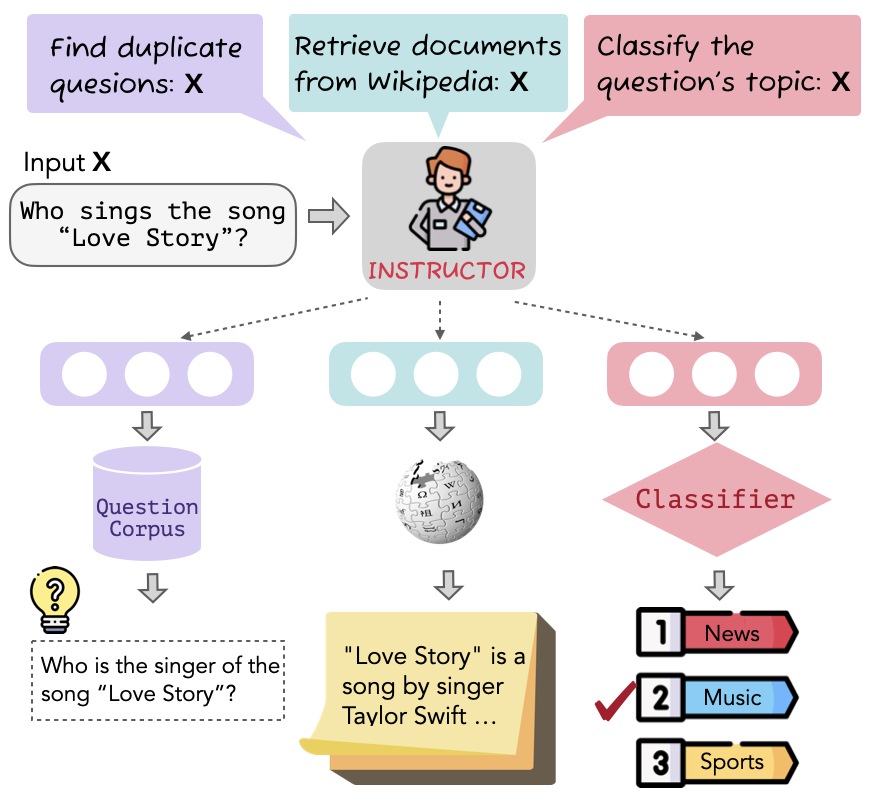
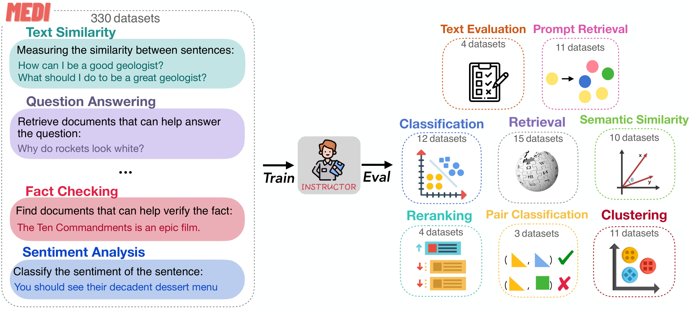
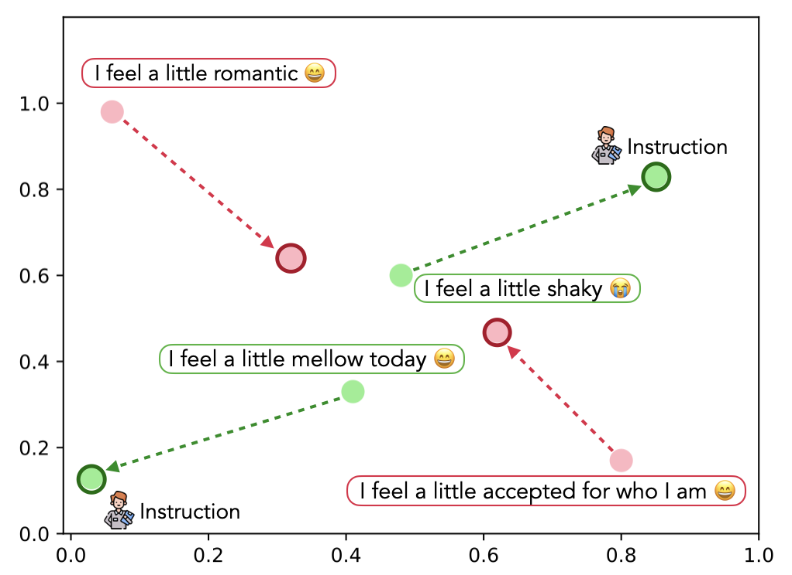

# INSTRUCTOR：一个 embedder，服务任意任务

> **paper**：[One Embedder, Any Task: Instruction-Finetuned Text Embeddings (ACL 2023 Findings)](https://arxiv.org/abs/2212.09741)
> **code / models / MEDI**：[instructor-embedding.github.io](https://instructor-embedding.github.io) · [HKUNLP/instructor-embedding](https://github.com/HKUNLP/instructor-embedding)
> **refs**：[GTR (Ni et al. 2021)](https://arxiv.org/abs/2112.07899) · [Sentence-T5 (Ni et al. 2022)](https://arxiv.org/abs/2108.08877) · [Super-NaturalInstructions (Wang et al. 2022)](https://arxiv.org/abs/2204.07705) · [MTEB (Muennighoff 2022)](https://arxiv.org/abs/2210.07316) · [Task-aware Retrieval with Instructions (Asai 2022)](https://arxiv.org/abs/2211.09260)
> **backbone**：GTR-Base (110M) / GTR-Large (335M) / GTR-XL (1.5B)（T5-encoder + 检索预训练）
> **date**：2022-12（arXiv v1）；2023 ACL Findings
> **modality**：文本
> **languages**：主英文；训练/评测集为英文
>
> 本文写全 **一个模型 + 一条指令模板 = 通用嵌入** 的机制：架构（GTR encoder + mean pool + 指令拼接）、损失（双向 in-batch InfoNCE）、数据（**MEDI**：330 任务、super-NI 300 + 嵌入 30）、鲁棒性（对指令改写不敏感）、复杂度消融（无 → tag → 简 → 详细），以及为什么这条思路直接被 E5-instruct / bge-en-icl / gte-Qwen2 / Qwen3-Embedding 全盘继承。

---

## 一句话定位

INSTRUCTOR = **GTR encoder** + **任务指令拼接** + **双向 InfoNCE** + **330-任务 MEDI 数据集**。它把「一个句子的向量」改造成 **「(句子, 任务指令) → 任务定制的向量」**，同一个模型不用再重训就能同时服务分类、检索、STS、聚类、prompt 检索、文本评估 8 类任务。

| 项           | 内容                                             |
| ------------ | ------------------------------------------------ |
| 模型规模     | Base 110M / Large **335M** / XL 1.5B（T5 encoder） |
| 嵌入维度     | 768（Base）/ **768**（Large）/ 768（XL）           |
| 输入格式     | `Ix ⊕ x`（把指令拼在文本前）                     |
| 池化         | last hidden 的 **mean pool**（只在 $x$ 位置上）  |
| 相似度       | 余弦                                             |
| 训练数据     | **MEDI**：330 任务（super-NI 300 + 嵌入数据 30）  |
| 训练 loss    | Bidirectional in-batch InfoNCE + 每对 1 个 hard neg |
| 评测覆盖     | 70 数据集，其中 **66 为未见过任务**              |
| 主要结论     | 335M 版**打过**同期 4.8B 的 GTR-XXL / Sent-T5-XXL |

## 谱系与位置

```text
Sentence-T5 (只训 STS 类对称任务)     ─┐
GTR      (只训检索类非对称任务)         ├─→ INSTRUCTOR (合训所有任务 + 指令区分)
其它单任务嵌入 (SimCSE / DPR / …)      ─┘
                                              │
                                              ├─ E5-instruct (2023–24)：指令用于查询侧
                                              ├─ bge-en-icl (2024)：在指令基础上加 ICL 例子
                                              ├─ gte-Qwen2 / QZhou-Emb / Conan-v2：query 侧都带指令
                                              └─ Qwen3-Embedding / Seed-Emb (2025)：同一血脉的 LLM 版
```

指令化 embedding 的时代由 INSTRUCTOR 正式开启。它证明了两件事：

1. **同一个模型能同时做对称任务（STS）和非对称任务（检索）而不打架**——只要给指令做区分。
2. **参数量不是唯一杠杆**——335M + 好指令、好数据 > 4.8B 但没指令的模型。

后续 E5-instruct、bge-en-icl、gte-Qwen2、QZhou-Embedding 的「查询前缀」几乎是 INSTRUCTOR 指令模板的直译。

---

## 问题背景

2022 年前的嵌入模型有两个尴尬现实：

1. **一个模型只擅长一类任务**：DPR 检索强、STS 弱；SimCSE 反之。要同时做 RAG + 去重 + 聚类，得挂 3 个模型。
2. **换域即失效**：训练在 Wikipedia、测评在 Bio-med 或 Finance，MTEB 上分数经常掉一半以上。常规解决方案是「继续在目标域微调」，但那需要大量标注数据。

INSTRUCTOR 的假设：**同一段文本，在不同任务/领域下应该被投影到不同的向量**——只要模型知道「你要用它做什么」。给模型一段自然语言指令，让它自己决定该突出哪些语义特征。



上图给出直观示例：一个问题 "Who sings the song 'Love Story'?" 在三种指令下被投影成三个向量：查重（找相似问题）、检索（找 Wikipedia 支持文档）、话题分类。同一个模型，不重训，直接切换任务。

---

## 架构：GTR encoder + 指令拼接 + mean pool

INSTRUCTOR 建立在 GTR 系列之上（Ni et al. 2021）。GTR 本身是**T5 encoder** 初始化，然后在 web 语料 + 检索数据上继续预训练，是一个已经做过「检索类非对称任务」适配的骨干。INSTRUCTOR 只做三件事：

1. **输入拼接**：给定文本 $x$ 与任务指令 $I_x$，编码器输入是 $I_x \oplus x$（指令在前，用一个分隔符隔开）。
2. **池化**：last hidden layer 的 mean pool，但**只对 $x$ 位置计算**（指令位置不参与），得到固定维度向量 $E_I(I_x, x) \in \mathbb{R}^{768}$。
3. **相似度**：余弦相似度，$s(x, y) = \cos(E_I(I_x \oplus x), E_I(I_y \oplus y))$。

对**对称任务**（STS / 去重 / 分类），$I_x = I_y$。对**非对称任务**（检索 / 重排），$I_x \neq I_y$：$I_x$ 描述 query 侧、$I_y$ 描述 doc 侧。这是「指令支持非对称编码」的关键。

模型大小和骨干：

| 名称              | 骨干     | 参数 | 嵌入维度 |
| ----------------- | -------- | ---- | -------- |
| INSTRUCTOR-Base   | GTR-Base | 110M | 768      |
| INSTRUCTOR        | GTR-Large| 335M | 768      |
| INSTRUCTOR-XL     | GTR-XL   | 1.5B | 768      |

嵌入维数在三个尺寸上都是 768，主要用来控住下游存储与 ANN 成本。

---

## 训练目标：双向 in-batch InfoNCE

每条训练样本是四元组 $(x, I_x, y, I_y)$，含正对 $y^+$ 与 $k$ 个负例 $\{y^-_i\}_{i=1}^k$（$k=1$ 或 4）。相似度取余弦。目标函数：

$$
\mathcal{L}_{x\rightarrow y} \;=\; -\log \frac{\exp(s(x, y^+)/\gamma)}{\sum_{y \in \mathcal{B}} \exp(s(x, y)/\gamma)}
$$

其中 $\gamma$ 是温度，$\mathcal{B} = \{y^+\} \cup \{y^-_i\}$ 加上同 batch 其它样本作 in-batch neg。

论文延续 GTR 的做法，把 $x$ 与 $y$ 互换后再算一次损失（双向 in-batch），最终 loss 是二者之和：

$$
\mathcal{L} \;=\; \mathcal{L}_{x\rightarrow y} \;+\; \mathcal{L}_{y\rightarrow x}
$$

**为什么双向**？非对称任务（如检索）里 $x$ 是短 query、$y$ 是长 doc，若只用 $x\rightarrow y$ 的方向，doc 侧的编码得不到直接梯度；加上反向的 $y\rightarrow x$ 让 doc 一侧也被拉近。对称任务下这一步等价于把 batch 大小翻倍。

---

## MEDI：多任务嵌入指令数据集

INSTRUCTOR 最重要的贡献之一是 **MEDI**（Multitask Embeddings Data with Instructions）：330 个任务，均标注人写指令。构成：

- **Super-NaturalInstructions（super-NI，Wang et al. 2022）子集**：300 任务，本身自带指令，但没有正/负对。
- **既有嵌入训练数据**：30 个任务，来自 sentence-transformers 训练集、KILT、MedMCQA 等。

### super-NI 端：Sentence-T5 自动挖正负对

super-NI 的原始形式是「指令 + 输入 + 目标输出」，不是标准的对比学习格式。作者用 Sentence-T5（$E(\cdot)$，**不给它加指令**）打 embedding，然后按任务类型自动挖对：

- **分类任务**：给定输入 $x_i, x_j$：
  - 若 $\cos(E(x_i), E(x_j))$ 高且标签相同 → 正对
  - 若 $\cos$ 高但标签不同 → 负对（**难负**）
- **生成/开放输出任务**：正/负打分方式为
  $$
  s_{\text{pos}} = \cos(E(x_i), E(x_j)) + \cos(E(y_i), E(y_j))
  $$
  $$
  s_{\text{neg}} = \cos(E(x_i), E(x_j)) - \cos(E(y_i), E(y_j))
  $$
  分别取 $s_{\text{pos}}$ 最高的作正对、$s_{\text{neg}}$ 最高的作难负。这个「输入相似但输出不同」的定义捕捉到了「难负」的本质：**在输入空间近，但语义/标签相反**。

### 既有嵌入数据端：作者补写指令

对 30 个已有嵌入训练集（MS MARCO、Natural Questions、SNLI、Quora Duplicate、SPECTER 等），作者按统一模板逐个补写指令，每条至多带 4 个负例（1 个 hard + 3 个 in-batch 或全部 in-batch）。

### 指令模板

统一格式：

```
"REPRESENT THE (DOMAIN) TEXT TYPE FOR TASK OBJECTIVE:"
```

三段：

| 段          | 说明                                     | 例子                        |
| ----------- | ---------------------------------------- | --------------------------- |
| Text Type   | 输入是什么（**必填**）                    | question / passage / review |
| Task Objective | 拿来做什么（**可选**）                | for retrieving / for classification |
| Domain      | 领域（**可选**）                          | Wikipedia / News / Medicine |

例子（Natural Questions 检索任务，非对称，两侧不同指令）：

- 查询：`Represent the Wikipedia question for retrieving supporting documents:`
- 文档：`Represent the Wikipedia document for retrieval:`

STS 类对称任务用同一条：`Represent the statement:`。

---

## MEDI 数据流与训练/评测总览



图中左侧是 330 训练任务，右侧是 70 评测任务（其中 66 未见），完整覆盖 9 个下游应用类别（Classification / STS / Reranking / Clustering / Pair Classification / Retrieval / Prompt Retrieval / Text Evaluation / Summarization）。这份「一个模型对付所有类别」的画风，就是 INSTRUCTOR 想传达的核心。

---

## 训练配置

| 项             | 值                                           |
| -------------- | -------------------------------------------- |
| 骨干           | GTR-Base / Large / XL                        |
| 优化器         | AdamW                                        |
| batch size     | 每对 4 个负例（1 个 hard + 3 个 in-batch 补齐） |
| 温度 $\gamma$  | 0.01                                          |
| 最大长度       | 512（含指令 + 文本）                          |
| 训练步数       | 20k                                           |
| 硬件           | 8× A100 40GB                                  |

训练量比 E5 / GTR 小一个量级（20k step vs 数十万），因为骨干已经在 GTR 阶段做过检索预训练，MEDI 只是做「多任务指令微调」。

---

## 关键实验结论

### 相同骨干下，指令直接带来 +5.9% 平均分

Table 2 主表（截取 335M 一档）：

| 模型              | Retrieval | Rerank | Clustering | Pair Class | Classification | STS   | Summarize | Text Eval | Prompt Retr. | **Avg** |
| ----------------- | :------: | :----: | :--------: | :--------: | :------------: | :---: | :-------: | :-------: | :----------: | :-----: |
| GTR-Large (335M)  | 47.4     | 55.4   | 41.6       | 85.3       | 67.1           | 78.2  | 29.5      | 31.2      | 59.8         | 55.1    |
| **INSTRUCTOR (335M)** | **47.6** | **57.5** | **45.3** | **85.9**   | **73.9**       | **83.2** | **31.8**  | **36.9**  | **63.2**     | **58.4** |
| Sent-T5-XXL (4.8B)| 42.2     | 56.4   | 43.7       | 85.1       | 73.4           | 82.6  | 30.1      | 33.9      | 61.5         | 56.5    |

两条重点：

1. **335M INSTRUCTOR > 4.8B Sent-T5-XXL**（58.4 vs 56.5），指令 + 多任务 > 参数量。
2. **相对 GTR-Large（同骨干），+5.9% 平均**：Text Eval +18.3%、Classification +10.1%、Clustering +8.9%、Summarize +7.8% —— GTR 只训检索，加了指令后**在非检索任务上大幅补齐**。

### 指令是让「合训对称+非对称」不打架的关键

作者把 MEDI 拆成对称（sym）与非对称（asym）两组，做四组对照训练：

| 训练数据          | 不加指令 | 加指令 |
| ----------------- | :------: | :----: |
| 只 sym            | 55.7     | 56.0   |
| 只 asym           | 55.2     | 55.6   |
| sym + asym (MEDI) | **54.3** | **58.4** |

- 只训单一类型时，加不加指令几乎没差别。
- **两类合训、不加指令**：反而**掉分**（54.3 < 55.7）——两组数据在训练时相互冲突。
- **两类合训 + 加指令**：**+4.1**，指令让模型知道「这一条属于哪种任务、该怎么读」。

这实证解释了「Sent-T5 只做对称、GTR 只做非对称」这一分裂的历史根因，也解释了为什么 E5-instruct / bge-en-icl 一定要在训练时给 query 加前缀。

### 指令改写鲁棒性：super-NI 提供多样化描述是关键

作者对每个评测数据集手工改写了 5 条同义指令，测最佳/最差性能差：

- 不加 super-NI 训练：最好/最坏差 ~5 分（明显对指令措辞敏感）
- 加 super-NI 训练：最好/最坏差压到 ~1 分

super-NI 里 300 个任务的指令风格差异极大，训练时看过这么多样化的表达后，模型对指令的表面改写变得非常稳。**这一条对生产环境尤其重要**：线上很难保证指令一字不差。

### 指令复杂度递进有连续增益

四挡：无 → dataset tag → 简（domain 一两词）→ 详（完整模板）。

平均分：GTR baseline 53.9 → tag 55.7 → simple 56.9 → **detail 58.4**。

- 只贴数据集名字（tag）已能超过 GTR。
- 补上领域词、再补上任务目标，分数连续上升。
- 说明「指令」不是标签开关，是**语义特征选择器**——描述越具体，模型越能突出对应特征。

### 未见领域的收益比同分布更大

三个 INSTRUCTOR 训练时没见过的域（Geography、Biology、Civil Comments）：

| 域         | GTR-Large | INSTRUCTOR | Δ    |
| ---------- | :-------: | :--------: | :--: |
| Geography  | 53.4      | **64.2**   | +20.2% |
| Biology    | 25.7      | **31.3**   | +21.8% |
| Civil      | 71.8      | **77.2**   | +7.5%  |

「加了域名后模型突然懂了」这个结论后来在 E5 / BGE 的领域微调经验里被反复验证：**在指令里写清 domain**，比额外做领域微调性价比高。

### 定性可视化：指令拉开正负分布



上图是 pair-classification 上的 t-SNE：不加指令时，同情感对（红）远、异情感对（绿）近；**加指令后，语义正确的对被拉近、语义相反的对被推开**。这与训练分析里「加了 instructions 才能合训 sym + asym」的结论对应。

---

## 训练数据集与评测速览

### 训练：MEDI = 300 + 30

- **super-NI 300 任务**：Super-NaturalInstructions 中和嵌入相关的子集（分类、生成等），由作者用 Sentence-T5 自动挖正/负对。
- **既有嵌入 30 任务**：MS MARCO、Natural Questions、SNLI、Quora Duplicates、SPECTER、KILT、MedMCQA、Sentence Transformer 训练包等。作者按统一模板逐个补写指令。

### 评测：70 数据集，66 未见

- **MTEB (Muennighoff 2022)**：56 数据集 / 7 类别（Retrieval / Reranking / Clustering / Pair Classification / Classification / STS / Summarization）。
- **Billboard (Kasai 2022)**：3 个自然语言生成的自动评测数据集（用嵌入相似度打分）。
- **Prompt Retrieval (Su et al. 2022)**：11 个 in-context learning 的示例检索基准（GeoQuery、SMCalFlow、Break、MTOP 等）。

覆盖 9 个应用类别，其中 66 数据集训练时没见过，是完整意义上的**零样本泛化**评测。

---

## 常见错误用法

1. **训练带指令、推理不带**：INSTRUCTOR 是「指令感知」模型；推理漏指令等于把它当 GTR 用，分会掉。E5 / BGE / gte-Qwen2 都同样吃这个规则。
2. **对称任务两侧写不同指令**：STS / 去重是对称任务，两侧必须**用同一条指令**；否则空间被拉歪，Spearman 明显掉。论文实测 STS 用非对称指令平均掉 ~2 分。
3. **指令过短或缺失 domain**：论文消融显示指令复杂度和分数正相关；生产环境至少要写 **text type + domain**，任务描述有明确差异时再加 task objective。
4. **拿 MTEB 榜分定生产选型**：MTEB 高不等于你的域好。INSTRUCTOR 已经强调「一个模型跨任务泛化」，但**领域微调 + 指令合适**才是落地路径；不要迷信榜分。
5. **只用 hard neg，不用 in-batch neg**：INSTRUCTOR 论文用「1 hard + in-batch 补齐」，同期实验也表明纯 hard neg 收敛更慢。后续 NV-Embed / SFR-Embedding 都保留了 in-batch 兜底。

---

## 对后续工作的辐射

INSTRUCTOR 的思路后来几乎被所有主流嵌入模型直接吸收：

- **E5-mistral-7b-instruct** (2024)：查询前缀 `Instruct: <task> \n Query: <q>`，非对称，doc 侧无指令。见主文 §9.2 与 [E5 详解](E5详解.md)。
- **BGE-en-icl** (2024)：在 INSTRUCTOR 指令基础上进一步加 **ICL 示例**，让 embedding 也能做上下文学习。
- **gte-Qwen2 / QZhou-Embedding / Conan-embedding-v2**：查询侧一律带指令；训练时对称/非对称任务被 instruct 区分。
- **NV-Embed-v2 / Snowflake Arctic-Embed v2 / Stella / Jasper**：两阶段训练里 stage 2 一定包含带指令的多任务微调。
- **Qwen3-Embedding / Seed1.5-Embedding**（2025）：整套 LLM-embedding 训练几乎照搬 INSTRUCTOR + E5-instruct 的指令流水线。

一句话总结：**「指令化嵌入」在 2023 年只是一个新点子；到 2025 年已经是不加就落榜的默认配置**。

---

## 与本仓库既有报告的挂接

- 主文 §5.5 与 §7.1「指令 / 对称非对称」相关章节：见 [Embedding 调研报告](Embedding调研报告.md)。
- 与 E5 的指令化血脉：见 [E5 详解](E5详解.md)。
- LLM 骨干指令化实践：见 [LLM2Vec 详解](LLM2Vec详解.md)、[Conan-embedding-v2 详解](Conan-embedding-v2详解.md)、[QZhou-Embedding 详解](QZhou-Embedding详解.md)。
- 前置：GTR + Sentence-T5 —— 见 [GTE系列详解](GTE系列详解.md) 中的谱系讨论。

---

*本报告基于 INSTRUCTOR 原论文（arXiv 2212.09741）与官方开源 MEDI 数据集整理，图片取自 arXiv HTML 原文。*
