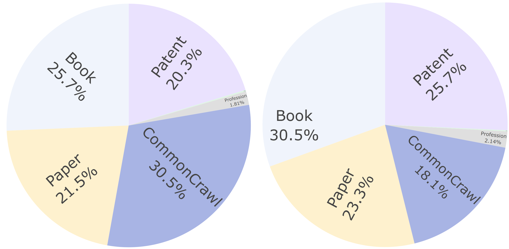

# InternLM2 数据处理与过滤详解（Cai et al. 2024）

> paper: [InternLM2 Technical Report](https://arxiv.org/abs/2403.17297)（arXiv:2403.17297, 2024-03）
> authors: Zheng Cai, Maosong Cao, … （上海人工智能实验室 InternLM 团队，53 页技术报告）
> code / project: [InternLM/InternLM](https://github.com/InternLM/InternLM) · 长文数据方法见 [Lv et al. 2024](https://arxiv.org/abs/2402.10171)
> refs: [Gopher](https://arxiv.org/abs/2112.11446) · [C4](https://arxiv.org/abs/2104.08758) · [RefinedWeb](https://arxiv.org/abs/2306.01116)（三条经典网页清洗/规则过滤）
> backbone: LLaMA 式 Decoder（RMSNorm + SwiGLU + GQA），1.8B / 7B / 20B
> date: 2024-03 ; modality: 文本 + 代码 + 长上下文 ; languages: 中英 + 代码

> 本文只截取 InternLM2 技术报告与 **"预训练数据处理与过滤流水线"** 相关的部分——这是 Conan-embedding v1 预训练一节里"采用 Cai et al. (2024) 所述的标准数据过滤方法"的确切出处。报告其余（基础设施 InternEvo、COOL RLHF 对齐、30+ 基准评测）不在本文展开。GTE 侧（Conan 引用的另一半"多阶段训练"）见 [GTE系列详解.md](../GTE/GTE系列详解.md)。

---

## 为什么 Conan-v1 要引用它

Conan-embedding v1 在预训练一节写道："过滤后用 `bge-large-zh-v1.5` 打分…… 预训练阶段使用 **Cai et al. (2024) 所述的标准数据过滤方法**。" 这里的 Cai et al. (2024) 就是 InternLM2 技术报告。它被引用，是因为 InternLM2 **罕见地公开了 LLM 预训练数据的完整清洗流水线**——过往 LLaMA、Qwen 等技术报告几乎不谈数据处理，而 InternLM2 明确把"**数据质量是预训练最关键因素**"写进贡献，并给出一套可照搬的"格式化 → 规则过滤 → 去重 → 安全过滤 → 质量过滤"流程。

对 embedding 训练的意义在于：**嵌入模型的弱监督预训练同样是"海量网页文本对"，同样面临解析噪声、重复、有毒、广告/低流畅内容的问题**。Conan 借用 InternLM2 的这套清洗流水线来把 7.5 亿爬取文本对压到 4 亿高质量对，再叠加 bge 打分（丢弃相似度 <0.4）做相关性过滤。所以理解本文，就理解了 Conan"数据从 0.75B → 0.4B"那一步到底做了什么。

---

## 一句话定位

**InternLM2 的数据处理是一条"多来源标准化 → 逐级过滤 → 分域定阈"的可复现流水线**，对文本、代码、长文本三类数据分别设计。核心不是某个新算法，而是**把工业级数据清洗拆成可解释、可迭代、可分域调阈的工程模块**：

| 阶段 | 手段 | 产物 |
| --- | --- | --- |
| Formatting | 文档抽取（Trafilatura）+ 语言识别（pycld2）+ jsonl | Format data |
| Rule-based | 启发式规则（分隔/换行/异常字符/标点分布） | Clean data |
| Deduplication | **MinHash LSH**：128 哈希 / 5-gram / 阈值 0.7 | Dedup data |
| Safety | 域名封禁(13M) + 词表封禁(36,289) + 毒性分类器 + 色情分类器 | Safe data |
| Quality | 广告分类器 + 流畅度分类器（人工标注微调 BERT） | High-quality data |

规模量级：预训练文本以网页为主（中英网页占 **86.46%**），总语料 **2.0T–2.6T token**。

---

## 文本数据流水线：五段串行

**图解（论文 Figure 3）**：五个模块从左到右串行，每段产物喂给下一段。**Formatting**（文档抽取→语言识别）把 Warc/HTML 原始网页变成带语言标签的 jsonl；**Rule-based Stage**（归一化→启发式过滤）滤掉解析/格式垃圾；**Deduplication**（MinHash 去重）消重复；**Safety Filtering**（域名封禁→词表封禁→毒性分类器→色情分类器）四道串联去有害内容；**Quality Filtering**（广告分类器→流畅度分类器）去低信息/难读内容。整条链把数据从 Format→Clean→Dedup→Safe→High-quality 逐级提纯。下面逐段拆开。

### 格式化（Formatting）

以 Common Crawl 网页为例：解压 Warc → 用 **Trafilatura** 做 HTML 解析与正文抽取 → 用 **pycld2** 做语言检测分类 → 赋唯一 ID、存 jsonl。这一步决定了"从原始网页里到底抽出什么正文"，抽取器质量直接影响后续所有环节。

### 规则阶段（Rule-based）

网页含大量解析错误、格式错误、非自然语言文本。InternLM2 参考 Gopher / C4 / RefinedWeb 的思路，自设一组**启发式过滤规则**，聚焦三类异常：**分隔与换行异常、异常字符频率、标点分布**。这是最便宜、最先做的一道，滤掉明显垃圾得到 Clean data。

### 去重（Deduplication）：MinHash LSH

互联网重复文本极多，会让模型过拟合高频片段。InternLM2 用**局部敏感哈希（LSH）+ MinHash** 做模糊去重：

- 在文档的 **5-gram** 上用 **128 个哈希函数**建立 MinHash 签名；
- 以 **0.7** 的 Jaccard 相似度为阈值判重；
- 保留策略：**优先留最新数据**（CC dump 编号更大者）。

要点：这是**模糊去重**而非精确匹配（对照 GTE 只做精确匹配去重、作者自陈"过严"）。5-gram + 128 哈希 + 0.7 阈值是一组可直接复用的工程默认值。

### 安全过滤（Safety）：两封禁 + 两分类器

四道串联（图 3 中 Safety 段自上而下）：

1. **域名封禁**：约 **1300 万**不安全域名黑名单；
2. **词表封禁**：**36,289** 个不安全词——但**刻意保守**编制，因为词表封禁易误伤大量正常数据；
3. **毒性分类器**：用 Kaggle "Toxic Comment Classification Challenge" 数据微调 BERT；
4. **色情分类器**：从 Dedup data 采样 + Perspective API 标注，微调 BERT。

前两道是"黑名单硬过滤"（快、召回高但可能误伤），后两道是"学习式软过滤"（按分数阈值二次筛）。这种"硬规则打底 + 学习模型精筛"的组合是全篇反复出现的范式。

### 质量过滤（Quality）：广告 + 流畅度

网页低质内容主因有二——**重复且信息量低的营销广告**、**摘要列表/产品描述式的难读文本**。对应两个人工标注 → 微调 BERT 的分类器：

- **广告分类器**：整体或局部含广告即标低质；
- **流畅度分类器**：从**一致性、噪声、信息量、语法**四维打分。

用两分类器做二次过滤，滤除低于阈值者，得到最终 High-quality pre-train data。

---

## 代码数据：可学习打分 + 迭代标注 + 依赖拼接

代码数据的处理比文本多了三个特有难点，也给出三个有借鉴价值的解法。

### 质量分档决定训练次数

用一个**可学习打分模型**把代码分三档，并直接映射到**训练次数**（原文 Table 2）：

| 档 | 占比 | 处理 |
| --- | --- | --- |
| High | 16.8% | **多次**训练（高采样权重） |
| Moderate | 69.9% | 训练**一次** |
| Low | 13.3% | **丢弃** |

结论很实在：**低质代码虽占比不大，但剔除它对性能与训练稳定性至关重要**。这与 embedding 训练里"低分对直接丢"的直觉一致。

### 迭代式质量标注（对抗"质量定义模糊"）

**图解（论文 Figure 5）**：这是全篇最值得借鉴的方法论。因为"什么是高质量代码"连人类专家都难定义（知名仓库对初学者可能过复杂），InternLM2 用**人机协同闭环**替代一次性标注：**Train set → 训练 Scorer → 打分器对 Pre-training data 分 High/Mid/Low → Annotator 只复核"高置信的高质量与低质量样本" → 产出 Validation(√/✗) → 回流补充训练集**，如此迭代并**同步优化标注指南**（紫色虚线为标注者反馈）。每轮还自动验证历史标注是否仍被正确分类。实践 **3 轮**收敛。要点：（1）只标高置信样本省人力；（2）指南随认识迭代；（3）打分器与标注互相纠偏。

此外还有两条务实结论：**代码风格不是可靠质量指标**（会误杀大量代码）；模型打分器与人工的相关性**因编程语言而异**，故**只对"验证集上与人工高度一致"的语言启用模型打分**，其余靠规则——这是"不迷信单一打分器"的克制。

### 依赖拓扑排序拼接（用满 32K 窗口）

去重/按扩展名过滤会破坏仓库结构。InternLM2 把同仓库文件重新分组，用正则识别各语言的 `import` 关系，**拓扑排序**决定拼接顺序，把整个仓库当作一个含代码块的长 Markdown 文件喂入，让模型学**跨文件依赖**。边角情形：多路径取最短、有环按字母序定起点、批量导入（`__init__.py`/`#include`）用启发式细化。文件级（而非行级）去重也是为保上下文完整。

---

## 长上下文数据：三级过滤 + 分域定阈

长文本（>32K）过滤流水线三阶段：

1. **长度选择**：规则筛出 >32K 字节样本；
2. **统计过滤器**：用词法/语言学特征剔除异常。一个代表性特征是**连词/语篇结构词**（"Especially"、"Formally" 等）的出现。原则是"**滤除无意义数据而非挑最优数据**"；长文本统计特征远比短文本一致（20 token 无可靠统计，32K token 分布清晰）。
3. **困惑度过滤器**：核心创新点——不看困惑度绝对值，而看**条件困惑度差** $P(S_2|S_1)$ vs $P(S_2)$。若加上前文 $S_1$ 后 $S_2$ 更可预测（困惑度差为负），说明连贯、保留；若反而更难预测，说明 $S_1$ 是干扰上下文（如 HTML 解析失败、随机社媒拼接），剔除。**只用困惑度差**能抵消"用哪个模型算困惑度"带来的估计偏差。

**图解（论文 Figure 6）**：(a) 过滤前 vs (b) 过滤后的长文本来源占比。**CommonCrawl 从 30.5% 降到 18.1%**，Patent 从 20.3%→25.7%、Book 25.7%→30.5%、Paper 21.5%→23.3%。直观说明过滤**大量剔除低质网页长文本、保留书籍/论文/专利**等高质量长文——与"网页噪声最多、书籍论文最干净"的先验一致。

### 阈值哲学：两条经验

因为过滤器很多，阈值选择尤其难。InternLM2 的两条经验值得钉在墙上：

1. **分域定阈，不追求通用阈值**：连词过滤器不适用于没有连词的长代码；教科书/论文/小说/专利各有特征；跨语言亦然。通用阈值必误分。
2. **用验证集只盯边界样本**：统计与困惑度过滤器在同域内结果平滑，故只需判断阈值"调高还是调低"，聚焦边界样本即可，无需全量重标。

---

## 与 GTE / Conan 的关系（记忆锚点）

Conan-v1 预训练同时引用了**两篇取向相反**的论文，理解它俩的分工是本次调研的关键：

| | GTE（Li et al. 2023a） | InternLM2（Cai et al. 2024） |
| --- | --- | --- |
| 在 Conan 里的角色 | 提供**多阶段训练课表**（弱监督预训练→监督微调） | 提供**数据过滤流水线** |
| 数据态度 | **大而不洗**（只精确匹配去重，明确不做质量过滤） | **重清洗**（五段流水线 + 分域定阈） |
| 去重 | 精确匹配（作者自陈过严） | **MinHash LSH 模糊去重**（128 哈希/5-gram/0.7） |
| 有害内容 | 未强调 | 域名+词表封禁 + 毒性/色情分类器 |
| 质量 | 靠规模消化噪声 | 广告/流畅度分类器 + 代码可学习打分 |

Conan 的做法是"**GTE 的课表 + InternLM2 的清洗 + bge 打分（丢 <0.4）**"，等于把 GTE 主动放弃的数据过滤又补了回来——把 7.5 亿爬取对提纯到 4 亿高质量对。

---

## 对本仓库的可迁移实践

1. **弱监督对的清洗照搬五段式**：抽取→规则→MinHash 去重→安全→质量。embedding 的 (query, doc) 弱监督对同样受网页噪声困扰。
2. **MinHash 默认值可直接用**：128 哈希 / 5-gram / 0.7 阈值，保留最新 dump。比精确匹配去重更能压掉近重复对。
3. **"硬黑名单 + 学习式软过滤"两段式**：先用域名/词表快速去明显有害，再用小 BERT 分类器按分数精筛；分类器用少量人工标注（毒性用公开数据、色情用 API 弱标）即可起步。
4. **质量过滤 = 广告 + 流畅度两个维度**，比单一"低质分数"更可解释；可作为 bge 相关性打分之外的**内容质量**补充。
5. **代码/长文的迭代标注范式**：质量定义模糊时，用"只标高置信样本 + 指南随迭代更新 + 3 轮收敛"，而非一次性标全量。
6. **分域定阈**：不要用一个全局阈值切所有来源/语言；用验证集只调边界。
7. **困惑度差过滤**可用于筛"拼接是否连贯"的场景（如长文档切块、多段落正例构造），且只用差值以抵消估计器偏差。

---

## 局限与注意

- 报告对文本质量过滤的**具体阈值、分类器精度**未完全披露（只给流程与部分统计），复现需自行调参。
- 长文数据方法**依赖 Lv et al. (2024)** 的完整过滤列表，本报告只概述。
- 安全过滤的域名/词表是**中英语境**产物，迁到其它语言需重建黑名单。
- 这是 LLM 预训练的清洗流程；用于 embedding 弱监督对时，还应叠加**相关性过滤**（如 Conan 的 bge 打分丢 <0.4），因为"内容干净"不等于"配对相关"。

---

## 同目录对照

| 文档 | 关系 |
| --- | --- |
| [GTE系列详解.md](../GTE/GTE系列详解.md) | Conan 预训练引用的另一半（训练课表；数据"不清洗"路线） |
| [Conan-embedding详解.md](../Conan-embedding/v1/Conan-embedding详解.md) | 引用本文过滤流程；7.5 亿→4 亿对 + bge 打分 |
| [E5详解.md](../E5/E5详解.md) | 弱监督对比预训练做数据过滤的前驱 |
| [难负例挖掘工业实践.md](../难负例挖掘工业实践.md) | 数据清洗之后的负例工程 |

---

## 参考文献

1. Cai et al. (2024). InternLM2 Technical Report. [arXiv:2403.17297](https://arxiv.org/abs/2403.17297)
2. Lv et al. (2024). Longwanjuan / 长文本数据准备. [arXiv:2402.10171](https://arxiv.org/abs/2402.10171)
3. Rae et al. (2021). Gopher. [arXiv:2112.11446](https://arxiv.org/abs/2112.11446)
4. Penedo et al. (2023). RefinedWeb. [arXiv:2306.01116](https://arxiv.org/abs/2306.01116)
5. Li et al. (2023). GTE. [arXiv:2308.03281](https://arxiv.org/abs/2308.03281)
6. Li et al. (2024). Conan-embedding. [arXiv:2408.15710](https://arxiv.org/abs/2408.15710)
