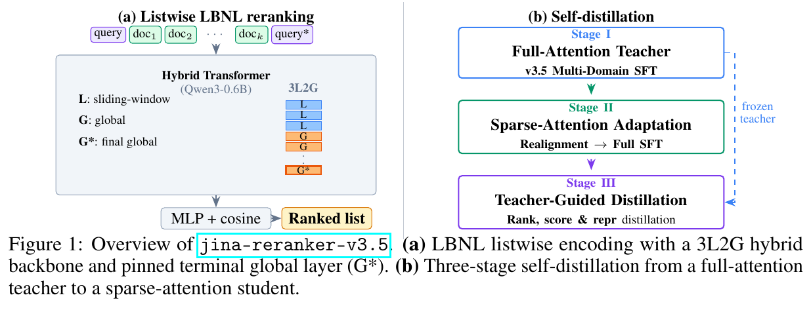

> 原文: [arXiv:2607.18152](https://arxiv.org/abs/2607.18152)（2026-07-20）
> 说明: 中英对照供阅读。英文为论文原文（HTML 转写，公式按论文整理）；中文为对应翻译。图表编号与原文一致。图从 [arXiv HTML](https://arxiv.org/html/2607.18152) 抽出（HTML 为内嵌 SVG，无独立 PNG 资源；`figs/*.svg` 为 HTML 原图，`figs/*.png` 为同图栅格）。caption 保留英文并附中译。数值原样。

**预印本：** arXiv:2607.18152v1 [cs.IR]，2026 年 7 月 20 日。CC BY-NC-SA 4.0。

**权重：** https://huggingface.co/jinaai/jina-reranker-v3.5 （非商用）

---

# jina-reranker-v3.5: An Efficient Listwise Reranker with Hybrid Attention and Self-Distillation

# jina-reranker-v3.5：带混合注意力与自蒸馏的高效列表级精排器

**Authors / 作者：** Christina Nasika, Feng Wang, Antonis Krasakis, Han Xiao

**Affiliation / 单位：** Jina AI by Elastic，33 New Montgomery Street, Floor 9, San Francisco, CA 94105, USA · research@jina.ai

---

## Abstract / 摘要

**EN.** Listwise rerankers are the discriminative core of agentic retrieval pipelines, yet production deployment demands efficiency, domain robustness, and fluency on semi-structured data at the same time. We present jina-reranker-v3.5, a 0.6B-parameter listwise reranker that meets these demands together without sacrificing the cross-document comparison that makes its predecessor jina-reranker-v3 effective. jina-reranker-v3.5 keeps the last-but-not-late (LBNL) interaction of jina-reranker-v3 and reworks it along three axes. It replaces uniform global attention with a hybrid schedule of three sliding-window layers followed by two global layers, pinning the terminal layer to global as LBNL readout requires. It trains on a curated multi-domain mixture that spans legal, medical, financial, multilingual, and structured retrieval. It transfers quality through a three-stage self-distillation recipe in which a full-attention teacher sets an upper bound that a sparse-attention student then recovers under a staged adaptation protocol. jina-reranker-v3.5 reaches 63.20 nDCG@10 on BEIR, matching a 4B model at roughly $7\times$ fewer parameters, and improves over jina-reranker-v3 on MIRACL and RTEB as well. Its largest gains come on semi-structured retrieval, where it lifts nDCG@10 by 9.6 points over jina-reranker-v3 and leads all rerankers of comparable size. The hybrid schedule further cuts listwise inference latency by up to $1.56\times$. We release the model weights on Hugging Face under a non-commercial license.

**中.** 列表级精排器是智能体检索流水线里真正「会判别」的核心，但要上线，效率、领域稳健、半结构化流畅这三件事必须同时成立。我们提出 **jina-reranker-v3.5**：0.6B 参数的列表精排，在保住前作 v3 之所以有效的**跨文档对照**的同时，把上述要求一起做掉。它沿用 v3 的 **LBNL（最后但不是迟）** 交互，并沿三条轴改写：（1）用「三层滑窗 + 两层全局」的混合课表替换层层全局注意力，并把**终端层钉死为全局**——因为 LBNL 读出需要；（2）在覆盖法律、医疗、金融、多语与结构化检索的精选多域混合物上训练；（3）用三阶段自蒸馏：全注意力老师先给出上限，稀疏注意力学生再按分阶段适应协议把质量捞回来。v3.5 在 BEIR 上达到 **63.20 nDCG@10**，以大约少 **7×** 的参数追上一个 4B 模型，并在 MIRACL、RTEB 上超过 v3。最大涨幅来自半结构化检索：相对 v3 提升 **9.6** 个 nDCG@10，并在同量级精排里领先。混合课表还把列表推理延迟最多砍到 **1.56×**。权重以非商用协议发布于 Hugging Face。

---

## Introduction / 引言

**EN.** Neural rerankers sit at the last stage of information retrieval pipelines. A first-stage retriever proposes a short candidate list, and the reranker reorders it under tight latency and memory budgets. As retrieval moves inside agentic systems that issue many queries over long-horizon tasks, the reranker is called repeatedly and its cost and reliability compound. A production reranker must therefore meet several demands that are easy to satisfy individually but hard to meet together. The first demand is efficiency. Listwise rerankers score many candidates in one forward pass, so full self-attention grows quadratically with the candidate list and inflates the key-value cache. The second is domain robustness. Legal, medical, financial, and e-commerce corpora diverge sharply from the web-scraped text that dominates standard training mixtures, and a model with top BEIR (Thakur et al. 2021) scores can still fail under domain-specific production conditions. The third is semi-structured data understanding. Much real content arrives as JSON records, data tables, and key-value fields, where relevance depends on matching a query to specific fields such as entities, dates, numeric ranges, and categorical attributes rather than on surface lexical overlap (Wu et al. 2024; Zhang et al. 2025a). The fourth is multilingual coverage, since production retrieval routinely spans mixed-language data (Zhang et al. 2023). jina-reranker-v3 (Wang et al. 2025) advanced listwise reranking through its last-but-not-late (LBNL) interaction. The query and all candidates form a single causal sequence, self-attention runs over this joint context, and a lightweight MLP then projects the contextual embeddings of special delimiter tokens into an output space where query and document vectors are compared by cosine similarity. Joint encoding gives LBNL in-context cross-document comparison, which late-interaction models such as ColBERT (Khattab and Zaharia 2020) lack because they encode passages independently. The 0.6B jina-reranker-v3 reached 62.10 nDCG@10 on BEIR, the state of the art at its scale.

**中.** 神经精排器坐在信息检索流水线的最后一站。一阶段检索器先给出短名单，精排器在很紧的延迟和显存预算下重排。检索一旦进到会在长程任务里连发许多查询的智能体系统，精排会被反复调用，成本和可靠性会叠乘。生产精排因此必须同时满足几件「分开都好做、合在一起很难」的事。第一是效率：列表精排一次前向给许多候选打分，全自注意力随名单平方增长，KV cache 也胀。第二是领域稳健：法律、医疗、金融、电商语料和主宰标准训练混合物的网页抓取文本差得很远，BEIR 很高的模型在领域生产条件下仍可能翻车。第三是半结构化理解：真实内容大量是 JSON、表、键值字段，相关与否取决于实体、日期、数值区间、类别属性对不对得上查询，而不是词面重叠。第四是多语，因为生产检索经常跨语言。jina-reranker-v3 用 LBNL 把列表精排往前推了一步：查询和全部候选组成一段因果序列，自注意力在这段联合上下文上跑，轻量 MLP 把特殊分隔符位置的上下文嵌入投到输出空间，再用余弦比查询向量和文档向量。联合编码给了 LBNL「上下文里的跨文档对照」；ColBERT 这类迟交互模型把段落独立编码，没有这一项。0.6B 的 v3 在 BEIR 上达到 62.10 nDCG@10，是该量级当时的最强。

**EN.** That model addresses only part of the deployment picture. It runs full global attention at every layer, trains mainly on general-domain retrieval, and sees little field-constrained ranking on semi-structured data. jina-reranker-v3.5 is a 0.6B LBNL successor that targets all four demands at once, improving efficiency, domain coverage, semi-structured understanding, and multilingual transfer without giving up listwise quality.

**中.** 那一版只覆盖了部署图景的一部分：每层都是全全局注意力，训练主要在通用检索上，半结构化的字段约束排序见得很少。v3.5 是 0.6B 的 LBNL 后继，四件事一起打：效率、领域覆盖、半结构化、多语迁移，同时不放弃列表质量。

**Caption EN.** Figure 1: Overview of jina-reranker-v3.5. (a) LBNL listwise encoding with a 3L2G hybrid backbone and pinned terminal global layer (G*). (b) Three-stage self-distillation from a full-attention teacher to a sparse-attention student.

**Caption 中.** 图 1：jina-reranker-v3.5 总览。(a) LBNL 列表编码，骨干为 3L2G 混合，终端全局层钉死为 G*。(b) 从全注意力老师到稀疏注意力学生的三阶段自蒸馏。

**EN.** Figure 1 summarizes the model architecture. Three coordinated changes distinguish jina-reranker-v3.5 from its predecessor. (i) A hybrid 3L2G attention schedule that repeats three sliding-window layers followed by two global layers, keeping the terminal global layer that LBNL interaction requires. (ii) A curated multi-domain training mixture that spans legal, medical, financial, multilingual, and semi-structured retrieval. (iii) A three-stage self-distillation recipe that starts from a similarly-sized full-attention teacher, adapts it under a sparse-attention mask, and distills the result into the hybrid-attention student.

**中.** 图 1 概括架构。相对前作有三处协同改动：（i）混合 3L2G 注意力课表：三层滑窗接两层全局，循环，并保留 LBNL 所需的终端全局层；（ii）精选多域训练混合物；（iii）三阶段自蒸馏：从同样大的全注意力老师出发，在稀疏 mask 下适应，再蒸进混合注意力学生。

**EN.** The distillation step is unusual in that we do not distill from a larger model into a smaller one. Teacher and student have the same size and differ only in attention pattern. The teacher is trained under full attention with its quadratic cost, and its behavior is distilled into a student that runs the more efficient 3L2G schedule. Decoupling the two problems this way spares the student from relearning its routing and matching the teacher’s output at the same time. jina-reranker-v3.5’s weights are available on Hugging Face for non-commercial use.

**中.** 蒸馏不寻常之处：不是大蒸小。老师和学生一样大，只在注意力模式上不同。老师付全注意力的平方代价，行为再蒸进跑更省的 3L2G 的学生。把两个问题拆开，学生就不必同时重学路由又对齐老师输出。权重在 Hugging Face 上供非商用。

---

## Related Work / 相关工作

**EN.** Neural reranking builds on the learning-to-rank tradition, whose pointwise, pairwise, and listwise objectives frame how candidate lists are scored (Burges et al. 2005; Li et al. 2007). Cross-encoders score query and document pairs jointly but need a separate forward pass per pair (Nogueira and Cho 2019; Déjean et al. 2024). ColBERT-style late-interaction models instead decouple encoding from matching and cache large multivector representations of queries and documents independently, at the cost of losing cross-document comparison and query-conditioned context (Khattab and Zaharia 2020; Liu et al. 2024; Jha et al. 2024). LBNL-interaction reranking combines joint encoding with cosine scoring, recovering cross-document and query awareness at moderate computational cost (Wang et al. 2025).

**中.** 神经精排建立在学习排序传统之上：逐点、成对、列表目标决定名单怎么打分。Cross-encoder 联合打 query–文档对，但每对要单独一次前向。ColBERT 式迟交互把编码和匹配拆开，独立缓存查询和文档的多向量，代价是丢掉跨文档对照和「以查询为条件」的上下文。LBNL 把联合编码和余弦打分合在一起，以中等算力恢复跨文档与查询感知。

**EN.** Efficient long-context transformers offer the mechanisms we build on to cut that cost. Sliding-window and local-global attention reduce the quadratic complexity of self-attention (Beltagy et al. 2020; Jiang et al. 2023), and Gemma 3 shows that interleaving local and global layers in a fixed ratio preserves long-context language modeling quality (Gemma Team 2025). Our setting differs from these generative models in two ways that shape the design. A reranker has no autoregressive output budget to amortize its context over, and LBNL interaction requires the final layer to remain global so the trailing query embedding can observe the entire candidate list. This readout constraint is absent in generative language modeling and distinguishes our hybrid backbone from prior local-global systems.

**中.** 高效长上下文 Transformer 提供了降本的机构：滑窗与局部–全局注意力降低平方复杂度；Gemma 3 表明按固定比例交错局部/全局层能保住长上下文语言建模质量。我们的设定和这些生成模型有两处不同，直接塑形了设计：精排没有自回归输出预算来摊销上下文；LBNL 要求**最后一层保持全局**，好让末尾的查询嵌入看见整份名单。这种读出约束在生成式语言模型里不存在，也把我们的混合骨干和以往局部–全局系统分开。

**EN.** Knowledge distillation under capacity mismatch is the second body of work we draw on. Distillation is a standard route to model compression (Hinton et al. 2015; Agarwal et al. 2024), but naive direct transfer underperforms when student and teacher are structurally mismatched (Mirzadeh et al. 2020). Prior work bridges size gaps with an intermediate teacher assistant (Mirzadeh et al. 2020). Our mismatch is not size but attention pattern, and our three-stage recipe plays the assistant role with the student itself at an intermediate training phase, adapting under the sparse mask before matching teacher outputs.

**中.** 能力不匹配下的知识蒸馏是第二条线索。蒸馏是压缩的常规路，但师生结构不匹配时，直接硬蒸会差。前人用中间「助教」填尺寸鸿沟。我们的不匹配不是尺寸而是注意力模式；三阶段配方让**学生自己在中间训练阶段扮演助教**：先在稀疏 mask 下适应，再对齐老师输出。

**EN.** Domain-specific and field-constrained retrieval motivates the training mixture. The RTEB benchmark suite shows that unspecialized rerankers degrade on legal, medical, and financial text (MTEB Contributors 2025), and they also fall short on the STARK (Wu et al. 2024) and Struct-IR (Zhang et al. 2025a) benchmarks over product catalogs and knowledge graphs. These benchmarks are usually treated as evaluation targets. We instead use them to diagnose failure modes and curate training data that addresses the shortcomings they expose.

**中.** 领域与字段约束检索驱动训练混合物。RTEB 表明未特化的精排在法律、医疗、金融文本上会掉点；STARK、Struct-IR 上对商品目录和知识图谱也不够。这些基准通常只当考卷。我们拿它们来诊断失败模式，并据此精选能补这些短板的训练数据。

---

## Method / 方法

### Hybrid Attention for LBNL Reranking / 面向 LBNL 精排的混合注意力

**EN.** We briefly recap the jina-reranker-v3 interface that jina-reranker-v3.5 inherits, with full details in Wang et al. 2025. Given query $q$ and candidates $\{d_i\}_{i=1}^{k}$, a listwise prompt concatenates all passages with delimiter tokens and places the query in a trailing block. Causal self-attention over the full sequence produces contextual embeddings $\tilde{\mathbf{q}}$ and $\{\tilde{\mathbf{d}}_i\}$ at the special token positions; these are projected by a two-layer MLP $P_\phi$ into a 512-dimensional space and scored by cosine similarity:

$$
s_i=\cos\bigl(P_\phi(\tilde{\mathbf{q}}),\;P_\phi(\tilde{\mathbf{d}}_i)\bigr).
$$

The model is trained with an InfoNCE listwise ranking loss and auxiliary dispersive, dual-matching, and similarity objectives (Wang et al. 2025; van den Oord et al. 2019; Huang et al. 2024; Wang et al. 2024).

**中.** 先短复习 v3.5 继承的 v3 接口。给定查询 $q$ 和候选 $\{d_i\}_{i=1}^{k}$，列表提示把所有段落用分隔符拼起来，查询放在末尾块。整段上的因果自注意力在特殊 token 位置得到 $\tilde{\mathbf{q}}$ 与 $\{\tilde{\mathbf{d}}_i\}$；两层 MLP $P_\phi$ 投到 512 维，再余弦打分（上式）。训练用 InfoNCE 列表排序损失，外加分散、双匹配、相似度辅助目标。

**EN.** The pinned terminal global layer is the central architectural constraint of jina-reranker-v3.5. Full self-attention at all 28 layers dominates compute when candidate lists are long, and the natural response is to replace most layers with sliding-window attention. The LBNL readout forbids a uniform switch. The query embedding token sits at the end of the concatenated sequence and must attend back to the first candidate to form a cross-document-aware representation, and a finite window $w$ severs that long-range dependency. We therefore keep the final layer global at all times, so the query and document embedding tokens observe the entire candidate context at the point of extraction. We call this the pinned terminal global layer, shown as G* in Figure 1(a). Replacing it with a sliding window severely degraded listwise ranking because the trailing query embedding could no longer observe early candidates, whereas keeping only the final layer global preserved joint encoding without a fully global stack.

**中.** **钉死的终端全局层**是 v3.5 的中心架构约束。28 层全自注意力在名单一长时会主导算力，自然反应是把多数层换成滑窗。LBNL 读出禁止「一刀切」。查询嵌入 token 坐在拼接序列末尾，必须回头看到第一篇候选才能形成跨文档感知表示；有限窗口 $w$ 会切断这条长程依赖。因此最后一层始终全局，抽取时查询和文档嵌入 token 能看见全部候选上下文。这称为钉死的终端全局层，图 1(a) 里标成 G*。把它改成滑窗会严重损害列表排序，因为末尾查询再也看不见靠前的候选；只保留最后一层全局，则不必整栈全局也能保住联合编码。

**EN.** Beyond the terminal layer, we searched over local-to-global ratios in the remaining 27 layers, comparing 1L1G, 1L2G, 3L2G, and 5L1G schedules on held-out development sets. The 3L2G schedule repeats three consecutive sliding-window layers followed by two global layers, and it gave the best accuracy and efficiency trade-off. Under 3L2G the 28-layer backbone contains 17 local and 11 global layers with a sliding-window span of $w=1024$ tokens. Local layers reduce attention complexity from $\mathcal{O}(L^{2})$ to $\mathcal{O}(L\cdot w)$ per layer, while the global layers placed every three steps periodically refresh long-range cross-candidate signals throughout the network depth. Distributing the global layers uniformly preserves information flow at every depth, which we found preferable to front-loading or back-loading them. Denser schedules such as 1L1G and 1L2G gave little throughput benefit, and the more aggressive 5L1G trended worse on complex multi-document tasks, leaving 3L2G as the best point for latency and KV-cache savings.

**中.** 终端层之外，我们在其余 27 层上搜局部/全局比，比较 1L1G、1L2G、3L2G、5L1G。3L2G（三层连续滑窗接两层全局，循环）精度–效率最好。28 层骨干里 17 局部 + 11 全局，窗宽 $w=1024$。局部层把每层注意力从 $\mathcal{O}(L^2)$ 降到 $\mathcal{O}(L\cdot w)$；全局层每隔三步出现，在整个深度上定期刷新跨候选的远信号。全局层均匀铺开，比堆在开头或结尾更能保住信息流。更密的 1L1G / 1L2G 几乎不涨吞吐；更狠的 5L1G 在复杂多文档任务上变差。故 3L2G 是延迟和 KV cache 节省的最优点。

### Multi-Domain Training Mixture / 多域训练混合物

**EN.** Our curation follows a failure-mode-first principle rather than a data-volume one. The jina-reranker-v3 mixture already covers general retrieval well but underrepresents specialized domains, so each new shard is built to cover the retrieval patterns that general models fail on, identified through error analysis on the RTEB and STARK development sets. To prevent shortcut learning we source hard negatives from several retrievers, including BM25, Jina, BGE, GTE, E5, and ColBERT. For domains with sparse relevance labels we synthesize queries with an LLM conditioned on passage content and domain-specific relevance rubrics.

**中.** 精选遵循**失败模式优先**，而不是数据量优先。v3 混合物的通用检索已经够用，专业域代表不足；每个新 shard 对着通用模型会失败的检索模式来建，模式来自 RTEB 与 STARK 开发集的错误分析。为防捷径学习，难负例来自 BM25、Jina、BGE、GTE、E5、ColBERT 多个检索器。标注稀的领域，用 LLM 以段落内容和领域相关性量规为条件合成查询。

**EN.** The legal shard combines EUR-Lex multilingual, CLERC, AILA, Canadian case law, Swiss case summarization, and EuroVoc with LLM-generated user queries and jurisdiction-specific hard negatives. Legal text is citation-dense and long, so we oversample these shards to compensate for their higher annotation complexity. The medical shard draws on MIRIAD-style dialogue, biomedical citation retrieval, PubMed GPL negatives, and CMedQA-style Chinese medical QA from the BGE mixture, targeting clinical wording and entity-heavy passages. The finance shard uses FiQA investment forum QA, financial QA benchmarks, and table-aware passages from the RTEB finance tasks, prioritizing numeric claims, regulatory language, and structured financial records.

**中.** 法律片：EUR-Lex 多语、CLERC、AILA、加拿大判例、瑞士判例摘要、EuroVoc，配 LLM 生成的用户查询和管辖区特异难负例。法律文本引用密、篇幅长，故过采样以补偿更高的标注复杂度。医疗片：MIRIAD 风格对话、生物医学引文检索、PubMed GPL 负例、BGE 混合物里的 CMedQA 风格中文医问，瞄准临床措辞和实体密集段落。金融片：FiQA 投资论坛 QA、金融 QA 基准、RTEB 金融任务里的表感知段落，优先数字主张、监管用语和结构化财务记录。

**EN.** Structured data receives the most attention because it falls outside the free-text distribution of standard benchmarks, so we treat it as a dedicated shard. STARK entity attributes (Wu et al. 2024), serialized as flat records rather than relational graphs, and Struct-IR (Zhang et al. 2025a) supply field-level ranking over heterogeneous schemas. Table sources from Open-WikiTable, NQ-Tables, OTT-QA, ESCI, TabFact, TAT-QA, SQA, WikiTableQuestions, and HybridQA add cell-level supervision. Relevance here hinges on equality, numeric and date bounds, list membership, and logical combinations across fields rather than bag-of-words overlap. Early runs lagged most on this slice, so we assign it the highest sampling weight and synthesize additional constraint-heavy pairs, illustrated in Figure 2. The pipeline samples typed constraints from an anchor record and paraphrases them into a query, perturbs one or two constrained fields to form a near-duplicate hard negative, dense-mines further candidates, and finally has an LLM judge the list to promote true matches, refine over-broad queries, and discard ambiguous cases.

**中.** 结构化数据得到最多关注，因为它落在标准基准的自由文本分布之外，故单独成片。STARK 实体属性被序列化成扁平记录而非关系图，与 Struct-IR 一起提供异构 schema 上的字段级排序。表来源（Open-WikiTable、NQ-Tables、OTT-QA、ESCI、TabFact、TAT-QA、SQA、WikiTableQuestions、HybridQA）补单元格级监督。这里的相关取决于相等、数值/日期上下界、列表成员、跨字段逻辑组合，而不是词袋重叠。早期 run 在这片上落后最多，故给最高采样权重，并额外合成重约束对，见图 2。流水线从锚点记录采样类型化约束并改写成查询，扰动一两个被约束字段得到近复制难负例，稠密再挖候选，最后让 LLM 评判名单：晋升真匹配、改写过宽查询、丢弃含糊样本。

**Caption EN.** Figure 2: Constraint-heavy synthetic data for Struct-IR. Left: (i) constraints → query, (ii) perturb hard negative, (iii) dense-mine, (iv) LLM-judge with a promote/refine/discard feedback loop. Right: near-duplicate positive vs. hard negative differing by one field.

**Caption 中.** 图 2：面向 Struct-IR 的重约束合成数据。左：(i) 约束 → 查询；(ii) 扰动难负例；(iii) 稠密再挖；(iv) LLM 评判，晋升/改写/丢弃闭环。右：只差一个字段的近复制正例 vs 难负例。

**EN.** Multilingual coverage extends beyond the MIRACL and mMARCO shards used for jina-reranker-v3. We add WebFAQ contexts in more than 50 languages, SWIMIR cross-lingual hard negatives, Ruri-v3 Japanese reranker pairs, and refreshed MIRACL hard-negative sets reranked with jina-embeddings-v5-text-small.

**中.** 多语覆盖超出 v3 用的 MIRACL 与 mMARCO：加入 50 种以上语言的 WebFAQ 上下文、SWIM-IR 跨语难负例、Ruri-v3 日语精排对，以及用 jina-embeddings-v5-text-small 重排过的 MIRACL 难负例集。

### Three-Stage Self-Distillation / 三阶段自蒸馏

**EN.** The three stages address a single challenge. The full-attention teacher and the sparse-attention student have different information-routing capacities, so forcing a direct attention-mask switch while also matching the teacher’s output distributions makes the student underperform on both ranking quality and representation alignment. Our recipe decouples these two pressures, as shown in Figure 1(b).

**中.** 三阶段只解决一个挑战：全注意力老师和稀疏注意力学生的信息路由能力不同，强迫直接切 mask 同时又对齐老师输出分布，会让学生在排序质量和表示对齐上两头差。配方把这两种压力拆开，见图 1(b)。

**EN.** Stage I trains a full-attention teacher. Starting from the public jina-reranker-v3 checkpoint, we fully fine-tune jina-reranker-v3.5-teacher without any sliding-window restrictions, using the complete data mixture from Section 3.2 with domain-tuned sampling rates. The teacher establishes a quality upper bound, since its listwise scores under full attention on the v3.5 data distribution represent the best achievable performance at this parameter budget.

**中.** 阶段 I 训全注意力老师。从公开 v3 检查点出发，无滑窗限制地全参微调 jina-reranker-v3.5-teacher，数据为上一节完整混合物并按域调采样率。老师给出质量上限：在该参数预算下，全注意力、v3.5 数据分布上的列表分数即所能达到的最好。

**EN.** Stage II adapts a student to sparse attention. We initialize the student from the Stage I weights and activate the 3L2G attention pattern, then adapt in two sub-stages. The first sub-stage, attention realignment, trains only the attention projection matrices while the MLP, embedding, and head layers stay frozen, which teaches the sparse masks to route information efficiently without disrupting the representations learned under full attention. The second sub-stage unfreezes all parameters, optionally with LoRA on selected linear layers, and lets the student realign its intermediate representations to the new attention geometry. After Stage II the student is already deployable and faster than the teacher, but development evaluations still show a consistent quality gap on BEIR, RTEB-legal, and MIRACL.

**中.** 阶段 II 让学生适应稀疏注意力。用阶段 I 权重初始化并打开 3L2G，再分两小段。第一段注意力重对齐：只训注意力投影，冻住 MLP、embedding 和头，让稀疏 mask 学会高效路由，同时不拆掉全注意力下学到的表示。第二段解冻全部参数（可选在部分线性层上 LoRA），让学生把中间表示贴到新的注意力几何上。阶段 II 之后学生已经可部署且快于老师，但开发集上 BEIR、RTEB-legal、MIRACL 仍有稳定质量缺口。

**EN.** Stage III closes that gap through teacher-guided distillation. With jina-reranker-v3.5-teacher frozen, we continue training the Stage II student under a multi-level objective that aligns it to the teacher across output scores and intermediate representation geometries, combined with self-supervised auxiliary regularization:

$$
\mathcal{L}=\mathcal{L}_{\mathrm{rank}}+\beta_1\mathcal{L}_{\mathrm{score}}+\beta_2\mathcal{L}_{\mathrm{state}}+\beta_3\mathcal{L}_{\mathrm{embed}}+\alpha_1\mathcal{L}_{\mathrm{sim}}+\alpha_2\mathcal{L}_{\mathrm{disp}}
$$

**中.** 阶段 III 用老师引导的蒸馏补缺口。老师冻结，继续训阶段 II 学生，目标在输出分数和中间表示几何上多层对齐，并加自监督辅助正则（上式）。

各蒸馏项（原文公式 (3)–(6)）：

- **Rank-level** $\mathcal{L}_{\mathrm{rank}}$：列表上 $\mathrm{KL}(\mathrm{Softmax}(\mathbf{s}_{\mathrm{tch}}/\tau)\,\|\,\mathrm{Softmax}(\mathbf{s}_{\mathrm{std}}/\tau))$，保相对名次，对分数尺度不变；$\tau=0.25$。
- **Score-level** $\mathcal{L}_{\mathrm{score}}$：$\frac{1}{K}\sum_i (s_{\mathrm{std},i}-s_{\mathrm{tch},i})^2$，保绝对尺度与间隔；$\beta_1=0.65$。
- **State-level** $\mathcal{L}_{\mathrm{state}}$：末层隐状态 $\mathbf{h}_t$ 的 MSE，$\frac{1}{T\cdot H}\sum_t \|\mathbf{h}_{\mathrm{std},t}-\mathbf{h}_{\mathrm{tch},t}\|_2^2$；$\beta_2=0.65$。
- **Embedding cosine** $\mathcal{L}_{\mathrm{embed}}$：$1-\frac{1}{1+K}\sum_j \cos(\mathbf{e}_{\mathrm{std},j},\mathbf{e}_{\mathrm{tch},j})$，含 query 与文档 token；$\beta_3=0.65$。
- **Auxiliary** $\mathcal{L}_{\mathrm{sim}}$（上下文块相似分类，$\alpha_1=0.65$）、$\mathcal{L}_{\mathrm{disp}}$（token 嵌入分散，$\alpha_2=0.25$）。

**EN.** This purely teacher-guided multi-level formulation updates the student parameters to mimic the teacher’s entire representation hierarchy, and we cache teacher forward passes where possible to reduce per-step overhead. We train several domain-specific distillation runs independently, covering a default mixture together with BGE-heavy, legal-heavy, and long-document MLDR variants, and merge them by linear interpolation with weights tuned on development RTEB and BEIR nano subsets. Stage III recovers the performance gap between the Stage II student and the Stage I teacher, transferring teacher knowledge across mismatched attention geometries. The ordering matters. Stage II on its own, activating 3L2G without teacher matching, leaves a noticeable gap to the teacher because the student must change its routing under a weaker mask before it can safely match teacher scores and states. Stage III then recovers most of that gap, which shows that full-attention capacity can transfer into a sparse student once the geometry has adapted.

**中.** 这一纯老师引导的多层目标让学生模仿老师的整条表示层级；老师前向能缓存就缓存。默认混合物、BGE 偏重、法律偏重、长文 MLDR 等分域独立蒸，再按开发集 RTEB 与 BEIR nano 调权后线性插值合并。阶段 III 补上阶段 II 学生相对阶段 I 老师的缺口，把老师知识搬过不匹配的注意力几何。**顺序重要**：只做阶段 II、不对齐老师，缺口仍明显，因为学生必须先在更弱的 mask 下改路由，才能安全对齐老师分数和状态。阶段 III 再收回大部分缺口，说明几何适应之后，全注意力能力可以迁进稀疏学生。

**EN.** All stages use FlashAttention-2, bf16 precision, listwise batches of up to 50 documents, and 30 to 45 hard negatives per query. Stage I uses a learning rate of $6\times10^{-6}$ for up to 25k steps. Stage II follows a two-phase schedule with an attention-only warmup at $5\times10^{-5}$ and then full-parameter tuning at $6\times10^{-6}$, for up to 15k plus 15k steps. Stage III uses $5\times10^{-5}$ for 5k to 25k steps depending on the domain shard. The distillation temperature $\tau$ ranges from 0.05 to 0.25 across stages. We apply random document-ID and position-ID perturbations throughout to improve listwise robustness (Wang et al. 2025).

**中.** 各阶段均用 FlashAttention-2、bf16，列表 batch 最多 50 篇，每 query 30–45 个难负例。阶段 I：$6\times10^{-6}$，最多 25k step。阶段 II：注意力-only 热身 $5\times10^{-5}$，再全参 $6\times10^{-6}$，各最多 15k。阶段 III：$5\times10^{-5}$，按域 shard 5k–25k。温度 $\tau$ 跨阶段 0.05–0.25。全程随机扰动文档 ID 与位置 ID，增强列表稳健性。

---

## Evaluation / 实验

### Experimental Setup / 设置

**EN.** We evaluate across general, multilingual, domain-specific, and structured retrieval regimes. BEIR tests zero-shot English generalization across 13 heterogeneous datasets; MIRACL covers 18 languages; RTEB targets professional-domain corpora in legal, finance, programming, and medicine; and STARK and Struct-IR evaluate structured and field-constrained retrieval. Unless noted otherwise, top-100 candidates are retrieved with jina-embeddings-v5-text-small and reranked listwise. Task-specific LoRA adapters are enabled for ArguAna and Quora. All baselines are re-evaluated under this unified MTEB v2 pipeline; numbers may differ slightly from prior reports. Baselines include jina-reranker-v3, Qwen3-Reranker-0.6B, Qwen3-Reranker-4B, mxbai-rerank-base-v2, and mxbai-rerank-large-v2. We report nDCG@10 everywhere. Efficiency measurements use a single NVIDIA A100, batch size 1, and top-100 listwise reranking with FlashAttention-2.

**中.** 评测覆盖通用、多语、专业域、结构化四类。BEIR：13 个异构集上的英文零样本；MIRACL：18 语；RTEB：法律、金融、编程、医疗；STARK 与 Struct-IR：结构化与字段约束。除非另说，用 jina-embeddings-v5-text-small 取 top-100 再列表精排。ArguAna、Quora 开任务 LoRA。全部基线在统一 MTEB v2 流水线重测，可能与先前报告略有出入。指标一律 nDCG@10。效率：单卡 A100、batch=1、top-100、FlashAttention-2。

### Overall Results / 总体结果

**EN.** jina-reranker-v3.5 improves on its predecessor across every benchmark family while keeping the same parameter count and inference interface. Table 1 reports the macro results. On BEIR it reaches 63.20 nDCG@10 against 62.10 for jina-reranker-v3, and it also edges past the 4B Qwen3-Reranker-4B at 62.28 with roughly $7\times$ fewer parameters. On MIRACL it sets the best score among 0.6B models at 74.11, ahead of 72.20 for jina-reranker-v3 and 67.12 for Qwen3-Reranker-0.6B, though it still trails the four times larger Qwen3-Reranker-4B at 76.56. RTEB favors compact specialization more strongly. Here jina-reranker-v3.5 reaches 70.95, lifting jina-reranker-v3 by 2.9 absolute points and exceeding both the same-size Qwen at 68.41 and the 1.5B mxbai at 70.81. The remaining gap to Qwen3-Reranker-4B at 77.68 concentrates on a few legal and medical tasks.

**中.** v3.5 在每一族基准上都超过前作，参数量和推理接口不变。BEIR 63.20 vs v3 的 62.10，并以大约少 7× 的参数略过 4B Qwen 的 62.28。MIRACL 在 0.6B 里最好（74.11），仍落后 4B 的 76.56。RTEB 更奖「小而专」：70.95，相对 v3 +2.9，超过同尺寸 Qwen 与 1.5B mxbai；相对 4B 的 77.68，缺口集中在少数法律和医疗题。

**Table 1 / 表 1.** Overall reranking performance (nDCG@10, %). Struct-IR † uses the controlled-pool protocol. ‡ RTEB excludes the MIRACL average. Best in bold, second underlined (first-stage excluded).

| Model | # Param | BEIR | MIRACL | RTEB ‡ | Struct-IR † |
| --- | ---: | ---: | ---: | ---: | ---: |
| jina-embeddings-v5-text-small | 0.5B | 56.26 | 65.15 | 64.60 | – |
| Qwen3-Reranker-0.6B | 0.6B | 56.94 | 67.12 | 68.41 | 41.9 |
| Qwen3-Reranker-4B | 4.0B | 62.28 | **76.56** | **77.68** | **55.6** |
| mxbai-rerank-base-v2 | 0.5B | 59.58 | 64.90 | 61.44 | 30.4 |
| mxbai-rerank-large-v2 | 1.5B | 62.45 | 69.65 | 70.81 | 43.0 |
| jina-reranker-v3 | 0.6B | 62.10 | 72.20 | 68.01 | 38.7 |
| jina-reranker-v3.5 | 0.6B | **63.20** | 74.11 | 70.95 | 48.3 |

### Multilingual / 多语

**EN.** MIRACL covers 18 languages with varying resource levels. jina-reranker-v3.5 improves the MIRACL average from 72.20 to 74.11 nDCG@10 (+2.6% relative) over jina-reranker-v3, with the largest absolute gains on Yoruba (+4.4), Farsi (+3.1), and French (+3.0). These lifts track the multilingual expansion beyond the MIRACL / mMARCO shards of jina-reranker-v3. Indonesian, French, and Spanish remain among the hardest languages by absolute score across models, while Telugu, Thai, and Yoruba score consistently highest. Per-language scores appear in Appendix B.

**中.** MIRACL 18 语、资源不一。均分 72.20 → 74.11（相对 +2.6%）；绝对涨幅最大：约鲁巴 +4.4、波斯 +3.1、法语 +3.0，与多语扩料一致。印尼、法、西绝对值跨模型都难；泰卢固、泰、约鲁巴一贯最高。分语见表 7。

### Domain-specific / 专业域

**EN.** The largest gains over jina-reranker-v3 concentrate on the legal case-law tasks that the training mixture was designed to cover. AILA-Statute and AILA-Case improve by 14.0 and 11.7 absolute points. On LegalQuAD, where jina-reranker-v3 is already strong, the two stay within 1.3 points. Finance and programming move up more modestly but consistently. On most of these columns jina-reranker-v3.5 places second behind either the 4B Qwen3-Reranker-4B or mxbai-rerank-large-v2, and it overtakes both on FinQA at 86.91. Medical lifts are smaller, with ChatDoctor up 1.0 point and CUREv1 essentially tied with jina-reranker-v3. Aggregated, these per-task gains raise the RTEB macro from 68.01 to 70.95. Domain-targeted training at 0.6B thus closes a substantial fraction of the specialization gap without matching the largest generalist.

**中.** 相对 v3 的最大涨幅集中在配料对准的判例任务：AILA-Statute / AILA-Case 分别 +14.0 / +11.7。LegalQuAD 上 v3 已强，两者相差 1.3 以内。金融与编程温和但稳定上涨。多数列上 v3.5 排第二，落后 4B Qwen 或 mxbai-large；FinQA 86.91 超过二者。医疗涨幅小：ChatDoctor +1.0，CUREv1 与 v3 基本持平。合计把 RTEB 宏均从 68.01 抬到 70.95。0.6B 上的定向训练能补上相当一部分特化缺口，但还不等于最大通用模型。

**Table 2 / 表 2**（nDCG@10, %；节选与全文表同论文）：

| Domain | Dataset | v5-s 1st | mxbai base | mxbai large | Qwen 0.6B | Qwen 4B | v3 | v3.5 |
| --- | --- | ---: | ---: | ---: | ---: | ---: | ---: | ---: |
| Legal | AILA-C | 44.77 | 25.91 | 44.77 | 37.31 | 48.42 | 20.82 | 32.55 |
| | AILA-S | 53.16 | 34.64 | 43.90 | 88.90 | 91.06 | 32.15 | 46.16 |
| | LegalSum | 64.70 | 67.76 | 71.48 | 67.60 | 72.00 | 69.64 | 70.99 |
| | LegalQuAD | 63.11 | 46.75 | 78.55 | 88.84 | 89.27 | 81.84 | 83.09 |
| Finance | FinBench | 80.76 | 77.64 | 81.49 | 80.68 | 88.14 | 83.43 | 84.85 |
| | HC3Fin | 62.17 | 52.40 | 59.54 | 54.10 | 68.53 | 62.74 | 64.07 |
| | FinQA | 55.63 | 82.97 | 86.89 | 81.92 | 85.92 | 85.87 | 86.91 |
| Programming | Apps | 73.22 | 39.68 | 69.30 | 59.94 | 89.90 | 74.94 | 76.57 |
| | DS1000 | 61.25 | 62.00 | 67.59 | 55.43 | 63.30 | 61.94 | 66.20 |
| | HumanEval | 96.08 | 94.46 | 99.22 | 93.74 | 97.97 | 98.81 | 98.11 |
| | MBPP | 90.51 | 89.01 | 92.88 | 80.27 | 88.59 | 91.64 | 91.84 |
| | WikiSQL | 93.82 | 99.00 | 99.25 | 90.77 | 98.51 | 99.02 | 99.14 |
| | FreshStack | 39.20 | 30.88 | 34.65 | 36.91 | 46.51 | 25.69 | 31.01 |
| Medical | ChatDoctor | 71.10 | 64.53 | 71.52 | 64.41 | 73.38 | 69.63 | 70.63 |
| | CURE-AVG | 51.92 | 53.97 | 61.05 | 45.33 | 63.68 | 62.04 | 62.20 |
| | CURE-en | 55.71 | 60.02 | 65.56 | 51.81 | 66.73 | 65.58 | 65.46 |
| | CURE-es | 50.78 | 51.36 | 58.66 | 42.41 | 62.16 | 61.05 | 61.12 |
| | CURE-fr | 49.26 | 50.52 | 58.93 | 41.78 | 62.16 | 59.48 | 60.01 |

### Structured retrieval / 结构化检索

**EN.** Both Struct-IR and STARK were designed for first-stage retrieval, so we adapt them to a reranking setting and are explicit about the recall regime each measures. The Struct-IR benchmark indexes millions of semi-structured objects per schema, and a first-stage retriever alone recovers few gold documents, with in-schema Recall@5 around 0.04 for jina-embeddings-v5-text-small. End-to-end retrieve-then-rerank is therefore almost entirely recall-bound and separates rerankers poorly. We instead evaluate under a controlled candidate pool. For each query we inject all gold documents alongside the 30 hardest first-stage distractors, which guarantees gold presence and measures field-constrained discrimination rather than retrieval coverage. This protocol is not comparable to the SSRB retrieval leaderboard.

**中.** 两个结构化基准原本为一阶段检索设计，我们改成精排设定并写明各自测的召回体制。Struct-IR 每个 schema 索引百万级半结构化对象，一阶段几乎捞不回金标（v5-text-small 的 in-schema Recall@5 约 0.04）。端到端 retrieve-then-rerank 几乎被召回绑死，分不出精排。我们改用受控候选池：每条 query 注入全部金标 + 30 个最难一阶段干扰项，保证金标在场，测的是字段约束判别而非检索覆盖。**不可与 SSRB 检索榜相比**。

**EN.** Under this setting jina-reranker-v3.5 reaches macro Recall@5 and nDCG@10 of 23.1 and 48.3, improving over jina-reranker-v3 by 5.2 and 9.6 absolute points and taking second place across every domain. Only the 4B Qwen3-Reranker-4B scores higher at 26.4 and 55.6. The largest relative gains over jina-reranker-v3 appear on HR, LLM-Agent, and Resume. On Resume, jina-reranker-v3.5 ties Qwen3-Reranker-4B at the best Recall@5 (20.5).

**中.** 此设定下宏均 Recall@5 / nDCG@10 = 23.1 / 48.3，相对 v3 +5.2 / +9.6，每个域都排第二；只有 4B Qwen 更高（26.4 / 55.6）。相对 v3 涨幅最大在 HR、LLM-Agent、Resume。Resume 上 Recall@5 与 4B 打平（20.5）。

**Table 3 / 表 3.** Struct-IR controlled-pool (Recall@5 / nDCG@10, %).

| Model | AVG R@5 | AVG nD@10 | Academic | Finance | HR | LLM-Agent | Product | Resume |
| --- | ---: | ---: | ---: | ---: | ---: | ---: | ---: | ---: |
| mxbai-large | 19.5 | 43.0 | 15.7/46.8 | 19.7/43.0 | 22.9/49.7 | 28.3/51.0 | 13.8/34.4 | 15.1/32.5 |
| Qwen3-0.6B | 18.3 | 41.9 | 15.8/48.2 | 17.9/40.7 | 22.0/47.9 | 24.0/45.3 | 14.4/35.4 | 14.7/33.9 |
| Qwen3-4B | **26.4** | **55.6** | 22.6/62.9 | 27.2/56.3 | 28.7/60.1 | 36.6/64.7 | 21.7/47.1 | 20.5/42.0 |
| jina-v3 | 17.9 | 38.7 | 15.8/44.0 | 19.6/38.2 | 21.1/43.7 | 23.6/42.7 | 13.7/34.4 | 12.5/28.7 |
| jina-v3.5 | 23.1 | 48.3 | 18.6/52.7 | 22.5/44.3 | 26.5/56.4 | 34.1/58.1 | 14.8/36.4 | 20.5/41.3 |

**EN.** STARK is a benchmark for retrieval over semi-structured knowledge bases. Following the official protocol, we render each candidate entity together with its relational context and rerank the top-100 candidates from jina-embeddings-v5-text-small. Because each query has only one or a few correct entities, we report Hit@$k$ and MRR, macro-averaged over Amazon, MAG, and Prime. jina-reranker-v3.5 improves over jina-reranker-v3 on all three official metrics (Hit@1 43.4→45.0, Hit@5 63.6→65.4, MRR 53.2→53.8). It attains the best Hit@5 overall and leads on MAG across the board. It stays competitive with mxbai-rerank-large-v2 while clearly outperforming both Qwen3 rerankers and mxbai-base.

**中.** STARK 测半结构化知识库。按官方协议把实体及其关系上下文渲染成文，对 v5-text-small 的 top-100 精排。每条 query 只有一两个正确实体，故报 Hit@$k$ 与 MRR，在 Amazon / MAG / Prime 上宏均。v3.5 三项都过 v3；Hit@5 全场最好，MAG 全面领先。与 mxbai-large 接近，明显强于两条 Qwen 与 mxbai-base。

**Table 4 / 表 4.** STARK (Hit@1 / Hit@5 / MRR, %).

| Model | AVG H@1 | H@5 | MRR | Amazon | MAG | Prime |
| --- | ---: | ---: | ---: | ---: | ---: | ---: |
| mxbai-base | 39.0 | 58.7 | 47.8 | 37.0/66.7/50.1 | 45.2/52.4/48.7 | 34.7/57.1/44.4 |
| mxbai-large | **46.2** | 62.6 | 53.4 | 58.0/75.3/65.2 | 42.9/51.2/46.7 | 37.8/61.2/48.4 |
| Qwen3-0.6B | 30.5 | 51.3 | 40.2 | 40.7/67.9/53.4 | 34.5/45.2/39.7 | 16.3/40.8/27.5 |
| Qwen3-4B | 32.5 | 54.1 | 42.1 | 42.0/70.4/54.5 | 39.3/51.2/44.2 | 16.3/40.8/27.5 |
| jina-v3 | 43.4 | 63.6 | 53.2 | 46.9/76.5/61.1 | 46.4/56.0/51.0 | 36.7/58.2/47.4 |
| jina-v3.5 | 45.0 | **65.4** | **53.8** | 48.1/77.8/61.6 | 50.0/57.1/52.8 | 36.7/61.2/47.1 |

### Inference Efficiency / 推理效率

**EN.** The 3L2G schedule with window $w=1024$ reduces per-layer attention cost from $\mathcal{O}(L^2)$ to $\mathcal{O}(L\cdot w)$ on the 17 local layers, so the relative savings should grow with concatenated listwise sequence length $L$. We measure two regimes that share ranking depth but differ sharply in token length. The short-context regime uses BEIR Natural Questions (mean query/document 10.3 / 145.5 tokens, 254 queries). The long-context regime uses RTEB AILACasedocs (689.8 / 1,904.0 tokens, 48 queries). On NQ, mean latency falls from 371 ms to 305 ms ($1.22\times$) and document throughput rises from 270 to 328 docs/s. On AILACasedocs the same model yields a much larger gain, 16.1 s → 10.3 s ($1.56\times$), prefill 11.9k → 18.6k tokens/s. Hybrid attention thus pays off most when candidate passages are long. Because production listwise reranking is dominated by a single prefill over a fresh candidate set, these latency reductions directly expand feasible list length and document size at fixed serving budget.

**中.** 17 个局部层上注意力从 $\mathcal{O}(L^2)$ 降到 $\mathcal{O}(L\cdot w)$，相对节省应随拼接列表长度 $L$ 增大。短上下文：NQ；长上下文：AILA 判例。NQ：371→305 ms（1.22×），270→328 docs/s。判例：16.1→10.3 s（1.56×），prefill 11.9k→18.6k tok/s。候选一长，混合注意力最赚。生产列表精排几乎就是一次对新候选集的 prefill，延迟下降可直接换成更长名单或更大文档。

**Table 5 / 表 5.** A100, batch 1, top-100, FlashAttention-2.

| | NQ v3 | NQ v3.5 | AILA v3 | AILA v3.5 |
| --- | ---: | ---: | ---: | ---: |
| Mean latency | 371.1 ms | 305.3 ms | 16,064.9 ms | 10,290.9 ms |
| Speedup | – | $1.22\times$ | – | $1.56\times$ |
| Queries / s | 2.69 | 3.28 | 0.06 | 0.10 |
| Documents / s | 269.5 | 327.6 | 6.22 | 9.72 |
| Prefill tok / s | 39,210 | 48,357 | 11,884 | 18,620 |

---

## Discussion / 讨论

**EN.** jina-reranker-v3.5 shows that targeted training can bring a 0.6B listwise reranker up to par with 4B and larger repurposed LLMs, and even surpass them in some areas. For enterprise retrieval, this argues for investing in small models with focused, competent training rather than defaulting to the largest model available. Our three-stage training schedule shows that it is possible to get high-quality results from teacher-student distillation even when there is an architectural mismatch in the attention schedule. Adapting first under the sparse mask, then separately learning to match teacher behavior, is more effective than jointly optimizing for both in a single stage. The procedure is specific to 3L2G but the outline is general enough to transfer to other attention-schedule mismatches.

**中.** v3.5 表明：定向训练能让 0.6B 列表精排追上、局部超过 4B 级改造 LLM。对企业检索，这意味着该把预算花在「小模型 + 对得上的监督」，而不是默认上最大模型。三阶段说明：注意力课表结构不匹配时，蒸馏仍能出高质量——先在稀疏 mask 下适应，再单独学模仿老师，优于单阶段两件事一起优。手续针对 3L2G，大纲可迁到别的课表错位。

**EN.** On BEIR jina-reranker-v3.5 mildly improves on both jina-reranker-v3 and Qwen3-Reranker-4B, and on multilingual MIRACL it shows a similar improvement over jina-reranker-v3 while remaining somewhat behind Qwen3-Reranker-4B. On domain-specific RTEB and controlled-pool Struct-IR the gains over jina-reranker-v3 are very large, but important gaps to Qwen3-Reranker-4B remain. RTEB legal and medical tasks, controlled-pool Struct-IR, and low-resource MIRACL languages stay the hardest cases. Two limitations remain. Listwise rerankers still carry input constraints that pointwise and late-interaction models avoid, in particular model-fixed upper bounds on candidate count and total candidate length in tokens. We also leave open whether Stage II can be shortened when the teacher-student attention gap is milder than the full-to-3L2G transition studied here.

**中.** BEIR 上相对 v3 与 4B Qwen 都是温和超过；MIRACL 相对 v3 类似改善，仍略落后 4B。RTEB 与受控池 Struct-IR 上相对 v3 涨幅很大，但相对 4B 的重要缺口还在。最难的仍是 RTEB 法律/医疗、受控池 Struct-IR、MIRACL 低资源语。两点局限：列表精排仍有逐点模型和迟交互没有的输入约束（候选条数、总 token 上限被模型钉死）；老师–学生注意力鸿沟若比「全注意力→3L2G」更温和，阶段 II 能否缩短仍开放。

---

## Conclusion / 结论

**EN.** jina-reranker-v3.5 makes compact listwise reranking faster and more broadly useful. A single 0.6B model improves inference efficiency, domain coverage, and semi-structured understanding while keeping the cross-document comparison of LBNL interaction and its general-benchmark quality, extending the model class into domains where it previously underperformed. The gains carry a reusable lesson for distillation. When teacher and student differ in attention pattern rather than size, adapting the student under the sparse mask before matching teacher behavior transfers most of the teacher’s quality, and the recipe should generalize to other attention-schedule mismatches. We release jina-reranker-v3.5’s weights under a non-commercial license at https://huggingface.co/jinaai/jina-reranker-v3.5.

**中.** v3.5 让紧凑列表精排更快、用得更广。同一个 0.6B 改善了推理效率、领域覆盖和半结构化理解，同时保住 LBNL 的跨文档对照和通用榜质量，把这一模型类延伸到从前表现不佳的领域。蒸馏上有一条可复用的教训：师生差在注意力模式而非尺寸时，先让学生在稀疏 mask 下适应、再对齐老师行为，能迁走老师的大部分质量；配方应能推广到其他课表错位。权重非商用于 https://huggingface.co/jinaai/jina-reranker-v3.5。

---

## Appendix A · BEIR per dataset / 附录 A · BEIR 分集

**Table 6 / 表 6.** nDCG@10, %；top-100 from jina-embeddings-v5-text-small.

| Dataset | v5-s 1st | mxbai base | mxbai large | Qwen 0.6B | Qwen 4B | v3 | v3.5 |
| --- | ---: | ---: | ---: | ---: | ---: | ---: | ---: |
| AVG | 56.26 | 59.58 | 62.45 | 56.94 | 62.28 | 62.10 | **63.20** |
| TREC-COVID | 79.61 | 85.56 | 83.23 | 88.05 | 89.66 | 85.33 | 85.29 |
| NFCorpus | 40.09 | 37.68 | 38.43 | 39.07 | 42.48 | 38.43 | 38.45 |
| NQ | 63.76 | 68.34 | 72.25 | 58.34 | 68.71 | 73.42 | 73.82 |
| HotpotQA | 69.59 | 80.51 | 81.58 | 77.12 | 80.41 | 82.19 | 82.41 |
| FiQA | 49.40 | 46.42 | 51.90 | 42.44 | 51.51 | 48.83 | 50.83 |
| ArguAna | 65.92 | 55.44 | 72.69 | 56.95 | 58.64 | 75.51 | 77.90 |
| Touche | 31.96 | 30.60 | 31.64 | 32.76 | 40.30 | 33.40 | 34.14 |
| DBPedia | 44.13 | 49.40 | 51.00 | 44.10 | 51.37 | 48.59 | 49.57 |
| SCIDOCS | 23.06 | 17.11 | 18.77 | 20.62 | 25.69 | 22.83 | 22.45 |
| FEVER | 90.36 | 93.28 | 94.16 | 87.02 | 90.23 | 93.67 | 94.16 |
| Climate-FEVER | 40.28 | 44.82 | 46.72 | 40.23 | 47.95 | 37.97 | 44.75 |
| SciFact | 76.99 | 77.20 | 79.93 | 75.83 | 77.95 | 76.42 | 77.15 |
| Quora | 89.63 | 88.18 | 89.60 | 77.75 | 84.76 | 90.68 | 90.71 |

## Appendix B · MIRACL per language / 附录 B · MIRACL 分语

**Table 7 / 表 7.** nDCG@10, %。

| Lang | v5-s 1st | mxbai base | mxbai large | Qwen 0.6B | Qwen 4B | v3 | v3.5 |
| --- | ---: | ---: | ---: | ---: | ---: | ---: | ---: |
| AVG | 65.15 | 64.90 | 69.65 | 67.12 | **76.56** | 72.20 | 74.11 |
| AR | 75.19 | 77.59 | 79.90 | 77.77 | 85.69 | 81.07 | 82.91 |
| BN | 75.81 | 67.85 | 76.47 | 75.00 | 87.47 | 82.69 | 84.02 |
| DE | 58.74 | 36.42 | 53.65 | 58.33 | 68.91 | 62.56 | 64.65 |
| EN | 56.94 | 62.56 | 64.13 | 60.99 | 69.66 | 64.26 | 66.36 |
| ES | 56.57 | 58.04 | 60.95 | 58.84 | 65.72 | 60.98 | 63.47 |
| FA | 55.66 | 52.04 | 57.82 | 62.58 | 70.77 | 60.65 | 63.76 |
| FI | 74.03 | 71.95 | 76.96 | 71.68 | 84.21 | 78.27 | 81.09 |
| FR | 58.07 | 58.19 | 60.71 | 56.46 | 67.93 | 59.30 | 62.31 |
| HI | 59.72 | 49.89 | 56.72 | 71.77 | 59.72 | 66.58 | 67.91 |
| ID | 52.73 | 56.08 | 58.45 | 55.44 | 61.76 | 60.12 | 61.63 |
| JA | 69.12 | 73.01 | 76.18 | 66.84 | 81.61 | 77.95 | 79.70 |
| KO | 66.18 | 68.10 | 68.33 | 68.65 | 76.51 | 74.67 | 76.67 |
| RU | 67.56 | 69.27 | 74.44 | 66.27 | 79.76 | 75.45 | 77.30 |
| SW | 62.25 | 61.38 | 68.04 | 59.53 | 78.98 | 74.32 | 74.83 |
| TE | 82.02 | 82.62 | 89.60 | 82.62 | 89.60 | 87.28 | 87.32 |
| TH | 77.68 | 79.66 | 83.09 | 77.63 | 88.44 | 84.64 | 85.84 |
| YO | 60.73 | 78.70 | 84.03 | 77.04 | 89.36 | 80.23 | 84.62 |
| ZH | 63.68 | 62.66 | 64.27 | 60.80 | 71.97 | 68.53 | 69.61 |

## Appendix C · Model configuration / 附录 C · 模型配置

**Table 8 / 表 8.** Architecture（除注意力模式外与 v3 相同）。

| Parameter | Value |
| --- | --- |
| Backbone | Qwen3-0.6B |
| Layers | 28（3L2G 下 17 local + 11 global） |
| Hidden size | 1024 |
| Attention heads | 16（GQA，8 KV heads） |
| Sliding window | 1024 tokens |
| Context length | 131,072 tokens |
| Projector | $1024\to512\to512$，ReLU |
| Scoring | 投影空间余弦 |

**Table 9 / 表 9.** 各阶段代表超参。

| | Stage I | Stage II | Stage III |
| --- | --- | --- | --- |
| Attention | full | 3L2G SWA | 3L2G SWA |
| Trainable | all | attn-only，then all/LoRA | all + distill head |
| Learning rate | $6\times10^{-6}$ | $5\times10^{-5}\to 6\times10^{-6}$ | $5\times10^{-5}$ |
| Negatives | 45 | 45 | 30 |
| Temperature $\tau$ | 0.05 | 0.05 | 0.25（distill） |
| Max steps | 25k | 15k + 15k | 5k–25k |
| $\beta_1$ score MSE | – | – | 0.65 |
| $\beta_2$ state MSE | – | – | 0.65 |
| $\beta_3$ embed cosine | – | – | 0.65 |
| $\alpha_1$ in-context sim | – | – | 0.65 |
| $\alpha_2$ dispersion | – | – | 0.25 |

---

## References / 参考文献

（与原文列表一致，此处保留主键链接。）

- Wang et al. *jina-reranker-v3: Last but Not Late Interaction for Listwise Document Reranking*. [arXiv:2509.25085](https://arxiv.org/abs/2509.25085), 2025.
- Zhang et al. *Qwen3 Embedding*. [arXiv:2506.05176](https://arxiv.org/abs/2506.05176), 2025.
- Khattab & Zaharia. *ColBERT*. SIGIR 2020.
- Beltagy et al. *Longformer*. [arXiv:2004.05150](https://arxiv.org/abs/2004.05150), 2020.
- Gemma Team. *Gemma 3*. [arXiv:2503.19786](https://arxiv.org/abs/2503.19786), 2025.
- Mirzadeh et al. *Improved Knowledge Distillation via Teacher Assistant*. [arXiv:2002.03393](https://arxiv.org/abs/2002.03393), 2020.
- Wu et al. *STaRK*. NeurIPS Datasets 2024.
- Zhang et al. *SSRB / Struct-IR*. NeurIPS 2025.
- Thakur et al. *BEIR*. NeurIPS Datasets 2021.
- Zhang et al. *MIRACL*. TACL 2023.
- Akram et al. *jina-embeddings-v5-text*. arXiv:2602.15547, 2026.
