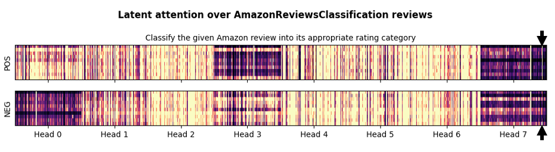
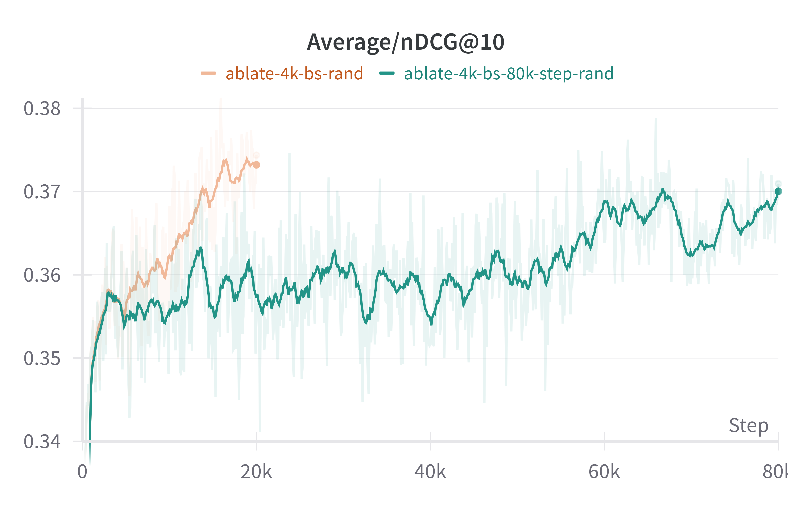
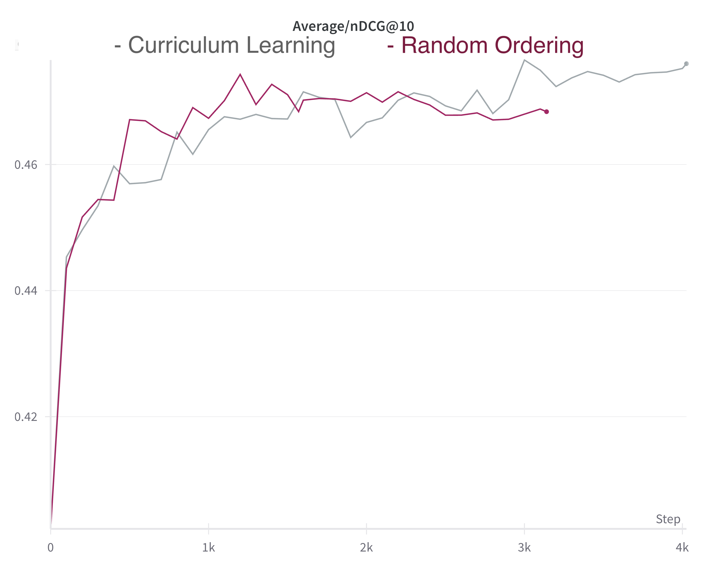
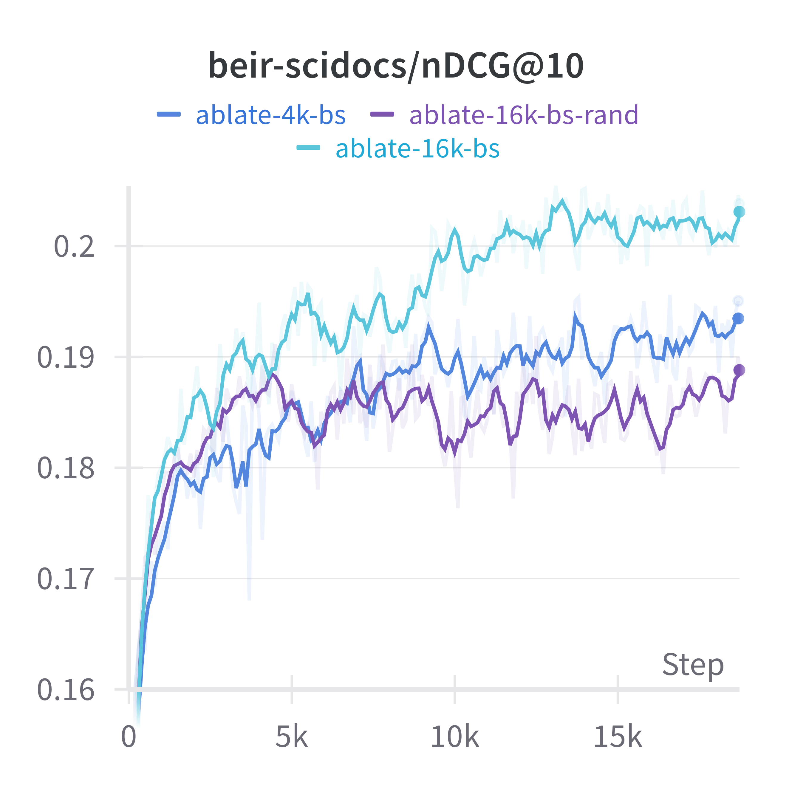
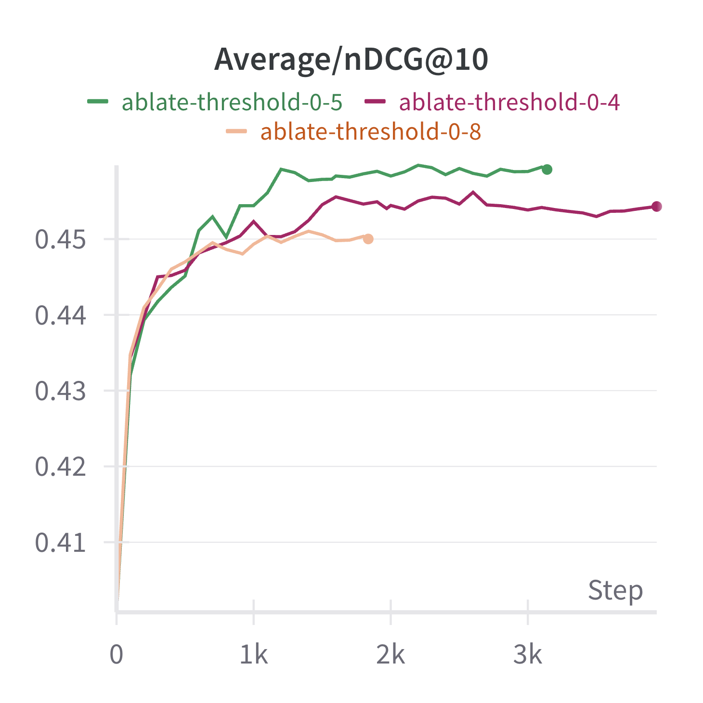
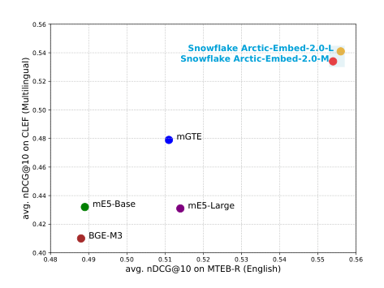
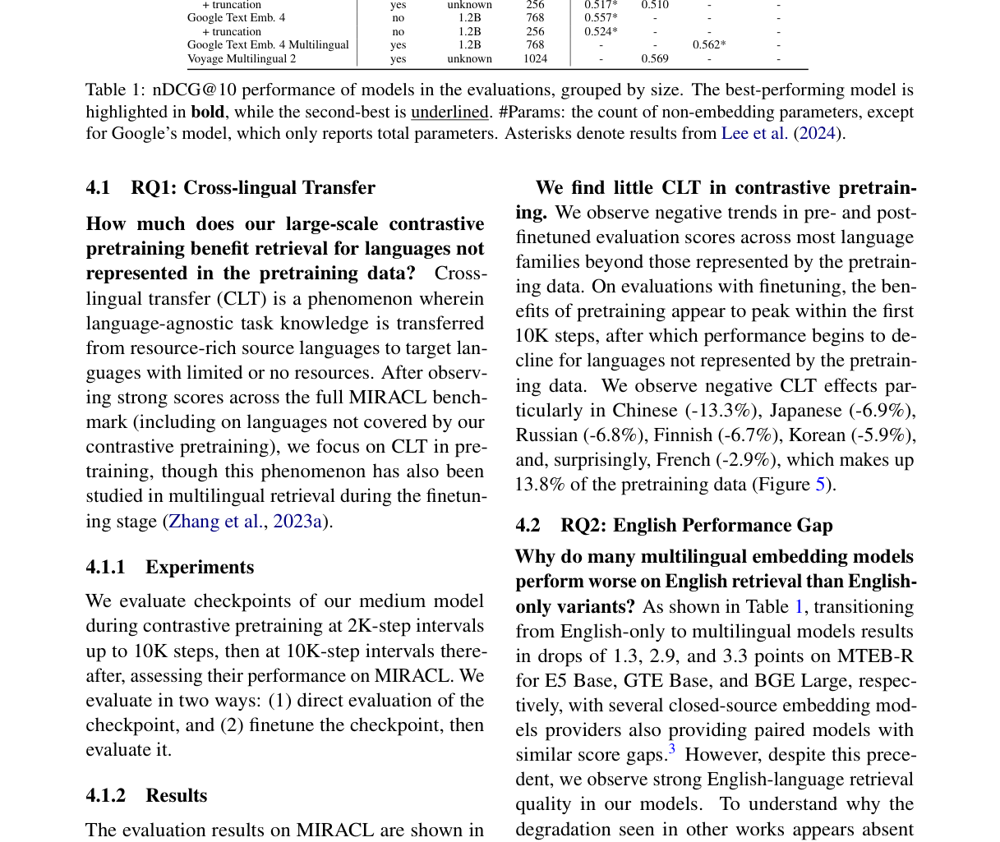
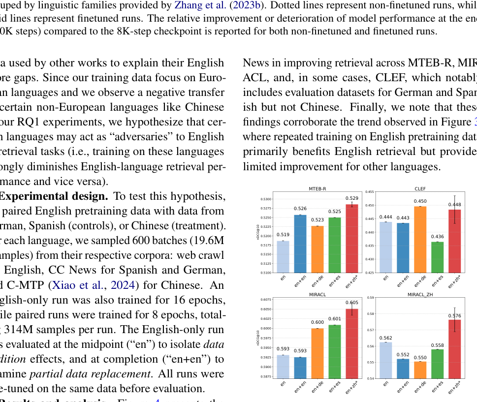

# LLM-Embedding 冲榜路线：E5-Mistral / NV-Embed-v2 / GritLM / SFR-2 / Arctic-Embed v2 / Stella

> **paper（按讨论顺序）**：[E5-Mistral (Microsoft 2023)](https://arxiv.org/abs/2401.00368) · [GritLM (Contextual AI + MS 2024)](https://arxiv.org/abs/2402.09906) · [NV-Embed / NV-Embed-v2 (NVIDIA 2024, ICLR 2025)](https://arxiv.org/abs/2405.17428) · [SFR-Embedding blog (Salesforce 2024)](https://blog.salesforceairesearch.com/sfr-embedded-mistral/) · [SFR-Embedding-2R blog (2024)](https://huggingface.co/Salesforce/SFR-Embedding-2_R) · [Arctic-Embed v1 (Snowflake 2024)](https://arxiv.org/abs/2405.05374) · [Arctic-Embed 2.0 (Snowflake 2024)](https://arxiv.org/abs/2412.04506) · Stella / Jasper（同队；见 [Jasper 详解](Jasper/Jasper-Token-Compression-600M详解.md)）
> **code / weights**：[intfloat/e5-mistral-7b-instruct](https://huggingface.co/intfloat/e5-mistral-7b-instruct) · [ContextualAI/gritlm](https://github.com/ContextualAI/gritlm) · [nvidia/NV-Embed-v2](https://huggingface.co/nvidia/NV-Embed-v2) · [Salesforce/SFR-Embedding-2_R](https://huggingface.co/Salesforce/SFR-Embedding-2_R) · [Snowflake/snowflake-arctic-embed-l-v2.0](https://huggingface.co/Snowflake/snowflake-arctic-embed-l-v2.0) · [dunzhang/stella_en_1.5B_v5](https://huggingface.co/dunzhang/stella_en_1.5B_v5)
> **refs**：[E5 (Wang 2022)](https://arxiv.org/abs/2212.03533) · [INSTRUCTOR (Su 2022)](https://arxiv.org/abs/2212.09741) · [LLM2Vec (BehnamGhader 2024)](https://arxiv.org/abs/2404.05961) · [Perceiver (Jaegle 2021)](https://arxiv.org/abs/2103.03206) · [NV-Retriever (Moreira 2024)](https://arxiv.org/abs/2407.15831) · [Matryoshka Representation Learning (Kusupati 2022)](https://arxiv.org/abs/2205.13147)
> **backbone**：几乎都是 **Mistral-7B / Mixtral 8×7B / gemma-2 / Qwen2 / XLM-R**（LLM 骨干为主，Arctic 家族保留 BERT-like 小尺寸）
> **date**：E5-Mistral 2023-12 → GritLM 2024-02 → Arctic-Embed v1 2024-05 → NV-Embed 2024-05 → SFR-2 2024-07 → NV-Embed-v2 2024-08 → Stella-v5 2024-08 → Arctic-Embed 2.0 2024-12
> **modality**：文本
> **languages**：英文为主（E5-Mistral/GritLM/NV-Embed/SFR/Stella）；多语（Arctic-Embed 2.0 / mE5-Mistral）
>
> 本文把 2024 年**MTEB 冲榜的六个头部一档**放在一张图里读，只讲**方法差异 + 可组装的积木 + 消融结论**。目标：读完能自己判断「加不加 bi-attention、要不要 latent pool、如何选 pooling / hard neg 阈值 / 两阶段任务混合」，而不是记 model 名字。

---

## 一句话定位

这批模型在 2024 年把 MTEB 平均分从 66（E5-Mistral）推到 **72.31**（NV-Embed-v2）。它们共同回答的是：**如何把已经预训练好的 7B LLM 改造成 SOTA 文本嵌入器**。核心配方五步（每篇论文差别只是「哪一步换个花样」）：

1. **骨干**：Mistral-7B / Mixtral / gemma-2 / Qwen2（LLM 已经在几 T token 上做过语言建模）
2. **注意力**：Causal 换 **Bidirectional**（NV-Embed / GritLM 直接改，LLM2Vec 走 MNTP 补 warm-up）
3. **池化**：EOS token / mean pool / **Latent Attention layer**（NV-Embed 提出）
4. **训练**：**两阶段指令微调** —— stage 1 检索类 + hard neg + in-batch，stage 2 混入非检索（分类/聚类/STS）**关闭 in-batch neg**
5. **数据**：LLM 合成（E5-Mistral 500k）+ 公开数据集 + **positive-aware hard neg**（NV-Retriever）+ **CE 蒸馏 soft label**

**MTEB 主表（截 2024-10 ICLR 提交日）**：

| 模型                         | Params | MTEB Avg | Retrieval (BEIR) | 提出方        | 训练特点                       |
| ---------------------------- | :----: | :------: | :--------------: | ------------- | ------------------------------ |
| **NV-Embed-v2**              | 7.85B  | **72.31** | 62.65            | NVIDIA        | Latent attention + 两阶段指令 |
| Stella-1.5B-v5               | 1.5B   | 71.19    | 61.01            | 与 Jasper 同队| 蒸馏 + Token Compression       |
| bge-en-icl (zero-shot)       | 7.14B  | 71.24    | 61.67            | BAAI          | ICL few-shot 前缀              |
| SFR-Embedding-2R             | 7.11B  | 70.31    | 60.18            | Salesforce    | 任务同类批 + 全批 hard neg 蒸馏|
| gte-Qwen2-7B-instruct        | 7.6B   | 70.24    | 60.25            | Alibaba       | 双向 + 指令 + 多任务微调       |
| bge-multilingual-gemma2      | 9B     | 69.88    | 59.24            | BAAI          | gemma-2 骨干 + 多语指令       |
| NV-Embed-v1                  | 7.85B  | 69.32    | 59.36            | NVIDIA        | 上一版                          |
| SFR-Embedding-Mistral        | 7B     | 67.56    | 59.00            | Salesforce    | E5-Mistral 后训                |
| GritLM-7B                    | 7B     | 66.76    | 57.41            | Contextual AI | Gen + Rep 一体                  |
| E5-Mistral-7B-instruct       | 7B     | 66.63    | 56.90            | Microsoft     | 500k GPT-4 合成 + 1k 步微调    |
| OpenAI text-embedding-3-large| 未公开 | 64.59    | 55.44            | OpenAI        | 商业闭源                       |

## 谱系与位置

```text
E5 (BERT/XLM-R 骨干, 2022) 
    │
    ├── E5-Mistral (2023-12)：换 LLM 骨干，500k GPT-4 合成 + 1k 步微调，最简 baseline
    │       │
    │       ├── SFR-Embedding-Mistral (2024-05)：在 E5-Mistral 上继续微调，任务同类批
    │       │       │
    │       │       └── SFR-Embedding-2R (2024-07)：+ 全批 hard neg 蒸馏
    │       │
    │       └── Linq-Embed-Mistral (2024)：LLM 精修数据
    │
    ├── GritLM (2024-02)：生成 + 表征双 loss 一体
    │
    ├── NV-Embed / NV-Embed-v2 (2024-05 / 08)：从零训 Mistral，Latent Attention + 两阶段
    │       │
    │       └── NV-Retriever (2024)：positive-aware hard neg 单独出的方法论
    │
    ├── Arctic-Embed v1 (2024-05)：BERT 骨干 22M~334M，数据配方精修
    │       │
    │       └── Arctic-Embed 2.0 (2024-12)：+ 多语 + MRL 两阶段
    │
    ├── LLM2Vec (2024-04)：三步（Bi + MNTP + SimCSE），无监督
    │
    ├── bge-en-icl / bge-multilingual-gemma2 (2024)：BAAI 的 LLM-Emb 变体
    │
    ├── gte-Qwen / QZhou-Embedding / Conan-embedding-v2：中文/多任务大厂线
    │
    └── Stella / Jasper (2024)：蒸馏 + Token Compression 冲榜路线
```

后面几节按方法差异逐个展开，共同点抽到「六个可插拔积木」一节。

---

## 共同的六个积木

2024 年冲榜配方 = 从这六个组件里选一套，几乎所有模型都能被完整拆开：

### 积木 1：骨干与规模

| 骨干                    | 参数    | 采用者                                                   |
| ----------------------- | ------- | -------------------------------------------------------- |
| Mistral-7B              | 7B      | E5-Mistral、GritLM-7B、NV-Embed、SFR、Linq              |
| Mixtral 8×7B            | 47B     | GritLM 8×7B                                              |
| gemma-2-9B              | 9B      | bge-multilingual-gemma2                                  |
| Qwen2-7B                | 7B      | gte-Qwen2、QZhou-Embedding                              |
| Qwen2.5-3B / Llama-3.2-3B | 3B    | 蒸馏后的 3B 版（见 NV-Embed 附录 A）                     |
| Sheared-LLaMA 1.3B      | 1.3B    | LLM2Vec 最小档                                          |
| XLM-R Large             | 560M    | Arctic-Embed v2 Large、bge-m3                            |
| BERT-Large / MiniLM     | ≤334M   | Arctic-Embed v1、BGE C-Pack、Nomic                       |

**观察**：**7B 是 2024 年的黄金尺寸**——精度饱和且推理成本可控。3B 蒸馏也够用；1.5B（Stella）需要 Token Compression 才能追分。

### 积木 2：注意力方向

Decoder 原生因果注意力对嵌入不友好（每个 token 看不到未来）。三种改法：

1. **直接去掉 causal mask，改双向**（NV-Embed、GritLM Embed 模式）：最简单，但只在**微调阶段**才安全（预训练权重已经是 causal 建模出来的）；实测有效。
2. **先做 MNTP 补 warm-up**（LLM2Vec）：加一步 masked next-token prediction，让权重先适应「能看到未来」；步骤更多但对 base LLM 更温和。
3. **保留 causal，做特殊 pooling**（E5-Mistral、SGPT）：EOS token 就是「唯一能看见所有前文的位置」；简单但受限于 last token 偏置。

三种做法基本等效，工程复杂度递增：**去 mask < MNTP < causal + 特殊 pool**。选哪一种通常看训练 budget 和 base LLM 的稳定性。

### 积木 3：Pooling

给定 last-layer hidden $H \in \mathbb{R}^{L \times d}$，怎么变成 embedding：

- **EOS token**：$h = H_{L-1}$；简单但**有 recency bias**。
- **Mean pool**：$h = \tfrac{1}{L}\sum_i H_i$；均匀但**稀释关键 token**。
- **Weighted mean**：位置越靠后权重越高（SGPT）；一个手动折中。
- **Latent Attention layer**（NV-Embed 首提）：用一组**可学 latent** $K = V \in \mathbb{R}^{r \times d}$ 作字典，让 last hidden 做 cross-attention：

$$
O \;=\; \mathrm{softmax}\!\left(\frac{Q K^\top}{\sqrt d}\right) V, \quad Q = H
$$

- 再过一个 MLP + mean pool，输出最终 embedding。$r$ 是 latent 数（论文 512）。
- 类比 Perceiver / IO：**latent 起「主题字典」作用**，让每个 token 挑最相关的字典向量作 aggregation。

### 积木 4：InfoNCE 变体

所有冲榜模型都用**温度缩放的余弦 InfoNCE**：

$$
\mathcal{L} = -\log\frac{\exp\bigl(\cos(h_q, h_{d^+})/\tau\bigr)}{\exp\bigl(\cos(h_q, h_{d^+})/\tau\bigr) + \sum_{n\in\mathcal{N}}\exp\bigl(\cos(h_q, h_n)/\tau\bigr)}
$$

差异在**负例池 $\mathcal{N}$ 的构成**：

- **in-batch + hard neg**（E5-Mistral、GritLM）：随机 batch + N 个 ANN 挖的 hard。
- **Cross-GPU broadcast**（BGE-M3、Conan、NV-Embed）：所有 GPU 共享 embedding，负例池 = 全 world_size × batch。
- **同任务批**（SFR）：一个 batch 内只有同类任务（Retrieval / STS / …），避免任务混杂 zigzag。
- **异任务混批**（NV-Embed）：SFR 反面 —— 让每个 batch 混各类任务，去 zigzag。

温度：Text 检索 $\tau=0.01\text{–}0.02$（E5-Mistral 0.02、NV-Embed 0.02、Arctic 0.02）；STS 用同族对比时 0.05；CoSENT 视任务微调。

### 积木 5：两阶段指令微调

INSTRUCTOR 之后，这已成默认。两阶段版由 NV-Embed 系统化：

- **Stage 1**：只训**检索类**任务（BEIR + 合成 + MS MARCO 等），**开启 in-batch neg**，配 hard neg。
- **Stage 2**：混入**非检索类**（分类 / 聚类 / STS / Reranking），**关闭 in-batch neg**——因为分类数据同 batch 里可能有同类正对被误当作负。

NV-Embed 消融显示：两阶段比单阶段合训 **+1.5 MTEB 平均**（Retrieval 也一起提升 ~0.9，不掉）。这个「stage 2 关 in-batch」的细节被 SFR-2R / Arctic-Embed 2.0 后续沿用。

### 积木 6：数据 curation

- **LLM 合成**：E5-Mistral 用 GPT-4 生成 500k 例（150k 独立 instruction）；成为其它冲榜模型的默认起点。
- **NV-Retriever 式 positive-aware hard neg**（NV-Embed / Arctic v2 都用）：
  - 挖 hard neg 时先算正对相似度 $s^+ = \cos(q, d^+)$；
  - 过滤掉 $s(q, n) \geq \beta \cdot s^+$ 的候选（默认 $\beta = 0.95$）——这些大概率是假负。
  - Arctic v2 调 $\beta$ 到 0.97–0.99 观察到进一步收益。
- **CE 教师蒸馏**（SFR-2R、BGE、Stella 都在用）：CE 打分 → 学生 KL / Margin MSE 对齐。
- **数据一致性过滤**（E5 CCPairs 传统、Nomic、Arctic v1）：用现有 embedding 模型给对打分，丢弃相似度低的对。
- **课程学习**（Arctic v1 有效、Arctic v2 反例）：按负例难度递增排序。v2 实测**随机顺序 ≥ 各种 curriculum**。

---

## E5-Mistral：合成数据点火者

Wang et al. 2023 的 [Improving Text Embeddings with LLMs](https://arxiv.org/abs/2401.00368)。**LLM-Embedding 冲榜路线的原点**，也是 SFR / Linq / bge-en-icl 的直接前身。

### 核心主张：单阶段 + LLM 合成 + < 1k 步

- 骨干：Mistral-7B（保留 causal 注意力，用 [EOS] 做 pooling）。
- 训练量：**< 1000 步**（对，只 1k 步）。
- 数据：**500k GPT-4 合成** + 可选的 15 个公开数据集（NQ、MS MARCO、SNLI、HotpotQA、NLI …）。
- Loss：温度 InfoNCE + 一个 hard neg + in-batch。$\tau = 0.02$，cosine sim。

关键结论：**Mistral-7B 已经在 T 级 token 上做过语言建模**——不需要 Contriever/E5-BERT 那种海量弱监督对比 warm-up，直接跳到监督微调就行。**这一步彻底改变了嵌入训练的算力配比**。

### 数据合成两步 prompt


**Step A：任务头脑风暴**。让 GPT-4 生成 ~20 条**候选检索任务**（如「按股票代号找财报」「按书名找评论摘要」）。

**Step B：条件化生成**。对每个任务，让 GPT-4 输出 JSON `{user_query, positive_document, hard_negative_document}`，含**「hard neg 看起来相关但实际不相关」**的定义。

**分类体系**：

- **非对称**（Asymmetric）：query 与 document 结构不同。分 4 种长度组合：short-long / long-short / short-short / long-long。
- **对称**（Symmetric）：STS 与 bitext；跳过头脑风暴，直接生成。

Placeholder 系统（`{query_length}`、`{clarity}`、`{language}` 等）随机采样，增加多样性。**93 语言覆盖**，语言权重按 XLM-R 分布，高资源语更多。

### 指令模板

$$
q^+_{\text{inst}} \;=\; \text{"Instruct: \{task\_definition\} \textbackslash n Query: \{q^+\}"}
$$

- **只给 query 侧加指令**，doc 侧不加 —— 让 doc index 可预计算，切换任务只改 query。
- 与 INSTRUCTOR 的**两侧都加**不同；这个「非对称指令」被 SFR / NV-Embed / bge-en-icl / gte-Qwen 全部继承。

### 消融数据集

- **只用合成数据**：MTEB 66.10。已经超过 OpenAI ada-002 (60.99)。
- **加公开数据**：MTEB **66.63**。E5-Mistral 官方主报点。

关键结论：**500k 高质量 GPT-4 合成 ≈ 数亿弱监督**。这份数据后来被 open-source（`intfloat/e5-mistral-embeddings`），几乎所有冲榜模型都在它上面继续训。

---

## GritLM：Gen + Rep 一体的 LLM

Muennighoff et al. 2024。**首个「同一个 7B LLM 同时做 SOTA 生成器 + SOTA 嵌入器」**。

### 双 loss，两种前向模式

同一 Mistral-7B 有两个 forward 路径：

- **Embedding 模式**：**Bidirectional attention** over input，mean pool 拿 embedding。
- **Generation 模式**：Causal attention，next-token 预测。

两种输入格式区分：

```
<|user|>{instruction}<|assistant|>{response}</s>       ← 生成
<|user|>{instruction}<|embed|>{sample_to_represent}    ← 表征
```

`<|embed|>` 是一个 special token 触发嵌入模式；模型见到它就切到双向 + mean pool，取 `{sample_to_represent}` 位置的表征。

联合 loss：

$$
\mathcal{L}_{\text{GRIT}} \;=\; \lambda_{\text{Rep}} \mathcal{L}_{\text{Rep}} \;+\; \lambda_{\text{Gen}} \mathcal{L}_{\text{Gen}}
$$

- $\mathcal{L}_{\text{Rep}}$：**双向 attention + mean pool** 的 InfoNCE（pooling 时忽略 instruction 与 format token）。
- $\mathcal{L}_{\text{Gen}}$：causal LM loss on `{response}</s>`。

**关键工程细节**：

- Rep 与 Gen 用**不同的 batch size**（Rep batch=2048、Gen batch=256），因为 embedding 训练大 batch 收益更大。
- Gen loss 用 **token-level aggregation**（每个 token 权重相等），避免只优化短生成。
- Bidirectional attention over instruction + input，但**mean pool 只覆盖 input**——指令信息通过 self-attention 隐式传入表征。

### 关键实验：一体化不牺牲双方


- **GritLM-7B**：MTEB 66.76（当时 SOTA） + AlpacaEval 类生成任务超 Llama-2 70B。
- **GritLM 8×7B**：47B 总参、13B 激活；生成任务超所有开源生成模型，同时保持 MTEB 65+。

**RAG 加速 60%+ 的原因**：

- 传统 RAG：query 过一次 embedding model + query+context 过一次 gen model = 2 次 forward。
- GritLM：query embed 完的**KV cache 可以复用**到 gen 阶段（同一模型），实测长文档场景 RAG 延迟降 60%+。

### 关于两 loss 冲不冲突

论文最重要的一句话：**「GRIT 匹配单独训练 gen-only 或 rep-only 的性能，因此可以无损失合并」**。这与直觉相反——通常两个 loss 联合训要付「多任务税」；作者用大量消融证明这一税可以规避（关键：instruction 分开、batch 分开、pooling 分开）。

### 后续影响

GritLM 是 2024 年后**LLM-as-embedder 一体化**思路的起点：

- **NV-Embed** 相对 GritLM 的定位是「更简单：直接去 causal mask，不用双 loss」。
- **QZhou-Embedding**（本仓库有独立 [详解](QZhou-Embedding/QZhou-Embedding详解.md)）借鉴 Gen + Rep 思路做多任务混合。
- **Qwen3-Embedding**（2025）内部也做了类似联合训练（本仓库 Batch 4 会补短深读）。

---

## NV-Embed / NV-Embed-v2：Latent Attention + 两阶段

NVIDIA 团队 2024-05 / 08。**MTEB 榜首**（v2 = 72.31，2024 年最高）。

### 架构：Bi-attn + Latent Attention pooling + MLP


- **Bidirectional attention**：直接把 Mistral-7B 的 causal mask 去掉。作者与 LLM2Vec（要 MNTP warm-up）、GritLM（双 loss）比，**发现最简单的「直接去 mask」在微调阶段就够用**。
- **Latent Attention layer**（LAL）：见前文积木 3 公式。用 512 个可学 latent 做字典，对 last hidden 做 cross-attention 聚合。
- **MLP + Mean pool**：LAL 输出再过一个 MLP，然后 mean pool 得到最终 embedding。

### 为什么 LAL 有效

论文 Figure 2 用 t-SNE 可视化 LAL 前后的 token embedding：



- **左**：LLM 出来的 last hidden，语义相近的 token 分布散。
- **右**：LAL 之后，「相关性主题」聚集成明显的簇。
- 直觉：LAL 起「特征选择器」作用，比 mean pool 更精确地把关键信息浓缩到几个 latent 维度。

**消融**：
- Mean pool: MTEB 65.5
- EOS pool: MTEB 66.4
- Latent Attention + mean pool: **MTEB 68.9**（+2.5 相对 EOS）

### 两阶段指令微调

- **Stage 1**：仅检索任务，NV-Retriever hard neg + in-batch，batch 256/GPU × 128 GPU。
- **Stage 2**：加入分类 / 聚类 / STS / rerank，**disable in-batch neg**。为什么关：分类数据集里，同 label 样本会在同 batch 出现，若当作负例，模型学到「同类互斥」，与目标相反。

**Stage 2 关 in-batch 的收益**：MTEB 71.5 → **72.31**，退化 stage 2 时反而**Retrieval 也提升** —— 与直觉相反，因为混任务微调让 embedding 空间更「几何一致」，反哺检索。

### 数据

- **Stage 1**：Retrieval 15 个数据集（BEIR），加 NV-Retriever 挖的 positive-aware hard neg。
- **Stage 2**：加 40+ 数据集，覆盖分类、聚类、STS、rerank；每个 batch **well-blended**（各任务混采），与 SFR 的「任务同类批」形成对照。

### v1 → v2 的差异

- **v1**（MTEB 69.32）：512 latent、Stage 1 单纯 retrieval。
- **v2**（MTEB **72.31**）：
  - 数据加合成（LLM 生成）与 example-based multi-class labeling
  - Positive-aware hard neg 阈值调优
  - 更精细的 batch blending
  - 一部分参数量固定成 latent，模型尺寸 7.85B

### 模型压缩

论文附录 A 用 NV-Embed-v2 做压缩实验：

- Llama-3.2-3B / Qwen2.5-3B 从零蒸馏 → 3B 版分数 68.5（比 v2 少 3.8，但比 GritLM 高 2）。
- INT4 量化：分数只掉 0.3。
- 结论：**7B → 3B 蒸馏 + INT4 后仍能追平 GritLM-7B**，是「LLM-Embedding 落地小卡机」的实证。

---

## SFR-Embedding 与 SFR-Embedding-2R

Salesforce Research，主线只有 blog + HF card。核心思路：**在 E5-Mistral 上继续微调**。

### SFR-Embedding-Mistral（2024-05，MTEB 67.56）

- 从 E5-Mistral-7B-instruct 继续训。
- 引入 **task-homogeneous batching**：一个 batch 内只装同类任务（Retrieval / STS / …）；同类内 in-batch neg 更「同分布」，噪声小。
- 数据加入更多多任务与合成集。
- 微调 ~几千步。

### SFR-Embedding-2R（2024-07，MTEB 70.31）

在 v1 基础上：

1. **Full-batch hard neg 蒸馏**：为每个 batch 里所有正对都挖 hard neg（不再共享），显著扩大负例池。
2. **CE 教师蒸馏**：训一个 cross-encoder reranker 打分，用 KL 蒸给 bi-encoder。
3. 更精细的数据过滤，减少假负。

**SFR-2R 的三个关键 vs NV-Embed 的差异**：

| 维度         | SFR-2R                        | NV-Embed-v2                       |
| ------------ | ----------------------------- | --------------------------------- |
| 底座         | 微调 E5-Mistral               | 从零训 Mistral（去 causal mask）  |
| Batch 结构   | Task-homogeneous              | Task-blended                     |
| Stage 2      | 检索 + rerank 蒸馏             | 检索 + 分类 + 聚类 + STS，关 in-batch |
| Hard neg     | Full-batch mining              | NV-Retriever positive-aware        |
| Pooling      | 保持 E5-Mistral 的 EOS         | Latent Attention                  |
| 结果         | 70.31                          | **72.31**                         |

**读法**：两者不是「谁对谁错」，而是「不同微调起点 + 不同 batch 哲学」的两条路。SFR 更像**工程化改良**，NV-Embed 更像**架构与训练策略同时重写**。

---

## Arctic-Embed v1：小尺寸的 SOTA

Merrick et al. 2024-05。**用 BERT-like 骨干（22M–334M）打赢 Cohere embed-v3、OpenAI text-embed-3-large**。

### 定位：数据 curation 压过规模

作者的问题：市面上 <1B 参的开源模型跟 SFR-Mistral (7B) 差距太大；能不能用 334M 追平 7B？

结论：**能**。关键在数据配方而不是骨干。

### 模型清单

| 尺寸     | 骨干                             | 参数 | Dim |
| -------- | -------------------------------- | ---- | --- |
| xs       | MiniLM-L6-H384-uncased            | 23M  | 384 |
| s        | e5-unsupervised-small             | 33M  | 384 |
| m        | e5-unsupervised-base              | 110M | 768 |
| m-long   | nomic-embed-text-v1-unsupervised  | 137M | 768 |
| l        | e5-unsupervised-large             | 334M | 1024 |

所有模型都用**CLS pooling**（非 mean），因为 [Li & Li 2023] 消融显示 STS 上 CLS 高 2.5 点。

### 训练流水线



上图论文 Figure 1：Arctic 家族每个尺寸都在 MTEB Retrieval Pareto 前沿。

两阶段：

1. **预训练**：query-doc pair + in-batch neg only；语料从 web 抓大规模半结构化对。
2. **微调**：+ 显式 hard neg；数据规模 ~1M；小心挑选。

### 关键工程创新

**Query-generation grounded by hard neg**：让 LLM 生成 query 时，**先给一个真实文档 + 一个 hard neg**，让 LLM 知道「什么样的 query 既能命中正例又不命中 hard neg」。相比「先生 query 再挖 neg」，这种方式的负例更有信息量。

**Curriculum learning**：



按负例难度递增排序，训练早期给容易的、后期给难的。v1 论文实测有 ~0.5 nDCG 收益。

（**注意**：v2 论文用同样的 curriculum 却发现**随机顺序 ≥ curriculum**——这是 2024 年一个反转，见下节。）

**Source-stratified batching**：



同 batch 里所有样本都来自**同一数据源**（而不是随机跨源混）。收益：in-batch neg 更「同分布」，训练信号更干净。这与 SFR 的 task-homogeneous batching 是同一思想的不同粒度。

**Hardness 阈值**：



用 teacher 给 hard neg 打分后，**去掉 top 5% 最难的**（避免假负）。阈值太高会漏假负，阈值太低会砍掉真 hard。v1 实测 95% 是甜点，v2 调到 97–99% 有进一步收益。

### 主要成绩

- **Arctic-Embed-l (334M)**：MTEB Retrieval nDCG@10 **55.98**，超过 Cohere embed-v3 (54.14) 与 OpenAI text-embed-3-large (55.44)。
- **Arctic-Embed-m (110M)**：**54.90** —— 一个 110M 模型打过 1500M 的 GTE-Qwen 早期版本。

---

## Arctic-Embed 2.0：多语 + MRL + 两阶段

Yu et al. 2024-12。**给 Arctic v1 补齐多语，不牺牲英文**。

### 定位与主张

多语嵌入模型（mE5、BGE-M3、mGTE）的通病：**加了多语 → 英文分数掉**。Arctic v2 想解决这个「二选一」。



上图论文 Figure 1：**Arctic v2-L 在 MTEB-R 英文（0.556）与 CLEF 多语（0.548）双榜都领先**，同尺寸开源模型里没有对手。

### 三阶段训练框架


1. **Stage 1：MLM 预训练**（复用 gte-multilingual-mlm-base 或 bge-m3-retromae）。
2. **Stage 2：对比预训练**（大规模弱监督对；in-batch neg only）。
3. **Stage 3：对比微调**（+ hard neg；混合英文 + 多语）。

### 关键发现

**Finding 1：Pretrained checkpoint 分数不预示 finetuned 分数**。作者对比几个 base backbone，发现 mlm 阶段的分数与最终微调分数**相关性极弱**——传统「先跑 zero-shot 看 base 好不好」的评估习惯**误导**。

**Finding 2：跨语言迁移**：

- **Finetuning 帮助跨语迁移**（正向）：训一种语言的检索数据，其它语的分数也涨。
- **Pretraining 反向迁移**（负向）：用无关语言做对比预训练，可能反而**伤害**目标语言。**多语 pretraining 的语言选择要谨慎**。

**Finding 3：随机顺序 ≥ curriculum**：

作者尝试了几种 curriculum（按平均 margin、平均负分、最小负分递增），全都**不如随机顺序**。与 v1 的结论相反——作者的解释是 v1 数据规模小、curriculum 收益容易显现；v2 数据规模大，模型能力足够均衡吸收。

**Finding 4：Hard neg 阈值 97%–99% 优于 95%**：

比 NV-Retriever 原论文推荐的 95% 更保守，说明 v2 用的 stella-1.5B-v5 teacher 更准，可以放心留下更「难」的负。

**Finding 5：Teacher 越强越好**：

对比 GTE-Large-en-v1.5 vs Stella-1.5B-v5 挖 hard neg：**Stella 更强** → 学生 MTEB-R 提升 0.5+ nDCG@10。

### MRL：两阶段 + 训练时插入



Matryoshka Representation Learning（Kusupati 2022）：训练时在**多个截断维度**上同时计算 loss，让向量前缀 $v[:d']$ 也可用。Arctic v2：

- MRL loss 加在**预训练与微调两阶段**（NV-Embed / OpenAI 只在最终阶段加）。
- 单一截断维 $d' = 256$。
- 好处：256 维分数**保留原 1024 维分数的 99%（M）/ 98%（L）**；相对不加 MRL 的模型，压缩后掉分显著更小。



上图对比 Arctic v2 与 Google text-embedding-004、Cohere embed-v3 在 256 维截断下的分数保留：**Arctic 断到 256 后仍高于 competitor 全维度**。这是「两阶段 MRL」的直接工程回报。

### 训练细节

| 项              | 值                                       |
| --------------- | ---------------------------------------- |
| Backbone (M)    | gte-multilingual-mlm-base (306M)         |
| Backbone (L)    | bge-m3-retromae (560M, XLM-R base)       |
| Vocab           | XLM-R（250k）                             |
| Batch (对比预训练) | 数千（分布式跨 GPU）                     |
| Batch (微调)    | 256/GPU × N                              |
| Hard neg teacher| Stella-1.5B-v5（英）/ mE5-Large（多语）  |
| False-pos 阈值  | 97%–99%                                   |
| MRL 截断        | 256                                       |
| 训练目标        | InfoNCE + MRL                             |

---

## Stella / Jasper：蒸馏冲榜的另一条线

Stella-1.5B-v5（MTEB 71.19）与 Jasper-600M 出自同一队伍（dunzhang），走的是**蒸馏 + Token Compression**路线：

- **教师**：NV-Embed-v2 或类似头部模型。
- **学生**：Qwen2-1.5B 或 xLSTM 变体，加入 **Token Compression**（把长序列压成固定几十个 token）。
- **蒸馏信号**：logit KL + Vec 对齐 + Margin MSE，三头合训。

Stella / Jasper 的详细机制见本仓库 [Jasper-Token-Compression-600M 详解](Jasper/Jasper-Token-Compression-600M详解.md)。这里只强调它们相对 NV-Embed 的定位：**用 1/5 参数量追到 -1 分之内**，是「LLM-Embedding 落地小卡机」的第二条实证。

---

## 消融交集：跨论文的可拷贝配方

把上面 6 个模型的关键消融放一起，可以抽出**跨论文重复验证过的建议**：

### 温度

- **检索**：$\tau = 0.02$（E5-Mistral、NV-Embed、Arctic）。$\tau = 0.05$ 分数掉 0.5–1。
- **可学 $\tau$**：CLIP / SigLIP 用；文本嵌入训练里几乎不用（不必要）。

### Batch size

- **小规模（≤ 1B）**：4k–16k 是甜点。
- **7B LLM**：2k–4k 已经够，因为 hard neg 主导性能。
- **跨 GPU broadcast**：想拉大批必用；BGE-M3、NV-Embed、Arctic v2 都在用。

### Bi-attention vs Causal

- **直接去 causal mask**（NV-Embed / GritLM）：微调阶段直接改，实测有效。
- **MNTP warm-up**（LLM2Vec）：更稳但多一步；用 base LLM 不太稳时选。
- **保留 causal + EOS**（E5-Mistral / SGPT）：最简单；分数比 bi-attn 低 1–2 点。

### Pooling

- **EOS**：Causal 场景默认。
- **Mean pool**：Bi-attn 场景默认。
- **Latent Attention**（NV-Embed 提出）：+2.5 相对 EOS。用一次消融就应该切过来。

### Hard neg 阈值

- **NV-Retriever 95%**：安全起点。
- **Arctic v2 97–99%**：teacher 强时可以更激进。
- **不设阈值**：MTEB 会掉 1+ 点（假负污染）。

### Curriculum

- **v1 有效**（Arctic v1 报 +0.5 nDCG）。
- **v2 无效**（Arctic v2 报随机 ≥ curriculum）。
- **推荐**：数据规模小时试 curriculum；规模大时不必花时间。

### 两阶段任务混合

- **Stage 2 关 in-batch neg**（NV-Embed）：分类数据里同 label 样本互当负会破坏几何——必须关。
- **Task-homogeneous vs blended**：SFR 用同类批，NV-Embed 用混批，两者都能达到 SOTA，说明**关键是有 stage 2 混任务**，具体 batch 组织次要。

### MRL

- **两阶段插入优于单阶段**（Arctic v2）：预训练 + 微调都加 MRL 比只最终加保留分数高 2+。
- **256 维**是当前商业与开源共识的甜点。

### 蒸馏

- **CE teacher + KL**（SFR-2R、Stella）：稳定收益 0.5–1 MTEB。
- **多教师蒸馏 + Token Compression**（Jasper）：小模型追大模型的核心手段。

---

## 常见错误用法

1. **拿 E5-Mistral 的 causal + EOS 用在 bi-attn 微调**：$L$ 位的 hidden 现在能看到全序列，EOS 反而不是最佳；应改 mean pool 或 Latent Attention。
2. **GritLM 忘了区分 embed 与 gen 的 batch/loss**：如果两者共用 batch/optimizer step，梯度会互相拉扯。GritLM 论文强调 batch 与 loss aggregation 都要分。
3. **NV-Embed 单阶段合训所有任务**：单阶段 Retrieval + 分类 + STS + 聚类，in-batch neg 全开 → 分数掉 1.5。必须 stage 2 关 in-batch。
4. **Arctic v2 拿 curriculum 期望和 v1 一样的收益**：v2 实测无效，别浪费时间；直接随机。
5. **MRL 在训练结束才加**：与 Arctic v2 相比会掉 1+ 分；**pretraining 就要加**。
6. **对比不同模型只看 MTEB 总分**：MTEB 平均把 12 类任务混一起，工业上如果只做 RAG，应主看 Retrieval 子集（BEIR 15 数据集），并**必须补自建评测**（MTEB 训练集里的合成数据可能覆盖你的域，导致榜分虚高）。
7. **在 4-bit 量化后不 recheck 检索质量**：NV-Embed-v2 INT4 只掉 0.3，但**这是在 MTEB 上**；换到你的领域可能掉 3。**每个部署形态都得回测**。

---

## 与本仓库既有报告的挂接

- 前置基础：[E5 详解](E5/E5详解.md)（BERT 骨干版）· [LLM2Vec 详解](LLM2Vec/LLM2Vec详解.md)（Bi + MNTP + SimCSE 三步）· [INSTRUCTOR 详解](INSTRUCTOR/INSTRUCTOR详解.md)（指令化嵌入开山）· [对比学习与 InfoNCE 精讲](对比学习与InfoNCE精讲.md)（损失演化）
- 数据 & 负例：[NV-Retriever 详解](NV-Retriever/NV-Retriever详解.md) · [难负例挖掘工业实践](难负例挖掘工业实践.md) · [InternLM2 数据处理与过滤详解](InternLM2/InternLM2数据处理与过滤详解.md)
- 蒸馏与小模型：[Jasper-Token-Compression-600M 详解](Jasper/Jasper-Token-Compression-600M详解.md)（Stella 系）· [Embedding 蒸馏技术详解](Embedding蒸馏技术详解.md)
- 后续（Batch 3 / Batch 4 会补）：BGE C-Pack、BGE-EN-ICL、BGE-multilingual-gemma2、Qwen3-Embedding、Seed1.5-Embedding
- 主文对应：[Embedding 调研报告](Embedding调研报告.md) §9.3「Decoder LLM 作 Bi-Encoder」与 §11「Embedding 蒸馏与压缩」

---

*本报告基于 E5-Mistral (arXiv 2401.00368) / GritLM (arXiv 2402.09906) / NV-Embed (arXiv 2405.17428) / SFR-Embedding blog / Arctic-Embed (arXiv 2405.05374 + 2412.04506) 与官方 HF card 整理。SFR-2R 与 Stella 缺 arXiv 论文，方法描述基于 blog + 模型卡 + [NV-Embed § 2.2](https://arxiv.org/abs/2405.17428) 的公开对比。分数为 2024-10 前的 MTEB 榜单；后续榜单持续更新，选型请以最新数据为准。*
