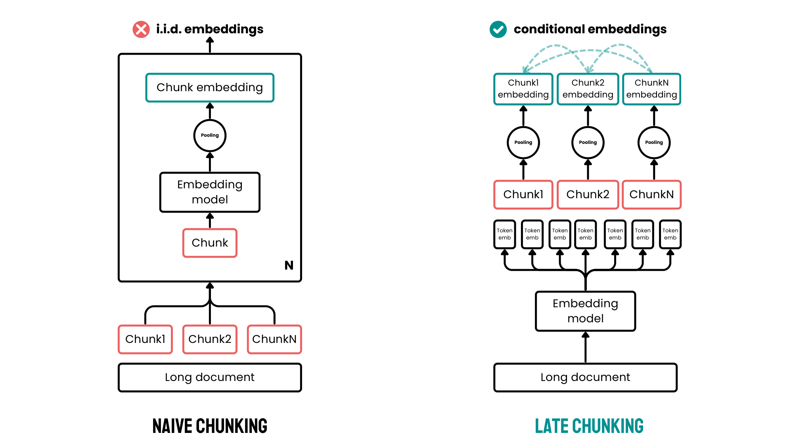
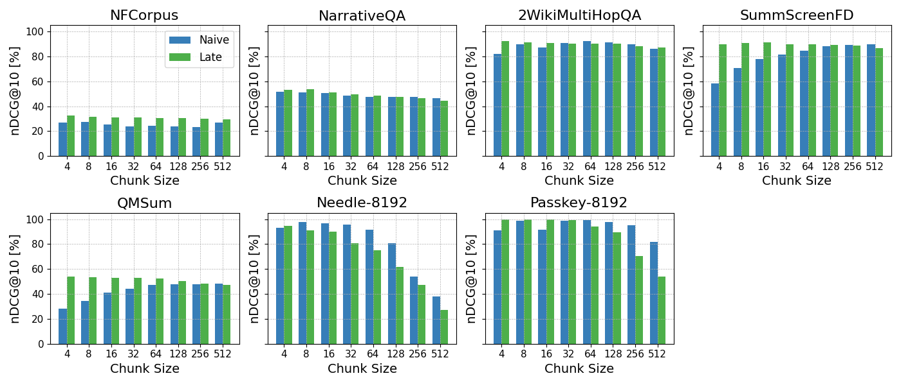

> 原文: [arXiv:2409.04701v3](https://arxiv.org/abs/2409.04701)（2025-07-07 更新）
> 说明: 本文为论文全文中文技术展开，公式/图表编号与原文一致；图片自 arXiv PDF 抽取（起始编号 fig02，Figure 1 为纯文本示意故未截图），caption 中译；数值原样保留。

---

# Late Chunking：用长上下文嵌入模型生成带全局语境的分块向量（Late Chunking: Contextual Chunk Embeddings Using Long-Context Embedding Models）

**作者：** Michael Günther¹、Isabelle Mohr¹、Daniel James Williams²、Bo Wang¹、Han Xiao¹

**单位：** ¹Jina AI GmbH（Prinzessinnenstr. 19-20, 10969 Berlin, Germany）、²Weaviate B.V.（Prinsengracht 769a, 1017JZ Amsterdam）

**邮箱：** research@jina.ai、danny@weaviate.io

| 字段 | 值 |
|------|------|
| 发布 | arXiv:2409.04701v3（cs.CL, 2025-07-07；v1 首发 2024-09） |
| 代码 | https://github.com/jina-ai/late-chunking |
| 骨干示例 | jina-embeddings-v2-small（8192 token 上下文）、jina-embeddings-v3、nomic-embed-text-v1 |
| 训练数据（span 微调） | FEVER、TriviaQA（span 标注版，HuggingFace `jinaai/fever-span-annotated`、`jinaai/triviaqa-span-annotated`） |
| 评测 | BEIR（SciFact、NFCorpus、FiQA、TRECCOVID）、LongEmbed（NarrativeQA、2WikiMultiHopQA、SummScreenFD、QMSum、Needle-8192、Passkey-8192） |
| 模态 | 文本 |
| 语言 | 英文为主（v3/nomic 骨干支持多语） |

---

## 摘要（Abstract）

许多应用只需要检索文档中的**较小片段**，密集向量检索在**较短文本**上通常也更准（长文本更容易被"过度压缩"）。实践中会先把文档切成小块（chunks）再单独嵌入，但这样切出来的块**丢失了周围上下文**，向量质量随之下降。

作者提出 **late chunking（延迟分块）**：**先让长上下文嵌入模型对全文所有 token 编码**，再在 transformer 输出之后、mean pooling 之前按 chunk 边界做池化——因为"分块"发生在编码之后，所以取名 late。得到的 chunk 向量因此**继承了全文语境**，在多种检索基准上明显优于朴素分块。方法**通用**（适用于任何采用 mean pooling 的长上下文嵌入模型）、**无需额外训练**即可上线；作者还进一步给出一种针对 late chunking 的专用微调方法（span pooling），可进一步提升精度。

---

## 1 引言（Introduction）

神经检索（IR）依赖基于 transformer 的嵌入模型将文本编码为稠密向量，用余弦相似度做语义近似。RAG 等场景要求把文档**切成有限长度**的 chunk 后入库，检索时按 kNN 召回相关块喂给 LLM 生成回答；许多其它应用（段落定位、跳读导航）也同样依赖分块。

**为什么长上下文模型下仍要分块？** 长上下文嵌入模型（Günther 等 2023）虽然可以整篇编码，但在**短文本**上表现依然更好（Zhou 等 2024，附录 A.1 有对照）——把长文压成单一向量会损失细节。因此即便有 8192 token 的模型，分块仍是主流。

**但朴素分块会切断跨块语义依赖。** 图 1（原文以文字呈现，此处不截图）用维基百科 Berlin 词条作例：第一句提到 "Berlin is the capital..."，后续句以 "Its" / "The city" 回指，一旦被切开，后面几个 chunk 就没有 Berlin 这一实体信息，向量质量下滑。

原文表 1 用同一嵌入模型（jina-embeddings-v2-small）对比朴素分块和 late chunking 时，chunk 与查询词 "Berlin" 的余弦相似度：

**表 1（原文 Table 1）：把 "Berlin" 的向量与文章各句向量比较——Sim. Naive 为朴素分块结果，Sim. Late 为 late chunking 结果。**

| 文本 | Sim. Naive | Sim. Late |
|------|:----------:|:---------:|
| Berlin is the capital and largest city of Germany, both by area and by population. | 0.8486 | 0.8495 |
| Its more than 3.85 million inhabitants make it the European Union's most populous city, as measured by population within city limits. | 0.7084 | 0.8249 |
| The city is also one of the states of Germany, and is the third smallest state in the country in terms of area. | 0.7535 | 0.8498 |

可见第二、第三句里没有直接出现 "Berlin"，朴素分块下的相似度只有 0.70 / 0.75；而 late chunking 因为在**先整篇 encoding** 时已经把 "Berlin" 的语境写进了 "Its" / "The city" 的 token 表征，相似度分别拉到 0.82 / 0.85。这是全文的核心反直觉现象：**先编码后切块**能自然继承全局语境，而不是靠拼接、扩窗、指令改写等外挂手段。

作者的主要贡献如下：

- **Late Chunking 方法**：见 §3，通用、免训练、在多项检索任务上稳定优于朴素分块；
- **超长文档扩展算法**：Long Late Chunking（§3.1），处理超过模型上下文的文档；
- **专用训练方法**：span pooling 微调（§3.2），进一步榨出精度；
- **系统评测**：覆盖多模型、多分块策略、多数据集，同时**指出方法失效场景**（§4）。

---

## 2 相关工作（Related Work）

主流嵌入模型都遵循 Reimers & Gurevych（2019）的 SBERT 训练范式：transformer + pooling → 单一向量。**mean pooling** 因经验最好被广泛采用。相对位置编码（AliBi、RoPE）让 8k+ 上下文的嵌入模型成为可能（Jina-v2、Nomic-Embed）。

**分块（chunking）** 已成事实标准：固定 token 长度、句子/段落切分，或者更进阶的**语义分块**（Kamradt 2024，用邻句嵌入相似度决定切点）。

**为 chunk 补上下文的现有思路**：

- **overlap chunk**：相邻块保留一段公共 token（Safjan 2023），实际效果有限（原文附录 A.2 给出实验，见后文表 6）；
- **LLM 上下文注入**（Anthropic 2024 "Contextual Retrieval"）：让 LLM 读全文后生成"补充上下文"拼到 chunk 前面，再喂嵌入模型——精度好但推理成本大（每个 chunk 要额外过一次 LLM）；
- **命题化 / proposition 抽取**（Luo 等 2024）：用 LM 抽命题作为检索粒度，但一段一段处理仍会丢跨段语义，也无法与任意切分策略组合。

**Token 级检索（ColBERT）** 采用 "late interaction"：query 与 document 的每个 token 相似度都比一遍，精度高但**检索代价大**（要保存所有 token 向量、要做多向量匹配）。与之相比，late chunking 依然是**单向量-per-chunk**，只是这些向量被赋予了全文语境。

Chen 等（2024）则试图专门训练一个能输出"上下文化句向量"的模型；本文的定位不同——**架构级修改，无需重训**即可套用到已有嵌入模型。

---

## 3 方法（Method）

Late chunking 利用了两件事的差距：**新一代嵌入模型的最大上下文窗口很大**（例如 jina-embeddings-v2-small 支持 8192 token，约十页正文），而**实际应用中最优 chunk 大小往往很小**（一段话左右）。前者是编码能力上限，后者由下游需求决定，两者不必绑死。



**中文说明：** 左图是朴素分块——先把长文档按 chunk 边界切成独立子串，每个子串**独立**过一次嵌入模型再 pooling，得到 i.i.d.（互相独立）的 chunk 向量，跨 chunk 语义完全消失。右图是 late chunking——整篇文档**整体**输入 transformer，产出 token 级表征序列 $\vartheta_1, \dots, \vartheta_m$，然后**在 mean pooling 阶段**按 chunk 边界分段做池化，每个 chunk 向量都"看过"全文，因此是 conditional embedding（条件嵌入）。改动只在 pooling 之前的边界应用位置——名字里的 "late" 就是指分块动作**延迟**到编码之后。

朴素路径可以概括为 `chunk → tokenize → encode → pool per chunk`；late 路径改成 `tokenize whole → encode whole → pool per chunk boundary`。整个算法在 Algorithm 1 中给出：

**Algorithm 1（Late Chunking）**

```
输入: 文本 T，分块策略 S
输出: chunk 向量 e_1, ..., e_n

1: (c_1, ..., c_n) ← Chunker(T, S)                      # 用任意分块器给出块 c_j
2: (τ_1, ..., τ_m), (o_1, ..., o_m) ← Tokenizer(T)      # τ_i 为 token id, o_i 为其对应字符数
3: (ϑ_1, ..., ϑ_m) ← Model(τ_1, ..., τ_m)               # 整篇编码得到 token 级向量
4: o_chunk ← 0, j ← 1, cue_start ← 1, cues ← []
5: for i ∈ {1, ..., m}:
6:     o_chunk ← o_chunk + o_i
7:     if o_chunk ≥ |c_j|:                              # 累积字符长度到达当前 chunk 边界
8:         cue_end ← i
9:         cues ← cues ⊕ (cue_start, cue_end)
10:        j ← j + 1; cue_start ← i + 1; o_chunk ← 0
11:    end if
12: end for
13: for (cue_start, cue_end)_i ∈ cues:
14:     e_i ← ( Σ_{j=cue_start}^{cue_end} ϑ_j ) / ((cue_end + 1) - cue_start)   # 段内 mean pool
15: end for
```

要点：分块器输出的是字符区间，因此 5–13 行的作用是**把字符边界翻译成 token 边界**（累积字符长度直到达到当前块大小）；14–16 行才是真正的按段 mean pooling。整个流程**不改任何模型权重**、**不改任何 chunk 切分算法**——只是把 pooling 阶段挪了个位置。

### 3.1 长文档的延迟分块（Long Late Chunking）

即使模型支持 8k token，也无法一次编码更长的文档；而 self-attention 显存随 token 数**二次**增长，硬塞会 OOM。因此作者提出 Long Late Chunking（Algorithm 2）：把整篇文档切成若干**大宏块**（macro chunk）$l_\max$ 个 token 长，宏块之间有 $\omega$ 个 token 的**重叠**作为额外上下文，再对每个宏块单独跑 late chunking，最后把结果拼接。

**Algorithm 2（Long Late Chunking）**

```
输入: 文本 T，分块策略 S，最大 token 长 l_max，重叠长度 ω
输出: chunk 向量 E = (e_1, e_2, ..., e_n)

1: (c_1, ..., c_n) ← Chunker(T, S)
2: (τ_1, ..., τ_m), (o_1, ..., o_m) ← Tokenizer(T)
3: if m < l_max: return LateChunking(T, S)             # 短文本直接走 Algorithm 1
5: end if
6: i_end ← 1, embeddings ← []
7: while i_end < m:
8:     i_start ← max(i_end - ω, 1)                      # 与上一段重叠 ω 个 token
9:     i_end   ← min(i_start + l_max, m)
10:    (ϑ_{i_start}, ..., ϑ_{i_end}) ← Model(τ_{i_start}, ..., τ_{i_end})
11:    if i_start == 1:
12:        embeddings ← embeddings ⊕ (ϑ_{i_start}, ..., ϑ_{i_end})
13:    else:
14:        embeddings ← embeddings ⊕ (ϑ_{i_start+ω}, ..., ϑ_{i_end})   # 丢掉重叠区避免重复
15:    end if
16: end while
17: 使用 Algorithm 1 的 4–16 步在拼好的 token 向量序列上做边界池化
```

思路很直接：重叠区**只用于上下文补齐**，不写入最终 token 序列（除首段外），避免同一 token 出现两次影响 pool。这样能把 late chunking 的"全局语境"优势平滑地推广到任意长度的文档。

### 3.2 面向 late chunking 的训练方法（Training Method）

Late chunking 本身**免训练**即可上线，但传统 embedding 模型的 mean pooling 是训练在"整段 → 单向量"目标下的，未必最擅长编码**带周围 token 的 chunk**。作者提出 **span pooling** 微调，让模型明确学会把"相关信息压进标注区间的 token"里。

**训练数据格式：** 三元组 $(q, d, \langle \text{start}, \text{end}\rangle)$——查询 $q$、包含答案的文档 $d$，以及 $d$ 内答案 span 的字符区间。作者从 FEVER（Thorne 等 2018）与 TriviaQA（Joshi 等 2017）构造（合计约 47 万对）：FEVER 的 span 是句号编号（并只保留有支持证据的 pair），TriviaQA 的 span 通常是"人名/地点/日期"级短语；一个文档有多个候选 span 时只取最早出现的一个。

**训练过程：** 沿用 Günther 等（2023）的 pair 训练管线，损失为 InfoNCE。给定 $k$ 对 pair 的 batch $B = ((x_1, y_1), \dots, (x_k, y_k))$ 与余弦相似度 $s$：

$$
\mathcal{L}_{\text{NCE}}(B) := - \sum_{(x_i, y_i) \in B} \ln \frac{e^{s(x_i, y_i)/\tau}}{\sum_{i'=1}^{k} e^{s(x_i, y_{i'})/\tau}} \quad (1)
$$

关键在于 $y_i$（文档向量）**只对 span 区间内的 token 做 mean pooling**——这就是"span pooling"，让 loss 直接优化"标注区间的 token 表征能否代表该文档"。查询向量 $x_i$ 走常规 mean pooling。

同时按 Günther 等（2023）建议使用**双向 loss**：把 pair 顺序对调得到 $B^\dagger = ((y_1, x_1), \dots, (y_k, x_k))$：

$$
\mathcal{L}_{\text{pairs}}(B) := \mathcal{L}_{\text{NCE}}(B) + \mathcal{L}_{\text{NCE}}(B^\dagger) \quad (2)
$$

这样，训练目标就与 late chunking 的推理形态对齐：**"从整段 token 序列中，能用局部 span 的 token pool 出正确的检索向量"**。

---

## 4 评测（Evaluation）

评测分五块：§4.1 检索任务的通用有效性；§4.2 chunk size 的影响与失效场景；§4.3 长文档下的 Long Late Chunking；§4.4 span pooling 微调；§4.5 与 Anthropic 的 LLM 上下文注入对比。

### 4.1 检索任务上的对比（Retrieval Tasks）

选 BEIR 中较小的 4 个任务（SciFact、NFCorpus、FiQA、TRECCOVID），因为对每个 chunk 都要重编码，全量 BEIR 成本过高。评测流程：文档切块 → 嵌入入库 → 每个查询取 kNN → 若 chunk 属于同一文档只保留最早出现者 → 得到文档级 kNN → 与 QRels 比 → 报 nDCG@10。

三种分块策略：

- **Fixed-Size Boundaries：** 定长 256 token；
- **Sentence Boundaries：** 定量 5 句；
- **Semantic Sentence Boundaries：** 相邻高相似度句合并（用 jina-embeddings-v2-small-en 做 sim，llama-index 默认参数）。

三个嵌入模型：**J2s** = jina-embeddings-v2-small、**J3** = jina-embeddings-v3、**Nom** = nomic-embed-text-v1。

**非语义 token 的归属：** [CLS] 全并入首 chunk 的 pool，[SEP] 与 v3/nomic 的 task instruction 前缀全并入末 chunk 的 pool——保持每个 token 都被 pool 到、且不歪曲边界。

**表 2（原文 Table 2）：不同分块方法在检索任务上的 nDCG@10（%）。**

| 分块策略 | 模型 | SciFact | NFCorpus | FiQA | TRECCOVID | AVG |
|:---|:---:|:---:|:---:|:---:|:---:|:---:|
| **Fixed-Size Boundaries（256 token/chunk）** | | | | | | |
| Naive | J2s | 64.2 | 23.5 | 33.3 | 63.4 | – |
| Naive | J3 | 71.8 | 35.6 | 46.3 | 73.0 | – |
| Naive | Nom | 70.7 | 35.3 | 37.0 | 72.9 | 52.2 |
| Late | J2s | 66.1 | 30.0 | 33.8 | 64.7 | – |
| Late | J3 | 73.2 | 36.7 | 47.6 | 77.2 | – |
| Late | Nom | 70.6 | 35.3 | 38.3 | 75.0 | 54.0 |
| **Sentence Boundaries（5 句/chunk）** | | | | | | |
| Naive | J2s / J3 / Nom | 64.7 / 71.4 / 71.3 | 28.3 / 35.8 / 34.7 | 30.4 / 43.7 / 35.1 | 66.5 / 72.4 / 74.2 | 52.4 |
| Late | J2s / J3 / Nom | 65.2 / 73.2 / 71.4 | 30.0 / 36.6 / 35.5 | 33.9 / 48.0 / 37.7 | 66.6 / 76.5 / 76.8 | 54.3 |
| **Semantic Sentence Boundaries** | | | | | | |
| Naive | J2s / J3 / Nom | 64.3 / 71.2 / 70.4 | 27.4 / 36.1 / 35.3 | 30.3 / 44.0 / 34.8 | 66.2 / 74.7 / 74.3 | 52.4 |
| Late | J2s / J3 / Nom | 65.0 / 72.4 / 70.5 | 29.3 / 36.6 / 35.3 | 33.7 / 47.6 / 36.9 | 66.3 / 76.2 / 76.1 | 53.8 |

**结论：** 3 模型 × 4 数据集平均，"朴素 → late" 相对提升——定长边界 +3.46%（绝对 +1.8pt）、句边界 +3.63%（绝对 +1.9pt）、语义边界 +2.70%（绝对 +1.5pt）。改法非常稳。附录 A.2 另外证明 overlap chunk 无助于提升。

### 4.2 chunk size 的影响与失效场景（Influence of the Chunking Size）

选长文档任务（NFCorpus 及 LongEmbed）测不同 chunk size 下的 late vs naive；文档超 8192 token 时先截断至 8192。用 jina-embeddings-v2-small + 定长分块。



**中文说明：** 横轴为 chunk 大小（token），纵轴为 nDCG@10。多数曲线上 late chunking 尤其在**小 chunk 时明显领先**——因为小 chunk 语境损失最严重，late 的全局语境注入受益最大。但在 LongEmbed 里两个**合成任务** Needle-8192 与 Passkey-8192 上，late chunking 无优势甚至更差：这两个任务的"相关信息"是一小段无关文档中间**塞入的短句**，全文其余内容与相关信息完全无关，late chunking 反而把这些"噪声语境"糅进了相关 chunk 的向量里——**"全文语境" 只有在语境真的与相关信息相关时才有用**。对 NFCorpus 这类主题连贯的长文档，late chunking 全 chunk size 稳定占优。

### 4.3 长文档下的 Long Late Chunking（§3.1 的评测）

选 LongEmbed 的三个真实（非合成）阅读理解数据集，**不再截断至 8192**，直接跑 Long Late Chunking。


**中文说明：** 与 §4.2 相比，nDCG 明显更高——因为 §4.2 的 8192 截断把长文档信息切掉了，而 Long Late Chunking 用重叠宏块把整篇编码，信息不丢。曲线继续显示：**在 chunk size 较小时优势最明显；随 chunk 增大，naive 与 late 逐渐靠拢**（chunk 本身已经包含足够上下文时，late 的相对增益缩小）。

### 4.4 span pooling 训练的效果（Evaluation of Training Method）

对 J3 与 J2s 分别做 span-based / mean-pooling 训练对比，chunk size 64，推理均走 late chunking。J3 只微调 retrieval adapter（batch 512, 500 步）；J2s 沿用 Günther 等（2023）的超参。

**表 3（原文 Table 3）：训练时使用 span pooling vs mean pooling 的检索结果（nDCG@10 %，推理均使用 late chunking，chunk size 64）。**

| 模型 | 训练池化 | 训练数据 | SciFact | NarrativeQA | NFCorpus | TREC-COV | FiQA |
|:---|:---|:---|:---:|:---:|:---:|:---:|:---:|
| J3 | Span-Based | TriviaQA & FEVER | 72.61 | 44.01 | 36.80 | 77.59 | 48.22 |
| J3 | Span-Based | TriviaQA | 72.28 | 44.94 | 36.69 | 77.39 | 47.99 |
| J3 | Mean | TriviaQA & FEVER | 72.59 | 43.83 | 36.77 | 77.21 | 47.40 |
| J3 | Mean | TriviaQA | 72.56 | 44.86 | 36.78 | 77.36 | 47.35 |
| J2s | Span-Based | TriviaQA & FEVER | 65.20 | 47.29 | 29.96 | 65.18 | 34.52 |
| J2s | Span-Based | TriviaQA | 65.43 | 47.76 | 30.04 | 64.95 | 34.29 |
| J2s | Mean | TriviaQA & FEVER | 64.77 | 47.31 | 29.70 | 64.73 | 33.87 |
| J2s | Mean | TriviaQA | 65.18 | 47.45 | 29.76 | 64.86 | 33.82 |

**结论：** span pooling 相较 mean pooling **稳定但幅度不大**（每项通常几十分之一到 0.5 pt），仅在 FiQA/TRECCOVID 稍明显；训练集组合影响也很小（NarrativeQA 上只用 TriviaQA 反而更好，可能因为 TriviaQA 的短语式 span 与 NarrativeQA 的域更接近）。作者承认瓶颈在**数据多样性**：两套源都来自 Wikipedia，合计仅约 47 万对，扩数据/扩域应能拉大差距。

### 4.5 与 LLM Contextual Embedding 的对比（§4.5）

对照 Anthropic (2024) 的 "Contextual Retrieval"：用 claude-3-haiku 读全文，给每个 chunk 生成一段"上下文补充"拼在开头，再用 jina-embeddings-v2-small-en 编码。作者用一段虚构财报做小规模对比，query 是 "What is ACME Corp's revenue growth for Q2 2023?"，相关块是 "It highlighted a 3% revenue growth over the previous quarter."（缺公司名）。

**表 4（原文 Table 4）：naive chunking / late chunking / contextual embedding 三种做法的余弦相似度。**

| 文本片段 | Late Chunking | Contextual Embedding | Naive Chunking |
|:---|:---:|:---:|:---:|
| The recent SEC filing provided insights into ACME Corp's performance for Q2 2023. | 0.8305 | 0.8069 | 0.8505 |
| **It highlighted a 3% revenue growth over the previous quarter.**（相关块） | **0.8516** | **0.8590** | 0.6343 |
| The company, which had a revenue of \$314 million in the prior quarter, showed steady progress. | 0.8424 | 0.8546 | 0.6169 |
| They attributed this growth to strategic initiatives and operational efficiencies. | 0.7997 | 0.8234 | 0.5191 |
| The report emphasized the company's resilience and ability to navigate market challenges, reflecting positively on their financial health and future prospects. | 0.8022 | 0.8061 | 0.6007 |

**结论：** contextual embedding 与 late chunking **都能把相关块的相似度顶起来**（0.859 / 0.852），naive 只有 0.6343，会漏召回；两种"注入上下文"的做法各 chunk 相似度也非常接近，但 late chunking **不需要外挂 LLM**（既无 API 费用也无额外延迟），成本优势显著。

---

## 5 结论（Conclusion）

Late chunking 是一种通用的**架构级改动**：把 mean pooling 挪到 transformer 之后、chunk 切分之前——它解决 chunk 语境依赖问题，跨基准稳定提升检索精度。对超出模型上下文的文档，Long Late Chunking 用重叠宏块把 late chunking 扩展到任意长度；不做额外训练即可用，作者的 span pooling 微调可进一步压榨精度。

**局限与代价（论文正文+附录中提到的）：**

- **backbone 上下文上限决定单次可编码长度**（如 v2-small 的 8192 token 一次约十页）；超出需 Long Late Chunking，重叠区带来的多次前向增加了推理成本；
- **注意力显存 ~ O(n²)**：整篇编码不是免费的；
- **失效场景**：文档大部分内容与相关信息**不相关**时（Needle/Passkey 型合成任务），late chunking 的"全局语境"反成噪声；
- **对已有索引不友好**：换成 late chunking 需要**重新编码**全库（token 表征的分布也变了）。

---

## 附录 A.1：长上下文嵌入模型的分块必要性（Appendix A.1）

作者验证一个直觉：即使文本都在模型上下文以内，分块仍能提升检索。做法是先把文档截断到最大长度，再看是否分块。用 jina-embeddings-v2-small + 定长分块。

**表 5（原文 Table 5）：截断长度和 chunk 大小对长文本检索的影响（naive 分块，非 late）。**

| 数据集 | Max Length（截断） | Chunk Size | 是否分块 | nDCG@10 |
|:---|:---:|:---:|:---:|:---:|
| NarrativeQA | 192 | 192 | × | 20.26 |
| NarrativeQA | 8192 | 8192 | × | 32.73 |
| NarrativeQA | 8192 | 128 | ✓ | 46.28 |
| NarrativeQA | 8192 | 512 | ✓ | **47.63** |
| 2WikiMultiHopQA | 192 | 192 | × | 48.86 |
| 2WikiMultiHopQA | 8192 | 8192 | × | 70.32 |
| 2WikiMultiHopQA | 8192 | 128 | ✓ | **91.36** |
| 2WikiMultiHopQA | 8192 | 512 | ✓ | 86.30 |
| SummScreenFD | 192 | 192 | × | 52.89 |
| SummScreenFD | 8192 | 8192 | × | **91.24** |
| SummScreenFD | 8192 | 128 | ✓ | 88.21 |
| SummScreenFD | 8192 | 512 | ✓ | 89.71 |
| QMSum | 192 | 192 | × | 14.45 |
| QMSum | 8192 | 8192 | × | 36.81 |
| QMSum | 8192 | 128 | ✓ | 47.99 |
| QMSum | 8192 | 512 | ✓ | **48.34** |

**结论：** chunk size 512 分块相对不分块平均 +24.47%（仅 SummScreenFD 例外，主题极集中的摘要类文本单向量表征也够）；而 8192 截断 ≫ 192 截断，说明长上下文骨干**仍是必需**——分块与长上下文不是互斥而是互补。

---

## 附录 A.2：overlap chunk 是否有帮助（Appendix A.2）

工程实践中常用 overlap 减少 chunk 边界处的语义丢失。作者用定长 256 token + 可选 overlap 16 token 做对照。

**表 6（原文 Table 6）：BeIR 上，使用 / 不使用 overlap 的 nDCG@10（%），jina-embeddings-v2-small。**

| 数据集 | Naive Chunking w/ Overlap | Naive w/o Overlap | Late Chunking w/ Overlap | Late w/o Overlap |
|:---|:---:|:---:|:---:|:---:|
| SciFact | 64.2 | 61.7 | 66.1 | 65.9 |
| NFCorpus | 23.5 | 22.8 | 30.0 | 30.5 |
| FiQA | 33.3 | 32.8 | 33.8 | 34.0 |
| TRECCOVID | 63.4 | 64.5 | 64.7 | 64.9 |

**结论：** overlap 有微弱波动但**没有一致优势**；相比之下 late chunking 无论有无 overlap 都稳压 naive。这也侧面说明：**"给每个 chunk 补一点邻近 token"** 这种局部修补远不如 **"把整篇编码后再切块"** 来得彻底。

---

## 术语约定（Terminology）

| 英文 | 中文 | 说明 |
|:---|:---|:---|
| chunking | 分块 | 把长文档切成若干可入库的小段 |
| naive chunking | 朴素分块 | 先切块再逐块 encode |
| late chunking | 延迟分块 | 先整篇 encode 再按块 pool |
| long late chunking | 长文档延迟分块 | 用重叠宏块扩展至超长文档 |
| mean pooling | 均值池化 | 对 token 向量取算术均值得到段向量 |
| span pooling | 区间池化 | 只对答案 span 内 token 做 pool，用于本文微调 |
| macro chunk | 宏块 | Long Late Chunking 中的大段窗口，含多个真正 chunk |
| overlap | 重叠区 | 相邻块共享的 token 段，用于避免边界丢信息 |
| chunk embedding | 块向量 / 块嵌入 | 每个 chunk 对应的单个稠密向量 |
| contextual embedding | 上下文化嵌入 | 本文指 Anthropic 用 LLM 生成上下文补丁的做法 |
| late interaction | 延迟交互 | ColBERT 类的 token 级细粒度打分 |
| context length | 上下文长度 | 模型最长可一次编码的 token 数 |
| nDCG@10 | – | 检索任务常用排序指标（前 10 位归一化折损累积增益） |
| BEIR | – | 通用零样本检索 benchmark |
| LongEmbed | – | 面向长上下文的嵌入检索 benchmark |
| InfoNCE | – | 对比学习常用损失，见公式 (1) |
| RoPE / AliBi | 旋转位置编码 / 线性位置偏置 | 支持长上下文的位置编码方案 |
| CLS / SEP | – | BERT 类模型的特殊起止 token |

---

**一句话总结：** Late chunking 把 "chunk → encode" 反转成 "encode → chunk pool"，用一处 pooling 位置的挪动，让每个 chunk 向量都携带全文语境，从而在几乎所有中长文档检索场景稳定优于朴素分块——**免训练、免额外 LLM、免多向量存储**，只需要一个上下文足够长的嵌入骨干。
