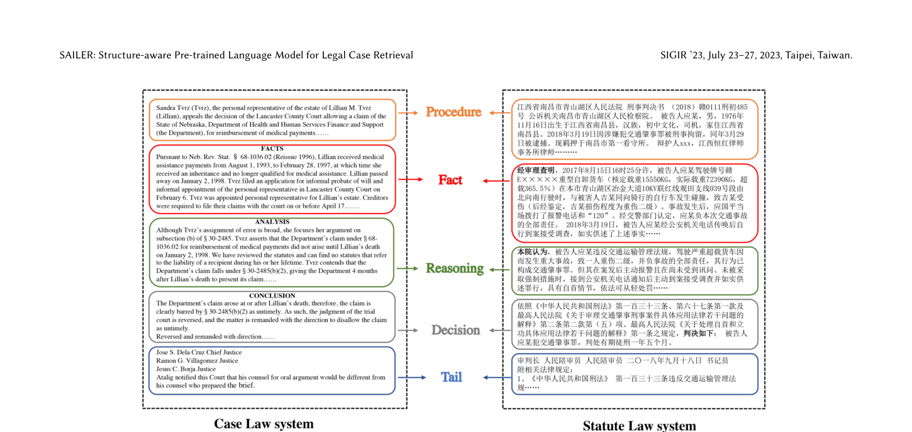
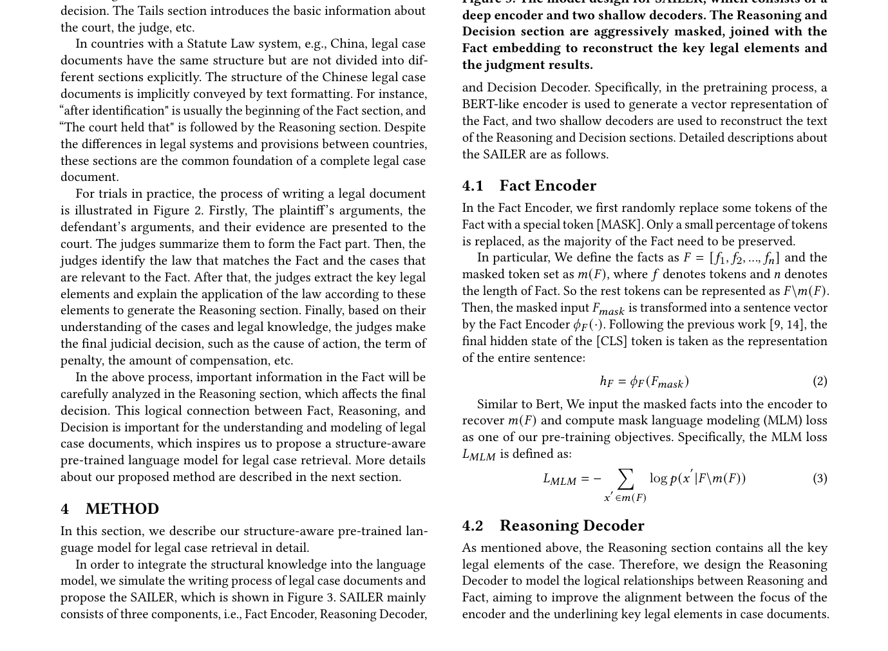

# 法律检索 Embedding 合写

> papers: LEGAL-BERT [arXiv:2010.02559](https://arxiv.org/abs/2010.02559)（EMNLP Findings 2020）；SAILER [arXiv:2304.11370](https://arxiv.org/abs/2304.11370)（SIGIR 2023）
> code: [nlpaueb/legal-bert](https://huggingface.co/nlpaueb/legal-bert-base-uncased) · [CSHaitao/SAILER](https://github.com/CSHaitao/SAILER)
> refs: LeCaRD、COLIEE、CAIL 案例检索赛道
> backbone: BERT 系；SAILER 在法律预训练之上加结构感知目标
> date: 2020 / 2023
> modality: 法律文本（法规、判例、裁判文书）
> languages: 英文（LEGAL-BERT）；中英裁判文书（SAILER）

> 法律域的「专用」主要来自 **术语密度、精确引用（条号 / 案号）、文书结构**，不是来自更炫的双塔。Sparse / Hybrid 在这里是一等公民。课表级对照见《[领域专用 Embedding 适配实践](../领域专用Embedding适配实践.md)》。

---

## 一句话定位

**LEGAL-BERT** 回答「法律语料上继续 MLM 还是从零训」；**SAILER** 回答「案例检索相关 ≠ 事实段像」。两者叠起来才是法律 Embedding 的最小完整故事：领域骨干 + 结构目标 + 评测用案例检索榜，外加 **BM25 保条号**。

| 项 | 内容 |
| --- | --- |
| 通用模型失败 | 把「事实相似」当成「判例相关」；漏掉 § 号、案号、法条 |
| LEGAL-BERT | 法律语料 MLM，分类 / NER 等下游全面好于 BERT |
| SAILER | 按裁判文书结构做预训练，案例检索零样本超过扁平 BERT |

---

## LEGAL-BERT：领域 MLM 怎么做

Chalkidis 等人把「法律 BERT」拆成几条可复现策略（论文标题直译「法学院出来的 Muppets」）：

| 策略 | 做法 | 何时更好 |
| --- | --- | --- |
| BERT 直接用 | 通用 Books+Wiki | 基线，法律下游最弱 |
| Fine-tuning only | 通用 BERT 在法律任务上微调 | 小任务够用 |
| Continue pretrain | 通用 BERT 在法律语料再 MLM | **默认推荐** |
| From scratch | 法律语料随机初始化 MLM | 语料足够大、词表要重做时 |

法律语料包括法规、判例、合同等，词表对 *whereas*、*tort*、*estoppel*、条号模式更友好。下游是分类、NER、多标签法条预测等，**还不是双塔检索**。它对 Embedding 的意义是：SPECTER / MedCPT 那种「先领域 MLM 再对比」的第一段，法律这边已经有人把消融做完——**继续预训练通常优于从零**，除非你要换词表吃条号形态。

不要指望 LEGAL-BERT 的 [CLS] 直接变成案例检索向量：没有对比目标，邻域是「填词语义」，不是「本案应检索哪份先例」。

---

## 案例检索的真正难点

案例检索（Legal Case Retrieval）的 query 常常是一份**新案事实**，要找的是**可引用的先例**，不是「叙事最像的另一篇故事」。SAILER 文中用反例说明：两段文字词面很像，法律相关完全不同——一个是责任构成，一个只是背景陈述。

这和商品「图很像但不是同款」、论文「主题像但没有引用关系」是同一类 **表面相似 ≠ 任务相关**。

---

## SAILER：结构感知预训练

观察：无论英美 case law 还是中文裁判文书，写判决都有稳定段落功能——

**Procedure → Fact → Reasoning → Decision → Tail**

上图把英文上诉意见和中文刑事判决并排：程序、事实、说理、裁判、尾部一一对应。通用 BERT 把全文当扁平 token，注意力不会自动尊重「说理段才是法律相关的锚」。

SAILER 的模型设计（论文 Figure 3）大致是：

1. 输入仍是 Transformer，但按结构段组织。
2. 预训练目标强迫模型 **从事实段重建 / 对齐说理段**（结构感知 MLM 或类似的跨段重建），让表示里「事实→法理」这条链可被向量看见。
3. 下游案例检索用得到的向量做双塔或作为特征；在 LeCaRD、CAIL2022-LCR、COLIEE 上零样本超过扁平领域 BERT。

上图是「领域结构 → 预训练任务」的那一步。LEGAL-BERT 停在换语料；SAILER 把文书写法变成损失。消融表明拿掉结构目标，案例检索会掉——再一次说明 **领域适配的损失要长在领域结构上**。

---

## 评测与对比

| 基准 | 是什么 | 测什么 |
| --- | --- | --- |
| LeCaRD | 中文案例检索 | 给定案情找先例 |
| CAIL 案例检索 | 司法竞赛 | 同上，分布偏国内文书 |
| COLIEE | 国际法律 IR / 蕴含 | 案例 + 法条 |
| LEGAL-BERT 原下游 | NER / 分类 | 不测检索 |

对比方法：BM25（条号、案号极强）、BERT、LEGAL-BERT 扁平向量、SAILER、以及后来的 Cross-Encoder 精排。经验规律：

- **纯 Dense**：语义改写好，精确引用差。
- **纯 BM25**：条号 / 案号稳，同义表述、跨语言差。
- **Hybrid**：法律检索的默认上线形态，不是可选插件。

---

## 可迁移实践

1. 先领域 continue-pretrain，再结构目标，再对比检索——三步不要并成「直接在 2 万篇判决上训双塔」。
2. **Query 与 Doc 可能粒度不同**：query 是事实陈述，doc 是完整判决；非对称编码或分段 encode（事实段 / 说理段分别进索引）值得做。
3. 条号、案号、SKU、PMID 同一类：**必须留稀疏通道**。
4. Hard neg 要「事实像、法律关系不同」，不要随机另一案由。
5. 文搜图的结构模拟：标题 / 属性 / 主图 / SKU，对应 Fact / Reasoning / Decision——属性对齐失败就会变成「图很像、货不对」。
