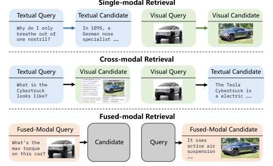
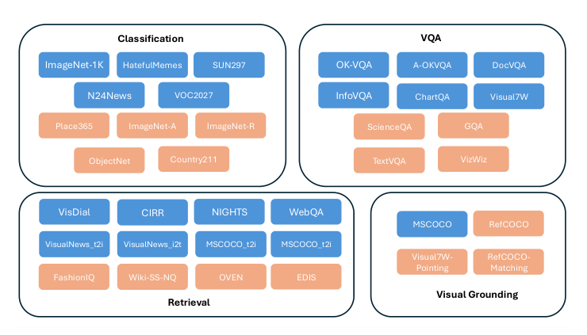
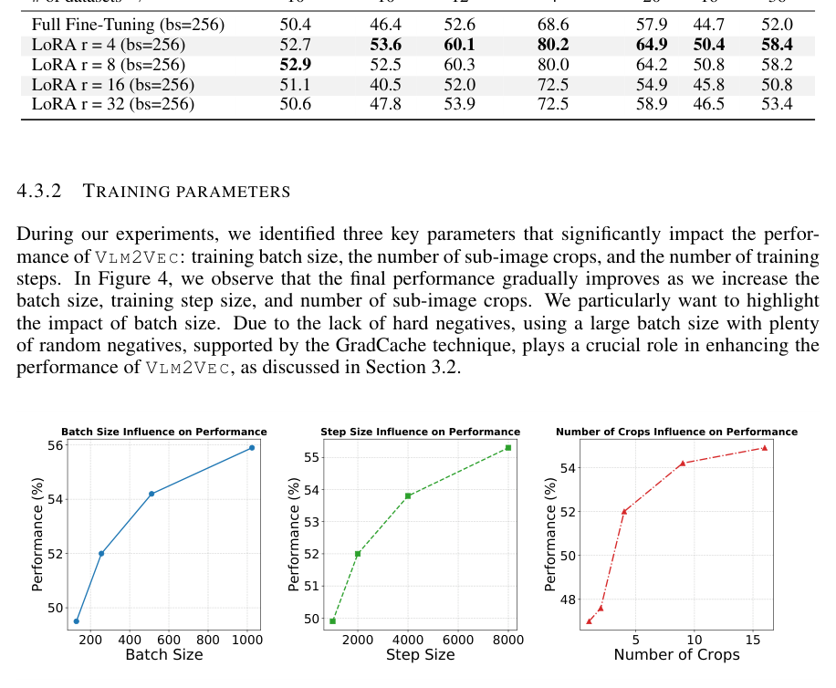
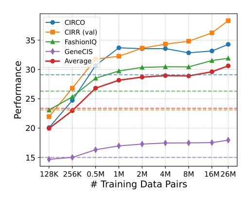

# MLLM 通用多模态嵌入：GME-Qwen2-VL / VLM2Vec+MMEB / BGE-VL+MegaPairs

> **paper**：[GME (Alibaba 2024)](https://arxiv.org/abs/2412.16855) · [VLM2Vec + MMEB (Waterloo × Salesforce 2024)](https://arxiv.org/abs/2410.05160) · [MegaPairs / MMRet / BGE-VL (BAAI 2024)](https://arxiv.org/abs/2412.14475)
> **code / model / dataset**：[gme-Qwen2-VL-2B / 7B on HF](https://huggingface.co/Alibaba-NLP/gme-Qwen2-VL-2B-Instruct) · [tiger-ai-lab/VLM2Vec](https://tiger-ai-lab.github.io/VLM2Vec/) · [BGE-VL / MMRet on HF](https://huggingface.co/BAAI/BGE-VL-MLLM-S1) · [MegaPairs dataset (BAAI)](https://huggingface.co/datasets/JUNJIE99/MegaPairs)
> **refs**：[CLIP (Radford 2021)](https://arxiv.org/abs/2103.00020) · [E5-V (Jiang 2024)](https://arxiv.org/abs/2407.12580) · [UniIR (Wei 2024)](https://arxiv.org/abs/2311.17136) · [MagicLens (Zhang 2024)](https://arxiv.org/abs/2403.19651) · [MARVEL (Zhou 2024)](https://arxiv.org/abs/2310.14037) · [VISTA (Zhou 2024)](https://arxiv.org/abs/2406.04292) · [DINOv2 (Oquab 2023)](https://arxiv.org/abs/2304.07193) · [ColPali (Faysse 2024)](https://arxiv.org/abs/2407.01449)
> **backbone**：GME：**Qwen2-VL 2B / 7B**（Vision Encoder + LLM + Projector）；VLM2Vec：**Phi-3.5-V (~4B) / LLaVA-1.6 (7B)**；MMRet：**CLIP-B/L / LLaVA-Next 7B**
> **date**：VLM2Vec 2024-10；GME 2024-12；MegaPairs 2024-12
> **modality**：文本、图像、视觉文档（PDF 截图）、图文融合（IT）
> **languages**：主英文；GME/MMRet 支持多语（骨干本身多语）
>
> 本文合写 2024 年后半年**三份最重要的 MLLM 单向量通用多模态嵌入工作**：它们共同回答「怎么把一个已经预训练好的 MLLM 改造成能吃 text/image/IT/VD 任意模态输入的通用检索器」，也各自提供了**基准（MMEB / UMRB）**、**数据合成配方**（1.1M / 26M 三元组）与**骨干选择建议**。读完能自己选一套配方跑通「PDF 页面 + 自然图 + 纯文本 + 图文融合」的统一检索。

---

## 一句话定位

三篇论文站在同一个共识上：**已经预训练好的 MLLM（Qwen2-VL / LLaVA / Phi-3.5-V）本身就是一个「秘密的强嵌入模型」**——只需要用对比学习 + 指令微调把它转成检索器。三者在同一坐标系里的位置：

| 维度              | GME                                                  | VLM2Vec                                              | BGE-VL / MMRet                                       |
| ----------------- | ---------------------------------------------------- | ---------------------------------------------------- | ---------------------------------------------------- |
| 骨干              | Qwen2-VL **2B / 7B**                                 | Phi-3.5-V (~4B)、LLaVA-1.6 7B                        | CLIP-B/L（双塔）、LLaVA-Next 7B（MLLM）              |
| 微调方式          | **LoRA rank 8** on MLLM last hidden last-token       | **LoRA** on VLM，last hidden last-token              | 全参 or LoRA on both routes                          |
| 数据             | 8M（1M T→T + 1M I→I + 2M cross + 2M fused + 1.1M **自合成 fused-modal**）    | MMEB 20 训练集，60 万+                              | **26M MegaPairs** 自合成 (+ MMEB / M-BEIR)          |
| 主打贡献          | 首个覆盖 T→T / I→I / T→I / T→VD / IT→IT 5 类的模型；自合成 1.1M IT→IT | **MMEB 基准（36 数据集，20 训练 + 16 OOD）**；VLM→Vector 统一框架   | **26M 三元组合成流水线**（用 3 种相似度模型挖）；MMRet SOTA |
| 主基准结果        | UMRB (47 数据集) 上 GME-7B SOTA                       | MMEB 上 VLM2Vec-Phi-3.5-V **62.9**（+18.2 vs 最佳基线）| MMEB 上 MMRet-MLLM **零样本 SOTA**；CIR 4 基准也 SOTA |
| 数据/权重可用     | 全开源                                              | 全开源                                              | 全开源                                              |

**共同结论**：**MLLM 拿来直接做 single-vector universal 多模态嵌入是可行的，且比双塔 CLIP/SigLIP 系（UniIR / MARVEL / VISTA）明显更强**。三家在 MMEB 的分数：

| 模型                        | MMEB Avg  | 备注                                             |
| --------------------------- | :-------: | ------------------------------------------------ |
| CLIP-L (未 fine-tune)        | 37.8      | 双塔基线                                          |
| SigLIP                       | 40.3      | 双塔基线                                          |
| BLIP2                        | 33.6      | 双塔基线                                          |
| MagicLens                    | 44.7      | 之前 SOTA（未 fine-tune 一档）                    |
| E5-V (LLaVA-Next 8B)          | 42.4      | 只用 NLI 文本训练的 MLLM 嵌入                     |
| **VLM2Vec-Phi-3.5-V**       | **62.9**   | MMEB fine-tune；+18.2 vs 最佳未 fine-tune 基线    |
| **VLM2Vec-LLaVA-1.6-7B**    | 61.9      | 同上                                              |
| **GME-Qwen2-VL-2B**         | 61.9      | UMRB 场景更强（含视觉文档）                        |
| **GME-Qwen2-VL-7B**         | **67.4**   | UMRB SOTA                                         |
| **MMRet-MLLM (LLaVA-Next 7B)** | **60.1**  | 26M MegaPairs 零样本 SOTA                         |

## 谱系与位置

```text
CLIP (2021, 双塔) ── UniIR / MARVEL / VISTA（双塔 + 视觉插件）── UniVL-DR
                                                     │
BLIP-2 / MagicLens（双塔 + late fusion）             │
                                                     │
                    MLLM 时代（LLaVA / Qwen-VL / Phi / InternVL）
                                                     │
                              ┌─────────────────────┼──────────────────────┐
                              │                     │                       │
                        E5-V (2024-07)      VLM2Vec + MMEB           GME (2024-12)
                        只用 NLI 文本训练     (2024-10)                Qwen2-VL 骨干
                                              Waterloo × Salesforce   Alibaba
                                              MMEB 基准 36 dataset     UMRB 基准 47 dataset
                                              20 训练 + 16 OOD          T→VD 支持
                                                     │
                                            MegaPairs / MMRet / BGE-VL (2024-12)
                                            BAAI 26M 三元组
                                            CLIP + MLLM 双路 MMRet
                                                     │
                                             2025 后续：Nomic-Embed-Multimodal、
                                             Voyage-multimodal、Cohere Embed v4、
                                             jina-embeddings-v4 都在这条主线上
```

---

## 问题背景：为什么双塔 CLIP 系不够

2024 年之前，主流多模态检索方案是**双塔 CLIP + 视觉插件**：

- **UniIR (2023)**：CLIP / BLIP 两个塔，score fusion 融合 query 侧的图与文。
- **MARVEL / VISTA (2024)**：文本 embedding 塔 + 一个视觉 plugin，做**共享空间对齐**。
- **MagicLens (2024)**：从网页里抓「同页多图」，构造成对；数据可用性有限。

三个共同瓶颈：

1. **模态分开编码 + 浅融合**：CLIP 的 text tower 与 image tower 独立，融合靠 element-wise add 或 score fusion；跨模态信息只在**打分那一步**才相遇。图文之间的**深层语义关联**学不到。
2. **不支持真正的 fused-modal 输入**：query 一旦是「图 + 一段问题」（如 "What is the max torque on this car?" + 车图），双塔就得预定义融合规则，无法自然处理。
3. **无法处理 visual document（PDF/文档截图）**：文本图和自然图差异极大，CLIP-style 视觉塔在文档图上分数很低。ColPali 这条线用**多向量后交互**绕开，但索引成本高。

三份工作的共同主张：**用 MLLM 直接编码 (image, text)** —— 让 vision encoder + LLM 在**同一个 transformer 里深度融合**，然后取 last-token hidden 作为 embedding。

---

## GME：MLLM + 数据组合 + 融合模态合成

Alibaba 2024-12。首个覆盖 **5 类多模态检索**（T→T / I→I / T→I / T→VD / IT→IT）的通用模型。

### 通用多模态检索的三大分类



- **Single-Modal**：两侧同模态 —— T→T（文本检索）、I→I（图搜图）。
- **Cross-Modal**：跨模态 —— T→I（文搜图）、T→VD（文本查询搜视觉文档 / PDF 截图）、I→T。
- **Fused-Modal**：query 或 doc 是 IT 混合 —— IT→IT（图文对搜图文对，如 EVQA、INFOSEEK、CIRR）。

GME 的一个卖点：**T→VD** 支持——检索 PDF 截图这种任务对以前的 UniIR/VISTA 是空白，GME 直接把 PDF 截图当图像输入 MLLM，让 LLM 内部的 vision tower 自己 OCR。

### UMRB 基准：47 数据集

作者把三类任务的数据集汇总成 **UMRB (Universal Multimodal Retrieval Benchmark)**：47 个评测集，覆盖：

- **T→T (16)**：BEIR 全套。
- **I→I (1)**：NIGHTS。
- **T→I (4)**：VisualNews / Fashion200K / MSCOCO / Flickr30k。
- **T→VD (10)**：TAT-DQA / ArxivQA / DocVQA / InfoVQA + ViDoRe 6 个子集。
- **I→T (4)**、**T→IT (2)**、**IT→T (5)**、**IT→I (2)**、**IT→IT (3)**：各种融合模态。

外加一个 **UMRB-Partial**（39% 数据）供快速迭代实验。

### 架构：MLLM last-token + LoRA + Instruction

架构极简：

```
Instruction + [Text | Image | Image + Text]  →  MLLM (Qwen2-VL)  →  last-token hidden  →  Emb
```

- **LoRA rank 8** 上 Qwen2-VL 微调，学习率 1e-4，temperature $\tau = 0.03$。
- **Instruction 模板**：每个任务给一个自然语言指令（例："Retrieve a passage that provides an answer to the given query about the image"）。
- Loss：温度 InfoNCE，8 个 hard neg + in-batch。

### 关键发现 A：多模态数据组合决定通用性


作者做了一组对照实验：**训练数据只用某一类** vs **各类混合**。上图是 UMRB-Partial 上的分数（Single/Cross/Fused/Mix/All 五列）：

- 只训 T→T：Single 50.3，Cross 67.7，Fused 48.2（Cross 意外挺高，但均衡差）。
- 只训 T→VD：Single 44.9，Cross 75.5（文档检索强），Fused 42.7。
- 只训 IT→IT：Single 45.1，Cross 60.2，Fused 49.3。
- **Mix 平衡合训**：Single **51.1**，Cross **78.4**，Fused **51.9**，**All 60.4**——所有单一数据的对比中最好。

**结论**：MLLM 需要**均衡的多模态数据组合**才能撑起通用能力，任一类偏科都会伤害其它类。

### 关键发现 B：融合模态数据严重不足 → 自建 1.1M

Fused-modal 数据在开源生态里极稀缺（EVQA / INFOSEEK / CIRR 加起来不到 100 万），远少于 T→T / T→I。GME 提出一个**自动合成流水线**：


四步：

1. **Doc2Query Generation**：从 Wikipedia 抓 313k 个 text+image 对，用 Qwen2.5-72B 给每篇生成一个自然 query（"Where is Iris pseudacorus native?"）。**用 gte-Qwen2-1.5B-instruct 建向量索引，把生成的 query 检索回 Wikipedia，若正例段落不在 top-20 就丢**（一致性过滤，仅 1.2% 被丢）。→ 得到 T→IT 类型对。
2. **Entity Extraction & Query Rewrite**：用 LLM 从 query 里抽实体（"Iris pseudacorus"），rewrite 成不含实体名的查询（"Where is the native of this plant?"）。→ 得到需要图作补充的 IT 查询。
3. **Image Retrieval & Generation**：两条路，(a) 用 Google Image Search API 找该实体的图片，取 top-5；(b) 用 FLUX.1-dev 文生图。→ 组装出 IT→IT。
4. **Data Filtering**：Google 抓的图用 CLIP 打图文相关度分，< 0.2 丢弃。**FLUX 生成图质量稳定，不额外过滤**。

产出 **1.135M 高质量 fused-modal 三元组**，最终留 1.102M（数据丢失率 2.9%）。全流程 **600 A100 GPU 小时**。

### Hard Neg 策略：两阶段挖掘

- **Stage 1**：随机负例训一个 $M_1$。
- **Stage 2**：$M_1$ 挖 top-K，non-relevant 作 hard neg，继续训。

这是 ANCE-style；GME 每个训练样本配 **8 个 hard neg**。

### 训练配置

| 项              | 值                                                           |
| --------------- | ------------------------------------------------------------ |
| 骨干            | Qwen2-VL-2B / Qwen2-VL-7B                                    |
| LoRA rank       | 8                                                            |
| 学习率          | 1e-4                                                          |
| 温度            | 0.03                                                         |
| Batch (2B, 图文)| 128；（7B, 图文）：32                                          |
| Batch (纯文本)  | 512（2B）/ 128（7B）                                          |
| 视觉 token 上限 | 1024（图文最长）；文本 max 1800（含图）/ 512（无图）           |
| Hard neg / 样本 | 8                                                            |
| 训练量          | 8M 样本 → 单 epoch                                            |
| 硬件            | 8× A100 80GB                                                 |

### 规模效应


从 2B → 7B → 更大骨干，UMRB 分数持续上升；MLLM-based 嵌入受益于底层 LLM 的规模，与文本嵌入的 3B/7B 规律一致。

### 主结果

- **GME-Qwen2-VL-2B**：UMRB 61.9，已超过 4B 参 One-Peace 与 VISTA。
- **GME-Qwen2-VL-7B**：UMRB **67.4**，**当前 UMR SOTA**。
- **在 T→VD 上**：GME-7B 平均 nDCG@10 ~65，与专门做视觉文档的 ColPali / ColQwen 打平（这两条线本来是竞争关系）。

---

## VLM2Vec + MMEB：把任何 VLM 变 Embedder

Waterloo × Salesforce 2024-10。**MMEB 是这批工作的事实性基准**，VLM2Vec 是给出「怎么把 VLM 转 embedder」的通用框架。

### MMEB：4 元任务 × 36 数据集


MMEB 覆盖 4 类 meta-task：

1. **Classification (10)**：给图 + 类别列表，选正确类。ImageNet-1K / N24News / HatefulMemes / VOC2007 / SUN397 + OOD: Place365 / ImageNet-A / -R / ObjectNet / Country-211。
2. **Visual Question Answering (10)**：query = 图 + 问题；target = 答案。OK-VQA / A-OKVQA / DocVQA / InfoVQA / ChartQA / Visual7W + OOD: ScienceQA / VizWiz / GQA / TextVQA。
3. **Retrieval (12)**：query 和 target 可任意组合（T/I/IT）。VisDial / CIRR / VisualNews / MSCOCO / NIGHTS / WebQA + OOD: OVEN / FashionIQ / EDIS / …
4. **Visual Grounding (4)**：给图 + 描述，选图中对应区域（bbox 或 crop）。RefCOCO / RefCOCO+ / RefCOCOg / Visual7W-P。

**关键设计**：

- **20 训练 / 16 OOD**：训练集完全和评测集分离，禁止选型泄漏。
- **每个 query 1 正 + 999 干扰**（P@1 是主指标）；1000 候选是经验平衡点（太多评测慢、太少易饱和）。
- **所有任务重构成 ranking**：不管原来什么形式，都变成「从 1000 候选里选 1 个」。



上图是各任务的样本量与候选数（部分数据集 candidate 数如 SUN397 的 397 类等原生数）。

### VLM2Vec 训练框架

极简：

```
Instruction + Query(text/image/IT)  →  VLM (Phi-3.5-V / LLaVA-1.6)  →  last-token hidden  →  L2-normalize  →  Emb
```

- 训练 loss：InfoNCE 双向（q → t 与 t → q 各算一次）+ in-batch neg。
- 用 **LoRA** 微调 backbone，冻结 vision encoder。
- 训练 20 个 in-distribution 数据集混合 batch。

### 关键消融



- **加指令 vs 不加**：+3.4 平均。指令对 MLLM-based embedder 是必要的（与 INSTRUCTOR / E5-instruct 结论一致）。
- **LoRA vs 冻结 vision encoder**：LoRA 只训 LLM 侧最优；vision encoder 通常冻结即可（预训练已经很强）。
- **last-token vs mean pool**：last-token 略优，因为 MLLM 的因果注意力让 last-token 天然是「全序列聚合」的位置。
- **Retrieval 数据训 → 分类/VQA 泛化**：多任务合训比单任务好 5–10 点。

### t-SNE：VLM2Vec 学到有意义的语义几何


上图对比 CLIP、SigLIP、VLM2Vec-Phi-3.5-V 在 MMEB 若干任务上的 embedding 分布：

- **CLIP / SigLIP**：不同任务的 embedding 混在一起，没有明显任务分离。
- **VLM2Vec**：**同任务样本聚成明显的簇**，且簇间几何合理（比如「同类 VQA 问题的答案」聚在一起）。

这说明 MLLM-based 嵌入不是「更强的 CLIP」，而是**学到了 instruction-aware 的语义几何**。

### 主结果

| 模型                              | Params | MMEB Avg | 备注                          |
| --------------------------------- | :----: | :------: | ----------------------------- |
| CLIP-L (未 fine-tune)              | 428M   | 37.8     | 双塔基线                       |
| SigLIP                             | 878M   | 40.3     | 双塔基线                       |
| MagicLens                          | ~1B    | 44.7     | 之前 SOTA（未 fine-tune）      |
| E5-V (LLaVA-Next 8B)               | 8B     | 42.4     | 仅 NLI 文本训练的 MLLM         |
| **VLM2Vec-Phi-3.5-V** (LoRA)       | 4.2B   | **62.9**  | +18.2 vs 最佳未 fine-tune     |
| **VLM2Vec-LLaVA-1.6-7B** (LoRA)    | 7B     | 61.9     |                                |

**OOD 一致性**：VLM2Vec 在 16 个未见数据集上仍 57.1（+15.4 vs 基线），说明**instruction-based 微调不会过拟合训练分布**。

---

## MegaPairs / MMRet / BGE-VL：26M 数据合成

BAAI 2024-12。三样合并发布：**MegaPairs 数据集** + **MMRet 模型** + **公开发布名 BGE-VL**。核心贡献：**用一个可扩展的自动合成流水线做出 26M 高质量三元组**，让 500k 采样就能超越 MagicLens 36.7M 训练数据（**70× 数据效率**）。

### 数据合成流水线


给定一个 image corpus（DataComp / Recap-DataComp-1B 20M 已 caption 图）：

**Step 1：Mining Correlated Image Pairs**（用 3 种相似度模型做 heterogeneous KNN）

- **视觉-语义相似**（EVA-CLIP image encoder）：对同一物体不同视角/上下文。
- **视觉-模式相似**（DINOv2 image encoder）：颜色/布局/纹理相似。
- **caption 相似**（EVA-CLIP text encoder）：描述文本相似。

**过滤规则**：相似度分数**在 (0.8, 0.96) 区间**才保留 —— 太低是弱相关，太高是近重复（duplicate）。

**Hard neg**：对同一 query 图 $I_q$，把三种相似度里挖出的其它 $I_{t_j}$（不是当前正例 $I_{t_i}$）作为**hard neg**。5 个 hard neg / 三元组。

**Step 2：Generate Open-Ended Instructions**

- 用 **InternVL2-26B**（MLLM）为每对 $(I_q, I_{t_i})$ 生成详细描述 $D_i$：讲清两图的共同点与差异。
- 用 **LLaMA3-8B**（LLM）把 $D_i$ 精炼成**多条**开放式检索指令 $T_{q\rightarrow t_i}$（每对至少 3 条不同措辞）。
- 三元组：$(I_q, T_{q\rightarrow t_i}, I_{t_i})$。

**关键 insight**：**开放域图片相互之间就存在丰富多样的语义关系**——不用局限于「网页同页多图」（MagicLens 的方案）。通过异构相似度模型采样，能挖出**「同物不同角度」/「同风格不同物」/「同 caption 不同图」** 等多种关系。

### 数据规模与质量

- **26,235,105 个三元组**（26M+）。
- 用 20M Recap-DataComp-1B 图作 corpus。
- **每对 3+ 条指令 + 5 hard neg**。
- InternVL2-26B + LLaMA3-8B 标注全流程用**开源模型**，可复现且成本低。

### 数据缩放实验



- **500k MegaPairs** 已经打过 MagicLens 36.7M 全量 —— **70× 数据效率**。
- 数据量翻倍到 4M 时，分数继续显著上升；到 20M+ 才饱和。
- 结论：**质量 > 数量**（500k 干净 > 36.7M 噪声），但**质量确认后堆量继续有收益**（500k → 20M+ 仍有 8+ 点提升）。

### MMRet 模型：双路架构

MMRet 同时提供两种骨干：

**CLIP-based MMRet**（双塔）：
- 图像塔 $\Phi_I$、文本塔 $\Phi_T$（CLIP-B/L）。
- 融合：**score fusion** (element-wise add) 或 concat。
- Base / Large 两档。

**MLLM-based MMRet**（单塔）：
- LLaVA-Next 7B / InternVL 之类。
- 单向前向，取 last-token hidden。

**两者训练相同**：温度 InfoNCE + 5 hard neg + LoRA / 全参微调。

### 主结果


**在 MMEB 上（零样本）**：

| 模型              | MMEB Avg | 备注                                       |
| ----------------- | :------: | ------------------------------------------ |
| CLIP-L             | 37.8     | 基线                                       |
| SigLIP             | 40.3     |                                            |
| MagicLens          | 44.7     | 双塔                                       |
| E5-V (LLaVA-Next)  | 42.4     |                                            |
| **MMRet-CLIP-B**   | 51.3     | 26M MegaPairs 上零样本                     |
| **MMRet-CLIP-L**   | 54.7     |                                            |
| **MMRet-MLLM**     | **60.1**  | 双基座 + 26M MegaPairs                     |
| VLM2Vec-Phi-3.5-V  | 62.9     | 但是 **fine-tuned** on MMEB train，非零样本 |

**在 4 个 CIR（Composed Image Retrieval）基准上**（CIRCO / CIRR / FashionIQ / GeneCIS）：

- MMRet 在**全部 4 个基准**上取得零样本 SOTA，比之前 MagicLens 高 3–15 点。

**下游微调后继续领先**：MMRet-MLLM 在 MMEB train 上 fine-tune 之后总分再涨到 ~65。


上图是 MMRet 在 CIR 场景下的定性结果：给「同款不同色」「同风格不同物件」等复杂 query，MMRet 能返回符合意图的图。

---

## 三者的技术差异与共同结论

### 差异一览

| 维度                | GME                          | VLM2Vec                          | MMRet / BGE-VL                     |
| ------------------- | ---------------------------- | -------------------------------- | ---------------------------------- |
| **主打**            | 覆盖 T→VD 与 IT→IT，UMRB SOTA | MMEB 基准 + 通用框架             | 26M 三元组 + 70× 数据效率           |
| **数据策略**        | 8M 精挑组合 + 1.1M 自合成 IT | MMEB 20 训练集混合                | **26M 全自动合成**                 |
| **合成方法**        | Doc2Query + entity + FLUX 生图 | 复用现有数据集                    | 3-similarity KNN + VLM + LLM 标注 |
| **骨干**            | Qwen2-VL 2B/7B               | Phi-3.5-V / LLaVA-1.6            | CLIP + LLaVA-Next 双路             |
| **微调**            | LoRA r=8                     | LoRA                              | LoRA + 全参                        |
| **Hard neg**        | 8 per sample, ANCE 式两阶段挖 | in-batch dominant                | 5 per sample, 从 KNN 采             |
| **基准**            | UMRB（47 数据集）             | MMEB（36 数据集）                  | MMEB + CIR 4 基准                   |

### 共同结论：MLLM-embed 的六条实证

1. **MLLM 是天然的 embedder**：last-token hidden 加 InfoNCE + LoRA 就够；不需要复杂的架构改造。
2. **指令是必要的**：不加指令平均掉 3–5 点。所有三家都用「Instruction + Content」的模板。
3. **数据组合决定通用性**：GME 消融把「单一数据类型」和「混合」对比 —— 混合平均 +5+。VLM2Vec 用 MMEB 20 训练集混合也是同理。
4. **数据合成 > 数据规模**：MagicLens 36.7M vs MegaPairs 500k，后者更好。**质量优先，但确认质量后堆量继续涨**。
5. **T→VD 与 IT→IT 需要专门训练数据**：ColPali 用 late interaction 绕开，GME 用大量 T→VD 数据直接训单向量；两条路都能工作，但成本不同。
6. **MLLM 系全面胜过双塔系**：CLIP-B 37.8 → MMRet-CLIP-B 51.3（+13.5）；同一 CLIP 骨干加 MegaPairs 训练就翻天覆地。

### 何时选谁

- **需要视觉文档（PDF、发票、图表）** → GME-Qwen2-VL 7B 或 ColPali/ColQwen 系（后者索引大但精度更高）。
- **只有 MMEB / CIR 类**：VLM2Vec 或 MMRet-MLLM。
- **需要多语 + 图文**：GME-7B（Qwen2-VL 多语） / MMRet 多语版。
- **想尝试自建数据**：MegaPairs 的合成流水线**最可扩展**，Doc2Query 类（GME）适合有 caption 语料的场景。

---

## 常见错误用法

1. **拿 CLIP 微调想追 MMRet-MLLM**：**双塔的天花板显著低于 MLLM**（CLIP-L fine-tuned ~46 vs MMRet-MLLM 60）。想上 60+ 必须用 MLLM 骨干。
2. **忽略指令**：GME/VLM2Vec/MMRet 全部依赖 instruction；生产环境漏 instruction 会掉 3–10 点。
3. **对 IT→IT 类任务用双塔 score fusion**：CLIP 双塔的融合是**浅融合**，无法捕捉「图 + 问题」的复杂 query 语义；应上 MLLM 或 MMRet-CLIP + LLM 后处理。
4. **数据合成时不做一致性过滤**：GME 明确 1.2% 的合成 query 被过滤（用向量索引反查 top-20），MegaPairs 用相似度阈值 (0.8, 0.96)。**不加过滤直接训会严重伤害分数**。
5. **在小 batch 训 MLLM 嵌入**：MLLM 骨干本身推理成本高，batch 32–128 是主流；比 CLIP 微调常见的 4k–16k 小很多。**hard neg 数量必须补上**（8 / sample）才能追分。
6. **不冻结 vision encoder**：LoRA 微调 LLM 侧就够，vision encoder 冻结更稳。VLM2Vec 明确消融说明这一点。
7. **拿 GME/MMRet 做 pure T→T 检索期望超过 NV-Embed-v2**：MLLM 嵌入在**纯文本检索**上通常略弱于同参数量的纯文本 LLM 嵌入（Mistral-7B 只训文本，能力更专一）。多模态优势在跨模态和融合模态场景。

---

## 与本仓库既有报告的挂接

- 图文四类路线全景：[图文 Embedding 模型技术综述](图文Embedding模型技术综述.md)（① 双塔 CLIP / SigLIP → ③ MLLM-Emb ← 本节；④ Late Interaction 见下）。
- Late Interaction 视觉文档派对比：[ColPali 详解](ColPali/ColPali详解.md) · [ColQwen 系列详解](ColQwen/ColQwen系列详解.md)（同解决 T→VD，但用多向量后交互；单向量 GME 是另一条路）。
- CLIP/SigLIP 基础：[CLIP 详解](CLIP/CLIP详解.md) · [SigLIP 与 SigLIP 2 详解](SigLIP/SigLIP与SigLIP2详解.md)。
- Jina-CLIP 系（双塔中的现代版）：[jina-clip 系列详解](Jina/clip/jina-clip系列详解.md)。
- 数据合成血脉：[LLM-DA 文本行人检索数据增强详解](LLM-DA-TPR/LLM-DA文本行人检索数据增强详解.md)（专场 domain 的合成）· [DeVE-QA 稠密视频事件问答详解](DeVE-QA/DeVE-QA稠密视频事件问答详解.md)（视频 QA 数据）。
- 主文对应章节：[Embedding 调研报告](Embedding调研报告.md) §10 「多模态与专用 Embedding」及 §7.4「多模态检索在应用层的分叉」。

---

*本报告基于 GME (arXiv 2412.16855)、VLM2Vec + MMEB (arXiv 2410.05160)、MegaPairs / MMRet / BGE-VL (arXiv 2412.14475) 三篇原论文与官方 HF card 整理。分数为 2024-12 前的 MMEB / UMRB / CIR 数据。VLM2Vec 的 MMEB 建议以官方最新排行榜为准（[MMEB Leaderboard](https://tiger-ai-lab.github.io/VLM2Vec/)）。*
