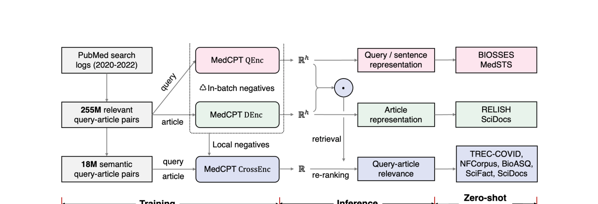
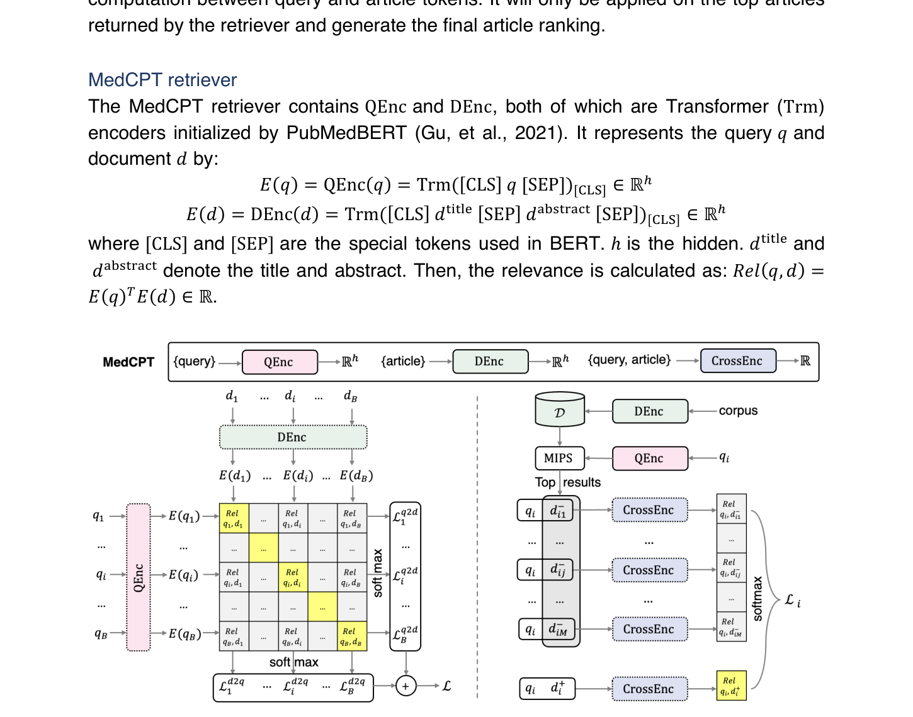

# MedCPT 技术详解

> paper: [arXiv:2307.00589](https://arxiv.org/abs/2307.00589)（Bioinformatics 2023）
> code: [ncbi/MedCPT](https://github.com/ncbi/MedCPT) · [HF NCBI/MedCPT-Query-Encoder](https://huggingface.co/ncbi/MedCPT-Query-Encoder)
> refs: PubMedBERT [2010.11985](https://arxiv.org/abs/2010.11985)；BEIR [2104.08663](https://arxiv.org/abs/2104.08663)
> backbone: PubMedBERT（query 塔 / article 塔 / cross-encoder 均从此初始化）
> date: 2023
> modality: 生物医学文本检索（query ↔ PubMed 题录）
> languages: 英文生物医学

> 本文把 **2.55 亿 PubMed 点击对、非关键词语义对、双塔 + 交叉编码器两段、BEIR 生物医学零样本** 写全。点击日志怎么变成对比数据、以及和文搜图点击对的同构，见《[领域专用 Embedding 适配实践](../领域专用Embedding适配实践.md)》。

---

## 一句话定位

**MedCPT**（Contrastive Pre-trained Transformers for biomedical IR）用 **PubMed 搜索日志**当监督，在 PubMedBERT 上训出 **非对称双塔检索器 + 交叉编码器精排**，在生物医学 IR 上零样本超过当时的 GTR-XXL / cpt-text-XL 等通用大模型。

| 项 | 内容 |
| --- | --- |
| 问题 | 通用 Embedding 不懂基因名、药名、MeSH；临床 / 文献检索要精确术语 |
| 监督 | 用户搜了 query 后点击的文章 = 正对（弱监督，但规模极大） |
| 架构 | QEnc / DEnc 双塔召回 + CrossEnc 精排 |
| 宣称效果 | BEIR 生物医学子集零样本 SOTA（相对通用稠密检索器） |

谱系位置：

```text
PubMedBERT / BioBERT（领域 MLM）
    → 通用 DPR / GTR（开放域点击或 QA）
    → MedCPT 双塔（PubMed 点击 255M + in-batch）
    → MedCPT CrossEnc（18M 语义对 + 检索器挖的 local hard neg）
```

---

## 问题背景

生物医学 IR 有三个同时成立的约束：

1. **术语密度高**：同一概念多种写法（基因别名、药商品名），也有必须字面命中的 ID。
2. **标注贵**：TREC-COVID、BioASQ 量级相对开放域小几个数量级。
3. **通用大双塔并不自动赢**：GTR-XXL 在开放域很强，但没见过 PubMed 点击分布。

MedCPT 的答案和 SPECTER 不同源、同构：**领域里已经有行为日志，把它当成弱监督对比数据，而不是用小标注集从头训。** SPECTER 用引用边，MedCPT 用点击边。

---

## 架构

三个模块，全部从 **PubMedBERT** 初始化：

| 模块 | 输入 | 输出 | 线上角色 |
| --- | --- | --- | --- |
| **QEnc** | `[CLS] query [SEP]` | [CLS] 向量 $E(q)\in\mathbb{R}^h$ | 在线 encode query |
| **DEnc** | `[CLS] title [SEP] abstract [SEP]` | [CLS] 向量 $E(d)$ | 离线索引全部 PubMed 题录 |
| **CrossEnc** | query 与 article 拼接 | 标量相关分 | 对双塔 Top-K 精排 |

相关分：$\mathrm{Rel}(q,d)=E(q)^\top E(d)$（点积，便于 MIPS）。

**非对称**是故意的：用户 query 短、口语化；文章是题名+摘要。两侧共享初始化但不共享权重（训练时两塔独立更新）。这和 CLIP 文搜图「文本塔 ≠ 视觉塔、但共空间」是同一形态。



上图从左到右是训练 → 推理 → 零样本评测。255M 点击对只喂双塔（in-batch 负例）；18M「非关键词」语义对喂交叉编码器，负例来自已经训好的检索器。评测覆盖句相似（BIOSSES / MedSTS）、文章相似（RELISH / SciDocs）和检索（TREC-COVID、NFCorpus、BioASQ、SciFact）。

---

## 训练数据

### 255M 点击对（双塔）

来源：PubMed 搜索日志（文中窗口约 2020–2022）。用户发出 query、点击某篇文章，记为正对 $(q,d^+)$。

这是典型**弱监督**：

- 假正例：点了标题党、点了看一眼就关
- 假负例：相关但没点、点了第二页才看到

规模把噪声摊平。作者还做了过滤（去导航式、去过短等，细节见原文附录），但**没有**用人工相关标注当主监督。

### 18M 非关键词语义对（交叉编码器）

点击里有大量「query 是关键词、文章题名也是关键词」的词面匹配。这类对把 Cross-Encoder 训成「重新发明 BM25」。作者另筛 **非关键词** query–article 对（query 不像布尔检索式），强迫模型学语义相关。

### 负例

| 阶段 | 负例 | 用意 |
| --- | --- | --- |
| 双塔 | in-batch 其他文章 | 便宜、撑开空间 |
| 交叉编码器 | 双塔 MIPS 挖出的 local hard neg | 精排要分得开「主题对、答案错」 |

交叉编码器损失是在 $\{d^+, d^-_1,\ldots,d^-_M\}$ 上的 softmax / 对比，和 RocketQA 用 CE 消化 hard 负例同一套路。



左图 $B\times B$ 相似度矩阵对角线是正对，行/列 softmax 做成 q2d 与 d2q 双向 InfoNCE。右图检索器先从全库捞难负例，再让 CrossEnc 在正 + M 个难负上做 listwise 对比。

---

## 评测与对比

**设定是零样本**：生物医学 BEIR 任务上不微调。对照包括 BM25、通用稠密检索（DPR / ANCE / TAS-B）、以及当时最强通用模型之一 GTR-XXL、cpt-text-XL。

结论（机制层，不背具体小数）：

- 双塔 MedCPT 已能在多个生物医学检索集上超过远更大的通用双塔。
- 加上 CrossEnc 精排再涨一截，尤其是 SciFact / TREC-COVID 这类「主题近、主张要对」的任务。
- 文章编码器在 RELISH 文章相似、SciDocs 上也强——点击监督不只服务短 query。

**对比方法**：

| 方法 | 数据 | 为何在生物上可能输 |
| --- | --- | --- |
| BM25 | 无 | 同义基因名、改写 query 漏召回 |
| BioBERT / PubMedBERT 直接当句向量 | 只有 MLM | 没有检索对比 |
| GTR-XXL 等通用大双塔 | 开放域点击 / QA | 域偏移：日常 web ≠ PubMed |
| MedCPT | 领域点击 + 领域骨干 | 规模与分布都对齐下游 |

---

## 关键数据集简介

| 数据 / 基准 | 是什么 | 在本文中的角色 |
| --- | --- | --- |
| PubMed 点击日志 | 真实用户检索行为 | 主训练监督 |
| PubMedBERT 预训练语料 | PubMed 全文 / 摘要 MLM | 骨干 |
| TREC-COVID | COVID 文献检索 | 零样本检索 |
| BioASQ | 生物医学问答检索 | 零样本检索 |
| NFCorpus | 营养学文献 | 零样本检索 |
| SciFact | 科学主张核验检索 | 零样本检索 |
| RELISH | 生物医学文章相似 | 文章向量质量 |
| BIOSSES / MedSTS | 句相似 | query 塔能否当句向量 |

---

## 可迁移实践

1. **有搜索点击就先用点击，不要先上人工三元组。** 255M 脏对 > 10k 干净对，前提是骨干已经是领域 MLM（PubMedBERT）。
2. **双塔与精排的数据可以分开：** 脏、大规模 → 召回；更语义、带 hard neg → 精排。
3. **过滤「纯关键词点击」再训 CE**，否则精排学不会语义。
4. **零样本领域榜 > MTEB 平均分。** 通用 4.8B 双塔可以在开放域赢、在 PubMed 上输给 110M 领域模型。
5. **术语 ID 仍要 Hybrid。** MedCPT 是稠密主路径；基因 ID / PMID 精确匹配仍应留稀疏通道（主文 Hybrid 纪律，本文不重复工程细节）。

文搜图对照：把「PubMed 点击」换成「搜索词 → 点击商品图 / 点击图搜结果」，把 DEnc 换成视觉塔，就是同一张训练图。见《[领域专用 Embedding 适配实践](../领域专用Embedding适配实践.md)》。
