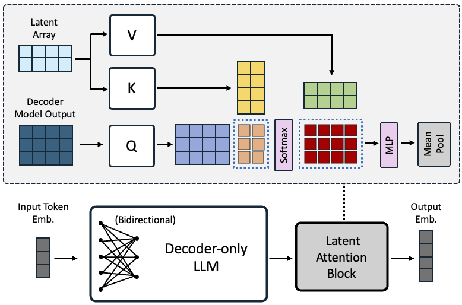

> 原文: [arXiv:2405.17428](https://arxiv.org/abs/2405.17428)（ICLR 2025）
> 说明: 本文为论文全文中文技术展开，公式/图表编号与原文一致；图片自 arXiv HTML 抽取，caption 中译；数值原样保留。

**预印本信息：** arXiv:2405.17428v3 [cs.CL]，首发 2024 年 5 月；ICLR 2025。

**开源：** https://huggingface.co/nvidia/NV-Embed-v1 / v2

---

# NV-Embed：训练 LLM 作为通用嵌入模型的改进技术（Improved Techniques for Training LLMs as Generalist Embedding Models）

**作者：** Chankyu Lee\*、Rajarshi Roy、Mengyao Xu、Jonathan Raiman、Mohammad Shoeybi、Bryan Catanzaro、Wei Ping\*

**单位：** NVIDIA

\* 共同通讯。

---

## 摘要（Abstract）

基于 decoder-only LLM 的嵌入模型开始**超过** BERT/T5-based 嵌入模型。本文提出 **NV-Embed**——包含**架构设计**、**训练流程**、**数据整理**三方面改进，显著提升 LLM 作为通用嵌入模型的性能，同时保持简洁与可复现性：

**架构面**：

- **潜在注意力层（latent attention layer）** 获取池化嵌入——一致优于 mean pooling 或 LLM 的 last `<EOS>` token embedding；
- **训练时移除 causal attention mask**（转 bidirectional）——提升表征质量。

**训练面**：

- **两阶段对比指令微调**：
  1. **第一阶段**：仅检索数据 + in-batch negatives + hard negatives；
  2. **第二阶段**：混入非检索任务（分类、聚类、STS）——**不用 in-batch negatives**（避免同类样本被误当负样本）。

**数据面**：

- **positive-aware hard-negative mining**（NV-Retriever 技巧）；
- **合成数据生成**（Mixtral-8x22B-Instruct，120k 例、60k 任务）；
- **公开数据集**。

**结果**：**NV-Embed-v1** 与 **NV-Embed-v2** 分别在 2024 年 5 月 24 日与 8 月 30 日登上 **MTEB No.1**——覆盖 56 embedding 任务；在 **AIR Benchmark** 长文档段第 1、QA 段第 2。

---

## 1 引言（Introduction）

**背景**：Decoder-only LLM 长期被认为不适合嵌入任务，因为：

1. **单向注意力**限制表征能力；
2. **高维嵌入**可能受维度灾难困扰。

**转折**：Neelakantan et al. (2022) 用预训练 GPT-3 做初始化、continued contrastive training、取 `<EOS>` 位向量作为嵌入——**text-embedding-3-large** MTEB 64.59；E5-Mistral (Wang et al., 2023) 66.63；GritLM 66.76；SFR-Embedding 67.56；Voyage-large-2-instruct 68.28；Gecko 66.31——**decoder-only LLM 走上前沿**。

**NV-Embed 的贡献**：

1. **架构**：**latent attention layer** 取代 mean pooling 或 `<EOS>` token——一致提升 retrieval + 下游任务；**移除 causal mask**（改用 bidirectional）无需额外训练阶段（相对 LLM2Vec BehnamGhader 2024 与 GritLM Muennighoff 2024 更简洁）；
2. **训练**：**两阶段对比指令微调**——第一阶段专攻检索、第二阶段混入非检索任务；
3. **数据**：**positive-aware hard-negative mining**（NV-Retriever [Moreira 2024]）+ 合成数据（Mixtral-8x22B）+ **example-based multi-class labeling**（分类/聚类任务用同类样本而非 label 作为正例）。

**表 1（MTEB Leaderboard 截至 2024-10-01）**：

| 模型 | Retrieval(15) nDCG@10 | Rerank(4) MAP | Cluster(11) V-Meas | PairCLF(3) AP | Class(12) Acc | STS(10) Spear | Summ(1) Spear | **Avg(56)** |
| :--- | ---: | ---: | ---: | ---: | ---: | ---: | ---: | ---: |
| **NV-Embed-v2** | **62.65** | 60.65 | 58.46 | 88.67 | **90.37** | 84.31 | 30.70 | **72.31** |
| Bge-en-icl (zero shot) | 61.67 | 59.66 | 57.51 | 86.93 | 88.62 | 83.74 | 30.75 | 71.24 |
| Stella-1.5B-v5 | 61.01 | 61.21 | 57.69 | 88.07 | 87.63 | 84.51 | 31.49 | 71.19 |
| SFR-Embedding-2R | 60.18 | 60.14 | 56.17 | 88.07 | 89.05 | 81.26 | 30.71 | 70.31 |
| Gte-Qwen2-7B-instruct | 60.25 | 61.42 | 56.92 | 85.79 | 86.58 | 83.04 | 31.35 | 70.24 |
| **NV-Embed-v1** | 59.36 | 60.59 | 52.80 | 86.91 | 87.35 | 82.84 | 31.20 | 69.32 |
| Bge-multilingual-gemma2 | 59.24 | 59.72 | 54.65 | 85.84 | 88.08 | 83.88 | 31.20 | 69.88 |
| Voyage-large-2-instruct | 58.28 | 60.09 | 53.35 | 89.24 | 81.49 | 84.58 | 30.84 | 68.28 |
| SFR-Embedding | 59.00 | 60.64 | 51.67 | 88.54 | 78.33 | 85.05 | 31.16 | 67.56 |
| GritLM-7B | 57.41 | 60.49 | 50.61 | 87.16 | 79.46 | 83.35 | 30.37 | 66.76 |
| E5-mistral-7b-instruct | 56.90 | 60.21 | 50.26 | 88.34 | 78.47 | 84.66 | 31.40 | 66.63 |
| Text-embed-3-large (OpenAI) | 55.44 | 59.16 | 49.01 | 85.72 | 75.45 | 81.73 | 29.92 | 64.59 |

---

## 2 相关工作（Related Work）

**2.1 双向嵌入模型**（BERT/T5 系）：Sentence-BERT、SimCSE 用 NLI 微调；后来 Wang et al.（E5）、Izacard et al.（Contriever）、Ni et al.（GTR/Sentence-T5）用**弱监督对比预训练 + 有监督微调**范式。近期 mxbai-embed-large-v1（64.68）、UAE-Large-V1（64.64）、Voyage-large-2-instruct（68.28）都在这条线上。

**2.2 Decoder-only LLM 嵌入模型**：

- **早期**：Neelakantan (2022) OpenAI text-embedding，用 GPT-3 初始化 + `<EOS>` embedding；
- **E5-Mistral (2023)**：任务多样合成数据 + Mistral-7B（66.63）；
- **SFR-Embedding**（Meng et al. 2024b）；
- **GritLM** 用生成 + 嵌入统一目标；
- **LLM2Vec**（BehnamGhader 2024）用**额外训练阶段做 masked token prediction** 转 bidirectional；
- **Gecko**（Lee et al. 2024a）从 LLM 蒸馏小 bidirectional 模型，重标 positive / hard negative；
- **Linq-embed-mistral**（Kim et al. 2024）用 LLM 精修数据；
- **NV-Retriever**（Moreira et al. 2024）提出 **positive-aware hard-negative mining**；
- **BGE-en-icl**（Xiao et al. 2024）训练时加 in-context few-shot 样本（本文对 BGE-en-icl 做零样本评测以公平比较）。

---

## 3 方法（Methods）

### 3.1 双向注意力（Bidirectional Attention）

Decoder-only LLM 的 causal mask 是为自回归生成设计的——防止 auto-regressive 时的信息泄露。但**单向注意力限制表征能力**——同规模 GPT 在 NLU 上不如 BERT/T5。

**NV-Embed 做法**：**训练时直接移除 causal attention mask**（无需 masked prediction 预训练阶段）——比 LLM2Vec、GritLM 简洁。这是对比训练时**唯一**的架构改动。

### 3.2 潜在注意力层（Latent Attention Layer）

**Motivation**：

- **Mean pooling**：可能稀释关键短语的信息；
- **Last `<EOS>` embedding**：受 **recency bias** 影响——过度依赖最后一个 token。

**方案**（受 Perceiver [Jaegle et al., 2021] 启发）：加一个**潜在注意力层**——用**可训练的 latent 数组作为"词典"**：

- 记 LLM 最后一层 hidden state 为 $Q \in \mathbb{R}^{l \times d}$（$l$ = 序列长度，$d$ = hidden dim）；
- 可训练 latent array $K = V \in \mathbb{R}^{r \times d}$（$r$ = latent 数量 = 512，作者选 8 头）；
- **cross-attention**：

$$
O = \text{softmax}(QK^T) V \tag{1}
$$

$O \in \mathbb{R}^{l \times d}$；

- 接 MLP（两个线性层 + GELU）；
- **最后 mean pool** 得到序列嵌入。

**Design 哲学**：这是**dictionary learning**——latent array 作为"字典"提供更表达力的表征。**不同于 Perceiver IO**（不同架构角色）。

**为什么 latent attention 有效？** latent array 引入了**新的自由度**，让模型能"投影"输入到更适合下游任务的空间；相比之下额外的 self-attention 层没多带什么——LLM 内部已经有很多 self-attention 层。

**图 1（原文 Figure 1）：** NV-Embed 架构。左：**decoder-only LLM**（causal mask **在训练中移除**转 bidirectional）。右：**latent attention layer**——LLM 输出作为 Query，可训练 **latent array**（数量 $r = 512$，8 头）作为 Key/Value，做 cross-attention 得到 $O$，再过 MLP（两线性层 + GELU），最后 **mean pool** 得到序列嵌入。蓝色虚线标示两次 QKV attention 的矩阵乘法。

### 3.3 两阶段指令微调（Two-Stage Instruction-Tuning）

**为什么需要两阶段？**

- **检索任务**天然适合 in-batch negatives（reuse computation，$B^2$ pair vs. $B$ label）；
- **分类/聚类任务**：batch 内的其它样本可能与 query 同类——**用作负样本会误导模型**；
- **检索比其它任务更难**——先专攻检索，再融合其它任务。

**方案**：

- **Stage 1（检索）**：只用检索数据集（MSMARCO、HotpotQA、NQ、PAQ、Stack Exchange、NLI、SQuAD、ArguAna、BioASQ、FiQA、FEVER、HoVer、SciFact、NFCorpus、MIRACL、Mr.TyDi）；使用 **in-batch negatives + curated hard negatives**；
- **Stage 2（混合）**：检索 + 分类 + 聚类 + STS 数据一起训；**不用 in-batch negatives**（避免同类误伤）；使用 curated hard negatives（每 query 1 个正 + 7 个负）。

**指令模板**：

$$
q^+_{\text{inst}} = \text{Instruct : } \{task\_definition\} \text{ Query : } q^+ \tag{2}
$$

**关键**：训练与评测时**都 mask 掉 instruction token 的输出嵌入**（虽然 instruction token 仍通过 self-attention 影响其它 token）；**文档端不加 instruction 前缀**——文档 index 可预建。

---

## 4 训练数据（Training Data）

### 4.1 公开检索数据集

MSMARCO、HotpotQA、Natural Question、PAQ、Stack Exchange、NLI、SQuAD、ArguAna、BioASQ、FiQA、FEVER、HoVer、SciFact、NFCorpus、MIRACL、Mr.TyDi——16 个数据集。

**注意**：部分数据集（如 MSMARCO）是 MTEB 的 train split——沿用 SFR-Embedding、E5-Mistral、LLM2Vec、GritLM 等**领先通用嵌入模型的既有做法**。作者在 AIR-bench 上单独验证**零样本泛化能力**。

#### 4.1.1 Hard-Negative Mining（positive-aware）

对每个 query 挖 hard negatives。挑战：naive top-k retrieval 会挖到**假负样本**（其实是正例但没标）。**NV-Retriever 的 positive-aware 技巧**（Moreira et al., 2024）：

- 用某个 teacher embedding 模型对 (query, candidate) 打分；
- 保留 score **小于 positive 分数一定百分比** 的样本作为 hard negative；
- **过滤掉分数太高（可能是假负例）的样本**。

### 4.2 公开非检索数据集

**分类**（binary + multi-class + clustering）：

- **Binary CLF**：label 文本作为 document；
- **Multi-class CLF / Clustering**：**从同类别随机采样另一个样本作为 positive**、从其它类随机采样作为 negative——**example-based approach**（消融表明比 label-based 好 4.5 点）。

**STS**：STS12、STS22、STS-Benchmark。对 relevance score ≥ 4 的 pair $(t_a, t_b, \text{score})$，构造**两条样本**（$q^+ = t_a, d^+ = t_b$ 与 $q^+ = t_b, d^+ = t_a$）；hard negatives 从其它 pair 挖。**STS 是对称任务**——**instruction 前缀同时加到 $d^+, d^-$**（不像检索任务只加到 query 端）。

### 4.3 合成任务数据集

用 **Mixtral-8x22B-Instruct-v0.1** 生成 **120,000 例、60,000 任务**——沿用 E5-Mistral 的两步 prompt 方法。**只生成 short-long、long-short、short-short 三种**（40k 每种）——STS 用公开数据集，不做 bitext。

---

## 5 实验（Experiments）

### 5.1 MTEB 主结果

见表 1：**NV-Embed-v1 → 69.32**（v1 时 SOTA）；**NV-Embed-v2 → 72.31**（v2 时 SOTA）。

**收益来源**（对 v2）：

- 移除 causal mask：+0.85（Table 3 mean pool causal → bidirect）；
- Latent attention vs. mean pool：+0.84（62.65 vs. 61.82 retrieval）；
- Two-stage training：+0.37（Single Stage Inbatch Disabled 71.94 → Two Stage 72.31）；
- Positive-aware hard-negative mining：+1.10；
- Synthetic data：+0.24；
- Example-based classification labeling：+1.49（Table 5 avg 64.80 → 69.27）。

### 5.2 消融实验

#### 5.2.1 Attention mask + Pooling type（表 2、3）

**表 2（第一阶段训练后，仅公开数据）**——8 组合（EOS/Mean/Latent/Self-attention × bidirect/causal）：

| Pool → | EOS | | Mean | | Latent-attn | | Self-attn | |
| Mask → | bidirect | causal | bidirect | causal | bidirect | causal | bidirect | causal |
| Avg (56) | 62.68 | 60.06 | 64.00 | 62.32 | **64.18** | 63.39 | 63.27 | 63.11 |

**表 2（第二阶段训练后）**：

| Pool → | EOS | | Mean | | Latent-attn | | Self-attn | |
| Mask → | bidirect | causal | bidirect | causal | bidirect | causal | bidirect | causal |
| Avg (56) | 67.85 | 66.50 | 68.97 | 68.13 | **69.32** | 68.47 | 69.10 | 68.16 |

**结论**：**Latent attention + bidirectional 是最强组合**（69.32 = NV-Embed-v1）；bidirectional 都比 causal 好；latent attention 明显优于其它 pooling。

#### 5.2.2 两阶段训练消融（表 4）

| 变体 | Retrieval | Rerank | Cluster | PairCLF | Class | STS | Summ | **Avg** |
| :--- | ---: | ---: | ---: | ---: | ---: | ---: | ---: | ---: |
| Single Stage (Inbatch Enabled) | 61.25 | 60.64 | 57.67 | 87.82 | 86.6 | 83.7 | 30.75 | 70.83 |
| Single Stage (Inbatch Disabled) | 61.37 | 60.81 | 58.31 | 88.30 | 90.2 | 84.5 | 30.96 | 71.94 |
| **Two Stage Training** | **62.65** | 60.65 | 58.46 | 88.67 | **90.37** | 84.31 | 30.70 | **72.31** |
| Reversed Two Stage | 61.91 | 60.98 | 58.22 | 88.59 | 90.26 | 83.07 | 31.28 | 71.85 |

**关键**：

- **Single Stage + inbatch enabled** 分类分数 86.6 明显低于 disabled 的 90.2——**in-batch negatives 伤害分类**；
- **Two Stage 是最佳**——检索优先（用 in-batch）→ 混合训练（不用 in-batch）；
- **Reversed（先混合，再检索）** 反而差——**顺序敏感**。

#### 5.2.3 Example-based vs. Label-based（表 5）

以 Reddit-Clustering 为例：Label-based 59.83 vs. Example-based **71.10**（+11.27）；Emotion-CLF 90.83 vs. **93.38**；平均 16 个数据集 64.80 vs. **69.27**——**example-based 全面胜出**。

**结论**：**用同类别的另一个样本作为 positive**，比用 label 文本作为 positive 好——避免 label 文本过于简短、信息稀疏。

#### 5.2.4 Hard-negative mining + Synthetic data 影响

| 变体 | Retrieval | Avg |
| :--- | ---: | ---: |
| S0: 无 HN、无 AD、无 SD | 59.22 | 70.73 |
| S1: 有 HN | 61.52 | 71.83 |
| S2: 有 HN、有 AD | 62.28 | 72.07 |
| **S3: 有 HN、有 AD、有 SD** | **62.65** | **72.31** |

**HN (hard-negative mining)** 贡献最大（+1.10 Avg）；SD（合成数据）+0.24；AD（额外公开数据集）+0.24。

### 5.3 AIR-Bench 零样本泛化

AIR-Bench 覆盖 out-of-domain 检索：**Long Doc 段 NV-Embed-v2 第 1、QA 段第 2**——证明泛化能力。

---

## 6 分析（Analysis）

### 6.1 模型压缩

作者分析了将 4096 维嵌入压缩到更低维度对性能的影响——即使压缩到 512 维仍保持大部分性能——**Matryoshka representation** 或 PCA 可进一步压缩。

### 6.2 latent 数量 $r$

从 128 → 512 → 1024 → 2048——发现 512 已接近饱和。作者最终用 $r = 512$。

**图 2（原文 Figure 2）：** latent 数量 $r$（用于潜在注意力层的"字典大小"）与嵌入维度对 MTEB 平均分数的影响。$r = 512$ 附近达到最佳权衡，继续增大边际收益递减。

---

## 7 结论（Conclusion）

作者提出 **NV-Embed**——通过：

1. **移除 causal mask** 简单地把 decoder-only LLM 转成 bidirectional embedder；
2. **潜在注意力层** 提供比 mean pool / `<EOS>` 更好的池化；
3. **两阶段指令微调**（检索 → 混合）避免 in-batch negatives 与分类冲突；
4. **positive-aware hard-negative mining + 合成数据 + example-based multi-class labeling** 的数据配方。

在 MTEB 上于 2024-05 与 2024-08 两度登顶，AIR-Bench Long Doc 段第 1。

**未来方向**：

- 多语言扩展；
- 长文本 embedding；
- 更多合成任务类型；
- 更强的 hard-negative mining。

---

## 附录索引（Appendix）

- **A** 更多消融细节；
- **B** AIR-Bench 完整分数；
- **C** 训练与推理超参数；
- **D** 每数据集 MTEB 详细分数；
- **E** 模型压缩细节；
- **F** 训练与推理算力开销分析；
- **表 12** Instruction 模板（训练）；
- **表 13** Instruction 模板（评测）；
- **附录 15/16** 合成数据 prompt 示例。

---

*翻译约定：潜在注意力层（latent attention layer）、通用嵌入模型（generalist embedding model）、指令微调（instruction tuning）、两阶段训练（two-stage training）、正样本感知的困难负例挖掘（positive-aware hard-negative mining）、in-batch negatives、双向注意力（bidirectional attention）、因果注意力掩码（causal attention mask）、平均池化（mean pooling）、字典学习（dictionary learning）、近现代偏差（recency bias）、example-based / label-based labeling。NV-Embed / NV-Retriever / E5-Mistral / GritLM / SFR-Embedding / Voyage / Stella / BGE / OpenAI text-embedding-3 / Gecko / Linq-embed-mistral / LLM2Vec / Mistral / Mixtral-8x22B / BERT / T5 / MTEB / AIR-Bench / MSMARCO / HotpotQA / NQ / PAQ / Stack Exchange / NLI / SQuAD / ArguAna / BioASQ / FiQA / FEVER / HoVer / SciFact / NFCorpus / MIRACL / Mr.TyDi / Perceiver / GELU / Matryoshka / PCA 按惯例不译。*
