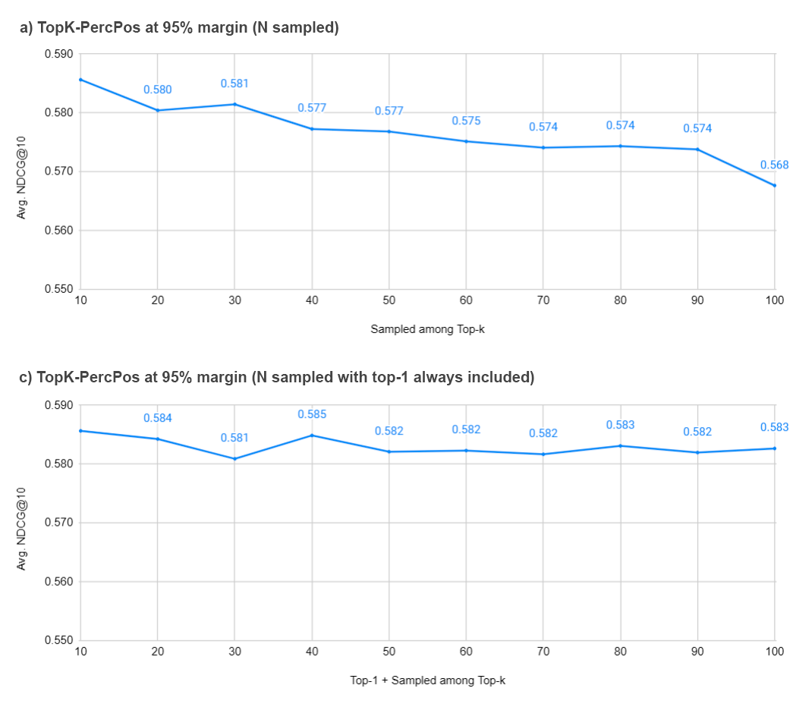
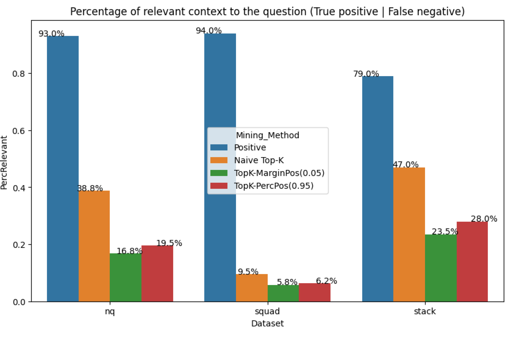
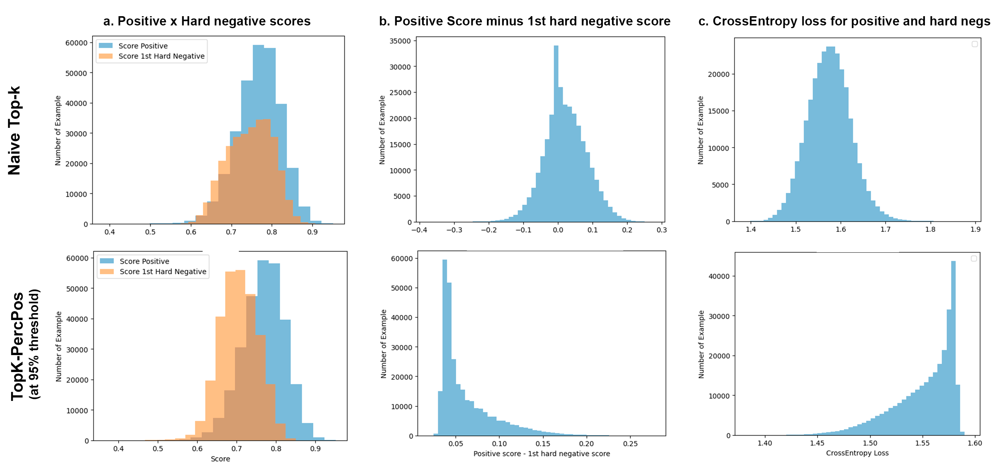

# NV-Retriever 技术详解

> paper: [arXiv:2407.15831](https://arxiv.org/abs/2407.15831)  
> org: NVIDIA  
> backbone: 学生可为 e5-large / Mistral-7B；教师常用 e5-mistral-7b-instruct  
> date: 2024-07（MTEB Retrieval 当时第 1）  
> modality: 文本嵌入 / 检索  
> languages: 英文 MTEB Retrieval  

> 本文把 **假负例问题、positive-aware 挖负算法（TopK-MarginPos / TopK-PercPos）、教师选择与集成、NV-Retriever-v1 冲榜配方** 写全，并附论文原图。异步全局挖负见《[ANCE详解](ANCE详解.md)》；落地默认值见《[难负例挖掘工业实践](难负例挖掘工业实践.md)》。全文中译见 `docs/papers/embedding/NV-Retriever_2407.15831_zh.md`。

---

## 一句话定位

**NV-Retriever** 不主打新骨干，而把 **难负例挖掘方法** 当成一等公民：用**正例相关分作锚**过滤假负例（TopK-MarginPos / TopK-PercPos），配合强教师离线挖负，训出 NV-Retriever-v1（发布时 MTEB Retrieval ≈ **60.9**）。

| 项 | 内容 |
| --- | --- |
| 核心贡献 | positive-aware hard-negative mining 家族 |
| 推荐默认 | **TopK-PercPos @ 95%**（消融最优） |
| 备选 | TopK-MarginPos，margin ≈ 0.05 |
| 工程立场 | 多数冲榜模型用**训前挖一次**，而非 ANCE 式异步刷新 |

---

## 背景：难负例与假负例

对比学习（InfoNCE）：

$$
\mathcal{L}(q,d^+,d_N)=-\log\frac{\exp(\mathrm{sim}(q,d^+)/\tau)}{\sum_{d_i\in\{d^+\}\cup d_N}\exp(\mathrm{sim}(q,d_i)/\tau)}
$$

- **易负例**：$\mathrm{sim}(q,d^-)$ 很低 → 梯度弱（ANCE 理论）。  
- **难负例**：分高但业务无关 → 有用。  
- **假负例**：实际相关却被标负 → 撕碎邻域、伤召回 / STS。

RocketQA 等在 MS MARCO 上观察：对 query 最相似的一批里，**约 70%** 可能本应是正例。Naive Top-K 挖难负例噪声极大。

已有过滤：

| 方法 | 做法 | 问题 |
|------|------|------|
| Top-K shifted by N | 丢掉前 N 名再取 | 不看分数；可能扔真难负或留假负 |
| TopK-Abs | $\mathrm{sim}(q,d^-)<\tau_{\mathrm{abs}}$ | 阈值与正例难度无关，难跨数据集 |

NV-Retriever：**阈值应相对正例分数移动**。

---

## Positive-aware 挖负算法

教师先检索 top 候选；再对每个负例 $n$ 与正例 $p$ 调用过滤器。

### TopK-MarginPos

保留当且仅当：

$$
\mathrm{score}(n) < \mathrm{score}(p) - m
$$

消融最优附近：$m\approx 0.05$（相似度尺度需与教师一致，常见余弦）。

### TopK-PercPos

保留当且仅当：

$$
\mathrm{score}(n) < \alpha\cdot \mathrm{score}(p)
$$

消融最优：$\alpha=0.95$。

直觉：正例很强时，允许更「硬」的负例；正例本身分不高时，阈值更严，少吸入假负。

### 挖负方法消融（论文图 1）


图 1 在 e5-large-unsupervised 学生上扫四种挖负配置的 Avg NDCG@10（NQ+Hotpot+FiQA）：

- **(a) Shifted-by-N**：忽略前 N 名再取 hard；在 N≈10 附近最优（约 0.569），再加大 N 反而掉。  
- **(b) TopK-Abs**：绝对分阈值约 **0.70** 最优（约 0.576）。  
- **(c) TopK-MarginPos**：相对正例的 margin **m≈0.05** 最优（约 **0.583**）；margin 过大等于只留易负。  
- **(d) TopK-PercPos**：相对正例百分比阈值 **α≈0.95** 最优（约 **0.586**），整体最高。

对应表：

| Mining | Config | Avg NDCG@10 |
|--------|--------|-------------|
| Naive Top-K | — | 0.5407 |
| Shifted by N | N=10 | 0.5695 |
| TopK-Abs | 0.7 | 0.5759 |
| **TopK-MarginPos** | 0.05 | **0.5835** |
| **TopK-PercPos** | 95% | **0.5856** |

Mistral-7B 学生上结论同向。

### 采样 top-k（论文图 2）



图 2：固定 PercPos@95% 后，从教师 top-$k$ 里采 4 个负例的方式对比——**Sampled Top-k**（按分数 softmax）与 **top1 + Sampled**。对大模型略有帮助：不必死取 top-1…4，适当随机化可覆盖更多难负形态，同时仍受 PercPos 门控。

---

## 教师选择与集成

### 教师越强，学生越好

在固定 TopK-PercPos@95%、每 query 4 负例时，教师 NDCG 大致排序：

```text
BM25 < random < e5-large-unsup < e5-large-v2 ≈ arctic-embed-l
  < NV-Embed-v1 < e5-mistral-7b-instruct
```

要点：**用已监督精调的大教师挖负**，比 BM25 hard（DPR 经典配方）更适合当代嵌入微调。

### 多教师集成

四教师 Jaccard 重叠 < 30%。**Intra-sample**（每教师取 top-1）略好于单最佳教师；**保留重复负例**（no-dedup）反而更好——多教师一致的难负例在 CE 里权重更高。Cross-sample（整例换教师）无明显增益。

---

## 假负例与训练动态

### LLM-as-judge（论文图 3）



图 3 用 Llama 3.1 70B 判断「挖掘负例是否其实相关」：

- Naive Top-K：NQ / StackExchange 假负率可到 **~39% / ~47%**  
- TopK-PercPos：假负约减半（相对 Naive 少 ~50–57%）

说明 positive-aware 过滤的主要收益之一是**少把真相关文档当负例训**。

### 分数直方图（论文图 4）



图 4 对比 Naive（上行）与 PercPos@95%（下行）：

1. **(a)** 正例分 vs 第 1 hard 负例分：PercPos 后负例分布明显左移，重叠变小。  
2. **(b)** $\mathrm{score}(p)-\mathrm{score}(n_1)$：Naive 大量出现负差（负例比正例还「像」）；PercPos 几乎全为正差。  
3. **(c)** InfoNCE/CE 损失：PercPos 下损失分布更稳，少被「假难负」拉爆。

---

## NV-Retriever-v1 冲榜配方

- **骨干**：Mistral-7B-v0.1  
- **挖负教师**：E5-Mistral-7B  
- **Stage1**：15 个检索训练集，约 **728k** 例；硬负用上述方法对比  
- **完整 v1**：Stage1 后再混入分类 / 聚类等，MTEB Retrieval **60.9**（发布时第 1）  
- 仅 Stage1 + TopK-PercPos：Avg NDCG@10 **60.55**（15 BEIR 集），已接近最终分

缩放表（节选 Avg）：

| Mining | Avg |
|--------|-----|
| Naive Top-K | 51.44 |
| Shifted-10 | 54.66 |
| TopK-Abs 0.7 | 55.81 |
| TopK-MarginPos | 59.77 |
| **TopK-PercPos 95%** | **60.55** |

**挖负方法差可到 ~9 个点**——往往大于换一个小架构改动。

文末建议：同一套 positive-aware 过滤也可迁移到**多模态**图文嵌入微调。

---

## 与 ANCE / 工业实践的关系

| | ANCE | NV-Retriever |
|--|------|----------------|
| 何时挖 | 训练中异步刷新 | 多数**训前离线** |
| 谁挖 | 学生自己（lagged） | 通常更强**教师** |
| 假负 | 基本不滤 | **正例锚定**为核心 |
| 成本 | Inferencer 重 | 挖一次后可复用 |

工业折中（本仓库默认叙事）：

1. 用强教师（或 lagged 学生）挖 top-K；  
2. **TopK-PercPos@0.95 或 MarginPos@0.05**；  
3. 每 query 保留 **2–4** 干净负例；  
4. 验证集回归后再决定是否 ANCE 式重挖。

---

## 对本仓库的可迁移实践

1. `mine_*_negs.py` / `mine_true_negs.py`：候选写出后加 `pos_score` 列，按 PercPos / MarginPos 过滤。  
2. 教师优先：领域已训 embedding 或 CE，而不是只靠 BM25。  
3. 多教师：可尝试「每教师 top-1、允许重复」。  
4. 调参：先扫 $\alpha\in\{0.9,0.95,0.98\}$ 与 $m\in\{0.03,0.05,0.1\}$，看验证 Recall 与近义/STS 是否双升。

---

## 同目录对照

| 文档 | 关系 |
|------|------|
| [ANCE详解.md](ANCE详解.md) | 全局难负例与异步刷新鼻祖 |
| [难负例挖掘工业实践.md](难负例挖掘工业实践.md) | TopK-MarginPos / PercPos 已写入默认菜单 |
| [Conan-embedding-v2详解.md](Conan-embedding-v2详解.md) | 训中动态替换 |
| [E5详解.md](E5详解.md) | 教师 / 学生常用家族 |
| [LLM-DA文本行人检索数据增强详解.md](LLM-DA文本行人检索数据增强详解.md) | 正例侧改写增强（互补） |
| [RocketQA详解.md](RocketQA详解.md) | CE 去噪 hard 的前史 |

---

## 参考文献

1. Moreira et al. (2024). NV-Retriever: Improving text embedding models with effective hard-negative mining. [arXiv:2407.15831](https://arxiv.org/abs/2407.15831)  
2. Xiong et al. (2021). ANCE. [arXiv:2007.00808](https://arxiv.org/abs/2007.00808)  
3. Qu et al. (2020). RocketQA.  
4. Karpukhin et al. (2020). DPR.  
