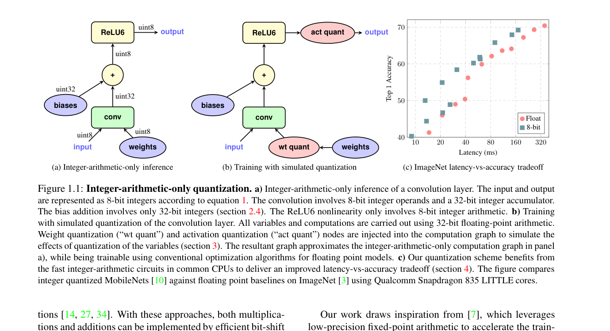
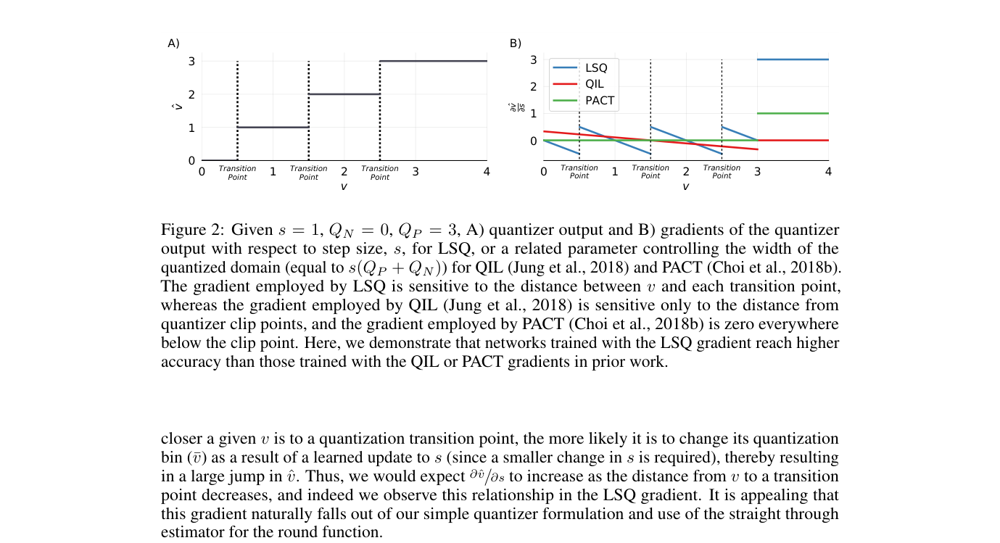
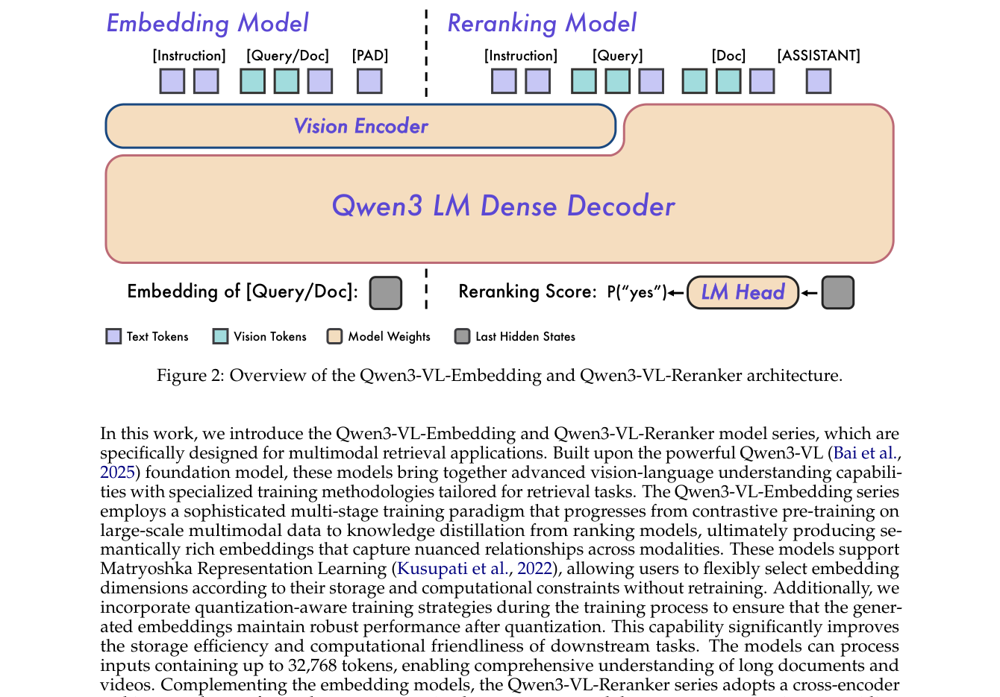
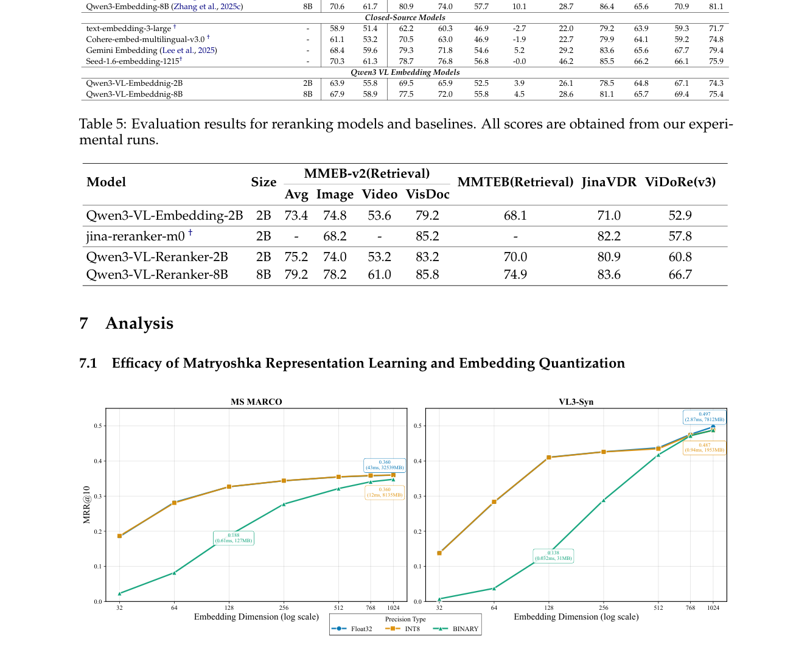
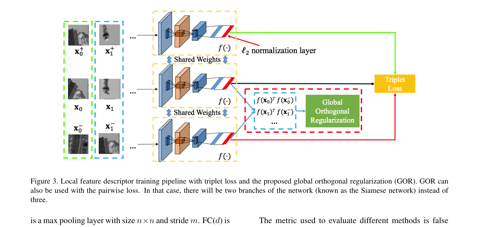

# 量化感知训练（QAT）详解

> paper: Jacob et al. [arXiv:1712.05877](https://arxiv.org/abs/1712.05877)（CVPR 2018，经典 QAT）；LSQ [arXiv:1902.08153](https://arxiv.org/abs/1902.08153)（ICLR 2020）；Qwen3-VL-Embedding [arXiv:2601.04720](https://arxiv.org/abs/2601.04720)（Embedding 向量上的 QAT）；GOR [arXiv:1708.06320](https://arxiv.org/abs/1708.06320)（Jina v5 用的几何正则，**不是** QAT）
> code / 工程: [PyTorch QAT](https://docs.pytorch.org/docs/stable/quantization.html)；[Unsloth QAT](https://unsloth.ai/docs/blog/quantization-aware-training-qat)（权重量化）；Sentence-Transformers [GOR loss](https://github.com/huggingface/sentence-transformers/blob/main/sentence_transformers/sentence_transformer/losses/global_orthogonal_regularization.py)
> refs: STE [arXiv:1308.3432](https://arxiv.org/abs/1308.3432)；MRL [arXiv:2205.13192](https://arxiv.org/abs/2205.13192)；Jina v5-text [arXiv:2602.15547](https://arxiv.org/abs/2602.15547)
> date: 2018–2026
> modality: 原为 CNN 推理；Embedding 检索里主要压 **索引向量**（也可以压编码器权重）
> languages: 与骨干无关

> 先澄清出处：**Jina v4 没有 QAT**。**Jina v5-text** 为二值量化鲁棒加的是 **GOR**，不是 fake-quant + STE。仓库《[图文综述](../图文Embedding模型技术综述.md)》里写的「量化感知训练」来自 **Qwen3-VL-Embedding**（LSQ）。本文把三条线分开写清，并落到文搜图索引。

---

## 一句话定位

**QAT**（Quantization-Aware Training）在训练前向里 **模拟量化**（fake quantize），用 STE 把梯度绕过不可微的 round，让权重 / 激活 / **嵌入向量** 适应低比特。和 **PTQ**（训完再量化、不再回传）相对。Embedding 场景要再拆一层：压的是 **模型权重** 还是 **存进 ANN 的向量**——后者才是亿级图库的主账单。

| 项 | 内容 |
| --- | --- |
| 问题 | round / clip 不可微；直接 INT8 推理会把决策边界推歪 |
| 经典解 | 训练时插入 fake-quant，推理换成整数图（Jacob 2018） |
| 步长 | LSQ 把量化步长 $s$ 当成可学习参数 |
| Embedding 版 | Qwen3-VL：对比损失同时打在 FP 向量和量化向量上 |
| Jina v5 | **GOR**：把向量推匀到球面，二值化后排序更稳——**没有**模拟 INT8 |

---

## 先分清：你要压的是哪一块

检索系统里有两套互不替代的量化：

| 压什么 | 省什么 | 典型方法 | 失败时 |
| --- | --- | --- | --- |
| **编码器权重 / 激活** | GPU 显存、encode 延迟 | PTQ（GPTQ/AWQ）、权重 QAT、QLoRA | 图文塔 encode 变慢或变糊 |
| **索引里的 embedding 向量** | 磁盘 / DRAM、ANN 带宽 | 标量 INT8、二值、PQ、MRL 截维 | Recall 掉、同款分不开 |

Qwen3-VL-Embedding 的 QAT、Jina v5 的 GOR，针对的都是 **第二行**（向量怎么存）。llama.cpp / bitsandbytes 量化 Jina 权重，是第一行，属于 PTQ，不要和 QAT 课表混谈。

文搜图：gallery 图像离线进库，条数 ≫ 模型参数。**向量 QAT 优先于权重量化**。

---

## 经典 QAT：Jacob 2018

Google 把 Mobilenet 一类 CNN 训成 **只做整数乘加** 的推理图。核心操作是仿射量化：

$$
x_q = \mathrm{round}\!\left(\mathrm{clip}\bigl(x/s + z,\; q_{\min}, q_{\max}\bigr)\right)
$$

$s$ 为步长（scale），$z$ 为零点。训练时权重仍是 FP，但每层插入 **fake quantize**：先量化再反量化回 FP，后续层看到的是「已经台阶化」的值。推理时把 fake-quant 换成真正的 INT8 算子。

上图是「同一层、两种图」：训练路径带着量化噪声回传；部署路径折叠成整数卷积。没有 STE，round 的梯度是 0，网络学不会绕过台阶——这就是下一节 LSQ / STE 要补的。

**和 PTQ 的差别**：PTQ 用少量校准数据估 $s,z$，**不再更新权重**。QAT 让权重在量化噪声下再走一段梯度。低比特（INT4 / 二值）时 QAT 通常明显赢 PTQ；INT8 很多 Embedding 模型 PTQ 已经够用。

课表位置：主文 Stage 4、蒸馏专题写过「**蒸馏收敛后再做量化**」。先 KD 再 QAT，避免量化噪声和教师分布互相抢。

---

## LSQ：把步长也训出来

Jacob 的 $s$ 多半来自 min/max 或滑动统计。**LSQ**（Esser et al., ICLR 2020）把步长当成参数：

$$
\hat v = s\cdot \mathrm{round}\!\bigl(\mathrm{clip}(v/s,\; Q_N, Q_P)\bigr)
$$

round 仍不可微，用 **STE**：前向 round，反向把 $\partial/\partial v$ 当成 1（在未截断区间）。对 $s$ 的梯度在 **台阶边界附近最大**——值刚好处在「再动一点就跳一档」时，步长更新最有信息。

Qwen3-VL-Embedding **点名用 LSQ + STE** 做向量 QAT，不是重新发明一套量化器。工程上 PyTorch `FakeQuantize` / TorchAO / Unsloth QAT 都是这条家族；Unsloth 那篇博客压的是 **LLM 权重**，和检索索引不是同一开关。

---

## Embedding 上的 QAT：Qwen3-VL-Embedding

[2601.04720](https://arxiv.org/abs/2601.04720) 把 Qwen3-Embedding 的对比损失扩到图/视频/文档，并 **显式加入 MRL + QAT**。做法不是只量化权重，而是：

> 训练时 **同一批向量** 既用全精度算 InfoNCE，也用 LSQ 量化后再算一遍目标，让表征在 INT8 / 二值下仍然可检索。

这和「权重 fake-quant」同构，监督对象换成 $z=\mathrm{emb}(x)$：

$$
\mathcal{L} = \mathcal{L}_{\mathrm{ret}}(z) + \mathcal{L}_{\mathrm{ret}}(\mathrm{LSQ}(z))
$$

（论文叙述为「full-precision and low-precision counterparts」；实现上常对 int8、binary 各加一项，权重与 MRL 前缀损失并列。）

论文用 MS MARCO（文本）和 VL3-Syn（**caption → 200 万图**，就是文搜图）看维数 × 精度：

| 现象 | 数字直觉（论文 §7.1） |
| --- | --- |
| MRL 1024→512 | 文本检索约 **-1.4% MRR@10**，存储减半、延迟约一半 |
| **INT8** | 检索掉点 **可忽略** |
| **Binary** | 明显伤 Recall；维数越低伤得越狠 |

上图是「索引经济学」：横轴越往右越省；INT8 贴着全精度曲线，二值掉下去一截。文搜图和纯文本趋势一致——**先 MRL 截到 512，再 INT8；不要一上来二值。**

Qwen3 文本 Embedding（[2506.05176](https://arxiv.org/abs/2506.05176)）本身 **没有** 写 QAT；QAT 是 VL 这一代补进训练管线的。综述里那句「int8 几乎无损」对应的是这篇，不是 Jina v5。

---

## Jina v5 实际做了什么：GOR，不是 QAT

[jina-embeddings-v5-text](https://arxiv.org/abs/2602.15547) 检索 adapter 的三项损失是 InfoNCE + 蒸馏 + **GOR**。GOR 来自张等 2017 的局部描述子论文：惩罚 batch 内非配对向量的平方内积，让点在球面上摊开。

$$
\mathcal{L}_{\mathrm{GOR}}
=
\frac{1}{B(B-1)}\sum_{i\neq j}(\mathbf{x}_i^\top\mathbf{x}_j)^2
+
\frac{1}{B(B-1)}\sum_{i\neq j}(\mathbf{y}_i^{+\top}\mathbf{y}_j^+)^2
$$

没有 fake-quant、没有 STE、没有可学 $s$。机制是：**二值化 ≈ 看符号**；若向量挤在一个锥里，符号一塌糊涂。摊开之后 sign 还大致保住排序。v5 表 6：全精度 GOR 只涨 ~0.3；**二值掉点几乎减半**（MTEB −3.08→−1.90）。

**v4**（[2506.18902](https://arxiv.org/abs/2506.18902)）有 MRL 截维和 late interaction，**没有** QAT 也没有 GOR。若记忆里「Jina 量化感知」对不上 v4 正文，多半是把 v5 的 GOR 或 Qwen3-VL 的 QAT 串台了。

v5 另外发了 llama.cpp 量化权重，那是 **PTQ 权重**，和 GOR 无关。

---

## 三套「抗量化」对照

| | 经典 QAT（Jacob / LSQ） | Embedding QAT（Qwen3-VL） | GOR（Jina v5） |
| --- | --- | --- | --- |
| 模拟量化？ | 是，fake-quant + STE | 是，对 **输出向量** LSQ | 否 |
| 可学步长 | LSQ 有 | 有 | 无 |
| 主要省 | 推理 MAC / 显存 | **索引存储与 ANN** | 二值索引掉点 |
| INT8 | 通常几乎无损 | 论文称可忽略 | 不是主打 |
| Binary | 难，要专门训 | 掉点大，维数低更差 | **主战场**，掉点减半 |
| 和 MRL | 可叠 | **默认叠** | v5 另有 MRL 截断 |
| 课表 | Stage 4，KD 之后 | 对比训练里并列一项 | 检索 LoRA 的正则项 |

PQ / OPQ / RaBitQ 是 **索引算法**，一般不回传到 encoder；QAT/GOR 是 **改训练目标让向量更好压**。可以叠：QAT 出 INT8 向量，再进 IVF-PQ。

---

## 训练数据、评测、对比（Embedding 条款）

**训练数据**（Qwen3-VL QAT 段）：与主对比课表相同——合成 + 监督多模态对；QAT **不另造数据**，只是同一 $z$ 走两条精度。GOR 同样吃当前 batch 的 query/正例向量。Jacob/LSQ 原实验是 ImageNet CNN，不是检索对。

**评测**：

| 基准 | 测什么 | 谁在用 |
| --- | --- | --- |
| ImageNet top-1 | 分类精度 vs bit | Jacob / LSQ |
| MTEB / RTEB BF16 vs Binary | 文本 embedding 二值掉点 | Jina v5 GOR 消融 |
| MS MARCO MRR@10 × 维数 × dtype | 文本索引经济学 | Qwen3-VL |
| VL3-Syn caption→2M 图 | **文搜图** 索引经济学 | Qwen3-VL |

**对比方法**：PTQ（校准不回传）、PACT/QIL（LSQ 的前代可学区间）、纯 MRL 截维、二值无 GOR。不要用「INT8 分类掉 0.5%」外推「INT8 文搜图 Recall 不变」——用自有 gallery 报 Text→Image Recall。

---

## 落到文搜图怎么做

最小配方（接《[领域专用 Embedding 适配实践](../领域专用Embedding适配实践.md)》Stage 2 之后）：

1. 双塔（CLIP/SigLIP 续训）先训到验证 Recall 饱和。
2. **MRL**：对比损失加在 768/512/256 前缀（按你的维数改）。
3. **向量 QAT**：`z` 与 `LSQ_int8(z)` 各算一遍 InfoNCE（可加权，INT8 项略小以免早期不稳）。二值项可选，Qwen3-VL 显示它很伤。
4. **不要**用 GOR 替代 QAT：GOR 是二值保险；你若上 INT8 索引，GOR 收益远小于 LSQ 双路损失。
5. 评测分列：FP16 / INT8 / Binary × 全维 / 512，**Text→Image 与 Image→Image 分开报**。
6. SKU / 货号仍走稀疏；量化救不了主键。

权重量化（把 ViT 压到 INT8 以加快 encode）另开一条 PTQ，用一小撮领域图校准，不要和向量 QAT 同一超参。

---

## 反模式

1. 把 Jina v5 的 GOR 叫成 QAT，按 LSQ 论文去改训练代码。
2. 蒸馏没收敛就开 fake-quant，教师分数和台阶噪声搅在一起。
3. 索引二值化却用随机初始化、无 GOR 也无 QAT，还怪模型太小。
4. 只量化 query 侧、gallery 仍 FP16，或两侧量化器不一致（$s$ 不同）。
5. 用分类 ImageNet 的 INT8 掉点，代替文搜图 Recall 验收。

---

## 深读入口

| 线 | 入口 |
| --- | --- |
| 整数 QAT 开山 | [1712.05877](https://arxiv.org/abs/1712.05877) |
| 可学步长 | [LSQ 1902.08153](https://arxiv.org/abs/1902.08153) |
| Embedding 向量 QAT + 文搜图曲线 | [Qwen3-VL-Embedding 2601.04720](https://arxiv.org/abs/2601.04720) |
| GOR 原式 | [1708.06320](https://arxiv.org/abs/1708.06320)；应用见 [Jina v5-text 详解](../Jina/v5-text/Jina-embeddings-v5-text详解.md) §7.3 |
| 权重侧 QAT 工程 | [Unsloth QAT](https://unsloth.ai/docs/blog/quantization-aware-training-qat) |
| 截维（常与 QAT 一起上） | MRL [2205.13192](https://arxiv.org/abs/2205.13192)；主文 §5.2.4 |
