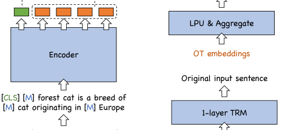

# RetroMAE 与 DupMAE：面向检索的自编码预训练

> **paper**：[RetroMAE (EMNLP 2022)](https://arxiv.org/abs/2205.12035) · [DupMAE / RetroMAE v2 (2022)](https://arxiv.org/abs/2211.08769)
> **code**：[staoxiao/RetroMAE](https://github.com/staoxiao/RetroMAE)
> **refs**：[Condenser (Gao & Callan 2021)](https://arxiv.org/abs/2104.08253) · [coCondenser (Gao & Callan 2022)](https://arxiv.org/abs/2108.05540) · [SEED (Lu et al. 2021)](https://arxiv.org/abs/2102.09206) · [SimLM (Wang et al. 2022)](https://arxiv.org/abs/2207.02578) · [ME-BERT (Luan et al. 2021)](https://arxiv.org/abs/2005.00181)
> **backbone**：BERT-base（12 层 / 768 dim / 30522 vocab；解码器：一层 Transformer + LPU）
> **date**：RetroMAE 2022-05；DupMAE 2022-11
> **modality**：文本（检索导向预训练）
> **languages**：英文；BGE 全家桶通过 mBERT / XLM-R 扩多语
>
> 本文写全 **两个非对称掩码 + 增强解码（two-stream + position-specific attention mask）** 的机制、**为什么小解码器 + 高掩码率反而更强**、**BoW 头做词级监督** 的数学、以及 BGE C-Pack / BGE-M3 是怎样把 RetroMAE 当作事实上的检索预训练基石。DupMAE 部分聚焦「[CLS] + Ordinary Token 双通道 + 稀疏聚合」是如何延续 RetroMAE 精神的。

---

## 一句话定位

RetroMAE 是 **Condenser** 之后最重要的一次检索导向预训练升级：不再用 CLS + Head 短路做 MLM，而是把整个模型改造成一个 **强非对称的掩码自编码器（Masked Auto-Encoder, MAE）**，让 CLS 承担几乎全部的重建责任，从而学到「一句话浓缩为一个向量」的能力。

DupMAE（RetroMAE v2）在此基础上再加一路：让 **除 CLS 外的普通 token embedding** 通过一个线性投影 + max-pool 学到 **词袋（Bag-of-Words）** 特征。CLS 向量降维 + OT 稀疏向量拼接成最终表示，既保住语义又保住词面。

| 项                 | RetroMAE                                              | DupMAE                                                        |
| ------------------ | ----------------------------------------------------- | ------------------------------------------------------------- |
| 编码器             | BERT-base（12 层 / 768 dim）                          | 同 RetroMAE                                                   |
| 解码器             | **一层** Transformer + 增强解码（two-stream mask）    | 一层 Transformer（[CLS] 通道）+ **LPU + max-pool**（OT 通道） |
| Encoder mask ratio | **15∼30%**                                            | 同                                                            |
| Decoder mask ratio | **50∼70%**（Enhanced 里到 100% token 都参与重建）     | 同 + BoW 头对所有 OT 生效                                     |
| Loss               | $\mathcal{L}_{\text{mlm}} + \mathcal{L}_{\text{dec}}$ | $\mathcal{L}_{\text{mlm}} + \mathcal{L}_{\text{dec}} + \mathcal{L}_{\text{BoW}}$ |
| 表示               | $h_{\text{CLS}} \in \mathbb{R}^{768}$                 | $[\hat h_{\text{CLS}}; \hat \mu_{\text{OT}}]$（低维密向量 + top-K 稀疏权重）|
| MS MARCO MRR@10    | **41.6**（+KD）                                        | **42.6**（+KD）                                                |
| BEIR nDCG@10 (18)  | **45.2** 零样本；**52.2** 微调后                       | **47.5** 零样本                                                |

## 谱系与位置

```text
BERT-MLM
  ├─ Condenser (Gao 2021)：早/晚 backbone + Head，强制 CLS 一直在工作
  │    └─ coCondenser (2022)：+ corpus contrastive；小 batch 微调也能上 SOTA
  │         └─ RetroMAE (Xiao 2022)：非对称 MAE + one-layer decoder + enhanced decoding
  │              └─ DupMAE / RetroMAE-v2 (2022)：+ OT 通道 + BoW 头
  │                   └─ BGE C-Pack (2023) → BGE-M3 (2024) → BGE-EN-ICL / bge-gemma2 (2024)
  └─ SimCSE / Contriever（另两条独立血脉；见《无监督对比检索三部曲》）
```

后续 2023–2025 的中文/多语开源嵌入几乎都建立在 **RetroMAE + BGE C-Pack 三阶段课表** 上：`RetroMAE 预训练 → 弱监督对比 → 监督对比（含 hard neg 与自蒸馏）`。理解 RetroMAE / DupMAE 就等于理解了 BGE 全家桶为什么长这样。

---

## 问题背景：为什么 MLM 学不好句向量

BERT 的 MLM 只对 15% 的位置计损失，且 CLS 在中间层「休眠」（见 Condenser 的分析）。这带来两个连锁问题：

1. **训练信号稀疏**：15% 的 mask 位置意味着每一句只贡献很少的梯度，检索所需的「压缩到一个向量里」的能力得不到充分锻炼。
2. **解码任务太简单**：conventional MLM 里未 mask 的 85% token 提供了充足上下文，让预测 mask 位的 token 几乎可以「不看 CLS」也能做对；CLS 于是变成一个可以偷懒的通道。

Condenser 用「让 CLS 短路进入 Head + Head 继续做 MLM」的方式部分修复了这个问题；但它仍然让 Head 看得到 early 层的 token —— 一旦 Head 有其它 token 作参考，CLS 就没那么关键。

RetroMAE 的思路更彻底：**把解码彻底改成「几乎只有 CLS 能看」**。具体做两件事：

1. **解码器只有一层 Transformer**（1/12 于 encoder），几乎没有推理能力。
2. **解码器输入被极度 mask 掉（50∼70%）**，能提供的上下文极少。

在这种「小马拉大车」的解码条件下，如果不把整个句子的信息压进 CLS，重建根本做不到 —— CLS 就被强迫成为一个真正的 sentence embedding。

---

## RetroMAE 方法

### 总体流程


- **Encoder（BERT-base）** 输入 $\tilde X_{\text{enc}}$：$X$ 里 15∼30% 的 token 被随机替换为 [M]。
- 编码器输出的 **CLS 位表征** 作为 sentence embedding $h_{\tilde X} = \Phi_{\text{enc}}(\tilde X_{\text{enc}})$。
- **Decoder（1 层 Transformer）** 输入 $\tilde X_{\text{dec}}$：$X$ 里 50∼70% 的 token 被 mask。
- 把 $h_{\tilde X}$ 拼在解码器序列首位，与 $\tilde X_{\text{dec}}$ 一起做 MLM。

编码器仍保留标准 MLM loss $\mathcal{L}_{\text{mlm}}$；解码器新增 $\mathcal{L}_{\text{dec}}$，最终 loss 是二者相加。

### 基础解码

拼接的解码器输入为：

$$
H_{\tilde X_{\text{dec}}} \;\leftarrow\; \bigl[\,h_{\tilde X},\; e_{x_1} + p_1,\; \dots,\; e_{x_N} + p_N \bigr]
$$

其中 $h_{\tilde X}$ 占据位置 0，其余是被大比例 mask 后的 token embedding 加位置编码。一层 Transformer 后，在被 mask 的位置上做 cross-entropy：

$$
\mathcal{L}_{\text{dec}} = \sum_{i \in \text{masked}} \mathrm{CE}\bigl(x_i \,\big|\, \Phi_{\text{dec}}(H_{\tilde X_{\text{dec}}})\bigr)
$$

这已经比 conventional MLM 要求高得多 —— 因为 decoder 太浅、mask 太多，$h_{\tilde X}$ 若不承担绝大部分工作，重建就会失败。

### 增强解码：two-stream + position-specific mask

基础解码有两个残余的低效：

1. 训练信号只从 mask 的位置产生（仍然只是 50∼70% 的 token）。
2. **每个 mask 位都用同一份上下文** $H_{\tilde X_{\text{dec}}}$，可用信号被强绑定。

RetroMAE 借鉴 XLNet 的 two-stream self-attention 和 UniLM 的 position-specific attention mask，把解码改造成：


上图 (A) 为编码，(B) 为基础解码，(C) 为增强解码；增强解码里每个 token 用**独属自己的一行 mask**决定上下文。

构造两条流：

$$
H_1 \leftarrow [\,h_{\tilde X} + p_0,\; \dots,\; h_{\tilde X} + p_N\,]
\qquad
H_2 \leftarrow [\,h_{\tilde X},\; e_{x_1} + p_1,\; \dots,\; e_{x_N} + p_N\,]
$$

其中 $H_1$ 每行都是「CLS 语义 + 位置偏置」，$H_2$ 是完整的 token embedding（这一步**不 mask**）。计算注意力时：

$$
Q = H_1 W_Q, \; K = H_2 W_K, \; V = H_2 W_V
$$

加一个位置专属的 mask 矩阵 $M \in \mathbb{R}^{L\times L}$：

$$
M_{ij} = \begin{cases} 0, & x_j \in s(X_{\neq i}) \text{ 或 } j = 0 \\ -\infty, & \text{其它} \end{cases}
$$

$$
A = \mathrm{softmax}\!\left(\frac{Q^\top K}{\sqrt d} + M\right) V
$$

规则简化如下：**每个 token 只能看到 CLS（位置 0）和一个随机采样的、不包含自己的其它位置子集**。这样带来两个好处：

1. **100% token 都参与重建**：每一步都能算 loss，训练信号密度大幅提升。
2. **每个 token 用独立上下文**：对同一 CLS 表征做多次不同视角的重建，信息榨得更干净。

最终 loss：

$$
\mathcal{L} = \mathcal{L}_{\text{mlm}} \; + \; \sum_{x_i \in X} \mathrm{CE}\bigl(x_i \,\big|\, A_i, H_{1,i}\bigr)
$$

### 微调：单轮 hard neg + 蒸馏就能到 SOTA

微调依然沿用 DPR / ANCE 的对比学习：

1. In-batch neg 初训一个 bi-encoder。
2. 用这个 bi-encoder ANN 挖 hard neg，再训一轮。
3. 训一个 cross-encoder 教师做知识蒸馏（soft-label KL）。

关键结论：**只用 1 轮 hard neg + 1 次 KD**，RetroMAE 就把 MS MARCO Passage MRR@10 拉到 **41.6**，超过 coCondenser（38.2）、RocketQAv2 等重工程流水线。这是「预训练结构就绪度」压过「微调复杂度」的又一次胜利。

### 训练细节

| 项            | 值                                              |
| ------------- | ----------------------------------------------- |
| 语料          | Wikipedia + BookCorpus（+ MS MARCO 语料做 in-domain 变体） |
| 训练时长      | 8 epochs                                         |
| Batch (per GPU) | 32                                             |
| 学习率        | 1e-4，AdamW                                     |
| 硬件          | 8× A100 40GB                                     |
| Encoder / Decoder mask | 0.3 / 0.5                                |
| Decoder 深度  | 1 层 Transformer                                |

**为什么 decoder 只用一层？** 论文消融显示：把 decoder 从 1 层加到 2/3 层，BEIR 平均分反而下降 —— 解码器越强，CLS 承担的信息压缩责任越少，句向量质量越差。「不对称」是关键。

**为什么 encoder mask 从 15% 提到 30%？** 15% 是 BERT MLM 的经验值，主要为 token 级重建服务；提到 30% 后，编码器要用更少的可见 token 得到 CLS，鼓励它学到更「全局」的表达。

### 关键实验结论

- **零样本 BEIR（18 数据集平均 nDCG@10）**：BERT 37.1、RoBERTa 36.8、DeBERTa 37.8、SimCSE 36.9、Condenser 40.7、**RetroMAE 45.2**（+4.5%）。这个跃迁在同参数量、同预训练数据的前提下取得，是纯粹算法收益。
- **MS MARCO MRR@10**：RetroMAE + DPR 微调 35.0；+ ANCE 微调 39.4；+ KD 蒸馏 **41.6**。同期 coCondenser 是 38.2（同规模，同数据）。
- **消融表**：
  1. 去掉增强解码：BEIR 从 45.2 掉到 43.0（−2.2）。
  2. Decoder mask 从 50% 降到 15%：BEIR 掉到 41.5。
  3. Decoder 深度从 1 加到 3：BEIR 掉到 43.9。
  4. Encoder mask 从 30% 降到 15%：BEIR 掉到 43.7。

这些消融把「非对称掩码 + 极简解码器」定为 RetroMAE 的**必要条件**。

---

## DupMAE：CLS 与普通 token 双通道

RetroMAE 的所有努力都集中在 **CLS 一个向量** 上。DupMAE 的观察是：ordinary tokens (OT) 里其实还藏着 CLS 拿不出来的信息，尤其是词面匹配、专有名词、数字等。仅用 CLS 做 dense retrieval，对「关键词强命中」类需求不够 —— 这正是 SPLADE / BM25 存在的理由。



### OT 通道：线性投影 + max-pool 学 BoW

给定输入的编码器输出 $E_{\tilde X_{\text{enc}}} = \{e_{x_1}, \dots, e_{x_N}\}$（不含被 mask 的位置），通过一个 **Linear Projection Unit** $W_O \in \mathbb{R}^{d \times |V|}$ 映射到词表维：

$$
\mu_{x_i} \;=\; e_{x_i}^\top W_O \;\in\; \mathbb{R}^{|V|}
$$

对每个词表位置在所有 OT 上做 max-pool：

$$
\mu_{\tilde X_{\text{enc}}} \;=\; \mathrm{tokenMax}\bigl(\{\mu_{x_i} \mid x_i \in \tilde X_{\text{enc}}\}\bigr) \;\in\; \mathbb{R}^{|V|}
$$

目标是让 $\mu_{\tilde X}$ 保留输入的**词袋分布**。用 BoW cross-entropy 监督：

$$
\mathcal{L}_{\text{BoW}} \;=\; -\sum_{x \in \mathrm{set}(X)} \log \frac{\exp\bigl(\mu_{\tilde X_{\text{enc}}}[x]\bigr)}{\sum_{x' \in V} \exp\bigl(\mu_{\tilde X_{\text{enc}}}[x']\bigr)}
$$

其中 $\mathrm{set}(X)$ 是输入里出现过的唯一词汇集合。每一句都监督一批词表位置，训练信号非常密。

### 整个训练目标

$$
\mathcal{L} \;=\; \mathcal{L}_{\text{mlm}} \; + \; \mathcal{L}_{\text{dec}} \; + \; \mathcal{L}_{\text{BoW}}
$$

三项联合，让编码器同时输出高质量的 CLS 与 OT 表征。

![DupMAE 框架：编码 / [CLS] 解码 / OT 解码 三条通道](figures/DupMAE/framework.png)

上图三块清楚地对应 DupMAE 的三条 loss：(A) encoder MLM；(B) [CLS] decoding 与 RetroMAE 完全一致；(C) OT decoding = LPU + max-pool + BoW cross-entropy。

### 表示：低维密向量 + 稀疏 top-K

DupMAE 最终的语义表示是两段拼接：

1. **CLS 降维**：$\hat h_X \;=\; h_X^\top W_{\text{cls}}, \; W_{\text{cls}} \in \mathbb{R}^{d \times d'}$，$d'$ 例如 128。
2. **OT 稀疏化**：从 $\mu_X \in \mathbb{R}^{|V|}$ 取 top-K 位置（论文 K=100∼500），形成一个稀疏向量 $\hat \mu_X$。

相似度 =

$$
\langle q, d\rangle \;=\; \hat h_q^\top \hat h_d \; + \; \sum_{i \in I_d} \mu_q[i]\, \mu_d[i]
$$

- 第一项：低维密向量 dot product，可用 FAISS / HNSW 常规检索。
- 第二项：只在 $d$ 的 top-K 词位置上算，等价于 SPLADE-style 稀疏内积；工程上可用倒排索引加速。

**为什么这么设计**？作者要控住存储与检索时的内存/延迟成本。128 维密向量 + 100 稀疏项 ≈ 与 768 维单向量总占用相当，同时保留 CLS 的语义泛化和 OT 的词面命中能力。

### 微调三步

微调与 RetroMAE 相同的三段式：

1. In-batch neg contrastive
2. 加入 ANN mined hard neg
3. Cross-encoder 蒸馏（soft-label KL）

由于 DupMAE 的表示包含稀疏项，第 3 步的蒸馏还起到了「让 BoW 位置更受约束」的额外作用 —— 教师是纯 dense 的 cross-encoder，学生的 BoW 端要向 teacher 的 relevance 对齐。

### 关键实验结论

- **MS MARCO Dev MRR@10**：42.6（+KD）—— 超过 RetroMAE 41.6、SimLM 41.1、RocketQAv2 38.8。
- **BEIR 零样本平均 nDCG@10**：47.5，超过 RetroMAE 45.2、Contriever 25.4。
- **消融**：
  - 只用 CLS：BEIR 45.2（等价 RetroMAE）
  - 只用 OT + BoW：BEIR 42.1（比 SPLADE 强）
  - 两者拼接：BEIR **47.5**（+2.3 相对纯 CLS）
- **OT 通道的贡献**尤其在词面命中重的数据集（Trec-COVID / FEVER）上明显，说明 BoW 补齐了纯 dense 的短板。

---

## 数据集与评测速览

| 用途                     | 数据集                                              | 规模 / 备注                                            |
| ------------------------ | --------------------------------------------------- | ------------------------------------------------------ |
| 预训练                   | Wikipedia + BookCorpus                              | 与 BERT 相同；DupMAE / RetroMAE-v1.5 会额外用 MS MARCO 语料做 in-domain 版本 |
| 监督微调（passage retrieval） | MS MARCO Passage                                    | 502k 训练 query / 6.98k dev query / 8.84M 段落         |
| 监督微调（open-domain QA） | Natural Questions                                   | 79k 训练 / 8.7k dev / 3.6k test；从 21M Wikipedia 段落中召回 |
| 零样本评测               | BEIR (18 数据集)                                    | fact checking / QA / bio-medical / news / finance / … / nDCG@10 与 R@100 主指标 |

**关键训练数据集简介**

- **MS MARCO Passage**：来自 Bing Search 的真实用户查询，标注段落级 relevance；训练与评测的稠密检索事实标准。
- **Natural Questions (open)**：Google 搜索查询 + Wikipedia 答案段落；用于评估开放域 QA 检索。
- **BEIR**：Thakur et al. 2021 汇总的 18 个零样本检索数据集，覆盖多个领域与任务类型；对稠密检索的迁移能力提供最广的验收面。

**关键对比方法**

- 通用预训练：BERT、RoBERTa、DeBERTa —— 未针对检索优化的基线。
- 检索导向 SCL：SimCSE、LaPraDoR、DiffCSE、Contriever —— 无监督/弱监督对比学习路线。
- 检索导向 AE：Condenser、SEED、SimLM、RetroMAE、DupMAE —— 自编码路线。
- 高强度微调基线：RocketQAv2、AR2、AR2+SimANS、ColBERTv2、SPLADEv2 —— 用于展示「预训练结构收益」是否能压过「微调复杂度收益」。

结论：**在同规模、同预训练数据下，RetroMAE / DupMAE 用最简单的单轮 hard neg + KD 就能追上或超过 RocketQAv2 这类多轮迭代 + 联合训练的复杂系统**。这是它们成为 BGE 全家桶起点的根本原因。

---

## 与 BGE 全家桶的联系

BGE C-Pack（2023，arXiv 2309.07597）的三阶段训练完全承接这条线：

```text
Stage 1  RetroMAE / DupMAE 预训练（Wikipedia + BookCorpus + 中英爬取语料）
Stage 2  弱监督对比学习（1.2 亿弱对：title-body、QA、NLI、…）
Stage 3  监督微调（含 hard neg + 自蒸馏）
```

- **BGE C-Pack v1**：Stage 1 用 RetroMAE；训练出 `bge-large-en-v1.5` 等一代模型。
- **BGE-M3**（2024，arXiv 2402.03216）：把 RetroMAE 换成 **RetroMAE-Enhanced**，同时把 Stage 3 扩展成 Dense + Sparse + ColBERT 三头联合 —— 三头 Sparse 分支的思想直接来自 DupMAE 的 OT 通道。见 [BGE-M3 三功能统一详解报告](BGE-M3三功能统一详解报告.md)。
- **BGE-EN-ICL / bge-multilingual-gemma2**：Stage 1 直接用 LLM 骨干继续 pretrain，但 Stage 2/3 的课表几乎不变；说明 RetroMAE-style 预训练对 encoder-only 骨干是必要的，对 decoder 骨干可选（因为 LLM 已经在几万亿 token 上做过大规模预训练）。

## 常见错误用法

1. **把 decoder 加到 2 层以上**：解码器越强，CLS 承担越少，句向量质量越差。**始终保持 1 层 Transformer**。
2. **encoder / decoder 用相同 mask 比例**：如果 encoder 30% + decoder 30%，训练信号密度还行但重建不够挑战，CLS 得不到充分锻炼。**必须 decoder 更激进**。
3. **忽略 enhanced decoding**：基础解码只覆盖 mask 位置；enhanced decoding 让 100% token 参与训练，是 RetroMAE 最大的信号密度差。消融显示 −2.2 nDCG@10。
4. **DupMAE 只用 OT 通道**：只保留 BoW 头会退化成一个类 SPLADE 的稀疏检索器，泛化能力比纯 CLS dense 差。两者**拼接**才是设计意图。
5. **拿 RetroMAE 权重直接微调 STS-B**：RetroMAE 是**检索**预训练，不是 STS。STS 场景应该走 SimCSE / SBERT 的路线；把 RetroMAE 权重直接接 STS 会低于对比学习预训练的模型。

---

## 与本仓库既有报告的挂接

- 前置：[Condenser + coCondenser](无监督对比检索三部曲_SimCSE-Contriever-Condenser.md)（RetroMAE 的直系前身）
- 后继：[BGE-M3 三功能统一详解报告](BGE-M3三功能统一详解报告.md)（Sparse 通道继承自 DupMAE 的 OT 思想）
- 主文：[Embedding 调研报告 §5 训练与数据工程](Embedding调研报告.md)（预训练→弱监督→监督的课表）
- 蒸馏侧：[Embedding 蒸馏技术详解](Embedding蒸馏技术详解.md)（RetroMAE 微调阶段的 CE→BE 蒸馏范式）

---

*本报告基于 RetroMAE (arXiv 2205.12035) 与 RetroMAE v2 / DupMAE (arXiv 2211.08769) 两篇原论文整理，图片取自论文 PDF。RetroMAE 的所有关键消融（decoder 深度、掩码比例、enhanced decoding）都直接沿用论文实测数据。*
