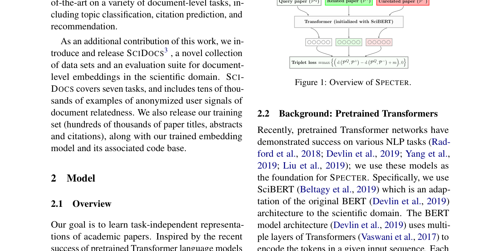
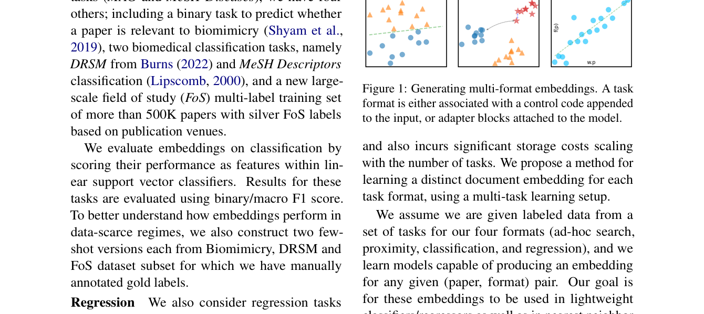

# SPECTER / SPECTER2 技术详解

> paper: SPECTER [arXiv:2004.07180](https://arxiv.org/abs/2004.07180)（ACL 2020）；SPECTER2 / SciRepEval [arXiv:2211.13308](https://arxiv.org/abs/2211.13308)（ACL 2023）
> code: [allenai/specter](https://github.com/allenai/specter) · [allenai/SPECTER2](https://github.com/allenai/specter2)
> blog: [Ai2 · SPECTER2 adapters](https://allenai.org/blog/specter2-adapting-scientific-document-embeddings-to-multiple-fields-and-task-formats-c95686c06567)
> backbone: SciBERT（SPECTER）→ 更大引用三元组续训的 SPECTER2 Base + 任务 adapter
> date: 2020 / 2022–2023
> modality: 科学文献（题名 + 摘要；无全文）
> languages: 英文科学文本为主

> 本文把 **引用图当监督信号、SciDocs → SciRepEval 评测升级、adapter / control code 按任务出不同向量** 写全。领域适配的课表级结论见《[领域专用 Embedding 适配实践](../领域专用Embedding适配实践.md)》；文搜图侧怎么用「图结构正对」见该文「对齐文搜图」节。

---

## 一句话定位

**SPECTER** 不拿人工 query–doc 标注，而用论文**引用边**构造三元组，在 SciBERT 上做文档级对比学习，专门服务论文检索 / 推荐 / 分类。**SPECTER2** 把同一套路放大到 23 个学科、约 6.2M 三元组，并承认「一篇论文一个向量不够」：用 **adapter + control code** 按分类 / 回归 / 邻近检索 / ad-hoc 搜索分别出向量。

| 项 | 内容 |
| --- | --- |
| 问题 | 通用句向量看不懂「这篇论文像哪篇」；MLM 骨干不会把引用关系编进 [CLS] |
| 监督 | 引用 = 正对；引用的引用但 query 未直接引 = 难负例；随机论文 = 易负例 |
| 输入 | `title [SEP] abstract`，**不用全文、不用 citation context** |
| 宣称效果 | SciDocs 七任务全面超 SciBERT / S2V / BERT；SPECTER2 在 SciRepEval 24 任务上再拉开 |

谱系位置：

```text
SciBERT MLM
    → SPECTER（引用三元组 + 共享 Transformer + L2 triplet）
    → SciNCL（更密的引用图采样）
    → SPECTER2 Base（6.2M 三元组 / 23 FoS）
    → SPECTER2 Adapters（CLF / RGN / PRX / QRY）
```

---

## 问题背景

科学文献检索的「相关」经常不是词面重叠：一篇方法论文可能被一篇应用论文引用，题名几乎没有共现词。通用 BERT / 句向量在 SciDocs 上会被 SciBERT 的领域 MLM 拉开一截，但 **MLM 只保证填词，不保证文档邻域 = 引用邻域**。

SPECTER 的赌注：**引用图已经是大规模、几乎免费的相关标注**。只要把「被 query 引用的论文」拉近、「从未被引用的论文」推开，得到的 [CLS] 就能同时服务分类、引用预测、推荐。

这和通用 Embedding 课表里的「弱监督标题–正文」同构，只是正例来源换成了**领域图**。

---

## SPECTER：方法

### 输入与骨干

初始化 **SciBERT**。一篇论文只吃题名和摘要：

$$
x = [\mathrm{CLS}]\;\mathrm{title}\;[\mathrm{SEP}]\;\mathrm{abstract}\;[\mathrm{SEP}]
$$

文档向量取最后一层 **[CLS]**。作者明确不做全文、不做 citation context：要的是「论文卡」级别的可索引表示，而不是段落检索。

### 三元组与损失

对 query 论文 $P^Q$：

- 正例 $P^+$：被 $P^Q$ 引用的论文
- 难负例 $P^-$：被 $P^+$ 引用、但 **没有** 被 $P^Q$ 引用（citations-of-citations）
- 训练时再混随机负例

损失是带 margin 的 L2 triplet：

$$
\mathcal{L}=\max\bigl\{\,d(P^Q,P^+)-d(P^Q,P^-)+m,\;0\,\bigr\},\quad d=\lVert\cdot\rVert_2
$$

共享 Transformer，三篇论文各走一遍 encoder。这就是标准 Bi-Encoder，只是正负例定义来自引用图。



上图是 SPECTER 的全部训练图：query / 相关 / 不相关三篇论文过同一个 encoder，用 margin triplet 拉近引用、推开非引用。没有 query 塔与 doc 塔分家，因为「论文搜论文」两侧同构。

### 训练数据

Semantic Scholar 语料上采引用三元组。规模大约 **146k 论文、684k 训练三元组**（原文量级；SPECTER2 再放大一个数量级）。不需要人工相关标注，也不用点击日志。

难负例的设计意图：随机论文对 SciBERT 已经「太远」，梯度没信息；**引用二跳**在主题上接近、引用上未连边，才是文档级的 hard negative。这和 ANCE 的「模型排高的无关文档」不同源，但目的一样——别只推开显而易见的不相关。

---

## 评测：SciDocs

SPECTER 随文发布 **SciDocs**，七个文档级任务，用来替代「只有 STS / 分类」的句向量榜：

| 类型 | 任务 | 测什么 |
| --- | --- | --- |
| 分类 | MAG、MeSH | 题录主题 / 生物医学主题 |
| 用户行为 | co-view、co-read | 同一用户共浏览 / 共读 |
| 引用 | cite、co-cite | 直接引用、共同被引 |
| 推荐 | 论文推荐 | 排序特征里用 embedding 距离 |

指标按任务用 F1 / MAP / nDCG。SPECTER 在七项上全面超过 SciBERT、BERT、S2V 等当时基线；t-SNE 上 MAG 主题簇也更干净。

**读榜注意**：SciDocs 测的是**论文卡**（题名+摘要）的邻域，不是 ad-hoc 短 query 搜全文。把 SPECTER 当「科学版 DPR」直接拿用户自然语言 query 去搜，会错位——那是 SPECTER2 才单独做的 QRY adapter。

---

## 对比方法

| 方法 | 监督 | 缺什么 |
| --- | --- | --- |
| BERT / SciBERT | MLM | 文档邻域 ≠ 引用邻域 |
| Sentence-BERT 式 NLI | 句对 | 粒度是句，不是论文 |
| S2V 等引文图嵌入 | 只要图 | 丢掉题名摘要文本 |
| SPECTER | 文本 + 引用三元组 | 一个向量打所有下游；短 query 检索偏弱 |

消融里：**去掉难负例**、**不用 SciBERT 初始化**、**只用题名不用摘要**都会掉点。领域 MLM 骨干 + 图结构对比，缺一不可。

---

## SPECTER2 与 SciRepEval

### 为什么要第二代

SPECTER 只有一种 triplet 目标，却被拿去分类、回归、检索、审稿人匹配。SciRepEval 论文的判断是：

> 简单把所有任务混在同一套 [CLS] 上 multi-task，**不如给每个任务格式一套轻量参数**。

评测也要从 7 个任务扩到 **24 个**，覆盖 4 种格式：

| 格式 | 代码 | 损失 | 例子 |
| --- | --- | --- | --- |
| Classification | CLF | Cross Entropy | MAG / MeSH / FoS |
| Regression | RGN | MSE | 引用数、影响力类连续值 |
| Proximity | PRX | Triplet | 近邻论文、链接预测 |
| Ad-hoc search | QRY | Triplet | 短文本 query → 论文 |

### 两步训练

1. **SPECTER2 Base**：仍是引用三元组，但数据换成约 **6.2M triplets、23 个 Field of Study**（大约 10× SPECTER）。得到一个更强的通用科学文档向量。
2. **SPECTER2 Adapters**：冻住 Base，在 Transformer 每层插 adapter；输入侧再拼 **control code**（`[CLF]` / `[RGN]` / `[PRX]` / `[QRY]`）。同一篇论文可以出四套向量。

Ai2 博客写得很直白：一般「论文像论文」的 embedding 任务用 **proximity adapter**（HF 上的 `allenai/specter2`）；用户打短 query 搜论文时，query 走 **adhoc_query adapter**，候选论文仍走 proximity。



上图是 SciRepEval 论文的方法图：左边 control code 拼到 `[doc]`，右边四色 adapter 对应四种下游。分类要线性可分，邻近检索要簇内紧、簇间开，回归要连续可预测——**一个向量很难同时最优**。

### 训练数据与评测

- Base：公开 SPECTER2 引用三元组（HF `allenai/specter2` 卡说明 6M+）。
- Adapter：SciRepEval 训练任务（分类百万级 MeSH、多学科 FoS、检索式邻近等）。
- 评测：SciRepEval 24 任务；并把 SciDocs 收成子集。另在 MDCR 等大规模相关检索上刷新。

HF 建议：

| 用途 | 加载 |
| --- | --- |
| 论文–论文近邻 / 链接预测 | `allenai/specter2`（proximity） |
| 短 query 搜论文 | query 用 `specter2_adhoc_query`，doc 用 proximity |
| 把论文当分类特征 | `specter2_classification` |
| 回归特征 | `specter2_regression` |

---

## 技术博客在补什么

[Ai2 SPECTER2 博文](https://allenai.org/blog/specter2-adapting-scientific-document-embeddings-to-multiple-fields-and-task-formats-c95686c06567) 把论文里写散的工程选择收成三条：

1. Base 仍然只吃引用图，不幻想「多任务从头训一个万能向量」。
2. Adapter 比整模微调便宜，且允许**同一文档多种视图**。
3. 没有落入四种格式时，默认 proximity，不要随便用 classification 向量去做 ANN。

这和通用 Embedding 里「检索模型 vs STS 模型不要混着用」是同一条纪律。

---

## 可迁移实践（先记在领域层）

1. **领域图 / 行为边可以当百万级弱监督**，不必等人工 query 标注。引用、共购、同款、点击，结构一样。
2. **难负例要落在「像、但边不连」**：citations-of-citations、同品类不同 SPU、同款不同色。
3. **任务格式会撕裂同一个向量**：分类、近邻、短 query 检索值得分 adapter 或分 instruct，而不是死磕一个 [CLS]。
4. **骨干先领域化再对比**：SciBERT MLM → 再 triplet；不要用通用 BERT 在小引用集上从零训。
5. **评测必须是领域任务集**（SciDocs / SciRepEval），MTEB 平均分回答不了「论文推荐好不好」。

对文搜图的逐条对照见《[领域专用 Embedding 适配实践](../领域专用Embedding适配实践.md)》。
