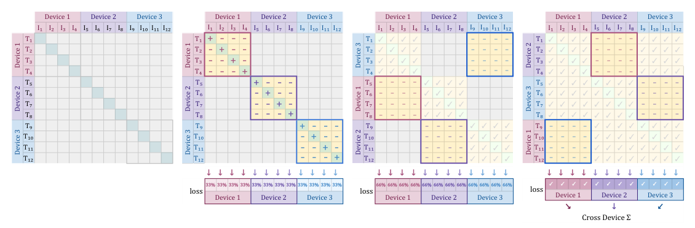
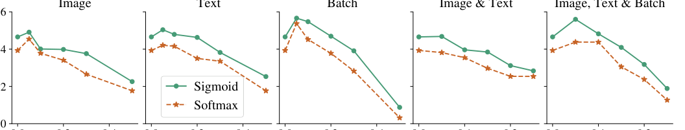

> 原文: [arXiv:2303.15343](https://arxiv.org/abs/2303.15343)（ICCV 2023）
> 说明: 本文为论文全文中文技术展开，公式/图表编号与原文一致；图片自 arXiv HTML 抽取，caption 中译；数值原样保留。

**预印本信息：** arXiv:2303.15343v4 [cs.CV]，2023 年（v4 更新 2023 年 9 月）。

**开源：** https://github.com/google-research/big_vision

---

# 语言-图像预训练中的 Sigmoid 损失（Sigmoid Loss for Language Image Pre-Training）

**作者：** Xiaohua Zhai\*、Basil Mustafa、Alexander Kolesnikov、Lucas Beyer\*

**单位：** Google DeepMind，苏黎世

**邮箱：** {xzhai, basilm, akolesnikov, lbeyer}@google.com

\* 共同第一作者。

---

## 摘要（Abstract）

作者提出一种简单的**成对 Sigmoid 损失（pairwise Sigmoid loss）** 用于语言-图像预训练（**SigLIP**）。与常规的基于 softmax 归一化的对比学习不同，sigmoid 损失**只作用在图文对上**、**不需要成对相似度的全局视图**来做归一化。这带来两个直接好处：

1. **进一步 scale up batch size 的能力**（不需要在 GPU/TPU 之间做 all-gather 的 $|B|\times|B|$ 相似度矩阵）；
2. **在小 batch 下也表现更好**（不再依赖 batch 内的大量负样本做归一化）。

配合 **Locked-image Tuning (LiT)**（冻结图像塔仅训练文本塔），作者用 **4 张 TPUv4 芯片**在 2 天内训出一个 SigLiT 模型，达到 **ImageNet 零样本 84.5%**。因为损失与 batch size 解耦，作者可以细致研究"样例 vs. 对"、"正/负比"等因素。最终作者把 batch size **推到极限 100 万**，发现继续增长的收益迅速衰减，**32 k 就够用**。作者开源模型 https://github.com/google-research/big_vision。

---

## 1 引言（Introduction）

**对比预训练**已成为通用视觉 backbone 的主流方法，逐渐替代大规模标注多类数据集预训练（如 ImageNet 分类）。核心思想很简单：**用配对的 (图, 文) 数据**联合学习一个对齐的表示空间。CLIP [36] 和 ALIGN [23] 是把这一思路推向大规模的开山之作，此后大量图文数据集陆续公开或私有 [59, 13, 21, 49, 40, 6, 15, 7, 41]。

标准做法是**图像-文本对比目标**：把匹配对拉近、把不匹配对推远。为此**通常需要一个 batch 内所有配对的全局相似度矩阵**——这个矩阵有 $|B|^2$ 个元素，随 batch size 二次增长，在大 batch 下极耗显存。此外，所有主流方法用的是**基于 softmax 的 InfoNCE 损失**（Oord et al., 2018），需要**跨设备 all-gather** 所有嵌入，通信开销大。

**作者的替代方案**：**Sigmoid 损失**——把每个图文对当作独立的二分类问题（"这对是不是正确的匹配？"）。这个改动看起来微不足道，但**彻底改变了训练动力学**：

- **不需要 all-gather**：每个 batch 内的对可以**独立**评估；
- **每对独立**：能自然分块（chunked）实现，$|B|^2$ 矩阵可以永远不实体化；
- **对称**：$L(I, T) = L(T, I)$，一次前向后向就够；
- **内存效率**：允许更大的 batch，或者用更少的芯片跑同样 batch。

作者研究两个 image-text 学习范式的 sigmoid 版本：CLIP [36] 与 LiT [59]——分别称之为 **SigLIP** 与 **SigLiT**。**核心发现**：

- **batch < 16 k 时，sigmoid 显著优于 softmax**；
- **batch ≥ 16 k 时，两者接近**；
- **两者都在 32 k 附近饱和**；
- 结合内存优势，**SigLiT 用 4 张 TPUv4 一天达到 79.7% 零样本 ImageNet**，SigLIP 用 32 张 TPUv4 五天达到 73.4%——远比 FLIP [30]（256 TPUv3 五天）、CLIP [36]（256 TPUv3 十天）便宜。

（表 1：SigLiT / SigLIP 的高效训练配方。SigLiT 用 4 芯片 1 天达到 ImageNet 79.7%（B/8）或 84.5%（g/14）；SigLIP 用 32 芯片 5 天达到 73.4%。当以预训练视觉塔为初始化做 SigLIP 训练时，作者发现 **关闭预训练权重上的 weight decay** 能显著提升结果——见图 4 展开。）

---

## 2 相关工作（Related Work）

**Sigmoid 损失做对比学习**：有一个更早的工作 [19] 在无监督降维中用了类似 sigmoid 损失。在有监督分类里，sigmoid 损失已被证明**略强于 softmax**（Beyer et al., 2020; Wightman et al.）。但在**对比图文学习**中，几乎所有工作都用 InfoNCE softmax（Oord et al., 2018）。

**对比语言-图像预训练**：CLIP [36] 与 ALIGN [23] 之后成为主流；后续研究表明这类预训练模型在**微调 [53, 16]、线性 probe [23]、目标检测 [31]、语义分割 [33]、视频任务 [57]** 上都能给出好表征。

**生成式语言-图像预训练**：GIT [49]、SimVLM [50]、LEMON [21] 用生成式文本 decoder；CoCa [56] 结合对比与生成；BLIP [28] 用 CapFilt 让生成器造 caption、判别器过滤对。

**高效语言-图像预训练**：LiT [59] 冻结 backbone；FLIP [30] 随机丢视觉 token（牺牲质量）；BASIC [35]、LAION [52] 试图 scale up batch，但只到 16 k 和 160 k，且用了几百张芯片；BASIC 还混入了大型私有分类数据集。Lion optimizer [12] 声称能降训练成本。

---

## 3 方法（Method）

作者先回顾常用的 softmax 对比损失，再引入成对 sigmoid 损失并讨论其高效实现。

**基本设定**：给一个 mini-batch $\mathcal{B} = \{(I_1, T_1), (I_2, T_2), \dots\}$，希望匹配对 $(I_i, T_i)$ 的嵌入相互对齐、不匹配对 $(I_i, T_{j\neq i})$ 的嵌入互相远离。**默认假设**：对不同图 $i$、$j$，配对的文本互不相关——这个假设是有噪声的。

### 3.1 语言-图像预训练的 softmax 损失（Softmax Loss）

Softmax 版本训练图像模型 $f(\cdot)$ 与文本模型 $g(\cdot)$，最小化：

$$
\mathcal{L}_{\text{softmax}} = -\frac{1}{2|\mathcal{B}|} \sum_{i=1}^{|\mathcal{B}|} \Bigg[ \underbrace{\log \frac{e^{t\, x_i \cdot y_i}}{\sum_{j=1}^{|\mathcal{B}|} e^{t\, x_i \cdot y_j}}}_{\text{图→文 softmax}} + \underbrace{\log \frac{e^{t\, x_i \cdot y_i}}{\sum_{j=1}^{|\mathcal{B}|} e^{t\, x_j \cdot y_i}}}_{\text{文→图 softmax}} \Bigg] \tag{1}
$$

其中 $x_i = f(I_i) / \|f(I_i)\|_2$、$y_i = g(T_i) / \|g(T_i)\|_2$（L2 归一化嵌入），$t$ 是可学习的温度标量（通常初始化为 $\log(1/0.07)$）。

**代价**：需要 batch 内所有 $|\mathcal{B}|^2$ 对的相似度做 softmax 归一化——**必须 all-gather 到一个设备**（或做分布式），$|\mathcal{B}|^2$ 内存代价二次增长。

### 3.2 语言-图像预训练的 sigmoid 损失（Sigmoid Loss for SigLIP）

**新损失**：

$$
\mathcal{L}_{\text{sigmoid}} = -\frac{1}{|\mathcal{B}|} \sum_{i=1}^{|\mathcal{B}|} \sum_{j=1}^{|\mathcal{B}|} \underbrace{\log \frac{1}{1 + e^{z_{ij}(-t\, x_i \cdot y_j + b)}}}_{L_{ij}} \tag{2}
$$

其中 $z_{ij} = +1$ 若 $(i, j)$ 是正对，$z_{ij} = -1$ 若是负对；$t$ 是学到的温度、$b$ 是新引入的**可学习偏置项**。

**为什么加偏置 $b$？** 初始时，每个 batch 有 $|\mathcal{B}|$ 个正对与 $|\mathcal{B}|^2 - |\mathcal{B}|$ 个负对（例如 $|\mathcal{B}| = 16\text{k}$ 时有 **2.68 亿**个负对对应仅 16 k 个正对）。这种严重不均衡在训练初始会导致巨大的优化步——大量负项的梯度累积迫使模型剧烈调整。加入初始化为负数（作者选 $b = -10$）、$t' = \log 10$（即 $t \approx 10$）的可学习偏置 $b$，让训练**从接近先验分布（几乎所有对预测为不匹配）的位置起步**，避免早期大幅"过校正"。

**伪代码**（Algorithm 1）：

```python
# img_emb : image model embedding [n, dim]
# txt_emb : text model embedding [n, dim]
# t_prime, b : learnable temperature (in log scale) and bias
# n : mini-batch size

t = exp(t_prime)
zimg = l2_normalize(img_emb)
ztxt = l2_normalize(txt_emb)
logits = dot(zimg, ztxt.T) * t + b      # [n, n]
labels = 2 * eye(n) - ones(n)           # 对角 +1, 其他 -1
l = -sum(log_sigmoid(labels * logits)) / n
```

### 3.3 分块（chunked）高效实现

即使 sigmoid 损失本身**不需要**全局归一化，直接按 (2) 计算仍然要实体化 $|\mathcal{B}| \times |\mathcal{B}|$ 的 logits 矩阵。作者提出**分块实现**：把 loss 重排为

$$
\mathcal{L}_{\text{sigmoid}} = -\frac{1}{|\mathcal{B}|} \underbrace{\sum_{d_i=1}^{D}}_{A: \text{对每个设备}} \underbrace{\sum_{d_j=1}^{D}}_{B: \text{跨设备置换负样本}} \underbrace{\sum_{i=bd_i}^{b(d_i+1)}}_{\text{本地正对}} \underbrace{\sum_{j=bd_j}^{b(d_j+1)}}_{\text{从邻居设备来的负样本}} L_{ij}
$$

具体算法：

1. 每个设备（一共 $D$ 个）持有 $b = |\mathcal{B}| / D$ 对图文；
2. **先算本地的 $b \times b$ 块**（含所有本地正对与 $b-1$ 个本地负对）；
3. **通过跨设备置换（collective permute）** 把文本嵌入依次传给下一个设备；
4. 每次接收后新算一个 $b \times b$ 块累加到 loss，共重复 $D$ 次；
5. 最后跨设备求和。

**优势**：任何时刻显存只需 $b^2$（而非 $|\mathcal{B}|^2$）；$D$ 次 collective permute 通常**比两次 all-gather 更快**。分块实现让作者在**相对少的芯片**上跑到 **100 万** batch size。



**图 1（原文 Figure 1）：** SigLIP 分块 loss 计算示意（3 设备、总 batch size = 12）。(a) 初始状态：每个设备持有 4 张图和 4 段文本表征。(b) 每个设备先算 4×4 的本地块（含本地正对与 $b-1$ 个本地负对），累加到 loss（当前完成 33%）。(c) 跨设备置换文本：设备 1 现在持有 $I_{1:4}$ 与 $T_{5:8}$，新算 4×4 块累加（累计 66%）。(d) 再次置换直到每张图与每段文本都交互过（100%）。整个过程**没有 all-gather**，任何时刻显存只需 $b \times b = 4 \times 4 = 16$ 项。

---

## 4 实验结果（Results）

### 4.1 SigLiT：sigmoid loss 显著加速 LiT 训练

**LiT 复习**：LiT [59] 冻结预训练的图像塔（如 ViT）、只训文本塔。相比 CLIP-style 从头训，LiT 用少得多的算力就能达到高零样本准确率。

**SigLiT 主结果**：

- 图像塔用公开 ViT-AugReg-B/8 checkpoint [42]、冻结；
- 训练 LiT 图文数据 [59]；
- 用 4 张 TPUv4 训 1 天 → ImageNet 零样本 **79.7%**；
- 换成 g/14 checkpoint [58]、训 2 天 → **84.5%**；
- 最好的 SigLiT（B 文本模型）达到 **84.7%**（原 LiT 是 85.2%，但用了 10 倍大的 g 文本模型）。

**批大小影响**（图 2 左）：SigLiT 训练 180 亿样例。**Batch < 16 k 时 sigmoid 显著优于 softmax**；随 batch 增长两者差距缩小。作者在**极限 batch = 1M** 也成功训练，但**32 k 附近性能饱和**——继续增大 batch 收益递减。

**训练时长的影响**（图 3）：大 batch（262 k）需要**足够长的训练周期**才发挥优势——短周期下大 batch 意味着更少的 gradient 更新步，反而不如小 batch。

### 4.2 SigLIP：sigmoid loss 对 CLIP-style 从头训也有益

**SigLIP 实验设置**：WebLI 英文数据 [13]，图像塔 ViT-B/16、文本塔 B-size Transformer，图 224×224、文本 max 16 token、32 k SentencePiece 词表（C4 训练）。

**结果**（图 2 中）：

- **Batch < 32 k**：SigLIP **优于**同架构的 CLIP (WebLI) baseline；
- **Batch ≥ 32 k**：两者接近，两者都在 32 k 附近饱和；
- **超大 batch（307 k）反而伤害两者**。

**内存好处**：4 芯片能装 4096 batch 的 Base SigLIP，但只能装 2048 的 CLIP。因此**同样资源下 SigLIP 能用两倍 batch**。

### 4.3 mSigLIP：多语言批大小影响

**多语言设置**：100+ 语言、WebLI 多语版、mSigLIP-B，训练 300 亿样例。

**表 2（多语 batch size vs. 性能）**：

| Batch | INet-0 | XM avg | XM de | XM en | XM hi | XM ru | XM zh |
| :--- | ---: | ---: | ---: | ---: | ---: | ---: | ---: |
| 16 k | 71.6 | 34.8 | 54.7 | 46.5 | 9.1 | 50.1 | 30.7 |
| **32 k** | **73.2** | **34.9** | 54.8 | 46.2 | 8.5 | 49.9 | 32.5 |
| 64 k | 73.2 | 34.4 | 55.4 | 46.5 | 7.9 | 49.7 | 32.0 |
| 128 k | 73.2 | 33.6 | 54.3 | 46.6 | 8.1 | 48.6 | 30.6 |
| 240 k | 73.1 | 32.7 | 54.7 | 46.6 | 7.3 | 49.3 | 23.7 |

**结论**：多语场景**32 k 也够用**——继续增大 batch 反而在 XM3600 跨模态检索上**倒退**（尤其 zh 从 32.5 掉到 23.7）。**mSigLIP 只用 Base 模型就把 XM3600 T→I 检索推到 SOTA 34.9%**，比之前 LiT + ViT-e (4B) 的 28.5% 高出 6+ 个点。

### 4.4 4 张 TPUv4 训练 SigLiT

对**有限资源**的实践者，作者用 4 芯片跑 SigLiT：

- ViT-AugReg-B/8 冻结 → 1 天 → **79.7%**
- ViT-g/14 冻结 → 2 天 → **84.5%**

### 4.5 SigLIP with pre-trained encoders and weight decay

**问题**：把预训练视觉塔搬进 SigLIP 训练时，直接沿用默认 weight decay 会**降低**已学到的视觉表征质量——ImageNet 10-shot linear probe 显示微调后的 backbone 几乎和从头训一样差。

**修正**：**关闭预训练权重上的 weight decay**（只对随机初始化的文本模型权重做 weight decay）。


**图 4（原文 Figure 4）：** **上图（ImageNet 0-shot）：** 从预训练视觉塔起手的 SigLIP 收敛快，但只有**关闭预训练权重上的 weight decay** 才能得到稳定的高零样本分数。**下图（ImageNet 10-shot）：** 对预训练权重继续做 weight decay 会让视觉表征质量**退化**——这在 10-shot 线性 probe 上尤为明显（曲线下降）；关闭 weight decay 后曲线平稳保持了预训练质量。**这个改动让 SigLIP 从 16 k batch 3 天训练达到 71%，或从头训 32 芯片 2 天达到 72.1%。**

### 4.6 与其它公开模型对比

**表 3**（关键子集）：

| 方法 | 视觉编码器 | # Patches | ImageNet Val | ImageNet v2 | ImageNet ReaL | ObjectNet | COCO I→T | COCO T→I |
| :--- | :--- | ---: | ---: | ---: | ---: | ---: | ---: | ---: |
| CLIP | B | 196 | 68.3 | 61.9 | - | 55.3 | 52.4 | 33.1 |
| OpenCLIP | B | 196 | 70.2 | 62.3 | - | 56.0 | 59.4 | 42.3 |
| EVA-CLIP | B | 196 | 74.7 | 67.0 | - | 62.3 | 58.7 | 42.2 |
| **SigLIP** | **B** | **196** | **76.2** | **69.6** | **82.8** | **70.7** | **64.4** | **47.2** |
| SigLIP | B | 256 | 76.7 | 70.0 | 83.1 | 71.3 | 65.1 | 47.4 |
| SigLIP | B | 576 | 78.6 | 72.1 | 84.5 | 73.8 | 67.5 | 49.7 |
| SigLIP | B | 1024 | 79.2 | 73.0 | 84.9 | 74.7 | 67.6 | 50.4 |
| CLIP | L | 256 | 75.5 | 69.0 | - | 69.9 | 56.3 | 36.5 |
| EVA-CLIP | L | 256 | 79.8 | 72.9 | - | 75.3 | 63.7 | 47.5 |
| **SigLIP** | **L** | **256** | **80.5** | **74.2** | **85.9** | **77.9** | **69.5** | **51.1** |
| SigLIP | L | 576 | 82.1 | 75.9 | 87.0 | 81.0 | 70.6 | 52.7 |
| OpenCLIP | G (2B) | 256 | 80.1 | 73.6 | - | 73.0 | 67.3 | 51.4 |
| EVA-CLIP | E (5B) | 256 | 82.0 | 75.7 | - | 79.6 | 68.8 | 51.1 |
| **SigLIP** | **SO (400M)** | **729** | **83.2** | **77.2** | **87.5** | **82.9** | **70.2** | **52.0** |

**关键发现**：

- SigLIP-B **全面超越** CLIP/OpenCLIP/EVA-CLIP 同规模模型；
- SigLIP-L 在低分辨率与高分辨率都超越 CLIPA-v2 与 EVA-CLIP；
- **SigLIP-SO (400M)**（Shape-Optimized ViT [1]）**优于所有更大的模型**——包括 OpenCLIP-G (2B) 与 EVA-CLIP-E (5B)。作者据此认为**架构选择（SO）与损失函数（Sigmoid）共同决定质量**。

### 4.7 训练稳定性（$\beta_2$ 调整）

大 batch 训练容易出现 gradient spike，导致大 weight update 破坏优化过程（图 5）。作者把 Adam / AdaFactor 的 $\beta_2$ 从默认 0.999 降到 **0.95**（Chen et al., 2020; Chen et al., 2023 推荐值），训练稳定性显著改善——偶尔仍有 gradient spike（如 2B 样例处），但不再破坏训练。所有实验后续都用 $\beta_2 = 0.95$。

### 4.8 sigmoid 损失中的正负比例

Sigmoid 损失的一个不同视角：从 softmax 的"从 $N$ 类中选正确类"转向"给每对独立打分"。这样必然出现**正负严重不均衡**：$|\mathcal{B}| = 16$k 时 268M 负对 vs. 16 k 正对。作者做**受控实验**（图 6）——在 batch 内 masking 掉负对以模拟不同正负比：

- **1:16k**（原始）
- **1:1.6k**（随机 mask 到 1.6k 负对）
- **1:164**
- **1:16**
- **1:1.6**（几乎平衡）
- 三种 mask 策略：**随机 / 保留最难 / 保留最易**

**发现**：

- **正负严重不均衡"不是主要问题"**——1:16 mask 后仍能保住性能，与全负比相当；
- **"难"负样本更重要**——保留最易负对（Easy mask）质量下降最快；
- **训练更长的时间抵消少负样本**：训练更久处于"Hard, matched pairs"（保留最难负对且训练时长匹配总对数）能保住甚至略提升性能；
- **学到的 bias $b$ 随负数减少变得更正**（因为默认预测"不匹配"的先验被削弱），符合直觉。

**结论**：正负极端不均衡**不 detrimental**，但**高效地挖掘困难负例可能有益**。

### 4.9 sigmoid 损失中的 bias 项消融

**表 4**（Base 架构、8 k batch、900M 样例）：

| $b$ | $t'$ | INet-0 | Pet-0 | C100-0 |
| :--- | :--- | ---: | ---: | ---: |
| n/a | $\log 10$ | 62.0 | 81.8 | 59.9 |
| **-10** | **$\log 10$** | **63.0** | **82.4** | **61.0** |
| -10 | $\log 1$ | 61.0 | 80.0 | 60.4 |
| 0 | $\log 10$ | 61.7 | 79.9 | 59.0 |
| 0 | $\log 1$ | 53.7 | 73.2 | 53.8 |

**结论**：

- **加 bias 项且 $b = -10$ 初始化**在所有三个数据集上一致提升性能；
- 原因是 bias 项让训练**从接近先验（几乎所有对都预测"不匹配"）** 起步——**避免早期大量负项的梯度累积引发的过校正**；
- 若 $b = 0$，早期 loss 被负项主导；若 $b = -10$ 但没有 $t' = \log 10$（$b$ 相对 logits 幅度过大），也会破坏优化——所以要同时设 $t = 10$、$b = -10$。

### 4.10 对数据噪声的鲁棒性

**实验设置**（图 7）：对训练数据随机腐化——图像加噪、文本加噪、batch 内洗牌（导致伪匹配）、图+文同时加噪、图+文+batch 同时加噪。腐化概率 $p \in [0, 0.5]$。

**发现**：

- **各种腐化下 sigmoid 都比 softmax 更鲁棒**；
- 差距在 batch 洗牌（batch 级 label 噪声）下最明显——sigmoid 的每对独立打分让"错误 label"只影响那对，不会像 softmax 那样通过归一化传染到整个 batch。



**图 7（原文 Figure 7）：** M-size 模型训 3.6B 样例、逐渐提高腐化概率，5 种腐化设置（Image / Text / Batch / Image+Text / Image+Text+Batch）下 sigmoid 损失都比 softmax 保持更好的 ImageNet 零样本。差距在 batch shuffle（等价于 label noise）下最显著。

---

## 5 结论（Conclusion）

作者研究了 sigmoid 损失在语言-图像预训练中的两种实例：SigLiT 与 SigLIP，得到几个关键发现：

- **Sigmoid 损失在小 batch 下显著优于 softmax**，大 batch 下与之相当；
- **内存效率高**，允许更大 batch 或更少芯片；
- **32 k batch 已接近最优**——继续增大收益递减；
- **可学习偏置项** 是关键（$b = -10$、$t' = \log 10$ 初始化）；
- **对数据噪声更鲁棒**；
- **实用配方**：4 张 TPUv4 一天 SigLiT 就能 ImageNet 79.7%；32 张 TPUv4 五天 SigLIP 就能 73.4%；SigLIP-SO/14@384 在 400M 参数下超越所有更大的公开模型。

作者希望这些发现能**降低语言-图像预训练的门槛**，让更多资源有限的研究者能参与进来。

---

## 附录索引（Appendix）

- **A** 详细训练超参数（optimizer、LR schedule、weight decay 值等）；
- **B** 更多 batch composition 实验；
- **C** 完整的公开模型对比表；
- **D** 多语 SigLIP 的更多语言/任务的 breakdown；
- **E** 训练稳定性分析补充。

---

*翻译约定：Sigmoid 损失（sigmoid loss）、成对（pairwise）、语言-图像预训练（language-image pre-training）、锁定图像微调（Locked-image Tuning / LiT）、可学习偏置（learnable bias）、分块实现（chunked implementation）、全汇聚（all-gather）、跨设备置换（collective permute）、零样本迁移（zero-shot transfer）。CLIP / ALIGN / OpenCLIP / EVA-CLIP / CLIPA / FLIP / CoCa / BLIP / SimVLM / LEMON / GIT / WebLI / LAION / BASIC / ImageNet / ObjectNet / COCO / XM3600 / SentencePiece / ViT / TPU / Adam / AdaFactor / Lion 按惯例不译。*
