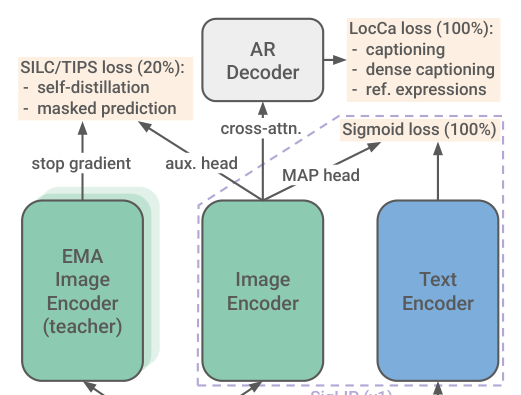
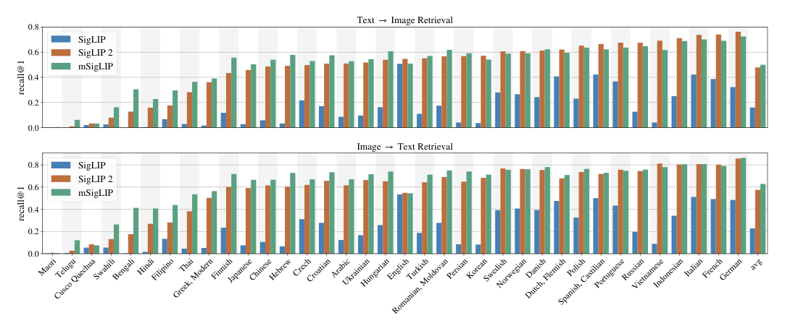
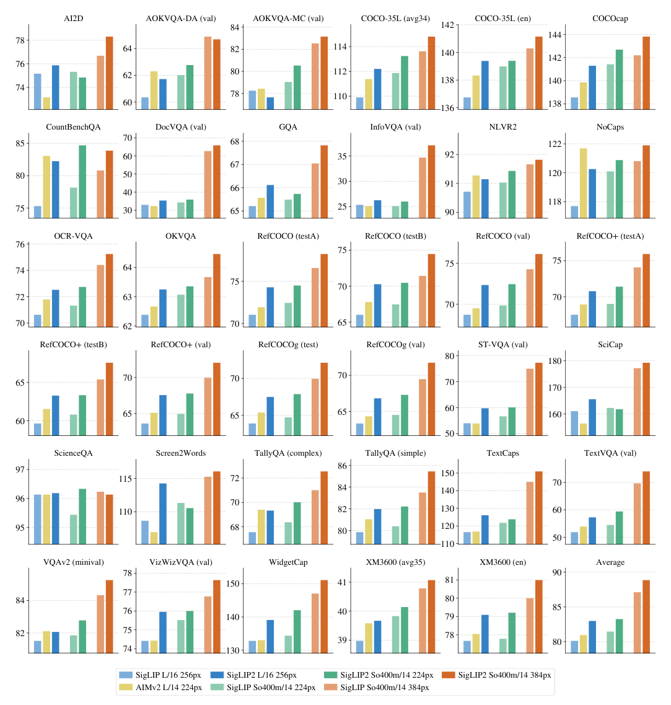
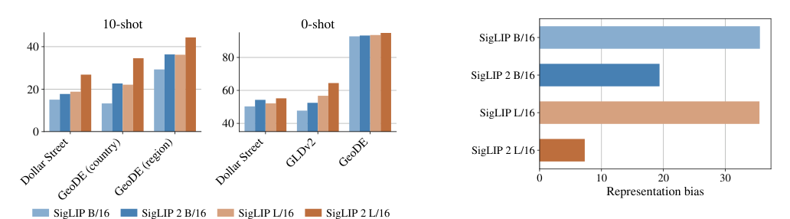

> 原文: [arXiv:2502.14786](https://arxiv.org/abs/2502.14786)
> 说明: 本文为论文全文中文技术展开，公式/图表编号与原文一致；图片自 arXiv HTML 抽取，caption 中译；数值原样保留。

**预印本信息：** arXiv:2502.14786v2 [cs.CV]，2025 年 2 月。

**开源：** https://github.com/google-research/big_vision （SigLIP 2 checkpoints）

---

# SigLIP 2：多语视觉-语言编码器（Multilingual Vision-Language Encoders with Improved Semantic Understanding, Localization, and Dense Features）

**作者：** Michael Tschannen\*†、Alexey Gritsenko\*、Xiao Wang\*、Muhammad Ferjad Naeem\*、Ibrahim Alabdulmohsin\*、Nikhil Parthasarathy\*、Talfan Evans\*◦、Lucas Beyer\*◦、Ye Xia、Basil Mustafa、Olivier Hénaff◦、Jeremiah Harmsen、Andreas Steiner、Xiaohua Zhai\*◦†

**单位：** Google DeepMind

\* 核心贡献者，† 项目负责人，◦ 在 Google DeepMind 期间的工作。

---

## 摘要（Abstract）

作者提出 **SigLIP 2**——一族新的**多语视觉-语言编码器**，在原 SigLIP 的基础上构建。第二代把原本的图文训练目标与几种此前独立提出的技术**统一到一个训练配方**，包括：**基于 caption 的预训练（captioning-based pretraining）**、**自监督损失（self-distillation + masked prediction）**、**在线数据整理（online data curation）**。有这些改动后，SigLIP 2 在**所有模型规模**上都超过对应的 SigLIP，涵盖零样本分类、图文检索、以及**作为 VLM 视觉编码器**时的迁移性能。此外，新的训练配方在**定位（localization）与密集预测（dense prediction）** 任务上带来显著提升。作者还训练了支持多分辨率与**保留原始纵横比**的变体（NaFlex）。最后，训练混入更多样的数据（含去偏技术），得到**更强的多语理解与更好的公平性**。为方便用户在推理成本与性能间做权衡，作者发布 **4 个尺寸**的模型：ViT-B (86M)、L (303M)、So400m (400M)、g (1B)。

---

## 1 引言（Introduction）

**背景**：CLIP [50] 与 ALIGN [28] 开创了在十亿规模数据上训练**对比式图文嵌入模型**的时代。它们能做出媲美监督方法的细粒度零样本分类，能做高效的文-图 / 图-文检索，配合 LLM 组装成 VLM 后又能提供强大的视觉-语言理解。

**改进方向**：CLIP 之后陆续出现多种改进——重新 caption 图像 [38]、加入**图像自监督损失** [38, 45]、加**用于辅助任务（caption / 定位）的小 decoder** [60, 62]。这些改动分别指向不同能力：re-caption 提升语义，自监督提升密集特征，decoder-based 提升 OCR 与定位。

**SigLIP 2 的贡献**——把这些独立技术**统一在一个配方**里：

- **decoder 端目标**（来自 LocCa [62]）：captioning + dense captioning + 指代表达（referring expressions） → **提升 OCR 与定位能力**；
- **自监督损失**（来自 SILC/TIPS [38, 45]）：self-distillation + masked prediction → **提升密集特征质量**（用于 segmentation / depth / normals）；
- **在线数据整理**（online data curation，来自 ACID [61]）：**小模型 (B/16, B/32) 蒸馏**；
- **数据 mixture 更多样**：90% 英文 + 10% 非英文（覆盖 109 语言）+ 去偏过滤 [2]；
- **NaFlex 变体**：单 checkpoint 支持多分辨率、保留原纵横比。

**向后兼容**：SigLIP 2 沿用与 SigLIP 相同的架构——现有用户**只需换 checkpoint 与 tokenizer**（多语 Gemma tokenizer，词表 256k）即可获得改进。

**四种尺寸**：ViT-B (86M) / L (303M) / So400m (400M) / g (1B)——覆盖从边缘部署到大模型的场景。

---

## 2 训练配方（Training recipe）

SigLIP 2 把 SigLIP [71] 的对比训练与 LocCa [62] 的 decoder-based 训练**合并**（100% + 100%），另外在训练的后 20% 加入 DINO/SILC/TIPS 系的自监督损失（20%）。因为 self-distillation 与 masked prediction 显存开销大，作者采用**分阶段**做法：先跑图文 + decoder 目标，训练到 80% 时再加自监督头。

**图 1（原文 Figure 1）：** SigLIP 2 训练框架总览。**Image Encoder** 与 **Text Encoder** 之间做 SigLIP sigmoid loss（图文匹配、全程开启）。视觉塔的未池化表征（applying MAP head 之前）接一个 **AR Decoder**，做 **LocCa loss**：caption、dense caption、referring expression 三类目标（全程 100%）。到训练 80% 时启用 **SILC/TIPS loss**——一个 **EMA Image Encoder（teacher）**（学生权重的指数滑动平均）给出目标，学生做 **self-distillation**（全局池化后特征一致性）+ **masked prediction**（patch 级 50% masked、匹配 teacher 的 patch 特征）。teacher 的梯度**被 stop**。所有损失共同优化学生的 image encoder / text encoder / decoder。

### 2.1 架构与数据

**视觉塔**：ViT + **MAP (Multihead Attention Pooling) head** [69]（而不是 CLS token）。四种规格：

- **ViT-B/16**：86M 参数；
- **ViT-L/16**：303M；
- **ViT-So400m/14**：400M（Shape-Optimized）；
- **ViT-g/16**：1B。

**文本塔**：Transformer，text 长度 64，用 **Gemma 多语 tokenizer**（词表 256k）；tokenize 前把文本 lower case。

**数据**：**WebLI** [10]（10 亿图 + 12 亿 alt-text）覆盖 109 语言。为在英文与多语基准上都好，混合比例是 **90% 英文 + 10% 非英文**（按 [49] 推荐）。此外，应用 [2] 的过滤技术缓解性别、地域等敏感属性的表示偏差。

**优化器**：Adam，lr = $10^{-3}$，decoupled weight decay $10^{-4}$，gradient clip 到 1；**batch = 32k**；cosine schedule + 20k warmup；总共训 **400 亿样例**；至多 2048 张 TPUv5e，用 **FSDP** [72] 全分片数据并行。

### 2.2 SigLIP loss + LocCa loss（第 1 阶段，全程）

**SigLIP loss** 部分：即原 SigLIP 的成对 sigmoid loss（详见 SigLIP 报告 §3.2 与公式 2）。

**LocCa loss** 部分：在视觉塔的**未池化**表征上（applying MAP head 之前）接一个标准的 **cross-attention Transformer decoder**。decoder 沿用文本塔的 shape，但**层数减半**，加入 cross-attention。LocCa 的三个训练目标：

1. **图像 captioning**：直接从图预测 caption；
2. **指代表达预测**：给定 caption（描述某区域），预测该区域的 **bbox 坐标**；
3. **grounded captioning**：给定 bbox 坐标，预测该区域的 caption。

**区域-caption 对怎么来？** 用自动化 pipeline：先从 alt-text 抽 n-gram，再用**开放词表检测器**（OWL-ViT [40]）找到 n-gram 描述的区域。

**why decoder-based？** 已有工作 [60, 62] 证明这类目标**提升 OCR 与定位能力**——SigLIP 2 在这些任务上的收益主要来自 LocCa。

### 2.3 Self-distillation + masked prediction（第 2 阶段，最后 20%）

从训练 80% 开始，额外加入两个 loss：

**Loss 1 - Self-distillation（一致性损失）**：teacher 是学生参数的 EMA（指数滑动平均）。作者用**1 个 global (teacher) view + 8 个 local (student) view**（沿用 [45] 的增强、损失、超参）。student 的池化表征要匹配 teacher 池化表征。

**Loss 2 - Masked prediction**：50% 的 image patches 在 student 网络中被替换为 **mask token**。学生要**匹配 teacher 在这些 mask 位置的特征**——不是全局池化后的图像级表征，而是**per-patch 特征**。student 与 teacher 看到**同一个 global view**（只是学生有 masking）。

**训练细节**：

- teacher 用当时的学生参数初始化，其它新参数（head、mask token、优化器状态）随机初始化；
- SigLIP + LocCa 用**原图**；额外的自监督 loss 用**增强后的 view**——避免数据增强破坏图文对齐 [45]；
- loss 1 与 loss 2 的相对权重 1 与 0.25；
- 为在 global/semantic 与 dense 任务间平衡，两种自监督 loss 整体再乘以一个模型规模相关的系数：**B: 0.25，L: 0.5，So400m: 1.0，g: 0.5**。

### 2.4 分辨率适配

#### 2.4.1 固定分辨率变体

要拿到多个分辨率的 checkpoint，作者的做法：

1. 训练主体在 patch 16、序列长度 256（对应 256×256 输入）上跑；
2. **在训练 95% 处**从 checkpoint 恢复；
3. 把 positional embedding **resize 到目标序列长度**（部分模型还从 patch 16 → 14，用 PI-resize [6]）；
4. **在目标分辨率上继续训练**，所有 loss 保持开启。

作者试过 SigLIP 传统做法（微调最终 checkpoint、小 lr、无 weight decay [71]），**但在 SigLIP 2 的多 size × 多 res 组合下效果不好**，故改用上述方法。

#### 2.4.2 变长/纵横比变体（NaFlex）

**NaFlex** 结合 **FlexiViT** [6]（单模型支持多个预定义序列长度）与 **NaViT** [12]（保留原纵横比）的思想。单一 checkpoint 支持多种分辨率与纵横比——**特别适合文档 / 屏幕这类纵横比敏感的应用**。

**预处理**：给定 patch size 与目标序列长度：

1. 缩放图像使 H, W 都是 patch size 的整数倍，同时**最小化纵横比失真**、**总 patch 数不超过目标序列长度**；
2. 失真上界 $(P-1)/W$ 或 $(P-1)/H$（$P$ 是 patch size）——常见分辨率下失真很小；
3. 切成 patch 序列 + patch 坐标 + padding mask。

**处理不同序列长度**：把 patch 网格从预训练的 16×16 双线性 resize（含 anti-aliasing）到目标非方形 patch 网格。当实际序列长度 < 目标序列长度时，attention 层（含 MAP head）用 mask 忽略 padding token。

**训练协议**：

- 从主训练的 90% checkpoint 起手；
- 切换到 aspect-preserving resize；
- 从集合 $\{128, 256, 576, 784, 1024\}$ 里**均匀采样序列长度**（每 mini-batch）；
- 学习率 schedule 的最后 10% 拉长 3.75 倍——每个分辨率都得到足够训练；
- 最大序列长度（1024）batch size 减半、训练步数翻倍（避免 OOM）；
- 为控制实现复杂度，**NaFlex 变体不做 self-distillation 与 masked prediction**。

### 2.5 通过在线数据整理蒸馏（Distillation via active data curation）

为最大化**小模型**（ViT-B/16、B/32）的性能，作者从**参考 teacher** 做知识蒸馏。做法：

- lr 降到 $10^{-5}$；
- 移除 weight decay；
- **继续训 4B 样例**，只用 sigmoid image-text loss；
- 用 **ACID 方法** [61] 做"通过数据的隐式蒸馏"（distillation through data）——每步用 teacher 与学生对样例打**"可学性"分数**（learnability score）[42]，从更大的 super-batch 里选出**最有价值的 batch of size 32k**。作者用 filtering ratio 0.5（super-batch 64k）；B/32 用 0.75。

**关键改进**：[61] 原论文推荐 ACED（ACID + 显式 softmax 蒸馏），需要**两个 teacher**。作者的做法**只需要一个 teacher**：

1. 取 SigLIP 2 So400m 作为 base teacher；
2. 在高质量整理数据集 [16] 上再微调 1B 样例；
3. 用这个 fine-tuned teacher 做 ACID 训练。

这个 teacher 兼有"多样知识"与"高质量偏好"，**只用 ACID（不用显式 softmax 蒸馏）就够了**——省下大量算力。

---

## 3 实验结果（Experiments and results）

### 3.1 零样本分类与检索

**表 1（关键子集）**：SigLIP 2 vs. baselines 在 ImageNet-1k / COCO / Flickr / XM3600 上的零样本分类、10-shot 分类、检索 (R@1)：

| ViT | Res. | Seq. | 模型 | INet val | v2 | ReaL | ObjNet | 10s | COCO T→I | COCO I→T | Flickr T→I | Flickr I→T | XM3600 T→I | XM3600 I→T |
| :--- | ---: | ---: | :--- | ---: | ---: | ---: | ---: | ---: | ---: | ---: | ---: | ---: | ---: | ---: |
| B/32 | 256 | 64 | OpenCLIP | 72.8 | 64.8 | – | 59.6 | – | 39.9 | 57.9 | 64.9 | 84.8 | – | – |
| B/32 | 256 | 64 | **SigLIP 2** | **74.0** | **66.9** | **81.4** | **66.1** | **66.6** | **47.2** | **63.7** | **75.5** | **89.3** | **38.3** | **49.0** |
| B/16 | 224 | 196 | SigLIP | 76.2 | 69.5 | 82.8 | 70.7 | 69.9 | 47.2 | 64.5 | 77.9 | 89.6 | 22.4 | 29.3 |
| B/16 | 224 | 196 | **SigLIP 2** | **78.2** | **71.4** | **84.8** | **73.6** | **72.1** | **52.1** | **68.9** | **80.7** | **93.0** | **40.3** | **50.7** |
| B/16 | 512 | 1024 | SigLIP | 79.2 | 72.9 | 84.9 | 74.8 | 73.3 | 50.4 | 67.6 | 81.6 | 92.5 | 23.5 | 30.5 |
| B/16 | 512 | 1024 | **SigLIP 2** | **81.2** | **74.5** | **86.7** | **77.8** | **75.2** | **55.2** | **71.2** | **84.5** | **95.5** | **41.4** | **52.0** |
| L/16 | 256 | 256 | SigLIP | 80.5 | 74.2 | 85.9 | 77.9 | 76.8 | 51.2 | 69.6 | 81.3 | 92.0 | 30.9 | 40.1 |
| L/16 | 256 | 256 | **SigLIP 2** | **82.5** | **76.8** | **87.3** | **83.0** | **78.8** | **54.7** | **71.5** | **84.1** | **94.5** | **46.5** | **56.5** |
| L/16 | 512 | 1024 | **SigLIP 2** | **83.5** | **77.8** | **87.7** | **84.6** | **79.6** | **55.2** | **72.1** | **85.3** | **95.8** | **47.4** | **56.7** |
| So/14 | 384 | 729 | SigLIP | 83.2 | 76.0 | 87.5 | 82.9 | 79.5 | 51.5 | 70.5 | 79.1 | 91.9 | 16.6 | 22.9 |
| So/14 | 384 | 729 | **SigLIP 2** | **84.1** | **78.4** | **88.1** | **85.5** | **80.4** | **55.6** | **72.4** | **85.6** | **95.1** | **48.3** | **58.0** |
| g | 384 | 576 | **SigLIP 2** | **85.0** | **79.8** | **88.5** | **88.0** | **82.5** | **56.1** | **72.8** | **86.0** | **95.4** | **48.6** | **57.9** |

**关键发现**：

- SigLIP 2 **全线超越** SigLIP 同配置——ImageNet 分数 +1-2 个点、COCO/Flickr R@1 +2-5 个点；
- **XM3600 多语检索**：SigLIP 只有 22-31，SigLIP 2 到 40-48——多语能力**大幅提升**；
- 更大 model + 更高 res 一致带来提升，但**回报边际下降**。

**图 2（原文 Figure 2）：** XM3600 上按语言细分的图-文检索 R@1。SigLIP 2 **接近 mSigLIP**（原 SigLIP 训在纯多语数据上的版本）的水平，同时**在英语任务上大幅优于 mSigLIP**（表 1）——即用一个模型兼顾英文与多语。每种语言（Maori / Telugu / Cusco Quechua / Swahili / Bengali / ... / French / German / avg）SigLIP 2 都在 SigLIP 与 mSigLIP 之间或接近后者。

#### 3.1.1 NaFlex 变体

**图 3**：对比同一模型规模下 NaFlex（单 checkpoint 支持全部序列长度）与标准正方形输入（每分辨率一个 checkpoint）的表现。加入 4 个 OCR/文档/屏幕基准（TextCaps、HierText、SciCap、Screen2Words）后：

**图 3（原文 Figure 3）：** NaFlex 变体（单 checkpoint 支持多序列长度，保留原始纵横比）与标准 SigLIP 2（每序列长度一个 checkpoint）在多种检索任务上的对比。序列长度 ∈ {64, 256, 576, 784, 1024}。**NaFlex 在多数检索任务（尤其 OCR/文档/屏幕类）上优于标准变体**，短序列（低分辨率）时尤为显著——受纵横比失真影响的图像获益最多。在自然图像类基准上，B 尺寸标准变体略胜 NaFlex（因为标准变体还享受了 self-distillation 阶段的收益）；So400m 尺寸两者接近。**NaFlex 能在训练分辨率之间良好插值，但外推能力有限**。

### 3.2 SigLIP 2 作为 VLM 视觉编码器

**实验设置**：把 SigLIP 2（或对比模型）与 **Gemma 2 2B LLM** [23] 拼成一个 VLM，训练 50M 步（PaliGemma [7] Stage 1 混合数据：captioning、OCR、grounded captioning、VQA、检测、实例分割——后 4 类标注由机器生成 [7, §3.2.5]）。**视觉塔冻结**（[7, §5.4] 显示这几乎不影响质量）。然后在各下游任务上做 Stage 3 微调。

**图 4（原文 Figure 4）：** 冻结不同视觉编码器 + Gemma 2 2B LLM 训 50M 步，然后在 30+ 下游任务上微调后的分数对比（含 AI2D、AOKVQA、COCO-35L、CountBenchQA、DocVQA、GQA、InfoVQA、NLVR2、NoCaps、OCR-VQA、OKVQA、RefCOCO/+/g、ST-VQA、SciCap、ScienceQA、Screen2Words、TallyQA、TextCaps、TextVQA、VQAv2、VizWizVQA、WidgetCap、XM3600 等）。**SigLIP 2 在所有 model size 与分辨率上都优于 SigLIP；L-size 上还优于 AIMv2 [20]**——这是最近才发布的强 baseline。

### 3.3 密集预测任务（Dense prediction）

#### 3.3.1 语义分割 / 深度估计 / 法线估计

**协议**（沿用 [38]）：在冻结的 SigLIP 2 表征上加一个线性层或 DPT decoder [52]，探测 6 个密集预测基准。**唯一改动**：作者把 MAP head 输出的 embedding（而不是 CLS token）拼到 patch 特征上。

**表 2（关键子集）**：

| 模型 | ViT | Res. | PASCAL mIoU↑ | ADE20k mIoU↑ | NYUv2 depth RMSE↓ | NAVI depth RMSE↓ | NYUv2 normals angular RMSE↓ | NAVI normals angular RMSE↓ |
| :--- | :--- | ---: | ---: | ---: | ---: | ---: | ---: | ---: |
| CLIP | L/14 | 224 | 74.5 | 39.0 | 0.553 | 0.073 | 24.3 | 25.5 |
| OpenCLIP | G/14 | 224 | 71.4 | 39.3 | 0.541 | – | – | – |
| SigLIP | So/14 | 224 | 72.0 | 37.6 | 0.576 | 0.083 | 25.9 | 26.0 |
| **SigLIP 2** | So/14 | 224 | **77.1** | **41.8** | **0.493** | **0.067** | **24.9** | **25.4** |
| SigLIP | So/14 | 384 | 73.8 | 40.8 | 0.563 | 0.069 | 24.1 | 25.4 |
| **SigLIP 2** | So/14 | 384 | **78.1** | **45.4** | **0.466** | **0.064** | **23.0** | **25.0** |

**结论**：SigLIP 2 在**所有密集预测任务**上**全面超越** SigLIP、CLIP、OpenCLIP-G——很多任务上差距不小（ADE20k mIoU +5、NYUv2 depth RMSE -0.1）。这部分收益来自 self-distillation + masked prediction。

#### 3.3.2 开放词表分割（Open-vocabulary segmentation）

**表 3**（用 Cat-Seg [11] 框架）：

| 模型 | ViT | A-847 | PC-459 | A-150 | PC-59 | VOC-20 | VOC-21 |
| :--- | :--- | ---: | ---: | ---: | ---: | ---: | ---: |
| CLIP | L/16 | 10.8 | 20.4 | 31.5 | 62.0 | 96.6 | 81.8 |
| OpenCLIP | G/14 | 13.3 | 21.4 | 36.2 | 61.5 | 97.1 | 81.4 |
| SigLIP | L/16 | 14.0 | 23.9 | 37.5 | 61.6 | 96.1 | 81.1 |
| **SigLIP 2** | L/16 | **14.3** | **24.1** | **38.8** | **62.4** | **97.0** | **82.3** |

**结论**：SigLIP 2 优于 SigLIP 与更大的 OpenCLIP-G——尽管模型规模更小。

### 3.4 定位任务（Localization）

#### 3.4.1 指代表达理解（Referring Expression Comprehension）

**协议**：把 SigLIP 2 视觉塔与一个轻量 decoder 结合，做 RefCOCO/+/g 的 bbox 定位（Acc@0.5）。**表 5 关键行**：

| ViT | Seq. | 模型 | RefCOCO val | RefCOCO testA | RefCOCO testB | RefCOCO+ val | RefCOCO+ testA | RefCOCO+ testB | RefCOCOg val-u | RefCOCOg test-u |
| :--- | ---: | :--- | ---: | ---: | ---: | ---: | ---: | ---: | ---: | ---: |
| B | 256 | SigLIP | 64.05 | 70.10 | 57.89 | 55.77 | 63.57 | 47.51 | 59.06 | 60.33 |
| B | 256 | **SigLIP 2** | **83.76** | **86.21** | **79.57** | **74.26** | **79.85** | **65.83** | **77.25** | **77.83** |
| L | 256 | SigLIP | 67.33 | 72.40 | 61.21 | 59.57 | 67.09 | 51.08 | 61.89 | 62.90 |
| L | 256 | **SigLIP 2** | **86.04** | **89.02** | **81.85** | **77.29** | **83.28** | **70.16** | **80.11** | **80.78** |
| L | 256 | LocCa | 88.34 | 91.20 | 85.10 | 79.39 | 85.13 | 72.61 | 81.69 | 82.64 |
| So | 729 | SigLIP | 67.66 | 74.12 | 62.36 | 60.74 | 69.73 | 52.12 | 62.61 | 63.24 |
| So | 729 | **SigLIP 2** | **87.88** | **91.13** | **83.59** | **80.06** | **86.30** | **72.66** | **82.68** | **83.63** |
| g | 576 | **SigLIP 2** | **88.45** | **91.53** | **84.95** | **80.44** | **87.09** | **73.53** | **83.12** | **84.14** |

**关键发现**：

- SigLIP 2 在 RefCOCO 上比 SigLIP **+16-20 个点**（B-size val 64.05 → 83.76）；
- **只有 LocCa** 略胜（LocCa 用同一 decoder-based loss，但训练在纯英文数据上）；
- SigLIP 2 略慢于 LocCa 可能是因为 SigLIP 2 训练在多语数据，英文 caption 占比降低。

#### 3.4.2 开放词表检测（Open-vocabulary detection）

用 OWL-ViT [40] 把 SigLIP / SigLIP 2 适配到开放词表检测：

**表 4 结论**：SigLIP 2 在 COCO [34] 与 LVIS [25] 上都优于 SigLIP，**LVIS 的稀有类别**改进最明显。整体分数也超过 [40] 原论文报告值（他们用的是 CLIP 而非 SigLIP）。

### 3.5 文化多样性与公平性（Cultural diversity and fairness）

SigLIP 2 相比 SigLIP 有两方面 inclusivity 提升：

1. **多语训练混合**（10% 非英文，覆盖 109 语言）—— 增强文化多样性；
2. **数据去偏过滤** [2]——缓解**一阶偏差**（如性别分布不均）与**二阶偏差**（如属性关联偏差）。

**代表性偏差**：

- SigLIP L/16 @ 256px：**35.5%** 的 "representation bias"——即模型把随机图像与"男性"关联的次数比"女性"多 35.5%（对应"男性 gets 85.5% of associations"）；
- **SigLIP 2 L/16 @ 256px**：仅 **7.3%**——降幅 80%。

**大模型偏差更低**：SigLIP 2 中，更大模型的 representation bias 通常更低。

**图 5（原文 Figure 5）：** 在地理多样物体识别（Dollar Street、GeoDE）、地理定位（GeoDE country / region）、地标定位（GLDv2）的 10-shot 与 0-shot 分数。**SigLIP 2 在所有任务上都一致优于 SigLIP**——这是"多语训练 + 去偏过滤"对地理/文化多样性带来的直接改善。

**图 6（原文 Figure 6）：** 不同模型的 representation bias（把随机物体与性别关联的偏差，越低越好）。**SigLIP → SigLIP 2 显著下降**（B/16：~30% → ~10%；L/16：35.5% → 7.3%）。同时**更大模型偏差更小**——这与 SigLIP 2 训练目标里内嵌的数据去偏一致。

---

## 4 相关工作（Related work）

**图文对比预训练**：CLIP [50]、ALIGN [28]、OpenCLIP [27]、MetaCLIP [66]、EVA-CLIP [57]、CLIPA [33]、SigLIP [71]、DFN [19]。

**重新 captioning**：LaCLIP [38] 首次证明"用生成模型 re-caption 训练图像"能显著提升 alignment。

**Decoder-based auxiliary tasks**：Cap [60]、CapPa [60]、LocCa [62]——引入 caption / dense caption / referring expression 三种 decoder loss。

**自监督视觉表征**：DINO [9]、iBOT [47]、DINOv2 [47]、SILC [38]、TIPS [45]。SigLIP 2 直接采用 SILC/TIPS 的 self-distillation + masked prediction。

**变分辨率**：FlexiViT [6]（单模型多序列长度）、NaViT [12]（保留原纵横比）。SigLIP 2 的 NaFlex 结合两者。

**在线数据整理**：ACID / ACED [61]、ADC [16]。SigLIP 2 用 ACID 做小模型蒸馏。

**去偏**：Alabdulmohsin et al. [2] 提出的去偏过滤器。

---

## 5 结论（Conclusion）

作者提出 **SigLIP 2**，一族开源多语视觉-语言编码器。通过在 SigLIP 基础上组合 **decoder-based 预训练**、**自监督损失**、**在线数据整理**，SigLIP 2 在多个方面同时提升：

- **零样本分类与检索**：全线超过 SigLIP、CLIP、OpenCLIP、MetaCLIP、EVA-CLIP、DFN；
- **VLM 视觉编码器迁移**：超过 SigLIP 与 AIMv2；
- **定位与密集预测**：ReferCOCO +16-20 点、密集分割/深度显著改善；
- **多语理解 + 公平性**：mSigLIP-level 多语能力 + 显著降低 representation bias；
- **NaFlex**：单 checkpoint 支持多分辨率、保留原纵横比。

作者开源 4 尺寸 checkpoint（ViT-B / L / So400m / g）到 `big_vision`。

---

## 附录索引（Appendix）

- **A** 训练超参数详情；
- **B** ACID / 蒸馏细节；
- **C** NaFlex 详细协议；
- **D** VLM baseline 详细分数（表 6）；
- **E** 地理多样性 / 公平性详细数据（表 8）；
- **F** 完整参考文献。

---

*翻译约定：SigLIP 2、语义理解（semantic understanding）、定位（localization）、密集特征（dense features）、captioning-based 预训练、自蒸馏（self-distillation）、掩码预测（masked prediction）、在线数据整理（online data curation / active data curation）、指代表达理解（referring expression comprehension）、开放词表分割（open-vocabulary segmentation）、多头注意力池化（Multihead Attention Pooling / MAP）、指数滑动平均（EMA / exponential moving average）、教师-学生（teacher-student）、代表性偏差（representation bias）、纵横比（aspect ratio）。SigLIP / CLIP / ALIGN / OpenCLIP / MetaCLIP / EVA-CLIP / CLIPA / DFN / AIMv2 / LocCa / Cap / CapPa / SILC / TIPS / DINO / iBOT / FlexiViT / NaViT / ACID / ACED / OWL-ViT / Cat-Seg / PaliGemma / Gemma / WebLI / XM3600 / RefCOCO / ImageNet / COCO / Flickr / ADE20k / PASCAL / NYUv2 / NAVI / TextCaps / HierText / SciCap / Screen2Words / GeoDE / Dollar Street / GLDv2 / DPT / FSDP / TPU 按惯例不译。*
