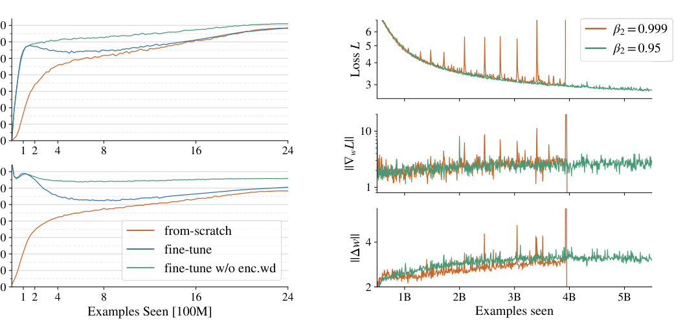
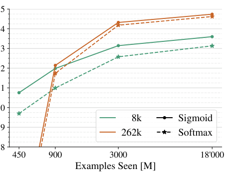
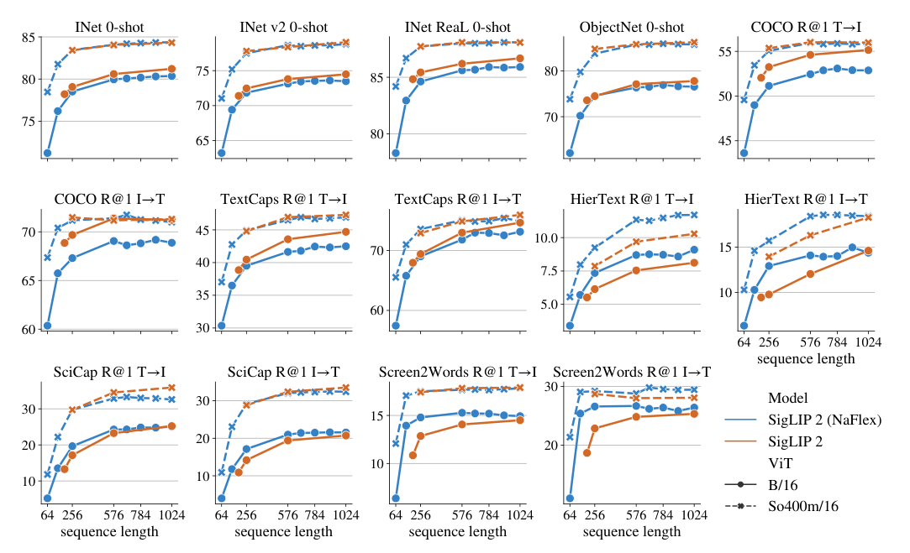

# SigLIP 与 SigLIP 2：Sigmoid 图文对比 + 密集特征扩展

> **paper**：[SigLIP: Sigmoid Loss for Language-Image Pre-Training (ICCV 2023)](https://arxiv.org/abs/2303.15343) · [SigLIP 2: Multilingual Vision-Language Encoders with Improved Semantic Understanding, Localization, and Dense Features (2025)](https://arxiv.org/abs/2502.14786)
> **project / code / weights**：[google-research/big_vision](https://github.com/google-research/big_vision) · [HuggingFace google/siglip2 collection](https://huggingface.co/collections/google/siglip2-67b5dcef38c175486e240107)
> **refs**：[CLIP](https://arxiv.org/abs/2103.00020) · [LiT (Zhai 2022)](https://arxiv.org/abs/2111.07991) · [WebLI (PaLI 2022)](https://arxiv.org/abs/2209.06794) · [FlexiViT (Beyer 2023)](https://arxiv.org/abs/2212.08013) · [NaViT (Dehghani 2023)](https://arxiv.org/abs/2307.06304) · [DINOv2 (Oquab 2023)](https://arxiv.org/abs/2304.07193) · [LocCa (Wan 2024)](https://arxiv.org/abs/2403.19596) · [SILC (Naeem 2023)](https://arxiv.org/abs/2310.13355) · [TIPS (Maninis 2024)](https://arxiv.org/abs/2410.16512)
> **backbone**：SigLIP：ViT-B/16 + B-Text；SigLIP 2：**ViT-B (86M) / L (303M) / So400m (400M) / g (1B)**；Text 与 Image 塔同尺寸，g 版配 So400m Text
> **date**：SigLIP 2023-03；SigLIP 2 2025-02
> **modality**：文本 ↔ 图像；SigLIP 2 通过 LocCa 补 caption / referring / dense caption
> **languages**：SigLIP 英文；**mSigLIP** 与 SigLIP 2 支持 **100+ 语言**（多语 Gemma tokenizer，vocab 256k）
>
> 本文把「为什么 sigmoid loss 好用」讲清（数值稳定、去 all-gather、正负对比例可控、小 batch 也能跑得动），把 SigLIP 2 的 **LocCa + SILC/TIPS + NaFlex + 数据 debias + 蒸馏小模型** 五个升级点分别说透。SigLIP 2 已经是 2024–2025 主流开源 VLM（Qwen-VL、Gemma-VLM、InternVL、Idefics3）的**默认视觉塔**。

---

## 一句话定位

SigLIP 把 CLIP 的**双塔 InfoNCE（softmax）**换成 **pairwise sigmoid（二元交叉熵）**：

- 不再对整个 batch 做 row/column softmax 归一，也**不用 all-gather**；
- 每个 image–text pair 独立算 loss，$N \times N$ 相似度矩阵可以 chunked / permute 计算；
- **小 batch 也能训得比 CLIP 好**；大 batch 上限 100 万仍稳定，实测 **32k 就够**（超过它收益饱和）。

SigLIP 2 在此基础上把 **DINO/DINOv2 的 self-distillation + masked prediction** 和 **LocCa 的 caption/localization decoder** 缝进同一条流水线，专门补齐 CLIP 家族的两大短板：**密集特征**（分割/深度）与**定位能力**（referring expression、grounded caption）。同时把训练数据换成 WebLI 的多语混合（90% 英文 + 10% 100 语），并释出 **B / L / So400m / g** 四档权重。

| 项           | SigLIP                                          | SigLIP 2                                            |
| ------------ | ----------------------------------------------- | --------------------------------------------------- |
| 损失         | Pairwise sigmoid                                | Pairwise sigmoid + LocCa（caption/ref）+ SILC/TIPS（20% 阶段） |
| Batch size   | 32k（≥1M 仍能跑）                                | 32k                                                  |
| 训练量       | 9B–30B examples seen                             | 40B examples seen                                    |
| Vocab / Tok  | 32k SP（英文）；mSigLIP 250k                     | **Gemma tokenizer 256k**，109 语                     |
| 图像塔尺寸   | B/16、L/16、So400m/14                            | **B(86M) / L(303M) / So400m(400M) / g(1B)**          |
| 分辨率变体   | 固定 224 / 384                                   | 固定多分辨率 + **NaFlex**（可变宽高比 + 变长序列）    |
| Backward compat | 与 CLIP 差异较大                             | **与 SigLIP 权重接口一致**（换个 tokenizer 就换）   |

## 谱系与位置

```text
CLIP (2021, softmax InfoNCE)  ──┬─→ OpenCLIP / MetaCLIP（数据 curation 公开）
                                ├─→ ALIGN / Florence（更大数据）
                                ├─→ LiT / SigLiT（冻结图像塔仅训 text）
                                └─→ SigLIP (2023, sigmoid loss)  ── mSigLIP (100 语)
                                          │
                                          └─→ SigLIP 2 (2025)
                                                ├─ + LocCa (decoder for caption / ref exp / grounded)
                                                ├─ + SILC/TIPS (self-distill + masked pred)
                                                ├─ + NaFlex (native aspect ratio + flex resolution)
                                                └─ + debiased data + distilled small models
```

**下游辐射**：

- **Qwen-VL / Qwen2-VL / Qwen2.5-VL**：视觉塔用 SigLIP-So400m 系列（后期 v2）。
- **Gemma-VLM / PaliGemma / PaliGemma 2**：视觉塔就是 SigLIP / SigLIP 2 直接接进来。
- **InternVL 2 / 3**、**LLaVA-OneVision**：SigLIP-So400m 也是默认选项之一。
- **Idefics3 / Molmo / Qwen2.5-VL**：SigLIP 2 So400m NaFlex 是 2025 年新流行的视觉塔。

一句话：**2024 年后新做 VLM 想选一个视觉塔，SigLIP-So400m 或 SigLIP 2-So400m 是默认起点**，因为它兼顾语义、密集特征、多语与工程成本。

---

## SigLIP 方法：Pairwise Sigmoid Loss

### 从 softmax 到 sigmoid

CLIP-style softmax loss 对 batch $\mathcal B = \{(I_i, T_i)\}$ 做双向 InfoNCE：

$$
\mathcal{L}_{\text{softmax}} = -\frac{1}{2|\mathcal B|}\sum_i \Bigl[ \log\frac{e^{t\, x_i\cdot y_i}}{\sum_j e^{t\, x_i\cdot y_j}} + \log\frac{e^{t\, x_i\cdot y_i}}{\sum_j e^{t\, x_j\cdot y_i}} \Bigr]
$$

其中 $x_i = f(I_i)/\|f(I_i)\|$、$y_i = g(T_i)/\|g(T_i)\|$，温度 $t = \exp(t')$。**问题**：

1. 每个正对的分母都要看**整行/整列**所有 pair 的相似度 —— 分布式必须 all-gather，$O(N^2)$ 显存。
2. Softmax 数值稳定要减去最大值（`x - x.max()`），又要多一遍全 batch 扫描。
3. 单个正对的梯度**耦合到全 batch**：换个 shard 里的样本，本样本的 loss 会变。

SigLIP 直接改成对每一对 $(I_i, T_j)$ 做二元逻辑回归：

$$
z_{ij} = t\cdot (x_i \cdot y_j) + b, \qquad y_{ij} = \begin{cases} +1 & i = j \\ -1 & i \neq j \end{cases}
$$

$$
\mathcal{L}_{\text{sigmoid}} \;=\; -\frac{1}{|\mathcal B|}\sum_{i,j} \log \sigma(y_{ij} \cdot z_{ij})
$$

- $t = \exp(t')$：可学温度；
- $b$：可学的**偏置项**（关键），初始化为很大的负数（例如 $-10$），补偿类不平衡：每个 batch 只有 $|\mathcal B|$ 个正对但 $|\mathcal B|^2 - |\mathcal B|$ 个负对。

$$
\text{正负对比例} \;=\; \frac{|\mathcal B|}{|\mathcal B|^2 - |\mathcal B|} \;=\; \frac{1}{|\mathcal B|-1}
$$

Batch 越大越严重不平衡。**偏置 $b$ 相当于让 sigmoid 的决策边界从 0 平移到 $-b$**，把「大多数负对被判为负」这件事作为先验塞进去。

### 官方伪代码

```python
# img_emb: [n, d]
# txt_emb: [n, d]
# t_prime, b: 可学的对数温度和偏置

t = exp(t_prime)
zimg = l2_normalize(img_emb)
ztxt = l2_normalize(txt_emb)
logits = zimg @ ztxt.T * t + b            # [n, n]
labels = 2 * eye(n) - ones(n)             # 对角为 +1，其它 -1
loss = -sum(log_sigmoid(labels * logits)) / n
```

- 数值稳定：`log_sigmoid` 单调稳，不需要 max-subtract。
- 无 all-gather：每对独立，可以 chunked / permute。
- 单向对称：sigmoid 天然对称，不需要「row + column」两次 softmax。

### 分布式实现：chunked + permute，去掉 all-gather


上图用 3 设备 × global batch 12 做示意。核心思想：

1. 每 device 只放自己那份 image 和 text（图 a）：I₁₋₄ + T₁₋₄ 在 device 1；I₅₋₈ + T₅₋₈ 在 device 2；等等。
2. **本地那块的 4×4 相似度先算**（图 b），loss 就是 33% 的 pair（正对全在这里）。
3. **交换 text**（`collective_permute`）：device 1 拿到 T₅₋₈，算与本地 I₁₋₄ 的另一块 4×4（图 c）——现在完成了 66%。
4. 再交换一次，完成剩余 33%（图 d）。最后 cross-device sum 得到全 batch 的 loss。

**每一步只需要物化 $b \times b$ 的相似度块**（$b$ 是每设备的 local batch），显存与 batch 大小**无关**；permute 通信量远小于 all-gather。这直接让 SigLIP 能训到 **batch=1M** 而不炸显存。

### 关键实验：sigmoid vs softmax 的比较


- **左（SigLiT，18B examples）**：batch < 16k 时 sigmoid **明显好于 softmax**；≥32k 时逐渐持平；batch 1M 时两者都饱和。
- **中（SigLIP，9B examples）**：batch 4k–98k 上 sigmoid 全程略优或持平；两者都在 32k 附近达到峰值，超过 240k **反而下降**。
- **右（mSigLIP，30B examples，100 语）**：多语场景下 32k 也够用，超过反而伤害跨语言检索。

结论：**contrastive image-text 训练的 batch 上限就是 32k**，超过它是浪费。这一发现直接改变了 2024 年以后的 VLM 视觉塔预训练配方：**不再追大 batch，把资源分给数据 curation、更强骨干、更多训练步数**。

### 正负对比例的消融



作者做过一组消融：故意改变每个 batch 里正/负对的比例（保留全部负、只保留 hard neg、只保留 easy neg 等）。结果：

- **正常 batch（1 : ~32k 负）**：稳定收敛。
- **只留 hard neg（挑分数高的负对）**：分数暴跌 —— hard neg 太尖锐，模型学不进。
- **matched hard neg**：稍好但仍不如原始。
- **easy neg（分数低的负对）**：反而分数最高，但 loss 不再收敛。

作者的解释：sigmoid loss 的**信息量来自「大量随便的负对 + 每个都近似独立**」，而不是像 InfoNCE 那样从最难的负对拿信号。**别把 SigLIP 的 batch 结构改成 hard neg batch**。

### SigLiT / mSigLIP：小卡机也能训

- **SigLiT**（冻结图像塔，只训文本塔）：4× TPU-v4 一天到 **ImageNet 79.7 zero-shot**；用 ViT-g/14 两天到 **84.5**。
- **mSigLIP**（100 语）：mSigLIP-B/16 在 XM3600 36 语言 T→I 检索平均 34.9%，比 4B 参 LiT-e 的 28.5% 高 6+ 点。

### 训练稳定性小细节



上图对比 β₂ = 0.999 vs 0.95。大 batch 下 β₂=0.999 会周期性出现梯度尖峰导致 loss 抖动；**降到 β₂=0.95 后**，虽然偶发梯度尖峰仍在，但更新幅度受控，训练不再发散。这个技巧在 SigLIP 2 与后续大 batch 训练里都被继承。

---

## SigLIP 2：多语 + 密集特征 + 定位一次给齐

CLIP / SigLIP 家族有几个长期短板：

1. **密集特征弱**：CLIP 视觉塔的 patch feature 用于分割/深度不如 DINOv2；因为对比学习只对**整图 pooled 表示**做损失。
2. **定位能力弱**：不认识「图中左上角那只狗」，做 referring expression 一塌糊涂。
3. **多语弱**：训练分布以英文为主。
4. **OCR/文本图弱**：BPE 32k 覆盖差；分辨率固定，长比 hard。

SigLIP 2 把 2023–2024 期间发展的四组技术缝进同一个训练流水线，一次修复上述缺陷。

### 训练框架总览


上图三块：

- **左**：SigLIP-style image + text 双塔，**pairwise sigmoid loss 全程 100%**。
- **中**：**LocCa** = 在图像塔之上接一个 cross-attention 的自回归 decoder，联合训练 3 个目标：整图 captioning、**dense captioning**（每个区域一句话）、**referring expression prediction**（给一段描述，输出 bbox）。全程 100%。
- **右**：**SILC + TIPS** = 加一个 EMA 教师做**自蒸馏 + masked prediction**（DINO-family 思路）；仅在**训练最后 20%** 阶段激活。

Loss 组合：

$$
\mathcal{L} \;=\; \mathcal{L}_{\text{sigmoid}} \;+\; \mathcal{L}_{\text{LocCa}} \;+\; \alpha_{\text{size}} \cdot \bigl(\mathcal{L}_{\text{self-distill}} + 0.25 \cdot \mathcal{L}_{\text{masked}}\bigr)
$$

其中 $\alpha_{\text{size}}$ 按模型尺寸调整（B=0.25、L=0.5、So400m=1.0、g=0.5），让「密集特征 vs 语义任务」达到最佳权衡。

### 四路机制说明

**① Sigmoid image–text loss**：与 SigLIP v1 完全一致（伪代码见上一节）。

**② LocCa（Localization + Captioning decoder）**：

- Cross-attention decoder 接在**未 pool 的 patch feature** 之后（不接 MAP head 之后），维度与 text encoder 一样但层数减半。
- 三条目标：
  - **Captioning**：整张图 → 一句 alt-text。50% 用并行预测（无因果 mask，一步预测所有 caption token）。
  - **Grounded captioning**：给定 bbox → 该区域的 caption；bbox 来自 open-vocabulary detector 自动打的 n-gram / 类目。
  - **Referring expression**：给定 caption 片段 → 输出对应 bbox 坐标。
- Decoder 仅在训练时用，最终 **不释出**（这是「representation learning」用的辅助头）。

结果：**同一个视觉塔既在图文对齐上强，又在 OCR / 空间定位任务上强**。SigLIP 2 So400m 在 RefCOCO 上比 SigLIP-So400m 高约 20 点。

**③ SILC + TIPS 自蒸馏 + masked prediction**：

- 教师是**学生的 EMA**（DINO 风格）；教师只吃**全图 global view**。
- 学生吃 1 个 global view + 8 个 local views（小 crop）；学生每个 view 的 pooled 表示要匹配教师的 global view 表示。这是 **local-to-global consistency** loss。
- 再加 **masked prediction**：随机 mask 50% patch，让学生 patch feature 匹配教师对应 patch feature。类似 iBOT / MAE 语义级别。
- 只在训练最后 **20%** 阶段激活（前 80% 走 SigLIP + LocCa），避免过早引入自监督噪声压过图文对齐。

好处：patch feature 变得像 DINOv2 一样适合下游密集预测（分割/深度）。

**④ NaFlex：可变宽高比 + 变长序列**：

- 支持一个 checkpoint 处理**多种目标序列长度**（256 / 576 / 1024 / …）与**接近原生宽高比**。
- 预处理：resize 时让宽高各是 patch size 的整数倍、宽高比失真最小、总 patch 数不超过目标长度。
- Positional embedding 用双线性插值到目标网格（借鉴 FlexiViT）；剩余位置 mask 掉。
- 优势：文档图像用 1024 序列长（更细节），头像/风景用 256（省算力）；OCR 场景不再被强 resize 拉扁。

### 多语数据与去偏

- **WebLI**：100 亿图 + 120 亿 alt-text，109 语。SigLIP 2 混合 **90% 英文 + 10% 非英文**（作者实测这个比例语义/多语两头都不掉）。
- **Vocab**：Gemma tokenizer，256k vocab；lower-case 后 tokenize。
- **数据 debias**：应用 [Alabdulmohsin et al. 2024] 的过滤规则，处理性别 / 人种 / 敏感属性上的关联性偏差。SigLIP 2 报告 fairness 分数明显好于 SigLIP v1。

### 训练配置

| 项            | 值                                                    |
| ------------- | ----------------------------------------------------- |
| 优化器        | Adam，lr $10^{-3}$，wd $10^{-4}$，梯度 clip norm=1     |
| Batch size    | 32k                                                    |
| 训练量        | 40B examples seen                                      |
| Warmup        | 20k 步（cosine schedule）                              |
| Patch size    | 16（NaFlex 也支持 14 via PI-resize）                   |
| 图像分辨率    | 256 → adapt 到多种分辨率                                |
| 硬件          | 2048× TPU-v5e，FSDP                                    |
| 模型尺寸      | ViT-B (86M) / L (303M) / **So400m (400M)** / g (1B)   |

### 小模型蒸馏

对最小的 B/16 与 B/32，SigLIP 2 用 **active data curation**（`Evans 2024`）做 implicit distillation：训练时按 loss 排序动态挑选样本，让小模型也能吸收大模型的能力。释出的 B/16 SigLIP 2 分数几乎追平 SigLIP L/16 v1。

---

## 关键实验结论

### ImageNet zero-shot + 检索

在 ImageNet-1k / ObjectNet / v2 / COCO 上的 zero-shot 与检索性能（挑选官方主表主线数字）：

| 模型            | Params | INet-1k | ObjectNet | COCO T→I | COCO I→T |
| --------------- | :----: | :-----: | :-------: | :------: | :------: |
| SigLIP L/16     | 632M   | 82.1    | 62.8      | 63.5     | 77.1     |
| **SigLIP 2 L/16** | 634M | **83.1**| **65.8**  | **65.8** | **79.4** |
| SigLIP So400m/14| 878M   | 83.2    | 65.6      | 66.4     | 78.4     |
| **SigLIP 2 So400m/14** | 878M | **84.1** | **68.0** | **68.8** | **80.5** |
| **SigLIP 2 g/16** | 1B  | **85.0** | **69.9**  | **70.7** | **82.1** |

**同尺寸 SigLIP 2 全线超过 SigLIP v1，So400m 版超过 g 版旧模型**。这是 LocCa + SILC 加进来的直接收益。

### 多语跨模态检索


上图是 SigLIP 2 vs SigLIP vs mSigLIP 在 XM3600（36 语言）图文互检的每语言分数。SigLIP 2 在几乎所有语言上都提升 5–10 点，尤其是低资源语（hi、ru、th、bn）—— Gemma tokenizer + 90/10 数据混合是关键。

### NaFlex 上的密集/文档任务



- 单 checkpoint 支持从 256 到 1024 序列长；
- **OCR / DocumentQA / ChartQA** 类任务上，NaFlex 因为保住了原生宽高比，比强制 resize 到 square 高 5–10 点。
- 常规 ImageNet zero-shot 上二者持平；因此对通用任务用固定分辨率、对文档/图表任务切换 NaFlex 即可。

### VLM 视觉塔场景：与 CLIP、AIMv2、DINOv2 对比


作者用 Gemma-2 LLM 固定训 50M 步，只换视觉塔，比较 CLIP、SigLIP、SigLIP 2、AIMv2、DINOv2 在下游 VLM 任务（VQA、ChartQA、DocVQA、RefCOCO、OCRBench）上的表现：**SigLIP 2 So400m 在大多数任务上是最优或次优**；DINOv2 在密集特征上强但语义弱、AIMv2 相反。**SigLIP 2 是当前「一个视觉塔通吃语义+密集」的最佳单选**。

---

## 数据集与评测速览

### 训练

- **SigLIP**：WebLI（英文子集）；mSigLIP：WebLI 100 语全集。
- **SigLIP 2**：WebLI 100 语 + 90/10 混合；应用 [Alabdulmohsin 2024] 的 debias 过滤。

### 评测

- **通用**：ImageNet-1k、v2、ReaL、ObjectNet 等分类；COCO / Flickr30k 图文互检。
- **多语检索**：**XM3600**（Google 2022 释出的 36 语言跨模态检索基准）。
- **密集/定位**：ADE20k semantic segmentation、NYUv2 depth、RefCOCO / RefCOCO+ / RefCOCOg（referring）。
- **VLM 场景**：VQAv2、GQA、ChartQA、DocVQA、AI2D、TextVQA、OCRBench —— 冻结 SigLIP 2 视觉塔 + 训一个小 LLM，评估视觉塔可用性。

**数据集简介**：

- **WebLI**：Google 2022 释出的图文对齐大规模数据（100 亿图 / 120 亿 alt-text / 109 语），是 SigLIP / mSigLIP / SigLIP 2 / PaLI / PaliGemma 系列的共同来源。
- **XM3600**：Google Crossmodal-3600，36 语言人工检索评测基准；SigLIP 2 用它衡量多语能力。
- **RefCOCO / RefCOCO+ / RefCOCOg**：COCO 图片 + referring expression 标注；SigLIP 2 用它衡量定位能力，是它相对 CLIP 的核心新验收面。

---

## 常见错误用法

1. **拿 SigLIP 硬训 hard-neg batch**：sigmoid 的信息量来自「大量随便的负对」，把负对全部替换成 hard neg 会**训崩**。这与 InfoNCE 完全相反，工程上要区分清楚。
2. **偏置 $b$ 忘了初始化**：$b$ 初始化不为大负数（例如 $-10$），前几千步梯度会被大量负对主导，正对 sim 被拉低到接近 0；训练可能永远收敛不上来。
3. **拿 SigLIP 视觉塔做纯图搜图**：SigLIP / SigLIP 2 都优化「图文对齐」，patch feature 的密集匹配能力**弱于 DINOv2**。图搜图任务优先 DINOv2；SigLIP 2 已经用 SILC/TIPS 补齐了一些但不完全追平。
4. **无脑追大 batch**：SigLIP 论文明确 32k 是甜点；训到 262k / 1M 主要证明「可以」，实际收益微乎其微。用更多资源换更长 schedule 或更强骨干更划算。
5. **多语场景把 100% 数据换成非英文**：SigLIP 2 消融显示 90% 英文 + 10% 非英文是最佳；纯非英文语义质量会掉，纯英文多语能力不出。这个 90/10 是 2024 年后多语 VLM 的默认配方（PaLI-3、PaliGemma 2 都用）。
6. **NaFlex 用于所有任务**：NaFlex 的收益主要在 OCR / 文档 / 图表；通用图像分类上与固定 224 差不多但吞吐略低。**只在需要保留原生宽高比时启用**。

---

## 与本仓库既有报告的挂接

- 前置：[CLIP 详解](CLIP详解.md)（SigLIP 只改损失和实现，双塔结构完全同源）。
- 双塔多模态路线全景：[图文 Embedding 模型技术综述](图文Embedding模型技术综述.md)。
- 视觉文档多向量派（用 SigLIP 2 或 SigLIP-So400m 当视觉塔的一个变体）：[ColPali 详解](ColPali详解.md)、[ColQwen 系列详解](ColQwen系列详解.md)。
- Jina-CLIP 系（CLIP/SigLIP 直接后续）：[jina-clip 系列详解](jina-clip系列详解.md)。
- 主文 §10 多模态章：[Embedding 调研报告](Embedding调研报告.md)。

---

*本报告基于 SigLIP（arXiv 2303.15343）与 SigLIP 2（arXiv 2502.14786）两篇原论文整理，图片取自论文 PDF。分数与消融均引自论文正文与主表。SigLIP 2 已在 [google/siglip2](https://huggingface.co/collections/google/siglip2-67b5dcef38c175486e240107) HuggingFace collection 释出全部 4 档权重（B / L / So400m / g）与 NaFlex 变体。*
