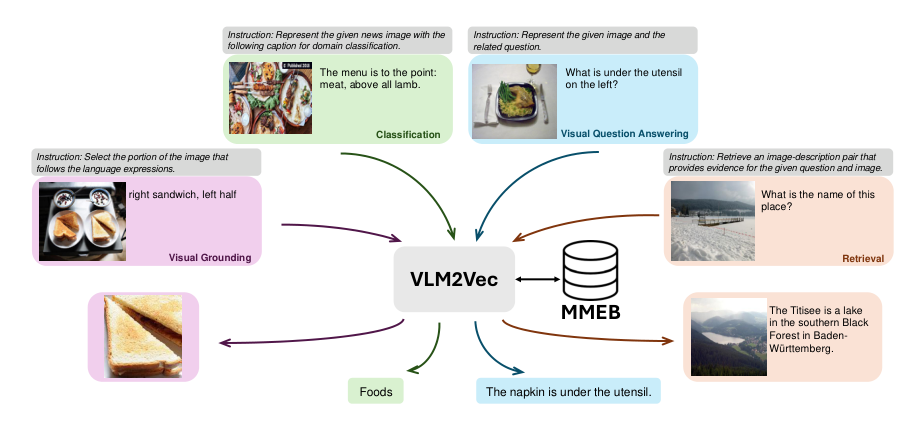
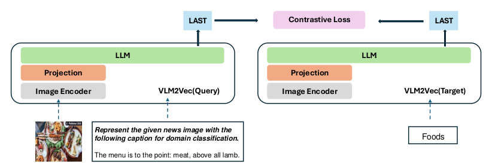
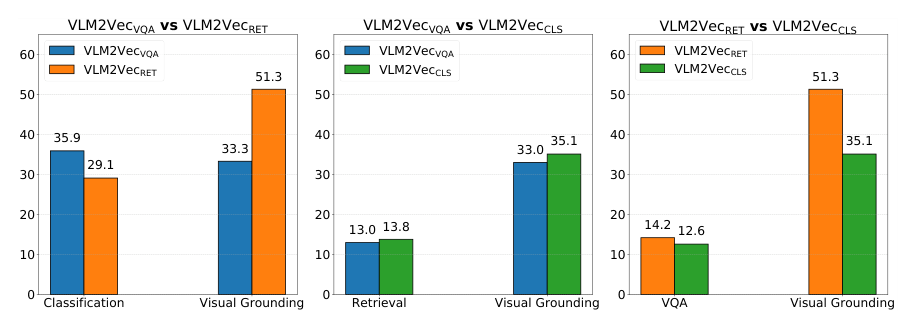

> 原文: [arXiv:2410.05160](https://arxiv.org/abs/2410.05160)
> 说明: 本文为论文全文中文技术展开，公式/图表编号与原文一致；图片自 PDF 抽取（放在 `figs/`），caption 中译；数值与关键 benchmark 名原样保留。

**预印本信息：** arXiv:2410.05160v3 [cs.CV]，v1 于 2024 年 10 月发布，v3 于 2025 年 1 月更新。

**开源：** 项目主页 [tiger-ai-lab.github.io/VLM2Vec](https://tiger-ai-lab.github.io/VLM2Vec/) （代码、模型 checkpoint、MMEB 数据集均已公开）。

**作者：** Ziyan Jiang¹\*、Rui Meng²、Xinyi Yang²、Semih Yavuz²、Yingbo Zhou²、Wenhu Chen¹

**单位：** ¹University of Waterloo，²Salesforce Research

**联系邮箱：** ziyanjiang528@gmail.com、ruimeng@salesforce.com、wenhuchen@uwaterloo.ca

\* 在 Waterloo 大学实习期间与 Salesforce Research 合作完成；Ziyan Jiang、Rui Meng、Wenhu Chen 为通讯作者。

---

# VLM2Vec：把视觉-语言模型训练成大规模多模态嵌入器（Training Vision-Language Models for Massive Multimodal Embedding Tasks）

## 摘要（Abstract）

嵌入模型（embedding model）在语义相似、信息检索、聚类等下游任务中扮演基础角色。近年围绕**通用文本嵌入**（如 MTEB 上的 E5、SFR-Embedding、NV-Embed）已有快速进展，但**多模态嵌入**的通用化明显滞后：既缺覆盖面足够的基准，也缺能把图文深度融合的建模范式。本文的两项贡献补齐这块空缺：

1. **MMEB（Massive Multimodal Embedding Benchmark）**——覆盖 **4 类元任务**（classification、visual question answering、multimodal retrieval、visual grounding）与 **36 个数据集**，其中 **20 个用于训练（in-distribution, IND）**、**16 个纯做评测（out-of-distribution, OOD）**。所有任务重构成"排序（ranking）"形式：给定 instruction + query，从 1000 个 candidate 中挑正确 target。
2. **VLM2Vec（Vision-Language Model → Vector）**——一个把**任意 VLM 转成嵌入模型**的对比训练框架。以 Phi-3.5-V、LLaVA-1.6 作为 backbone，在 MMEB 训练集上做 contrastive 微调。与 CLIP / BLIP 这种双塔独立编码不同，VLM2Vec 让**图与文在同一个 Transformer 里深度融合**，并显式接受任务 instruction。

在 MMEB 36 个数据集上，VLM2Vec **相对最强无微调基线** 提升 18.2 个点（44.7 → 62.9），**相对最强有微调基线** 提升 15.7 个点；即使只看 16 个 OOD 数据集，也分别领先 15.4 / 14.0 个点。作者的结论直白：**VLM 其实是被藏起来的强嵌入器**。

---

## 1 引言（Introduction）

**背景**：从 Word2Vec / GloVe 起，文本嵌入被广泛应用于语义相似、检索、RAG、in-context learning 中的 prompt 检索等。CLIP、BLIP、ALIGN、CoCa 让"图文共嵌入"成为主流。近来的**通用文本嵌入**范式——由 MTEB (Muennighoff et al., 2023) 推动、E5 / InstructOR / SFR-Embedding / NV-Embed 等实现——证明"一个模型 + 若干 instruction"就能跨检索、分类、聚类、STS 等 56 任务通吃。

**多模态却明显滞后**。两个具体问题：

1. **评测碎片化**：多模态嵌入常只在 ImageNet 单点分类、MSCOCO / Flickr 单点检索上被评，缺一个跨任务、跨模态组合的综合基准。
2. **建模浅**：CLIP / BLIP / SigLIP 都是**文本塔与图像塔分别编码**再拼分数，或用非常浅的融合层。UniIR、MagicLens 也是在 CLIP 之上做 score-level / attention-level 融合。这样的**shallow fusion** 拿不住复杂的图文交互，做 VQA-style 检索或需要 reasoning 的复合查询就吃力。

**VLM2Vec 的选择**：直接把已经把图文深度融合训练过的 **VLM** 拿来做 embedding backbone。VLM 天然的三点好处：

- 能吃**任意图/文组合**（多图、高分辨率、长文本都行）；
- **图文特征在 Transformer 内部深度融合**，跨模态关系可捕获得更细；
- **善于跟指令**——多模态嵌入本来就需要不同任务给不同 instruction。

作者在 Phi-3.5-V、LLaVA-1.6 上做**对比训练 + LoRA / 全量微调**，得到 VLM2Vec。评测在 MMEB 上做全套。结果如上文摘要所述：**IND 66.5 / OOD 52.0 / 全 36 任务 60-63**，一致超过 CLIP / OpenCLIP / SigLIP / BLIP2 / UniIR / MagicLens / E5-V。另外，在 Flickr30K 零样本图文检索上，VLM2Vec 也与 EVA-02-CLIP-L / MagicLens-L 打平甚至更好（见附录 Table 11），说明"当通用嵌入器"没有牺牲它做经典 T2I / I2T 检索的能力。

**图 1（原文 Figure 1）：** 展示 MMEB 4 类元任务在 VLM2Vec 里的运行形态。每张 query 都由 `instruction + 图像 + 可选文本` 组成，target 侧则是从 1000 个 candidate 中选正确项，candidate 也可以是图 / 文 / 图文对：

- **Classification（新闻图像域分类）**：instruction "Represent the given news image with the following caption for domain classification"；query 图 + caption "The menu is to the point: meat, above all lamb."；target = 类别文本 `Foods`；
- **Visual Question Answering**：instruction "Represent the given image and the related question"；query 图 + 问题 "What is under the utensil on the left?"；target = 答案文本 `The napkin is under the utensil`；
- **Visual Grounding**：instruction "Select the portion of the image that follows the language expressions"；query 图 + refer 短语 "right sandwich, left half"；target = 相应 cropped 图像；
- **Retrieval**：instruction "Retrieve an image-description pair that provides evidence for the given question and image"；query 图 + 问题 "What is the name of this place?"；target = 一对 (Wikipedia 图, 描述文本)——如 Titisee 图 + 湖泊描述。

四类任务共享同一个模型、同一个 embedding 空间，只靠**不同 instruction** 区分——这也是 VLM2Vec 相较 CLIP 家族最本质的差别。

---

## 2 MMEB：多模态嵌入基准（A Benchmark for Multimodal Embeddings）

### 2.1 数据集总览

MMEB 一共 **36 个数据集**，按元任务分成 **4 组**，按分布分成 **20 个 IND（可用于训练）+ 16 个 OOD（仅评测，用于 zero-shot 泛化）**。所有任务被统一改写成**排序（ranking）**问题：

- **query = instruction + 内容**，内容可以是文本、图，或图文；
- **candidate 集**：**1 个正例 + 999 个 distractor**，共 1000 个；
- **度量**：**Precision@1**——把 embedding 点积最高的 candidate 当预测，取 top-1 是否命中。

选 1000 个 candidate 的理由：太少会让 benchmark 快速饱和，太多推理开销高、迭代慢。附录 A.2 的 Table 5 显示：candidate 从 100 → 5000 时，VLM2Vec 整体得分从 **76.6 → 49.5** 单调下降；1000 处于"够难但不至于跑不动"的甜蜜点。

MMEB 的多样性体现在：领域覆盖 common / news / Wikipedia / web / fashion；模态组合覆盖 T→I、I→T、I+T→I、I+T→I+T、I→I 等；instruction 语义覆盖识别、检索、grounding、reasoning。

**表 1（MMEB 数据集统计）：** 20 IND + 16 OOD（表中 OOD 列打 ✓），每个 dataset 都给出训练/评测样本数与 candidate 集大小。

| 元任务 | Dataset | Query | Target | OOD? | #Training | #Eval | #Candidates |
| :--- | :--- | :--- | :--- | :---: | ---: | ---: | ---: |
| Classification (10) | ImageNet-1K | I | T | | 100K | 1000 | 1000 |
|  | N24News | I+T | I | | 49K | 1000 | 24 |
|  | HatefulMemes | I | T | | 8K | 1000 | 2 |
|  | VOC2007 | I | T | | 8K | 1000 | 20 |
|  | SUN397 | I | T | | 20K | 1000 | 397 |
|  | Place365 | I | T | ✓ | – | 1000 | 365 |
|  | ImageNet-A | I | T | ✓ | – | 1000 | 1000 |
|  | ImageNet-R | I | T | ✓ | – | 1000 | 200 |
|  | ObjectNet | I | T | ✓ | – | 1000 | 313 |
|  | Country-211 | I | T | ✓ | – | 1000 | 211 |
| VQA (10) | OK-VQA / A-OKVQA / DocVQA / InfographicVQA / ChartQA / Visual7W | I+T | T | | 9K–70K | 1000 | 1000 |
|  | ScienceQA / VizWiz / GQA / TextVQA | I+T | T | ✓ | – | 1000 | 1000 |
| Retrieval (12) | VisDial | T | I | | 123K | 1000 | 1000 |
|  | CIRR | I+T | I | | 26K | 1000 | 1000 |
|  | VisualNews t2i / i2t | T↔I |  | | 100K | 1000 | 1000 |
|  | MSCOCO t2i / i2t | T↔I |  | | 100–113K | 1000 | 1000 |
|  | NIGHTS | I | I | | 16K | 1000 | 1000 |
|  | WebQA | T | I+T | | 17K | 1000 | 1000 |
|  | OVEN / FashionIQ / EDIS / Wiki-SS-NQ | 混合 | 混合 | ✓ | – | 1000 | 1000 |
| Visual Grounding (4) | MSCOCO | I+T | I | | 100K | 1000 | 1000 |
|  | Visual7W-Pointing / RefCOCO / RefCOCO-Matching | I+T | I(+T) | ✓ | – | 1000 | 1000 |

**图 2（原文 Figure 2）：** MMEB 的一张彩色版任务地图。四个象限对应 Classification / VQA / Retrieval / Visual Grounding；**蓝色**表示 20 个 IND 训练集（如 ImageNet-1K、OK-VQA、VisDial、MSCOCO grounding 等），**橙色**表示 16 个 OOD 评测集（如 Place365、ImageNet-A/R、ObjectNet、Country-211、ScienceQA、VizWiz、GQA、TextVQA、OVEN、FashionIQ、EDIS、Wiki-SS-NQ、Visual7W-Pointing、RefCOCO、RefCOCO-Matching）。IND 与 OOD 之间**尽量避免主题重叠**——例如 Classification 里 ImageNet-1K/N24News/SUN397/VOC2007/HatefulMemes 训练、Place365/ImageNet-A/R/ObjectNet/Country-211 只评测；Retrieval 里 VisDial/CIRR/VisualNews/MSCOCO/NIGHTS/WebQA 训练、OVEN/FashionIQ/EDIS/Wiki-SS-NQ 只评测——真正衡量的是"迁移到未见任务"的能力。

### 2.2 元任务与数据集设计

**分类（Classification, 10 个）**：query = instruction + 图（可能带描述文本），target = 类别标签文本，candidate 数 = 类别数（HatefulMemes 只有 2 类，SUN397 有 397 类，ImageNet-1K 有 1000 类）。子集覆盖对象识别（ImageNet 系列、ObjectNet、VOC2007）、场景（SUN397、Place365）、新闻主题（N24News）、地理（Country-211）、恶意 meme（HatefulMemes）。

**视觉问答（VQA, 10 个）**：query = instruction + 图 + 自然语言问题，target = 答案文本；每 query 配 1 正 + 999 干扰。为了统一成 retrieval 形式，答案候选池从整个 dataset 汇总——不是让模型自由生成而是让 embedding 匹配正确答案。子集覆盖世界知识（OK-VQA、A-OKVQA）、文档阅读（DocVQA、InfographicVQA、TextVQA）、图表（ChartQA）、科学题（ScienceQA）、真实盲人拍摄（VizWiz）、场景图推理（GQA）、七 W 结构（Visual7W-telling）。

**信息检索（Retrieval, 12 个）**：query 与 target 侧都可能是文本、图或图文对；这是 MMEB 里模态组合最丰富的一类。VisDial（10 轮对话 → 检索图）、CIRR / FashionIQ（图 + 修改描述 → 目标图，即 composed image retrieval）、VisualNews / MSCOCO 的 t2i / i2t 双向、WebQA（问题 → Wikipedia 图-段落对）、NIGHTS（图 → 语义相似图，来自 DreamSim 人类判断）、OVEN（图 + 问题 → Wikipedia 图-描述）、EDIS（新闻 caption → 新闻图 + headline）、Wiki-SS-NQ（问题 → Wikipedia **页面截图**，一种新颖的 "screenshot as document" 形式）。

**视觉 grounding（Visual Grounding, 4 个）**：从目标检测改写来。query = instruction + 全图 + 目标短语（"红苹果"、refer expression、"左边三明治"），candidate = 若干**cropped 区域图**（1 个正 bbox + 999 个 hard-negative bbox；hard negative 混入同类目标、同图其他对象、异图随机对象）。子集：MSCOCO（类别名 grounding）、Visual7W-Pointing（问答式 grounding）、RefCOCO（refer expression → bbox）、RefCOCO-Matching（两图 + 两个 refer expression 是否指同一物）。

四类任务共用同一份 embedding + 点积检索协议——模型输出的向量必须**同时**能对齐 (图, 类别文本)、(图+问题, 答案文本)、(图+改写描述, 图)、(图+短语, cropped 图)。这就是"通用多模态嵌入"这个词的具体含义。

---

## 3 VLM2Vec：把 VLM 变成嵌入器（Transforming VLMs to Embedders）

### 3.1 对比训练（Contrastive training）

设一个正样本对 $(q, t^+)$，其中 $q = (q_t, q_i)$、$t^+ = (t_t^+, t_i^+)$——各自可以是纯文本、纯图或图文组合。为了让模型学会区分任务，每条 query 前拼一段 instruction，形成新的 $q_{\text{inst}}$：

$$q_{\text{inst}} = [\text{IMAGE\_TOKEN}]\ \text{Instruct: \{task definition\}} \setminus n\ \text{Query: \{q\}} \tag{1}$$

"{task definition}"是一句话对该任务的描述，直接对应表 7-10 中的任务模板（如"Represent the given news image with the following caption for domain classification."、"Represent the given image with the following question."、"Find a news image that matches the provided caption."、"Select the portion of the image that follows the language expressions."）。这些 instruction 显式暴露给模型，是 MMEB / VLM2Vec 与 CLIP-style"直接送 raw caption"最大的差别。

**取嵌入的方法**：把 $q_{\text{inst}}$、$t^+$ 各喂进 pretrained VLM，取最后一层**最后一个 token（last-token pooling）**的向量作为 $h_{q_{\text{inst}}}$、$h_{t^+}$——这是 decoder-only LLM 上最省事、且实证跟 mean pooling / EOS pooling 差不多的取法。

**训练目标**：标准 InfoNCE，负样本来自 in-batch 与 hard negatives 之和 $\mathcal{N}$：

$$\min\ \mathcal{L} = -\log \frac{\phi(h_{q_{\text{inst}}}, h_{t^+})}{\phi(h_{q_{\text{inst}}}, h_{t^+}) + \sum_{t^- \in \mathcal{N}} \phi(h_{q_{\text{inst}}}, h_{t^-})} \tag{2}$$

其中 $\phi(h_q, h_t) = \exp\!\left(\dfrac{1}{\tau} \cos(h_q, h_t)\right)$，$\tau$ 是温度超参（论文取 0.02）。

**图 3（原文 Figure 3）：** VLM2Vec 的整体架构。**左右两条 stream** 分别为 query 侧与 target 侧，共享**同一个 VLM 参数**（Image Encoder + Projection + LLM）。示例任务：新闻域分类——query = instruction "Represent the given news image with the following caption for domain classification" + 图 + caption "The menu is to the point: meat, above all lamb."；target = 类别标签 "Foods"。两侧各自跑一遍 VLM，取**最后一个 token（图中标 LAST）**的隐状态作为向量。两向量间用 InfoNCE 对比损失训练。整个模型是 **single-tower / shared-parameters** 结构——不像 CLIP 那样双塔各自训——因此 query 与 target 的 embedding 天然在同一空间。**任何图 / 文 / 图文组合都能作为 query 或 target**，模型不需要为不同模态组合切换分支。

### 3.2 用 GradCache 放大 batch（Increasing Batch Size through GradCache）

多模态嵌入训练里，**hard negative** 通常很难自动挖到（尤其跨模态任务），因此**in-batch negative** 就是主要负样本来源——batch 越大、随机负样本越丰富，对比信号越强。但多模态样本一进 GPU 就吃掉大量显存（1 张图 + 若干 token，甚至 query/target 各 1 张图），batch size 会被显存卡死。

作者用 **GradCache**（Gao et al., 2021a）把对比损失与 encoder 前反传解耦。核心思路：**先对每个 sub-batch 算出 representation 的梯度并缓存，再分小块做 encoder 反传**——这样 encoder 反传的显存占用只跟 sub-batch 有关，与总 batch 无关。

数学上，把大 batch $Q$ 切成能放进显存的子集 $\{\hat{Q}_1, \hat{Q}_2, \ldots\}$：

1. **表征梯度计算与缓存**：对每个 sub-batch，先跑 forward 得到 $f(q_i)$，用 InfoNCE 计算 $u_i = \partial \mathcal{L} / \partial f(q_i)$ 并保存；这一步不做 encoder 反传。
2. **子 batch 梯度累积**：分别对每个 sub-batch 再跑一次 forward，配合缓存 $u_i$ 通过链式规则累加 encoder 参数的梯度：

$$\frac{\partial \mathcal{L}}{\partial \Theta} = \sum_{\hat{Q}_j \in Q}\ \sum_{q_i \in \hat{Q}_j} \frac{\partial \mathcal{L}}{\partial f(q_i)}\ \frac{\partial f(q_i)}{\partial \Theta} = \sum_{\hat{Q}_j \in Q}\ \sum_{q_i \in \hat{Q}_j} u_i\ \frac{\partial f(q_i)}{\partial \Theta} \tag{3}$$

具体到实验：sub-batch = 4，累积到**总 batch = 1024**——用 8 张 H100 就能跑通全量微调。GradCache 是本文超过其他基线的关键工程手段之一（见 §4.3.2）。

---

## 4 实验（Experiments）

**训练设置**：backbone 选 **Phi-3.5-V** 或 **LLaVA-1.6**；训练方式 = **LoRA (rank 8)** 或**全量微调**；温度 $\tau = 0.02$；batch = 1024；max text length = 256；training steps = 2K；Phi-3.5-V 的 sub-image crops = 4；LLaVA-1.6 分两档 resolution：低（336×336）与高（1344×1344）。20 个 IND 训练集里，每个若超 50K 就随机采样到 50K，最终共 **662K** 训练样本。GradCache sub-batch = 4，累积至 1024。硬件 = 8× H100。

所有报告数值为 **Precision@1**（表 2、表 3、表 4、表 6）。

### 4.1 Baselines

四类基线：

- **CLIP 家族**：CLIP、OpenCLIP、SigLIP、BLIP2——文本侧长度受限，超长 query 会被截断；多模态融合用 score-level 相加（$w_1 = w_2 = 1$）；这些模型**不吃 instruction**（加了反而降分，见 §4.3.4）。
- **UniIR**（Wei et al., 2023）：instruction-guided 多模态检索器，在 CLIP 与 BLIP 上做 score-level / feature-level fusion，训练在 M-BEIR 的 8 类任务上。本文报告 CLIP SF 与 BLIP FF 两个变体。
- **MagicLens**（Zhang et al., 2024）：dual-encoder + multi-head attention pooler，自监督图检索，backbone 用 CLIP-Large。
- **E5-V**（Jiang et al., 2024）：与 VLM2Vec 同期工作，也拿 VLM 做嵌入，但**只在文本对上训练**（single-modality training）。

作者还额外**微调**了 CLIP、OpenCLIP 到 MMEB 训练集（CLIP-FFT、OpenCLIP-FFT），保证公平比较。UniIR / MagicLens / E5-V 的架构或训练目标不匹配 MMEB，作者未再做 fine-tune。

### 4.2 主结果

**表 2：MMEB 主结果（Precision@1，元任务分数为该类内平均）。IND = 20 训练集，OOD = 16 评测集。**

| 模型 | Classification | VQA | Retrieval | Grounding | IND | OOD | Overall |
| :--- | ---: | ---: | ---: | ---: | ---: | ---: | ---: |
| **无微调基线** | | | | | | | |
| CLIP | 42.8 | 9.1 | 53.0 | 51.8 | 37.1 | 38.7 | 37.8 |
| BLIP2 | 27.0 | 4.2 | 33.9 | 47.0 | 25.3 | 25.1 | 25.2 |
| SigLIP | 40.3 | 8.4 | 31.6 | 59.5 | 32.3 | 38.0 | 34.8 |
| OpenCLIP | 47.8 | 10.9 | 52.3 | 53.3 | 39.3 | 40.2 | 39.7 |
| UniIR (BLIP FF) | 42.1 | 15.0 | 60.1 | 62.2 | 44.7 | 40.4 | 42.8 |
| UniIR (CLIP SF) | 44.3 | 16.2 | 61.8 | 65.3 | 47.1 | 41.7 | **44.7** |
| E5-V | 21.8 | 4.9 | 11.5 | 19.0 | 14.9 | 11.5 | 13.3 |
| MagicLens | 38.8 | 8.3 | 35.4 | 26.0 | 31.0 | 23.7 | 27.8 |
| **有微调基线（在 MMEB 训练）** | | | | | | | |
| CLIP-FFT | 55.2 | 19.7 | 53.2 | 62.2 | 47.6 | 42.8 | 45.4 |
| OpenCLIP-FFT | 56.0 | 21.9 | 55.4 | 64.1 | 50.5 | 43.1 | **47.2** |
| **VLM2Vec（本文）** | | | | | | | |
| Phi-3.5-V, FFT (bs=1024) | 52.8 | 50.3 | 57.8 | 72.3 | 62.8 | 47.4 | 55.9 |
| Phi-3.5-V, LoRA (bs=1024) | 54.8 | 54.9 | 62.3 | 79.5 | 66.5 | 52.0 | 60.1 |
| LLaVA-1.6, LoRA, res=336² | 54.7 | 50.3 | 56.2 | 64.0 | 61.0 | 47.5 | 55.0 |
| LLaVA-1.6, LoRA, res=1344² | **61.2** | 49.9 | **67.4** | **86.1** | **67.5** | **57.1** | **62.9** |
| Δ vs best no-FT baseline | +16.9 | +33.7 | +5.6 | +20.8 | +20.4 | +15.4 | **+18.2** |
| Δ vs best FT baseline | +5.2 | +28.0 | +12.0 | +22.0 | +17.0 | +14.0 | **+15.7** |

**关键结论**：

- 最佳配置是 **LLaVA-1.6 + LoRA + 1344² 高分辨率**：36 任务平均 **62.9**，16 OOD 平均 **57.1**——前者领先最强 no-FT 基线（UniIR CLIP SF, 44.7）**+18.2**、领先最强 FT 基线（OpenCLIP-FFT, 47.2）**+15.7**。
- VLM2Vec 在**每一个元任务**都 ≥ 50%——basline 里没有任何一个能做到这点。CLIP、SigLIP 等在 VQA 上只有 4-11%，直接说明 shallow fusion 面对"图+问题→答案"这种复合 query 是失败的；grounding 上传统 CLIP-family 也只有 50-60，与 VLM2Vec 差 20-30 个点。
- **LoRA > 全量微调**：同 backbone 下 LoRA 变体一致更好。原因在 §4.3.1 讨论。
- **LLaVA-1.6 与 Phi-3.5-V 的 OOD 分差**（57.1 vs 52.0）显示：更强 backbone + 更高分辨率对 OOD 泛化更有帮助。作者特别强调 LLaVA-1.6 的**预训练数据是透明的、与 MMEB OOD 数据集几乎无重叠**——所以强 zero-shot 分数不是"pretraining 泄漏"。

**表 6（附录，节选：每个数据集单点分数，最好版本 = LLaVA-1.6 LoRA 1344²）：**

| 数据集 | CLIP | OpenCLIP | SigLIP | UniIR | **VLM2Vec** |
| :--- | ---: | ---: | ---: | ---: | ---: |
| ImageNet-1K | 55.8 | 63.5 | 45.4 | 58.3 | **74.5** |
| N24News | 34.7 | 38.6 | 13.9 | 42.5 | **80.3** |
| VOC2007 | 50.7 | 52.4 | 64.3 | 66.2 | **91.5** |
| OK-VQA | 7.5 | 11.5 | 2.4 | 25.4 | **69.0** |
| A-OKVQA | 3.8 | 3.3 | 1.5 | 8.8 | **54.4** |
| DocVQA | 4.0 | 5.3 | 4.2 | 6.2 | **52.0** |
| ChartQA | 1.4 | 1.5 | 3.0 | 1.6 | **34.8** |
| TextVQA (OOD) | 7.0 | 10.9 | 1.0 | 15.1 | **62.0** |
| VisualNews t2i | 78.9 | 74.0 | 51.0 | 74.3 | **75.4** |
| MSCOCO t2i | 59.5 | 63.6 | 58.3 | 68.5 | **75.7** |
| WebQA | 67.5 | 62.1 | 58.1 | **89.6** | 87.6 |
| OVEN (OOD) | 41.1 | 45.0 | 56.0 | **69.4** | 56.5 |
| Wiki-SS-NQ (OOD) | 55.0 | 44.6 | 55.1 | 12.2 | **60.2** |
| MSCOCO grounding | 33.8 | 34.5 | 46.4 | 46.6 | **80.6** |
| RefCOCO (OOD) | 56.9 | 54.2 | 70.8 | 67.8 | **88.7** |
| RefCOCO-Matching (OOD) | 61.3 | 68.3 | 50.8 | 62.9 | **84.0** |
| Visual7W-Pointing (OOD) | 55.1 | 56.3 | 70.1 | 71.3 | **90.9** |

VLM2Vec 在**几乎所有 dataset** 上都是第一（少数 UniIR 强项：WebQA / OVEN 里 UniIR 领先，主要因为它们在 M-BEIR 上专门训过这几个任务）；在**需要读文档 / 图表 / OCR / reasoning** 的 DocVQA、ChartQA、TextVQA、A-OKVQA 上，VLM2Vec 领先 baseline 一个量级（30-60 vs 1-15），这直接反映了 VLM backbone 相对 CLIP-style shallow fusion 的建模优势。

### 4.3 结果分析（Result Analysis）

#### 4.3.1 全量微调 vs LoRA

**表 3**（同 backbone Phi-3.5-V、batch=256、其他不变）：

| 方式 | Cls | VQA | Retr | Grd | IND | OOD | Overall |
| :--- | ---: | ---: | ---: | ---: | ---: | ---: | ---: |
| Full FT | 50.4 | 46.4 | 52.6 | 68.6 | 57.9 | 44.7 | 52.0 |
| LoRA r=4 | 52.7 | 53.6 | 60.1 | 80.2 | 64.9 | 50.4 | **58.4** |
| LoRA r=8 | 52.9 | 52.5 | 60.3 | 80.0 | 64.2 | 50.8 | 58.2 |
| LoRA r=16 | 51.1 | 40.5 | 52.0 | 72.5 | 54.9 | 45.8 | 50.8 |
| LoRA r=32 | 50.6 | 47.8 | 53.9 | 72.5 | 58.9 | 46.5 | 53.4 |

**LoRA r=4 / r=8 > 全量微调 > LoRA r=16/32**。作者的解读：MMEB 训练集只有 662K 样本，相对 VLM backbone 的容量偏小；全量微调容易过拟合、破坏 backbone 里已经学到的通用图文对齐；LoRA 用低秩扰动**保留了 backbone 大部分表征**，因此在**IND 与 OOD 上都更好**。rank 过大（16/32）则退化——大约因为等价于"半全量微调"，重新引入了过拟合风险。

#### 4.3.2 训练参数

**图 4（原文 Figure 4）：** 三张折线图，横轴分别为 batch size（200→1000）、training steps（2K→8K）、Phi-3.5-V 的 sub-image crops 数量（5→17），纵轴统一为 MMEB 上的整体 Precision@1（%）。三者都在增大时**单调提升**——batch=200 到 1000 从约 50% 涨到 56%；step 从 2K 涨到 8K 提升约 5 个点；crops 从 5 涨到 17 也带来约 6 个点。

**中文解释**：三者的作用机制各不同。**batch size** 影响 in-batch negative 数量——负样本越多，对比学习信号越锐；这也是作者引入 GradCache 的直接动因（§3.2）。**step size** 决定模型见过多少梯度更新——662K 样本、bs=1024 大概只够 ~650 步 epoch，2K-8K step 相当于跑 3-12 个 epoch。**crop 数**决定 Phi-3.5-V 内部处理高分辨率的能力：sub-image crop 越多，模型看到的空间细节越丰富，对 DocVQA / TextVQA / grounding 特别有帮助。**batch size 提升的边际收益最大**——这跟对比学习界的普遍经验一致，也解释了为什么 CLIP 家族要用极大 batch。

#### 4.3.3 元任务泛化（Meta-task generalization）

作者训了三个"单元任务"模型：**VLM2Vec_RET**（仅在 8 个检索任务上训）、**VLM2Vec_VQA**（仅在 6 个 VQA 任务上训）、**VLM2Vec_CLS**（仅在 5 个分类任务上训）。然后跨元任务评测。visual grounding 训练集只 1 个，未做单元任务模型。

**图 5（原文 Figure 5）：** 三个子图，两两对比 VLM2Vec_VQA / RET / CLS 在**未见元任务**上的分数（Phi-3.5-V backbone）：

- 左图 **VQA vs RET → Classification / Grounding**：VQA 训得的模型在 Classification 得 35.9、Grounding 33.3；RET 训得的模型 Classification 29.1、Grounding **51.3**——RET 在 grounding 上明显更强。
- 中图 **VQA vs CLS → Retrieval / Grounding**：VQA 训得的模型 Retrieval 13.0、Grounding 33.0；CLS 训得的模型 Retrieval 13.8、Grounding 35.1——两者差不多。
- 右图 **RET vs CLS → VQA / Grounding**：RET 训得的模型 VQA 14.2、Grounding **51.3**；CLS 训得的模型 VQA 12.6、Grounding 35.1——RET 再次领先 grounding。

**结论**：**只用 retrieval 训练的模型泛化最强**，尤其对 grounding。原因是 retrieval 元任务的 query/target 模态组合最丰富（T→I、I→T、I+T→I、I→I、T→I+T 都有），迫使模型学到跨模态、双向映射的通用表征。反过来，纯分类或纯 VQA 的 target 主要是短标签 / 短答案文本，泛化能力受限。**训练时把任务多样性拉满**是通用嵌入器的关键——这跟 MTEB 上文本嵌入的经验一致。

#### 4.3.4 Instruction 的影响

**表 4**（Phi-3.5-V 全量微调，bs=256）：

| 模型 | 设置 | Cls | VQA | Retr | Grd | IND | OOD | Overall |
| :--- | :--- | ---: | ---: | ---: | ---: | ---: | ---: | ---: |
| CLIP | w/o inst | 42.8 | 9.1 | 53.0 | 51.8 | 37.1 | 38.7 | 37.8 |
| CLIP | w/ inst | 17.4 | 8.0 | 41.3 | 52.9 | 23.8 | 30.3 | 26.7 |
| **Δ** |  | −59.3% | −12.1% | −22.1% | +2.1% | −35.8% | −21.7% | **−29.4%** |
| VLM2Vec | w/o inst | 36.7 | 33.5 | 31.1 | 44.3 | 37.3 | 31.6 | 34.8 |
| VLM2Vec | w/ inst | 50.4 | 46.4 | 52.6 | 68.6 | 57.9 | 44.7 | 52.0 |
| **Δ** |  | +37.3% | +38.5% | +69.1% | +54.9% | +55.2% | +41.5% | **+49.4%** |

**Instruction 对 CLIP 是负担、对 VLM2Vec 是燃料**：CLIP 加上 instruction 掉 29.4%（因为 CLIP 从没学过 instruction 语义，反而把 instruction token 混进 sentence embedding 里稀释了信号）；VLM2Vec 加 instruction 涨 49.4%——VLM backbone 天生擅长 instruction following，且训练时也是带 instruction 训的，这是 MMEB / VLM2Vec 设计的一致性收益。

---

## 5 相关工作（Related Work）

**5.1 文本嵌入**：从 SimCSE、GTR、E5 的弱监督预训练，到 TART / InstructOR 引入自然语言 instruction，再到 E5-Mistral、SFR-Embedding、RepLLaMA、GTE-Qwen2、NV-Embed 用 LLM 做 backbone + 多任务 instruction tuning——**decoder-only LLM 做嵌入**已经成主流范式，本文将其顺势推广到多模态。

**5.2 多模态嵌入**：CLIP、BLIP、ALIGN、SigLIP、SimVLM、CoCa 以弱监督图文对做**双塔预训练**，是 VLM 时代的地基。基于此，UniIR 用相加融合、MagicLens 用浅 attention 做 fusion，本质仍是 shallow fusion。同期工作 **E5-V** 也想让 VLM 做嵌入，但只在**文本对上训练**——VLM2Vec 的差异是**训练在包含图和文本任意组合的多模态对上**，充分利用 VLM 内部的深度融合能力。

**5.3 嵌入基准**：文本侧 MS MARCO / Natural Questions / BEIR / MTEB 都成熟。多模态侧 **M-BEIR** 覆盖 8 任务 16 数据集，但仍主要是检索。MMEB 首次把**分类 + VQA + 检索 + grounding**都统一成同一个 ranking 框架，且明确 IND / OOD 划分——这是本文的基准贡献。

---

## 6 结论（Conclusion）

本文提出 **MMEB**（4 元任务 36 数据集，20 IND + 16 OOD）——第一个大规模、多元任务的多模态嵌入评测基准；并提出 **VLM2Vec**——把任意 VLM 通过对比学习 + instruction 转成通用嵌入器的框架。VLM2Vec 在 MMEB 上相较最强基线 **+15-18 个点**，OOD 上 **+14-15 个点**，四类元任务分数都 ≥ 50%，同时在 Flickr30K 传统零样本检索上仍具竞争力。**VLM 本身就是被隐藏的强嵌入器**——只要给对训练数据和 instruction 范式，就能取代 CLIP 家族成为多模态检索/嵌入的新范式。

---

## 附录 A（Appendix A: Details of MMEB）

**A.1 数据集细节**：36 个数据集按 4 类元任务分小节列出来源、数据规模、任务改写方式。核心数据集简述如下：

- **Classification**：ImageNet-1K/A/R（1000 类原始 / 自然对抗 / 分布外风格化）、ObjectNet（313 类，专门做 anti-shortcut 分类）、VOC2007（20 类）、SUN397（397 场景）、Place365（365 场景）、Country-211（211 国家 GPS 定位）、N24News（NYT 24 类新闻）、HatefulMemes（二元 meme 分类）。
- **VQA**：OK-VQA / A-OKVQA（世界/常识知识）、DocVQA / InfographicVQA / ChartQA（文档、图表、信息图）、TextVQA（图内文本 OCR + reasoning）、ScienceQA（多学科）、Visual7W-telling（六 W 问题）、VizWiz（盲人拍照真实场景）、GQA（scene graph 组合推理）。
- **Retrieval**：VisDial（对话→图）、CIRR / FashionIQ（图+修改描述→图，composed image retrieval）、VisualNews / MSCOCO 的 t2i/i2t 双向、WebQA（多跳多模态问答→Wikipedia 图-段落对）、NIGHTS（DreamSim 人类相似判断）、OVEN（Wikipedia 实体识别）、EDIS（实体丰富的新闻图检索）、Wiki-SS-NQ（问题→Wikipedia **页面截图**）。CIRR / FashionIQ / VisualNews / MSCOCO / WebQA / NIGHTS / OVEN / EDIS 使用 M-BEIR 的处理版本。
- **Visual Grounding**：MSCOCO 检测改写（图 + 类别名 → cropped bbox）、Visual7W-Pointing（问题式 grounding）、RefCOCO（refer 表达式 → bbox）、RefCOCO-Matching（两图 + 两表达式判是否指同一物）。

**A.2 candidate 数量选择**：表 5 显示 candidate 从 100 → 5000 时 VLM2Vec 整体分从 76.6 → 49.5 单调下降；100 太简单（Grounding 已经 89.6，接近饱和）；5000 又太贵。**1000** 是难度、成本、可迭代性的平衡点。

**其他附录亮点**：

- 表 7-10 列出所有 36 个数据集在 MMEB 里的 **query text / query image / target text / target image** 具体范例——研究者可以直接照着 instruction 模板复现。
- 表 11 给出 **Flickr30K 零样本 T2I / I2T 检索** 结果：VLM2Vec T2I R@1 = 80.3、I2T R@1 = 94.6，均超过 EVA-02-CLIP-L (77.3 / 89.7)、MagicLens-L (79.7 / 89.6)——证明"当通用嵌入器"不牺牲传统跨模态检索。

---

## 翻译约定

- **保留原文缩写**：CLIP、BLIP、BLIP2、SigLIP、OpenCLIP、CoCa、E5-V、E5、SFR-Embedding、RepLLaMA、NV-Embed、GTE-Qwen2、Gecko、GTR、MTEB、M-BEIR、UniIR、MagicLens、InstructOR、TART、LLaVA、Phi-3.5-V、LoRA、GradCache、InfoNCE。
- **技术术语中文**：embedding = 嵌入 / 嵌入向量；contrastive learning = 对比学习；in-batch negative = 批内负样本；hard negative = 难负样本；instruction / instruction-following = 指令 / 指令跟随；backbone = 骨干模型；pooling = 池化；last-token pooling = 末位 token 池化；in-distribution (IND) = 域内 / 分布内；out-of-distribution (OOD) = 域外 / 分布外；grounding = 视觉定位；refer expression = 指代表达；composed image retrieval = 组合图像检索；shallow fusion / deep fusion = 浅层融合 / 深度融合；ranking = 排序；candidate = 候选 / 候选池。
- **数据集与 benchmark 名**：一律**保留英文原名**（ImageNet-1K、MMEB、MSCOCO、Flickr30K、RefCOCO、VisDial 等）。
- **公式与数值原样保留**；表格数据不改动，仅表头/说明部分中译。
