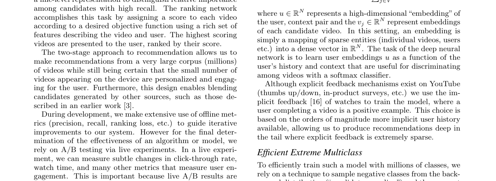
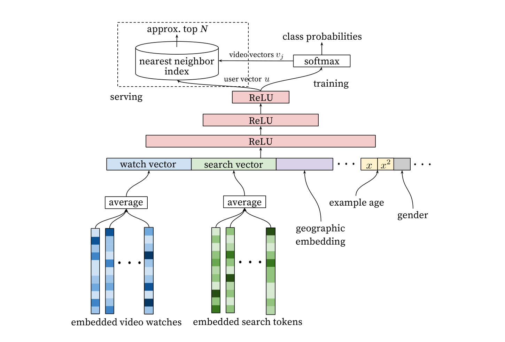
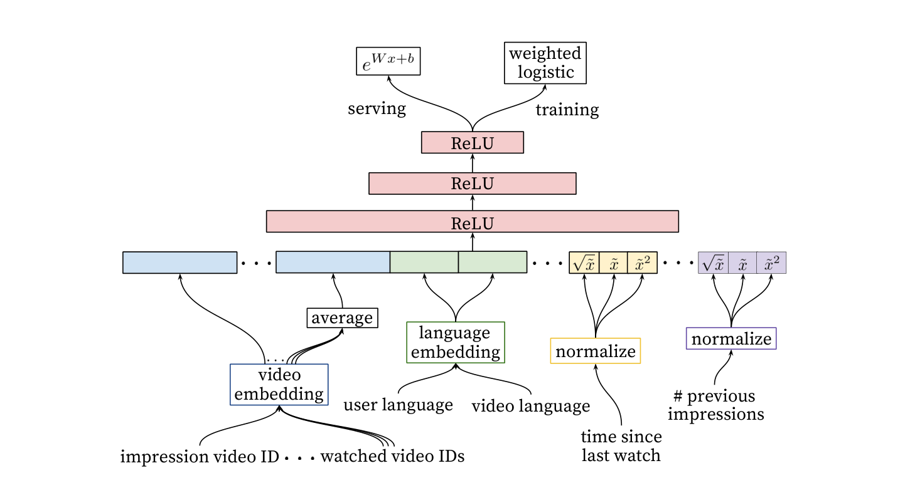

# YouTube DNN 双塔详解

> paper: Covington, Adams, Sargin. *Deep Neural Networks for YouTube Recommendations*. RecSys 2016. [ACM](https://dl.acm.org/doi/10.1145/2959100.2959190) · [Google Research](https://research.google/pubs/pub45530/)
> blog / 解读: 工业界把此文当 **Two-Tower 召回** 的开山讲义（与 Embedding 文献里的 Bi-Encoder 同构、负采样不同）
> backbone: 深度 MLP；视频 / 搜索 token 先 embedding 再平均
> date: 2016
> modality: 推荐（user 特征 → video ID）
> languages: 与语言无关（ID + 行为序列）

> 主文 §7.3 已点过「推荐 Dual-Tower 与 Bi-Encoder 同构」。本文把 **候选生成 vs 精排、sampled softmax、曝光分布、example age** 写全，并对照文搜图双塔。领域课表见《[领域专用 Embedding 适配实践](../领域专用Embedding适配实践.md)》。

---

## 一句话定位

YouTube 推荐被拆成 **候选生成（从百万级视频里捞百来条）+ 排序（用更富特征打分）** 两段深度网络。候选生成就是现在说的 **Two-Tower**：user 塔输出 $u$，item 向量 $v_j$ 当 softmax 权重；线上用 ANN 近邻代替全量 softmax。它和 DPR / CLIP 的差别不在「是不是双塔」，而在 **正例是观看、负例是从全库（近似）采样而不是「曝光未点击」这么简单**。

| 项 | 内容 |
| --- | --- |
| 问题 | 亿级用户 × 百万级视频，全库 Cross 不可行 |
| 召回 | user 向量对 video embedding 做近邻 |
| 排序 | 另一支 MLP，交叉特征更多，输出观看概率 |
| 和文本 IR 的差别 | 正例=观看（隐式），负例要处理极度曝光偏差 |

---

## 系统拆分

上图是论文 Figure 2：左边 candidate generation 必须极便宜（双塔 + ANN），右边 ranking 只在数百候选上跑。Embedding 文献里只训一个 Bi-Encoder 就上线，等于把精排也省了——在推荐和文搜图里通常不够。

---

## 候选生成 = 双塔召回

### 架构

User 侧把行为变成向量：

- 观看过的 video ID embedding **平均** → watch vector
- 搜索 token embedding **平均** → search vector
- 地理、性别、**example age**（样本新鲜度）等 dense 特征

拼起来进三层 ReLU MLP，最后一层就是 user 向量 $u$。Video 侧在训练时是 softmax 分类的类权重 $v_j$；存下来就是 item embedding。

训练目标：预测用户下一次观看的 video，百万类 **sampled softmax**（或层次 softmax，论文讨论过）。Serving 时 $u$ 去近邻索引查 $v_j$，取 Top-N。

上图是论文 Figure 3。注意训练和服务的不对称：训练要归一化的分类损失，服务只保留点积近邻。这和 CLIP / 检索双塔「训练 InfoNCE、服务余弦/点积」完全一样。

### 负采样（和文本 IR 不同的地方）

文本检索常用：in-batch 其他 doc、BM25 hard、ANN hard。推荐里还有一层 **曝光偏差**：

- 「没点」≠「不喜欢」：没曝光、或看了标题没点。
- 若只拿「曝光未点击」当负例，模型会学成「专打热门坑位」，对从未曝光的长尾无梯度。
- YouTube 文的候选生成更接近 **从全视频词表做分类**（随机/重要性采样负类），让模型学会在全库里把下一次观看挑出来。排序阶段才用更细的曝光上下文。

主文说「点击为正、曝光未点击为负，假负例更严重」——那句话主要针对**排序塔**和部分现代双塔召回；读 2016 原文时要把 **候选生成的全库分类** 和 **排序的曝光特征** 分开，不要合成一句。

### Example age

把「这个训练样本有多老」当作特征喂进网络。推荐强依赖新鲜度：训练分布里的爆款过几天就不是爆款。没有 age 特征，模型会把「当时热」记成「永远相关」。文搜图若有季节款、上新，同样需要时间特征或按时间切训练窗。

---

## 排序塔

排序模型仍是 MLP，但特征交叉更狠：候选视频 embedding、用户语言 vs 视频语言、已看过的主题等。损失是 logistic（点 / 不点、或观看时长派生标签）。只在候选生成给出的几百条上跑，所以用得起更宽的交叉。

上图是论文 Figure 7。对 Embedding 读者：你的「Rerank Cross-Encoder」就是这一层的文本/图文版；不要指望召回塔单独把 Precision 做到业务线。

---

## 与 Bi-Encoder / CLIP 对照

| | YouTube 候选生成 | 文本 DPR | CLIP 文搜图 |
| --- | --- | --- | --- |
| Query 塔 | 用户行为 MLP | 文本 encoder | 文本 encoder |
| Item 塔 | video embedding | 文档 encoder | 图像 encoder |
| 正例 | 下次观看 | 相关段落 | 图文对 / 点击图 |
| 负例 | 全库采样 softmax | in-batch / hard | in-batch 其他图 |
| 服务 | ANN | ANN | ANN |
| 额外 | example age、平均池化历史 | instruct 前缀 | 分辨率 / 增强 |

同构结论：**会训检索双塔，就会训推荐召回塔。** 领域差异几乎全在正负例定义和特征，不在网络形状。

---

## 可迁移实践

1. 召回 / 精排拆开，延迟预算分别算。
2. 用户（或 query）塔必须能吃 **序列**；只 encode 当前一句 query 会丢掉会话。文搜图若有「刚才看过的图」，应进 query 侧。
3. 负例策略按阶段选：召回偏全库；精排才能认真用曝光未点击，并处理假负。
4. 新鲜度、季节、上新用特征或时间切分显式建模。
5. 冷启动：新 item 没有观看正例时，YouTube 靠内容侧（标题、元数据）进 embedding——文搜图新商品应对齐标题文本塔，而不是等点击。
